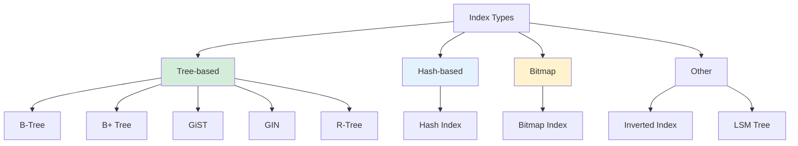
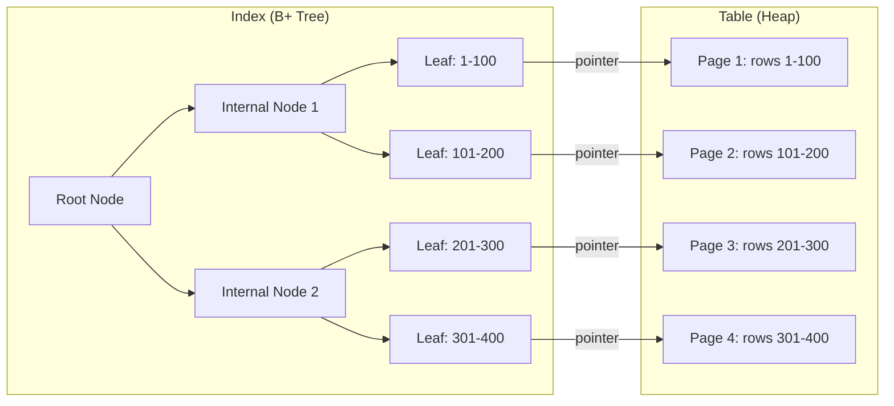

# Indexing Overview

## What is an Index?

An index is a **data structure that improves the speed of data retrieval** operations on a database table at the cost of additional storage space and write overhead. Think of it like a book's index — instead of reading every page to find a topic, you look up the topic in the index and go directly to the right page.

## Why Indexes Matter

```
Without index (Full Table Scan):
  Table: 1 million rows
  Query: SELECT * FROM users WHERE email = 'alice@example.com'
  Process: Check every row → O(n) = 1,000,000 comparisons

With index on email:
  Index: B+ Tree on email column
  Query: Same query
  Process: Traverse tree → O(log n) ≈ 20 comparisons
```

## The Trade-off

```
Reads:  ✓ Much faster (O(log n) vs O(n))
Writes: ✗ Slower (must update index + table)
Storage: ✗ More space (index structure + pointers)
```

## Types of Indexes

| Index Type | Best For | Structure |
|---|---|---|
| [B-Tree](./b-tree.md) | General purpose, range queries | Balanced tree |
| [B+ Tree](./b-plus-tree.md) | Range queries, disk-based | Linked leaf nodes |
| [Hash Index](./hash-index.md) | Exact lookups | Hash table |
| [Bitmap Index](./bitmap-index.md) | Low-cardinality columns | Bit arrays |
| [GiST](./gist.md) | Geometric, full-text, custom types | Balanced tree with custom predicates |
| [GIN](./gin.md) | Multi-valued data (arrays, JSON) | Inverted index |

## Index Classification

### By Structure



### By Coverage

- **Clustered vs Non-Clustered**: Whether the index determines physical row order
- **Covering Index**: Index contains all columns needed by a query
- **Composite Index**: Index on multiple columns

### By Uniqueness

- **Unique Index**: Enforces uniqueness constraint (e.g., primary key)
- **Non-Unique Index**: Allows duplicate values

## How Indexes Work

### Without Index

```
Table: users (1M rows)
Query: SELECT * FROM users WHERE id = 500000

Execution: Sequential scan
  Read page 1 → not found
  Read page 2 → not found
  ...
  Read page N → found!
  
Cost: O(n) page reads
```

### With Index

```
Table: users (1M rows) + B+ Tree index on id
Query: SELECT * FROM users WHERE id = 500000

Execution: Index scan
  Traverse B+ Tree: root → internal → leaf
  Leaf node contains pointer to row
  Read one data page
  
Cost: O(log n) index pages + 1 data page
```

## Index Selection: What to Index

### Good Candidates

- Columns in `WHERE` clauses
- Columns in `JOIN` conditions
- Columns in `ORDER BY` / `GROUP BY`
- Columns with high selectivity (many unique values)
- Foreign key columns

### Poor Candidates

- Small tables (full scan is fast anyway)
- Columns rarely used in queries
- Columns with very low selectivity (e.g., boolean)
- Columns frequently updated (index maintenance overhead)

## Mermaid Diagram: Index and Table Relationship



## Index Operations

### Create Index

```sql
-- Basic index
CREATE INDEX idx_users_email ON users(email);

-- Unique index
CREATE UNIQUE INDEX idx_users_email ON users(email);

-- Composite index
CREATE INDEX idx_users_name_age ON users(last_name, first_name, age);

-- Partial index (PostgreSQL)
CREATE INDEX idx_active_users ON users(email) WHERE active = true;

-- Concurrently (without locking table)
CREATE INDEX CONCURRENTLY idx_users_email ON users(email);
```

### Drop Index

```sql
DROP INDEX idx_users_email;
```

### Analyze Index

```sql
-- PostgreSQL: Update statistics
ANALYZE users;

-- Show index usage
EXPLAIN ANALYZE SELECT * FROM users WHERE email = 'alice@example.com';
```

## Index Maintenance

### Rebuilding Indexes

Over time, indexes can become fragmented:

```sql
-- PostgreSQL: Rebuild index
REINDEX INDEX idx_users_email;

-- MySQL: Optimize table (rebuilds indexes)
OPTIMIZE TABLE users;
```

### Monitoring Index Usage

```sql
-- PostgreSQL: Find unused indexes
SELECT schemaname, tablename, indexname, idx_scan
FROM pg_stat_user_indexes
WHERE idx_scan = 0
ORDER BY pg_relation_size(indexrelid) DESC;
```

## Cost-Based Optimization and Indexes

The query optimizer uses **cost-based optimization** to decide whether to use an index:

```
Cost factors:
  - Sequential scan: ~1.0 per page (sequential I/O)
  - Random access (index): ~4.0 per page (random I/O)
  - Index selectivity: fraction of rows returned
  - Table size: number of pages

Optimizer decision:
  If (index_cost < seq_scan_cost):
    Use index
  Else:
    Full table scan
```

For a query returning 30% of rows, a full scan may be cheaper than index scan (many random reads).

## Interview Questions

### Beginner

**Q1: What is a database index?**
A: An index is a data structure that speeds up data retrieval by providing quick lookup paths to rows in a table, similar to a book's index. It trades storage space and write speed for faster reads.

**Q2: When should you create an index?**
A: On columns frequently used in WHERE clauses, JOIN conditions, ORDER BY, and GROUP BY. Also on columns with high selectivity (many unique values) and foreign keys.

**Q3: What is the downside of indexes?**
A: Indexes consume storage space and slow down write operations (INSERT, UPDATE, DELETE) because the index must be updated along with the table.

### Intermediate

**Q4: What is index selectivity and why does it matter?**
A: Selectivity is the fraction of rows a query returns (unique values / total rows). High selectivity means the index is very effective (returns few rows). Low selectivity means the index may not be used (returns many rows — full scan is cheaper).

**Q5: What is the difference between clustered and non-clustered indexes?**
A: A clustered index determines the physical order of data in the table (only one per table). A non-clustered index is a separate structure with pointers to the data rows (multiple per table).

**Q6: How does the optimizer decide whether to use an index?**
A: The optimizer estimates the cost of using the index vs a full table scan. Factors include: number of rows to retrieve, index depth, I/O costs, and selectivity. For queries returning >10-30% of rows, a full scan is often cheaper.

### Advanced / FAANG-Level

**Q7: You have a table with 100M rows. A query filters on column A (selectivity 0.1%) and column B (selectivity 50%). What index would you create?**
A: Create a composite index on (A, B) or just an index on A. Column A has much higher selectivity (0.1% = very selective). An index on A alone would return ~100K rows, which can then be filtered by B in memory. A composite index on (A, B) would be even better if the query always filters on both.

**Q8: How do indexes interact with MVCC?**
A: In PostgreSQL, indexes point to heap tuples. When a row is updated, a new tuple version is created. If indexed columns change, new index entries are created (old entries cleaned by VACUUM). HOT updates (Heap-Only Tuples) avoid index updates when non-indexed columns change.

**Q9: Design an indexing strategy for a social media feed query: "Get the 20 most recent posts from users I follow."**
A: (1) Composite index on (user_id, created_at DESC) on the posts table. (2) The query joins follows + posts, so index follows on (follower_id) for fast lookup of who I follow. (3) For each followed user, use the posts index to get recent posts efficiently. (4) Consider a materialized view or cache for the feed to avoid repeated joins.

## Common Mistakes

1. **Over-indexing** — Too many indexes slow down writes and consume storage. Only index columns that improve query performance.

2. **Not analyzing after index creation** — The optimizer needs updated statistics to use indexes effectively. Run ANALYZE after creating indexes.

3. **Indexing low-cardinality columns** — Boolean or status columns with few distinct values rarely benefit from indexes. The optimizer may prefer a full scan.

4. **Ignoring composite index order** — In a composite index on (A, B), the index can satisfy queries on A alone but not on B alone.

5. **Not considering covering indexes** — If an index contains all columns needed by a query, the database can answer the query from the index alone (index-only scan).

## Summary

| Aspect | Detail |
|---|---|
| Purpose | Speed up data retrieval |
| Trade-off | Faster reads, slower writes, more storage |
| Types | B-Tree, B+ Tree, Hash, Bitmap, GiST, GIN |
| Selection | High-selectivity columns in WHERE/JOIN/ORDER BY |
| Maintenance | Monitor usage, rebuild when fragmented |

## Index Type Pages

- [B-Tree Index](./b-tree.md)
- [B+ Tree Index](./b-plus-tree.md)
- [Hash Index](./hash-index.md)
- [Bitmap Index](./bitmap-index.md)
- [GiST Index](./gist.md)
- [GIN Index](./gin.md)
- [Index Tuning](./tuning.md)
- [Clustered vs Non-Clustered](./clustered-vs-nonclustered.md)
- [Covering Index](./covering-index.md)
- [Composite Index](./composite-index.md)

## Cross-References

- [B+ Tree](./b-plus-tree.md) — The most common index structure
- [MVCC](../transactions/mvcc.md) — How indexes interact with MVCC
- [ARIES](../transactions/aries.md) — Index recovery
- [Query Optimization](../internals/query-optimization.md) — How optimizer uses indexes
