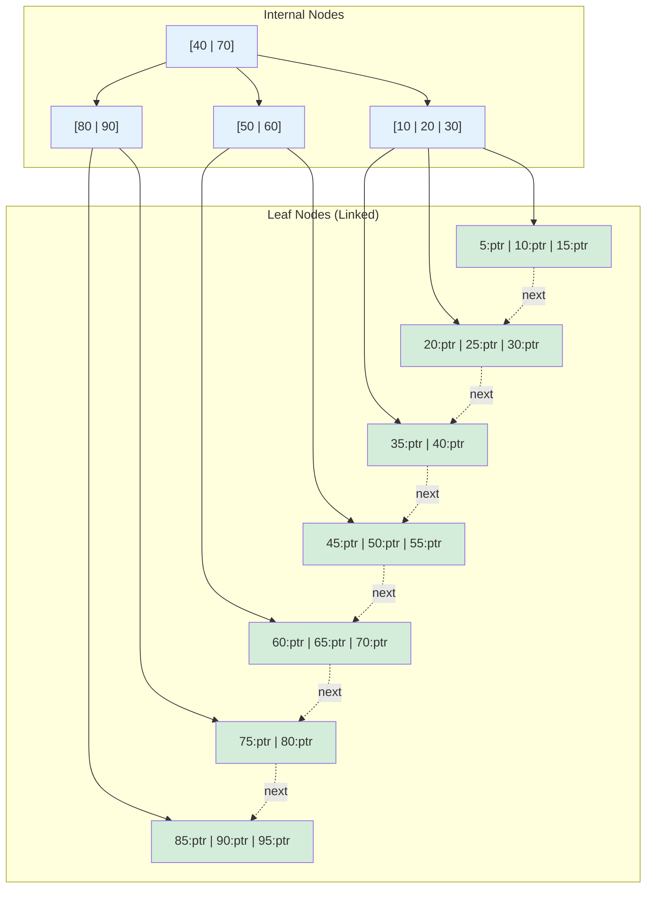
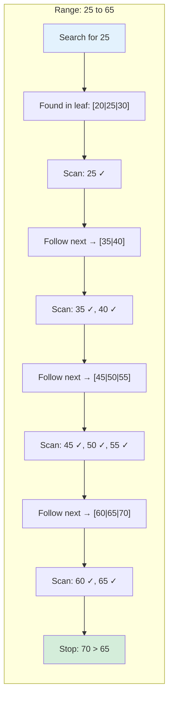

# B+ Tree Index

## Overview

The B+ Tree is the **most widely used index structure** in relational databases. It's a variant of the B-Tree optimized for disk-based storage and range queries. MySQL InnoDB, PostgreSQL, Oracle, and SQL Server all use B+ Trees as their primary index structure.

Key differences from B-Tree:
- **Data only in leaf nodes** (internal nodes only hold keys for routing)
- **Leaves are linked** (forming a sorted linked list for range queries)
- **All leaves at the same level** (guaranteed balance)

## Structure

### Internal Nodes

Internal nodes contain **keys and pointers to children**. They do NOT contain data records.

```
Internal Node: [K1 | K2 | K3]
  Pointer P0: subtree with keys < K1
  Pointer P1: subtree with K1 <= keys < K2
  Pointer P2: subtree with K2 <= keys < K3
  Pointer P3: subtree with keys >= K3
```

### Leaf Nodes

Leaf nodes contain **keys and pointers to data records** (or the data itself). Leaves are linked together.

```
Leaf Node: [K1:ptr1 | K2:ptr2 | K3:ptr3]
  → next leaf pointer
  Each ptr points to a record in the table (or contains the data)
```

### Mermaid Diagram: B+ Tree Structure



## Properties

| Property | Value |
|---|---|
| Order (m) | Max children per internal node |
| Min keys (internal) | ⌈m/2⌉ |
| Min keys (leaf) | ⌈(m-1)/2⌉ |
| Max keys (leaf) | m-1 |
| Height | O(log_m n) |
| Search | O(log_m n) disk I/Os |
| Range query | O(log_m n + k) where k = result size |
| Insert | O(log_m n) |
| Delete | O(log_m n) |

## Operations

### Point Query (Search)

```
Search(key):
  1. Start at root
  2. At each internal node:
     - Find the child pointer for the key's range
     - Follow the pointer to the next level
  3. At leaf node:
     - Search for the key
     - Return the data pointer

Time: O(log_m n) disk reads
```

### Range Query

This is where B+ Trees shine. The leaf chain allows efficient scanning of ranges.

```
RangeQuery(low, high):
  1. Search for low key → find starting leaf
  2. Scan leaf nodes following next pointers
  3. Continue until key > high

Time: O(log_m n) for initial seek + O(k/m) for scanning
  where k = number of records in range
```

### Mermaid Diagram: Range Query



### Insertion

```
Insert(key):
  1. Find appropriate leaf node L
  2. Insert key into L in sorted order
  3. If L overflows:
     a. Split L into L1 and L2
     b. Copy middle key up to parent (not move — key stays in leaf)
     c. Update leaf chain pointers
     d. If parent overflows, split parent recursively
     e. If root splits, create new root
```

### Key Difference: Copy Up vs Push Up

In B+ Trees, when splitting a leaf, the middle key is **copied up** to the parent (the key remains in the leaf). In B-Trees, the middle key is **pushed up** (moved out of the leaf).

```
B+ Tree leaf split (insert 25 into [10, 20, 30, 40]):
  Before: [10, 20, 30, 40]
  After insert: [10, 20, 25, 30, 40]
  Split: [10, 20] | 25 | [25, 30, 40]
  Copy 25 up to parent
  Leaf still contains 25

B-Tree leaf split (same scenario):
  Push 25 up to parent
  Leaf no longer contains 25
```

### Deletion

```
Delete(key):
  1. Find key in leaf node L
  2. Remove key from L
  3. If L underflows:
     a. Try to borrow from sibling (redistribute keys)
     b. If sibling also minimal, merge with sibling
     c. Remove corresponding key from parent
     d. If parent underflows, rebalance recursively
```

## Comparison: B+ Tree vs Other Structures

| Aspect | B+ Tree | Hash Index | LSM Tree |
|---|---|---|---|
| Point query | O(log n) | O(1) avg | O(log n) |
| Range query | O(log n + k) | O(n) | O(log n + k) |
| Insert | O(log n) | O(1) avg | O(1) amortized |
| Disk I/O | Sequential for range | Random | Sequential |
| Use case | OLTP + OLAP | Exact lookups | Write-heavy |

## Disk Page Optimization

### Fill Factor

The fill factor determines what percentage of each page is filled with data:

```
Fill factor 100%: Pages fully packed
  - Pros: Maximum space utilization
  - Cons: Immediate splits on insert

Fill factor 70%: Pages 70% full
  - Pros: Room for inserts without splitting
  - Cons: Wastes 30% space

PostgreSQL: CREATE INDEX ... WITH (fillfactor = 70);
```

### Prefix Compression

For indexes with long, similar keys (e.g., URLs), prefix compression stores only the distinguishing prefix:

```
Without compression:
  "https://www.example.com/page1"
  "https://www.example.com/page2"
  "https://www.example.com/page3"

With prefix compression:
  "https://www.example.com/page" (common prefix stored once)
  "1" (suffix)
  "2" (suffix)
  "3" (suffix)
```

## PostgreSQL B+ Tree Implementation

PostgreSQL's B-Tree index implementation (which is actually a B+ Tree):

```sql
-- Create B-Tree index (default)
CREATE INDEX idx_users_email ON users(email);

-- With specific options
CREATE INDEX idx_users_email ON users(email)
  WITH (fillfactor = 90, deduplicate_items = on);

-- Check index structure
SELECT * FROM bt_metap('idx_users_email');
SELECT * FROM bt_page_stats('idx_users_email', 1);
```

### Deduplication (PostgreSQL 13+)

PostgreSQL 13 introduced B-Tree deduplication, which merges duplicate keys into a single posting list:

```
Before deduplication:
  Key "alice" → [(page1, tuple1), (page2, tuple3), (page5, tuple2)]

After deduplication:
  Key "alice" → posting list [(1,1), (2,3), (5,2)]
  (Compressed representation)
```

## Interview Questions

### Beginner

**Q1: What is a B+ Tree?**
A: A B+ Tree is a balanced tree where data records are stored only in leaf nodes, and internal nodes contain only keys for routing. Leaf nodes are linked together for efficient range queries.

**Q2: How is a B+ Tree different from a B-Tree?**
A: In a B+ Tree, data is only in leaves (internal nodes are routing-only), and leaves are linked. In a B-Tree, data is in all nodes and leaves aren't linked. B+ Trees are better for range queries and disk-based storage.

**Q3: Why are B+ Trees good for range queries?**
A: Because leaf nodes are linked in a sorted chain. Once you find the starting point, you can scan sequentially through the leaves without going back up the tree.

### Intermediate

**Q4: What is the difference between "copy up" and "push up" during a B+ Tree split?**
A: Copy up: the middle key is copied to the parent but remains in the leaf. Push up: the middle key is moved to the parent and removed from the leaf. B+ Trees use copy up; B-Trees use push up.

**Q5: What is the height of a B+ Tree with 1 billion records and order 100?**
A: h = ⌈log_100(1,000,000,000)⌉ = ⌈4.5⌉ = 5. This means at most 5 disk reads for any lookup.

**Q6: How does PostgreSQL handle duplicate keys in B+ Tree indexes?**
A: PostgreSQL uses posting lists — multiple row pointers for the same key are stored together. Since version 13, deduplication merges these into a compressed posting list, significantly reducing space for low-cardinality columns.

### Advanced / FAANG-Level

**Q7: Design a B+ Tree that supports both forward and backward range scans.**
A: Maintain doubly-linked leaf nodes (both next and prev pointers). During splits and merges, update both pointers. PostgreSQL's B-Tree implementation supports this — you can scan in both directions using the leaf chain.

**Q8: A B+ Tree index on a timestamp column grows to 10GB. Queries are slow despite using the index. How do you optimize?**
A: (1) Check if the index is being used: EXPLAIN ANALYZE. (2) If returning many rows, consider partitioning the table by time range. (3) Use BRIN (Block Range Index) instead for naturally ordered data — much smaller. (4) Consider partial index if queries always filter by a recent time range. (5) If the index is fragmented, REINDEX.

**Q9: How would you implement a B+ Tree that handles variable-length keys efficiently?**
A: (1) Use prefix compression to store common prefixes once. (2) Use suffix truncation — store only the minimum prefix needed for routing in internal nodes. (3) Use indirect keys — store a hash or short representation in internal nodes, full key in leaf. (4) PostgreSQL uses suffix truncation since version 13, which can significantly reduce internal node sizes.

**Q10: Compare B+ Tree with LSM Tree for a database that needs both fast reads and fast writes.**
A: B+ Tree: Fast reads (O(log n)), slower writes (random I/O for updates). LSM Tree: Fast writes (sequential I/O), slower reads (multiple levels to check). For mixed workloads: (1) Use B+ Tree for read-heavy tables; (2) Use LSM for write-heavy tables (e.g., logs, time-series); (3) Consider using both — B+ Tree for primary index, LSM for secondary indexes. PostgreSQL uses B+ Trees; Cassandra/RocksDB use LSM Trees.

## B+ Tree vs B-Tree: Deep Comparison

### Structural Differences

```
B-Tree (Order 4):
         [30]
        /    \  
   [10|20]  [30|40|50]  ← Data in ALL nodes
   /  |  \   /  |  |  \ 
  D   D   D  D   D  D   D

B+ Tree (Order 4):
         [30]              ← Keys only (routing)
        /    \  
   [10|20]  [30|40]        ← Keys only (routing)
   /  |  \   /  |  \  
 [5|10] [15|20] [25|30] → [35|40] → [45|50]  ← Data + linked
```

### Why B+ Tree Wins in Practice

```
1. Higher fanout:
   B-Tree: Internal nodes store data → fewer keys per node
   B+ Tree: Internal nodes are keys-only → more keys → shorter tree

   Example (4KB page, 40-byte key, 200-byte data record):
   B-Tree: 4KB / (40+200) bytes ≈ 16 keys per node
   B+ Tree internal: 4KB / 40 bytes ≈ 100 keys per node
   B+ Tree is 6x shallower for the same data!

2. Range queries:
   B-Tree: Must traverse tree for each key in range
   B+ Tree: Find start, then scan leaf chain → sequential I/O

3. Predictable performance:
   B-Tree: All operations traverse from root to leaf
   B+ Tree: Same, but shorter tree = fewer I/Os

4. Cache friendliness:
   B+ Tree internal nodes fit more easily in memory
   Only leaf nodes need disk I/O for data access
```

### Leaf Chain Deep Dive

The leaf chain is what makes B+ Trees superior for range queries and sequential scans:

```
Leaf chain operations:

  Forward scan: Follow next pointers
    [5|10] → [15|20] → [25|30] → [35|40] → [45|50]
    Time: O(1) per leaf (sequential I/O)

  Backward scan: Follow prev pointers (doubly-linked)
    [45|50] → [35|40] → [25|30] → [15|20] → [5|10]

  Range query [15, 40]:
    1. Binary search in tree → find leaf containing 15
    2. Scan forward: [15|20] → [25|30] → [35|40]
    3. Stop when key > 40
    Total: O(log n) seek + O(k/m) scan
```

### Leaf Chain Maintenance During Splits

```
Before split (leaf [10|20|30|40] overflows with 25):
  ... → [10|20|30|40] → [50|60] → ...

Insert 25, split:
  ... → [10|20] → [25|30|40] → [50|60] → ...
            ↑ new pointers updated

Steps:
  1. Create new leaf [25|30|40]
  2. Copy keys to new leaf
  3. Update old leaf's next pointer to new leaf
  4. Set new leaf's next pointer to old leaf's former next
  5. Copy middle key (25) up to parent
```

## Real-World B+ Tree Usage

### MySQL InnoDB

```
InnoDB Clustered Index (PRIMARY KEY):
  - The table IS a B+ Tree
  - Leaf nodes contain the actual row data
  - Internal nodes contain primary key values
  - Row data is physically ordered by primary key

InnoDB Secondary Index:
  - Separate B+ Tree
  - Leaf nodes contain: index key + primary key value
  - To get full row: follow primary key lookup ("double lookup")

Example:
  CREATE TABLE users (
    id INT PRIMARY KEY,
    email VARCHAR(255) UNIQUE,
    name VARCHAR(255)
  );

  Clustered index (id): B+ Tree with full rows in leaves
  Secondary index (email): B+ Tree → leaf has [email, id]
    Query: SELECT * FROM users WHERE email = 'alice@ex.com'
    Step 1: Search email index → find id=42
    Step 2: Search clustered index with id=42 → get full row
```

### PostgreSQL B-Tree (Actually B+ Tree)

```
PostgreSQL B-Tree features:
  - Doubly-linked leaf chain (forward + backward scan)
  - Posting lists for duplicate keys
  - Deduplication (v13+): merges duplicate entries
  - Suffix truncation (v13+): shorter internal keys
  - B-link tree design: right links for concurrency

Index-only scans:
  If the index contains all columns needed by the query,
  PostgreSQL can answer from the index alone (no heap access).

  CREATE INDEX idx_covering ON orders(customer_id) INCLUDE (amount, status);
  SELECT amount, status FROM orders WHERE customer_id = 42;
  → Index-only scan (no table access needed)
```

## Common Mistakes

1. **Not understanding that B+ Trees store data only in leaves** — Internal nodes are routing structures only. This is why range queries work (scan leaves, not internal nodes).

2. **Ignoring the leaf chain** — The linked list of leaves is crucial for range queries. Without it, range queries would require traversing the tree for each key.

3. **Using wrong fill factor** — 100% fill factor causes immediate splits on random inserts. Use 70-90% for insert-heavy workloads.

4. **Not considering index-only scans** — If the index contains all columns needed, PostgreSQL can answer the query from the index alone. Design indexes to support this.

5. **Creating too many B+ Tree indexes** — Each index is a separate B+ Tree. Too many indexes slow down writes and consume storage. Choose indexes based on query patterns.

6. **Ignoring the clustered index choice** — In InnoDB, the primary key IS the clustered index. Choose it carefully: sequential (auto-increment) is better than random (UUID) for insert performance.

## Summary

| Aspect | Detail |
|---|---|
| Structure | Balanced tree, data in leaves only, linked leaves |
| Point query | O(log_m n) disk I/Os |
| Range query | O(log_m n + k) — efficient due to leaf chain |
| Insert/Delete | O(log_m n) |
| Used by | MySQL InnoDB, PostgreSQL, Oracle, SQL Server |
| Split | Copy up (not push up) |
| Key feature | Leaf chain for range queries |

## Cross-References

- [B-Tree](./b-tree.md) — The base structure B+ Tree extends
- [Hash Index](./hash-index.md) — Alternative for exact lookups
- [Clustered vs Non-Clustered](./clustered-vs-nonclustered.md) — How B+ Trees implement clustered indexes
- [Covering Index](./covering-index.md) — B+ Tree indexes that contain all needed columns
- [Composite Index](./composite-index.md) — Multi-column B+ Tree indexes
- [Index Tuning](./tuning.md) — How to optimize B+ Tree indexes


## Cross References

- [B-Tree](b-tree.md)
- [Buffer Pool](../caching/buffer-pool.md)
- [Disk Scheduling (OS)](../../os/io/disk-scheduling.md)
- [File Organization](../storage/file-organization.md)
- [SSD](../../storage/ssd.md)
