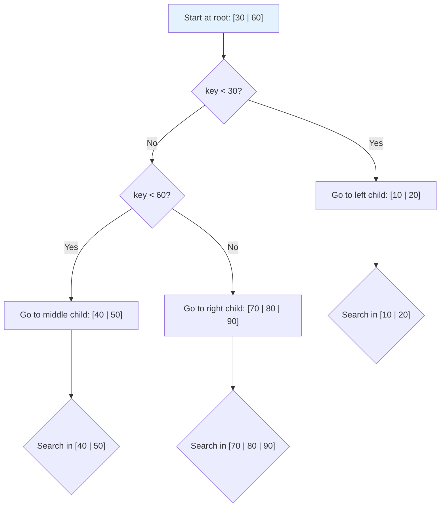
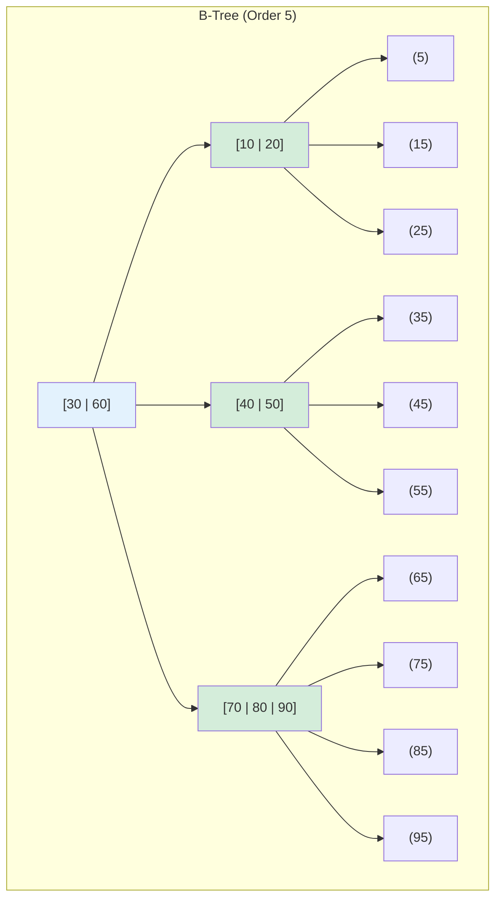

# B-Tree Index

## Overview

A B-Tree (Balanced Tree) is a **self-balancing tree data structure** that maintains sorted data and allows searches, sequential access, insertions, and deletions in **O(log n)** time. It is the foundation of most database index implementations, though B+ Tree is more commonly used in practice.

B-Trees were invented by Rudolf Bayer and Edward McCreight in 1972 at Boeing Research Labs.

## Structure

### Node Structure

Each B-Tree node contains:
- **Keys**: Sorted array of key values
- **Pointers**: To child nodes (internal) or data records (leaves)
- **n**: Number of keys currently in the node

```
B-Tree of order m (max m children per node):
  - Each node has at most m-1 keys
  - Each node has at most m children
  - Each non-root node has at least ⌈m/2⌉ - 1 keys
  - Root has at least 1 key (if not leaf)
  - All leaves are at the same level
```

### Example B-Tree (Order 5)

```
                    [30 | 60]
                   /    |    \
          [10 | 20]  [40 | 50]  [70 | 80 | 90]
         /   |   \   /   |   \   /   |   |   \
       ...  ...  ... ... ...  ... ...  ... ... ...
```

## Properties

| Property | Value |
|---|---|
| Order (m) | Maximum children per node |
| Min keys (non-root) | ⌈m/2⌉ - 1 |
| Max keys | m - 1 |
| Height | O(log_m n) |
| Search | O(log n) |
| Insert | O(log n) |
| Delete | O(log n) |
| Space | O(n) |

## Operations

### Search

```
Search(node, key):
  if node is NULL:
    return NOT FOUND
  
  for i = 0 to node.n - 1:
    if key == node.keys[i]:
      return node.pointers[i]
    if key < node.keys[i]:
      return Search(node.children[i], key)
  
  return Search(node.children[node.n], key)
```

### Mermaid Diagram: B-Tree Search



### Insertion

1. Find the appropriate leaf node
2. Insert the key in sorted order
3. If the node overflows ( > m-1 keys), **split** it

```
Insert(key):
  1. Find leaf node L where key should go
  2. Insert key into L in sorted order
  3. If L has m keys (overflow):
     a. Split L into L1 and L2
     b. Median key moves up to parent
     c. If parent overflows, split parent recursively
     d. If root splits, create new root with median
```

### Split Example

```
Before insert 25 (order 5, max 4 keys per node):
  Leaf: [10 | 20 | 30 | 40]

After insert 25 (overflow):
  Leaf: [10 | 20 | 25 | 30 | 40]  ← 5 keys, must split

Split:
  Left:  [10 | 20]
  Median: 25 → promote to parent
  Right: [30 | 40]
```

### Deletion

Deletion is more complex, with two cases:

**Case 1: Key is in a leaf**
- Remove the key
- If underflow (< ⌈m/2⌉ - 1 keys), rebalance:
  - **Borrow** from sibling (if sibling has enough keys)
  - **Merge** with sibling (if sibling is also minimal)

**Case 2: Key is in an internal node**
- Replace with **in-order predecessor** (rightmost key in left subtree) or **in-order successor** (leftmost key in right subtree)
- Delete the predecessor/successor from the leaf (Case 1)

## Mermaid Diagram: B-Tree Structure



## B-Tree vs B+ Tree

| Aspect | B-Tree | B+ Tree |
|---|---|---|
| Data in internal nodes | Yes | No (only in leaves) |
| Leaf chain | No | Yes (linked list) |
| Range queries | Requires traversal | Efficient (scan leaves) |
| Space utilization | Lower (data in all nodes) | Higher (data only in leaves) |
| Tree height | Slightly shorter | Slightly taller |
| Used by | MongoDB (some versions) | MySQL InnoDB, PostgreSQL |

## Disk I/O Analysis

For a B-Tree of order m with n records:

```
Height h ≈ ⌈log_m(n)⌉

Example:
  n = 1,000,000 records
  m = 100 (typical for 4KB pages with 40-byte keys)
  h = ⌈log_100(1,000,000)⌉ = ⌈3⌉ = 3 levels

  Search: 3 disk reads (root → internal → leaf → data)
  vs Sequential scan: up to 1,000,000 disk reads
```

## Interview Questions

### Beginner

**Q1: What is a B-Tree?**
A: A B-Tree is a self-balancing tree where each node can have multiple keys and children. All leaves are at the same level, ensuring O(log n) operations. It's used as the basis for database indexes.

**Q2: What is the order of a B-Tree?**
A: The order (m) is the maximum number of children a node can have. A node can hold at most m-1 keys. The order is typically chosen so that one node fits in a disk page (e.g., 4KB).

**Q3: How does a B-Tree handle overflow during insertion?**
A: When a node has m keys (overflow), it splits into two nodes with ⌊m/2⌋ keys each. The median key is promoted to the parent. If the parent overflows, it splits recursively.

### Intermediate

**Q4: What is the time complexity of B-Tree operations?**
A: Search, insert, and delete are all O(log n) where n is the number of keys. The base of the logarithm is the order m, so height is O(log_m n). For disk-based trees, this means O(h) disk I/Os.

**Q5: How does deletion work in a B-Tree?**
A: If the key is in a leaf, remove it and rebalance if underflow occurs (borrow from sibling or merge). If in an internal node, replace with in-order predecessor or successor, then delete from the leaf.

**Q6: Why are B-Trees good for disk-based storage?**
A: B-Trees have high branching factor (large m), keeping the tree shallow (few levels). Each level corresponds to one disk read. A B-Tree of order 100 with 1 billion records has height ~4, requiring only 4 disk reads.

### Advanced / FAANG-Level

**Q7: How would you implement a B-Tree that supports concurrent access?**
A: Use latch crabbing (lock coupling): (1) Acquire latch on parent, then child. (2) If child is safe (won't split/merge), release parent latch. (3) If child is unsafe, keep parent latch. (4) For insert: a node is safe if it has room. (5) For delete: a node is safe if it has more than minimum keys. This allows concurrent operations on different subtrees.

**Q8: A B-Tree index is severely fragmented after many random inserts and deletes. How do you fix it?**
A: (1) Rebuild the index: CREATE INDEX ... WITH (fillfactor=90) to leave space for future inserts. (2) Use REINDEX (PostgreSQL) or ALTER TABLE ... ENGINE=InnoDB (MySQL). (3) For online rebuild, use CREATE INDEX CONCURRENTLY. (4) Set appropriate fillfactor based on insert patterns (lower for random inserts, higher for sequential).

**Q9: Design a B-Tree for a write-heavy workload with random inserts.**
A: (1) Use a lower fillfactor (e.g., 70%) to leave room for inserts without immediate splits. (2) Consider using an LSM-Tree instead for write-heavy workloads. (3) If B-Tree is required, use bulk loading for initial data, then switch to random insert mode. (4) Implement buffer pool with dirty page batching to reduce disk writes.

## Detailed Algorithm: Insertion with Split

### Step-by-Step Example (Order 5, max 4 keys)

Insert keys: 10, 20, 30, 40, 50, 25

```
Step 1: Insert 10
  [10]

Step 2: Insert 20
  [10 | 20]

Step 3: Insert 30
  [10 | 20 | 30]

Step 4: Insert 40
  [10 | 20 | 30 | 40]

Step 5: Insert 50 → OVERFLOW!
  Before: [10 | 20 | 30 | 40]
  Insert: [10 | 20 | 30 | 40 | 50]  ← 5 keys (exceeds max 4)

  Split:
    Left:  [10 | 20]
    Median: 30 → promoted to new root
    Right: [40 | 50]

  Result:
          [30]
         /    \  
    [10|20]  [40|50]

Step 6: Insert 25
  Find leaf: 25 > 20, go right of [10|20] → but 25 < 30, so go to [10|20]'s right child
  Actually: 25 < 30, so go left from root to [10|20]
  25 > 20, insert at end of [10|20]
  Result: [10 | 20 | 25]

  Final tree:
          [30]
         /    \  
    [10|20|25]  [40|50]
```

### Cascading Split Example

Insert into order-3 tree (max 2 keys): 1, 2, 3, 4, 5

```
Insert 1: [1]
Insert 2: [1|2]
Insert 3: Split! → [2] with children [1] and [3]

       [2]
      /   \  
    [1]   [3]

Insert 4: [3|4] in right leaf

       [2]
      /   \  
    [1]   [3|4]

Insert 5: Right leaf overflows [3|4|5]
  Split right leaf: [3] [4] [5] → median 4
  Promote 4 to root: [2|4]

       [2|4]
      /  |  \  
    [1] [3]  [5]
```

## Detailed Algorithm: Deletion with Merge

### Case 1: Delete from Leaf (No Underflow)

```
Tree (order 5, min 2 keys per non-root node):
       [30]
      /    \  
  [10|20]  [40|50]

Delete 20:
  Remove 20 from leaf: [10]
  Keys remaining: 1 (≥ min 2? No! Underflow for non-root)
  For order 5, min keys (non-root) = ⌈5/2⌉ - 1 = 2
  [10] has 1 key → underflow!

  Rebalance:
  - Check sibling [40|50] (has 2 keys, can spare one)
  - Borrow: rotate left through parent
  - Parent 30 comes down, sibling's 40 goes up

  Result:
       [40]
      /    \  
  [10|30]  [50]
```

### Case 2: Delete from Leaf → Merge

```
Tree:
       [30]
      /    \  
  [10|20]  [40]

Delete 20:
  Remove 20: [10] → underflow (1 key, min is 2)
  Sibling [40] also has minimum (1 key) → can't borrow
  Merge: combine [10], parent key 30, and [40] → [10|30|40]

  Result:
  [10 | 30 | 40]  (single node, now root)
```

### Case 3: Delete from Internal Node

```
Tree:
       [30]
      /    \  
  [10|20]  [40|50]

Delete 30 (internal node key):
  30 is in the root. Replace with in-order predecessor (20) or successor (40).

  Using predecessor (20):
  Step 1: Find max in left subtree = 20
  Step 2: Replace 30 with 20 in root
  Step 3: Delete 20 from leaf [10|20] → [10]

  After replacement:
       [20]
      /    \  
  [10]     [40|50]

  [10] has 1 key → underflow → borrow from sibling or merge
```

## Complexity Analysis

### Time Complexity

```
Operation     │ Time Complexity │ Disk I/Os    │ Notes
──────────────┼─────────────────┼──────────────┼──────────────────────
Search        │ O(log_m n)      │ O(h)         │ h = height
Insert        │ O(log_m n)      │ O(h)         │ + possible splits up to root
Delete        │ O(log_m n)      │ O(h)         │ + possible merges up to root
Range scan    │ O(log_m n + k)  │ O(h + k/m)   │ k = result size
```

### Space Complexity

```
Total space: O(n)
Each key stored once: n keys
Each node has m-1 keys and m pointers
Number of nodes: O(n / (m-1)) ≈ O(n/m)
Space utilization: 50-100% (avg ~69% with random inserts)
```

### Height Analysis

```
For a B-Tree of order m with n keys:

Minimum height: ⌈log_m(n+1)⌉
  (when all nodes are full)

Maximum height: ⌈log_{⌈m/2⌉}((n+1)/2)⌉ + 1
  (when all nodes are minimum full)

Example (m = 100, n = 1,000,000):
  Min height: ⌈log_100(1,000,001)⌉ = ⌈3⌉ = 3
  Max height: ⌈log_50(500,001)⌉ + 1 = ⌈3.85⌉ + 1 ≈ 5

  In practice: 3-4 disk reads for any operation
  vs Binary tree: log_2(1,000,000) ≈ 20 disk reads!
```

### Why B-Trees Are Fast for Disk

```
Disk characteristics:
  - Sequential read: ~500 MB/s (SSD) or ~200 MB/s (HDD)
  - Random read: ~0.1ms (SSD) or ~10ms (HDD)
  - Page size: typically 4KB or 8KB

B-Tree node fits in one page:
  4KB page / 40 bytes per key = ~100 keys per node
  100 keys = order 100
  1 billion records → height ≈ 4
  4 random reads × 0.1ms (SSD) = 0.4ms total

Compare to binary tree:
  1 billion records → height ≈ 30
  30 random reads × 0.1ms = 3ms total (7.5x slower)
```

## B-Tree Concurrency Control

### Latch Crabbing (Lock Coupling)

```
Algorithm for concurrent B-Tree access:
  1. Acquire latch on parent node
  2. Acquire latch on child node
  3. If child is "safe" (won't split/merge):
     Release parent latch
  4. If child is "unsafe":
     Keep parent latch (crab down)

Safe for insert: node has room (keys < m-1)
Safe for delete: node has more than minimum keys

This allows concurrent operations on different subtrees
while preventing structural conflicts.
```

### B-Link Trees (Lehman & Yao)

```
Enhancement for higher concurrency:
  - Each node has a "high key" (maximum key in subtree)
  - Each node has a "right link" to its sibling
  - If a search overshoots (key > high key), follow right link
  - Allows searches to proceed even during splits
  - Used by PostgreSQL's B-Tree implementation
```

## Common Mistakes

1. **Confusing B-Tree with B+ Tree** — B-Trees store data in all nodes; B+ Trees store data only in leaves. Most databases use B+ Trees.

2. **Not considering disk page size** — The order m should be chosen so a node fits in one disk page. Too small = too many levels; too large = wasted space.

3. **Ignoring fillfactor** — A 100% fillfactor means no room for inserts, causing immediate splits. Use 70-90% depending on workload.

4. **Deleting without rebalancing** — Underflow must be handled to maintain the B-Tree properties. Ignoring it breaks the balance guarantee.

5. **Not understanding amortized cost** — While individual splits/merges are O(log n), the amortized cost of insertions is O(1) splits per insert.

## Summary

| Aspect | Detail |
|---|---|
| Structure | Balanced tree with multiple keys per node |
| Operations | Search, Insert, Delete: O(log n) |
| Order m | Max children per node |
| Height | O(log_m n) |
| Split | On overflow, promote median to parent |
| Merge | On underflow, borrow from sibling or merge |

## Cross-References

- [B+ Tree](./b-plus-tree.md) — The variant used by most databases
- [Hash Index](./hash-index.md) — Alternative for exact lookups
- [Clustered vs Non-Clustered](./clustered-vs-nonclustered.md) — How B-Trees are used as clustered indexes
- [Index Tuning](./tuning.md) — How to choose and maintain B-Tree indexes


## Cross References

- [B+ Tree](b-plus-tree.md)
- [Cache Hierarchy](../../arch/memory-hierarchy/cache-basics.md)
- [Disk Scheduling (OS)](../../os/io/disk-scheduling.md)
- [File Organization](../storage/file-organization.md)
