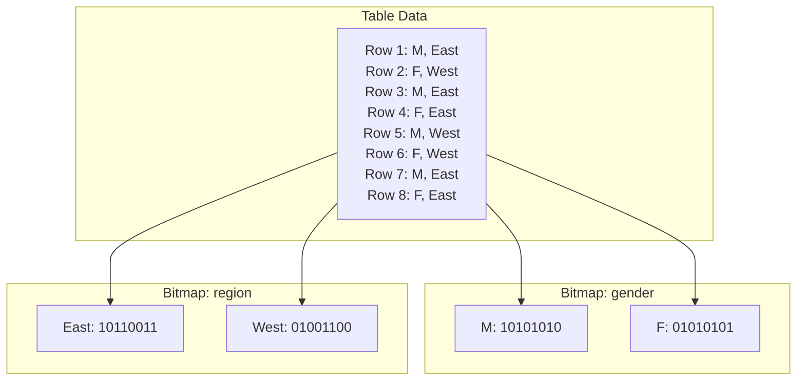
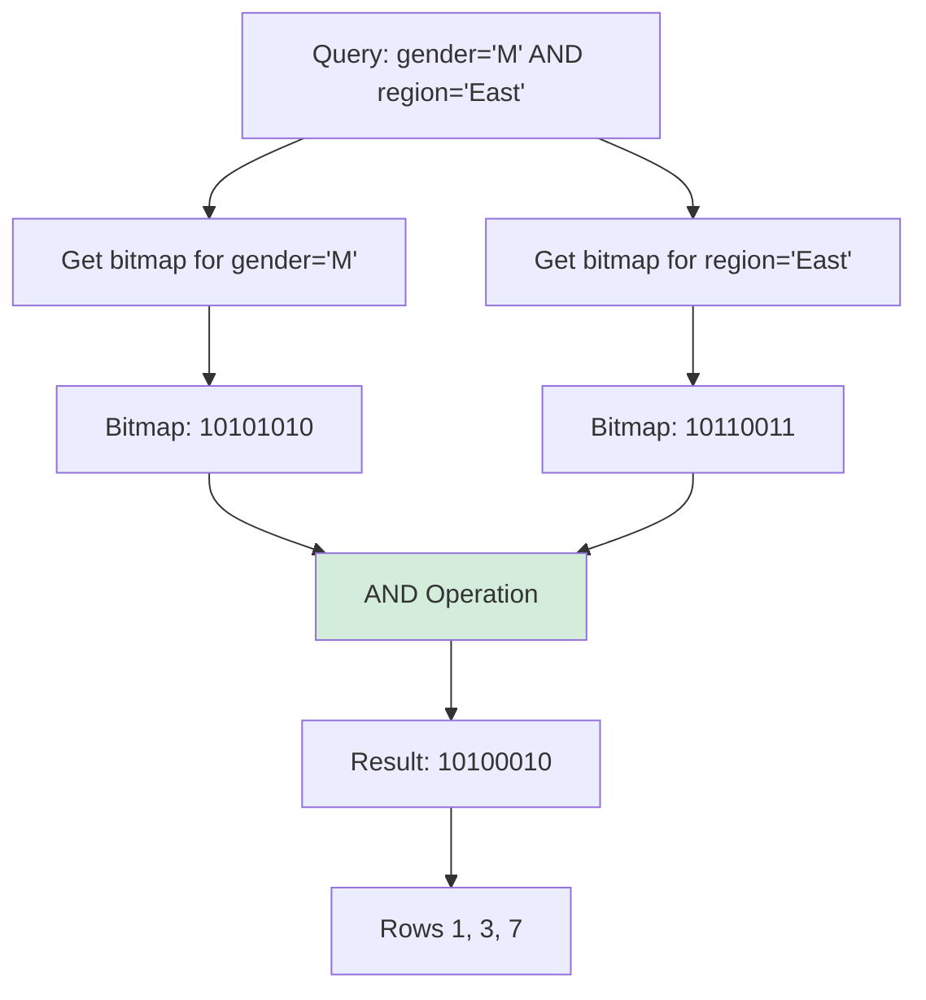

# Bitmap Index

## Overview

A bitmap index uses **bit arrays (bitmaps)** to efficiently answer queries on columns with **low cardinality** (few distinct values). Each distinct value gets its own bitmap, where each bit represents whether a row has that value.

Bitmap indexes are extremely efficient for queries involving multiple conditions combined with AND/OR/NOT, as these operations reduce to fast bitwise operations.

## Structure

### Basic Structure

For a column with k distinct values, a bitmap index creates k bitmaps, each of length n (number of rows):

```
Table: employees (8 rows)
+----+--------+--------+
| id | gender | region |
+----+--------+--------+
|  1 | M      | East   |
|  2 | F      | West   |
|  3 | M      | East   |
|  4 | F      | East   |
|  5 | M      | West   |
|  6 | F      | West   |
|  7 | M      | East   |
|  8 | F      | East   |
+----+--------+--------+

Bitmap index on gender:
  M: [1, 0, 1, 0, 1, 0, 1, 0]
  F: [0, 1, 0, 1, 0, 1, 0, 1]

Bitmap index on region:
  East: [1, 0, 1, 1, 0, 0, 1, 1]
  West: [0, 1, 0, 0, 1, 1, 0, 0]
```

### Mermaid Diagram: Bitmap Index Structure



## Operations

### Query Evaluation with Bitwise Operations

Bitmap indexes shine when combining multiple conditions:

```
Query: SELECT * FROM employees WHERE gender = 'M' AND region = 'East'

Step 1: Get bitmaps
  gender='M':  [1, 0, 1, 0, 1, 0, 1, 0]
  region='East': [1, 0, 1, 1, 0, 0, 1, 1]

Step 2: AND operation
  Result:       [1, 0, 1, 0, 0, 0, 1, 0]

Step 3: Convert to row IDs
  Rows 1, 3, 7 match
```

### OR Operation

```
Query: SELECT * FROM employees WHERE gender = 'M' OR region = 'West'

  gender='M':   [1, 0, 1, 0, 1, 0, 1, 0]
  region='West': [0, 1, 0, 0, 1, 1, 0, 0]
  
  OR result:     [1, 1, 1, 0, 1, 1, 1, 0]
  
  Rows 1, 2, 3, 5, 6, 7 match
```

### NOT Operation

```
Query: SELECT * FROM employees WHERE NOT (gender = 'M')

  gender='M':    [1, 0, 1, 0, 1, 0, 1, 0]
  NOT result:    [0, 1, 0, 1, 0, 1, 0, 1]
  
  Rows 2, 4, 6, 8 match
```

## Bitmap Compression

### Run-Length Encoding (RLE)

For columns with many consecutive identical values:

```
Original:  [0, 0, 0, 0, 0, 1, 1, 1, 1, 1, 0, 0, 0, 0, 0]
RLE:       [(0, 5), (1, 5), (0, 5)]
           (value, count) pairs
```

### Word-Aligned Hybrid (WAH) Compression

Used by most bitmap index implementations:

```
- Groups bits into words (e.g., 31-bit words)
- Literal word: stores actual bits
- Fill word: stores a run of identical bits (e.g., 992 zeros)

Example:
  992 zeros → 1 fill word (instead of 31 literal words)
  31 mixed bits → 1 literal word
```

### BBC (Byte-Aligned Bitmap Compression)

Used by Oracle:
- Groups bytes into chunks
- Uses fill bytes for runs of 0s or 1s
- Good for sparse bitmaps

## Space Efficiency

Bitmap indexes are space-efficient for low-cardinality columns:

```
Column: gender (2 distinct values, 1M rows)

B+ Tree index:
  1M entries × ~20 bytes each = ~20 MB

Bitmap index:
  2 bitmaps × 1M bits = 2 × 125 KB = ~250 KB
  
  (With compression: even smaller)
```

But for high-cardinality columns:

```
Column: email (1M distinct values, 1M rows)

B+ Tree index:
  1M entries × ~40 bytes = ~40 MB

Bitmap index:
  1M bitmaps × 1M bits = 1M × 125 KB = ~125 GB (impractical!)
```

## Bitmap Index in Different Databases

### Oracle

Oracle has the most mature bitmap index implementation:

```sql
-- Create bitmap index
CREATE BITMAP INDEX idx_gender ON employees(gender);

-- Can be used with B-Tree indexes in star transformations
CREATE BITMAP INDEX idx_fact_dim1 ON fact_table(dim1_id);
CREATE BITMAP INDEX idx_fact_dim2 ON fact_table(dim2_id);
```

### PostgreSQL

PostgreSQL doesn't have native bitmap indexes, but uses **bitmap index scans**:

```sql
-- PostgreSQL uses bitmap scans internally
EXPLAIN SELECT * FROM orders WHERE status = 'pending' AND region = 'east';

-- The planner may:
-- 1. Use B-Tree index to create a bitmap
-- 2. Combine bitmaps with AND/OR
-- 3. Fetch matching rows from heap
```

### MySQL

MySQL doesn't support bitmap indexes. InnoDB uses B+ Tree for all indexes.

## Bitmap Join Indexes

A bitmap join index pre-computes the join between two tables:

```sql
-- Oracle: Bitmap join index
CREATE BITMAP INDEX idx_orders_region
ON orders(region_name)
FROM orders JOIN regions ON orders.region_id = regions.id;

-- This pre-computes the join and stores bitmaps
-- Queries joining orders and regions can use this index
```

## Star Schema Optimization

Bitmap indexes are ideal for data warehousing star schemas:

```
Fact table: sales (1 billion rows)
Dimension tables: product, store, date, customer

Query:
  SELECT SUM(amount) FROM sales
  JOIN product ON sales.product_id = product.id
  JOIN store ON sales.store_id = store.id
  WHERE product.category = 'Electronics'
    AND store.region = 'West'
    AND date.year = 2023

With bitmap indexes:
  1. Get bitmap for product.category = 'Electronics'
  2. Get bitmap for store.region = 'West'
  3. Get bitmap for date.year = 2023
  4. AND all three bitmaps
  5. Scan matching rows from fact table
```

## Mermaid Diagram: Multi-Condition Query



## Interview Questions

### Beginner

**Q1: What is a bitmap index?**
A: A bitmap index uses bit arrays where each bit represents whether a row has a particular value. It's very efficient for columns with few distinct values (low cardinality) and for queries combining multiple conditions.

**Q2: When should you use a bitmap index?**
A: On low-cardinality columns (few distinct values like gender, status, region) in read-heavy workloads, especially data warehousing. Not suitable for high-cardinality columns or OLTP with frequent updates.

**Q3: How does a bitmap index evaluate AND/OR queries?**
A: By performing bitwise AND/OR operations on the bitmaps. AND: both bits must be 1. OR: at least one bit must be 1. These operations are extremely fast (CPU-level bitwise operations).

### Intermediate

**Q4: Why are bitmap indexes not suitable for OLTP systems?**
A: Because updating a single row requires modifying multiple bitmaps (one per column value). Locking a bitmap for update locks many rows that share the same bit position. This causes contention in concurrent OLTP workloads.

**Q5: What is bitmap compression and why is it needed?**
A: Bitmap compression reduces storage by encoding runs of identical bits. Without compression, a bitmap for a column with many distinct values would be very large. Techniques include RLE, WAH, and BBC compression.

**Q6: How does PostgreSQL use bitmap scans without native bitmap indexes?**
A: PostgreSQL creates bitmaps on-the-fly from B-Tree index scans. It uses the B-Tree to find matching row IDs, creates a bitmap in memory, then combines multiple bitmaps with AND/OR before fetching rows from the heap.

### Advanced / FAANG-Level

**Q7: Design a bitmap index system for a table with 1 billion rows and a column with 1000 distinct values.**
A: (1) Create 1000 bitmaps, each 1 billion bits = 125 MB. Total: ~125 GB uncompressed. (2) Use WAH compression — if values are clustered, compression ratio can be 10:1 or better. (3) Store bitmaps in column-oriented format for cache efficiency. (4) Use SIMD instructions for bitwise operations. (5) Consider bitmap encoding: instead of one bitmap per value, use binary encoding (10 bits for 1000 values) to reduce to 10 bitmaps.

**Q8: Compare bitmap indexes with columnar storage for analytical queries.**
A: Columnar storage stores data column-by-column, making scans of individual columns fast. Bitmap indexes add an indexing layer on top. For selective queries (filtering few rows), bitmap indexes are faster. For full column scans (aggregations), columnar storage is sufficient. Many modern systems (e.g., Apache Parquet + ORC) combine both approaches.

**Q9: How would you implement a bitmap index that supports real-time updates in a mixed OLTP/OLAP workload?**
A: (1) Use a hybrid approach: maintain a small delta store (write-optimized, row-based) for recent updates, and a main bitmap store (read-optimized) for historical data. (2) Periodically merge delta into main store. (3) Queries scan both delta and main store. (4) Use lock-free data structures for concurrent access. This is the approach used by Apache Kudu and ClickHouse.

## Common Mistakes

1. **Using bitmap indexes on high-cardinality columns** — Creates too many bitmaps, wasting space and slowing updates.

2. **Using bitmap indexes in OLTP** — Update contention makes them unsuitable for write-heavy workloads.

3. **Not compressing bitmaps** — Uncompressed bitmaps waste space. Always use compression (WAH, RLE).

4. **Forgetting that bitmap indexes degrade with updates** — Each INSERT/DELETE/UPDATE modifies multiple bitmaps. Heavy updates cause fragmentation and lock contention.

5. **Confusing PostgreSQL bitmap scans with bitmap indexes** — PostgreSQL doesn't have native bitmap indexes. It creates bitmaps on-the-fly from B-Tree indexes.

## Summary

| Aspect | Detail |
|---|---|
| Structure | One bitmap per distinct value |
| Best for | Low-cardinality columns, analytical queries |
| Query evaluation | Bitwise AND/OR/NOT |
| Space | Very efficient for low cardinality |
| Updates | Expensive (modify multiple bitmaps) |
| Compression | RLE, WAH, BBC |
| Used by | Oracle (native), PostgreSQL (bitmap scans) |

## Cross-References

- [B+ Tree](./b-plus-tree.md) — Alternative for high-cardinality
- [Hash Index](./hash-index.md) — Alternative for exact lookups
- [Index Tuning](./tuning.md) — When to choose bitmap vs B+ Tree
- [Composite Index](./composite-index.md) — Combining multiple indexes


## Cross References

- [Composite Index](composite-index.md)
- [Column Stores](../storage/column-stores.md)
- [SIMD](../../arch/parallelism/simd.md)
