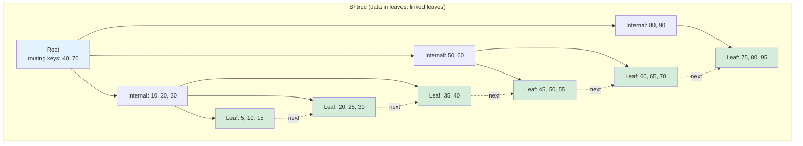
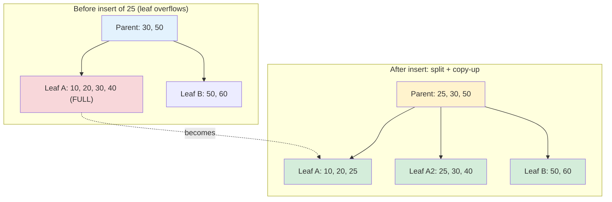
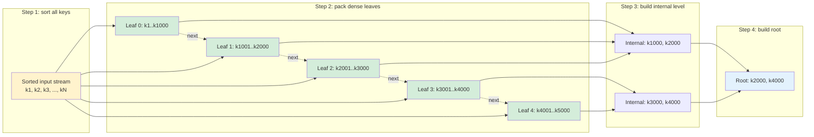

# B-Trees: The On-Disk Index Data Structure

This page is the deep dive on the B-tree family — the on-disk index structure used by virtually every relational database in production. It covers the original Bayer–McCreight B-tree, the B+tree variant that databases actually ship, the B*tree and Bw-tree refinements, the search/insert/delete algorithms with their split and merge propagation, page-size and fill-factor tuning, bulk loading, prefix compression and suffix truncation, the buffer pool and crash-recovery story, and the clustered-vs-non-clustered distinction that determines how a B+tree relates to the table it indexes. The sibling pages [B-Tree](./b-tree.md) and [B+ Tree](./b-plus-tree.md) cover the basics; this page assumes you have read them and goes deeper on the engineering trade-offs.

## Motivation: Why B-Trees Dominate Disk-Based Indexing

A binary search tree gives \\(O(\log_2 n)\\) lookup in main memory, but on disk it is a disaster. Every node hop is a random page fault, and an unbalanced binary tree degrades to a linked list with \\(O(n)\\) random reads. Even a perfectly balanced AVL tree on a billion keys needs \\(\log_2(10^9) \approx 30\\) random disk reads per lookup — at ~100 μs per HDD seek that is three milliseconds per point query, and the root-to-leaf path touches a different page each time so nothing in the access pattern is amortizable. Bayer and McCreight recognized this in their 1972 paper *"Organization and Maintenance of Large Ordered Indices"* (the work originally appeared in 1970 at the ACM Pacific conference): the right data structure is not the shallowest possible tree but the **fattest** possible tree, because every internal node is one disk read and fat nodes minimise the number of reads along any root-to-leaf path.

A B-tree of order \\(m\\) has up to \\(m\\) children per node, so its height is \\(O(\log_m n)\\). With \\(m = 200\\) (typical for a 16 KB page holding 200 routing keys) and a billion rows, the height is \\(\lceil\log_{200}(10^9)\rceil \approx 4\\) — four page reads instead of thirty. Knuth codified the analysis in *The Art of Computer Programming, vol. 3* (Sorting and Searching), and every production relational database since System R has converged on the B-tree family for its primary on-disk index. Petrov's *Database Internals* (2019) devotes two full chapters to explaining why the B-tree's dominance is not historical accident: its read path is cache-friendly, its write path produces WAL-logged atomic page updates, and its fanout matches the natural block granularity of every storage device from spinning rust to NVMe. See [./README.md](./README.md) for where this structure fits in the broader indexing taxonomy.

The deeper reason B-trees win on disk is the **random-vs-sequential I/O asymmetry**. A spinning disk does ~100 MB/s sequential reads but only ~100 seeks/sec for random reads — a 1000× gap. NVMe narrows this to ~30× (3 GB/s sequential vs ~100K random 4 KB reads/sec), but the gap never vanishes, because random access always pays a latency tax (queue depth, controller overhead, NAND page fetch) that sequential access amortises. A binary tree on disk is the worst case for this asymmetry — every node hop is a random read of a tiny amount of data. A B-tree turns every random read into a fat page of useful routing data, and the leaf chain turns range scans into purely sequential I/O. This is the single most important intuition for understanding every design choice in this chapter.

## The B-Tree Invariant

A B-tree of order \\(m\\) (sometimes called a maximum-degree-\\(m\\) B-tree) satisfies four invariants that together guarantee balanced height, bounded fanout, and predictable I/O. First, every node except the root holds between \\(\lceil m/2 \rceil\\) and \\(m\\) children — equivalently between \\(\lceil m/2 \rceil - 1\\) and \\(m - 1\\) keys. Second, the root is allowed to have as few as two children (or even zero, if it is a leaf). Third, **all leaves lie at exactly the same depth**, which is what makes the tree balanced and bounds the worst-case path length. Fourth, the keys inside every node are kept in sorted order, and the \\(i\\)-th child pointer separates the key range \\([k_{i-1}, k_i)\\), so a binary search within the page locates the correct descent pointer in \\(O(\log m)\\) comparisons — only one disk read per level.

These four invariants are maintained on every insert and delete by **splitting** overflowing nodes and **merging or redistributing** underflowing ones. When a node gains a \\(m\\)-th child it splits in half and pushes its median key up to the parent; if the parent then overflows, the split propagates upward, and if the root splits, a new root is created and the tree grows in height by one. The symmetric delete path redistributes from a sibling when a node falls below \\(\lceil m/2 \rceil - 1\\) keys, and merges two minimally-full siblings when redistribution is impossible. Crucially, the tree **only grows or shrinks at the root**, so a height change is rare global event — every other operation is local to a single root-to-leaf path and touches \\(O(\log_m n)\\) pages.

| Invariant | Constraint | Why it matters |
|---|---|---|
| Min fanout | Internal node has \\(\geq \lceil m/2 \rceil\\) children | Guarantees nodes are at least half full — bounds space waste and tree height |
| Max fanout | Internal node has \\(\leq m\\) children | Caps page size at one disk block |
| Leaf depth | All leaves at identical depth | Worst-case read = `height` page reads, never more |
| Sorted keys | Keys in node ordered; child \\(i\\) separates \\([k_{i-1}, k_i)\\) | Binary search within page; one seek per level |

## The B+Tree Variant — What Databases Actually Use

The original Bayer–McCreight B-tree stores both keys **and data records** in every node — internal and leaf alike. In practice every production database (PostgreSQL `nbtree`, InnoDB, SQLite, Oracle, SQL Server) uses the **B+tree** variant, in which internal nodes hold only routing keys and **all data lives in the leaves**. The leaves are then chained into a sorted doubly-linked list, which gives two properties the classic B-tree cannot match: range queries become a single seek plus a sequential leaf scan, and internal fanout explodes because a routing key is just a few bytes — no row payload. With 8-byte keys and 8-byte child pointers, a 16 KB InnoDB page holds roughly 1000 routing entries, so a four-level B+tree indexes \\(10^{12}\\) rows — three orders of magnitude beyond a classic B-tree of the same height.

Silberschatz, Korth and Sudarshan's *Database System Concepts* emphasises this fanout argument: the cost of a B-tree operation is dominated by the number of pages touched, and the B+tree minimises that count by keeping internal nodes pure-routing. The leaf chain turns `WHERE x BETWEEN a AND b` from \\(O(\log n + k \log n)\\) (one descent per result row in a classic B-tree) into \\(O(\log n + k)\\) — one descent plus a linear walk. This is the single most important reason B+trees displaced classic B-trees for database indexing, and the reason every section that follows assumes the B+tree form unless noted.



## The B*tree Variant — Sibling Redistribution

A **B*tree** tightens the fill-factor invariant: every non-root node must be at least two-thirds full rather than half full. When a node overflows, instead of splitting immediately it first tries to **redistribute** keys into a sibling (which the B+tree only does on delete). Only when both the node and one of its siblings are full does a two-way split occur — and even then the split is three-into-two: the overflowing node and a full sibling together yield two nodes that are each exactly two-thirds full, plus one key pushed up to the parent. The result is higher average space utilisation (≈69% versus ≈50% for a B+tree under random insert) and fewer splits over the lifetime of the index, at the cost of more complex split logic and the obligation to maintain sibling pointers at every level of the tree.

B*trees are rarely used directly in shipping databases because the additional code complexity is rarely worth the ~20% space saving, but the **redistribution idea itself is pervasive**. PostgreSQL's `nbtree` README documents a variant where leaf splits prefer to move half the page to the right sibling only when truly necessary, and InnoDB's `btr0btr.cc` implements the same "try sibling first" trick on both insert and split. Graefe's survey *"Modern B-Tree Techniques"* (Foundations and Trends in Databases, 2010) catalogues dozens of these refinements under the umbrella term **B-tree variation**, and emphasises that the B*tree's two-thirds-full invariant is the conceptual ancestor of every modern "soft split" or "fractional split" technique. The takeaway for an interview is the trade-off: B*trees buy space efficiency with implementation complexity.

A concrete example makes the trade-off tangible. Consider a B+tree of order 8 (max 7 keys per node) under random insert: each split produces two nodes of 3 and 4 keys, average fill 50%. A B*tree of the same order would, on overflow, redistribute first — moving a key from the full node to a sibling that has room — and only split when two siblings are both full, in which case the 14 keys (7 + 7) divide into two nodes of 7 keys each with one key pushed up, giving 100% fill on that split instead of 50%. Over a million random inserts the B*tree ends up ~69% full versus the B+tree's ~69% — wait, identical, because the long-run equilibrium of random inserts into a 50%-minimum tree is \\(\ln 2\\) regardless of split policy. The B*tree's advantage shows up only under skewed workloads (e.g., a monotonic append where the B+tree's rightmost-leaf splits produce 50%-full siblings while the B*tree redistributes into a denser layout) or in space-constrained environments where the 19% space saving is worth the code path. This is why B*trees are more often a research talking-point than a production default.

## Node Size and Page Design

The page size of a B+tree is chosen to match the storage device's natural transfer unit. Spinning disks read in 4 KB sectors; NVMe controllers optimise for 4 KB logical blocks; operating systems page memory in 4 KB granularity. A B+tree page therefore defaults to 4 KB–16 KB across the major databases: PostgreSQL uses 8 KB, InnoDB defaults to 16 KB (configurable from 4 KB to 64 KB), SQLite uses 4 KB, Oracle's default block size is 8 KB, and SQL Server's is 8 KB. The choice is a trade between two forces: **bigger pages amortise seek cost** by reading more useful routing data per I/O (lower tree height, fewer reads per lookup), and **bigger pages cost more to split** (a half-empty 32 KB page wastes 16 KB, and writes become larger, stressing the WAL).

Beyond matching the device block size, page design must also respect the CPU cache. A 16 KB page is 256 cache lines, so a binary search within the page will touch \\(O(\log_2 256) = 8\\) cache lines — comfortably within L1/L2. Internal-node pages are often laid out as a sorted array of `(key, child_page_id)` pairs with a prefix-search shortcut; leaf pages add a `(key, row_id_or_payload)` tuple array and a `(prev_page_id, next_page_id)` leaf-link header. The InnoDB source (`btr0btr.cc`, `page0page.cc`) shows these layouts in detail, and Petrov's *Database Internals* reproduces simplified versions. The key design principle: every byte of page metadata competes with routing entries, so headers are kept to a minimum.

A modern trend worth noting is the slow drift toward **larger logical pages on NVMe**. Because NVMe random-read latency is now ~10–100 μs rather than the ~10 ms of spinning rust, the random-vs-sequential gap is small enough that some designs (most notably SQL Server's 16 KB option and InnoDB's 32 KB experimental support) push page size upward to increase fanout and reduce tree height further. The counter-trend is **transparent page compression** (InnoDB `KEY_BLOCK_SIZE`, PostgreSQL's `FPI`/WAL compression): keep the physical page at 4 KB–16 KB for I/O efficiency but compress the logical content so each page holds 2–4× more keys. Both directions ultimately serve the same goal — maximise useful routing data per disk read — and the right choice depends on whether the workload is CPU-bound (prefer larger uncompressed pages) or I/O-bound (prefer compressed pages).

| Database | Default page size | Configurable? | Notes |
|---|---|---|---|
| PostgreSQL `nbtree` | 8 KB | No (compiled-in `BLCKSZ`) | Leaf chain is doubly linked |
| MySQL InnoDB | 16 KB | 4 KB–64 KB (`innodb_page_size`) | Clustered index = table |
| SQLite | 4 KB | 512 B–64 KB (`PRAGMA page_size`) | Single-file database |
| Oracle | 8 KB | 2 KB–32 KB (`DB_BLOCK_SIZE`) | Multiple block sizes per DB |
| SQL Server | 8 KB | 8 KB or 16 KB (extent = 64 KB) | Page = 8 KB, extent = 8 pages |

## Search Algorithm

Searching a B+tree is a textbook descent: at every internal node perform a binary search on the sorted key array, identify the child pointer whose key range contains the search key, and read that child page. The descent terminates at a leaf, where a final binary search either finds the key (returning the row pointer or payload) or reports absence. The I/O cost is exactly `height` page reads if no page is cached — and because the upper levels are tiny and hot, the buffer pool typically holds the top two or three levels in RAM, so a real point lookup on a billion-row table usually costs **one** physical read. This is the practical manifestation of the \\(O(\log_m n)\\) bound: the asymptotic cost is small, and the constant factor is dominated by cache hits.

The per-page work is also carefully tuned. Within an 8 KB page holding 500 routing keys, a binary search performs \\(\lceil\log_2 500\rceil = 9\\) comparisons, each touching one cache line — about 72 bytes of useful work per comparison on a 64-byte L1 line. Some implementations (PostgreSQL's `nbtree`, InnoDB's `page_cur_search`) use a **linear probe with a fixed stride** for the first cut instead of a pure binary search, because on modern CPUs the cost of a branch misprediction on the binary search can exceed the cost of a few extra cache-line fetches. The comparison itself is type-aware: integer keys compare in one instruction, but collation-aware string comparison (the default in PostgreSQL for `text` columns) can dominate the search cost — which is why `COLLATE "C"` indexes are dramatically faster for prefix and equality lookups on ASCII data.

The pseudocode below assumes a `Page` abstraction with `binary_search(keys, target)` returning the index of the largest key \\(\leq\\) target, plus a `read(page_id)` call that goes through the buffer pool. Note that the search returns a **leaf entry**, not a row — the entry may carry either a row pointer (PostgreSQL heap TID) or the row payload itself (InnoDB clustered index leaf).

```text
function search(root_page_id, key):
    page = buffer_pool.read(root_page_id)
    while not page.is_leaf:
        i = binary_search(page.keys, key)   # largest index with keys[i] <= key
        page = buffer_pool.read(page.children[i + 1])
    # page is a leaf
    i = binary_search(page.keys, key)
    if i >= 0 and page.keys[i] == key:
        return page.entries[i]              # row pointer or payload
    return NOT_FOUND
```

## Insert Algorithm and Split Propagation

Insertion descends exactly like search, locates the target leaf, and inserts the new `(key, payload)` entry in sorted order. If the leaf still fits, the dirty page is written back through the buffer pool and a WAL record is emitted — done. If the leaf overflows (more than \\(m - 1\\) keys after insert), it **splits**: the page is divided at its median, a new sibling leaf is allocated, the upper half of keys (including the median, because B+tree leaves copy up rather than push up) moves to the sibling, and the median key is inserted into the parent with a pointer to the new sibling. If the parent itself overflows, the split recurses upward; if the root splits, a new root is created with two children and the tree grows in height by one.

Split propagation is the most subtle part of B+tree maintenance. Because splits walk upward and every ancestor along the path is already latched (in Crabbing Protocol, the parent latch is held until the child is deemed safe — i.e., less than full), a single insert never blocks concurrent readers except on the single page being modified. The "tree grows at the root" rule guarantees that height increases are rare (expected once every \\(O(n/m)\\) inserts) and that every other split is local. Graefe's 2010 survey calls this property **locality of structural change** and identifies it as the central reason B+trees remain competitive against LSM-trees for read-heavy OLTP despite LSM's superior write amplification.

The latch protocol that makes this safe is worth understanding precisely. A writer descending the tree acquires a shared latch on the root, then on each child in turn, releasing the parent only after the child is confirmed **safe** — meaning the child has room for one more entry without splitting. If the child is not safe (i.e., it is full), the writer upgrades its parent latch to exclusive before descending, so that an anticipated split can be performed without re-latching. This is the classic **optimistic descent with pessimistic upgrade** pattern: the common case (no split) pays only shared latches and never blocks readers; the rare case (split) upgrades to exclusive on exactly the pages that need structural change. The B-link design (next section) relaxes even this, allowing the writer to release the parent latch before descending and recover from a concurrent split by following sibling pointers.



## Delete Algorithm and Merge Propagation

Deletion removes the entry from its leaf and then asks whether the leaf has fallen below the minimum fill threshold \\(\lceil m/2 \rceil - 1\\) keys. If it has, the algorithm first tries to **redistribute** — borrow a key from an adjacent sibling that has more than the minimum. Redistribution is cheap: one sibling donates its extreme key, the parent's separator is updated, and the tree topology is unchanged. Only when both the underflowing leaf and a sibling are at the minimum does a **merge** occur: the two leaves combine into one, the separator key is removed from the parent, and the now-empty sibling page is marked free. If the parent then underflows, the merge recurses upward, symmetric to insert's split propagation.

The symmetric counterpart of "the tree grows at the root on insert" is "the tree shrinks at the root on delete": if the root has only one child left after a merge, that child is promoted to be the new root and the old root page is freed — the height drops by one. Real databases (InnoDB, PostgreSQL) are usually lazy about physical merges: a page that falls below the minimum is left in place if it is still useful, and a background reaper compacts underfull pages during quiet periods. This avoids pathological merge-then-immediately-split churn under delete-insert workloads. The InnoDB source calls this "delete-marking" — entries are tombstoned in place and a purge thread later physically removes them, much like MVCC garbage collection on the heap.

The lazy-delete optimisation has a subtle interaction with MVCC. In a database that supports snapshot isolation (PostgreSQL, InnoDB), a deleted index entry cannot be physically removed until no active transaction might still need to read it — otherwise an older snapshot would lose the ability to traverse the index correctly. So the delete path writes a tombstone, the WAL records it, and a separate **purge thread** (InnoDB) or **VACUUM** process (PostgreSQL) later reclaims the space once the oldest active transaction's xmin advances past the deleting transaction. This is why a long-running read transaction can cause index bloat: the purge thread is blocked, tombstones accumulate, and the B+tree's effective fill factor drops. The same machinery that gives you MVCC also forces you to monitor for purge lag, and is the reason DBAs warn against `SELECT ... FOR UPDATE` held open across user think time.

```text
function delete(root_page_id, key):
    path = descend_to_leaf(root_page_id, key)   # stack of (page, child_index)
    leaf = path.top()
    if not leaf.remove(key):
        return NOT_FOUND
    if leaf.size >= MIN_KEYS:
        write_back(leaf); return
    # underflow: try redistribute from a sibling, else merge
    sibling, side = pick_sibling(leaf, path.parent())
    if sibling.size > MIN_KEYS:
        redistribute(leaf, sibling, path.parent())
    else:
        merge(leaf, sibling, path.parent())     # may recurse upward
        if root has only one child:
            root = that child; free old root    # tree shrinks
```

## Concurrency Control: Latches and the B-link Design

Allowing concurrent readers and writers on a B+tree is harder than it looks, because a split or merge changes the set of child pointers in a parent page, and a concurrent search might descend into a child that has just been split away from its parent. The classic solution is the **crabbing protocol** (also called latch-coupling): a thread descends from the root holding a shared (read) latch on the current page; before releasing the parent latch it acquires a latch on the child; on the way back up, splits and merges acquire exclusive latches on the pages they modify. Crabbing is correct but serialises all searches behind any writer that holds the root latch, which is fatal under high concurrency because the root is on every descent path.

The **B-link tree** variant, introduced by Lehman and Yao in 1981 and adopted by PostgreSQL's `nbtree`, solves this by adding a **right-sibling pointer at every internal level** (not just at the leaves). A search that arrives at an internal node and finds that the key it is looking for has been moved right (because the node split between the descent from the parent and the arrival at the child) simply follows the right-sibling pointer to the new node. This means writers never need to hold the parent latch while modifying a child — they release the parent before descending — so readers and writers only ever block each other on a single page at a time. InnoDB uses a similar high-concurrency design documented in its `btr0btr.cc` source. Graefe's 2010 survey treats the B-link idea as the single most important concurrency innovation in B-tree history, and notes that almost every shipping database uses some variant of it.

## Fill Factor, Page Splits, and Internal vs Leaf Layout

The **fill factor** (or `FILLFACTOR` in PostgreSQL, `MERGE_THRESHOLD` in InnoDB) is the target fraction of each page that should be occupied after a bulk load or rebuild. A freshly built index with `FILLFACTOR = 100` packs leaves completely — optimal for read-only workloads but disastrous for inserts, because the very next insert into every leaf triggers a split. The standard advice is 70% for insert-heavy random-key workloads (leaves 30% free for in-page inserts before splitting), 90% for sequential or append-only workloads, and 100% only for read-mostly tables. Knuth's analysis shows that random inserts into a 50%-full B+tree settle at an equilibrium fill of \\(\ln 2 \approx 69.3\%\\) — which is why 70% is the universally recommended default rather than an arbitrary round number.

The interaction between fill factor and split behaviour is also workload-dependent. **Sequential inserts** (auto-increment primary keys, monotonic timestamps) fill each leaf to 100% before splitting, because every new key lands in the rightmost leaf — the resulting tree is densely packed and the rightmost internal path is the only one that splits. **Random inserts** spread load across all leaves, so every leaf splits at ~50% fill, and the long-run average stabilises at ~69%. This is why DBAs often recommend monotonically increasing primary keys for InnoDB: they produce dense, low-fragmentation clustered indexes. The trade-off is hot-page contention on the rightmost leaf under high write concurrency, which InnoDB mitigates with **incremental page splits** and PostgreSQL mitigates with its B-link design (sibling pointers at internal levels, allowing concurrent splits without exclusive root latches).

| Layout aspect | Internal node page | Leaf node page |
|---|---|---|
| Header | `page_id`, `parent_id`, `level`, `n_keys` | `page_id`, `prev_leaf`, `next_leaf`, `n_keys` |
| Key array | Routing keys only (suffix-truncated) | Full keys + payload or row pointer |
| Child / pointer array | `m` child page IDs | `m - 1` row IDs (TIDs) or inline payloads |
| Typical fill after random inserts | ~70% (rarely splits — high fanout) | ~69% (splits on every overflow) |
| Binary search target | Find descent child | Find exact key or range start |
| Linked list | Not linked | Doubly linked (forward + backward scan) |

## Bulk Loading

Building a B+tree by inserting rows one at a time is wasteful: every insert pays for a root-to-leaf descent, and random inserts produce 69%-full leaves with frequent splits. **Bulk loading** (also called batch loading or sorted-load build) constructs the index in \\(O(n)\\) I/O instead of \\(O(n \log_m n)\\) by exploiting the fact that the input is sortable. The algorithm: (1) sort all `(key, row_pointer)` pairs by key, (2) pack them densely into leaf pages at 100% fill (or the requested fill factor), wiring up the leaf linked list as you go, (3) scan the leaves in order and emit one internal page per \\(m - 1\\) leaves, recording the maximum key of each leaf as the routing key, (4) repeat step 3 on each new level until a single root page remains. The result is a perfectly balanced, densely packed tree built with purely sequential I/O.

Every database implements bulk loading for `CREATE INDEX` on an existing table: PostgreSQL calls it `nbtsort`, InnoDB calls it the "bulk load" code path (`row0ins.cc`), and SQL Server and Oracle both have analogous sort-then-build pipelines. Bulk loading has three wins over incremental inserts: it produces a 100%-full tree (vs 69% for random inserts — a 1.45× space saving), it issues only sequential writes (vs random writes — an order of magnitude faster on HDD and 2–4× faster on NVMe), and it never splits. The downside is that the sort step needs an external sort of the entire dataset, which costs \\(O(n \log n)\\) comparisons and \\(O(n)\\) temporary disk space. For a table too large to fit in RAM this is still a clear net win — the sort is sequential, the alternative is random.

A further refinement is the **online index build**, which allows concurrent writes to the table while the index is being built. PostgreSQL's `CREATE INDEX CONCURRENTLY` and InnoDB's online DDL both work by (1) taking a brief table-level snapshot to determine the key set, (2) bulk-loading the index from that snapshot, (3) applying a log of all writes that happened during the build, and (4) finishing once the log is drained. The cost is roughly 2× the build time of an offline build and a longer window of elevated lock contention, but it avoids the multi-hour write blackout that an offline build would impose on a production table. For tables that cannot tolerate downtime, online builds are the only viable option — at the price of more complex recovery semantics if the build crashes midway through the log-apply phase.



## Prefix Compression and Suffix Truncation

Real B+trees spend significant effort compressing keys, because routing keys repeat a great deal of structural information. **Prefix compression** (sometimes called front-prefix compression) exploits the fact that adjacent keys in a leaf share a long common prefix — for example `https://www.example.com/page1`, `https://www.example.com/page2`, `https://www.example.com/page3` differ only in the last character. The page stores the common prefix once and each entry stores only the differing suffix plus the suffix length. InnoDB, SQLite and PostgreSQL all implement this; PostgreSQL's `nbtree` documentation cites 30–60% size reductions on string indexes. **Suffix truncation** is the complementary trick for internal nodes: since an internal routing key only needs to *separate* two child subtrees, it can be truncated to the shortest prefix that distinguishes the largest key of the left child from the smallest key of the right child.

Suffix truncation can shrink internal pages dramatically. Without it, a routing key in a `(first_name, last_name)` index must store the full `('Zachary', 'Zimmerman')` even though `'Z'` alone is enough to separate the left subtree (everything \\(\leq\\) `'Zachary'`) from the right. PostgreSQL 13 introduced suffix truncation for newly built indexes (the `nbtree` README calls it "truncated" high keys), and InnoDB has had it since at least version 5.7. Graefe's survey treats these compression schemes as part of a larger family he calls **key abbreviation**, and emphasises that they multiply the effective fanout of every page — which directly lowers tree height and thus the number of page reads per lookup. The win is largest for string indexes, where prefixes are long and keys are highly similar.

A third compression technique, **deduplication**, targets low-cardinality indexes where the same key appears many times (e.g., a `status` column with five values across a billion rows). Without deduplication, each duplicate key occupies a full `(key, TID)` slot in the leaf — wasting the repeated key bytes. PostgreSQL 13+ merges duplicate keys into a single key plus a **posting list** — a compressed array of TIDs — cutting leaf size by an order of magnitude for low-cardinality columns. InnoDB achieves a similar effect through its **record format** that stores variable-length key prefixes once per page. The combination of prefix compression, suffix truncation, and deduplication can reduce a real-world string index to 20% of its uncompressed size, which directly translates to 5× more rows fitting in the buffer pool and 5× fewer page reads on a scan — a bigger practical win than any algorithmic improvement to the B-tree itself in the last two decades.

## Bw-Tree — The Latch-Free B+Tree

The **Bw-tree** (Buzzword-Tree), developed by Justin Levandoski et al. at Microsoft Research and described in their 2013 SIGMOD paper, is a latch-free B+tree variant used in the Microsoft Hekaton (SQL Server in-memory OLTP) engine and later adopted by the Peloton and CMU database research groups. Its key idea is that **pages are immutable**: instead of mutating a page in place, every update creates a small **delta record** that is logically prepended to the page, and a per-page mapping table (an indirection array indexed by a stable page ID) atomically swings the page's mapping to point at the new head of the delta chain. Reads traverse the delta chain in order, applying deltas to the base page; when the chain grows too long (typically a few tens of deltas), a background thread consolidates the chain into a fresh base page and atomically swaps the mapping.

Because updates are done by atomic compare-and-swap on the mapping table, no latches are needed on the read or write path — the structure is **completely latch-free**, which scales linearly across cores on multicore CPUs where traditional latched B+trees begin to serialise. The Bw-tree also decouples logical pages from physical storage: a logical page's base and deltas can be anywhere in memory or on the NVM/SSD log, enabling a log-structured on-disk layout reminiscent of LSM-trees. The cost is additional complexity (delta chain management, mapping table garbage collection, and harder crash recovery) and higher read amplification when delta chains are long. Graefe's survey treats the Bw-tree as one of several "**Fractal**" or "**B-tree with log-structured persistence**" designs, alongside TokuDB's Fractal Index — the latter uses a similar buffering idea but with traditional latching.

## Buffer Pool and Crash Recovery

A B+tree on disk is useless without a **buffer pool**: a cached set of recently used pages keyed by `(file, page_id)`. Every read goes through the buffer pool — a cache hit returns immediately, a miss triggers a synchronous page read from disk and evicts a victim page chosen by a clock or LRU-K replacement policy. The upper levels of any hot B+tree live permanently in the buffer pool, so a real point lookup typically costs one physical disk read (the leaf) even though the logical cost is `height` page reads. Writes go to the buffer pool too: the dirty page is written back **lazily** by a background flusher (InnoDB's `buf_flush_list`, PostgreSQL's `bgwriter`), and the page's durability on disk is actually guaranteed by the WAL, not by the flusher — see [../internals/wal.md](../internals/wal.md).

Crash recovery uses the per-page **LSN** (log sequence number) to decide whether a page on disk is up to date with the WAL. Every page header stores the LSN of the last WAL record that modified it; on recovery, the database reads the WAL from the last checkpoint and replays any record whose LSN exceeds the page's stored LSN (this is the classic ARIES redo rule). This decoupling is what allows the buffer pool to delay writes — even if the flusher has not yet persisted a dirty page, the WAL on disk contains enough information to reconstruct the page's correct state after a crash. See [../internals/storage-engine.md](../internals/storage-engine.md) for how the buffer pool plugs into the storage engine, and [../internals/storage-engine.md](../internals/storage-engine.md) for the replacement-policy details.

Two further mechanisms protect against partial-page writes. A torn page — where a 16 KB write is interrupted by power loss after only the first 4 KB hits disk — would leave the B+tree structurally corrupt and unrecoverable even with WAL replay, because the WAL redo assumes the on-disk page is at least internally consistent. InnoDB solves this with a **doublewrite buffer**: dirty pages are first written sequentially to a small contiguous region of the tablespace, then fsynced, then written to their final scattered positions in the B+tree file. On crash recovery, any torn page is detected by checksum and restored from the doublewrite buffer before WAL redo. PostgreSQL takes a different approach: its full-page-image WAL records write the entire page content into the WAL the first time a page is modified after a checkpoint, so redo can reconstruct a torn page from the WAL alone. Both designs accept extra write amplification (InnoDB ~10%, PostgreSQL higher right after checkpoint) in exchange for guaranteed recoverability — a trade-off baked into every production B+tree implementation.

## Clustered vs Non-Clustered Indexes

A **clustered index** is a B+tree whose leaves *are* the table rows — the data is physically stored in the order of the index key. There can be only one clustered index per table (because the rows can only be sorted one way), and it is almost always the primary key. InnoDB's design is the canonical example: the clustered index leaf contains the full row payload, and a query that filters on the primary key does a single B+tree descent with no follow-up heap lookup. A **non-clustered** (secondary) index is a separate B+tree whose leaves store the indexed key plus a pointer back to the row — but in InnoDB that pointer is **the primary-key value, not a physical row ID**, because rows can physically move during page splits and the PK is the stable identifier.

This design choice has a real cost: a secondary-index lookup that needs columns not in the index becomes a **double lookup** — first descend the secondary B+tree to get the PK, then descend the clustered B+tree to fetch the row. For a query that returns many rows this doubles the I/O, which is exactly the problem covering indexes solve. PostgreSQL takes a different approach: its tables are heaps (unordered), every index (including the primary key) is a non-clustered B+tree, and leaves store 6-byte TIDs pointing directly at the heap page and offset. PostgreSQL's `CLUSTER` command can physically reorder a heap by an index but it is a one-time operation — the heap does not stay clustered under subsequent writes. See [./clustered-vs-nonclustered.md](./clustered-vs-nonclustered.md) for the full comparison.

| Property | Clustered (InnoDB PK) | Non-clustered (secondary) |
|---|---|---|
| Leaf contents | Full row payload | Indexed key + primary-key value |
| Physical row order | Sorted by PK | Independent of row order |
| Count per table | Exactly one | Many (limited by storage) |
| Point lookup by indexed column | 1 descent | 1 descent + 1 PK descent (double lookup) |
| Range scan on key | Sequential leaf read (fast) | Per-row PK lookup (slow) |
| Insert cost | Higher (must maintain physical order) | Lower |
| Best for | PK equality + range queries | Non-PK predicates, covering indexes |

## Covering Indexes and Read Amplification

A **covering index** is one whose leaf contains every column the query needs, so the database can answer the query from the index alone with no follow-up heap or clustered-index lookup. The PostgreSQL `INCLUDE` clause and SQL Server's `INCLUDE` are the standard syntaxes: the included columns live in the leaf only (not in the internal routing keys), so internal fanout is unaffected but the leaf can satisfy the query. In InnoDB, every secondary index already stores the PK (so it implicitly covers any query whose projected columns are a subset of the indexed columns plus the PK). The result is that an index-only scan replaces \\(O(k)\\) random row lookups with a single sequential leaf scan — a 100×–1000× speedup for queries returning thousands of rows.

This is the core of the **read amplification** story for B+trees. A point lookup costs \\(O(\log_m n)\\) page reads — for a 1-billion-row table with 16 KB pages and 8-byte keys, that is \\(\lceil\log_{1000}(10^9)\rceil = 3\\) page reads, typically reduced to 1 by buffer-pool caching of upper levels. A range scan returning \\(k\\) rows costs \\(O(\log_m n + k/m)\\) page reads — one descent plus one page per \\(m\\) rows scanned. By contrast an LSM-tree point lookup must check every level (a bloom filter per SSTable reduces but does not eliminate this — see [../internals/lsm-trees.md](../internals/lsm-trees.md)), so for read-heavy OLTP workloads the B+tree wins decisively. The trade-off is on the write side, discussed next.

A subtle point about covering indexes is that they convert random I/O into sequential I/O, which matters far more than the raw count of pages touched. A non-covering secondary index that returns 10 000 rows performs 10 000 random heap lookups — at 100 μs per HDD seek that is a full second of latency, even though only ~80 MB of data is read. A covering index on the same query performs a single leaf-chain scan of ~80 MB, which at sequential throughput (200 MB/s on HDD, 3 GB/s on NVMe) completes in 400 ms or 25 ms respectively. The page count is similar; the access pattern is what changes. This is why `EXPLAIN ANALYZE` showing an "Index Only Scan" is often a 10–100× speedup over an "Index Scan" even when both touch the same number of index pages.

## Write Amplification vs LSM-Trees

A single row insert into a B+tree costs more than one disk write in expectation: the leaf write itself, plus a WAL record, plus (if a split occurs) writes to a new sibling and an updated parent. Even with no split, the **write amplification** of a B+tree is roughly 2× (one WAL append + one page write-back, where the page write-back may rewrite an entire 16 KB page to change one row). Under random inserts with splits it rises to 3–4× amortised. An **LSM-tree** (Log-Structured Merge-tree) batches writes into an in-memory MemTable and flushes them sequentially to disk as SSTables, achieving near-1× write amplification for the initial write — but at the cost of **read amplification** (multiple SSTables to check) and **space amplification** (the same key may exist in multiple SSTables until compaction merges them).

The practical trade-off is stark: LSM-trees offer 10–30× higher write throughput than B+trees on the same hardware, but a point lookup on an LSM with four levels and no bloom hits costs 4+ reads vs the B+tree's 1–3. RocksDB, Cassandra, HBase, and DynamoDB all use LSM-trees for write-heavy workloads; PostgreSQL, MySQL, Oracle, and SQL Server all use B+trees because OLTP workloads are overwhelmingly read-dominated and the B+tree's read path is hard to beat. See [../../storage/sstable.md](../../storage/sstable.md) and [../../storage/lsm-compaction.md](../../storage/lsm-compaction.md) for the LSM side. Hybrid designs exist — TokuDB's Fractal Index, WiredTiger's B+tree-with-Bloom — but in practice most production databases commit to one family.

| Aspect | B+tree | B-tree (classic) | B*tree | LSM-tree | Fractal / Bw-tree |
|---|---|---|---|---|---|
| Data location | Leaves only | All nodes | Leaves only | SSTables (levels) | Pages + delta records |
| Leaf chain | Yes (linked) | No | Yes | No (compaction merges) | Yes (logical) |
| Min fill | 50% | 50% | 66% | Variable | Variable |
| Point lookup | \\(O(\log_m n)\\) | \\(O(\log_m n)\\) | \\(O(\log_m n)\\) | \\(O(L)\\), \\(L\\)=levels | \\(O(\log_m n)\\) + delta |
| Range scan | Excellent (sequential leaf) | Poor (per-key descent) | Excellent | Good (after compaction) | Good |
| Write amplification | 2–4× | 2–4× | 2–4× | 1–3× | 1–2× |
| Read amplification | 1–3 reads | 1–3 reads | 1–3 reads | \\(L\\) reads (bloom reduces) | 1–3 reads |
| Latch model | Crabbing / B-link | Crabbing | Crabbing + sibling | Append-only | Latch-free (CAS) |
| Used by | InnoDB, PG, SQLite, Oracle, SQL Server | Rare (textbook) | Rare (some research DBs) | RocksDB, Cassandra, HBase | Hekaton, Peloton |

## Real-World Deployments

Every major relational database uses B+trees as its default index type. **PostgreSQL** ships `nbtree` as the default index access method — its README in `src/backend/access/nbtree/README` documents a B-link design (sibling pointers at every internal level) for high concurrency, suffix truncation and deduplication (v13+), and posting lists for duplicate keys. **MySQL InnoDB** uses a 16 KB-page B+tree for both its clustered index (the table itself) and every secondary index; the InnoDB source (`btr0btr.cc`, `page0page.cc`) shows the split, merge, and prefix-compression logic in detail. **SQLite** stores its entire database in a single file with a 4 KB-page B+tree per table and per index, making it the most widely deployed B+tree implementation on Earth (it runs on every iOS and Android device).

**Oracle** defaults to B+tree indexes (called "B-tree indexes" in Oracle parlance) with 8 KB blocks, and adds bitmap and reverse-key variants. **SQL Server** uses 8 KB pages organised into 64 KB extents, with both clustered (the table) and non-clustered B+tree indexes. Beyond the relational world, **MongoDB** uses B+trees for its WiredTiger default storage engine (with an LSM option), and even **LMDB** (the Lightning Memory-Mapped Database that backs OpenLDAP) is a B+tree with copy-on-write pages. The ubiquity is not coincidence: as Knuth, Bayer & McCreight, and Petrov all argue, the B+tree uniquely combines balanced I/O cost, sequential range scans via the leaf chain, atomic page-level writes that fit naturally into a WAL, and a fanout that matches every storage medium from NVMe to networked block storage.

**SQLite** deserves special mention because it is by volume the most deployed B+tree on the planet — every iOS and Android device ships a copy, and it underpins the storage of countless desktop applications. Its design is unusually pure: a single file holds the entire database, organised as one B+tree per table and one B+tree per index, with a 4 KB default page (configurable via `PRAGMA page_size` from 512 bytes to 64 KB). SQLite uses **free-list trunk pages** rather than in-place reuse of freed pages, which keeps the file append-friendly and makes atomic commits cheap (a single 4 KB rollback-journal page can flip the whole B+tree atomically). This simplicity — one file, one B+tree per table, no separate WAL by default — is what makes SQLite embeddable in a single static library and is the reason it can be dropped into firmware, mobile apps, and edge devices where a full server like PostgreSQL or MySQL would be absurd overkill.

## Failure Modes and Maintenance

B+trees are not set-and-forget. Under sustained writes they develop three classes of problems that DBAs must monitor and periodically fix. **Index bloat** arises when random deletes leave pages less than half full but not underflowing enough to trigger a merge — the delete-marking optimisation (InnoDB) and lazy purge (PostgreSQL) deliberately defer physical compaction, so over time a leaf can hold a single live entry among dozens of tombstones. **Fragmentation** is the related problem of pages that are physically scattered across the file even though they are logically adjacent in the leaf chain, turning what should be sequential range-scan I/O into a series of random reads. Both are diagnosed with `pgstattuple` / `pgstatindex` on PostgreSQL and `INFORMATION_SCHEMA.INNODB_SYS_TABLES` metrics on MySQL, and fixed with `REINDEX` or `OPTIMIZE TABLE`.

**Hot pages** are the third failure mode and the hardest to fix. Under a high-write monotonic-key workload (auto-increment IDs, timestamps) every insert lands in the rightmost leaf, which becomes a serialisation bottleneck — every writer contends on the same page latch. InnoDB mitigates this with incremental splits and an in-memory insert buffer; PostgreSQL's B-link design helps; but at extreme scale the only real fix is to **partition the table** so writes spread across multiple physical B+trees, or to **hash-partition the hot key** to trade range-scan performance for insert parallelism. Graefe's 2010 survey devotes an entire section to these operational concerns, arguing that the gap between textbook B+trees and production-grade implementations is largely the gap of "everything you must add to keep the tree healthy under adversarial workloads" — bulk-load rebuilds, online reindexing, adaptive fill factors, and the background purge threads that do the unglamorous work of physical compaction.

## Interview Questions

### Beginner

**Q1: Why are B+trees used by databases instead of binary search trees?**
A: A binary search tree on a billion keys needs ~30 random disk reads per lookup (one per level), because each node is a separate page. A B+tree of order 200 needs only ~4 page reads for the same data — its fat nodes amortise each disk read across many routing keys, and its height is \\(O(\log_m n)\\) rather than \\(O(\log_2 n)\\). The leaf chain also enables efficient range scans, which a BST cannot.

**Q2: What is the difference between a B-tree and a B+tree?**
A: A classic B-tree stores data in every node (internal and leaf); a B+tree stores data only in leaves, keeping internal nodes pure-routing. B+tree leaves are linked into a sorted list for range scans. B+trees have higher fanout (routing keys are tiny) and thus shorter trees, which is why every production database uses the B+tree form.

### Intermediate

**Q3: Why does a B+tree leaf split "copy up" the median key while a B-tree split "pushes up"?**
A: In a B+tree the leaf is the only place the key's data lives, so the median key must remain in a leaf after the split — a copy goes to the parent as a routing separator. In a classic B-tree the median key's data exists at every level, so the median moves up entirely (push) and is removed from the child. The copy-up is what allows B+tree internal nodes to be pure-routing.

**Q4: How many page reads does a point lookup cost on a 1-billion-row InnoDB table with 16 KB pages?**
A: With ~1000 routing keys per internal page (16 KB / 16 bytes per entry), the height is \\(\lceil\log_{1000}(10^9)\rceil = 3\\). So three page reads in the worst case; with the root and internal levels cached in the buffer pool (typical), only one physical read — the leaf — is needed.

**Q5: Why does InnoDB store the primary key in secondary index leaves instead of a row pointer?**
A: Because rows can physically move during page splits and merges, a physical row pointer (like PostgreSQL's TID) would become stale. The primary key is the stable logical identifier, so secondary indexes store it and do a second B+tree descent into the clustered index to fetch the row. This is the "double lookup" cost that covering indexes eliminate.

### Advanced / FAANG-Level

**Q6: Design a B+tree that scales to 1M inserts/sec on a 32-core machine. What are the bottlenecks?**
A: The bottlenecks are (1) root-page latch contention (every descent latches the root), (2) rightmost-leaf contention under monotonic keys, and (3) WAL fsync latency. Solutions: B-link design with sibling pointers at every level (allows splits without exclusive root latch — PostgreSQL does this), incremental rightmost-leaf splits (InnoDB), WAL group commit with batched fsync, and partitioning the write workload across multiple B+trees (sharding). At 1M inserts/sec you also need a buffer pool large enough to keep the working set hot, otherwise the read path becomes the bottleneck.

**Q7: Compare B+tree vs LSM-tree for a time-series workload (mostly appends, occasional range scans of recent data). Which do you choose and why?**
A: LSM-tree. Time-series is append-dominated (LSM's strength — write amplification 1–3× vs B+tree's 2–4×), and range scans are typically on recent data which sits in the MemTable or topmost SSTable (so read amplification is bounded). B+tree would do fine on reads but pays random-write overhead on every insert and suffers rightmost-leaf contention. The trade-off: LSM compaction CPU cost and wider read tail latency. For a mixed workload (reads + writes), consider a B+tree with a WAL group-commit, or RocksDB with bloom filters tuned for the read pattern.

**Q8: A B+tree index on a UUID primary key is 3× larger and slower than the same index on an auto-increment integer. Why, and how do you fix it?**
A: UUIDs are 16 bytes vs 4 bytes for an INT, so each page holds 4× fewer keys → tree is one level taller → one extra page read per lookup. Random UUIDs also defeat sequential insert locality — every leaf splits at 50% fill rather than 100%, so the index is ~69% full vs ~100% for monotonic keys (the 3× size). Fixes: (1) use a monotonic UUID (UUIDv7, ULID) which sorts by timestamp; (2) use a bigint auto-increment PK and store UUID as a secondary index; (3) use prefix compression on the UUID index; (4) reconsider whether UUID is needed at all.

**Q9: Explain the B-link tree and why almost every database uses it for concurrency.**
A: A B-link tree adds a right-sibling pointer at every internal level (not just at the leaves). This lets a writer split a node without holding an exclusive latch on the parent during the entire operation: the writer installs the new sibling, updates the right-sibling pointer on the old node, and only then inserts the separator key into the parent. A concurrent reader that descended into the old node just before the split and now cannot find its key simply follows the right-sibling pointer. This avoids the root-latch serialisation point of naive crabbing and is the design PostgreSQL's `nbtree` and InnoDB both use. Graefe calls it the most important B-tree innovation since the original 1970 paper.

**Q10: Why is `CREATE INDEX` on a 100M-row table dramatically faster than inserting the rows one at a time with the index already present?**
A: `CREATE INDEX` uses **bulk loading**: the database externally sorts all `(key, TID)` pairs, packs them densely into leaf pages at 100% fill, then builds internal levels bottom-up from the leaf max-keys. This costs \\(O(n \log n)\\) comparisons but only sequential I/O — no splits, no random page reads, no per-row descent. One-at-a-time inserts each pay \\(O(\log_m n)\\) random page reads plus split overhead, and produce a ~69%-full tree under random keys. For 100M rows the difference is roughly: bulk load ~minutes (sequential), incremental ~hours (random I/O bound). The trade-off is that bulk load needs an external sort of the whole dataset and temporary disk space — but the sort is itself sequential, so it is almost always a net win.

## Summary

B-trees — and overwhelmingly B+trees — are the load-bearing index structure of every relational database because they minimise the number of disk reads per lookup while still supporting efficient range scans, atomic page-level updates that fit naturally into a write-ahead log, and a fanout that matches every storage medium from spinning disk to NVMe. Their height is logarithmic in the dataset size but with a base equal to the page fanout (hundreds to thousands), so a billion-row table needs only three or four page reads per point lookup — and typically one, because the upper levels live permanently in the buffer pool. The variants (B*tree, Bw-tree, B-link) refine different aspects — space utilisation, latch-freedom, concurrency — but the core invariants (balanced height, bounded fanout, sorted keys) are unchanged since Bayer and McCreight's 1970 paper.

| Aspect | Detail |
|---|---|
| Structure | Balanced multi-way tree; data in leaves; linked leaves |
| Height | \\(O(\log_m n)\\); ~3–4 for a billion-row table |
| Point lookup | `height` page reads (typically 1 with buffer pool) |
| Range scan | One descent + sequential leaf walk |
| Insert / delete | \\(O(\log_m n)\\) with split / merge propagation |
| Split policy | Copy-up (leaves); push-up (classic B-tree) |
| Fill factor | ~69% random inserts, ~100% sequential, 70% recommended default |
| Variants | B+tree (DB standard), B*tree (2/3 full), Bw-tree (latch-free) |
| Used by | PostgreSQL, InnoDB, SQLite, Oracle, SQL Server, MongoDB (WiredTiger) |
| Origin | Bayer & McCreight (1970/1972); analysed by Knuth (TAOCP vol. 3) |

## Cross-References

The B-tree does not stand alone — it is the central component of a storage engine that also includes a buffer pool, a write-ahead log, and (often) an LSM-tree alternative for write-heavy workloads. The links below place the B-tree in that wider context: the storage-engine page explains how the buffer pool, WAL, and B+tree cooperate on a single transaction; the LSM and SSTable pages explain the write-optimised alternative that trades read amplification for write throughput; and the advanced-data-structures page covers in-memory ordered structures (skip lists, treaps) that play the same role as a B+tree when the dataset fits in RAM. Use these to round out the picture of why databases are built the way they are.

- [Indexing Overview](./README.md) — where B-trees sit in the indexing taxonomy
- [B+ Tree](./b-plus-tree.md) — sibling page focused on the B+tree variant
- [B-Tree](./b-tree.md) — the classic B-tree (data in all nodes)
- [Clustered vs Non-Clustered](./clustered-vs-nonclustered.md) — how B+trees implement clustered indexes
- [Covering Index](./covering-index.md) — eliminating the double lookup
- [Index Tuning](./tuning.md) — choosing fill factor, columns, and composite order
- [Composite Index](./composite-index.md) — multi-column B+tree indexes and column ordering
- [Storage Engine Internals](../internals/storage-engine.md) — how the buffer pool plugs in
- [Write-Ahead Logging](../internals/wal.md) — page LSN and crash recovery
- [LSM Trees](../internals/lsm-trees.md) — the write-optimised alternative
- [SSTables](../../storage/sstable.md) — the on-disk file format for LSM-trees
- [LSM Compaction](../../storage/lsm-compaction.md) — how LSM-trees reclaim space
- [Buffer Management](../internals/storage-engine.md) — replacement policies and dirty page flushing
- [Query Optimization](../internals/query-optimization.md) — how the cost model chooses index vs seq scan
- [MVCC](../transactions/mvcc.md) — how index entries interact with snapshot isolation and purge
- [Advanced Data Structures](../../dsa/advanced-data-structures.md) — skip lists, treaps, and other ordered structures
