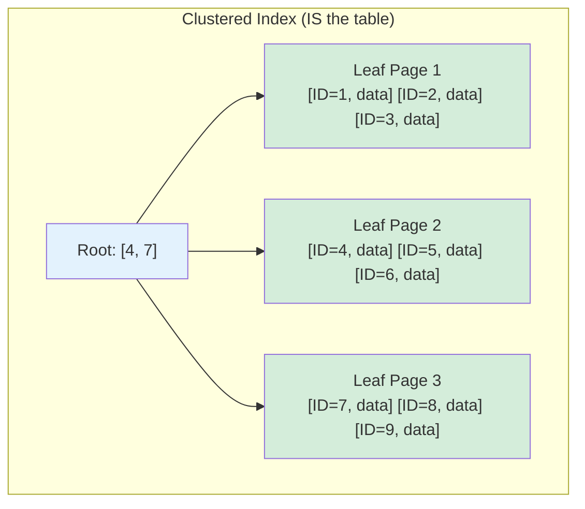
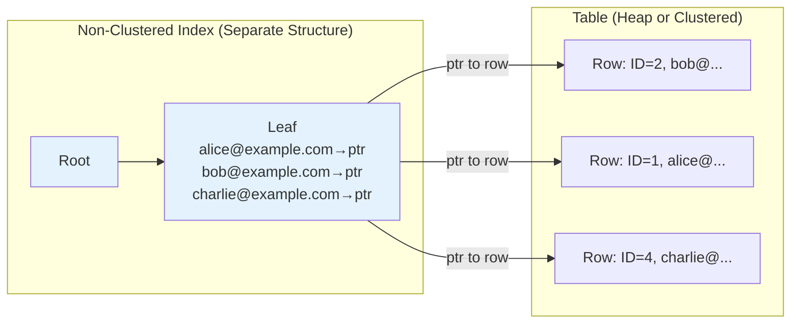

# Clustered vs Non-Clustered Indexes

## Overview

The distinction between clustered and non-clustered indexes is about **how data is physically stored** relative to the index. A clustered index determines the physical order of rows in the table; a non-clustered index is a separate structure that points to the data.

## Clustered Index

### What is a Clustered Index?

A clustered index **IS the table**. The table's rows are physically stored in the order of the clustered index key. There can be **only one clustered index** per table because the data can only be sorted one way.

```
Clustered Index on ID:
  Physical disk pages:
    Page 1: [ID=1, ...] [ID=2, ...] [ID=3, ...]
    Page 2: [ID=4, ...] [ID=5, ...] [ID=6, ...]
    Page 3: [ID=7, ...] [ID=8, ...] [ID=9, ...]
  
  Data IS the index — no separate structure needed
```

### How It Works



### Properties

| Property | Detail |
|---|---|
| Physical order | Rows stored in index key order |
| Number per table | Exactly one |
| Leaf nodes | Contain actual data rows |
| Range queries | Very efficient (sequential scan) |
| Insert performance | Good for sequential inserts, poor for random |
| Storage | No extra space (data IS the index) |

### Clustered Index in Different Databases

**MySQL InnoDB:**
- Primary key IS the clustered index
- If no primary key, InnoDB creates a hidden 6-byte row ID
- All secondary indexes contain the primary key as the row pointer

```sql
-- InnoDB: Primary key is the clustered index
CREATE TABLE users (
    id INT PRIMARY KEY,  -- Clustered index
    email VARCHAR(255),
    name VARCHAR(255)
);
```

**SQL Server:**
- Clustered index can be on any column(s)
- If no clustered index, the table is a "heap"

```sql
-- SQL Server: Explicit clustered index
CREATE CLUSTERED INDEX idx_users_id ON users(id);

-- Or define in table creation
CREATE TABLE users (
    id INT PRIMARY KEY CLUSTERED,
    email VARCHAR(255)
);
```

**PostgreSQL:**
- Does NOT have clustered indexes in the traditional sense
- Has CLUSTER command to physically reorder table once
- But doesn't maintain order on subsequent inserts

```sql
-- PostgreSQL: CLUSTER reorders table once
CLUSTER users USING idx_users_id;

-- But new inserts are NOT automatically ordered
```

## Non-Clustered Index

### What is a Non-Clustered Index?

A non-clustered index is a **separate data structure** that contains the index key and a pointer to the actual data row. Multiple non-clustered indexes can exist on a table.

```
Non-Clustered Index on email:
  Index structure:
    'alice@example.com' → Row pointer (page 2, slot 3)
    'bob@example.com'   → Row pointer (page 1, slot 1)
    'charlie@example.com' → Row pointer (page 3, slot 2)
  
  Table (unchanged):
    Page 1: [ID=2, email='bob@...', ...] [ID=1, email='alice@...', ...]
    Page 2: [ID=5, email='eve@...', ...]  [ID=3, email='alice@...', ...]
    Page 3: [ID=4, email='charlie@...', ...]
```

### How It Works



### Properties

| Property | Detail |
|---|---|
| Physical order | Does NOT affect table order |
| Number per table | Multiple (typically 999 max) |
| Leaf nodes | Contain key + row pointer |
| Range queries | Requires following pointers (less efficient) |
| Insert performance | Independent of table order |
| Storage | Extra space for index structure |

### Row Pointer Formats

**Heap table (no clustered index):**
- Row ID (page number, slot number)
- Fixed address, doesn't change

**With clustered index (InnoDB):**
- Primary key value
- Must look up via clustered index (extra lookup)
- This is why InnoDB secondary indexes are "larger" — they store PK values

## Key Lookup (Bookmark Lookup)

When a non-clustered index doesn't contain all needed columns, the database must perform a **key lookup** to fetch the full row:

```
Query: SELECT * FROM users WHERE email = 'alice@example.com'

With non-clustered index on email:
  1. Search index for 'alice@example.com' → find row pointer
  2. Fetch full row from table using pointer (KEY LOOKUP)
  3. Return result

Key lookup is an extra random I/O operation
```

### Mermaid Diagram: Key Lookup


### Avoiding Key Lookups

1. **Covering index**: Include all needed columns in the index
2. **Clustered index**: Data is in the leaf nodes, no lookup needed
3. **Index-only scan**: If index has all columns, skip lookup

## Comparison Table

| Aspect | Clustered | Non-Clustered |
|---|---|---|
| Physical order | Determines table order | Independent |
| Per table | Exactly one | Multiple |
| Leaf contains | Actual data rows | Key + pointer |
| Key lookup | Not needed | May be needed |
| Range queries | Very efficient | Less efficient |
| Storage | No extra space | Extra space |
| Insert impact | Affects table order | No impact on table |
| Best for | Primary key, range queries | Secondary lookups |

## Example: Performance Difference

```
Table: orders (10M rows)
Query: SELECT * FROM orders WHERE order_date BETWEEN '2023-01-01' AND '2023-01-31'
Result: 100,000 rows

With clustered index on order_date:
  - Data is physically sorted by order_date
  - Scan consecutive pages: 100,000 rows / 100 rows per page = 1,000 page reads
  - Sequential I/O: fast

With non-clustered index on order_date:
  - Index lookup: O(log n) = ~23 page reads
  - Key lookup for each row: 100,000 random page reads
  - Random I/O: SLOW
  
  - Or skip key lookup if covering index: still need 100,000 index entries
```

## InnoDB Clustered Index Internals

### Primary Key as Clustered Index

In InnoDB, the primary key IS the clustered index. All data is stored in primary key order.

```
InnoDB Page Structure:
  Page Header
  Infimum/Supremum records
  User records (ordered by PK)
  Free space
  Page directory
  Page trailer
```

### Secondary Index Structure

InnoDB secondary indexes store the primary key value as the row pointer:

```
Secondary Index on email:
  'alice@example.com' → PK=1
  'bob@example.com'   → PK=2
  'charlie@example.com' → PK=3

To fetch full row:
  1. Search secondary index → find PK
  2. Search clustered index (PK) → find full row
  
  This is called a "double lookup"
```

### Why This Matters

```
Small PK (INT, 4 bytes):
  Secondary index entry size = email + 4 bytes (PK)
  → Compact, fast

Large PK (UUID, 36 bytes):
  Secondary index entry size = email + 36 bytes (PK)
  → Larger index, slower lookups
  
  This is why UUID primary keys are discouraged in InnoDB
```

## Interview Questions

### Beginner

**Q1: What is the difference between clustered and non-clustered indexes?**
A: A clustered index determines the physical order of data in the table — the data IS the index. A non-clustered index is a separate structure with pointers to the data. There can be only one clustered index but many non-clustered indexes per table.

**Q2: How many clustered indexes can a table have?**
A: Exactly one. The data can only be physically sorted one way. In MySQL InnoDB, the primary key is always the clustered index.

**Q3: What is a key lookup?**
A: When a non-clustered index doesn't contain all columns needed by a query, the database must fetch the full row from the table using the row pointer. This is an extra random I/O operation.

### Intermediate

**Q4: Why does InnoDB store the primary key in secondary indexes?**
A: Because InnoDB uses the primary key as the row pointer (since the clustered index IS the primary key). When a secondary index is used, the PK value is looked up to find the full row via the clustered index.

**Q5: Why are UUID primary keys bad for InnoDB?**
A: UUIDs are 36 bytes and random. They make the clustered index large and cause random inserts (page splits). Secondary indexes also become larger because they store the UUID PK. Use auto-increment integers instead.

**Q6: How does PostgreSQL handle clustering?**
A: PostgreSQL doesn't have clustered indexes. The CLUSTER command physically reorders the table once, but new inserts go to the end. Use CLUSTER periodically on tables where range queries on a specific column are common.

### Advanced / FAANG-Level

**Q7: Design a table schema for a high-write table with queries on both ID and timestamp.**
A: (1) Use auto-increment ID as primary key (clustered index in InnoDB) for sequential inserts. (2) Create non-clustered index on timestamp for range queries. (3) If timestamp range queries are very common and return many rows, consider partitioning by timestamp. (4) Use covering index if queries only need specific columns. (5) Consider using a composite index on (timestamp, id) for timestamp-ordered scans.

**Q8: A table has a clustered index on (A, B) and a non-clustered index on (C). Query: SELECT * FROM table WHERE C = 10 ORDER BY A, B. How does the optimizer handle this?**
A: Two options: (1) Use non-clustered index on C to find matching rows, then key lookup for each row, then sort by (A, B). This is expensive if many rows match. (2) Full scan of clustered index (already sorted by A, B) and filter on C. The optimizer chooses based on estimated cost — if C is very selective (<1%), option 1 is better; otherwise option 2.

**Q9: Compare the performance characteristics of clustered vs non-clustered indexes for a query returning 1% of rows vs 50% of rows.**
A: 1% of rows: Non-clustered index + key lookup is fine (~1% random reads). Clustered index is also fast. Both are comparable. 50% of rows: Clustered index shines — sequential scan of half the table. Non-clustered index with 50% key lookups is terrible (50% random reads). For large result sets, clustered indexes are significantly faster due to sequential I/O.

## Common Mistakes

1. **Creating clustered index on random column** — Clustered index should be on a column that benefits from physical ordering (range queries, sequential access).

2. **Using UUID as clustered index in InnoDB** — Random inserts cause page splits, and secondary indexes bloat. Use auto-increment.

3. **Not understanding key lookup cost** — Non-clustered indexes with many key lookups can be slower than full table scan. Use covering indexes.

4. **Creating too many non-clustered indexes** — Each index adds overhead to writes. Be selective.

5. **Ignoring clustered index size** — The clustered index IS the table. A large clustered key (e.g., composite of 5 columns) bloats every secondary index.

## Summary

| Aspect | Clustered | Non-Clustered |
|---|---|---|
| Data storage | Rows in index key order | Separate structure |
| Per table | One | Many |
| Leaf nodes | Actual data | Key + pointer |
| Range queries | Sequential (fast) | Random (slower) |
| Key lookup | Not needed | May be needed |
| Best for | Primary key, range queries | Secondary lookups |

## Cross-References

- [B+ Tree](./b-plus-tree.md) — Structure used for both types
- [Covering Index](./covering-index.md) — Avoiding key lookups
- [Composite Index](./composite-index.md) — Multi-column indexes
- [Index Tuning](./tuning.md) — Choosing the right index strategy


## Cross References

- [B+ Tree](../dbms/indexing/b-plus-tree.md)
- [File Organization](../dbms/storage/file-organization.md)
- [Buffer Pool](../dbms/caching/buffer-pool.md)
- [Disk Allocation (OS)](../os/filesystems/disk-allocation.md)
