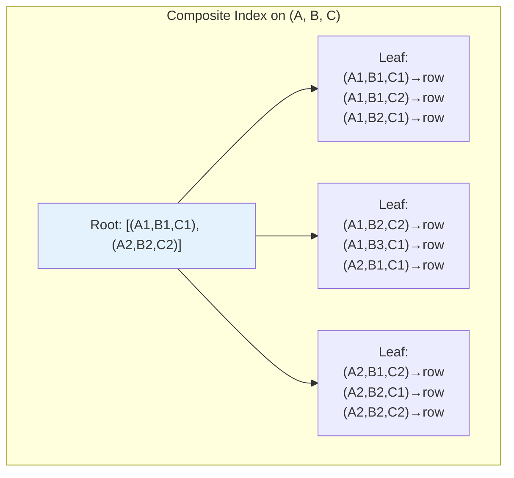
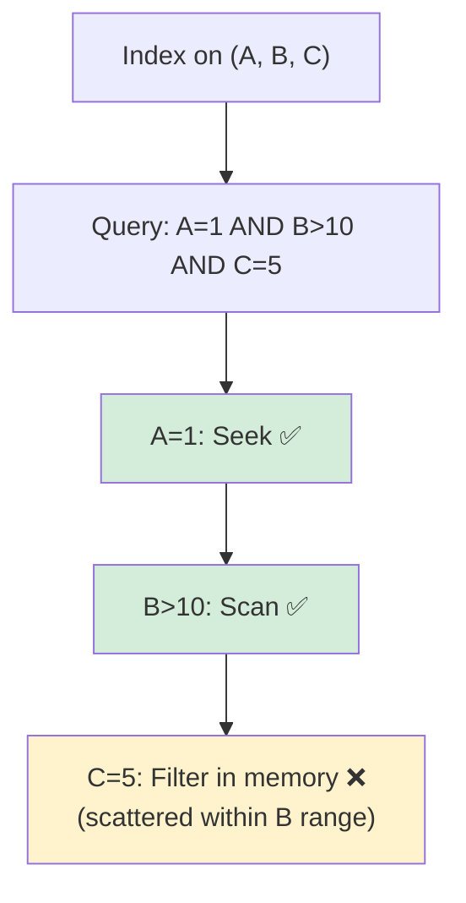

# Composite Index

## Overview

A composite index (also called a **multi-column index** or **compound index**) is an index on **two or more columns**. Composite indexes are essential for queries that filter, sort, or group by multiple columns. Understanding the **leftmost prefix rule** is critical for designing effective composite indexes.

## Structure

A composite index is a B+ Tree where the sort order is determined by the column order:

```
Composite Index on (last_name, first_name, age):

  The data is sorted by:
    1. last_name (primary sort)
    2. first_name (secondary sort, within same last_name)
    3. age (tertiary sort, within same last_name + first_name)

  Like a phone book sorted by last name, then first name
```

### Mermaid Diagram: Composite Index Structure



## Leftmost Prefix Rule

The most important rule for composite indexes:

> A composite index on (A, B, C) can be used for queries that filter on:
> - A alone
> - A and B
> - A, B, and C
> 
> But **NOT** for:
> - B alone
> - C alone
> - B and C

### Why?

The index is sorted by A first, then B, then C. Without A, the values of B and C are scattered throughout the index (not sorted).

```
Index on (A, B, C):
  Sorted: (1,1,1), (1,1,2), (1,2,1), (1,2,2), (2,1,1), (2,1,2), ...

Query WHERE B = 1:
  B=1 appears at: (1,1,1), (1,1,2), (2,1,1), (2,1,2)
  These are NOT contiguous in the index!
  → Cannot use index efficiently
```

### Examples

```sql
CREATE INDEX idx ON orders (customer_id, order_date, status);

-- ✅ Can use index (leftmost prefix)
SELECT * FROM orders WHERE customer_id = 123;
SELECT * FROM orders WHERE customer_id = 123 AND order_date > '2023-01-01';
SELECT * FROM orders WHERE customer_id = 123 AND order_date > '2023-01-01' AND status = 'pending';

-- ❌ Cannot use index (skips leftmost)
SELECT * FROM orders WHERE order_date > '2023-01-01';
SELECT * FROM orders WHERE status = 'pending';
SELECT * FROM orders WHERE order_date > '2023-01-01' AND status = 'pending';

-- ⚠️ Partial use (only customer_id)
SELECT * FROM orders WHERE customer_id = 123 AND status = 'pending';
-- Uses index for customer_id, must filter status in memory
```

## Column Order Matters

The order of columns in a composite index determines which queries it can serve.

### Guidelines for Column Order

1. **Equality columns first**: Columns used with `=` in WHERE
2. **Range columns next**: Columns used with `>`, `<`, `BETWEEN`, `LIKE`
3. **Sort columns last**: Columns used in ORDER BY

```sql
-- Query pattern:
SELECT * FROM orders 
WHERE customer_id = 123 
  AND order_date > '2023-01-01' 
ORDER BY order_date;

-- Optimal index:
CREATE INDEX idx ON orders (customer_id, order_date);
-- customer_id: equality (first)
-- order_date: range + sort (second)
```

### Why This Order?

```
Index on (customer_id, order_date):
  1. Seek to customer_id = 123 (B-Tree seek)
  2. Scan order_date > '2023-01-01' (already sorted within customer_id)
  3. Results are already in order_date order (no sort needed!)

Index on (order_date, customer_id):
  1. Can't seek to customer_id directly (it's the second column)
  2. Must scan all order_dates, filtering by customer_id
  3. Much less efficient
```

## Range Queries and Column Order

After a range column, subsequent columns in the index **cannot be used for seeking**:

```sql
CREATE INDEX idx ON orders (customer_id, order_date, status);

-- Query: customer_id = 123 AND order_date > '2023-01-01' AND status = 'pending'
-- Index usage:
--   customer_id: equality ✅ (seeks)
--   order_date: range ✅ (scans within customer_id)
--   status: CANNOT seek ❌ (scattered within order_date range)

-- The index is used for customer_id and order_date
-- status must be filtered in memory
```

### Mermaid Diagram: Range Query Limitation



## Composite Index for ORDER BY

A composite index can satisfy ORDER BY if the columns match:

```sql
CREATE INDEX idx ON orders (customer_id, order_date DESC);

-- Query: ORDER BY customer_id, order_date DESC
-- ✅ Index provides sorted order (no sort needed)

-- Query: ORDER BY order_date, customer_id
-- ❌ Different order than index
```

### Mixed ASC/DESC

```sql
-- PostgreSQL supports mixed sort directions
CREATE INDEX idx ON orders (customer_id ASC, order_date DESC);

-- Query: ORDER BY customer_id ASC, order_date DESC
-- ✅ Index matches exactly
```

## Composite Index for GROUP BY

```sql
CREATE INDEX idx ON orders (customer_id, status);

-- Query: GROUP BY customer_id, status
-- ✅ Index provides grouped order (no hash/aggregate needed)

-- Query: GROUP BY status, customer_id
-- ❌ Different order than index
```

## Composite Index Selectivity

### Column Selectivity Order

Place the **most selective column first** (highest cardinality):

```sql
-- Column stats:
-- customer_id: 100,000 distinct values (high selectivity)
-- status: 5 distinct values (low selectivity)
-- region: 10 distinct values (low selectivity)

-- Better: high selectivity first
CREATE INDEX idx ON orders (customer_id, status, region);

-- Worse: low selectivity first
CREATE INDEX idx ON orders (status, region, customer_id);
```

### Exception: Query Pattern Override

If queries always filter on status first, put status first even if it's less selective:

```sql
-- All queries have WHERE status = 'pending'
-- Even though status is low selectivity, it must be first
CREATE INDEX idx ON orders (status, customer_id, region);
```

## Composite Index and Covering Index

Combine composite index with INCLUDE for covering:

```sql
-- Query: SELECT total_amount WHERE customer_id = 123 AND order_date > '2023-01-01'
CREATE INDEX idx ON orders (customer_id, order_date) INCLUDE (total_amount);

-- customer_id, order_date: for filtering/sorting
-- total_amount: for retrieval (stored in leaf only)
```

## Real-World Examples

### E-Commerce Order Lookup

```sql
-- Query: Get recent orders for a customer
SELECT * FROM orders 
WHERE customer_id = 123 
ORDER BY order_date DESC 
LIMIT 10;

-- Optimal index
CREATE INDEX idx_orders_customer_date 
ON orders (customer_id, order_date DESC);
```

### User Search

```sql
-- Query: Search users by name and age range
SELECT * FROM users 
WHERE last_name = 'Smith' 
  AND first_name LIKE 'J%' 
  AND age BETWEEN 20 AND 30;

-- Optimal index
CREATE INDEX idx_users_name_age 
ON users (last_name, first_name, age);
-- last_name: equality
-- first_name: range (LIKE prefix)
-- age: range (BETWEEN) — but scattered within first_name range
```

### Report Query

```sql
-- Query: Monthly sales by region
SELECT region, SUM(amount) 
FROM sales 
WHERE sale_date >= '2023-01-01' 
  AND sale_date < '2023-02-01'
GROUP BY region;

-- Optimal index
CREATE INDEX idx_sales_date_region 
ON sales (sale_date, region) INCLUDE (amount);
-- sale_date: range filter
-- region: GROUP BY
-- amount: covering (for SUM)
```

## Index Intersection vs Composite Index

Some databases can use **multiple single-column indexes** and intersect the results:

```sql
-- Two single-column indexes
CREATE INDEX idx_customer ON orders (customer_id);
CREATE INDEX idx_status ON orders (status);

-- Query: WHERE customer_id = 123 AND status = 'pending'
-- Database may:
-- 1. Look up idx_customer → set of row IDs
-- 2. Look up idx_status → set of row IDs
-- 3. Intersect the two sets
-- 4. Fetch matching rows
```

### When to Use Which

| Scenario | Approach |
|---|---|
| Queries always use both columns | Composite index |
| Queries use columns independently | Single-column indexes |
| One column is very selective, other isn't | Composite (selective first) |
| Both columns have high selectivity | Composite or intersection |

## Interview Questions

### Beginner

**Q1: What is a composite index?**
A: A composite index is an index on two or more columns. It's sorted by the first column, then the second, and so on. It can serve queries that filter on the leftmost columns of the index.

**Q2: What is the leftmost prefix rule?**
A: A composite index on (A, B, C) can be used for queries on A, (A, B), or (A, B, C), but not on B alone or C alone. The query must use a leftmost prefix of the index columns.

**Q3: How do you choose the order of columns in a composite index?**
A: Put equality columns first, range columns next, and sort columns last. Also consider selectivity — more selective columns generally go first, but query patterns matter more.

### Intermediate

**Q4: Why can't a range column be followed by a seek column in a composite index?**
A: After a range condition (e.g., B > 10), the values of subsequent columns are not sorted within the range. The database must scan all entries in the range, so later columns can't be used for seeking.

**Q5: How does a composite index help with ORDER BY?**
A: If the index columns match the ORDER BY clause, the database can read the index in order without a separate sort step. This eliminates the cost of sorting, which is especially beneficial for large result sets.

**Q6: What is the difference between a composite index and index intersection?**
A: A composite index is a single index on multiple columns. Index intersection uses multiple single-column indexes, intersecting the results. Composite indexes are generally more efficient but require queries to use the leftmost prefix.

### Advanced / FAANG-Level

**Q7: A table has columns (A, B, C, D, E). Queries: Q1 filters on A, B and sorts by C. Q2 filters on B, C and sorts by D. Design optimal indexes.**
A: For Q1: Index on (A, B, C) — A and B for equality, C for sort. For Q2: Index on (B, C, D) — B and C for equality, D for sort. These are two separate composite indexes. Can't combine into one index that serves both queries efficiently due to different leftmost columns.

**Q8: You have a composite index on (A, B, C). A new query filters on A = 1 AND C = 3. Should you modify the index?**
A: The current index can seek on A but must scan all B values to filter C. Options: (1) Keep current index if the query is infrequent — it still uses A for seeking. (2) Create a new index on (A, C) if the query is frequent — enables seeking on both A and C. (3) Don't modify the existing index — it serves other queries well.

**Q9: How would you design composite indexes for a multi-tenant SaaS application where all queries include tenant_id?**
A: (1) Every index should start with tenant_id — this ensures index scans are scoped to one tenant. (2) Create tenant-specific composite indexes based on query patterns: (tenant_id, created_at), (tenant_id, status, created_at). (3) Use partial indexes if tenants have different query patterns. (4) Consider table partitioning by tenant_id for very large tenants. (5) Use INCLUDE for covering to avoid key lookups.

## Common Mistakes

1. **Ignoring leftmost prefix rule** — Creating index on (A, B, C) but querying on B alone. The index won't be used.

2. **Wrong column order** — Putting range columns before equality columns wastes the index's seeking capability.

3. **Too many columns in composite index** — More columns = larger index, slower writes. Limit to 3-4 columns.

4. **Creating redundant indexes** — Index on (A, B) makes index on (A) redundant (the composite index can serve A-only queries).

5. **Not considering ORDER BY** — A composite index can eliminate sorts. Design indexes to match common ORDER BY patterns.

6. **Overlapping composite indexes** — Index on (A, B) and (A, B, C) — the second makes the first redundant.

## Summary

| Aspect | Detail |
|---|---|
| Definition | Index on multiple columns |
| Sort order | By column order (A, then B, then C) |
| Leftmost prefix | Must use leftmost columns for seeking |
| Column order | Equality first, range next, sort last |
| Range limitation | After range column, later columns can't seek |
| ORDER BY | Can eliminate sort if columns match |
| Best for | Multi-column WHERE, ORDER BY, GROUP BY |

## Cross-References

- [B+ Tree](./b-plus-tree.md) — Structure used for composite indexes
- [Covering Index](./covering-index.md) — Composite + INCLUDE columns
- [Index Tuning](./tuning.md) — Designing optimal composite indexes
- [Clustered vs Non-Clustered](./clustered-vs-nonclustered.md) — Composite clustered indexes
