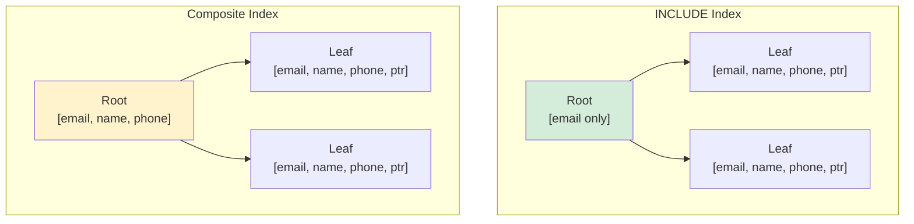

# Covering Index

## Overview

A covering index is an index that **contains all the columns needed by a query**, allowing the database to answer the query **entirely from the index** without accessing the table data (heap). This eliminates the key lookup operation and can dramatically improve performance.

Also known as: **index-only scan**, **index covering**.

## The Problem: Key Lookups

Without a covering index, the database may need to:
1. Search the index for matching entries
2. For each match, fetch the full row from the table (key lookup)

```
Query: SELECT name, email FROM users WHERE email = 'alice@example.com'

Non-covering index on (email):
  1. Search index → found 'alice@example.com'
  2. Key lookup → fetch row from table to get 'name'
  3. Return (name, email)

  Cost: Index search + 1 random I/O for key lookup
```

## The Solution: Covering Index

A covering index includes all columns the query needs:

```
Covering index on (email) INCLUDE (name):
  1. Search index → found 'alice@example.com', name='Alice Smith'
  2. Return directly from index

  Cost: Index search only (no key lookup!)
```

## How to Create Covering Indexes

### PostgreSQL (INCLUDE syntax)

```sql
-- Standard index with INCLUDE
CREATE INDEX idx_users_email_covering 
ON users (email) INCLUDE (name, phone);

-- Query uses index-only scan
EXPLAIN SELECT name, phone FROM users WHERE email = 'alice@example.com';
-- → Index Only Scan using idx_users_email_covering
```

### MySQL 8.0+ (INCLUDE syntax)

```sql
-- MySQL 8.0.13+ supports INCLUDE
CREATE INDEX idx_users_email_covering 
ON users (email) INCLUDE (name, phone);
```

### SQL Server (INCLUDE syntax)

```sql
-- SQL Server supports INCLUDE
CREATE NONCLUSTERED INDEX idx_users_email_covering 
ON users (email) INCLUDE (name, phone);
```

### Older MySQL (Composite index)

```sql
-- Before MySQL 8.0.13, use composite index
CREATE INDEX idx_users_covering 
ON users (email, name, phone);

-- This works but index is larger (name, phone in B-Tree)
```

## INCLUDE vs Composite Index

### INCLUDE Columns

Columns in INCLUDE are stored **only in leaf nodes**, not in internal nodes:

```
CREATE INDEX idx ON users (email) INCLUDE (name, phone);

Internal nodes: [email values only]
Leaf nodes: [email, name, phone, row pointer]

Advantage:
  - Internal nodes are smaller (higher fan-out)
  - Tree is shorter (fewer levels)
  - name and phone don't affect index ordering
```

### Composite Index

All columns are part of the B-Tree structure:

```
CREATE INDEX idx ON users (email, name, phone);

Internal nodes: [email, name, phone values]
Leaf nodes: [email, name, phone, row pointer]

Disadvantage:
  - Internal nodes are larger
  - name and phone affect index ordering
  - Can't use for queries on email alone if order matters
```

### Comparison



## When Covering Index Helps

### Good Candidates

```sql
-- Query only needs indexed columns
SELECT email, name FROM users WHERE email = 'alice@example.com';

-- Aggregate on indexed column
SELECT COUNT(*) FROM orders WHERE status = 'pending';

-- Join with only indexed columns
SELECT o.id, c.name 
FROM orders o JOIN customers c ON o.customer_id = c.id
WHERE o.status = 'shipped';
```

### Not Helpful

```sql
-- Query needs columns not in index
SELECT * FROM users WHERE email = 'alice@example.com';
-- Covering index can't help — needs all columns

-- Query uses columns not in index for filtering
SELECT name FROM users WHERE age > 30;
-- If index is on (email) INCLUDE (name), can't use for age filter
```

## Visibility Map (PostgreSQL)

PostgreSQL uses a **visibility map** to enable index-only scans. The visibility map tracks which heap pages contain only tuples visible to all transactions.

```
If a page is "all-visible":
  → Index-only scan can skip the heap fetch
  
If a page is NOT all-visible:
  → Must fetch from heap to check visibility (MVCC)
```

```sql
-- Check visibility map
SELECT pg_visibility('users');

-- VACUUM to update visibility map
VACUUM users;
```

This means even with a covering index, PostgreSQL may still access the heap if the visibility map says some tuples aren't all-visible. Regular VACUUM helps.

## Examples

### Example 1: User Profile Query

```sql
-- Frequent query
SELECT name, email, avatar_url FROM users WHERE id = 12345;

-- Covering index
CREATE INDEX idx_users_profile ON users (id) INCLUDE (name, email, avatar_url);

-- EXPLAIN shows Index Only Scan
EXPLAIN ANALYZE SELECT name, email, avatar_url FROM users WHERE id = 12345;
```

### Example 2: Order Summary

```sql
-- Frequent query
SELECT customer_id, order_date, total_amount 
FROM orders 
WHERE status = 'pending' 
ORDER BY order_date DESC;

-- Covering index
CREATE INDEX idx_orders_pending 
ON orders (status, order_date DESC) 
INCLUDE (customer_id, total_amount);

-- EXPLAIN shows Index Only Scan with no Sort
```

### Example 3: Count Aggregation

```sql
-- Frequent query
SELECT COUNT(*) FROM orders WHERE status = 'shipped';

-- Covering index (only needs status column)
CREATE INDEX idx_orders_status ON orders (status);

-- EXPLAIN shows Index Only Scan
```

## Performance Impact

### Without Covering Index

```
Query: SELECT name, email FROM users WHERE email LIKE 'a%'
Result: 10,000 rows

Non-covering index on (email):
  1. Index scan: 10,000 entries
  2. Key lookup: 10,000 random I/Os
  3. Total: ~10,000 random I/Os (very slow)
```

### With Covering Index

```
Query: SELECT name, email FROM users WHERE email LIKE 'a%'
Result: 10,000 rows

Covering index on (email) INCLUDE (name):
  1. Index scan: 10,000 entries (all data in index)
  2. No key lookup needed
  3. Total: Sequential index scan (fast)
```

## Interview Questions

### Beginner

**Q1: What is a covering index?**
A: A covering index contains all columns needed by a query, allowing the database to answer the query entirely from the index without accessing the table. This eliminates key lookups and improves performance.

**Q2: How do you create a covering index?**
A: Use the INCLUDE clause: `CREATE INDEX idx ON table (search_column) INCLUDE (other_columns)`. The search column is used for filtering; INCLUDE columns are stored in leaf nodes for retrieval.

**Q3: When should you use a covering index?**
A: When a query frequently accesses specific columns and you can include all of them in an index. Especially beneficial for queries returning many rows where key lookups would be expensive.

### Intermediate

**Q4: What is the difference between INCLUDE columns and composite index columns?**
A: INCLUDE columns are stored only in leaf nodes (don't affect ordering or internal nodes). Composite index columns are part of the B-Tree structure (affect ordering and internal nodes). INCLUDE is better for "extra" columns not used for filtering.

**Q5: Why might PostgreSQL still access the heap even with a covering index?**
A: Because of MVCC visibility. PostgreSQL checks the visibility map to see if all tuples on a page are visible. If not, it must access the heap to check tuple visibility. Regular VACUUM updates the visibility map.

**Q6: How does a covering index affect index size?**
A: INCLUDE columns are stored only in leaf nodes, so they add less size than composite index columns (which are in all nodes). The leaf nodes are larger, but internal nodes remain compact.

### Advanced / FAANG-Level

**Q7: Design a covering index strategy for a query pattern that involves multiple similar queries on the same table.**
A: (1) Analyze all frequent queries on the table. (2) Identify the common filter columns and result columns. (3) Create a primary covering index for the most frequent query. (4) If other queries have different filter columns but similar result columns, consider additional covering indexes. (5) Use INCLUDE to avoid bloating the B-Tree. (6) Monitor index usage and remove unused indexes.

**Q8: A covering index makes an index 3x larger. Is it worth it?**
A: Depends on the workload. If the query runs frequently and returns many rows, the eliminated key lookups save significant I/O. Calculate: (key lookups saved per query) × (queries per second) × (I/O cost per lookup). If this exceeds the extra storage and maintenance cost, it's worth it. For OLAP queries on large tables, almost always worth it.

**Q9: How would you implement a covering index for a JSONB column query pattern?**
A: PostgreSQL GIN indexes on JSONB can't use INCLUDE. Instead: (1) Create a functional index on specific JSONB paths: `CREATE INDEX ON table ((data->>'name'))`. (2) Create a materialized view with extracted columns and index that. (3) Use a composite GIN index with `jsonb_path_ops` for containment queries. (4) Consider a separate lookup table with extracted columns.

## Common Mistakes

1. **Using composite index instead of INCLUDE** — Don't put retrieval-only columns in the search key. Use INCLUDE to keep internal nodes small.

2. **Not considering visibility map (PostgreSQL)** — Even with a covering index, PostgreSQL may access the heap. Run VACUUM regularly.

3. **Over-covering** — Don't include every column "just in case." Include only columns used by frequent queries. Extra columns bloat the index.

4. **Forgetting about SELECT *** — `SELECT *` can never be covered (unless the index IS the clustered index). Specify only needed columns.

5. **Not monitoring index-only scan usage** — Check EXPLAIN ANALYZE to verify index-only scans are happening.

## Summary

| Aspect | Detail |
|---|---|
| Definition | Index containing all columns needed by a query |
| Benefit | Eliminates key lookups, enables index-only scans |
| Creation | `CREATE INDEX ... ON table(col) INCLUDE (other_cols)` |
| INCLUDE columns | Stored in leaf nodes only |
| PostgreSQL caveat | Visibility map may require heap access |
| Best for | Frequent queries on specific columns |

## Cross-References

- [Clustered vs Non-Clustered](./clustered-vs-nonclustered.md) — Clustered indexes naturally cover all columns
- [Composite Index](./composite-index.md) — Alternative approach
- [Index Tuning](./tuning.md) — When to create covering indexes
- [MVCC](../transactions/mvcc.md) — Visibility map and index-only scans


## Cross References

- [Composite Index](composite-index.md)
- [Clustered vs Nonclustered](clustered-vs-nonclustered.md)
- [Query Optimization](../query-processing/optimization.md)
