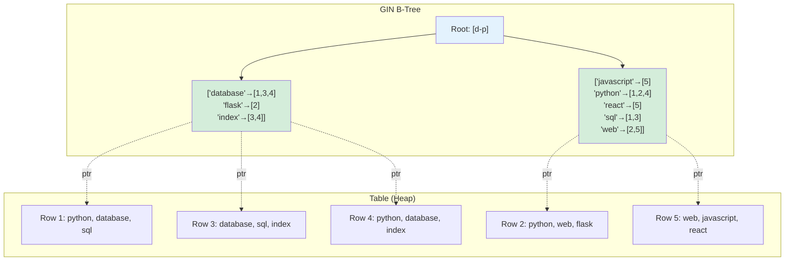

# GIN Index (PostgreSQL)

## Overview

GIN (Generalized Inverted Index) is a PostgreSQL index structure optimized for **multi-valued data** — columns that contain multiple values per row, such as arrays, JSONB, full-text search vectors, and hstore. GIN builds an **inverted index** that maps each value to the set of rows containing it.

GIN is the go-to index for containment queries (`@>`, `<@`), existence checks (`?`, `?|`, `?&`), and full-text search.

## What GIN Can Index

| Data Type | Example Predicates | Use Case |
|---|---|---|
| Array (`int[]`, `text[]`) | Contains, overlap, equality | Tags, categories |
| JSONB | Contains, existence, key lookup | Document storage |
| tsvector (full-text) | Matches (@@) | Text search |
| hstore | Contains, exist | Key-value pairs |
| Trigram (pg_trgm) | Similarity, LIKE, ILIKE | Fuzzy text matching |

## Structure

### Inverted Index Concept

An inverted index maps each unique value to a sorted list of row IDs (posting list):

```
Table: documents (5 rows)
Row 1: tags = ['python', 'database', 'sql']
Row 2: tags = ['python', 'web', 'flask']
Row 3: tags = ['database', 'sql', 'index']
Row 4: tags = ['python', 'database', 'index']
Row 5: tags = ['web', 'javascript', 'react']

Inverted Index:
  'database'  → [1, 3, 4]
  'flask'     → [2]
  'index'     → [3, 4]
  'javascript'→ [5]
  'python'    → [1, 2, 4]
  'react'     → [5]
  'sql'       → [1, 3]
  'web'       → [2, 5]
```

### GIN B-Tree Structure

GIN uses a B-Tree to store the keys, with posting lists (or posting trees for large lists) as the leaf values:

```
Gin B-Tree:
  Internal nodes: key ranges
  Leaf nodes: key → posting list/tree

  'database' → [1, 3, 4]
  'python'   → [1, 2, 4]
  ...
```

### Mermaid Diagram: GIN Structure



## Operations

### Containment Query (`@>`)

```
Query: Find documents where tags @> ['python', 'database']

Step 1: Get posting lists
  'python'   → [1, 2, 4]
  'database' → [1, 3, 4]

Step 2: Intersect
  [1, 2, 4] ∩ [1, 3, 4] = [1, 4]

Result: Rows 1 and 4
```

### Overlap Query (`&&`)

```
Query: Find documents where tags && ['sql', 'javascript']

Step 1: Get posting lists
  'sql'        → [1, 3]
  'javascript' → [5]

Step 2: Union
  [1, 3] ∪ [5] = [1, 3, 5]

Result: Rows 1, 3, and 5
```

### Existence Query (JSONB)

```sql
-- JSONB data
CREATE TABLE events (
    id SERIAL PRIMARY KEY,
    data JSONB
);

INSERT INTO events (data) VALUES 
    ('{"type": "click", "page": "home", "user": {"id": 1}}'),
    ('{"type": "view", "page": "about", "user": {"id": 2}}');

CREATE INDEX idx_events_data ON events USING GIN (data);

-- Existence check
SELECT * FROM events WHERE data ? 'type';
SELECT * FROM events WHERE data ?| array['type', 'page'];
SELECT * FROM events WHERE data ?& array['type', 'page'];

-- Containment
SELECT * FROM events WHERE data @> '{"type": "click"}';
```

## GIN for Full-Text Search

```sql
-- Full-text search setup
CREATE TABLE articles (
    id SERIAL PRIMARY KEY,
    title TEXT,
    body TEXT,
    tsv TSVECTOR GENERATED ALWAYS AS (
        to_tsvector('english', coalesce(title, '') || ' ' || coalesce(body, ''))
    ) STORED
);

CREATE INDEX idx_articles_tsv ON articles USING GIN (tsv);

-- Full-text query
SELECT * FROM articles 
WHERE tsv @@ to_tsquery('english', 'postgresql & index');

-- Phrase search (GIN supports phrase search with positions)
SELECT * FROM articles 
WHERE tsv @@ phraseto_tsquery('english', 'database index');
```

## GIN for Trigram Search

```sql
-- Enable pg_trgm extension
CREATE EXTENSION pg_trgm;

-- Trigram GIN index for fuzzy matching
CREATE INDEX idx_name_trgm ON users USING GIN (name gin_trgm_ops);

-- LIKE queries now use index
SELECT * FROM users WHERE name LIKE '%alice%';

-- Similarity search
SELECT * FROM users WHERE similarity(name, 'alise') > 0.3;
```

## GIN Fast Update

GIN has two modes for handling updates:

### Fast Update (Default)

New entries go into a **pending list** (unsorted). When the pending list reaches a threshold, it's merged into the main index in bulk.

```
Pros: Fast inserts (append to pending list)
Cons: Queries must scan pending list (slower queries)

Tuning:
  gin_pending_list_limit = 4MB  (default)
```

### Bulk Update (No Pending List)

```sql
CREATE INDEX idx_name ON table USING GIN (column) 
  WITH (fastupdate = off);
```

All inserts go directly into the main index:
- Slower inserts (must update B-Tree)
- Faster queries (no pending list scan)

## GIN vs GiST

| Aspect | GIN | GiST |
|---|---|---|
| Structure | Inverted index (B-Tree of keys → posting lists) | Balanced tree with predicate summaries |
| Query speed | Faster for exact match | Faster for containment/overlap |
| Update speed | Slower (must update posting lists) | Faster (simpler structure) |
| Index size | Larger (stores all keys) | Smaller (stores summaries) |
| Lossy? | No (exact) | Can be (requires recheck) |
| Best for | Arrays, JSONB, full-text | Geometric, ranges, custom |

## GIN Index Creation

```sql
-- Basic GIN index
CREATE INDEX idx_name ON table USING GIN (column);

-- GIN with operator class
CREATE INDEX idx_name ON table USING GIN (column jsonb_path_ops);

-- GIN on expression
CREATE INDEX idx_name ON table USING GIN (to_tsvector('english', column));

-- GIN with fast update disabled
CREATE INDEX idx_name ON table USING GIN (column) WITH (fastupdate = off);
```

### JSONB Operator Classes

```sql
-- Default: supports @>, ?, ?|, ?&
CREATE INDEX idx_data ON table USING GIN (data);

-- jsonb_path_ops: only @>, faster and smaller
CREATE INDEX idx_data ON table USING GIN (data jsonb_path_ops);
```

`jsonb_path_ops` is smaller and faster but only supports `@>` (containment). Use it if you only need containment queries.

## Interview Questions

### Beginner

**Q1: What is a GIN index?**
A: GIN (Generalized Inverted Index) is a PostgreSQL index for multi-valued data like arrays, JSONB, and full-text search. It maps each unique value to a list of rows containing it, enabling fast containment and overlap queries.

**Q2: When should you use GIN instead of B-Tree?**
A: When indexing columns that contain multiple values per row (arrays, JSONB, full-text vectors) or when you need containment/overlap queries rather than simple equality/range queries.

**Q3: What is the fast update feature in GIN?**
A: Fast update buffers new entries in a pending list instead of immediately updating the main index. This speeds up inserts but slightly slows queries (must scan pending list). The pending list is periodically merged into the main index.

### Intermediate

**Q4: What is the difference between GIN and GiST for full-text search?**
A: GIN is faster for search (inverted index lookup) but slower for updates (must update posting lists). GiST is faster for updates but slower for search (may return false positives requiring recheck). Use GIN for read-heavy, GiST for write-heavy.

**Q5: What is the difference between default and jsonb_path_ops GIN operator classes?**
A: Default supports all JSONB operators (@>, ?, ?|, ?&). jsonb_path_ops only supports @> (containment) but is smaller and faster. Use jsonb_path_ops if you only need containment queries.

**Q6: How does GIN handle large posting lists?**
A: When a posting list exceeds a threshold, it's converted to a **posting tree** (a separate B-Tree storing the row IDs). This maintains efficient lookup even for very common values.

### Advanced / FAANG-Level

**Q7: Design a GIN index strategy for a JSONB column that stores product attributes with millions of products.**
A: (1) Use GIN with jsonb_path_ops if only containment queries are needed — it's 2-3x smaller and faster. (2) Create partial indexes on frequently queried keys: `CREATE INDEX ON products USING GIN ((data->'category'))`. (3) For complex path queries, use GIN on the full JSONB column. (4) Monitor index size — GIN indexes can be 2-10x the table size. (5) Consider using BRIN for time-based filtering in combination with GIN.

**Q8: A GIN index on a tsvector column is 5x the table size. How do you reduce it?**
A: (1) Limit the number of indexed terms using `tsvector` with `stat_update` — remove very common and very rare words. (2) Use `simple` dictionary instead of `english` to avoid stemming overhead. (3) Consider GiST instead if updates are frequent. (4) Use partial indexes: only index recent rows. (5) Use `COALESCE` to avoid indexing NULL rows. (6) Consider using `rum` extension for better full-text index performance.

**Q9: How would you implement a real-time search system using GIN indexes?**
A: (1) Use GIN on tsvector for full-text search. (2) Enable fast update for real-time inserts. (3) Set `gin_pending_list_limit` appropriately for your insert rate. (4) Use `ts_rank` for relevance scoring. (5) For autocomplete, use GIN with pg_trgm. (6) Consider using `rum` extension which provides better ranking with GIN-like performance. (7) Implement search result caching for frequent queries.

## Common Mistakes

1. **Using GIN for scalar columns** — B-Tree is more efficient for simple equality/range queries on single-valued columns.

2. **Not choosing jsonb_path_ops** — If you only need `@>` queries on JSONB, `jsonb_path_ops` is smaller and faster.

3. **Ignoring fast update trade-offs** — Fast update speeds inserts but slows queries. Disable it for read-heavy workloads.

4. **Not monitoring GIN index size** — GIN indexes can be very large. Monitor and consider GiST if space is a concern.

5. **Using GIN for geometric data** — GiST is the right choice for spatial/geometric data. GIN is for multi-valued scalar data.

## Summary

| Aspect | Detail |
|---|---|
| Structure | Inverted index (B-Tree of keys → posting lists) |
| Best for | Arrays, JSONB, full-text, trigram |
| Query speed | Fast for containment/existence |
| Update speed | Fast update mode (pending list) |
| Index size | Can be large (stores all keys) |
| Operator classes | Default (all ops), jsonb_path_ops (containment only) |
| Used by | PostgreSQL (native) |

## Cross-References

- [GiST Index](./gist.md) — Alternative for geometric/range data
- [B+ Tree](./b-plus-tree.md) — For scalar data
- [Index Tuning](./tuning.md) — Choosing between GIN and GiST
- [Covering Index](./covering-index.md) — Covering GIN indexes
