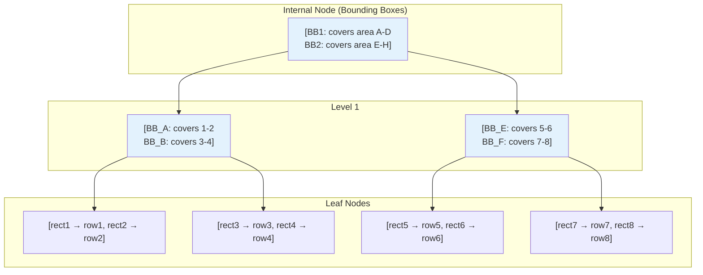

# GiST Index (PostgreSQL)

## Overview

GiST (Generalized Search Tree) is a **balanced, tree-based index structure** in PostgreSQL that supports a wide variety of data types and search predicates. Unlike B-Tree, which only supports total ordering, GiST can index **geometric data, full-text, ranges, arrays, and custom types**.

GiST is not a single index but an **index framework** — it provides the tree structure while the data type defines the search predicates through operator classes.

## What GiST Can Index

| Data Type | Example Predicates | Use Case |
|---|---|---|
| Geometric | Contains, intersects, within | GIS, spatial data |
| Range | Overlaps, contains, adjacent | Date ranges, price ranges |
| Full-text (tsvector) | Matches, @@ | Text search |
| Network (inet) | Contains, contained by | IP address ranges |
| Custom | User-defined | Anything with a consistent predicate |

## Structure

### GiST Node Structure

Each GiST node contains:
- **Keys**: Predicate summaries for child subtrees
- **Pointers**: To child nodes (internal) or heap tuples (leaves)

```
Internal Node: [(predicate1, ptr1), (predicate2, ptr2), ...]
  predicate_i is a summary (bounding box, union, etc.) of all entries in subtree i

Leaf Node: [(predicate1, heap_ptr1), (predicate2, heap_ptr2), ...]
  predicate_i is the actual indexed value
  heap_ptr_i points to the table row
```

### Mermaid Diagram: GiST Structure (R-Tree for Geometric Data)



## GiST Operator Classes

GiST is extensible through **operator classes** that define:
1. **Consistent**: Does a key match the search predicate?
2. **Union**: Combine multiple keys into a parent summary
3. **Compress/Decompress**: Key compression
4. **Penalty**: Cost of inserting into a subtree (for choosing best path)
5. **PickSplit**: How to split an overflowing node

### Example: Range Operator Class

```sql
-- Range types in PostgreSQL
CREATE TABLE reservations (
    id SERIAL PRIMARY KEY,
    room_id INT,
    during TSRANGE  -- Range of timestamps
);

CREATE INDEX idx_reservations_during ON reservations USING GIST (during);

-- Queries using GiST predicates
SELECT * FROM reservations 
WHERE during && '[2023-01-01, 2023-01-31]'::tsrange;  -- Overlaps

SELECT * FROM reservations 
WHERE during @> '2023-01-15'::timestamp;  -- Contains
```

## Common GiST Use Cases

### 1. Geometric / Spatial Data

```sql
-- PostGIS extension for geographic data
CREATE TABLE places (
    id SERIAL PRIMARY KEY,
    name TEXT,
    location GEOMETRY(Point, 4326)
);

CREATE INDEX idx_places_location ON places USING GIST (location);

-- Find places within a bounding box
SELECT * FROM places 
WHERE location && ST_MakeEnvelope(-74.0, 40.7, -73.9, 40.8, 4326);

-- Find places within distance
SELECT * FROM places 
WHERE ST_DWithin(location, ST_MakePoint(-73.98, 40.75), 1000);
```

### 2. Range Types

```sql
-- Booking system
CREATE TABLE bookings (
    id SERIAL PRIMARY KEY,
    room_id INT,
    during TSTZRANGE,
    EXCLUDE USING GIST (room_id WITH =, during WITH &&)  -- No overlapping bookings
);

-- Find all bookings overlapping a period
SELECT * FROM bookings 
WHERE during && '[2023-06-01, 2023-06-30]'::tstzrange;
```

### 3. Full-Text Search

```sql
-- Full-text search with GiST
CREATE TABLE documents (
    id SERIAL PRIMARY KEY,
    content TEXT,
    tsv TSVECTOR
);

CREATE INDEX idx_documents_tsv ON documents USING GIST (tsv);

-- Search for documents containing words
SELECT * FROM documents 
WHERE tsv @@ to_tsquery('english', 'postgresql & index');
```

## GiST vs B-Tree

| Aspect | GiST | B-Tree |
|---|---|---|
| Data types | Geometric, range, full-text, custom | Scalar types (int, text, date) |
| Predicates | Contains, intersects, overlaps, within | Equality, range (<, >, BETWEEN) |
| Structure | Balanced tree with predicate summaries | Balanced tree with sorted keys |
| Extensibility | Fully extensible via operator classes | Fixed to total ordering |
| Performance | Good for complex predicates | Best for simple comparisons |
| NULL handling | Good | Good |

## GiST vs GIN

| Aspect | GiST | GIN |
|---|---|---|
| Best for | Containment, overlap, geometric | Multi-valued data (arrays, JSON, full-text) |
| Update speed | Faster | Slower (inverted index) |
| Query speed | Slower for exact match | Faster for exact match |
| Index size | Smaller | Larger |
| Lossy? | Can be (needs recheck) | No |

## GiST Index Creation

```sql
-- Basic GiST index
CREATE INDEX idx_name ON table USING GIST (column);

-- GiST with operator class
CREATE INDEX idx_name ON table USING GIST (column gist_trgm_ops);

-- GiST on expression
CREATE INDEX idx_name ON table USING GIST (function(column));

-- GiST with fill factor
CREATE INDEX idx_name ON table USING GIST (column) WITH (fillfactor = 90);
```

## Performance Considerations

### Page Splits

GiST uses a **split algorithm** (similar to R-Tree split) when a node overflows:
1. Choose two seeds (entries that are farthest apart)
2. Assign remaining entries to the closer seed
3. If either child underflows, reassign entries

### PickSplit Strategies

Different data types use different split strategies:
- **Geometric**: R-Tree split (area-based)
- **Range**: Union-based
- **Full-text**: Frequency-based

### Lossy vs Exact

GiST indexes can be **lossy** — the index may return false positives that require rechecking against the actual data:

```
Query: Find all rectangles that contain point (5, 5)

GiST might return:
  - Rectangles that definitely contain (5, 5) ✓
  - Rectangles whose bounding box contains (5, 5) but don't actually contain it ✗

Recheck: Filter false positives by checking actual geometry
```

## Interview Questions

### Beginner

**Q1: What is a GiST index?**
A: GiST (Generalized Search Tree) is a PostgreSQL index structure that supports complex data types and predicates like geometric containment, range overlaps, and full-text search. It's an extensible framework where data types define their own search predicates.

**Q2: When should you use GiST instead of B-Tree?**
A: When you need to index non-scalar data types (geometric, range, full-text) or need predicates beyond equality and range comparison (contains, intersects, overlaps).

**Q3: What is the difference between GiST and GIN?**
A: GiST is better for containment and overlap queries on geometric/range data, with faster updates but potentially lossy results. GIN is better for multi-valued data (arrays, JSON, full-text) with faster exact-match queries but slower updates.

### Intermediate

**Q4: How does GiST handle false positives?**
A: GiST can return false positives (lossy index). The query executor rechecks each candidate row against the actual data to filter out false matches. This adds CPU overhead but keeps the index smaller.

**Q5: What is an operator class in GiST?**
A: An operator class defines how a data type interacts with GiST. It provides functions for consistent (predicate matching), union (parent summary creation), penalty (subtree selection), and picksplit (node splitting).

**Q6: How does the EXCLUDE constraint work with GiST?**
A: EXCLUDE constraints use GiST to prevent overlapping values. For example, `EXCLUDE USING GIST (room_id WITH =, during WITH &&)` prevents two bookings for the same room from overlapping in time.

### Advanced / FAANG-Level

**Q7: Design a GiST operator class for a custom "fuzzy text" data type that supports similarity search.**
A: (1) Define the data type as a set of n-grams (e.g., trigrams). (2) Consistent function: check if query n-grams overlap with stored n-grams. (3) Union function: combine all n-grams from child entries. (4) Penalty function: measure the increase in the union size. (5) PickSplit: partition entries to minimize union overlap. (6) Use similarity threshold for rechecking. This is essentially how pg_trgm works.

**Q8: A GiST index on a geometric column is 10x larger than expected. How do you optimize?**
A: (1) Check for fragmentation: REINDEX. (2) Reduce fillfactor to allow more entries per page. (3) Use key compression if available. (4) Consider if the bounding boxes are overlapping excessively — may need better data clustering. (5) Use CLUSTER on the table to physically order rows by the geometric column. (6) Consider using SP-GiST (Space-Partitioned GiST) for better partitioning of space.

**Q9: How does GiST compare to R-Tree for spatial indexing?**
A: GiST is a generalization that can implement R-Tree behavior. PostgreSQL's GiST for geometric data uses R-Tree-like splits. However, dedicated R-Tree implementations (like PostGIS's default index) may have optimizations for spatial data. GiST's advantage is extensibility; dedicated R-Tree's advantage is specialization.

## Common Mistakes

1. **Using GiST for simple scalar comparisons** — B-Tree is faster and more efficient for equality and range queries on scalar types.

2. **Not understanding lossy results** — GiST may return false positives. Always expect rechecks in the query plan.

3. **Not using EXCLUDE constraints** — GiST can enforce complex constraints (like non-overlapping ranges) that B-Tree can't.

4. **Choosing GiST over GIN for full-text search** — GIN is faster for full-text search; GiST is faster for updates. Choose based on read vs write workload.

5. **Not considering SP-GiST** — For data that naturally partitions space (quad-trees, k-d trees, radix trees), SP-GiST may be more efficient.

## Summary

| Aspect | Detail |
|---|---|
| Structure | Balanced tree with predicate summaries |
| Data types | Geometric, range, full-text, custom |
| Extensibility | Via operator classes |
| Lossy | Can be (requires recheck) |
| Best for | Containment, overlap, spatial queries |
| Used by | PostgreSQL (native) |

## Cross-References

- [GIN Index](./gin.md) — Alternative for multi-valued data
- [B+ Tree](./b-plus-tree.md) — For scalar data
- [Index Tuning](./tuning.md) — Choosing between GiST, GIN, and B-Tree
- [Bitmap Index](./bitmap-index.md) — For low-cardinality analytical queries


## Cross References

- [GIN](gin.md)
- [B-Tree](b-tree.md)
- [B+ Tree](b-plus-tree.md)
