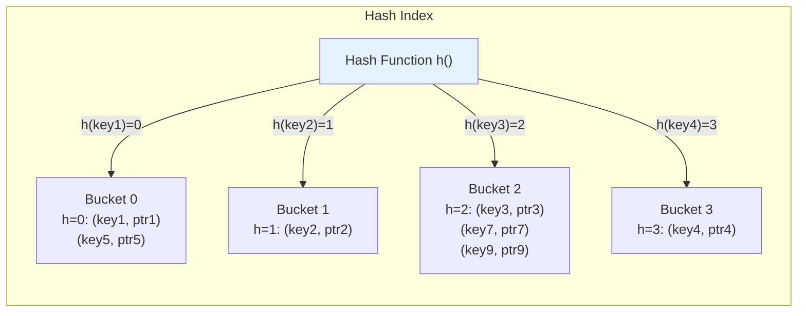
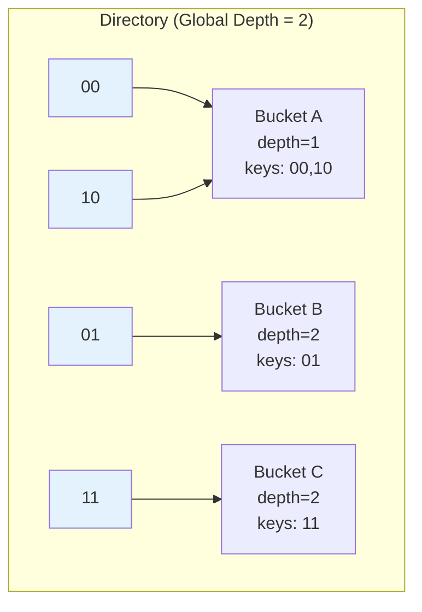

# Hash Index

## Overview

A hash index uses a **hash table** to map keys to bucket locations. It provides **O(1) average-case** time complexity for exact-match lookups, making it the fastest index for point queries. However, hash indexes **cannot support range queries** or ordering operations.

Hash indexes are used when you need fast lookups on exact values and don't need range scans.

## Structure

### Hash Table

A hash index consists of:
- **Hash function**: Maps keys to bucket numbers
- **Buckets**: Array of slots, each containing (key, pointer) pairs
- **Overflow chains**: For handling hash collisions

```
Hash Index Structure:
  hash_function(key) → bucket_number
  bucket[bucket_number] → list of (key, record_pointer) pairs
```

### Mermaid Diagram: Hash Index Structure



## Operations

### Search (Point Query)

```
Search(key):
  1. Compute bucket = hash_function(key) mod num_buckets
  2. Scan bucket for matching key
  3. Return record pointer

Time: O(1) average, O(n) worst case (all keys in same bucket)
```

### Insert

```
Insert(key, pointer):
  1. Compute bucket = hash_function(key) mod num_buckets
  2. If bucket has space:
     Add (key, pointer) to bucket
  3. Else (overflow):
     Create overflow bucket, chain it
     
Time: O(1) average
```

### Delete

```
Delete(key):
  1. Compute bucket = hash_function(key) mod num_buckets
  2. Find and remove (key, pointer) from bucket
  3. If bucket empty and has overflow chain:
     Optionally remove overflow bucket
     
Time: O(1) average
```

## Hash Functions

A good hash function for database indexes should:
1. Be **uniform**: distribute keys evenly across buckets
2. Be **fast**: O(1) computation
3. Be **deterministic**: same key always maps to same bucket

### Common Hash Functions

```python
# Division method
h(key) = key mod m  (m = number of buckets, prefer prime)

# Multiplication method
h(key) = floor(m * (key * A mod 1))  (A = golden ratio ≈ 0.618)

# MurmurHash / CityHash (used in practice)
h(key) = murmur3(key) mod m
```

## Handling Collisions

### Chaining (Open Hashing)

Each bucket contains a linked list of entries that hash to the same bucket.

```
Bucket 2: [key3, ptr3] → [key7, ptr7] → [key9, ptr9] → NULL
```

### Open Addressing (Closed Hashing)

If a bucket is full, probe for the next empty bucket.

```
Linear Probing: h(key, i) = (h(key) + i) mod m
Quadratic Probing: h(key, i) = (h(key) + i²) mod m
Double Hashing: h(key, i) = (h1(key) + i * h2(key)) mod m
```

## Dynamic Hashing

Static hash tables have a fixed number of buckets. When the table grows, performance degrades. Dynamic hashing solves this:

### Extendible Hashing

```
- Global depth: number of bits used to determine bucket
- Local depth: number of bits shared by all keys in a bucket
- Directory: array of 2^global_depth pointers to buckets

When a bucket overflows:
  1. If local depth < global depth:
     Split the bucket (increase local depth)
  2. If local depth == global depth:
     Double the directory (increase global depth)
     Then split the bucket
```

### Mermaid Diagram: Extendible Hashing



### Linear Hashing

```
- Buckets are split in order (round-robin)
- Split pointer tracks which bucket to split next
- Uses a family of hash functions h0, h1, h2, ...
- Level determines which hash function to use

Split trigger: When average chain length exceeds threshold
```

## Hash Index in PostgreSQL

PostgreSQL supports hash indexes since version 10 (with WAL support):

```sql
-- Create hash index
CREATE INDEX idx_users_email_hash ON users USING HASH (email);

-- Use in query
SELECT * FROM users WHERE email = 'alice@example.com';
```

### Hash Index vs B-Tree in PostgreSQL

| Aspect | Hash Index | B-Tree Index |
|---|---|---|
| Point query | O(1) | O(log n) |
| Range query | Not supported | O(log n + k) |
| Size | Smaller | Larger |
| WAL support | Since PG 10 | Always |
| Unique constraint | Can't enforce | Can enforce |
| NULL handling | Good | Good |

## Hash Index in MySQL

MySQL InnoDB doesn't support explicit hash indexes, but:
- Adaptive hash index (AHI) automatically creates hash indexes in memory
- MEMORY engine supports hash indexes

```sql
-- MySQL MEMORY engine with hash index
CREATE TABLE lookup (
    id INT,
    name VARCHAR(100),
    INDEX USING HASH (name)
) ENGINE = MEMORY;
```

## Comparison: Hash Index vs B+ Tree

| Operation | Hash Index | B+ Tree |
|---|---|---|
| Exact match (=) | **O(1)** ✓ | O(log n) |
| Range (>, <, BETWEEN) | **Not supported** ✗ | O(log n + k) ✓ |
| ORDER BY | **Not supported** ✗ | Supported ✓ |
| LIKE 'prefix%' | **Not supported** ✗ | Supported ✓ |
| MIN/MAX | O(n) ✗ | O(log n) ✓ |
| Space | Smaller | Larger |

## When to Use Hash Indexes

```
Good:
  ✓ Exact equality lookups (WHERE key = value)
  ✓ High-cardinality columns (many unique values)
  ✓ Point queries with no range requirements
  ✓ Caching layer / lookup tables

Bad:
  ✗ Range queries (WHERE key BETWEEN x AND y)
  ✗ Sorting (ORDER BY key)
  ✗ Prefix matching (WHERE key LIKE 'abc%')
  ✗ Aggregations (MIN, MAX)
```

## Interview Questions

### Beginner

**Q1: What is a hash index?**
A: A hash index uses a hash table to map keys to bucket locations. It provides O(1) average-case lookup for exact matches but cannot support range queries or ordering.

**Q2: When should you use a hash index instead of a B+ Tree?**
A: When you only need exact-match lookups (WHERE key = value) and never need range queries, sorting, or prefix matching. Hash indexes are faster for point queries but more limited.

**Q3: What is a hash collision?**
A: When two different keys hash to the same bucket. Handled by chaining (linked list in bucket) or open addressing (probe for next empty slot).

### Intermediate

**Q4: What is extendible hashing?**
A: A dynamic hashing scheme that can grow the hash table by doubling the directory when buckets overflow. Uses global and local depth to determine how many bits of the hash are used for bucket selection.

**Q5: Why doesn't PostgreSQL support unique constraints on hash indexes?**
A: Because hash indexes don't store keys in sorted order, making it impossible to efficiently detect duplicates during insertion. B-Tree indexes can detect duplicates by scanning adjacent leaf entries.

**Q6: What is MySQL's adaptive hash index?**
A: InnoDB automatically builds hash indexes in memory for frequently accessed index pages. It monitors access patterns and creates hash indexes for B-Tree pages that are accessed frequently, improving point query performance.

### Advanced / FAANG-Level

**Q7: Design a hash index that supports range queries.**
A: Use a combination approach: (1) Primary structure: hash table for O(1) point lookups. (2) Secondary structure: maintain a sorted order index (like a skip list) for range queries. (3) Alternatively, use a Cuckoo hash table with ordered buckets — each bucket maintains entries in sorted order, and adjacent buckets cover contiguous key ranges. (4) This adds overhead but provides both O(1) point queries and reasonable range performance.

**Q8: A hash index has 10 million entries and 100,000 buckets. What's the expected chain length, and how does this affect performance?**
A: Expected chain length = 10M / 100K = 100 entries per bucket. With chaining, this means O(100) comparisons per lookup — no longer O(1). Solutions: (1) Increase number of buckets (resize); (2) Use a better hash function to reduce clustering; (3) Switch to extendible or linear hashing for dynamic resizing; (4) Use Cuckoo hashing for worst-case O(1) lookups.

**Q9: Compare hash indexes with bloom filters for membership testing.**
A: Hash index: exact membership testing with pointers to data. O(1) lookup, supports deletion, stores full keys. Bloom filter: probabilistic membership testing (false positives possible). O(1) lookup, no deletion (standard), stores no keys — only tests "definitely not in set" or "probably in set". Use bloom filters for pre-filtering (skip disk reads if bloom says "not in set"), hash indexes for actual data access.

## Common Mistakes

1. **Using hash index for range queries** — Hash indexes can't support range scans. Use B+ Tree instead.

2. **Not resizing hash table** — Static hash tables degrade as data grows. Use dynamic hashing (extendible or linear).

3. **Poor hash function** — A bad hash function causes clustering, degrading performance to O(n). Use well-tested hash functions (MurmurHash, xxHash).

4. **Using hash index on low-cardinality column** — Many keys hash to the same bucket, causing long chains. B+ Tree is better for low-cardinality.

5. **Ignoring hash index limitations in PostgreSQL** — Hash indexes couldn't be WAL-logged before PostgreSQL 10. Don't use them on older versions.

## Summary

| Aspect | Detail |
|---|---|
| Structure | Hash table with buckets |
| Point query | O(1) average |
| Range query | Not supported |
| Insert/Delete | O(1) average |
| Best for | Exact-match lookups |
| Limitation | No ordering, no range queries |
| Dynamic hashing | Extendible, Linear hashing |

## Cross-References

- [B+ Tree](./b-plus-tree.md) — Alternative for range queries
- [Bitmap Index](./bitmap-index.md) — Alternative for low-cardinality
- [Index Tuning](./tuning.md) — When to choose hash vs B+ Tree
- [Covering Index](./covering-index.md) — Covering hash indexes
