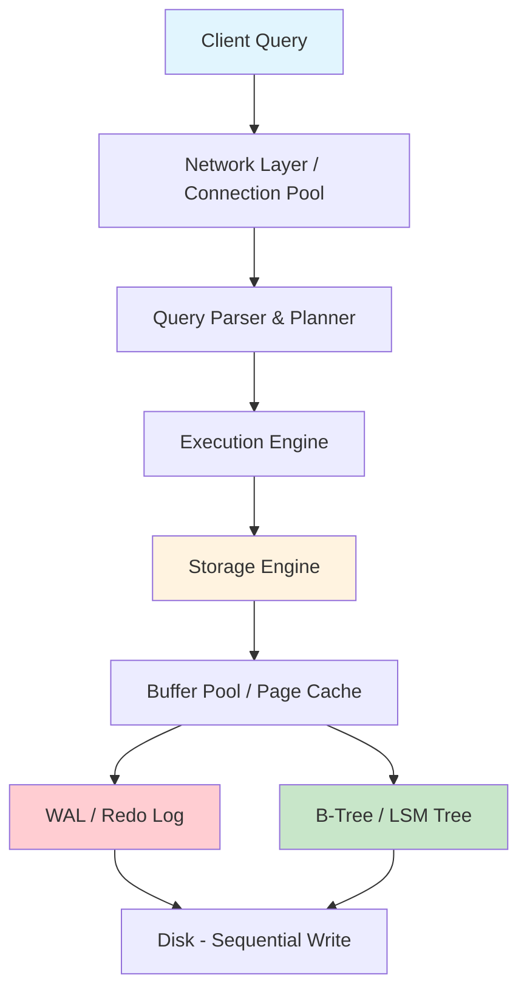
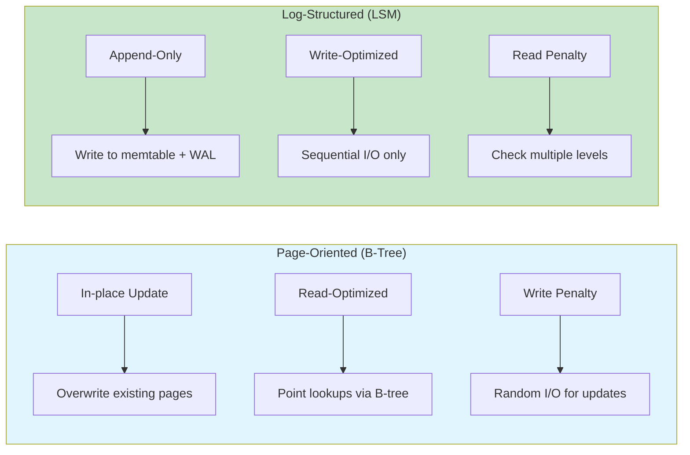
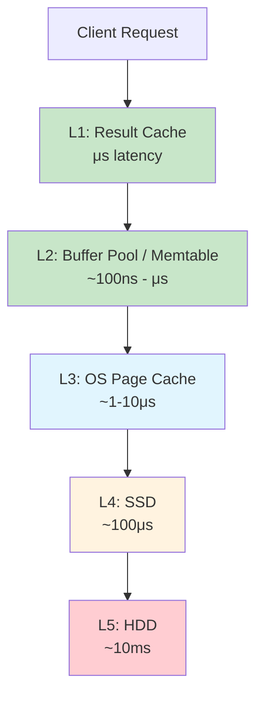
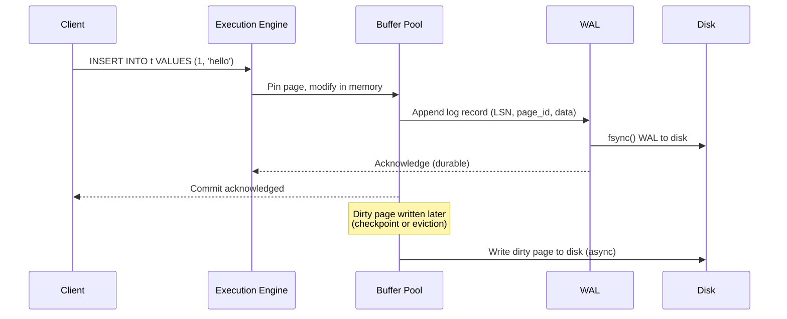
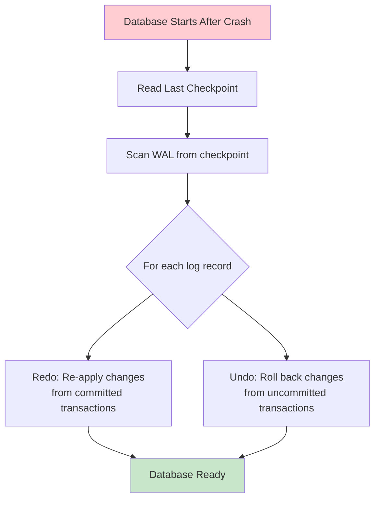

# Database Internals

## Overview

Database internals refer to the low-level mechanisms that make a database work: how data is stored on disk, how writes are made durable, how reads are served efficiently, and how the system recovers from crashes. Understanding internals is critical for database engineers, SREs, and anyone who needs to reason about performance, reliability, and correctness at scale.

This section covers the core building blocks that every modern storage engine uses, regardless of whether it's a relational DBMS (PostgreSQL, MySQL) or a NoSQL store (RocksDB, Cassandra).

## Detailed Explanation

### High-Level Architecture

### Storage Engine Components

Every storage engine must solve these fundamental problems:

| Component | Purpose | Examples |
|-----------|---------|---------|
| **Buffer Pool** | Cache hot pages in memory | InnoDB buffer pool, PostgreSQL shared buffers |
| **WAL** | Ensure durability of committed data | InnoDB redo log, PostgreSQL WAL, RocksDB WAL |
| **Data Structure** | Organize data for efficient access | B+ trees (InnoDB), LSM trees (RocksDB) |
| **Concurrency Control** | Allow safe concurrent access | MVCC (PostgreSQL), latch coupling (B-tree) |
| **Recovery** | Restore consistent state after crash | ARIES, WAL replay |
| **Compaction** | Reclaim space, optimize layout | LSM compaction, VACUUM (PostgreSQL) |

### Page-Oriented vs. Log-Structured Storage

| Aspect | Page-Oriented (B-Tree) | Log-Structured (LSM) |
|--------|----------------------|---------------------|
| **Write Pattern** | Random I/O (in-place update) | Sequential I/O (append-only) |
| **Read Pattern** | O(log N) tree traversal | May check multiple levels |
| **Space Amplification** | Some (fragmented pages) | Higher (multiple copies during compaction) |
| **Write Amplification** | Moderate (page splits, WAL) | Varies by compaction strategy |
| **Used By** | InnoDB, PostgreSQL, SQL Server | RocksDB, Cassandra, LevelDB |

### The Memory Hierarchy of a Database

### How a Write Travels Through the Engine

**Key insight:** The write is acknowledged as soon as the WAL record is on disk — the actual data page may be written later. This is the core of the **WAL protocol**.

### Crash Recovery Flow

### Real-World Engine Architectures

| Database | Storage Engine | Data Structure | WAL | Concurrency |
|----------|---------------|---------------|-----|-------------|
| **PostgreSQL** | Heap files | B-tree (default index) | WAL segments | MVCC |
| **MySQL/InnoDB** | Tablespace files | B+ tree (clustered) | Redo log + undo log | MVCC + gap locks |
| **MySQL/MyISAM** | MYD + MYI files | B-tree (non-clustered) | None (crash-unsafe) | Table-level locks |
| **RocksDB** | SST files | LSM tree | WAL files | MVCC (snapshot) |
| **SQLite** | Single file | B-tree | WAL mode or journal | Database-level locks |
| **Cassandra** | SSTables | LSM tree | Commit log | Tunable consistency |

## Cross-References

- [WAL (Write-Ahead Logging)](./wal.md) — The fundamental protocol for durability
- [LSM Trees](./lsm-trees.md) — Log-structured merge trees for write-heavy workloads
- [Compaction](./compaction.md) — Strategies for reclaiming space in LSM engines
- [Database Engines](./engines.md) — Detailed comparison of InnoDB, MyISAM, RocksDB, SQLite, PostgreSQL

## Interview Questions

### Beginner

**Q: What is the role of a storage engine in a DBMS?**
A: The storage engine is responsible for storing and retrieving data on disk. It manages the buffer pool, WAL, data structures (B-tree or LSM), concurrency control, and crash recovery. MySQL famously allows pluggable storage engines (InnoDB, MyISAM, etc.).

**Q: Why do databases use a buffer pool instead of reading directly from disk?**
A: Disk I/O is orders of magnitude slower than memory access (~100μs SSD vs ~100ns RAM). The buffer pool caches frequently accessed pages in memory, reducing disk reads. Dirty pages are written back to disk asynchronously.

**Q: What is the difference between a dirty page and a clean page?**
A: A **dirty page** has been modified in the buffer pool but not yet written to disk. A **clean page** is identical in memory and on disk. Only dirty pages need to be flushed during checkpoints.

### Intermediate

**Q: Explain the WAL protocol and why it's essential.**
A: The WAL (Write-Ahead Logging) protocol states that log records must be written to stable storage *before* the corresponding data pages are modified on disk. This ensures that committed transactions are durable even if the system crashes immediately after commit. The log record contains enough information to redo or undo the change.

**Q: What is write amplification, and why does it matter?**
A: Write amplification is the ratio of actual bytes written to storage vs. bytes written by the application. In LSM trees, data is written to the WAL, then to the memtable, then flushed to SSTables, then compacted — each level causes additional writes. High write amplification reduces SSD lifespan and throughput.

**Q: Compare page-oriented and log-structured storage engines.**
A: Page-oriented engines (InnoDB, PostgreSQL) update data in-place using B-trees, offering fast reads but suffering from random I/O on writes. Log-structured engines (RocksDB, Cassandra) append all writes sequentially, offering fast writes but requiring compaction to reclaim space and optimize reads.

### Advanced (FAANG-Level)

**Q: Design a storage engine for a workload that is 95% writes with small key-value pairs. What tradeoffs would you make?**
A: Use an LSM-tree architecture (like RocksDB):
- **WAL** for durability on every write
- **Memtable** (skip list or red-black tree) for in-memory buffering
- **Leveled compaction** to bound read amplification
- **Bloom filters** on each SSTable to avoid unnecessary reads
- Tune `write_buffer_size`, `level0_file_num_compaction_trigger`, and `max_bytes_for_level_base` to balance write throughput vs. space amplification

**Q: How does the ARIES recovery algorithm work, and how does it differ from simple WAL replay?**
A: ARIES (Algorithm for Recovery and Isolation Exploiting Semantics) uses three passes during recovery:
1. **Analysis pass**: Determine dirty pages and active transactions at crash time
2. **Redo pass**: Replay all log records from the oldest dirty page's LSN forward
3. **Undo pass**: Roll back all uncommitted transactions by applying compensation log records (CLRs)

Unlike simple WAL replay, ARIES uses **physiological logging** (page-level redo, logical undo) and handles partial page writes, fuzzy checkpoints, and nested top actions.

**Q: A database has a 1GB buffer pool and processes 10,000 TPS with an 80% cache hit rate. The SSD can do 50,000 random IOPS. Is this sustainable? What if the hit rate drops to 60%?**
A: At 80% hit rate: 2,000 disk reads/sec needed — well within 50,000 IOPS. At 60%: 4,000 disk reads/sec — still fine. But if writes also need I/O (dirty page flushes + WAL fsyncs), total I/O budget shrinks. At very low hit rates (e.g., 10%), you'd need 9,000 reads/sec for 10,000 TPS, plus write I/O. The bottleneck becomes the storage device's IOPS capacity.

## Common Mistakes

1. **Confusing WAL with data pages**: The WAL is a sequential log; data pages are the actual table/index storage. Both must be on disk for durability, but the WAL is written first.

2. **Assuming all databases use B-trees**: LSM trees are equally important, especially in NoSQL and modern OLTP databases (RocksDB, Cassandra, CockroachDB).

3. **Ignoring write amplification**: In LSM engines, compaction can cause 10-30x write amplification. This matters for SSD lifespan and throughput.

4. **Thinking buffer pool eviction is random**: Most databases use LRU or clock algorithms to evict pages. Hot pages stay in memory.

5. **Forgetting that fsync is expensive**: Each `fsync()` call forces the OS to flush to physical storage, costing ~1ms on SSD. Group commit batches multiple transactions' fsyncs into one.

## Summary and Revision Notes

- **Storage engine** = buffer pool + WAL + data structure + concurrency control + recovery
- **Page-oriented** (B-tree): in-place update, read-optimized, random I/O on writes → InnoDB, PostgreSQL
- **Log-structured** (LSM): append-only, write-optimized, needs compaction → RocksDB, Cassandra
- **WAL protocol**: log before data — fundamental for durability and crash recovery
- **Buffer pool**: caches hot pages in memory; dirty pages flushed asynchronously
- **Crash recovery**: replay WAL (redo committed, undo uncommitted)
- **Write amplification**: ratio of actual disk writes to application writes — key performance metric
- **fsync**: forces OS buffer to physical disk; batch via group commit

## Cross References

- [WAL](../dbms/internals/wal.md)
- [LSM Trees](../dbms/internals/lsm-trees.md)
- [Buffer Pool](../dbms/caching/buffer-pool.md)
- [File Organization](../dbms/storage/file-organization.md)
