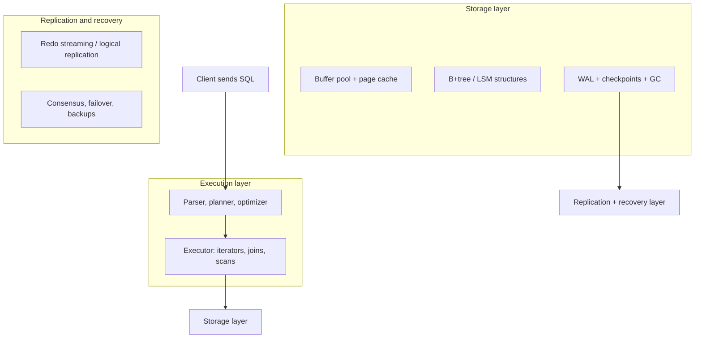
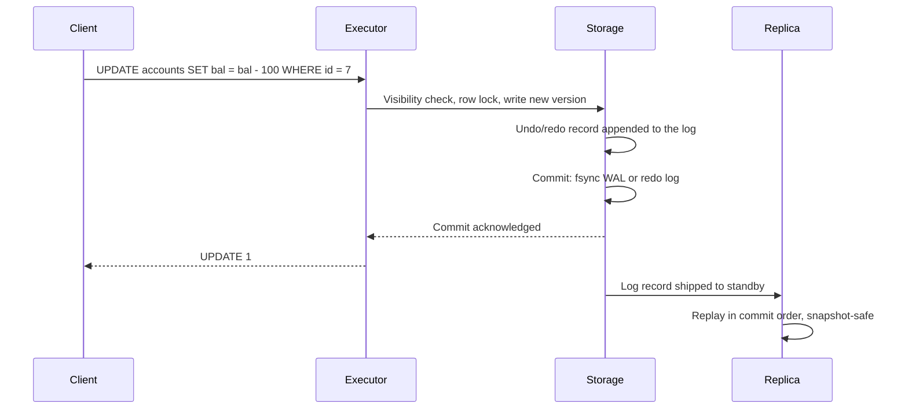
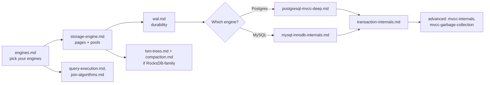

# Database Internals — Learning Map

## Overview

This directory is the internals track of the DBMS section: how engines actually store, execute, replicate, and recover data, at the level of pages, latches, log records, and version chains. Interviewers use internals questions to separate candidates who have *used* databases from candidates who can *diagnose and tune* them ("why is this table bloated?", "what limits our write throughput?"). Use this page as a map: pick the layer you are weak in, follow the links in order, and use the engine deep dives (PostgreSQL MVCC, InnoDB) as worked case studies that tie all three layers together.

## The Three Layers

Every client-server DBMS decomposes into three cooperating layers. Storage owns bytes on disk, execution owns the path from SQL to those bytes, and replication owns moving the durable record elsewhere before or after commit.

```mermaid
flowchart TD
    Q["Client sends SQL"] --> P["Execution layer"]
    subgraph EX["Execution layer"]
        P["Parser, planner, optimizer"]
        PE["Executor: iterators, joins, scans"]
        P --> PE
    end
    PE --> S["Storage layer"]
    subgraph ST["Storage layer"]
        BP["Buffer pool + page cache"]
        IX["B+tree / LSM structures"]
        WAL["WAL + checkpoints + GC"]
    end
    WAL --> R["Replication + recovery layer"]
    subgraph RP["Replication and recovery"]
        RS["Redo streaming / logical replication"]
        CO["Consensus, failover, backups"]
    end
```

| Layer | Core question it answers | Key mechanisms | Failure mode when ignored |
|---|---|---|---|
| **Execution** | How does SQL become page touches? | Parser, planner, Volcano iterators, join algorithms, access methods | Full scans, wrong join order, spilling hash joins |
| **Storage** | Where do the bytes live and when are they durable? | Pages, buffer pool, B+tree/LSM, WAL, MVCC, VACUUM/purge | Bloat, checkpoint stalls, torn pages, wraparound |
| **Replication** | How does another node get the same bytes? | Redo/log shipping, physical vs logical, quorum consensus, snapshots | Stale reads, split brain, unbounded replication lag |

The layers are coupled at two seams. The **WAL seam**: the execution layer's commits are only durable when the storage layer's log reaches disk, and the replication layer ships exactly that log. The **snapshot seam**: the storage layer's MVCC visibility rules define what concurrent execution and replica readback are allowed to see.

## One Commit, Three Layers

Trace a single UPDATE through all three layers and every internals page becomes relevant at once:

```mermaid
sequenceDiagram
    participant C as Client
    participant E as Executor
    participant S as Storage
    participant R as Replica
    C->>E: UPDATE accounts SET bal = bal - 100 WHERE id = 7
    E->>S: Visibility check, row lock, write new version
    S->>S: Undo/redo record appended to the log
    S->>S: Commit: fsync WAL or redo log
    S-->>E: Commit acknowledged
    E-->>C: UPDATE 1
    S->>R: Log record shipped to standby
    R->>R: Replay in commit order, snapshot-safe
```

The executor never touches disk directly; it asks the storage layer for pages and tuples. The storage layer never decides *what* is visible; it serves the snapshot the execution layer's isolation level demands. The replica never invents data; it applies the same durable log the primary needed for its own commit. Interview answers that walk this full path ("where does fsync happen?", "when is the row visible on the standby?") immediately outperform single-layer answers.

## Health Metrics by Layer

| Metric | Layer | Healthy signal / what a bad value means |
|---|---|---|
| Checkpoint age vs redo capacity (InnoDB) | Storage | Room to spare; near-capacity stalls writers — see [mysql-innodb-internals.md](./mysql-innodb-internals.md) |
| History list length (InnoDB) | Storage | Flat near zero; growth means purge lag or a pinned ReadView |
| Dead tuples, `age(datfrozenxid)` (PostgreSQL) | Storage | Bounded; climbing values mean vacuum is pinned or starved |
| Buffer pool hit ratio | Storage | > 99% on OLTP; lower means undersized pool or scan pollution |
| Heap Fetches on index-only scans | Storage | Near zero after vacuum; large means stale visibility map |
| Plan time, buffer reads per query | Execution | Stable; regressions mean plan flips or missing statistics |
| Replication lag | Replication | Sub-second on OLTP; growth means apply bottleneck or network |
| Longest transaction age | All layers | Seconds; hours means GC, wraparound, and lag all at risk |

## Layer 1 — Storage (pages in this directory)

| Page | What it covers | Read when asked about… |
|---|---|---|
| [Storage Engine Internals](./storage-engine.md) | Page layouts (PG heap 8 KB, InnoDB 16 KB), tuple IDs, buffer pools | Page anatomy, buffer management |
| [Write-Ahead Logging](./wal.md) | WAL protocol, LSNs, group commit, checkpoints, per-engine WAL | Durability, commit latency, recovery |
| [LSM Trees](./lsm-trees.md) | Memtables, SSTables, the full amplification trade-off | Write-heavy engines, RocksDB-style designs |
| [Compaction](./compaction.md) | Size-tiered vs leveled vs FIFO, rate limiting, SSD wear | Space/write amplification tuning |
| [Database Engines](./engines.md) | InnoDB vs MyISAM vs PostgreSQL heap vs RocksDB vs SQLite comparison | "Which engine and why" |
| [SQLite Internals](./sqlite-internals.md) | Single-file B-trees, rollback journal vs WAL, VDBE bytecode | Embedded databases, one-writer concurrency |
| [PostgreSQL MVCC Deep Dive](./postgresql-mvcc-deep.md) | xmin/xmax tuple headers, snapshots, HOT, VACUUM, wraparound math | Postgres bloat, vacuum tuning, freezing |
| [MySQL InnoDB Internals](./mysql-innodb-internals.md) | Buffer pool LRU, redo LSN math, read views, page splits, AHI | MySQL write path, redo sizing, clustered indexes |

## Layer 2 — Execution (pages in this directory)

| Page | What it covers | Read when asked about… |
|---|---|---|
| [Query Execution Models](./query-execution.md) | Volcano vs materialization vs vectorization, parallel execution | Iterator pattern, PG executor |
| [Query Optimization](./query-optimization.md) | Logical rewrites, physical plans, cost-based selection | "Why is this query slow" |
| [Join Algorithms](./join-algorithms.md) | Nested loop, hash (incl. grace), sort-merge; cost formulas | Join plan choice, memory sizing |
| [B-Tree Latching](./btree-latching.md) | Latches vs locks, crabbing, right-link rescue | Concurrent index modification |

## Layer 3 — Concurrency and Recovery (pages in this directory)

| Page | What it covers | Read when asked about… |
|---|---|---|
| [Transaction Internals](./transaction-internals.md) | XID lifecycle, undo/redo, ARIES, PG visibility rules, hint bits | Isolation implementation, crash recovery |
| Everything else | Recovery and replication are also covered from the log angle in [WAL](./wal.md) and cross-linked engine pages | End-to-end failure stories |

## Link Map to the Wider Book

The internals track does not live alone. These existing directories supply the concept-level pages that the internals pages assume, and they are the right cross-reference targets when you need background instead of depth.

| Directory | Relation to internals | Start with |
|---|---|---|
| [../advanced/](../advanced/README.md) | Cross-engine deep dives: MVCC internals, MVCC garbage collection, WAL internals, snapshot isolation, SSI, replication strategies | [../advanced/mvcc-internals.md](../advanced/mvcc-internals.md) |
| [../postgresql/](../postgresql/README.md) | Feature-level PostgreSQL overview: architecture, MVCC concepts, VACUUM, WAL, replication, JSONB, indexes | [../postgresql/README.md](../postgresql/README.md) |
| [../transactions/](../transactions/README.md) | Isolation levels, MVCC concepts, 2PL, ARIES, 2PC/3PC | [../transactions/isolation-levels.md](../transactions/isolation-levels.md) |
| [../indexing/](../indexing/README.md) | B+tree structure, covering indexes, hash/GiST/GIN | [../indexing/b-plus-tree.md](../indexing/b-plus-tree.md) |
| [../caching/](../caching/buffer-pool.md) | Buffer pool theory, eviction policies | [../caching/buffer-pool.md](../caching/buffer-pool.md) |
| [../storage/](../storage/README.md) | File organization, record formats, column stores | [../storage/record-formats.md](../storage/record-formats.md) |
| [../../storage/advanced/](../../storage/advanced/storage-engines.md) | Repo-level storage-engine pages, including the InnoDB write-path walkthrough with a runnable simulation | [../../storage/advanced/innodb-internals.md](../../storage/advanced/innodb-internals.md) |
| [../distributed/](../distributed/README.md) | Replication, consensus, sharding — the multi-node continuation | [../distributed/replication.md](../distributed/replication.md) |

Note: there is no `dbms/storage-engines/` directory; engine comparisons live in [./engines.md](./engines.md) (here) and [../../storage/advanced/storage-engines.md](../../storage/advanced/storage-engines.md).

## Suggested Reading Order

```mermaid
flowchart LR
    A["engines.md<br/>pick your engines"] --> B["storage-engine.md<br/>pages + pools"]
    B --> C["wal.md<br/>durability"]
    C --> D{"Which engine?"}
    D -->|Postgres| E["postgresql-mvcc-deep.md"]
    D -->|MySQL| F["mysql-innodb-internals.md"]
    E --> G["transaction-internals.md"]
    F --> G
    G --> H["advanced: mvcc-internals,<br/>mvcc-garbage-collection"]
    B --> I["lsm-trees.md + compaction.md<br/>if RocksDB-family"]
    A --> J["query-execution.md,<br/>join-algorithms.md"]
```

| Stage | Pages | You can now answer |
|---|---|---|
| 1. Foundations | engines, storage-engine, wal | What must be on disk before commit returns? |
| 2. One engine deeply | postgresql-mvcc-deep or mysql-innodb-internals | Why does Postgres bloat but InnoDB grow history lists instead? |
| 3. Concurrency | transaction-internals, ../advanced/mvcc-internals | Walk me through visibility check for a tuple. |
| 4. Garbage collection | ../advanced/mvcc-garbage-collection | What pins the vacuum horizon? |
| 5. Write-optimized family | lsm-trees, compaction | Trade write vs read vs space amplification. |
| 6. Execution | query-execution, join-algorithms, btree-latching | Why does the planner pick a hash join here? |

## Interview Questions

1. **A DBMS commit returns to the client. What has physically happened, and what has not?** The WAL/redo record for the transaction has reached stable storage (fsync, possibly via group commit shared with other commits). The dirty data pages carrying the actual row changes are usually still only in the buffer pool; they are written later by a background writer/page cleaner, protected against torn writes (doublewrite, full-page images). The commit is durable because recovery can redo the log; nothing else is guaranteed at that instant.

2. **Why do PostgreSQL and InnoDB garbage-collect differently, and what breaks in each?** PostgreSQL writes old row versions into the heap itself, so reclaiming them requires scanning the heap — VACUUM. InnoDB keeps the latest version in the clustered index and old versions in undo logs, so a purge thread can reclaim them in commit order without a heap scan. Postgres's failure mode is table/index bloat and wraparound pressure; InnoDB's is an unbounded history list and purge lag when a long-running ReadView pins undo. Details: [postgresql-mvcc-deep.md](./postgresql-mvcc-deep.md) and [mysql-innodb-internals.md](./mysql-innodb-internals.md).

3. **What is the difference between a lock and a latch, and where does each live?** Locks protect logical transactional objects (rows, tables) for the transaction's duration and participate in deadlock detection. Latches protect in-memory physical structures (B+tree pages, buffer pool lists) for nanoseconds-to-microseconds under an operating discipline (crabbing, right-link rescue). Locks are the database's semantics; latches are its implementation. See [btree-latching.md](./btree-latching.md).

4. **Why can a sequential scan ruin OLTP latency on a naive-LRU buffer pool, and how do production engines fix it?** A scan streams tens of thousands of one-touch pages through the pool, evicting the entire hot working set. InnoDB inserts new pages at the head of an *old* sublist (~3/8 of the pool) and promotes them to the young sublist (~5/8) only after a second access at least `innodb_old_blocks_time` (1000 ms) later; one-touch scan pages recycle out the old tail. PostgreSQL uses a clock-sweep with usage counts plus ring buffers for bulk scans.

5. **You must make one database subsystem 10× faster. Which do you pick and why?** Typically the buffer pool / page access path, because every logical read funnels through it and its costs (latch contention, eviction stalls, flush bandwidth) multiply into both reads and writes. But the correct engineering answer profiles first: if checkpoint age caps write throughput or purge lag caps read latency, the log/GC path dominates. The internals pages give you the numbers to argue either case.

## Key Takeaways

- Internals questions are diagnosis questions: bloat, lag, stalls, and wraparound all have page-level explanations.
- The three layers (execution, storage, replication) meet at two seams: the WAL (durability) and the snapshot (visibility). Trace every incident through one of them.
- Every engine is a bet: PostgreSQL bets heap + VACUUM is simpler; InnoDB bets clustered pages + undo is cheaper at runtime; LSM engines bet sequential writes beat in-place updates. Know the bet, know the failure mode.
- Durability is a log property, not a page property: commit latency is bounded by log fsync, data pages are written lazily.
- Memory sizing questions (buffer pool, redo capacity, work_mem) are always worked-math questions — practice computing fill rates, ages, and amplification factors.
- Cross-link freely: the concept pages in `../advanced/`, `../transactions/`, and `../postgresql/` are the background; this directory is the depth.

## References

- [PostgreSQL Documentation](https://www.postgresql.org/docs/current/) — storage layout, MVCC, VACUUM and WAL chapters.
- [MySQL Reference Manual](https://dev.mysql.com/doc/) — specifically the [InnoDB chapters](https://dev.mysql.com/doc/refman/8.4/en/).
- [CMU 15-445 Database Systems](https://15445.courses.cs.cmu.edu/) — buffer pools, B+trees, concurrency control, recovery, with buildable projects.
- [CMU 15-721 Advanced Database Systems](https://15721.courses.cs.cmu.edu/) — modern execution engine and MVCC research, all lectures online.
- [mysql-server source on GitHub](https://github.com/mysql/mysql-server) — `buf0lru.cc`, `log0log.cc`, `btr0btr.cc` for the structures described here.
- P. O'Neil et al., "The Log-Structured Merge-Tree (LSM-Tree)", *Acta Informatica*, 1996.
- C. Mohan et al., "ARIES: A Transaction Recovery Method Supporting Fine-Granularity Locking", *ACM TODS*, 1992.

## Cross-References

- [Write-Ahead Logging (WAL)](./wal.md) — the durability protocol every page here assumes.
- [Storage Engine Internals](./storage-engine.md) — page and tuple layout for both engines.
- [Transaction Internals](./transaction-internals.md) — XIDs, ARIES, and the visibility rules behind MVCC.
- [MVCC Internals (cross-engine)](../advanced/mvcc-internals.md) — version-chain structures beyond Postgres and InnoDB.
- [MVCC Garbage Collection](../advanced/mvcc-garbage-collection.md) — VACUUM, purge, and undo retention compared across four engines.
- [PostgreSQL Overview](../postgresql/README.md) — feature-level Postgres architecture and VACUUM concepts.
- [Database Engines](./engines.md) — the engine selection matrix this map expands.
