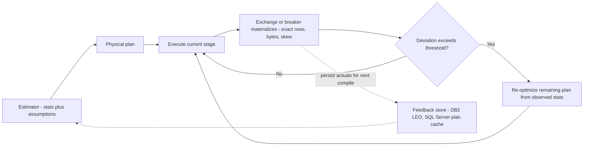
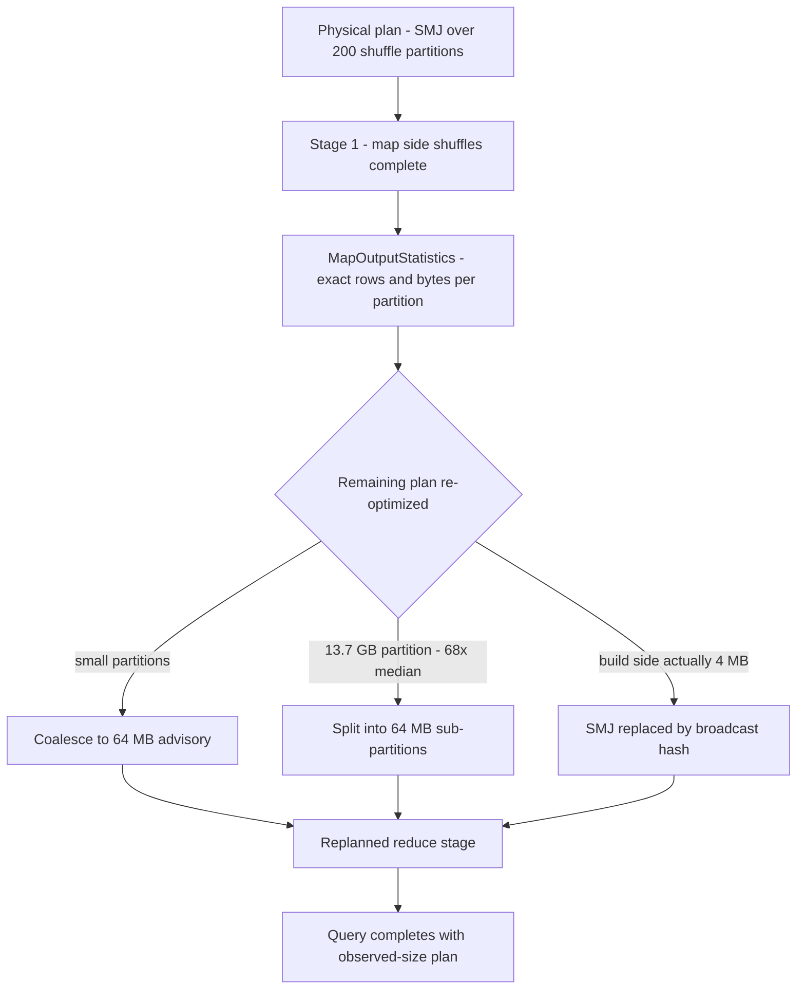

# Adaptive Query Execution: the Runtime Feedback Loop, Internally

## Overview

Static optimizers commit to a plan before seeing a single row; adaptive engines treat the plan as provisional and rewrite the parts that have not run yet, using exact statistics observed at runtime. This page is the internals companion to [Adaptive Query Execution (Advanced)](../advanced/adaptive-query-execution.md), which carries the worked skew-partition simulation and the tuning knobs; here the focus is the machinery — *why* cardinality estimates fail, how Eddy-style routing reorders work per tuple, how DB2's LEO and Microsoft's SCOPE built feedback into production planners, and what Spark's AQE actually mutates between shuffle stages, down to the before/after arithmetic of a skewed join.

> Related: [Adaptive Query Execution (Advanced)](../advanced/adaptive-query-execution.md) — the worked simulation and config-level treatment; [Cardinality Estimation](../advanced/cardinality-estimation.md) — where the wrong numbers come from; [Query Execution Models](./query-execution.md) — the operator model adaptivity instruments.

## Why optimizers misestimate: the failure modes, quantified

Every adaptive mechanism in production exists because cost-based planning rests on assumptions that real data violates. The core assumption set is *independence* (predicates on different columns are independent), *uniformity* (values spread evenly, within histograms and within hash partitions), and *completeness* (statistics exist and are current). Each failure mode has a characteristic error shape:

| Cause | Mechanism | Typical error shape | Static mitigation | What adaptivity adds |
|---|---|---|---|---|
| Predicate correlation | independence assumption multiplies selectivities | 10-1000× under- or over-estimate | extended statistics / column groups | observe the actual filter output |
| Skewed join keys | uniformity inside the hash function | one partition holds most rows | MCV lists, salting (manual) | split the fat partition at runtime |
| Join-depth propagation | errors compound multiplicatively down the tree | exponential in number of joins | conservative plans, bushy rewrites | re-plan after each materialization |
| Stale/missing statistics | ANALYZE lag, new data, UDFs | arbitrary, often catastrophic | auto-stats jobs | exact counts at exchange barriers |
| Parameter sniffing | plan cached for one literal's distribution | right for one, wrong for many | plan guides, `RECOMPILE` | per-execution feedback (SQL Server) |

The mini-math worth memorizing: a filter `a = 1 AND b = 2` with \\( \Pr(a{=}1) = 0.01 \\) and \\( \Pr(b{=}2) = 0.01 \\) is estimated at independence to pass \\( 0.01 \times 0.01 = 0.0001 \\) of rows; if the two conditions are perfectly correlated the truth is 0.01 — a **100× underestimate**, and the downstream hash-join was sized 100× too small. Over a join tree the effect compounds: Ioannidis & Christodoulakis (SIGMOD 1991) showed relative errors propagate multiplicatively, growing *exponentially* in the number of joins along a chain — which is why a 10% filter error that looks harmless at one node becomes a 100× disaster four joins downstream, and why the re-planning points that matter are the materialization barriers between join stages.

```text
error propagation through one plan (relative error per estimate):

  F1(1.1x)  ->  J1(1.5x)  ->  F2(1.2x)  ->  J2(1.5x)  ->  J3(1.5x)
  compound relative error = 1.1 * 1.5 * 1.2 * 1.5 * 1.5 = 4.46x at the root

  same plan, one correlated predicate at F1 misjudged 5x instead of 1.1x:
  compound = 5 * 1.5 * 1.2 * 1.5 * 1.5 = 20.3x -> hash grant spills,
  broadcast chosen instead of shuffle wrongly, join order now wrong
```

Read the two lines together: moderate per-node errors are survivable; one bad estimate inside a deep tree is not, because every downstream decision (join order, algorithm, partition count, memory grant) consumed the poisoned number. Adaptive execution exists to cut this chain at the first barrier where the truth becomes measurable.

## The feedback loop: adaptivity as a control system

Strip away the branding and every adaptive engine is the same control loop:



Two loops live in this diagram. The **intra-query loop** (solid) rewrites the remainder of the running query at legal points — this is Spark AQE, mid-query re-optimization, SCOPE stage re-planning. The **cross-execution loop** (dotted) persists what was learned so the *next* compile starts from better estimates — this is DB2's LEO and SQL Server's memory-grant feedback. Engines differ mainly in where they can observe (exchange barriers vs operator close-out), what they may rewrite (stage boundaries vs whole subtrees), and whether they close the second loop. All of them inherit the same constraint: you can only re-plan *downstream* of a point where the intermediate result is fully materialized, because upstream work is already spent and running tasks cannot be hot-swapped safely.

| Property | Intra-query adaptivity | Cross-execution adaptivity |
|---|---|---|
| Helps | the query running now | the next compile of the same/related queries |
| Observation | materialized intermediates (exact) | operator close-out counters, grants, spills |
| Risk | re-plan cost mid-query, thrash | plan-cache churn, per-value overfitting |
| Guardrails | deviation thresholds, bounded mutation set | hysteresis on grant/memory adjustments |
| Shipped as | Spark AQE, SCOPE, Oracle 12c adaptive plans | DB2 LEO, SQL Server memory grant feedback |

A query with a one-off skew gets intra-query help; a workload whose *worst query runs ten times a minute* gets more from cross-execution learning. Mature engines do both, and the split explains why "adaptive" means different things in different release notes.

### Memory grants: the feedback loop you can compute

SQL Server's memory-grant feedback is the smallest complete loop, and its arithmetic is worth knowing. A hash join or sort must reserve working memory before running; the grant is sized from the estimated cardinality. If the estimate says 1M build rows × 100B, the grant is ~100 MB plus hash-table overhead; if the actual is 10M rows, the operator **spills** to tempdb (the grant was 10× short), and if the actual is 10K rows, 99.9% of a reserved grant was wasted — blocking other queries through the *resource semaphore*. The feedback loop records which happened and resizes the next execution's grant, iterating toward the observed size. Undersizing costs spills (graceful hash join degrades by orders of magnitude when partitioning to disk); oversizing costs concurrency. Neither cost is visible to a cost model that only knows row counts — which is exactly why the correction has to be a feedback loop rather than a better formula.

## Eddy operators: adaptivity without a plan

The radical answer to "when can we re-plan?" is "never commit at all." An **Eddy** (Avnur & Hellerstein, SIGMOD 2000) replaces the optimizer with a router: query operators — each an independent iterator with its own state — sit in a pool, and the eddy routes every tuple to one of them, collecting per-operator statistics continuously. Two mechanisms make it work:

- **Stateful (symmetric) operators.** Both sides of a join stream into hash tables simultaneously, so neither side must be "build" — any tuple can be processed in any order, which is what makes per-tuple routing legal at all. Each operator exposes when it is *ready* (has state) and *done* (no more useful work).
- **Lottery scheduling.** Each tuple is routed by weighted lottery: operators earn tickets inversely proportional to their pending cost and state backlog, so work flows toward cheap, selective operators first. In steady state the routing converges on something close to what a cost-based optimizer would have pipelined — filters with tiny selectivity drain the tuple stream early, expensive operators see few tuples.

The per-tuple version of predicate reordering falls out for free: given two filters with selectivities \\( s_1 = 0.001, s_2 = 0.5 \\) and per-tuple costs \\( c_1 = 2, c_2 = 1 \\), running the cheap-but-unselective one first costs \\( 1 + 0.5 \times 2 = 2 \\) per input tuple while the selective-first order costs \\( 2 + 0.001 \times 1 = 2.001 \\) — here nearly equal, but with \\( s_2 = 0.9 \\) the bad order pays 40% more, and the eddy discovers the better order from measured rates without any static model. Eddies never became a production architecture — per-tuple routing overhead, the difficulty of reasoning about what plan "ran," and the fact that most engines already had materialization boundaries that were cheaper instrumentation points — but they are the intellectual bound of the design space: adaptation at the finest possible granularity. Follow-on work (DQEP and successors; see the Deshpande, Ives & Raman survey) made eddy routing deterministic and stream-capable.

## Checkpoint re-optimization: the family production chose

Between "never commit" (eddies) and "never adapt" (static) sits the family every deployed engine uses: **re-optimize at materialization checkpoints**. The lineage matters for interviews because each paper contributed a still-current idea:

| Work | Mechanism contributed | Visible today in |
|---|---|---|
| Cole & Graefe, SIGMOD 1994 | *alternate plans*: a single operator compiled with both hash and merge strategies, switchable mid-run without losing state | SQL Server's batch-mode adaptive join |
| Kabra & DeWitt, SIGMOD 1998 | *mid-query re-optimization*: sample the half-built intermediate at a blocker; if actuals deviate, re-optimize the rest and re-execute only the remainder | SCOPE, Spark AQE stage re-planning |
| Babu, Bizarro, DeWitt, SIGMOD 2005 | *proactive re-optimization*: statically find the few points where a re-plan could plausibly trigger; instrument only those | AQE's exchange-only instrumentation |
| Markl et al., SIGMOD 2004 | *progressive optimization*: merge per-query feedback into the optimizer's model persistently | DB2's LEO lineage (below) |

The pattern in all four: find the cheapest *sufficient* observation point, and never interrupt a running pipeline. The checkpoint model is why "adaptive" engines still look static inside any single pipeline — adaptation happens between pipelines, at the barriers that [Query Execution Models](./query-execution.md) and [Execution Engines](../advanced/execution-engines.md) describe as the plan's natural seams.

## DB2 LEO: the cross-execution feedback loop, productionized

**LEO — DB2's LEarning Optimizer** (Stillger, Lohman, Markl, Kandil — VLDB 2001) is the clearest production statement of the dotted loop in the diagram above. The mechanism:

1. **Capture.** While a query runs, DB2 records *feedback tuples*: (query fragment, predicate, estimated cardinality, actual cardinality) triples for the operators whose inputs are fully materialized — sorts, hash builds, materialized spools.
2. **Persist.** Feedback lands in a *feedback dictionary* keyed by the object and predicate involved, not by the query — so a correction learned from one query's `WHERE region = 'EMEA'` corrects every future query touching that predicate.
3. **Consult.** At compile time, the optimizer checks the feedback dictionary before trusting its own estimates; where feedback exists, it overrides the model's guess.
4. **Close the loop with statistics.** Persistent, systematic deviation is a symptom of stale statistics: LEO raises RUNSTATS candidates, which is the escalation path from "patch the estimate" to "fix the data the estimates come from."

The VLDB 2001 paper reports recovering most of the loss on deliberately mis-estimated queries without fresh statistics — the point was not that feedback beats good stats, but that feedback catches what stats *cannot*: correlations, parameter skew, and workload drift between ANALYZE runs. Markl et al.'s progressive optimization (SIGMOD 2004) formalized the merge of per-query learning into the optimizer's model. LEO is also the honest counterexample to "adaptive means intra-query": DB2's bet was cross-execution, plan-cache-level adaptivity — cheaper to build, safer to operate, and sufficient for most misestimates that recur across a workload.

### LEO-style correction, concretely

How the cross-execution loop heals a plan cache over three runs of the same query template:

```text
run 1: region = 'EMEA'   estimated 10K rows -> hash join -> actual 2.1M rows
        feedback tuple stored: (region = 'EMEA', est 10K, act 2.1M)
run 2: same predicate    optimizer consults feedback -> overrides to 2.1M
        plan re-sized: correct build memory, right join algorithm
run 3: RUNSTATS escalation (fired by run 1's persistent deviation) refreshed
        the histogram; it now carries the region skew; feedback entry retires
```

The escalation path is the design's wisdom: feedback is a *patch with an expiry mechanism*, not a replacement for statistics — step 3 removes the patch once the underlying data (the stats) is fixed.

## Microsoft SCOPE: re-planning between stages of a DAG

SCOPE (Chaiken et al., PVLDB 2008) is Microsoft Cosmos's SQL-like analytical engine — the architecture Spark's stage model deliberately resembles. Because SCOPE executes a DAG of stages separated by data materialization on distributed storage, it gets the strongest possible re-optimization points for free: between stages, the intermediate result's exact row count, byte size, and per-partition distribution are sitting on disk. The controller relays those runtime statistics back to the optimizer, which rewrites the *remaining* stages of the same job from observed instead of estimated sizes — the same contract Spark AQE later shipped as a default-on feature. The SCOPE paper's contribution to this page's story is architectural honesty about granularity: adaptivity in a distributed DAG is cheap and safe exactly because the DAG's stage barriers are materialization points, and prohibitively hard anywhere else. This is also the right framing for the sibling page's feedback-signal table: exchange-level statistics are nearly free *because* every row already flows through the exchange; sampling mid-operator is the exception, not the rule.

## Spark AQE internals: what actually mutates between stages

Spark's AQE (default-on since 3.2) is the most deployed implementation of the checkpoint family, and its internals are a study in minimal legal mutation:

- **Plan-node lifecycle.** After optimization, the physical plan's shuffle boundaries are cut into **query stages**. A stage whose inputs are all ready runs as tasks; when its *last shuffle-map task* completes, the engine holds exact `MapOutputStatistics` (bytes and rows per reduce partition). The remaining plan — wrapped in a `LogicalQueryStage` node that carries the completed stage's real statistics — is sent through the optimizer *again*. Downstream is replanned; upstream and running stages are never touched.
- **Mutation 1 — partition coalescing.** Adjacent small reduce partitions merge up to `spark.sql.adaptive.advisoryPartitionSizeInBytes` (64 MB default). This repairs a wrong `spark.sql.shuffle.partitions` choice after the fact — the planner's guess about *how many* partitions cannot be corrected before the shuffle exists, but the read side of the shuffle can batch arbitrarily.
- **Mutation 2 — skew join splitting.** A reduce partition larger than `spark.sql.adaptive.skewJoin.skewedPartitionThresholdInBytes` (256 MB) *and* more than `spark.sql.adaptive.skewJoin.skewedPartitionFactor` (5) times the median is split into sub-partitions, each paired with a replicated copy of the matching build-side partition. The join must be sort-merge or shuffled-hash; broadcast joins cannot have skewed partitions by construction.
- **Mutation 3 — join strategy switch.** If the completed stage's actual output fits `spark.sql.adaptive.autoBroadcastJoinThreshold`, a planned sort-merge join becomes a broadcast hash join. This is the highest-value mutation: stale stats planned SMJ "because the build side might be big"; the runtime number says it is 4 MB.



The design's trick is what it *refuses* to do: no running operator is ever hot-swapped (no Cole-Graefe alternates, no eddy routing) — every mutation happens at a materialized exchange, where the intermediate result is exact and the remainder of the plan is still just data in the catalog. Adaptivity was made safe by choosing observation points that were already barriers.

## Before/after: the skew arithmetic, end to end

A join on a 10-value key, 200M probe rows, 200 shuffle partitions, 200B/row. The planner, holding only NDV (no histogram), assumes uniformity: 200M / 200 = **1M rows per partition**. The key is actually Zipf-distributed (\\( p_i \propto 1/i \\)); the harmonic number \\( H_{10} \approx 2.93 \\) gives the top value a \\( 1/2.93 \approx 34.1\% \\) share:

```text
partition   uniform prediction      actual (Zipf s=1)      bytes (200B/row)
p_top          1.0M rows             68.3M rows              13.7 GB
p_2            1.0M                  34.1M                    6.8 GB
p_3            1.0M                  22.8M                    4.6 GB
p_4..p_10      1.0M each             6.8M .. 17.1M            1.4 .. 3.4 GB
p_11..p_200    1.0M each             0                        0
```

The worst partition is **68×** the uniform prediction. AQE's rule fires: 13.7 GB > 256 MB threshold, and 13.7 GB > 5 × median (~2.1 GB over the 10 non-empty partitions). The fat partition is split into \\( \lceil 13.7\text{GB} / 64\text{MB} \rceil \approx 215 \\) sub-partitions of ~64 MB — each pair-able with a replica of the *same* build-side partition (the known cost: the build partition is re-read per split, which is why engines bound split counts and why the factor-5 hysteresis exists). The scheduler fills 8 slots with ~64-128 MB tasks instead of one 13.7 GB task; makespan drops from hours to roughly the sum of one slot's honest share — the sibling page's simulation puts the same effect at **4.14×** on its workload, and the mechanism, not the constant, is the takeaway.

The second half of the before/after is the **strategy switch**. Suppose the build side was *estimated* at 15 GB (stale stats) so SMJ was planned — but after a pushed-down filter, the completed stage's actual output is 4 MB, under the 10 MB broadcast threshold. Before: SMJ shuffles both sides — probe alone is 200M × 100B = **20 GB** of shuffle write/read plus sorts. After: BHJ broadcasts 4 MB to every executor (say 200 executors → 800 MB network) and the probe side streams unshuffled. That is ~25× less network I/O and no sort at all, from one deferred decision. Both numbers are checkable on a whiteboard, which is exactly what makes them interview material.

## Predicate reordering: static, dynamic, and where it actually lives

Reordering filters is the smallest, most instructive adaptive decision, and it lives in three different layers depending on the engine:

- **Static (compile time).** Every mainstream optimizer orders filters by estimated selectivity-per-cost — push selective predicates first (see [Query Optimization](./query-optimization.md) and the logical-rewrite rules in [Optimization](../query-processing/optimization.md)). When the estimates are wrong, the order is wrong, and nothing at runtime notices.
- **Dynamic (per tuple).** Eddies route each tuple so that selective filters drain the stream first — reordering *converges* from measured rates rather than being computed once (above).
- **Between checkpoints.** Production engines rarely reorder filters at runtime — filter order is invisible at exchange barriers, where only cardinalities change. What they do re-decide is the *adjacent* physical choice: join algorithm (SQL Server adaptive join, Spark strategy switch), partitioning, and memory grants. That is the honest scope of runtime predicate work in deployed systems.

The interview-grade formulation: predicate reordering is fully solved statically when statistics are good, and its runtime variants pay off only where per-tuple routing is affordable (eddies) — which is why production adaptivity spends its budget on decisions that *are* visible at materialization points instead.

## Feedback loops in production engines

| Engine | Loop type | Observation point | What it corrects |
|---|---|---|---|
| DB2 (LEO lineage) | cross-execution, persistent | blocking operators during run | cardinality overrides next compile; RUNSTATS escalation |
| SQL Server 2017+ | cross-execution + intra-operator | hash-join build threshold; grant/spill counters | adaptive join strategy per execution; memory grants per plan cache |
| Spark 3.x AQE | intra-query, between stages | shuffle map-output statistics | coalescing, skew splitting, broadcast switch |
| SCOPE / Cosmos | intra-query, between stages | stage output materialization | downstream stage plans from observed sizes |
| Oracle 12c+ | intra-query + stats feedback | adaptive plans (stats collectors at join switches) | final join method per execution; statistics feedback |
| PostgreSQL (as of PG 17) | none intra-query | — | honest gap: mitigations are `ANALYZE` discipline, extended stats, and the generic-plan switch after 5 custom executions of a prepared statement |

PostgreSQL's row is the one to volunteer when an interviewer asks "does my database do this?" — the most-deployed open-source engine has no intra-query adaptivity, and workloads there lean on statistics hygiene and plan management instead. Oracle's adaptive plans (12c) are the other production datapoint: runtime stats collectors let the plan *choose between two pre-built subplans* at a join's completion — Cole & Graefe's 1994 alternates idea, shipped twenty years later. (Oracle documentation blocks automated clients; cite the 12c Adaptive Plans white paper by title, or read the concept in the Deshpande et al. survey's deployed-systems section.)

## What adaptivity cannot fix

The honest boundary of the whole field, in one list: adaptivity cannot rescue a plan with **no observation point** (a single-node engine executing one long pipeline sees nothing until it ends); cannot repair **upstream work** already spent on a bad shuffle; cannot fix **statistics absence** for decisions already made (it corrects the remainder, not the sunk cost); and introduces its own failure modes — re-plan thrash without hysteresis thresholds, unexplainable plans unless the final adapted plan is logged, and attribution confusion when the plan that ran is not the plan that was compiled. The sibling page's cost table covers the mitigations; the principle beneath them is that adaptivity is a *control system*, and control systems need hysteresis, observability, and a bounded action space to be safe in production.

### Design checklist: wiring adaptivity into an engine

If an interviewer pushes to "how would you add it?", the checklist the literature converges on:

1. Instrument the **materialization points you already have** (exchanges, sorts, hash-build completions) — they give exact counts for free; sampling is a fallback, not a default.
2. Define a **bounded action set** (coalesce, split, switch between two pre-built strategies) — bounded actions are testable; arbitrary re-planning is not.
3. Gate every action behind a **deviation threshold with hysteresis** (act only above ~2× or below ~0.5× of estimate) to prevent thrash.
4. Make the **final adapted plan observable** — log or explain it alongside the compiled one, or debugging becomes archaeology.
5. Close the **cross-execution loop** for anything that recurs — persist (predicate, estimated, actual) and let the next compile start smarter.
6. Never mutate a **running pipeline**. Every correct production design re-plans between barriers; every incorrect one tried to hot-swap operators.


## Interview Questions

1. **Why do cardinality estimates fail, and where does the error go?** Three assumption violations: independence (correlated predicates multiply selectivities — two 1% predicates estimated at 0.01% can actually pass 1%, a 100× error), uniformity (skewed keys put most rows in one hash partition the uniform model predicted as average), and staleness. Downstream the error compounds multiplicatively — Ioannidis & Christodoulakis showed it grows exponentially with join depth — so a small filter miss becomes an undersized hash table that spills, or a broadcast that ships gigabytes.
2. **What is an eddy, and why didn't they win?** An eddy replaces the optimizer with a per-tuple router over stateful (symmetric-hash) operators, using lottery scheduling weighted by measured cost and backlog — adaptation at the finest granularity, with predicate reordering emerging from rates rather than estimates. It lost on overhead (routing per tuple), explainability (no single "the plan"), and because checkpoint-based re-optimization got 90% of the benefit at materialization barriers engines already had.
3. **Explain DB2 LEO's feedback loop.** During execution, blocking operators record feedback tuples — (predicate, estimated rows, actual rows) — into a persistent feedback dictionary keyed by object and predicate. At compile time the optimizer consults the dictionary and overrides its own estimates where feedback exists; systematic deviation escalates to RUNSTATS suggestions. It is cross-execution adaptivity: cheaper and safer than intra-query mutation, and it catches exactly what static statistics cannot — correlation and workload drift between ANALYZE runs.
4. **What exactly does Spark AQE mutate, and when is it allowed to?** Only downstream of completed shuffle stages: when a stage's last map task finishes, its exact per-partition statistics trigger re-optimization of the remaining plan — coalescing small partitions to a 64 MB advisory target, splitting partitions that exceed 256 MB and 5× the median (replicating the build-side partition per split), and switching sort-merge to broadcast when actual output fits the threshold. No running operator is ever replaced; every mutation sits at a materialization barrier, which is what makes it safe.
5. **Walk me through the skew math for one oversized partition.** 200M rows over a 10-value Zipf key hashed into 200 partitions: uniform prediction is 1M rows/partition; the top value takes 1/2.93 ≈ 34.1%, so its partition holds 68.3M rows ≈ 13.7 GB — 68× the estimate. AQE splits it into ~215 sub-partitions of 64 MB, each pairing with a replica of the same build partition (the re-read cost that bounds split counts). The scheduler now fills its slots with honest-size tasks instead of one 13.7 GB straggler — granularity, not throughput, was the problem.
6. **Does PostgreSQL do adaptive query execution?** No intra-query adaptivity as of PG 17 — plans run to completion. The mitigations are upstream of execution: statistics hygiene (`ANALYZE`), extended statistics for correlated columns, plan-time guards, and prepared-statement plan switching (custom plans for the first ~5 executions, then a generic plan if it wins). It is the standard counterexample that keeps the "which engines actually do this?" question honest.

## Key Takeaways

- Adaptivity is a **control loop**: estimate → execute → observe exact statistics at materialization points → re-optimize the remainder → optionally persist feedback for the next compile (DB2 LEO, SQL Server plan cache).
- Misestimation has three root causes — **independence, uniformity, staleness** — and errors compound **exponentially with join depth** (Ioannidis & Christodoulakis 1991), which is why re-planning points sit between join stages.
- **Eddies** are the granularity bound: per-tuple routing with symmetric-hash operators and lottery scheduling; production rejected the overhead but inherited the ideas (adaptive join = deferred strategy choice).
- The checkpoint family won in production: **alternate plans** (Cole & Graefe 1994), **mid-query re-optimization** (Kabra & DeWitt 1998), **proactive instrumentation** (Babu et al. 2005), **progressive optimization** (Markl et al. 2004) — all re-plan only at materialized boundaries.
- **Spark AQE** mutates exactly three things, only downstream of completed shuffles: coalescing (64 MB advisory), skew splitting (256 MB + 5× median), and broadcast switching (threshold on actual stage output) — safe because no running operator is touched.
- The skew arithmetic is whiteboard material: Zipf key, 200 partitions, top partition 68× the uniform estimate → split into ~64 MB sub-partitions; a 4 MB actual build side converts a 20 GB SMJ shuffle into an 800 MB broadcast.
- **Scope honestly**: PostgreSQL has no intra-query AQE; Oracle 12c ships Cole-Graefe alternates; adaptivity complements but does not replace statistics maintenance, and needs hysteresis + plan logging to be operable.

## References

- Stillger, Lohman, Markl, Kandil. "LEO — DB2's LEarning Optimizer." VLDB 2001. https://www.vldb.org/conf/2001/P019.pdf
- Markl, Raman, Simmen, Lohman, Pirahesh. "Robust Query Processing through Progressive Optimization." SIGMOD 2004. https://doi.org/10.1145/1007568.1007642
- Chaiken et al. "SCOPE: Easy and Efficient Parallel Processing of Massive Data Sets." PVLDB 1(2), 2008. https://doi.org/10.14778/1454159.1454166
- Kabra, DeWitt. "Efficient Mid-Query Re-Optimization of Sub-Optimal Query Execution Plans." SIGMOD 1998. https://doi.org/10.1145/276305.276315
- Avnur, Hellerstein. "Eddies: Continuously Adaptive Query Processing." SIGMOD 2000. https://doi.org/10.1145/335191.335420
- Cole, Graefe. "Optimization of Dynamic Query Evaluation Plans." SIGMOD 1994. https://doi.org/10.1145/191839.191872
- Babu, Bizarro, DeWitt. "Proactive Re-Optimization." SIGMOD 2005. https://doi.org/10.1145/1066157.1066171
- Deshpande, Ives, Raman. "Adaptive Query Processing." Foundations and Trends in Databases 1(1), 2007. https://doi.org/10.1561/1900000001
- Ioannidis, Christodoulakis. "On the Propagation of Errors in the Size of Join Results." SIGMOD 1991. https://doi.org/10.1145/115790.115835
- Apache Spark — SQL Performance Tuning (AQE configuration and semantics). https://spark.apache.org/docs/latest/sql-performance-tuning.html
- Databricks. "Adaptive Query Execution: Speeding Up Spark SQL at Runtime" (2020). https://www.databricks.com/blog/2020/05/29/adaptive-query-execution-speeding-up-spark-sql-at-runtime.html
- Microsoft Learn — Intelligent Query Processing in SQL Server (adaptive joins, memory grant feedback, interleaved execution). https://learn.microsoft.com/en-us/sql/relational-databases/performance/intelligent-query-processing?view=sql-server-ver16
- PostgreSQL — Planner Statistics (what the static side of the loop consumes). https://www.postgresql.org/docs/current/planner-stats.html
- CMU 15-721 Advanced Database Systems (query optimization & adaptivity lectures). https://15721.courses.cs.cmu.edu/

## Cross-References

- [Adaptive Query Execution (Advanced)](../advanced/adaptive-query-execution.md) — the worked skew-partition simulation and tuning knobs
- [Cardinality Estimation](../advanced/cardinality-estimation.md) — the estimator whose failures this page repairs at runtime
- [Query Execution Models](./query-execution.md) — the operator/pipeline structure adaptivity instruments
- [Query Optimization](./query-optimization.md) — the static half: cost model, join order, plan selection
- [Spark Internals](../../data-engineering/spark-internals.md) — the stage/DAG model AQE re-plans between
- [Cascades Optimizer](../advanced/cascades-optimizer.md) — the optimizer framework re-invoked at checkpoints
