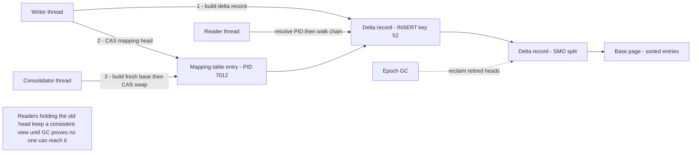
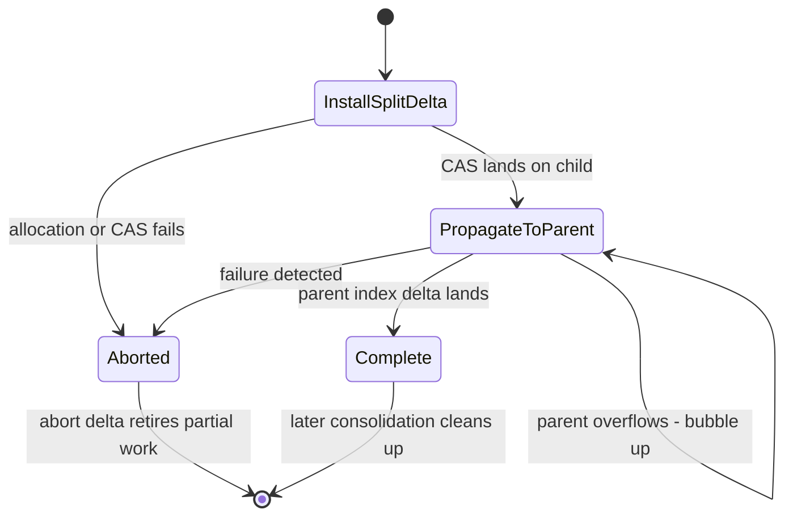
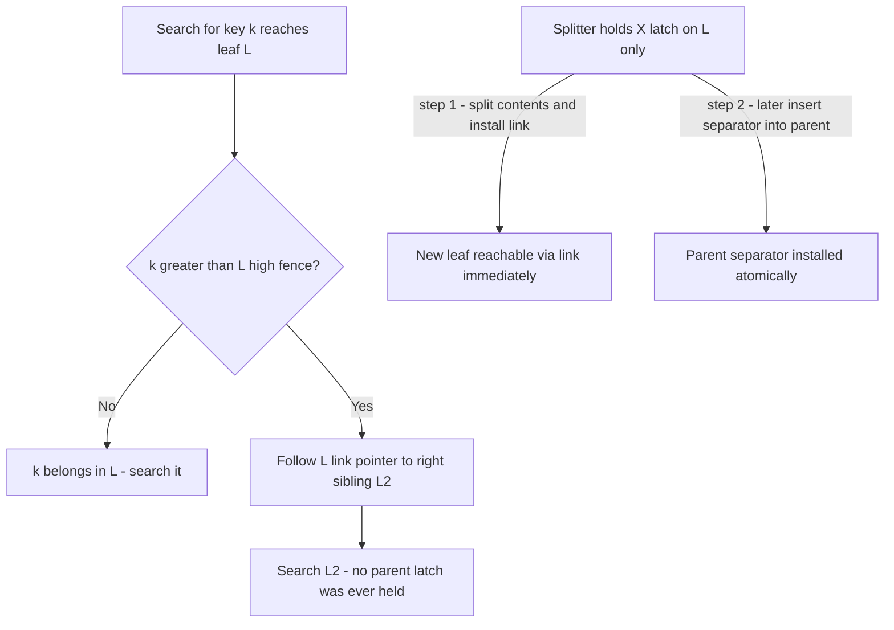

# Latch-Free Index Structures: Bw-Tree, B-Link, and the Post-Latch-Free Verdict

## Overview

A B+tree page is a contended resource: every insert, delete, and even optimistic read must coordinate with concurrent structure-modifying operations (splits and merges). **Latch-free index structures** replace the latch protocol with single-word atomic instructions (CAS) on an indirection layer, so that no reader ever blocks a writer and no writer ever blocks a reader. This page covers the two canonical designs — Microsoft's **Bw-tree** (ICDE 2013, shipped in SQL Server Hekaton) and the **B-link tree** (Lehman & Yao, 1981, the structural ancestor of the right-link trick every production engine uses) — plus OpenBw-tree, ART and Masstree as comparison points, and the honest industry verdict: the field measured latch-free designs and largely went back to latches.

> Related: [B-tree latching](./btree-latching.md) — the latched baseline this page escapes; [Bw-tree and ART](../advanced/bwtree-art.md) — the ICDE 2013 pair and the ART node-size experiment; [B+trees](../indexing/b-plus-tree.md) — the structure being made concurrent.

## Why B-trees want an alternative to latches

The latched B+tree pays three taxes that get worse as memory replaces disk. First, **latch crabbing** takes a latch at every level from root to leaf, so the root's cache line ping-pongs between cores even when the actual keys are disjoint — contention is paid on *structure*, not *data*. Second, **in-place mutation** rewrites a multi-kilobyte page to add one entry; under MVCC-heavy OLTP the same hot page is rewritten thousands of times per second, and each rewrite serializes against everyone else touching that page. Third, structural changes (splits, merges) need multi-page latch protocols — either full-path X-coupling or restart-on-conflict — and every protocol variant shows up as a rare, hard-to-debug concurrency bug.

Latch-free designs answer with one mechanism: never mutate a shared page in place, never hold more than one atomic operation in flight, and make structure changes *readable intermediate states* rather than fenced-off critical sections. The cost moves elsewhere — into indirection, garbage collection, and delta-chain traversal — and the second half of this page is about who actually pays that bill.

## The cost model: where latches actually burn time

It pays to be quantitative, because the case for latch-freedom is entirely quantitative. An uncontended latch acquire/release on modern x86 costs tens of nanoseconds (a `lock cmpxchg` on a cache line the core already owns). A *contended* one costs an inter-core cache-line transfer: roughly 40-100 cycles minimum for the line to migrate, with queueing under arbitration — practitioners commonly model a contended acquire at 100 ns or more on a 16+ core machine. A root-to-leaf descent through a fanout-200 tree over 10⁹ keys is \\( \lceil\log_{200}(10^9)\rceil \approx 4 \\) node visits, so **full-path latch coupling transfers the root's cache line once per tree operation across all cores**. At 4 million operations/second on 32 threads, the root alone handles 4M transfers/second — the CPU spends its time moving one cache line around, not comparing keys.

The optimistic-latch refinement (readers take a version number, walk unlatched, validate on exit) already removes most read-side transfers: validation is a load plus compare against a local snapshot, and only *writers* and detected conflicts touch the exclusive line. The Bw-tree's pitch was to go further and remove the write-side critical section too: if a write is one CAS on a mapping entry, two writers targeting *different* keys on the same page no longer serialize on the page's version word — they serialize on the chain head only for the nanoseconds of the swap. Whether that trade wins depends on what the CAS replaces: a 20 ns latch pair is cheap to beat, but a 100 ns mapping-table probe plus delta allocation plus epoch registration is not automatically cheaper. That is the entire argument of the field in one paragraph, and the sections below fill in the mechanisms.

## The Bw-tree: tree state through an indirection table

### Mapping table, delta records, and the single CAS

The Bw-tree (Levandoski, Lomet, Sengupta — Microsoft Research, with Carnegie Mellon collaborators) keeps the B+tree shape but changes what a "page" is. Every logical page has a stable **page ID (PID)**; a central **mapping table** translates PID → physical location. Pages themselves are immutable: a **base page** is a sorted full image, and every modification prepends a **delta record** to a chain that hangs off the mapping entry. Installing a delta is a single `compare_and_swap(mapping[PID], old_head, new_delta)`. Nobody takes a latch; the one-word CAS *is* the synchronization.



A reader resolves the PID once, then walks deltas newest→oldest, folding them over the base image. If a CAS lands between the reader's resolve and its walk, the reader keeps traversing the *old* chain — which is still fully intact, because nothing is ever mutated. Correctness for free; the price is that freed memory cannot actually be freed until an **epoch manager** proves no thread can still hold a pointer to it. This is the same epoch-reclamation contract that lock-free lists and RCU use, and it is the quiet center of the whole design.

The mapping table earns its cache misses. Because the entry is a stable slot, a *consolidated* page can be swapped in while readers still hold pointers into the previous physical image; because the PID is stable, the index layer can be split from storage (a page's "location" can be DRAM, a flash offset, or a log position) without any tree surgery. Both B-tree-via-log and flash-resident designs fall out of that one indirection.

### A read, a consolidation, and a retired chain — end to end

Concrete walk-through of the three thread classes touching one page:

```text
T0  mapping[PID 7012] = base(B)                    # one sorted page, 8KB
T1  writer  : delta INSERT 52  ->  head = D1       # CAS#1, chain: D1->B
T2  writer  : delta DELETE 17  ->  head = D2       # CAS#2, chain: D2->D1->B
T3  reader R1 resolves PID 7012, sees head D2
T4  splitter: split delta S    ->  head = D3       # CAS#3, chain: D3->D2->D1->B
T5  reader R1 walks D2 -> D1 -> B (misses S - old-view read, still consistent)
T6  consolidator builds base B' = B+D1+D2+S, CAS#4: head = B'
T7  reader R2 walks only B'  (fast path restored)
T8  epoch manager retires D3,D2,D1,B once no thread can hold them
```

Step T5 is the whole trick: R1's "stale" view is not wrong, it is a *snapshot* — the Bw-tree gets MVCC-style page versions as a side effect of its synchronization design. Step T7 is why consolidation policy is the tuning lever: every read between T1 and T6 replays three deltas, so a page absorbing 10k inserts between consolidations pays 10k record applications per lookup.

### Delta record types

The Bw-tree is not "delta records for updates" — *everything* that happens to a page is a delta, including structure changes:

| Record type | Payload | Installed by | Purpose |
|---|---|---|---|
| Insert / Update | key + row pointer | any writer thread | append new state to the chain |
| Delete | key (tombstone delta) | any writer | logical delete before consolidation drops the entry |
| Split (SMO) | separator key + right-sibling PID | overflowing child | make the split visible *before* the parent knows |
| Merge (SMO) | absorbed-sibling contents | underflowing pair | make the merge visible, deletion follows |
| Abort | prior delta reference | SMO executor | back out a partially installed multi-step SMO |
| (consolidation) | full new base image | any observer | replaces base+deltas with one page via CAS |

Two properties make this work. The chain is *append-only*, so a reader at any point in time sees a consistent version of the page. And each install is *one atomic word*, so there is no intermediate state where "half a delta" is visible — the mapping entry points to either the old head or the new one, never to a torn state.

### Structural modification operations (SMOs)

A split in a latched tree is a synchronous two-page rewrite under latches. In the Bw-tree it is a **multi-step logical SMO**, each step its own CAS:

1. The overflowing child allocates a new page, copies the right half of its contents there, and installs a **split delta** naming the new sibling and the new separator key. From this instant, readers that walk the chain learn about the sibling even though the parent still routes them to the old page — the "inconsistent" state is *readable by design*.
2. A second install adds the separator to the parent (an *index delta*). If the parent itself overflows, the SMO **bubbles up** a level as its own two steps; a root split allocates a new root and is installed by re-seating the tree's root PID.
3. If any step fails (allocation failure, contention), an **abort delta** logically removes the partial work — no in-place undo, no broken invariant visible to readers.

Merges mirror this: a *remove delta* marks the sibling's contents as absorbed, a later *index delete* drops the parent separator. Readers caught between the two steps follow the merge delta and still find every key. The engineering subtlety — and the part the 2018 reimplementation spent most of its time on — is that the SMO state machine must be robust to *every* interleaving, because with no latches there is no way to stop a reader from arriving in the middle of any step.

### Consolidation and garbage collection

Consolidation is deliberately **not** an SMO: any thread that observes a chain growing long may build a fresh base page (base + all deltas applied) and CAS the mapping entry to the new image. Only new arrivals see the consolidation; readers holding the old head finish their walk on the old chain. Policy matters enormously. OpenBw-tree tunes consolidation by per-page memory budget and delta-count thresholds; a chain that grows too long turns O(1) reads into O(chain) replays over every insert since the last consolidation, while consolidating too eagerly burns CPU re-sorting pages nobody reads and increases GC churn.

Reclamation is epoch-based, and its arithmetic is worth doing once. Each active thread registers in an epoch; a retired record is freed only after every thread has left the epochs in which the record was reachable. With \\( T \\) threads and an epoch length \\( e \\) seconds, a retired record waits at most a couple of epochs — but the *floor* memory is proportional to the retirement rate times the epoch length: a thread parked mid-scan (a long range scan pinning one epoch) can hold megabytes of retired deltas alive. Production deployments therefore couple epoch GC to scan progress, not just wall-clock. Readers never block on reclamation, but one slow scan stretches the memory floor — the classic trade of all epoch-based reclamation.

### The SMO state machine

Because there are no latches to serialize an SMO, the implementation tracks each structure change as an explicit state machine:



Every transition is itself an atomic install; readers can observe any state and still make progress. The latched analog of this diagram is three latch acquisitions with an ordering rule — shorter on paper, harder to prove correct under interleaving, and blocking for the duration.

### Persistence and recovery with LLAMA

The original Bw-tree paper paired the index with **LLAMA** (Levandoski, Lomet, Sengupta, Stoica — PVLDB 2013), a cache/storage subsystem that appends variable-length page images (deltas, consolidations, base pages) to a log instead of rewriting fixed-size pages. This composition is why the Bw-tree is repeatedly described as a *flash-native* index: installs and consolidations become sequential log appends, the write shape flash wants, and a page can live partly in DRAM and partly on device because the mapping entry is the only thing that knows where "the page" is. Recovery replays the log to reconstruct mapping entries; because pages are never mutated in place, there is no torn-page problem to defend against and no double-write to a page plus a WAL record — the log *is* the page store. Hekaton (SIGMOD 2013) shipped exactly this stack for SQL Server's memory-optimized tables: Bw-tree indexes over a log-structured store, with Microsoft Learn documenting the index behavior (deltas applied at traversal, consolidation under memory pressure).

## OpenBw-tree: the open-source reimplementation and its lessons

Microsoft's original Bw-tree had no public implementation, so the SIGMOD 2018 effort (Wang, Pavlo, Lim, Leis, Zhang, Kaminsky, Andersen — CMU + CMU-SV) built one from the papers: **OpenBw-tree**, released as an open-source C++ library. The paper's contribution is less "here is a faster tree" and more a field report on what the published description leaves out. Three lessons matter for interviews.

First, **"the Bw-tree" is a family, not a design**. The ICDE 2013 paper under-specifies enough (SMO step ordering, GC timing, consolidation triggers) that the team iterated through multiple correctness bugs — searches that returned "not found" while a split was mid-flight, pages whose parent pointer went stale during bubble-up — before arriving at a phase machine where each SMO has explicit install/complete states. Correctness in latch-free structures is not proven by inspection; it is found by stress tests that interleave SMOs with searches at adversarial moments.

Second, **the overheads are structural, not incidental**. Indirection through the mapping table costs a cache line per page access; delta-chain traversal lengthens the read path in proportion to the write rate; and epoch GC plus consolidation consume CPU that a latched tree never spends. None of these can be optimized away without giving up the design's own guarantees.

Third, and most quoted: when the authors tuned a *plain* B+tree with **optimistic latch coupling** (readers take a version counter, traverse unlatched, validate on exit; writers CAS the version), that tree **outperformed the lock-free Bw-tree on most of their in-memory workloads**. Lock-freedom is a mechanism for progress guarantees, not a performance guarantee — and the workloads where latch contention actually dominates (extreme skew on one hot page at very high core counts) are narrower than the 2013 motivation assumed.

## The B-link tree: the structural escape hatch inside latched trees

The Bw-tree is not the first design to make splits non-blocking. Lehman & Yao's **B-link tree** (ACM TODS 1981) adds two fields to every node: a **high fence** (separator key, effectively `+∞` for the rightmost node at a level) and a **link pointer** to the right sibling at the same level. The rules:

- **Search**: descend to a leaf; if the key exceeds the node's high fence, follow the link pointer right and repeat. No parent latch is needed to recover from a concurrent split — the link *is* the recovery path.
- **Insert/split** proceeds in two independent, separately-latched steps: first split the leaf's contents and install the link pointer (the new leaf becomes reachable *now*), then — possibly much later — insert the new separator into the parent. Until step 2 happens, the tree is "half-split" by design and every search still finds every key.
- **Range scans** ride the leaf-level link chain, which doubles as the sibling order; a scan that crosses a half-split boundary sees a consistent key sequence because the link was installed *before* any key became "missing" from the old view.



The B-link guarantee is precise: a single-key search never waits for a structural change, and the split's two steps never require holding parent and child latches simultaneously — which is what makes deadlock freedom trivial. Production engines are its descendants: PostgreSQL's nbtree uses right-link pointers with *incomplete splits* (WAL-visible, repaired on demand by the next writer that encounters them), and SQL Server and InnoDB both defer parent updates around the same idea. The difference from the Bw-tree is philosophical: B-link keeps latches but *shortens their hold times and scopes*; the Bw-tree removes latches and pays indirection instead. Read the two designs as points on one spectrum — "how much do you pay to never block a reader" — with B-link near the cheap end and the Bw-tree at the expensive-but-total end.

## Hot spots: where both designs still hurt

Latch-freedom does not repeal Zipf's law. If 80% of inserts land on the rightmost leaf (monotonically increasing keys, the classic append-only pattern), the Bw-tree serializes on *one mapping entry's CAS* — the same contention the latched tree hits on the same page's latch, minus the latch's queueing but with the added cost of a failed-CAS retry loop under load. The mitigations differ by design but map one-to-one:

| Contention pattern | Latched tree mitigation | Bw-tree mitigation |
|---|---|---|
| Rightmost-leaf appends | append-optimized pages, deferred splits (SQL Server), heap+secondary index (PG) | consolidation frequency, delta batching into one record |
| Single hot key | hot-spot detection, spin then backoff | CAS retry under contention, delta coalescing |
| Root / upper-level ping-pong | optimistic reads (no root latch) | already absent — mapping entry per page, root is just another PID |
| Scan pinning reclamation | irrelevant (in-place) | epoch advance tied to scan progress; memory floor grows |

The last row is worth stating in interviews: the latched tree has *no* reclamation problem at all, because it mutates in place. The Bw-tree trades a hot-page problem for a hot-entry problem and adds a memory-floor problem that appears only when readers lag. Every concurrency design moves the pain; none deletes it.

## Debugging: the failure modes you will be asked to reason about

Production incidents look different on the two sides, and the difference is a good litmus test for whether a candidate has actually operated one of these:

| Symptom | Latched tree diagnosis | Latch-free (Bw-tree) diagnosis |
|---|---|---|
| Latency spikes every ~N seconds | checkpoint/split storm; check latch wait events | consolidation storm on hot pages; check delta-chain length |
| Throughput collapses under 32+ threads | root latch / page latch queueing | CAS retry storms on one mapping entry; epoch GC stealing CPU |
| Memory grows with no data growth | (not a thing — in-place) | slow scan pinning an epoch; retired deltas accumulating |
| Rare "key not found" during bulk load | bug in split protocol / missing latch | SMO state machine violation — the OpenBw-tree paper's central bug class |
| Stuck single thread | stuck latch holder (watchdog dumps the waiter) | livelock in retry loop; ABA on chain head if GC is unsound |

The latched tree fails *visibly* (wait events, latch waits are first-class counters in every engine); the latch-free tree fails *structurally* (chain lengths, GC lag, retry rates — counters you usually had to build yourself). That operational asymmetry, more than raw throughput, is why conservative engine teams stayed latched.

## The wider latch-free family: ART and Masstree

Two contemporaries round out the design space. **ART** (Leis, Kemper, Neumann, ICDE 2013) is a trie with adaptive node sizes (Node4/16/48/256) whose production synchronization (DaMoN 2016) is *not* lock-free: readers take a version counter, traverse optimistically, and retry on version change — optimistic latches. **Masstree** (Mao, Kohler, Mazières, SOSP 2012) is a trie of B+trees over 8-byte prefixes built for many-key row stores; it uses optimistic version validation on reads with fine-grained latching on writes, plus epoch-based memory reclamation. Masstree's authors explicitly document the failure modes they had to engineer around — partially-installed splits visible to readers, border/interior node split-up propagation — and their solutions look like the B-link half-split wearing a trie's clothes.

Note what happened across the three most-cited "modern index" papers of 2012-2016: both ART and Masstree converged on **optimistic validation**, not CAS-only lock-freedom. The Bw-tree is the outlier that removed latches entirely. That convergence is the strongest signal in the primary literature about where the complexity/performance frontier actually sits.

## Why the B-link half-split is safe (the one proof worth memorizing)

The B-link correctness argument is short enough to reproduce in an interview, and it doubles as the template for every "readable intermediate state" design that followed:

1. **Invariant**: at all times, the set of (node, key-range) pairs reachable by fence descent plus link-following covers the whole key space, with ranges possibly overlapping during a split. Overlap is harmless — a search checks both candidates via the link chain.
2. **Split step 1** installs the link and copies keys before anything is removed. Between the copy and the parent update, the moved keys exist in *both* nodes' ranges: fence descent finds the old node, link-following finds the new one. Either path returns every key.
3. **Split step 2** narrows the old node's fence to the new separator. Now only one node claims each key, and the new node is reachable by both fence descent (via the fresh separator) and the link.
4. **Deletion/merge** is the mirror: contents move into the survivor and a remove delta (or merged-page marker) redirects link-followers before the parent separator disappears.

The general principle: **make the intermediate state one that a correct reader can traverse, rather than one you must hide.** The Bw-tree's split delta is this principle with CAS instead of latches; OpenBw-tree's mid-flight "key not found" bugs were exactly violations of it; and modern latch-free hash maps and RCU structures are the same idea applied elsewhere.

## Design-point comparison

| Dimension | Latched B+tree (optimistic coupling) | B-link tree | Bw-tree / OpenBw-tree | ART | Masstree |
|---|---|---|---|---|---|
| Sync primitive | version validate on read, latch on write | S/X latches, never parent+child together | single CAS on mapping entry, no latches | optimistic version retry per node | optimistic validate + fine-grained latches |
| Read path | O(log n) page hops | O(log n), may follow links right | resolve PID, walk delta chain, fold over base | O(k), one cache-line node per key byte | trie descent to B+tree leaf, then binary search |
| Write path | in-place, CAS version | in-place, 2-step split | delta install + periodic consolidation | in-place node growth (4→16→48→256) | in-place leaf updates + prefix trie |
| Split atomicity | latched multi-page protocol | readable half-split state | readable SMO delta state | latched per-node | latched with version protection |
| Memory overhead | ~none beyond fill factor | link pointer + fence per node | delta chains + mapping table + GC lag | per-node type headers | prefix tries + row cache |
| Reclamation | trivial (in-place) | trivial | epoch GC + (LLAMA) log compaction | epoch GC | epoch GC |
| Native storage | disk pages | disk pages | DRAM + log-structured flash | DRAM | DRAM |
| Shipped in | InnoDB, PostgreSQL, SQL Server, Umbra | PostgreSQL nbtree lineage | SQL Server Hekaton (memory-optimized) | HyPer, Umbra | Silo's index, multicore KV research |

Reading the table by *where complexity is spent* is the interview-grade insight. Latched trees spend it on latch protocols; B-link spends it on one extra pointer per node and buys split-tolerant readers; the Bw-tree spends it on indirection, delta management, and GC; ART and Masstree spend it on cache-line-shaped nodes and version retry logic. There is no free column — every design pays somewhere, and the question "where does this design pay?" is the right one to ask in any index-design interview.

## Did latch-freedom win? The honest industry verdict

If you have time for exactly four primary sources, read them in this order — each answers a different question:

1. **ICDE 2013 (Bw-tree)** — the *proposal*: what breaks on new hardware, and how indirection + deltas answer it.
2. **PVLDB 2013 (LLAMA)** — the *system*: how the index composes with log-structured storage and recovery.
3. **DaMoN 2016 (ART synchronization)** — the *counter-proposal*: optimistic validation beats lock-freedom for a main-memory index.
4. **SIGMOD 2018 (OpenBw-tree)** — the *verdict*: a ground-up reimplementation, its bug taxonomy, and the head-to-head against latching.

It did not, and the primary sources say so plainly. The **measurement**: the SIGMOD 2018 OpenBw-tree paper benchmarked its lock-free implementation against a tuned optimistic-latch B+tree on in-memory workloads and the latched tree won on most of them — the overheads (indirection, chain traversal, GC, consolidation tuning) exceeded the latch costs they replaced. The **design convergence**: TUM's HyPer/Umbra line — the most influential main-memory engine papers of the decade — shipped optimistic latch-coupled trees (ART variant) rather than latch-free ones (DaMoN 2016; Umbra, CIDR 2020). The **production record**: Hekaton (SIGMOD 2013) remains the flagship latch-free deployment inside SQL Server's memory-optimized tables, while the same vendor's disk-based engines stayed latched; MySQL, PostgreSQL, Oracle all remain latch-based to this day.

Be careful how you cite the *narrative*, because the venue attribution is often mangled. The Bw-tree's original paper is **ICDE 2013, not CIDR**; the closest CIDR source on the Bw-tree design point is Microsoft's Deuteronomy architecture paper (Levandoski, Lomet, Sengupta, Stutsman, Wang, "High Performance Transactions in Deuteronomy," CIDR 2015), which builds the transactional layer around the Bw-tree's component model; and the strongest "latches won" evidence is the SIGMOD 2018 measurement plus DaMoN 2016's design choice, not any CIDR consensus statement. Practitioner commentary — CMU 15-721's advanced-indexing lecture being the most-cited example — states the verdict bluntly ("latch-free B-trees lost to well-tuned latching"), but the course summarizes the papers above rather than adding new evidence. The defensible interview position: latch-free indexing was the right answer to a 2010s motivation (uncontended DRAM, in-place pages, flash write shapes); modern hardware and honest benchmarking moved the field back to optimistic latching, while the Bw-tree's *ideas* — indirection for atomic structure change, epoch reclamation, log-structured persistence — reappear throughout modern engines.

## Glossary (the six terms this page assumes)

| Term | Meaning |
|---|---|
| PID | stable logical page ID; the only handle threads use to find a page |
| Mapping table | array/hash of PID → physical address; the only mutable synchronization word |
| Delta record | immutable, prepended page modification (insert/delete/split/merge/abort) |
| Consolidation | building a fresh base page from base + deltas; CAS-swapped, never latched |
| SMO | structure modification operation — multi-step logical split/merge, readable mid-flight |
| Epoch GC | reclamation of retired records after all threads leave the epochs that could reach them |

## Interview Questions

1. **How does the Bw-tree install an update without any latches?** The writer allocates a delta record whose `next` field captures the current chain head, then executes one CAS on the page's mapping-table entry to swing it to the new head. Readers that resolved the PID before the CAS keep walking the old chain, which is immutable and therefore still correct; readers after the CAS see the delta. Memory is reclaimed by an epoch manager only after every thread has left the epochs in which the retired records were reachable. The entire synchronization story is one atomic word plus epoch reclamation.
2. **How can a split be "in progress" without blocking readers?** The split is encoded as a split delta record on the child, installed before the parent is updated, naming the new right sibling and separator. A reader reaching the old page walks the chain, discovers the split delta, and follows the sibling pointer — it never needs the parent to be consistent, and never waits. The parent's separator is a second, independent CAS; a partial SMO is backed out with abort deltas rather than in-place undo. This is the same "readable intermediate state" idea the B-link tree introduced with half-splits in 1981.
3. **What did OpenBw-tree's SIGMOD 2018 reimplementation actually teach us?** That the published Bw-tree under-specifies a family of algorithms (SMO step machines, GC timing, consolidation policy) and that the omitted parts dominate the engineering; that overheads are structural — mapping-table indirection, delta-chain traversal, epoch GC; and that a well-tuned optimistic latch-coupling B+tree beat the lock-free design on most in-memory workloads. The conclusion is not "latch-free is wrong" but "lock-freedom buys progress guarantees, not throughput."
4. **Why does the B-link tree never deadlock?** Because no operation ever holds latches on two nodes simultaneously — the split's two steps (split contents + install link; later, insert separator into parent) are separately latched, and searches that walk off the end of a node follow link pointers instead of re-latching a parent. Deadlock requires a cycle in latch acquisition, and the protocol's strict one-node-at-a-time rule makes cycles impossible. Readers still make progress during a split window because the half-split state is a valid searchable tree.
5. **When would you still choose a latch-free index today?** When the workload's contention is genuinely on structure — extreme hot-spot inserts onto a single page, or very high core counts where latch cache-line transfer dominates — and when the write shape fits log-structured storage (flash endurance, sequential appends). You accept mapping indirection, delta-chain reads, and GC tuning in exchange. Otherwise optimistic latch coupling with version validation is the default modern answer, which is what HyPer, Umbra, and the SIGMOD 2018 measurements concluded.
6. **How do ART and Masstree synchronize, and what does that tell you?** Both use optimistic validation: readers grab a node version, traverse unlatched, and retry if the version changed; writers use short latches plus epoch GC. Neither is lock-free in the Bw-tree's sense. The convergence of the most successful modern index papers on optimistic validation — while only Hekaton shipped full latch-freedom — is the strongest empirical signal that per-node version checks hit the sweet spot between contention and complexity.

## Key Takeaways

- The Bw-tree replaces latch protocols with a **mapping table** (stable PID → physical location) and **immutable pages**: every change, including splits and merges, is a delta record installed by one CAS on the mapping entry.
- Readers never block writers and writers never block readers; the deferred costs are **delta-chain traversal**, **consolidation policy**, and **epoch-based reclamation**, and all three grow with write rate.
- SMOs are **multi-step logical operations** with readable intermediate states (split delta before parent update) and abort deltas for rollback — not latched critical sections.
- Paired with **LLAMA**, the Bw-tree becomes log-structured end to end: sequential appends, no torn pages, flash-friendly write shapes — the architecture Hekaton shipped.
- OpenBw-tree (SIGMOD 2018) is the honest field report: the design is a family of algorithms, the hidden parts dominate, and a tuned **optimistic latch-coupling B+tree outperformed it** on most in-memory benchmarks.
- The **B-link tree** (Lehman & Yao 1981) achieves split-tolerant searches with latches: high fences + link pointers, two-step splits, never holding two latches — it is the direct ancestor of PostgreSQL's right-link nbtree.
- ART and Masstree converged on **optimistic validation**, not lock-freedom; production latch-free deployment remains essentially Hekaton.
- Interview framing: "latch-free" buys progress guarantees under extreme contention; modern engines mostly decided **optimistic latches win on throughput and complexity**, and cite the SIGMOD 2018 / DaMoN 2016 evidence rather than folklore.

## References

- Lehman, Yao. "Efficient Locking for Concurrent Operations on B-Trees." ACM TODS 6(4), 1981. https://doi.org/10.1145/319628.319663 — the B-link tree.
- Levandoski, Lomet, Sengupta. "The Bw-Tree: A B-tree for New Hardware Platforms." ICDE 2013. https://doi.org/10.1109/ICDE.2013.6544834
- Levandoski, Lomet, Sengupta, Stoica. "LLAMA: A Cache/Storage Subsystem for Modern Hardware." PVLDB 6(10), 2013. https://www.vldb.org/pvldb/vol6/p1611-levandoski.pdf
- Levandoski, Lomet, Sengupta, Stutsman, Wang. "High Performance Transactions in Deuteronomy." CIDR 2015. https://www.cidrdb.org/ — the CIDR-era Bw-tree architecture paper (cite title + venue; not deep-linked here).
- Diaconu et al. "Hekaton: SQL Server's Memory-Optimized OLTP Engine." SIGMOD 2013. https://doi.org/10.1145/2463676.2463710
- Wang, Pavlo, Lim, Leis, Zhang, Kaminsky, Andersen. "Building a Bw-Tree Takes More Than Just Buzz Words." SIGMOD 2018. https://doi.org/10.1145/3183713.3196895
- Open Bw-Tree reference implementation (C++ library). https://github.com/wangziqi2013/BwTree
- Leis, Scheibner, Kemper, Neumann. "The ART of Practical Synchronization." DaMoN 2016. https://doi.org/10.1145/2933349.2933352
- Mao, Kohler, Mazières. "Masstree: A Fast, Scalable, and Easily Extensible Key-Value Store." SOSP 2012 (cite title + venue; ACM DL blocks automated clients).
- Leis, Kemper, Neumann. "The Adaptive Radix Tree: ARTful Indexing for Main-Memory Databases." ICDE 2013. https://doi.org/10.1109/ICDE.2013.6544812
- Neumann, Freudenreich. "Umbra: A Disk-Based System with Efficient Memory Access." CIDR 2020. https://www.cidrdb.org/cidr2020/papers/p29-neumann-cidr20.pdf
- Microsoft Learn. "Indexes for memory-optimized tables" (Hekaton Bw-tree indexes). https://learn.microsoft.com/en-us/sql/relational-databases/in-memory-oltp/indexes-for-memory-optimized-tables
- CMU 15-721 Advanced Database Systems (advanced-indexing lectures; practitioner verdict summarizing the papers above). https://15721.courses.cs.cmu.edu/

## Cross-References

- [B-Tree Latching](./btree-latching.md) — the latched baseline: latch coupling, right-links, optimistic descent
- [Bw-Tree and ART](../advanced/bwtree-art.md) — the ICDE 2013 pair, ART node-size experiment, and 2018 reality check
- [B+ Trees](../indexing/b-plus-tree.md) — the underlying structure all of these make concurrent
- [Adaptive Radix Tree](../advanced/adaptive-radix-tree.md) — ART's node economics in depth
- [Storage Engines](./storage-engine.md) — where the index sits in the engine, and which engines ship which tree
