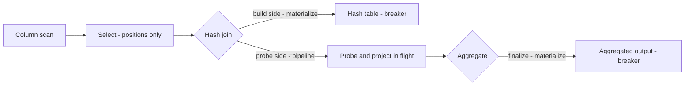
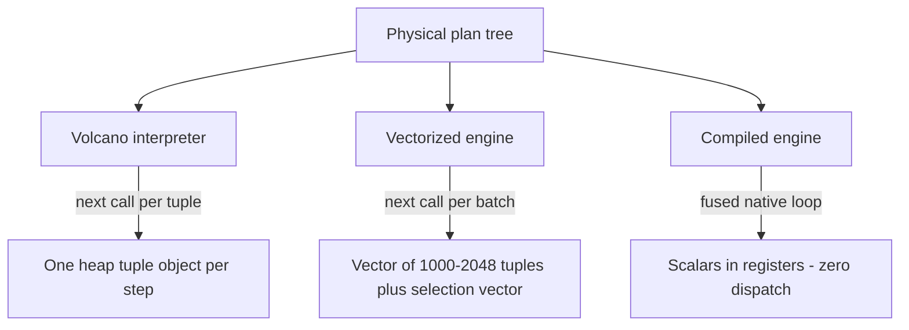

# Column-Store Execution: Vectorized Engines, Codegen, and the Column Algebra

## Overview

Column stores changed both *how data is laid out* and *how queries execute over it*. This page is about the second half: once your data is a set of column arrays, the execution engine stops being a tuple router and becomes an algebra over vectors — and two competing realizations of that algebra (vectorized interpretation and per-query compilation) now divide the analytical engine world. The lineage is MonetDB/X100 (CIDR 2005) → HyPer (ICDE 2011) → DuckDB/ClickHouse/Umbra today, and the trade between the two models is a standard senior-engine interview topic.

> Related: [Vectorized Execution](../advanced/vectorized-execution.md) — the batch model's implementation patterns and C code; [Data-Centric Query Compilation](../advanced/query-compilation.md) — the compiled model's code shape and Umbra's adaptivity; [Column Stores](../storage/column-stores.md) — the storage-layout half of the story.

## The interpretation tax, measured

The case against the classical Volcano iterator model is not aesthetic, it is a profile. The MonetDB/X100 paper (Boncz, Zukowski, Nes — CIDR 2005) profiled a simple full-scan aggregation in a tuple-at-a-time engine and found the overwhelming majority of CPU cycles spent on interpretation machinery — virtual `next()` calls, tuple-object construction, branchy dispatch — rather than on loading and comparing data. The tuple is the wrong unit of work for a modern CPU: each per-tuple function call defeats inlining, each heap-allocated tuple object defeats register allocation, and each per-tuple branch defeats the prefetcher. On the paper's era hardware that capped scan throughput at a small fraction of the memory bandwidth the hardware offered; the same structural gap is what [Vectorized Execution](../advanced/vectorized-execution.md) quantifies as 2-5 ns/tuple of pure overhead — seconds of waste per billion-tuple scan.

Three structural fixes existed, and they define the models on this page:

1. **Batch the tuples** — process a *vector* (X100 used ~1000 tuples; DuckDB uses 2048) per operator invocation, so the per-call cost amortizes and the inner loop compiles to SIMD. (Vectorized interpretation.)
2. **Erase the interpreter** — compile the plan itself into machine code, one fused loop per pipeline, so per-tuple overhead disappears entirely. (Data-centric compilation — HyPer.)
3. **Layout for the hardware** — keep the data columnar and fixed-width so the tight loop actually touches contiguous memory and SIMD lanes are full. (The column algebra's precondition; see [Columnar Formats](../advanced/columnar-formats.md).)

## The column algebra: operators as functions over vectors

X100's deeper idea is that in a column store, every operator becomes an algebraic function from vectors to vectors, and the *cheap, heavy primitive* replaces the per-tuple object call. A vectorized scan with a predicate does not produce tuples — it produces a **selection vector**: the integer positions of the qualifying rows. Downstream operators consume positions first and dereference column values only when needed. That single refactor is what makes column execution composable:

```text
SELECT region, SUM(price) FROM sales WHERE price > 100 GROUP BY region

vectorized primitive pipeline (vector size v = 1000):
  scan(price)        -> column vector P[0..v)
  select(P > 100)    -> positions[0..k),  k <= v        # no values touched yet
  project(region, positions) -> region values for k rows # values touched now
  hash-agg(region, price[positions]) -> group sums
```

The separation of *select on positions* from *materialize values* is **late materialization** in its execution-engine form: a query that filters 10 columns down to 0.1% of rows only ever dereferences the two columns it outputs, for the rows it outputs. In a row store the same query pays for all 10 columns of every row the moment it constructs the tuple. This is a large share of the column-store advantage on wide tables, and it is why [Late Materialization](../advanced/late-materialization.md) is an execution decision, not just a storage one. X100 reported orders-of-magnitude improvements over tuple-at-a-time MonetDB/MIL on join-heavy workloads and several-fold gains on pure scans — the exact numbers depend on the query mix, which is the honest way to quote the paper.



## Pipelining vs materialization: where the data slows down

Every execution model is defined by where it is forced to *materialize* — to stop streaming and write intermediate state. **Pipelined** operators pass work forward incrementally (scan → filter → project can run tuple-by-tuple or batch-by-batch with nothing on disk); **pipeline breakers** (hash-join build side, sort, aggregation finalize, materialized spool points) must consume their entire input before emitting anything. The distinction matters three ways in a column store:

- **Memory**: a breaker's input must exist in full — 100M rows × 100B is 10 GB you cannot avoid holding (or spilling) at the join build. Column layout helps: you materialize the two join columns, not whole rows, and dictionary encoding shrinks them further.
- **Late materialization interplay**: the later you dereference values, the smaller the materialized state at each breaker. DuckDB's selection vectors and X100's position lists are the same bet: positions are 4-8 bytes; values are whatever the schema says.
- **Parallelism**: morsel-driven engines (Umbra, HyPer) schedule *morsels* of a pipeline across cores; a breaker is where parallel work joins back and where the scheduler re-balances. Breaker placement is therefore also the parallelism granularity.

| Execution choice | Read cost | Materialized state | Best when |
|---|---|---|---|
| Early materialization (row tuples at scan) | pays all column widths immediately | largest at every breaker | narrow rows, point lookups |
| Late materialization (positions → values on demand) | dereference only needed columns | small; positions only | wide tables, selective filters |
| Selection vectors (no copy) | +1 indirection per access | 4B × survivors | filter-heavy pipelines (DuckDB: ~10-20% faster than copying) |
| Full batch copy on filter | memcpy of survivors | copy of survivors | downstream operators that iterate values repeatedly |

## From row tuples to vectors: what each operator becomes

The column algebra is easiest to internalize operator-by-operator. Each classical operator has a vectorized realization that changes its *interface* (batch + selection in/out) rather than its semantics:

| Operator | Tuple-at-a-time realization | Vectorized realization |
|---|---|---|
| Scan | emit one heap tuple per call | fill a column vector; optional zone-map block pruning first |
| Filter | evaluate predicate per tuple, branch per tuple | one SIMD compare + mask-compress over the vector → selection vector |
| Project | build output tuple | gather only selected positions' values from needed columns |
| Hash join | insert/lookup per tuple | build in batches; probe a batch's keys with vectorized hashing, per-lane verification |
| Aggregate | update accumulator per tuple | update per-group accumulators per batch; dictionary-encoded keys group by integer codes |
| Sort | swap tuple pointers | sort (key, position) pairs per column; late-binding to values |

The interface change is the point: because every operator consumes `(vector, selection)` and produces the same shape, operators compose like functions in a pipeline and the engine can interpose (profiling, adaptive decisions, offloading) without touching operator internals. This compositional contract is why Arrow's record batch became the industry interchange currency — it is the same shape at process boundaries.

## Vectorized engines: X100's descendants

The vectorized model won the open-source world. **DuckDB** processes data in vectors of 2048 with selection vectors between operators; its engineering blog documents why it stayed an interpreter with tight compiled inner loops rather than adopting full codegen — compile-time cost, debugging simplicity, and the observation that vectorized execution reaches within striking distance of compiled speed for most analytical queries. **ClickHouse** pushes the same model harder: blocks of up to 65,536 rows flow between a large library of specialized primitive functions, aggressively specialized per type and per operation, with SIMD inside each primitive; its docs and source are the reference for how far "interpret vectors with compiled kernels" scales. **Apache Arrow** standardized the in-memory columnar layout (validity bitmaps, fixed-width buffers, offsets) that makes these engines interoperable — an Arrow record batch is exactly the vectorized operator's currency.

**Spark** arrived at the same place from the distributed side: Volcano-style row iteration was replaced by **whole-stage code generation** (Tungsten) — operators of a pipeline are fused into a single generated Java function, then MPP-style vectorized execution was added in the **Photon** C++ engine (Databricks, 2022), which combines vectorized column batches with codegen on the hot loops. The pattern to remember: *vectorized structure, compiled inner loops* is the convergent industry answer, because it keeps the plan-level flexibility of interpretation while getting most of the codegen win where it matters (the scan/filter/aggregate inner loops).



## Compiled engines: HyPer and data-centric execution

Neumann's data-centric formulation (PVLDB 2011) inverts the iterator: an operator no longer *pulls* tuples from its child; the parent **consumes the child's data inside its own loop**, and the whole pipeline compiles to one flat nested-loop function per pipeline, split at breakers. **HyPer** (Kemper & Neumann, ICDE 2011) made this practical by targeting **LLVM IR**: the engine emits IR for the plan, LLVM's existing optimization passes (inlining, vectorization, register allocation) run over it, and the machine code is cached per plan. Compilation is milliseconds; execution then runs with zero virtual dispatch, tuples living in registers, and constants baked into immediate compares. [Data-Centric Query Compilation](../advanced/query-compilation.md) works through the emitted code shape and the Spark Tungsten variant in depth — this page stays at the architecture level.

The compiled model's costs are engineering-visible and real:

- **Compile time per plan** — amortized over long analytical queries trivially, but a short point query may never repay it; engines keep interpreter fallbacks for trivial plans (and Umbra, CIDR 2020, keeps a buffer manager plus adaptive dual-compiled plans to handle both).
- **Code cache coherence** — generated code embeds schema offsets; DDL must invalidate it.
- **Debuggability** — a native crash inside generated code is harder to attribute than a stack of interpreter frames; production engines invest heavily in IR-level instrumentation and logging.

### What the compiled pipeline actually looks like

The data-centric shape is worth being able to sketch. For `SELECT SUM(price) FROM lineitem JOIN orders ON l_key = o_key WHERE l_value > 10`, with `orders` on the build side:

```text
; pipeline 0 (breaker): build hash table from orders
for (j = 0; j < orders_n; j++)              ; column arrays, no tuple objects
    ht[orders_key[j]] = orders_price[j]     ; scalar stores, predictable strides

; pipeline 1 (fused): scan + filter + probe + project — one flat loop
for (i = 0; i < lineitem_n; i++)
    k  = lineitem_key[i]                    ; register-resident
    v  = lineitem_value[i]
    if (v > 10)                             ; predicate as immediate compare
        if (p = ht.find(k))                 ; probe; optionally vectorized
            sum += v * p                    ; no call, no heap, no branch to dispatch
```

That is the whole model: two loops, registers instead of tuple objects, materialization only at the breaker (the hash table). LLVM's job afterwards is register allocation, unrolling, and auto-vectorizing the probe loop — passes that already exist, which is precisely why the LLVM choice was the practical unlock.

### Choosing between the models: an engineering checklist

- **Workload length distribution** — many short queries: vectorized (no codegen to amortize); long scans/joins: compiled pays for itself in the first second.
- **Operator mix** — materialization-heavy (big hash builds, sorts): vectorized tends to win; compute-bound filters/projects on narrow columns: compiled wins.
- **Compile-time budget** — serverless/interactive per-query latency: keep an interpreter path; prepared-statement OLAP: compile and cache.
- **Team and tooling** — an interpreter ships with stack traces and debuggers; native codegen needs IR-level tooling and crash-symbol infrastructure. This is a real cost, and it appears in every postmortem of a codegen bug.
- **Portability** — LLVM targets multiple architectures from one IR; a hand-rolled SIMD kernel library must be maintained per ISA. Hybrid engines get portability from vectorized kernels and peak speed from compiled hot loops.

The two models' head-to-head (Kersten, Leis, Kemper, Neumann — "Everything You Always Wanted to Know About Compiled and Vectorized Queries," PVLDB 2018) is the citation to know: building both engines from the same codebase, they found **both dominate tuple-at-a-time by roughly an order of magnitude**, and **neither dominates the other across TPC-H/SSB-style queries** — compiled kernels win compute-bound scans; vectorized wins where materialization-heavy operators and short queries dominate. The paper's structure — same data layout, both models, measured per operator — is the honest template for any "which is faster" answer.

## SIMD selection scans: the innermost loop

The primitive everything above relies on is the vectorized scan with a selection vector, and its performance is almost entirely a memory-and-SIMD story:

- **SIMD widths**: a 32-bit integer predicate evaluates 4 lanes/instruction on SSE2, 8 on AVX2, 16 on AVX-512. The filter loop is a compare + mask + compress-store; AVX-512's `_mm512_compress_epi32` does the compaction in one instruction where pre-AVX-512 code does mask-bit extraction loops.
- **Branch elimination**: the tight loop has no per-tuple branch — the predicate result is a mask, not a control-flow decision. Branch mispredictions (one per unpredictable comparison in tuple-at-a-time code) were ~15-20 cycles each; removing them matters as much as the lanes.
- **Memory bandwidth ceiling**: once the loop is tight, the scan runs at the speed DRAM/NVMe delivers the column. Zone maps (per-block min/max) prune the scan before it starts — a predicate on a well-correlated column can skip most blocks entirely (see [Columnar Formats](../advanced/columnar-formats.md) and the encodings section of [Advanced Execution Engines](../advanced/execution-engines.md)).
- **Dictionary-encoded columns**: equality predicates become integer compares on dictionary codes (4-bit to 32-bit), letting one SIMD compare cover strings; this is why dictionary encoding is the default in every modern columnar format.

The sibling page [Vectorized Execution](../advanced/vectorized-execution.md) carries the working AVX2 filter code; the point to internalize here is architectural — the selection vector is the interface between the scan primitive and every other operator, and it is what keeps late materialization cheap all the way down.

### Walkthrough: one 8-lane filter iteration

For `price > 100` over int32 prices with AVX2 (8 lanes):

```text
load    v  = [p0 p1 p2 p3 p4 p5 p6 p7]      ; one 32-byte load
compare m  = v > 100                        ; one instruction, 8-wide mask
movemask   = mask to 8-bit lane mask, e.g. 0b10100100
compress    = compact survivors' positions into sel[]  (AVX-512: 1 instr)
advance     = sel_len += popcount(mask)                ; survivors appended
```

Six instructions cover 8 tuples; the same loop over 2048-tuple vectors is 256 iterations with zero data-dependent branches. The scalar tail loop handles the last <8 tuples — a detail every real kernel ships and every hand-rolled one forgets.

### Why row stores still exist under this model

Nothing above forbids vectorized execution over row storage — PostgreSQL-style engines get vectorized filters by scanning the row page into a column buffer first, paying a gather. The economics just invert: with 100B rows, the column store's 8 GB scan beats the row store's 100 GB pass regardless of the loop's quality, which is why vectorization and columnar layout are usually adopted *together* and why the row-store engines that stayed (PostgreSQL) kept tuple-at-a-time interpretation with JIT for expressions rather than full vectorization. The models are separable; the wins are not independent.

## Model comparison: the numbers worth quoting

| Property | Tuple-at-a-time (Volcano) | Vectorized (X100 lineage) | Compiled (HyPer lineage) | Hybrid (DuckDB, Photon, Umbra) |
|---|---|---|---|---|
| Unit of work | 1 tuple object | 1000-65536 tuples (X100 ~1000, DuckDB 2048, ClickHouse up to 65536) | whole pipeline | vectors + compiled inner loops |
| Per-tuple dispatch cost | 1-2 virtual calls (~2-5 ns) | amortized: ~0.01 ns/tuple class | zero (fused loop) | near-zero on hot loops |
| SIMD utilization | none | good (kernels written for it) | good (LLVM auto-vectorizes) | good |
| Preparation cost | none | none | ms-scale codegen per plan | ms-scale for specialized variants |
| vs tuple-at-a-time baseline | 1× | ~5-10× on scans/joins (X100 paper's range on its mix) | ~5-10× (Kersten 2018: both models ~an order of magnitude ahead) | ~5-10× |
| Vectorized vs compiled | — | wins on short queries, materialization-heavy ops | wins on compute-bound scans | adapts or combines |
| Representative systems | PostgreSQL executor, pre-Tungsten Spark | MonetDB/X100, ClickHouse, Snowflake's vectorized model | HyPer, Umbra, Spark Tungsten | DuckDB, Photon, Umbra's adaptive mode |

Quote the numbers with their sources and hedges: the X100 paper's speedups are against MonetDB/MIL on its workload mix; Kersten et al. 2018 is the controlled comparison and reports no clean winner; DuckDB's blog documents why a production team chose vectorized-with-compiled-loops. Anyone who tells you one model simply "wins" is reciting a tribal flag, not the literature.

## A bandwidth worked example: why layout dominates the inner loop

Put concrete numbers on the claim that layout decides scan speed. Consider 1 billion rows, a `price > 100` filter passing 10%, projecting `price` and `region`:

```text
Row store, early materialization (100B row):
  read  100B x 1e9 = 100 GB   (all columns, all rows)
  filter survivors = 1e8 rows -> project touches them again later
  memory traffic is 100 GB even though the answer needs ~2 columns of 10% rows

Column store, late materialization:
  read price (8B) x 1e9 = 8 GB            # predicate column only
  zone maps: if price is correlated with order, skip blocks -> often < 8 GB
  survivors 1e8 -> gather region (say 4B dict code) = 0.4 GB
  total ~8.4 GB — ~12x less traffic for the same query
```

At a realistic 10-20 GB/s single-socket memory bandwidth, that is the difference between a 5-second and a sub-second scan — before any SIMD. SIMD then accelerates the *filter* itself (8-16 lanes per instruction on the 8 GB of prices), but the 12× came from the algebra: positions over values, and values only where needed. This is the computation interviewers want you to be able to do on a whiteboard: bytes touched = predicate column width × rows + surviving output columns × survivors.

## Pull, push, and morsel-driven scheduling

Two remaining axis choices complete the model. **Pull vs push**: Volcano pulls (parent calls child `next()`); push-based engines (X100 primitives, DuckDB's newer push executor) let an operator hand results *down* to interested parents, which removes the last call overhead and makes pipeline composition explicit. **Scheduling across cores**: morsel-driven engines (HyPer, Umbra — see [Advanced Execution Engines](../advanced/execution-engines.md)) split each pipeline's work into morsels scheduled over a fixed pool of worker threads, so parallelism is data-parallel within a pipeline and re-joins at breakers — the same breakers this page already identified as materialization points. Batch size interacts with all of this (cache footprint, TLB pressure, SIMD width); DuckDB's 2048 and ClickHouse's 65,536 represent different points on the same trade, covered in the sibling page's adaptive-batch discussion.

## Timeline: how the field got here

| Year | System / paper | Contribution to the model |
|---|---|---|
| 1990s-2003 | MonetDB (CWI; "next-generation DBMS kernel," CIDR 2003) | column-at-a-time algebra — but materializes every intermediate, too cache-hostile |
| 2005 | MonetDB/X100 (CIDR 2005) | vectors of ~1000 + selection vectors + late materialization; kills the interpretation tax |
| 2011 | HyPer (ICDE 2011) + data-centric codegen (PVLDB 2011) | per-query LLVM compilation; pipelines as fused loops |
| 2013 | Lemire/Polychroniou SIMD work; Arrow line begins | SIMD primitives and a portable columnar interchange format |
| 2015-2017 | Spark Tungsten whole-stage codegen; ClickHouse open-sourced | codegen on the JVM at scale; extreme vectorized interpretation |
| 2018 | Kersten et al. head-to-head (PVLDB) | controlled comparison: no clean winner between the models |
| 2020 | Umbra (CIDR 2020) | compiled + buffer-managed + morsel-driven; adaptive specialization |
| 2022 | Databricks Photon | vectorized C++ + codegen hybrid on the biggest commercial engine |

The pattern across the timeline: every few years the pendulum swings one way, the papers then find the boundary conditions, and production settles on a hybrid. That is the normal trajectory of execution-engine research, and the column algebra is the substrate all of it stands on.

## Interview Questions

1. **Why is tuple-at-a-time execution slow, and what exactly does vectorization fix?** Each tuple pays one or two virtual `next()` calls, a heap tuple object, and an unpredictable branch — call it 2-5 ns of overhead against ~1 ns of useful compare work, so interpretation dominates the profile. Vectorization amortizes the call across 1000-2048 tuples, turns the per-tuple branch into a SIMD mask, and gives the compiler a tight loop it can auto-vectorize. The measured effect is roughly an order of magnitude on scan-heavy analytical queries, as profiled in the X100 paper.
2. **Explain late materialization in a column store.** The scan produces a selection vector — positions, not values. Downstream operators dereference column values only for surviving positions and only for the columns they need. On a wide table with a selective filter, the engine touches one column fully and the output columns for 0.1% of rows, instead of all columns of every row. Breakers materialize less state too, because positions are 4-8 bytes versus full row width.
3. **Vectorized vs compiled — which is faster, and when?** The controlled study (Kersten et al., PVLDB 2018) found both roughly an order of magnitude ahead of tuple-at-a-time and neither dominating the other: compiled wins compute-bound scans (zero dispatch, registers), vectorized wins materialization-heavy operators and short queries (no codegen to amortize). Production converged on hybrids — vectorized structure with compiled inner loops (DuckDB, Photon, Umbra's adaptive specialization) — which is itself the interview answer: the question as posed is a false dichotomy.
4. **Why did HyPer use LLVM instead of emitting C?** In-process IR generation compiles in milliseconds without spawning a toolchain; LLVM's passes (inlining, vectorization, register allocation) are mature and portable across x86/ARM; and emitting IR keeps the loop shape under the engine's control while delegating machine-specific optimization to the backend. Emitting C would add a compiler-process dependency, second-scale compile times, and weaker control over the generated loop structure.
5. **Where does data stop flowing in a plan, and why does it matter?** At pipeline breakers — hash-join build side, sort, aggregation finalize — an operator must consume all input before emitting. Breakers determine memory footprint (10 GB at a 100M-row join build), spill behavior, and in morsel-driven engines the points where parallel work re-joins and rebalances. Reading a plan's breakers is how you predict its memory profile before running it.
6. **What does the selection vector do for the rest of the engine?** It is the standard interface between a filtering primitive and every consumer: a compact (4 bytes per survivor) positional reference into the original batch that avoids copying data and defers value dereferencing. Aggregations, joins, and projections all take (batch, selection) pairs, which is what makes late materialization composable across an entire plan rather than a per-operator trick.

## Key Takeaways

- The X100 profile showed tuple-at-a-time engines spending most cycles on interpretation, not data — the column algebra's answer is operators as **vector→vector primitives** with **selection vectors** separating select-on-positions from materialize-values.
- **Late materialization** is the execution-side payoff of column layout: dereference only needed columns, only for surviving rows; it composes because the selection vector is a uniform operator interface.
- **Pipeline breakers** (hash build, sort, agg finalize) are where data materializes: they set memory footprint, spill behavior, and parallel re-join points; everything else pipelines.
- **Vectorized engines** (DuckDB 2048-tuple vectors, ClickHouse up-to-65536-row blocks, Snowflake) interpret batch-at-a-time with SIMD kernels; **compiled engines** (HyPer/Umbra via LLVM IR; Spark Tungsten via JVM codegen) fuse pipelines into native loops with zero dispatch.
- The controlled head-to-head (Kersten et al., PVLDB 2018): both models ~an order of magnitude ahead of tuple-at-a-time; **no clean winner** — compiled wins compute-bound scans, vectorized wins materialization-heavy ops and short queries.
- Industry converged on **hybrids**: vectorized structure with compiled inner loops (DuckDB, Photon, Umbra adaptive specialization).
- SIMD scans are bounded by memory bandwidth and zone-map pruning, not by lanes — layout, encoding, and min/max pruning decide scan speed before SIMD width does.

## References

- Boncz, Zukowski, Nes. "MonetDB/X100: Hyper-Pipelined Query Execution." CIDR 2005. https://www.cidrdb.org/cidr2005/papers/P19.pdf
- MonetDB project site (the column-store lineage's origin). https://www.monetdb.org/
- Neumann. "Efficiently Compiling Efficient Query Plans for Modern Hardware." PVLDB 4(9), 2011. https://doi.org/10.14778/2002938.2002940
- Kemper, Neumann. "HyPer: A Hybrid OLTP&OLAP Main Memory Database System Based on Virtual Memory Snapshots." ICDE 2011. https://doi.org/10.1109/ICDE.2011.5767867
- Kersten, Leis, Kemper, Neumann. "Everything You Always Wanted to Know About Compiled and Vectorized Queries But Were Afraid to Ask." PVLDB 11(13), 2018. https://www.vldb.org/pvldb/vol11/p2209-kersten.pdf
- Neumann, Freudenreich. "Umbra: A Disk-Based System with Efficient Memory Access." CIDR 2020. https://www.cidrdb.org/cidr2020/papers/p29-neumann-cidr20.pdf
- Raasveldt, Mühleisen. "The Complete Vectorized Execution Story" (DuckDB internals blog). https://duckdb.org/2022/03/13/duckdb-internal-3.html
- DuckDB documentation. https://duckdb.org/docs/
- ClickHouse documentation (blocks, primitive specialization). https://clickhouse.com/docs
- Apache Spark — SQL Performance Tuning (whole-stage codegen, AQE). https://spark.apache.org/docs/latest/sql-performance-tuning.html
- Databricks. "Introducing Photon" (2022). https://databricks.com/blog/2022/06/28/introducing-photon.html
- Apache Arrow columnar format specification. https://arrow.apache.org/docs/format/Columnar.html

## Cross-References

- [Query Execution Models](./query-execution.md) — the Volcano/materialization baseline this page attacks
- [Vectorized Execution](../advanced/vectorized-execution.md) — batch-model implementation with working SIMD C code
- [Data-Centric Query Compilation](../advanced/query-compilation.md) — the compiled model's code shape, Tungsten, and Umbra
- [Advanced Execution Engines](../advanced/execution-engines.md) — survey incl. morsel-driven parallelism and encodings
- [Late Materialization](../advanced/late-materialization.md) — the storage-and-execution trade in full
- [Column Stores](../storage/column-stores.md) — the storage-layout half of the story
