# Compaction

## Overview

Compaction is the process of merging and reorganizing SSTables in LSM-tree-based storage engines. It serves three critical purposes: **reclaiming space** from overwritten/deleted data, **removing tombstones**, and **improving read performance** by reducing the number of files that must be checked. Without compaction, LSM trees would grow unboundedly and reads would become progressively slower.

Compaction strategy choice is one of the most impactful tuning decisions in write-heavy databases. The right strategy depends on the workload: write-heavy, read-heavy, time-series, or mixed.

## Detailed Explanation

### Why Compaction is Necessary

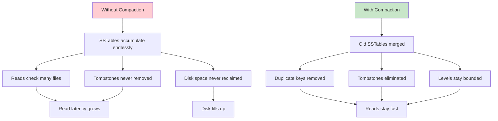

### The Three Amplification Metrics

Compaction design involves balancing three competing metrics:

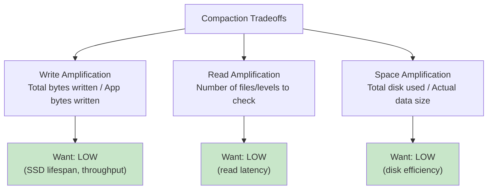

**The fundamental tradeoff:** You can optimize for at most two of three:

| Strategy | Write Amp | Read Amp | Space Amp |
|----------|-----------|----------|-----------|
| **Size-Tiered** | Low | High | High |
| **Leveled** | High | Low | Low |
| **FIFO** | None | Highest | High |
| **Universal** | Medium | Medium | Medium |

### Size-Tiered Compaction (STCS)

SSTables are grouped into **tiers** by size. When enough similarly-sized SSTables accumulate, they're merged into one larger SSTable.

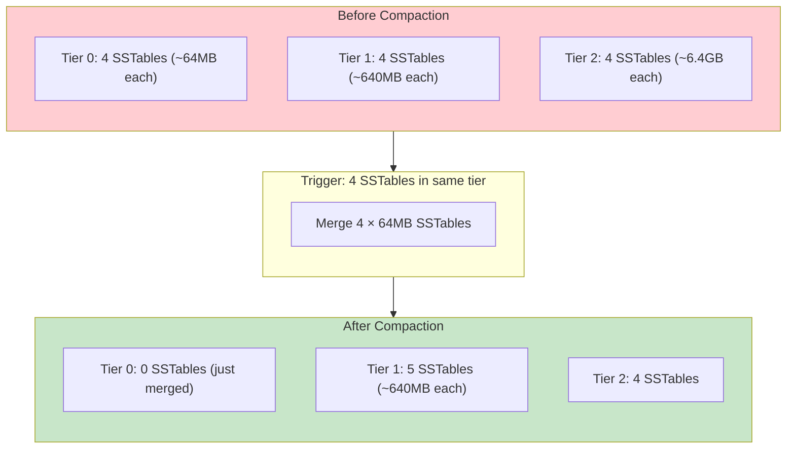

**How it works:**
1. New SSTables are created from memtable flushes (all roughly the same size)
2. When `min_threshold` (default: 4) SSTables of similar size accumulate, they're merged
3. The merged SSTable is placed in the next tier
4. Process repeats up the size tiers

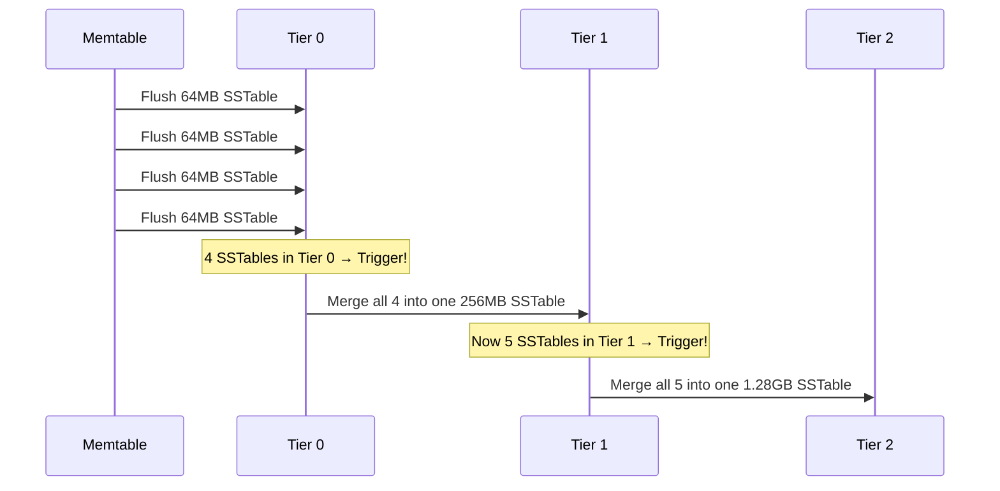

| Pros | Cons |
|------|------|
| Low write amplification (each byte written ~once per tier) | High space amplification (up to 2× during compaction) |
| Simple to implement | High read amplification (overlapping key ranges) |
| Good for write-heavy workloads | Compaction spikes can cause latency jitter |

**Used by:** Cassandra (default in older versions), HBase, ScyllaDB

### Leveled Compaction (LCS)

SSTables are organized into **non-overlapping levels** with a fixed size ratio between levels. When a level exceeds its size limit, one SSTable is merged into the next level.

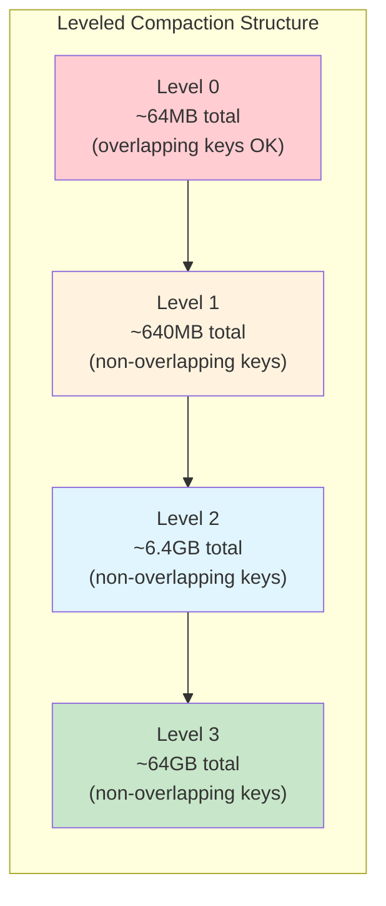

**How it works:**
1. Memtable flushes go to L0 (overlapping keys allowed)
2. When L0 exceeds its limit, pick one SSTable and merge it into L1
3. During merge into L1, find all overlapping SSTables in L1, merge-sort them, write new SSTables
4. If L1 exceeds its limit (typically 10× L0), repeat the process down to L2
5. Each level has non-overlapping key ranges → at most one SSTable per level contains a given key

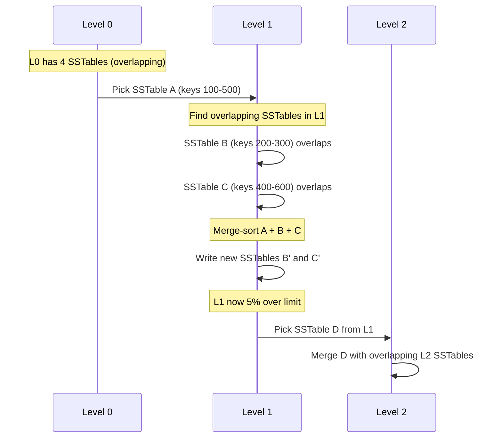

| Pros | Cons |
|------|------|
| Low read amplification (O(1) per level, O(L) total) | High write amplification (10× per level) |
| Low space amplification (~1.1×) | Compaction is more complex |
| Predictable read latency | Write-heavy workloads cause constant compaction |

**Used by:** RocksDB (default), LevelDB, Cassandra (when configured)

### FIFO Compaction

The simplest strategy: SSTables are stored in order of creation. When total size exceeds a limit, the **oldest SSTables are simply deleted**. No merging.

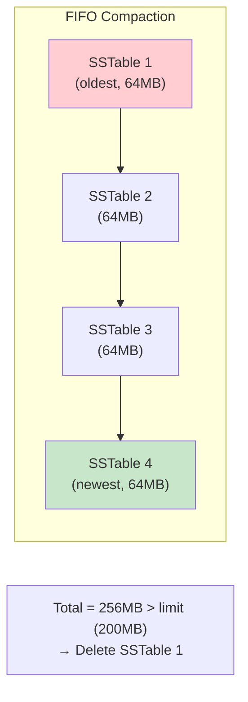

| Pros | Cons |
|------|------|
| Zero write amplification | Only works for TTL/time-series data |
| Minimal CPU usage | Old data is lost forever |
| Very fast | Reads check all SSTables (no merging) |

**Used by:** RocksDB (for time-series workloads with TTL), Cassandra (TimeWindowCompactionStrategy)

### Universal Compaction (RocksDB)

Universal compaction is RocksDB's adaptive strategy that triggers compaction based on **space amplification** and **size ratios** rather than fixed levels:

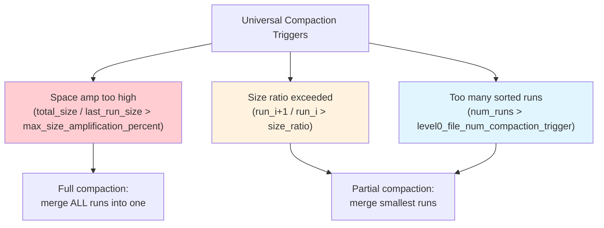

| Pros | Cons |
|------|------|
| Adaptive to workload | Higher space amplification than leveled |
| Lower write amplification than leveled | Less predictable read latency |
| Good for write-heavy workloads | Full compaction causes temporary disk usage spike |

### Size-Tiered vs. Leveled: Detailed Comparison

```mermaid
flowchart TD
    subgraph STCS_Detail["Size-Tiered (STCS)"]
        direction TB
        ST1["SSTables grouped by SIZE"]
        ST2["Overlapping key ranges within tier"]
        ST3["Merge when N SSTables of similar size"]
        ST4["Good for: Write-heavy, time-series"]
    end

    subgraph LCS_Detail["Leveled (LCS)"]
        direction TB
        LC1["SSTables in non-overlapping LEVELS"]
        LC2["Each level has sorted, non-overlapping ranges"]
        LC3["Merge one SSTable at a time into next level"]
        LC4["Good for: Read-heavy, mixed workloads"]
    end

    style STCS_Detail fill:#e1f5fe
    style LCS_Detail fill:#c8e6c9
```

| Metric | Size-Tiered | Leveled |
|--------|-------------|---------|
| **Write amplification** | ~O(N) total (once per tier) | ~O(level_ratio × num_levels) ≈ 10-30× |
| **Read amplification** | O(num_tiers × files_per_tier) | O(num_levels) — one SSTable per level |
| **Space amplification** | Up to 2× (during compaction) | ~1.1× (only overlap during merge) |
| **Compaction trigger** | Count of similar-sized SSTables | Level size exceeds limit |
| **Best for** | Write-heavy, bulk loading | Read-heavy, point lookups |

### Cassandra's Compaction Strategies

Cassandra offers multiple strategies, each suited for different workloads:

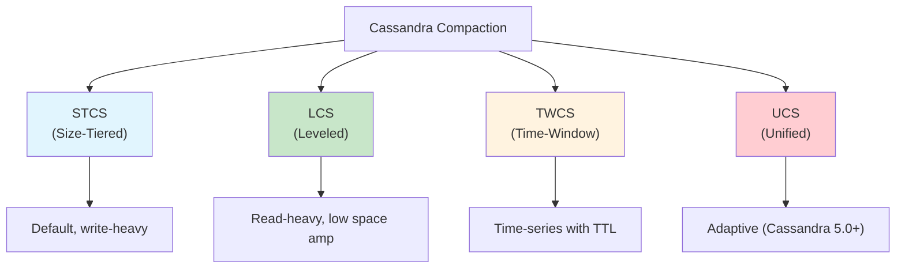

**TimeWindowCompactionStrategy (TWCS):**
- Groups SSTables into time windows (e.g., 1 hour)
- Within each window, uses STCS
- Old windows are never compacted again (just deleted when all data expires)
- Perfect for time-series with TTL (IoT, logs, metrics)

### Compaction Internals: How a Merge Works

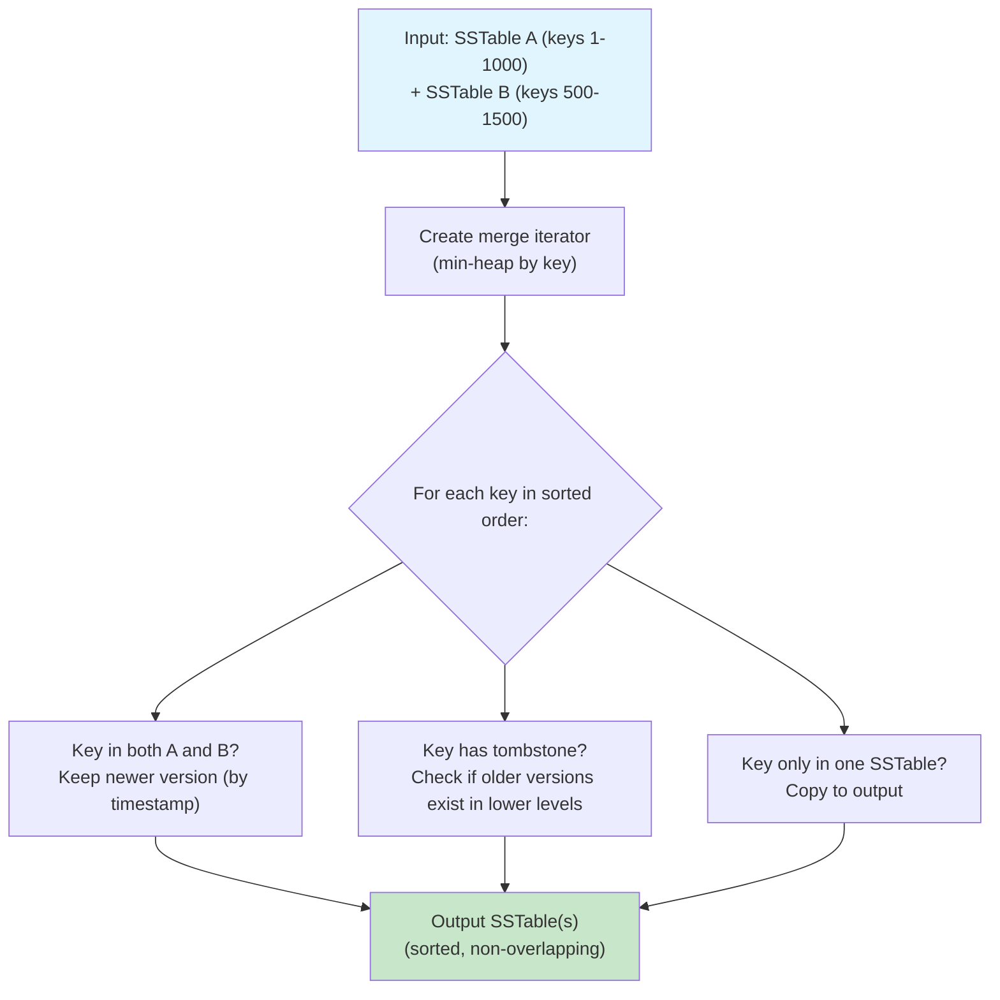

**Compaction output:**
- Merge-sort all input SSTables
- Deduplicate keys (keep latest version)
- Remove tombstones if safe (no older versions in lower levels)
- Apply merge operators (RocksDB feature)
- Write new SSTables with updated Bloom filters and indexes

### Rate Limiting and Priority

Compaction can saturate disk I/O, causing latency spikes for foreground reads/writes. Modern engines provide rate limiting:

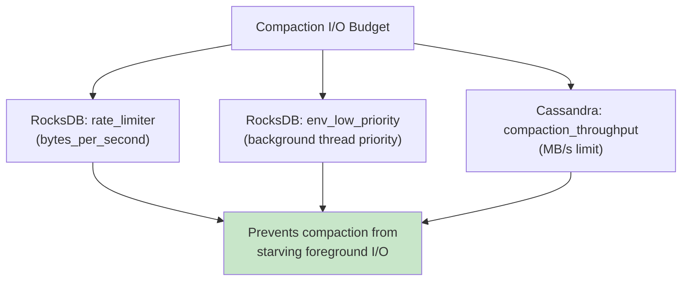

| Engine | Rate Limit Mechanism | Default |
|--------|---------------------|---------|
| **RocksDB** | `rate_limiter` (bytes/sec) | Disabled |
| **Cassandra** | `compaction_throughput_mb_per_sec` | 16 MB/s |
| **ScyllaDB** | I/O scheduler with shares | Adaptive |

### Compaction and SSD Wear

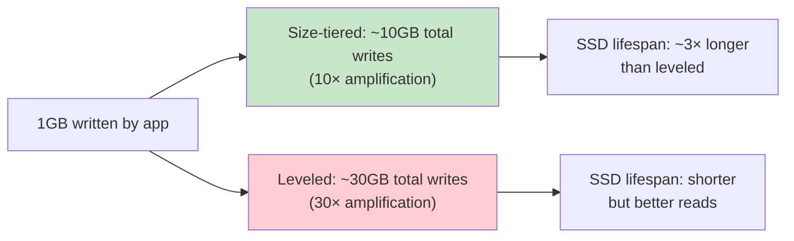

A typical consumer SSD has ~1,000-3,000 TBW (terabytes written). With 30× write amplification and 100GB/day app writes, that's 3TB/day actual writes → SSD dies in ~1-3 years.

## Cross-References

- [LSM Trees](./lsm-trees.md) — The data structure that compaction operates on
- [Database Engines](./engines.md) — How different engines implement compaction
- [WAL](./wal.md) — The durability layer; WAL files are deleted after memtable flush
- [Key-Value Stores](../nosql/key-value.md) — LSM-based KV stores depend on compaction
- [Column-family Stores](../nosql/column-family.md) — Cassandra compaction strategies

## Interview Questions

### Beginner

**Q: What is compaction in an LSM tree?**
A: Compaction is the process of merging multiple SSTables into fewer, larger SSTables. It removes duplicate keys, eliminates tombstones, and reclaims disk space. Without compaction, the database would grow unboundedly and reads would get slower.

**Q: Why can't we just delete old SSTables instead of compacting?**
A: Because SSTables may contain keys that are still valid in older versions. Compaction merge-sorts all SSTables, keeping only the latest version of each key. Simply deleting an SSTable could lose data.

**Q: What is a tombstone?**
A: A tombstone is a special marker inserted when a key is deleted. Since LSM trees are append-only, the deletion is recorded as "key X → TOMBSTONE." During compaction, when the tombstone reaches the bottom level and all older versions are gone, the tombstone itself is removed.

### Intermediate

**Q: Compare size-tiered and leveled compaction. When would you use each?**
A: **Size-tiered** has lower write amplification but higher space and read amplification. Use it for write-heavy workloads (e.g., logging, time-series). **Leveled** has higher write amplification but lower space and read amplification. Use it for read-heavy or mixed workloads (e.g., user databases, e-commerce).

**Q: What is write amplification and how does compaction strategy affect it?**
A: Write amplification = total bytes written to storage / bytes written by application. Size-tiered has ~10× write amplification (each byte merged once per tier). Leveled has ~10-30× (each level has a 10× size ratio, and SSTables are rewritten during merge). FIFO has 0× (no merging).

**Q: How does RocksDB's universal compaction differ from leveled?**
A: Universal compaction doesn't use fixed levels. Instead, it triggers compaction based on space amplification thresholds and size ratios between sorted runs. It merges runs adaptively, offering lower write amplification than leveled at the cost of higher space amplification.

### Advanced (FAANG-Level)

**Q: A database has 1TB of data, 100GB/day writes, and uses leveled compaction with a 10× size ratio. Estimate the daily write amplification and SSD impact.**
A:
- 100GB/day app writes
- Leveled compaction: each byte rewritten ~10× per level, ~4 levels for 1TB → ~30× write amplification
- Total disk writes: 100GB × 30 = 3TB/day
- Consumer SSD (1000 TBW): lasts ~1000 / 3 = 333 days ≈ 11 months
- Enterprise SSD (10,000 TBW): lasts ~9 years
**Mitigation:** Use universal compaction, increase `max_bytes_for_level_multiplier`, or use tiered storage (hot data on SSD, cold on HDD).

**Q: Design a compaction strategy for a time-series database with 30-day TTL.**
A: Use FIFO or Time-Window compaction:
- Partition data into 1-hour windows
- Within each window, use size-tiered compaction
- After 30 days, entire windows are deleted (no merge needed)
- This gives: zero write amplification for old data, bounded space (exactly 30 days), and fast writes
- Cassandra's TWCS does exactly this

**Q: How would you detect and mitigate compaction-induced latency spikes?**
A:
1. **Monitor**: Track `compaction_pending`, `compaction_running`, and P99 read/write latency
2. **Rate limit**: Set `rate_limiter` (RocksDB) or `compaction_throughput` (Cassandra)
3. **Backpressure**: Pause compaction when foreground latency exceeds threshold
4. **Tune triggers**: Increase `level0_slowdown_writes_trigger` and `level0_stop_writes_trigger` to avoid write stalls
5. **Separate I/O**: Put WAL on a different disk from SSTables
6. **Use direct I/O**: Bypass OS page cache to avoid double-buffering

## Common Mistakes

1. **Not monitoring compaction debt**: If compaction falls behind, L0 accumulates files, eventually stalling writes. Monitor `rocksdb.num-running-compactions` and `compaction_pending`.

2. **Using leveled compaction for write-heavy workloads**: The 10-30× write amplification will kill SSD lifespan and throughput. Use size-tiered or universal instead.

3. **Ignoring tombstone accumulation**: In delete-heavy workloads, tombstones persist until they reach the bottom level. Use range tombstones and ensure compaction reaches the bottom level.

4. **Setting compaction throughput too low**: If compaction can't keep up with writes, the system degrades. Set throughput based on available disk bandwidth.

5. **Forgetting about space overhead during compaction**: Compaction temporarily doubles disk usage (input + output). Ensure enough free space before large compactions.

## Summary and Revision Notes

- **Compaction** = merge SSTables to reclaim space, remove tombstones, improve reads
- **Three metrics**: Write amplification, Read amplification, Space amplification (pick two to optimize)
- **Size-tiered (STCS)**: Merge similar-sized SSTables; low write amp, high space/read amp
- **Leveled (LCS)**: Non-overlapping levels, merge one SSTable at a time; high write amp, low read/space amp
- **FIFO**: Delete oldest SSTables; zero write amp, only for TTL data
- **Universal (RocksDB)**: Adaptive, triggers on space amp and size ratio
- **TWCS (Cassandra)**: Time-windowed, perfect for time-series with TTL
- **Write amplification**: Critical for SSD lifespan; 10-30× is typical for leveled compaction
- **Rate limiting**: Prevents compaction from starving foreground I/O
- **Tombstones**: Deletions in LSM; removed only when compaction reaches bottom level
