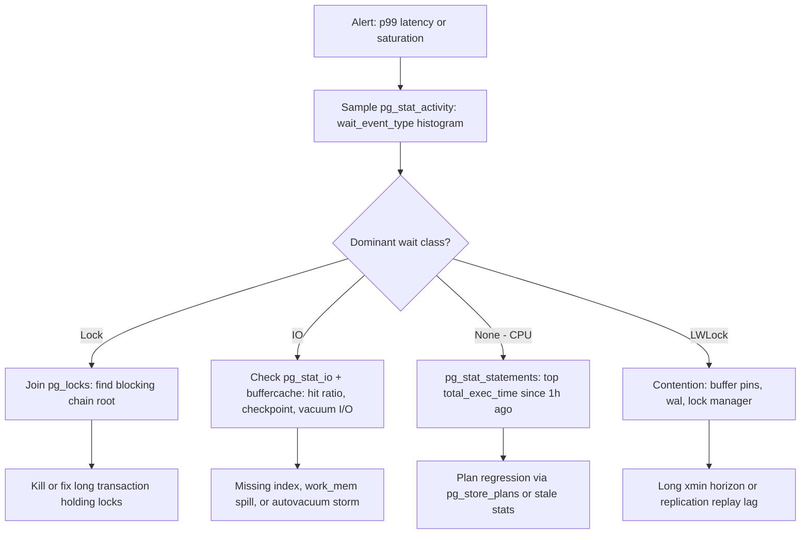

# Database Observability: Internals-Facing Monitoring

## Overview

Observability at the application layer watches logs, traces, and metrics; **internals-facing observability** watches the database's own accounting: statement statistics, wait events, lock graphs, buffer-pool contents, and vacuum progress. This page covers the instrumentation surfaces a backend/DBA interviewer expects you to name precisely — `pg_stat_statements`, the `pg_stat_*` family, wait-event models in Postgres/MySQL/Oracle, `pg_locks`/`pg_buffercache`/`pg_stat_io`, MySQL's `performance_schema` + `sys`, plan sampling with `pg_store_plans`, the mechanics inside `EXPLAIN ANALYZE`, autovacuum monitoring, and what cloud-native Postgres/Aurora expose instead — then assembles them into a health dashboard with a triage flow and threshold table. Query-plan reading itself is covered in [Execution Plans](../query-processing/execution-plans.md) and cost estimation in [Cardinality Estimation](../advanced/cardinality-estimation.md).

## Postgres: The Statistics Collector Ecosystem

Postgres instruments itself through the cumulative `pg_stat_*` views (counters since last reset, kept in shared memory and persisted across restarts) and the `pg_stat_statements` extension for statement-level detail. The statement view normalizes queries — literal constants become `$1` placeholders, merged into one entry keyed by `queryid` — and accumulates per entry: `calls`, `total_exec_time`, `mean_exec_time`, `rows`, `shared_blks_hit/read/dirtied`, `temp_blks_read/written`, `wal_bytes` (PG13+), and `blk_read_time/blk_write_time` when `track_io_timing = on`. Four derived columns answer 80% of "why is the database slow": mean time (latency), `shared_blks_read` per call (cache misses → I/O pressure), `temp_blks_written` (sorts/hash spills exceeding `work_mem`), and `rows/calls` (write-amplification on the planner's assumptions). The extension costs CPU per statement aggregation; `pg_stat_statements.max` (default 5000) caps entries, and overflow evicts round-robin — which silently hides the query you care about on high-cardinality workloads (many distinct literal patterns). Statement-tuning methodology built on this view is in [Index Tuning](../indexing/tuning.md).

```sql
-- Top offenders by total time with I/O context (Postgres)
SELECT calls, mean_exec_time AS mean_ms, rows,
       shared_blks_hit, shared_blks_read,
       temp_blks_written, queryid, left(query, 80) AS query
FROM pg_stat_statements
ORDER BY total_exec_time DESC
LIMIT 20;
```

The rest of the family fills in the per-object picture: `pg_stat_user_tables` (seq_scan vs idx_scan ratios, `n_live_tup`/`n_dead_tup`, `last_autovacuum`, `autovacuum_count`), `pg_stat_database` (`xact_commit/rollback`, `blks_hit/blks_read`, `deadlocks`, `temp_files`), `pg_stat_replication` (Lag distances), and `pg_stat_progress_*` views (PG12+) that stream live progress of VACUUM, CLUSTER, CREATE INDEX, and base backups — the difference between "the maintenance job is stuck" and "it is 80% through phase 3 of 7."

## Wait Events: Postgres, MySQL, Oracle Models

A **wait event** is the instrumented answer to "what is this backend doing right now instead of running on CPU." Postgres (9.6+) exposes two columns on `pg_stat_activity`: `wait_event_type` ∈ {LWLock, Lock, BufferPin, IO, IPC, Activity, Client, Extension, Timeout} and `wait_event` (e.g. `LWLock:buffer_content`, `Lock:transactionid`, `IO:DataFileRead`). Sampling `pg_stat_activity` every second and histogramming wait types gives a service-level profile: a healthy OLTP Postgres is mostly `Client:ClientRead` (idle waiting for the app) with a thin band of `IO:DataFileRead`; a lock-contention incident shows a tall `Lock:transactionid` bar whose root is one blocked session. The extension [pg_wait_sampling](https://github.com/postgrespro/pg_wait_sampling) collects these samples continuously so the histogram survives bursty incidents.

The three engines model this differently:

| Aspect | PostgreSQL | MySQL (performance_schema) | Oracle |
|---|---|---|---|
| Live view | `pg_stat_activity.wait_event` | `events_waits_current` + threads | `v$session.wait_class` |
| History | None built-in (extensions: pg_wait_sampling) | Tables in performance_schema | AWR snapshots, ASH sampling |
| Granularity | Backend-level, ~200 named events | Instrument hierarchy: wait/io/file, wait/io/table, statement, stage, memory/idle | Event + wait class (User I/O, Commit, Concurrency, Cluster, ...) |
| Aggregates | None (compute by sampling) | `events_waits_summary_global_by_event_name` | `v$system_event`, `v$waitclassstat` |
| Idle handling | `Client:ClientRead` is an event | `idle` instrument per event | Idle class excluded from DB Time |

Oracle is the reference design — DB Time = sum of non-idle wait + CPU time, with AWR diffing two snapshots to attribute load — and both Postgres and MySQL have been converging toward it. In an interview, the strongest signal is *using* the model: "the box is at 100% CPU but average query latency tripled" → sample `pg_stat_activity`; if backends show no wait events, the time is CPU inside queries → go to `pg_stat_statements`; if it shows `IO:DataFileRead`, the cache hit ratio and checkpoint/compaction activity explain it.

## Locks, Buffers, and I/O Views

**`pg_locks`** lists every lock (locktype, relation, mode, `granted`) per pid; a blocking chain is found by joining ungranted lockers to holders on the same lockable object. Deadlocks are detected automatically (and counted in `pg_stat_database.deadlocks`), but the production killer is the *undead* version: a long transaction holding locks with a queue of waiters. `log_lock_waits = on` logs any session blocked > `deadlock_timeout` (1s default) with the chain — cheap insurance.

```sql
-- Who is blocking whom right now (Postgres)
SELECT lw.pid  AS waiter_pid,
       wa.wait_event_type,
       wa.query AS waiter_query,
       lh.pid  AS blocker_pid,
       la.query AS blocker_query
FROM pg_locks lw
JOIN pg_locks lh ON lh.granted
  AND lw.locktype = lh.locktype
  AND lw.relation IS NOT DISTINCT FROM lh.relation
  AND lw.transactionid IS NOT DISTINCT FROM lh.transactionid
JOIN pg_stat_activity wa ON wa.pid = lw.pid
JOIN pg_stat_activity la ON la.pid = lh.pid
WHERE NOT lw.granted AND lw.pid <> lh.pid;
```

**`pg_buffercache`** (extension) inspects shared buffers page-by-page: `usagecount` histogram shows eviction pressure, `isdirty` counts write-back backlog, and per-relation grouping finds tables that thrash the cache. **`pg_stat_io`** (PG16+) is the modern I/O surface: reads, hits, extends, fsyncs, evictions, and writebacks broken out by `backend_type` and `context` (`normal`, `vacuum`, `checkpoint`) — finally making "how much I/O does autovacuum cause" a one-query answer. Together these three views cover the resource triad: contention (locks), memory (buffer cache), and disk (I/O).

```sql
-- Buffer pool pressure: usagecount histogram + dirtiest relations
SELECT usagecount, isdirty, count(*) AS pages
FROM pg_buffercache
GROUP BY usagecount, isdirty ORDER BY usagecount;

-- PG16+: I/O by backend type and context (who is causing reads/fsyncs?)
SELECT backend_type, context,
       sum(reads) AS reads, sum(hits) AS hits,
       sum(fsyncs) AS fsyncs, sum(evictions) AS evictions
FROM pg_stat_io
GROUP BY backend_type, context
ORDER BY reads DESC;
```

A page at `usagecount=5` survived five clock-sweep passes (hot); a heap dominated by `usagecount=0-1` pages means scans are evicting the working set — the buffer-pool-level confirmation of the cache-hit-ratio alert. `pg_stat_io` rows where `backend_type = autovacuum worker` dwarfing client backends is the signature of an autovacuum storm masquerading as "random I/O slowness."

## MySQL: performance_schema + sys Schema

MySQL's equivalent surface is **performance_schema**, a low-overhead instrumentation engine enabled since 5.7 by default, whose consumers are configured in `setup_instruments`/`setup_consumers`. The workhorses: `events_statements_summary_by_digest` (normalized statements with `COUNT_STAR`, `SUM_TIMER_WAIT`, `SUM_NO_INDEX_USED`, `SUM_NO_GOOD_INDEX_USED` — the MySQL twin of `pg_stat_statements`), `table_io_waits_summary_by_table` (per-table I/O time), `events_waits_current` for live waits, and `metadata_locks` for DDL-blocking-traffic diagnosis. The **sys schema** is the human-friendly layer over it: `sys.innodb_lock_waits` (blocking chains ready-made), `sys.statements_with_full_table_scans`, `sys.schema_tables_with_full_table_scans`, `sys.user_summary_by_statement_type` — views you would otherwise hand-write. MySQL's EXPLAIN ANALYZE (8.0.18+) reports actual per-iterator time and rows, mirroring Postgres's mechanics described below. Lock diagnosis and the InnoDB side of this are cross-linked in [Key-Range Locking](../advanced/key-range-locking.md).

```sql
-- Top statements by total latency (MySQL performance_schema)
SELECT DIGEST_TEXT, COUNT_STAR,
       ROUND(SUM_TIMER_WAIT / 1e12, 3)  AS total_sec,
       ROUND(AVG_TIMER_WAIT / 1e9, 3)   AS avg_ms,
       SUM_NO_INDEX_USED, SUM_NO_GOOD_INDEX_USED
FROM performance_schema.events_statements_summary_by_digest
ORDER BY SUM_TIMER_WAIT DESC
LIMIT 10;

-- Ready-made blocking chains via sys
SELECT * FROM sys.innodb_lock_waits;
```

Two operational notes matter in interviews. First, the digest table is **bounded** (`performance_schema_digests_size`, default ~5,000 entries) and evicts with a `DIGEST = NULL` catch-all row on digest-cardinality explosions — the MySQL twin of `pg_stat_statements` eviction. Second, consumers must be enabled (`setup_consumers.events_statements_current = YES` and the `statements_digest` consumer) or the tables are silently empty; the sys views inherit whatever the instrumentation captured, so "sys shows nothing" is usually a configuration finding, not a performance one.

## Plan Sampling: pg_store_plans and auto_explain

`pg_stat_statements` tells you *that* a query is slow but not *which plan* it used — and plan regressions (a parameterized query switching from index scan to seq scan on data drift) are among the most common silent outages. The **pg_store_plans** extension fills this: it samples (configurable `pg_store_plans.sample_ratio`) and stores plans keyed by `queryid` + plan hash alongside execution counts, so you can query "show me all plans this queryid has used in the last week" and alert on a plan change correlated with a latency jump. Its sibling **auto_explain** (a `shared_preload_libraries` module) logs plans automatically for statements exceeding `auto_explain.log_min_duration`; with `auto_explain.log_analyze = on` and `log_buffers = on` the logged plan includes actual timings and buffer usage — effectively on-demand EXPLAIN ANALYZE for statements you did not think to catch live. Both complement the plan-cache mechanics described in [Plan Caching](../query-processing/plan-caching.md): one answers "what plans exist," the other "what plan did the slow run use."

## EXPLAIN ANALYZE Mechanics

`EXPLAIN ANALYZE` actually executes the statement and decorates each plan node with the measured truth; reading it well means knowing what each field is *counting*. `actual time=0.412..1.873` is per-loop start..end in ms; **`loops=1000` means every other number is per-loop** — actual rows is the per-loop average, so total rows ≈ `rows × loops`, and the common rookie error is comparing a plan estimate against per-loop rows. `actual rows` vs planner `rows` is the misestimation signal: a 10× gap is noise from sampling, a 1000× gap is stale statistics, cross-column correlation, or a misapplied predicate class — and the fix is `ANALYZe`, extended statistics (`CREATE STATISTICS`), or a plan-affecting rewrite (see [Cardinality Estimation](../advanced/cardinality-estimation.md)).

`Buffers: shared hit=N read=N dirtied=N written=N` (shown with `BUFFERS` on PG13+, default with ANALYZE) is the memory-truth layer: `hit` pages came from shared_buffers, `read` from disk (or the OS cache — a `read` is a kernel read, not necessarily a physical I/O), `dirtied/written` count pages modified/flushed. `temp read/written` blocks are spills to disk from sorts and hash joins that exceeded `work_mem` — the single most actionable number in the output, since raising `work_mem` per-session or adding a supporting index removes the spill entirely. Timings include executor overhead but `ANALYZE`'s per-tuple timing instrumentation itself distorts fast nodes; `timimg off` variant (`EXPLAIN (ANALYZE, TIMING OFF)`) gives stable measurements on hot paths.

```sql
EXPLAIN (ANALYZE, BUFFERS, WAL)
SELECT o.id, o.total FROM orders o
JOIN customers c ON c.id = o.customer_id
WHERE o.created_at > now() - interval '1 day';
-- Sort Method: external merge  Disk: 512kB   -> work_mem too small
-- Rows Removed by Filter: 998000 -> predicate not indexed
```

## VACUUM and Autovacuum Monitoring

MVCC leaves dead tuples behind (mechanics in [MVCC Garbage Collection](../advanced/mvcc-garbage-collection.md)); autovacuum reclaims them lazily. A table is queued for vacuum when `n_dead_tup > autovacuum_vacuum_threshold (50) + autovacuum_vacuum_scale_factor (0.2) × reltuples`, and for analyze at scale factor 0.1 — which on a 500M-row table means ~100M dead tuples *before* the default policy acts, so production tables override per-table storage parameters (`autovacuum_vacuum_scale_factor = 0.01` or `autovacuum_vacuum_insert_threshold` on PG13+ for append-only tables). Monitoring surfaces: `pg_stat_user_tables.n_dead_tup` and `last_autovacuum` (a table vacuumed weeks ago that once vacuumed daily is the classic regression), `pg_stat_progress_vacuum` for live runs, `pgstattuple` for precise bloat percentages, and `log_autovacuum_min_duration = 0` for a complete vacuum audit trail.

The hard ceiling is **transaction-ID wraparound**: Postgres must freeze old tuples before `age(datfrozenxid)` approaches 2³¹, so `SELECT datname, age(datfrozenxid) FROM pg_database` is a dashboard metric with hard thresholds — the shipped `autovacuum_freeze_max_age` is 200M, and an age in the billions means wraparound-protection autovacuum is already running full-tilt, refusing to be cancelled, and throttling writes. The related health signal is **long-running transactions**: any open transaction older than `vacuum_freeze_min_age`-relevant horizons pins the xmin horizon and blocks both vacuum progress and hot-standby cleanup, so "longest open transaction age" belongs next to dead-tuple ratio on any dashboard.

## Cloud-Native Introspection

Managed Postgres narrows the surface (no superuser, no file access) but adds its own layers. **Amazon Aurora** exposes the standard `pg_stat_*` views plus [Performance Insights](https://docs.aws.amazon.com/AmazonRDS/latest/AuroraUserGuide/) — DB load sliced by top SQL and wait events with its own class taxonomy (CPU, IO:DataFileRead, Lock:transactionid, Sync:wal writers) — and CloudWatch metrics such as `BufferCacheHitRatio`, `Deadlocks`, `MaximumUsedTransactionIDs` (the wraparound gauge, pre-computed), and `ReplicaLag`. **Azure Database for PostgreSQL** ships a built-in [query store](https://learn.microsoft.com/en-us/azure/postgresql/) (its own pg_qs implementation sampling statements and plans) and Azure Monitor metric namespaces — the pattern to name in interviews: cloud platforms replace file-level introspection (`pg_stat_io` on local disks, `iostat`) with service metrics, and replace "read the logs" with query-store-style sampling. Both also decouple compute from storage, which changes failure modes: Aurora buffer-cache hit ratios matter less than IOPS on the storage tier, so the dashboard must distinguish instance metrics from storage-tier metrics.

| Cloud signal | Where it lives | What it replaces on self-managed Postgres |
|---|---|---|
| DB load by wait class / top SQL | Aurora Performance Insights | pg_wait_sampling histograms built by hand |
| Wraparound gauge | `MaximumUsedTransactionIDs` (CloudWatch) | Cron querying `age(datfrozenxid)` |
| Query + plan history | Azure PG built-in query store | pg_store_plans install + retention scripting |
| Deadlocks, connections, replica lag | CloudWatch / Azure Monitor metrics | Scraping `pg_stat_database` / `pg_stat_replication` |
| Storage-tier IOPS/throughput | CloudWatch storage metrics | `iostat`, filesystem monitoring |

## Building a DB Health Dashboard

The dashboard's job is to make triage a lookup, not an investigation. Collection is a read-only poller: sample `pg_stat_activity` every 5-10s for wait-event histograms, scrape cumulative counters (`pg_stat_database`, `pg_stat_statements`, `pg_stat_user_tables`) into a TSDB and diff them per interval — cumulative counters without deltaing are useless for alerting (mechanics of the scraping side in [Prometheus + Grafana](../../linux/observability/prometheus-grafana.md)). Ship the metrics in the triage flow below; each branch of the flow names the exact view that answers the next question.



Key metrics and alert thresholds (tune to workload; the point is having *numbers*, not vibes):

| Metric | Source | Warn | Critical / action |
|---|---|---|---|
| Cache hit ratio (per DB) | `pg_stat_database` | < 98% | < 95% — investigate read set or RAM |
| Connection utilization | `pg_stat_activity` / `max_connections` | > 75% | > 90% — deploy pooler (PgBouncer) |
| Longest open transaction | `pg_stat_activity` (xact_start) | > 1 h | > 4 h — pins vacuum; kill or page owner |
| Dead tuple ratio | `n_dead_tup / n_live_tup` | > 10% | > 30% or autovacuum > 24h stale |
| XID age | `age(datfrozenxid)` | > 500M | > 1.5B — wraparound emergency |
| Temp file volume rate | `pg_stat_database.temp_files` | rising trend | spills in top queries — raise `work_mem` |
| Mean exec time of top query | `pg_stat_statements` | 2× baseline | 5× baseline — plan regression check |
| Deadlocks | `pg_stat_database.deadlocks` | > 0/hour | pattern — fix lock ordering |
| Replication lag | `pg_stat_replication` | > 10 s | > 60 s or byte lag > WAL budget |
| Idle-in-transaction sessions | `pg_stat_activity` state | > 5 for 5 min | timeout setting + app fix |

### Collection Cadence and Cardinality

The poller design has three rules worth stating in a system-design round. **Cadence follows volatility**: wait-event samples and connection counts change per second (poll 5-10s), cumulative counters change per query (poll 15-30s and delta them), vacuum/wraparound gauges change per hour (poll 60-300s) — over-polling the slow gauges wastes the database's own resources to watch itself. **Sample, don't dump**: `pg_stat_activity` can return thousands of rows; aggregate to wait-event histograms *at the poller* and ship ~20 series, not the raw rows. **Reset-awareness**: `pg_stat_statements_reset()` (deployments reset weekly to keep means meaningful) and extensions being disabled produce counter discontinuities — alert logic must tolerate a zero or negative delta window rather than paging on it.

## Common Pitfalls

1. **Alerting on cumulative counters.** `pg_stat_database.deadlocks > 0` fires forever once a single deadlock has occurred; alert on the *delta* per interval. Every `pg_stat_*` gauge is since-last-reset, and forgetting this is the most common dashboarding bug.

2. **Trusting `pg_stat_statements` means after resets or eviction.** A query's `mean_exec_time` averages the whole retention window — a 10× regression that started an hour ago hides inside a window average. Diff snapshots (exporter-style) or use plan stores to see recent behavior.

3. **Reading EXPLAIN ANALYZE on DDL or on hot paths without TIMING OFF.** Per-tuple timing instrumentation distorts sub-millisecond nodes; `EXPLAIN (ANALYZE, TIMING OFF, BUFFERS)` gives stable row/buffer truth. Also remember ANALYZE *executes* the statement — on INSERT/UPDATE that means committing real changes.

4. **Killing autovacuum to "fix" I/O pressure.** Disabling autovacuum converts bloat and wraparound risk into a bigger outage later; the correct response to vacuum I/O pressure is cost-limit tuning (`autovacuum_vacuum_cost_limit`, `cost_delay`) and table-level scale factors. `pg_stat_io` by context exists precisely to right-size this.

5. **Enabling instrumentation and never checking it.** `track_io_timing`, performance_schema consumers, and `log_lock_waits` all cost something, and they are worthless if no dashboard reads them. Each new instrument should map to an alert or a panel — the opposite of the "collect everything, alert on nothing" failure.

6. **Debugging locks from `pg_locks` alone.** `pg_locks` has no query text, no wait timestamps, and no application context; the join to `pg_stat_activity` (and `log_lock_waits` for history) is mandatory. A blocking chain without the root transaction's query is half a diagnosis.

## Interview Questions

1. **A query was fast in staging and is slow in production with the same data volume. How do you prove why?** Run `EXPLAIN (ANALYZE, BUFFERS)` on both and diff: plan shape (index vs seq scan), `actual rows` vs estimated `rows` (misestimation), `Buffers: shared read` (I/O — cold cache or worse layout), and `temp` blocks (spills). If the plan differs, the cause is statistics or settings (`work_mem`, `random_page_cost`); if the plan is identical but slow, compare per-node timings — production likely pays `shared read` where staging got `hit`. The discipline is comparing measured fields, not vibes: every claim maps to a column.

2. **What are wait events and how do you build a service profile from them?** They are the instrumented reason a backend is not on CPU, exposed in `pg_stat_activity.wait_event_type/wait_event` (Postgres), performance_schema wait instruments (MySQL), and `v$session`/AWR wait classes (Oracle). Sample the view every few seconds, histogram the classes, and read the histogram: dominant `Client:ClientRead` = healthy app-bound traffic; `Lock:transactionid` = contention rooted in one blocker; `IO:DataFileRead` = cache-miss pressure. pg_wait_sampling makes the histogram durable across short incidents.

3. **Where does `pg_stat_statements` fall short, and what fills the gaps?** It aggregates SQL text normalized by literals, so it loses per-plan detail: two plans of the same queryid merge into one row; it has no plan history (that is `pg_store_plans`); its `max` entries evict round-robin on high-cardinality workloads; and per-tuple timing distortion affects fast statements. Fill the gaps with `pg_store_plans` for plan lineage, `auto_explain` for automatic per-statement plans over a duration threshold, and `pg_stat_io` for I/O attribution by backend type.

4. **Explain `loops` in EXPLAIN ANALYZE output — where do people get burned?** Every "actual" number is per iteration of that node: `loops=1000, rows=1.5` means ~1500 total rows, not 1.5. Misreading it makes estimates look 1000× off (or on-target when they are 1000× off) and leads to wrong conclusions about misestimation. Total rows = rows × loops; total time contribution = actual time × loops approximately. The second burn is forgetting `Rows Removed by Filter`, which reveals predicates that should be indexed.

5. **What does `n_dead_tup` tell you, and when is autovacuum falling behind even if it ran recently?** `n_dead_tup` is the count of MVCC-dead tuples not yet reclaimed; the default trigger is 50 + 0.2 × reltuples, which on big tables tolerates enormous bloat before firing. Autovacuum is behind when `last_autovacuum` is stale relative to churn, when dead-tuple ratio trends up despite runs (vacuum is repeatedly cancelled by conflicting locks or starved by `autovacuum_vacuum_cost_delay`), or when long transactions pin the xmin horizon so vacuum cannot advance. Confirm with `pg_stat_progress_vacuum` live and `pgstattuple` for exact bloat.

6. **Which five metrics would you put on a DB health dashboard, and why those?** Cache hit ratio (memory adequacy), longest open transaction + XID age (vacuum/wraparound risk — the silent killers), connection utilization (saturation), p95/mean latency of top `pg_stat_statements` queries with a plan-change flag (user-visible performance), and dead-tuple ratio with autovacuum recency (bloat trajectory). Each maps to a specific internal mechanism and each has an actionable runbook branch in the triage flow; dashboards that mix in vanity metrics (total queries/day) dilute triage speed.

## Key Takeaways

- Internals-facing observability = cumulative counters (`pg_stat_*`, performance_schema, v$) + live state (`pg_stat_activity`, events_waits_current, v$session) + plan truth (EXPLAIN ANALYZE, auto_explain, plan stores).
- `pg_stat_statements` normalizes literals into a `queryid`; read `mean_exec_time`, `rows/calls`, `shared_blks_read/call`, and `temp_blks_written` as the four first-order signals.
- Wait events are the "why not on CPU" model: Postgres types (LWLock, Lock, IO, Client, ...), MySQL instrument hierarchy, Oracle wait classes with AWR history — Postgres/MySQL lack built-in history, so sample or use pg_wait_sampling.
- In EXPLAIN ANALYZE, `loops` multiplies: rows and time are per-loop; `Buffers` distinguishes cache hits from reads; `temp` blocks flag `work_mem` spills; `Rows Removed by Filter` flags unindexable predicates.
- Autovacuum defaults (scale factor 0.2) are wrong for big tables; watch `n_dead_tup`, `last_autovacuum`, `pg_stat_progress_vacuum`, `age(datfrozenxid)`, and the xmin-pinning longest transaction.
- Cloud-native Postgres swaps file-level introspection for service metrics: Aurora Performance Insights + `MaximumUsedTransactionIDs`, Azure built-in query store — instance vs storage-tier metrics must be separated.
- A dashboard is a triage accelerator: wait-class histogram first, then the branch-specific view (pg_locks → pg_stat_io → pg_stat_statements → LWLock/xmin), with thresholded alerts per metric.

## References

1. PostgreSQL — `pg_stat_statements` documentation: <https://www.postgresql.org/docs/current/pgstatstatements.html>
2. PostgreSQL — statistics collector / `pg_stat_*` views incl. wait events: <https://www.postgresql.org/docs/current/monitoring-stats.html>
3. PostgreSQL — `pg_locks` view: <https://www.postgresql.org/docs/current/view-pg-locks.html>; `pg_buffercache`: <https://www.postgresql.org/docs/current/pgbuffercache.html>
4. PostgreSQL — `EXPLAIN` reference and usage guide: <https://www.postgresql.org/docs/current/sql-explain.html>, <https://www.postgresql.org/docs/current/using-explain.html>
5. PostgreSQL — routine vacuuming and autovacuum configuration: <https://www.postgresql.org/docs/current/routine-vacuuming.html>, <https://www.postgresql.org/docs/current/runtime-config-autovacuum.html>
6. PostgreSQL — auto_explain module: <https://www.postgresql.org/docs/current/auto-explain.html>; progress reporting: <https://www.postgresql.org/docs/current/progress-reporting.html>
7. pg_store_plans — plan sampling for Postgres: <https://github.com/ulfet/pg_store_plans>; pg_wait_sampling: <https://github.com/postgrespro/pg_wait_sampling>
8. MySQL Reference Manual — Performance Schema: <https://dev.mysql.com/doc/refman/8.4/en/performance-schema.html>; sys schema: <https://dev.mysql.com/doc/refman/8.4/en/sys-schema.html>; EXPLAIN: <https://dev.mysql.com/doc/refman/8.4/en/explain.html>
9. Oracle Database documentation portal (v$session, v$system_event, AWR reference): <https://docs.oracle.com/en/database/>
10. Amazon Aurora User Guide (Performance Insights, monitoring metrics): <https://docs.aws.amazon.com/AmazonRDS/latest/AuroraUserGuide/>
11. Azure Database for PostgreSQL documentation (query store, monitoring): <https://learn.microsoft.com/en-us/azure/postgresql/>

## Cross-References

- [Execution Plans](../query-processing/execution-plans.md) — how plans are shaped and read, the consumer side of EXPLAIN output.
- [Plan Caching](../query-processing/plan-caching.md) — plan cache invalidation and the regression mechanisms plan sampling detects.
- [Cardinality Estimation](../advanced/cardinality-estimation.md) — why `rows` misestimates happen and how extended statistics fix them.
- [MVCC Garbage Collection](../advanced/mvcc-garbage-collection.md) — the dead-tuple and xmin-horizon mechanics autovacuum monitoring watches.
- [Index Tuning](../indexing/tuning.md) — the workflow that turns `pg_stat_statements` output into index decisions.
- [Prometheus + Grafana](../../linux/observability/prometheus-grafana.md) — the scraping/dashboarding layer a DB health dashboard is built on.
