# Database Engines

## Overview

A database engine (or storage engine) is the component responsible for storing, retrieving, and managing data on disk. Different engines make different tradeoffs between read performance, write performance, space efficiency, concurrency, and features. Understanding engine differences is critical for choosing the right database for your workload and for tuning performance.

This page compares the most important engines: **InnoDB** (MySQL default), **MyISAM** (legacy MySQL), **RocksDB** (Facebook), **SQLite** (embedded), and **PostgreSQL's heap storage**.

## Detailed Explanation

### Engine Classification

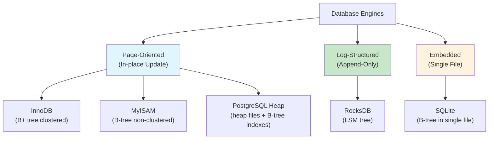

### InnoDB (MySQL Default)

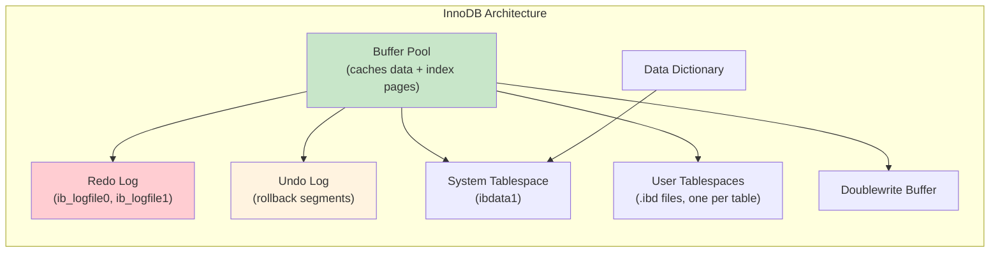

**Key characteristics:**

| Feature | Detail |
|---------|--------|
| **Data structure** | B+ tree (clustered index = table) |
| **Storage format** | 16KB pages in tablespaces (.ibd files) |
| **Concurrency** | MVCC with undo logs, gap locks, next-key locks |
| **Crash recovery** | Redo log + undo log (ARIES-based) |
| **ACID** | Full ACID |
| **Foreign keys** | Supported |
| **Full-text search** | Supported (InnoDB FTS since 5.6) |
| **Compression** | Per-table compression (COMPRESSED row format) |

**Clustered Index:**
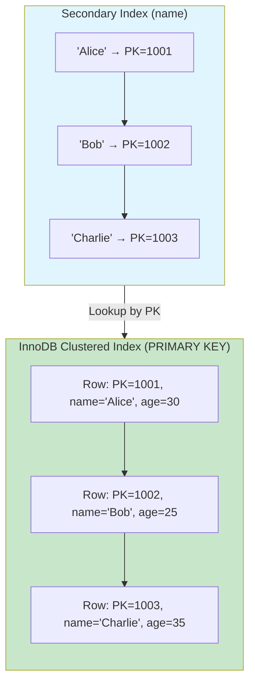

**Doublewrite Buffer:**
InnoDB writes dirty pages to a doublewrite buffer (sequential area) before writing to their actual location. This prevents **torn pages** (partial writes during crash):

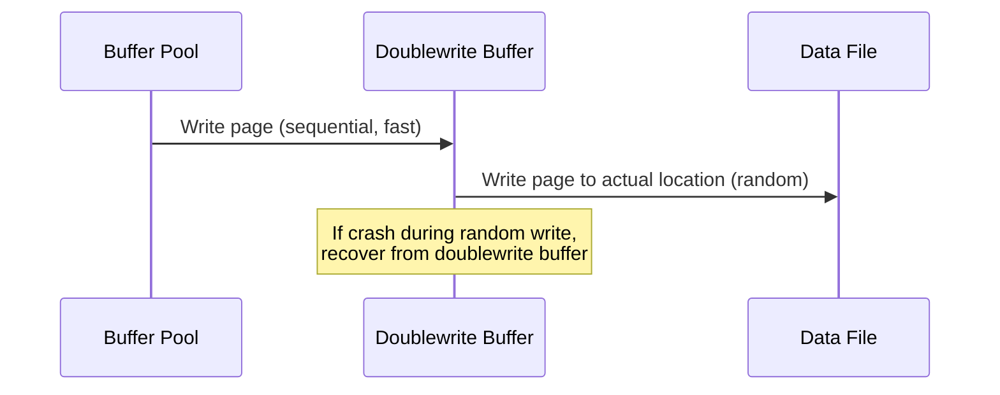

### MyISAM (Legacy MySQL)

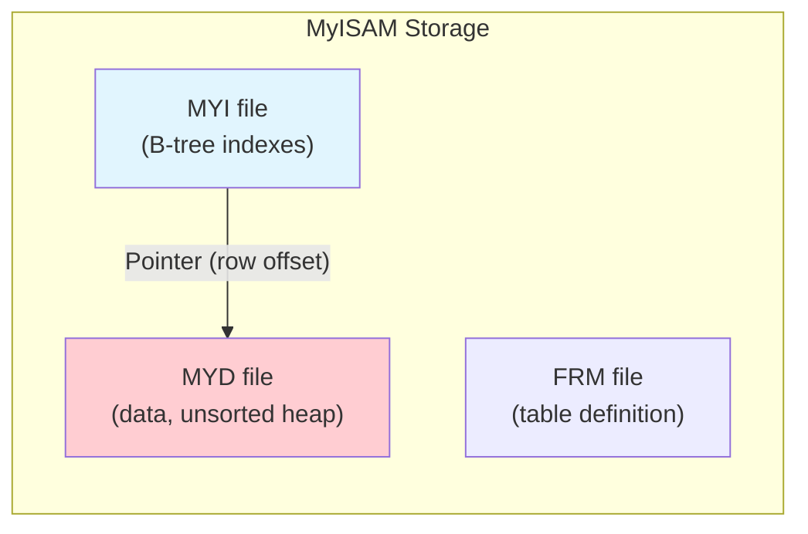

**Key characteristics:**

| Feature | Detail |
|---------|--------|
| **Data structure** | B-tree indexes pointing to heap-ordered data |
| **Concurrency** | Table-level locking (no row-level locks) |
| **Crash recovery** | None (crash-unsafe!) |
| **ACID** | No (no transactions) |
| **Foreign keys** | Not supported |
| **Full-text search** | Supported (earlier than InnoDB) |
| **Compression** | Read-only compressed tables (myisampack) |

**Why MyISAM is obsolete:**
- Table-level locking → poor concurrent write performance
- No crash recovery → data corruption on crash
- No transactions → no rollback, no isolation
- No foreign keys → no referential integrity

**When it was relevant:** Read-heavy workloads with no concurrent writes. The FULLTEXT index support was a differentiator before InnoDB added it.

### PostgreSQL Heap Storage

PostgreSQL uses a fundamentally different architecture from InnoDB:

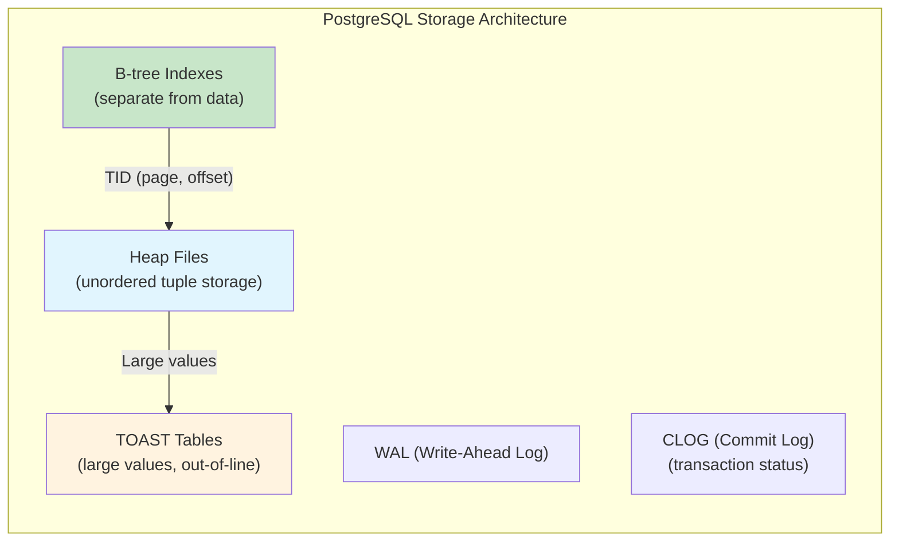

**Key characteristics:**

| Feature | Detail |
|---------|--------|
| **Data structure** | Heap files (unordered) + B-tree indexes (default) |
| **Storage format** | 8KB pages with tuple headers |
| **Concurrency** | MVCC via tuple versioning (no undo logs) |
| **Crash recovery** | WAL with ARIES-like protocol |
| **ACID** | Full ACID |
| **Indexes** | B-tree, Hash, GiST, GIN, BRIN, SP-GiST |
| **Compression** | TOAST for large values; pg_compression extensions |

**MVCC in PostgreSQL (tuple versioning):**
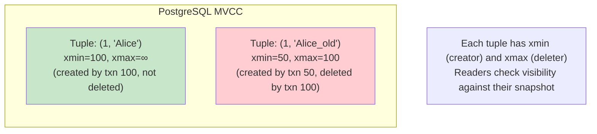

**Heap vs. Clustered Index:**
- PostgreSQL: Data is **heap-ordered** (tuples placed wherever there's space). Indexes point to tuples via TID (page, offset).
- InnoDB: Data is **clustered** (rows stored in PK order). Secondary indexes point to PK.
- Tradeoff: PostgreSQL's heap means updates create new tuple versions in different locations → requires VACUUM. InnoDB's clustered index means PK lookups are one hop.

### RocksDB (Facebook)

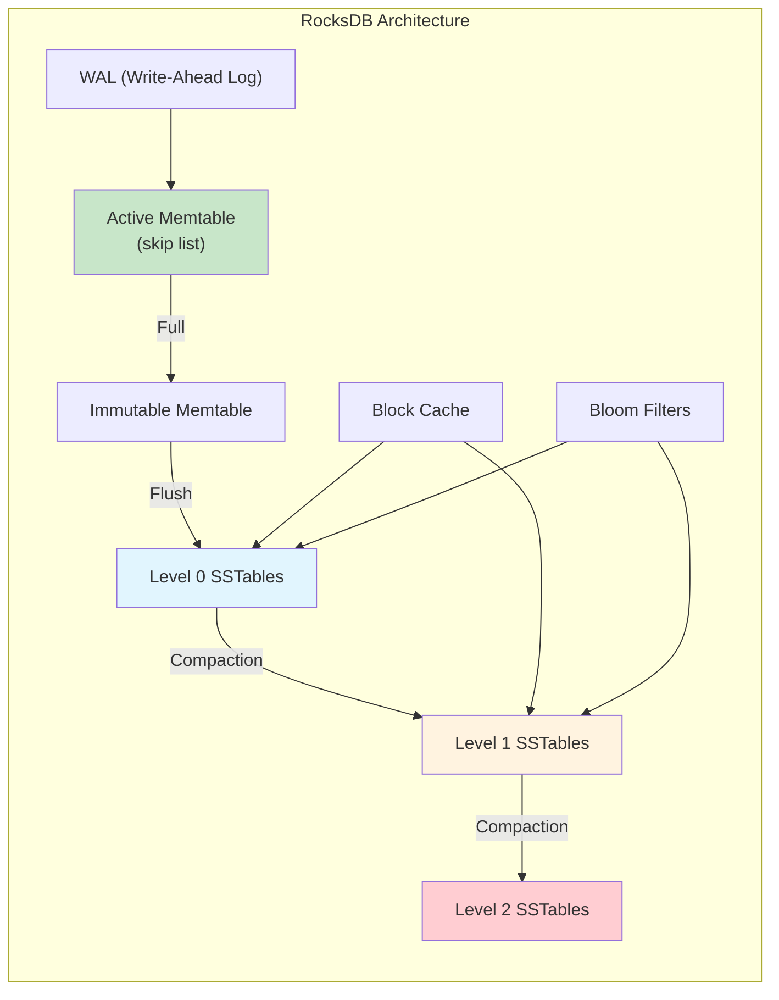

**Key characteristics:**

| Feature | Detail |
|---------|--------|
| **Data structure** | LSM tree (memtable + SSTables) |
| **Concurrency** | MVCC via snapshots, lock-free skip list |
| **Crash recovery** | WAL + memtable replay |
| **Transactions** | Optimistic and pessimistic (since 5.0) |
| **Compaction** | Level-based, Universal, FIFO |
| **Merge operators** | Custom logic for read-modify-write |
| **Column families** | Multiple independent LSM trees |

**RocksDB is used by:**
- CockroachDB (via Pebble, a Go rewrite)
- TiKV (TiDB's storage layer)
- Facebook's MyRocks (MySQL with RocksDB engine)
- Kafka Streams state stores
- YugabyteDB

### SQLite

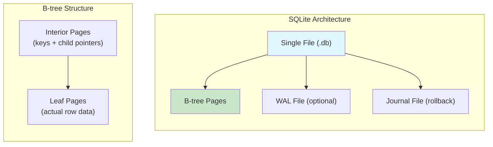

**Key characteristics:**

| Feature | Detail |
|---------|--------|
| **Data structure** | B-tree (clustered, table = B-tree) |
| **Storage format** | Single file, pages (default 4KB) |
| **Concurrency** | Database-level locking (single writer) |
| **Crash recovery** | Journal (rollback) or WAL (write-ahead) |
| **ACID** | Full ACID |
| **Size limit** | 281 TB (theoretical) |
| **Embedded** | No server process, library linked into application |

**SQLite Journal vs. WAL mode:**
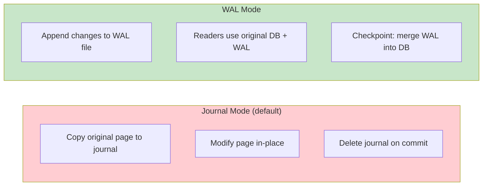

| Mode | Writes | Readers block writers? | Writers block readers? |
|------|--------|----------------------|----------------------|
| **Journal** | Random I/O | Yes | Yes |
| **WAL** | Sequential I/O | No | No |

### Complete Comparison

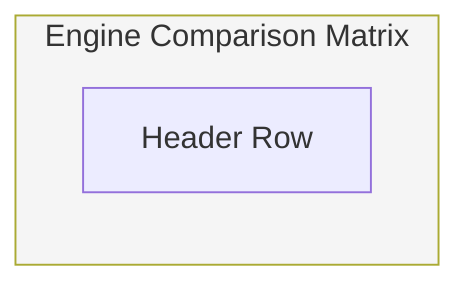

| Feature | InnoDB | MyISAM | PostgreSQL Heap | RocksDB | SQLite |
|---------|--------|--------|----------------|---------|--------|
| **Data Structure** | B+ tree (clustered) | B-tree + heap | Heap + B-tree indexes | LSM tree | B-tree (clustered) |
| **Concurrency** | MVCC + row locks | Table locks | MVCC (tuple versioning) | MVCC snapshots | Database-level locks |
| **Crash Recovery** | Redo + undo log | None | WAL | WAL + memtable replay | Journal or WAL |
| **Transactions** | Full ACID | None | Full ACID | Optimistic txn | Full ACID |
| **Write Performance** | Good (random I/O) | Good (table lock) | Good (heap append) | Excellent (sequential) | Good (single writer) |
| **Read Performance** | Excellent | Excellent (read-heavy) | Excellent | Good (with Bloom filters) | Excellent |
| **Space Efficiency** | Good | Good | Moderate (dead tuples) | Moderate (compaction) | Excellent |
| **Best For** | General OLTP | Read-only (legacy) | Complex queries, analytics | Write-heavy, KV | Embedded, mobile, IoT |
| **Used By** | MySQL, MariaDB | MySQL (legacy) | PostgreSQL | CockroachDB, TiKV, MyRocks | Android, iOS, browsers |

### When to Choose Which Engine

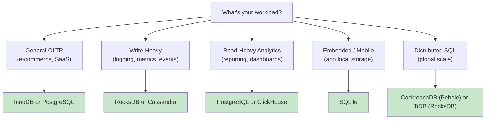

## Cross-References

- [Database Internals Overview](./README.md) — High-level architecture
- [LSM Trees](./lsm-trees.md) — The data structure behind RocksDB
- [Compaction](./compaction.md) — How LSM engines reclaim space
- [WAL](./wal.md) — The durability mechanism shared by all engines
- [B-Tree](../indexing/b-tree.md) — The data structure behind InnoDB and PostgreSQL indexes
- [Buffer Pool](../caching/buffer-pool.md) — In-memory page caching
- [MVCC](../transactions/mvcc.md) — Concurrency control used by InnoDB and PostgreSQL

## Interview Questions

### Beginner

**Q: What is the difference between InnoDB and MyISAM?**
A: InnoDB supports transactions, row-level locking, crash recovery (redo/undo logs), and foreign keys. MyISAM has none of these — it uses table-level locking and is crash-unsafe. InnoDB is the default since MySQL 5.5 and MyISAM is essentially deprecated.

**Q: Why does PostgreSQL need VACUUM but InnoDB doesn't?**
A: PostgreSQL uses MVCC via tuple versioning — old tuple versions remain on disk until VACUUM reclaims them. InnoDB uses undo logs for MVCC — old versions are in undo log segments, not in the data pages. PostgreSQL's approach is simpler but requires periodic VACUUM to reclaim space.

**Q: What is a clustered index?**
A: A clustered index stores the actual row data in the index's leaf pages. In InnoDB, the primary key is the clustered index — the table *is* the B+ tree. Lookups by primary key are direct (one B-tree traversal). Secondary indexes store the primary key value and require a second lookup.

### Intermediate

**Q: How does PostgreSQL's MVCC differ from InnoDB's?**
A: **PostgreSQL**: Each tuple has `xmin` and `xmax` fields. Readers check these against their snapshot to determine visibility. Old versions remain in the same heap page until VACUUM removes them. **InnoDB**: Uses undo logs to reconstruct old versions. The data page always has the latest version; older versions are reconstructed from undo log segments on demand. PostgreSQL's approach is simpler but causes table bloat; InnoDB's is more complex but avoids bloat.

**Q: When would you use RocksDB instead of InnoDB?**
A: RocksDB excels at write-heavy workloads (millions of writes/sec) because LSM trees convert random I/O to sequential I/O. Use cases: time-series data, event logging, caching layers, distributed databases (CockroachDB, TiKV). InnoDB is better for mixed OLTP workloads with complex queries, foreign keys, and ad-hoc reads.

**Q: Explain SQLite's WAL mode and why it's better than journal mode.**
A: In journal mode, writers copy the original page to a journal file, modify the page in-place, and delete the journal on commit. This blocks concurrent readers. In WAL mode, writers append changes to a separate WAL file. Readers can read the original database while writers append to WAL. Checkpointing periodically merges WAL into the database. WAL mode allows concurrent readers and one writer.

### Advanced (FAANG-Level)

**Q: You're designing a new database engine for a global-scale OLTP workload. Would you choose B-tree or LSM, and why?**
A: For global-scale OLTP, I'd choose **LSM with optimizations**:
- **Writes**: LSM's sequential I/O handles high write throughput across distributed shards
- **Reads**: Mitigate with Bloom filters, block cache, and bounded compaction
- **Compaction**: Use leveled compaction for predictable read latency
- **Concurrency**: MVCC via snapshots (like RocksDB)
- **Crash recovery**: WAL + memtable replay (proven in production)

CockroachDB and TiDB both use LSM (Pebble/RocksDB) for this reason. The write amplification is acceptable because:
1. SSDs are getting cheaper and faster
2. Replication already provides durability
3. Write-heavy workloads dominate in global-scale OLTP

**Q: Compare InnoDB's doublewrite buffer with PostgreSQL's full-page writes. How do they solve the same problem differently?**
A: Both solve the **torn page** problem: if a crash occurs while writing a page, the page may be partially written (torn), and the WAL alone can't recover it because WAL records are physiological (they describe changes, not full pages).

- **InnoDB doublewrite buffer**: Writes dirty pages to a sequential buffer first, then to their actual location. If a torn page is detected during recovery, restore from the doublewrite buffer.
- **PostgreSQL full-page writes**: The first WAL record after a page is dirtied includes a full copy of the page. During recovery, if a torn page is detected, restore it from the WAL.

Tradeoff: Doublewrite buffer adds one extra sequential write per page. Full-page writes increase WAL size but avoid the extra I/O path.

**Q: A startup asks you to choose between PostgreSQL and MySQL (InnoDB) for a new SaaS product. What factors would you consider?**
A:
| Factor | PostgreSQL | MySQL/InnoDB |
|--------|-----------|-------------|
| **Query complexity** | Better (CTEs, window functions, JSON, arrays) | Good but fewer advanced features |
| **Extensions** | Rich ecosystem (PostGIS, pg_trgm, TimescaleDB) | Fewer extensions |
| **MVCC** | Tuple versioning (simpler, but VACUUM needed) | Undo logs (more complex, no bloat) |
| **Replication** | Streaming replication, logical replication | Group replication, InnoDB Cluster |
| **Ecosystem** | ORMs, cloud (RDS, Aurora, Supabase) | ORMs, cloud (RDS, Aurora, PlanetScale) |
| **JSON support** | Excellent (jsonb with indexing) | Good (JSON type since 5.7) |
| **Concurrent writes** | Good (row-level locks via MVCC) | Good (row-level locks) |

Recommendation: PostgreSQL for complex queries, analytics, and extensibility. MySQL for simpler OLTP with proven high-availability tooling (Vitess, ProxySQL).

## Common Mistakes

1. **Using MyISAM in production**: MyISAM is crash-unsafe and lacks transactions. Always use InnoDB.

2. **Assuming PostgreSQL doesn't need tuning**: `shared_buffers`, `work_mem`, `maintenance_work_mem`, `autovacuum` settings all need tuning for production workloads.

3. **Ignoring VACUUM in PostgreSQL**: Dead tuples accumulate until VACUUM runs. Without regular VACUUM, tables bloat and performance degrades.

4. **Using SQLite for concurrent write workloads**: SQLite has database-level locking for writers. Use a client-server database for concurrent writes.

5. **Choosing RocksDB for read-heavy workloads without tuning**: LSM reads can be slow without Bloom filters, block cache, and proper compaction. Always enable Bloom filters and size the block cache appropriately.

## Summary and Revision Notes

- **InnoDB**: B+ tree clustered index, MVCC via undo logs, full ACID, MySQL default
- **MyISAM**: B-tree + heap, table locks, crash-unsafe, deprecated
- **PostgreSQL Heap**: Unordered heap files + B-tree indexes, MVCC via tuple versioning, needs VACUUM
- **RocksDB**: LSM tree, write-optimized, used by CockroachDB/TiKV/MyRocks
- **SQLite**: B-tree in single file, embedded, WAL mode for concurrent reads
- **Clustered index**: Row data stored in index order (InnoDB, SQLite)
- **Heap storage**: Row data stored wherever there's space (PostgreSQL)
- **Doublewrite buffer**: InnoDB's torn page protection
- **VACUUM**: PostgreSQL's dead tuple reclamation (not needed in InnoDB)
- **WAL mode**: SQLite's improved concurrency over journal mode

## Cross References

- [LSM Trees](../dbms/internals/lsm-trees.md)
- [B-Tree](../dbms/indexing/b-tree.md)
- [Buffer Pool](../dbms/caching/buffer-pool.md)
- [File Organization](../dbms/storage/file-organization.md)
