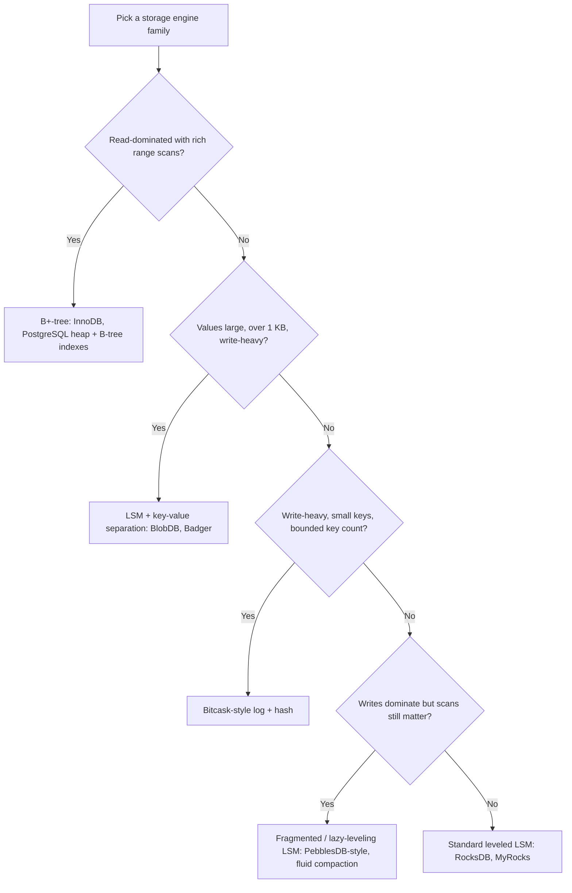

# Hybrid Storage Engines: Between B-Trees and LSM-Trees

## Overview

Production storage engines are not cleanly "B-tree" or "LSM" — they are hybrids that graft log-structured buffering onto page stores, or page-store structure onto logs, to escape the write amplification / read amplification / space amplification (the three amplifications, quantified in [LSM Trees](./lsm-trees.md) and [Compaction](./compaction.md)). This page walks the hybrid lineage a systems interviewer expects: the LSM toolkit recap (bloom filters, fence pointers), RocksDB as the leveled-LSM baseline (covered in detail in [Database Engines](./engines.md)), PebblesDB's guard tables, the Dostoevsky compaction taxonomy, Bitcask as the degenerate log+hash hybrid, WiscKey-style key-value separation (deep-dived in [BlobDB](../../storage/blobdb.md) — here we take the engine-comparison angle), and TokuDB's fractal-tree buffered B-tree. It closes with the B-tree vs LSM vs hybrid decision table.

## Recap: The LSM Toolkit the Hybrids Inherit

Every engine on this page is a variation on the same budget problem. An LSM accepts writes into a memtable, flushes it to an immutable run, and compacts runs together; the costs are **write amplification** (bytes written to disk per byte of application write, typically 10-30× for leveled compaction), **read amplification** (components checked per lookup), and **space amplification** (dead versions retained between compactions). Two per-SSTable structures gate the read path and show up in every hybrid: **bloom filters** give a probabilistic "key absent from this run" answer for ~10 bits/key at a ~1% false-positive rate (allocated optimally per level — see [Membership Filters](../advanced/membership-filters.md)), and **fence pointers** — the per-block first-key index in the SSTable footer — binary-search the run's block boundaries so a positive lookup touches exactly one disk block instead of scanning the run. Deletions are tombstones that only compaction retires; nothing on this page changes that contract, they only change *when and how often* data gets rewritten.

| Primitive | Cost it removes | Typical sizing | Used by |
|---|---|---|---|
| Memtable (skiplist) | Random write I/O | 64-256 MB flush | All LSM + PebblesDB + WiscKey |
| Bloom filters | Wasted run reads on absent keys | ~10 bits/key, FP ~1% | RocksDB, PebblesDB, Cassandra |
| Fence pointers | Multi-block reads on present keys | One entry per 4-64 KB block | All SSTable engines |
| Tombstones | In-place delete I/O | Retired at compaction | All log-structured engines |

### The Read Path at Block Granularity

The reason both structures exist is that an LSM read touches every run, so each run's per-lookup cost must be minimized. A leveled LSM with T=10, six levels of data plus L0 has up to ~7 candidate runs per point lookup; a ~1% per-run bloom false-positive rate makes a wasted run read rare (~7% of absent-key lookups touch one extra run), and fence pointers make each *real* run read exactly one block. The same accounting explains the hybrid designs below: PebblesDB pays extra bloom checks (one per un-merged fragment), WiscKey pays one extra value-log read, and TokuDB pays buffer checks at each tree level — all of them are buying sequential writes with bounded, *countable* extra reads.

```text
Point lookup, leveled LSM (key absent from L4..L6, present in L2):
  1. memtable probe (skiplist)            -> miss
  2. L0: newest to oldest, bloom each SST -> bloom says absent, no I/O
  3. L1..L5: bloom each level's run       -> L2 bloom says maybe-present
  4. L2: binary-search fence pointers     -> block 37 contains the key range
  5. read 4 KB block 37                   -> key found (or tombstone)
Total disk reads: 1 block.  Total bloom probes: ~7.  Total fence searches: 1.
```

## RocksDB: The Leveled Baseline

RocksDB (Facebook's fork of LevelDB) is the reference point every hybrid is measured against, and its internals are already covered in [Database Engines](./engines.md) with compaction strategy detail in [Compaction](./compaction.md); this page only fixes the numbers needed for comparison. Leveled compaction bounds read amplification at ~T+1 SSTables per lookup (T = size ratio, typically 10) but pays worst-case write amplification of roughly \\( O(T \\cdot \\log_T N) \\) — measured 10-30× on write-heavy workloads. Universal (size-tiered) compaction cuts write amplification but multiplies the number of overlapping runs a read must consult. RocksDB also ships the knobs hybrids exist to avoid touching: `write_buffer_size`, `level0_file_num_compaction_trigger`, and rate limiting to keep compaction from stealing the disk. When someone says "LSM" in an interview, they usually mean this configuration; the rest of this page is "what if we could keep the sequential-write property without paying the rewrite tax."

## PebblesDB: Guard Tables and the Fragmented LSM

PebblesDB (SOSP 2017) observes that leveled compaction's write amplification comes from *rewriting whole key ranges*: merging L1 into L2 rewrites every overlapping L2 SSTable even if only a few keys moved. Its fix is the **guard table**: sample keys from the data to define guard keys that partition the keyspace into shards, and treat the keyspace as a skip-list-like hierarchy of guards. Within a shard, writes simply **append a new fragment** — an SSTable-shaped file holding that batch of keys — without consulting other shards. Because a fragment's key range never crosses a guard boundary, inserting data into shard S never forces a rewrite of shards S' ≠ S: there is no global-level merge, just local appends and occasional intra-shard merges. This is the "fragmented LSM": LSM-style sequential appends, but compaction is per-shard and lazy.

```text
Guards:        | g1 |     g2     |   g3   |   g4    |
Shard g2:      [frag 1: k=g2a..g2c] [frag 2: ...] [frag 3: newest]
Point lookup:  binary-search guard index -> shard g2 -> bloom-check each
               fragment newest-first -> read 1 block via fence pointers
Compaction:    merge fragments *within* one shard only; never rewrites
               other shards, so no cascade of rewrites across levels
```

The trade is explicit: read amplification within a shard grows with the number of un-merged fragments (each fragment costs one bloom check), so PebblesDB shifts cost from write path to read path. The paper reports up to **6.7× lower write amplification** than RocksDB on write-heavy workloads with comparable read throughput on read-heavy ones — and the same authors' follow-up analysis of compaction designs (below) generalizes exactly this move. Guards themselves are chosen from sampled data distribution, so hot key ranges can be split into more shards to parallelize compaction.

## Dostoevsky: A Taxonomy of Compaction Designs

Dostoevsky (SIGMOD 2018, Sarkar, Athanassoulis et al.) formalizes the design space PebblesDB and leveled/tiered compaction occupy, treating the LSM as a **continuum of per-level choices** rather than two fixed designs. The paper's accounting, with T the size ratio and N the data size:

- **Leveled compaction** (RocksDB default): one run per level; worst-case write amplification \\( O(T \\cdot \\log_T N) \\), lookup cost \\( O(\\log_T N) \\) components (one per level, bloom-filtered).
- **Tiered compaction** (size-tiered): T runs per level; worst-case write amplification \\( O(\\log_T N) \\) — a factor T less — but \\( O(T \\cdot \\log_T N) \\) components per lookup, so reads and range scans pay T× more.
- **Lazy leveling**: tiering at the *largest* level only (where components are largest and rewrites dominate), leveling everywhere else. Worst-case write amplification drops from \\( O(T \\cdot \\log_T N) \\) to \\( O(\\log_T N) \\) while lookup cost stays within a constant of leveling — the "lazily-constant" read cost that makes it the standout design for lookup-heavy skewed workloads.
- **Fluid LSM-LSM**: tiering applied to a *configurable interval* of levels between the smallest and largest, interpolating between the two extremes; the interval is tuned to the workload's mix of point lookups, short scans, and long range scans.
- **Class-level synthesis**: combine styles per level class — tiering where components are few and cheap to read, leveling where scan-order matters — plus **optimal bloom-filter memory allocation** (from the same group's Monkey work, ICDE 2017) that gives each level bloom bits proportional to expected lookup frequency under a skew distribution.

The operational lesson is that "tune your compaction" is really "pick a point on the write/read/space continuum": Dostoevsky reports designs that beat RocksDB's leveled configuration on multiple workload mixes simultaneously, purely by re-choosing per-level styles and bloom memory. RocksDB's `level_compaction_dynamic_level_bytes`, Cassandra's strategy menu, and PebblesDB are all points this continuum predicts.

### The Taxonomy as a Table

| Design | Style per level | Worst-case write amp | Lookup components | Best fit |
|---|---|---|---|---|
| Leveled (RocksDB default) | Leveling everywhere | \\( O(T \\cdot \\log_T N) \\) | \\( O(\\log_T N) \\) | Mixed read/write |
| Tiered (size-tiered) | Tiering everywhere | \\( O(\\log_T N) \\) | \\( O(T \\cdot \\log_T N) \\) | Bulk ingest, write-mostly |
| Lazy leveling | Tiering at the largest level only | \\( O(\\log_T N) \\) | \\( O(\\log_T N) \\) + one tiered run | Lookup-heavy, skewed keys |
| Fluid LSM-LSM | Tiering across a configurable level interval | Between the extremes | Tunable via the interval | Mixed workloads with scan SLAs |
| Class-level synthesis | Per-level-class choice + Monkey bloom allocation | Workload-dependent | Optimized per level | Known query distribution |

Two secondary results round out the picture: bloom-filter bits should be allocated *non-uniformly* across levels in proportion to each level's expected lookup share under the observed key skew (the Monkey contribution), and the optimal size ratio itself depends on the read/write mix, so a single global T is always a compromise. Both are actionable in real engines via per-level bloom tuning and dynamic level sizing.

## Bitcask: The Degenerate Hybrid

Bitcask (Riak's default engine, Sheehy & Smith 2010) is what happens when you push the log-structured idea to its endpoint: an **append-only log of full key-value records** plus a purely in-memory hash table (`keydir`) mapping every key to (file id, offset, size) of its newest record. There are no SSTables, no levels, no bloom filters — a point lookup is one hash probe plus one disk read (often one block thanks to OS readahead), and a write is one fsync-batched append. The costs move to two places: **RAM scales with the key count** (~36 bytes/entry in the keydir), and **deletions/updates leak space** that only a background **merge** (rewrite of live records, compacted into hint files for fast warm-restart) reclaims. The full byte-level walkthrough lives in [Bitcask](../../storage/bitcask.md); the engine-comparison point is that Bitcask writes at amplification ~1 and reads at amplification ~1, and pays instead in a hard memory cap and zero range-scan support. It is the right answer only for write-heavy, point-lookup, bounded-key-count workloads — the extreme end of the same trade PebblesDB makes.

## WiscKey and Key-Value Separation

WiscKey (FAST 2016, Lu et al.) attacks the dominant term in LSM write amplification for large values: compaction rewrites values that never changed. The separation design stores **keys in the LSM** and **values in an append-only value log (vLog)**, with the LSM holding only ~20-byte pointers into vLog; garbage collection then rewrites only surviving values, tail-to-head. RocksDB's integrated BlobDB implements this design (options `enable_blob_files`, `min_blob_size`, GC age cutoff) and its measured wins — 75-78% lower write amplification on overwrite workloads, 2.3-4.7× faster bulk load — are tabulated in [BlobDB](../../storage/blobdb.md), along with the GC mechanics. Badger and Pebble's blob work are the same idea in other codebases.

The engine-comparison angle: KV separation is not free — it converts write amplification into **read amplification** (an extra I/O: LSM pointer lookup, then value-log read, plus worse locality) and into **space-amp variance during GC**. It wins only when values are large relative to keys (the paper's crossover is roughly ≥1 KB values) and point-lookup-heavy; range scans over large values degrade because value-log order is insertion order, not key order. Placement in the taxonomy: WiscKey keeps the LSM structure of keys but makes the *value path* a Bitcask-style log — a hybrid of the hybrid. Interviewers like the boundary condition: state the value-size crossover and the range-scan penalty before recommending it.

```text
Leveled LSM, 1 KB values, overwrite-heavy:        WiscKey/BlobDB:
  flush:    write K+V to L0 SST      (1x bytes)     flush:   V -> vLog append, SST holds K+ptr (~30 B)
  compact:  rewrite K+V across levels (~10-30x)     compact: rewrite K+ptr only   (~1-2x)
  value written ~15x per overwrite          ->      value written exactly once; GC relocates
                                                    only survivors, lazily
Read: SST block read (value inline)                 Read: SST block (K+ptr) + vLog read  (+1 I/O)
Scan: sequential in SST                             Scan: keys sequential, values random (degrades)
```

## Fractal Trees: TokuDB's Buffered B-Tree

The fractal tree (TokuDB, Percona MySQL engine; Tokutek) attacks the same rewrite problem from the **B-tree side**. A plain B+-tree update to a random leaf costs a root-to-leaf traversal with dirty-page write-back — random I/O per update. A fractal tree (a Bϵ-tree) attaches a **message buffer** to every internal node: inserts, deletes, and updates are appended as *messages* to the root buffer (sequential I/O), and background flushing pushes buffered messages down one level at a time, batching them into children's buffers, until they land at leaves. Each message is written once per level, so write amplification is \\( O(\\log_B N / B^{1-\\epsilon}) \\)-ish — a small constant in practice — while reads still traverse root-to-leaf, checking each level's buffer along the way (a small read amplification premium over B-trees). This is precisely "LSM-style buffering at every internal node of a B-tree": it keeps B-tree range-scan and in-place-leaf properties while absorbing random writes at LSM-like throughput.

| Property | B+-tree (InnoDB) | Fractal tree (TokuDB) | Leveled LSM (RocksDB) |
|---|---|---|---|
| Random point write | High (dirty page per update) | Low (buffered message) | Lowest (append + amortized compaction) |
| Point read | ~B-tree height | Height + buffer checks | ~levels × bloom (often cheapest absent-key read) |
| Range scan | Excellent | Excellent (leaf-contiguous) | Poor-to-fair (merge across runs) |
| Update-in-place semantics | Yes (undo/redo logged) | Deferred to leaves (message) | No (new version per update) |
| Compression story | Page-level (row formats) | Strong (aggressive per-node compression was TokuDB's selling point) | Block-level (per-SSTable) |

TokuDB shipped fractal-tree indexing with built-in compression and strong insert-benchmark numbers into MySQL, but it was deprecated by Percona (EOL announced for Percona Server 5.7; not carried into 8.0) in favor of MyRocks — an LSM engine — which is itself a data point: the market converged on LSM-with-separation rather than buffered B-trees. The idea survives in academic Bϵ-tree literature and in engines that buffer at fewer nodes (e.g., write-optimized indexes inside HTAP systems).

## Choosing: B-Tree vs LSM vs Hybrid



| Workload signal | Best fit | Why |
|---|---|---|
| Read-heavy, range scans, in-place updates | B+-tree | Lowest read amplification; scans are leaf-contiguous |
| Write-heavy, mixed point/range reads | Leveled LSM + tuned blooms | Sequential writes; bounded read amp via bloom+fence pointers |
| Write-heavy, large blobs, point reads | LSM + KV separation | Removes value rewriting; watch GC space-amp and scan locality |
| Write-heavy, bounded keys, point-only | Bitcask | Write amp ~1, read amp ~1; RAM bounds key count |
| Write-heavy with scan-sensitive SLA | Fragmented/lazy-leveling LSM | Cuts rewrite cascades without tiered-style read blowup |
| Random updates on relational rows, strong compression | Fractal tree (historical) | B-tree reads with LSM-like buffered writes |

## Common Pitfalls

1. **Judging engines by write amplification alone.** A design that halves write amp often doubles fragment counts or adds a value-log read; state all three amplifications before declaring a winner. The Dostoevsky table is the correct mental format: every design is a triple, not a scalar.

2. **Enabling KV separation with small values.** With `min_blob_size` set too low, every point read pays an extra vLog I/O and GC rewrites pointers for values that never needed separation — the feature that saves SSD endurance at 100 KB values *costs* IOPS at 100-byte values. Audit the value-size distribution first.

3. **Letting guard/shard counts drift from the data distribution.** PebblesDB-style designs inherit their read amplification from the number of fragments per shard; on skewed or shifting key distributions, guards chosen from last year's data leave some shards with hundreds of fragments. Re-sample guards as part of maintenance.

4. **Assuming tiered compaction is "free write amp savings."** Tiering multiplies the runs a read must consult by T; on lookup-heavy workloads that is a p99 disaster even with blooms at 1% FP. Tiering belongs on ingest-heavy, read-light partitions (TTL'd time-series shards), not on hot lookup tables.

5. **Forgetting that fractal-tree-style buffering changes crash recovery.** Buffered messages are unapplied state in internal nodes, so engines must persist and replay buffer contents like a WAL — a correctness cost that pure B-trees and pure LSMs do not both pay. Interviewers probe this to separate people who have read engine code from people who have read slides.

6. **Benchmarking hybrid engines with load generators that hide the read path.** Write-only benchmarks flatter PebblesDB and BlobDB; the decision needs the actual query mix, including absent-key lookups (bloom-dominated) and range scans (vLog-dominated). Measure the workload you have, not the one the vendor benchmarked.

## Interview Questions

1. **What do bloom filters and fence pointers each buy in an LSM, and what happens without them?** Blooms answer "this key is not in this run" for ~10 bits/key at ~1% false-positive rate, eliminating the dominant cost of absent-key lookups across many runs; fence pointers are the per-block first-key index that reduces a positive lookup to exactly one block read. Without blooms, every point lookup probes every run; without fence pointers, each probe scans or binary-searches inside runs at block granularity. Together they are why leveled LSMs can serve point reads despite 10+ overlapping components.

2. **How does PebblesDB reduce write amplification, and what does it give up?** Guard tables partition the keyspace with sampled guard keys; within a shard, writes append new fragments and compaction merges only inside one shard, so inserting keys never rewrites other key ranges — leveled compaction's cascade of overlapping-range rewrites disappears. The paper reports up to 6.7× lower write amplification than RocksDB on write-heavy workloads. The cost is read amplification proportional to un-merged fragments per shard, plus the need to sample guards well on skewed distributions.

3. **State the leveled vs tiered compaction trade-off with formulas.** With size ratio T and data N, leveling writes ~\\( O(T \\cdot \\log_T N) \\) per update worst-case but reads touch ~\\( \\log_T N \\) components; tiering writes ~\\( O(\\log_T N) \\) — a factor T less — but reads face ~\\( T \\cdot \\log_T N \\) components. Lazy leveling takes tiering only at the largest level, where rewrites are most expensive, and keeps read cost within a constant of leveling; Dostoevsky generalizes this into a per-level continuum with optimal per-level bloom allocation.

4. **When does key-value separation (WiscKey/BlobDB) hurt?** When values are small — below roughly 1 KB the pointer indirection and extra vLog I/O cost more than the avoided rewriting — and on range scans over large values, because vLog order is insertion order, not key order, so scans degenerate into random reads. GC also introduces space-amplification spikes as valid blobs are relocated. It wins for write-heavy point-lookup workloads with large values, cutting write amp from 10-30× toward 1-2×.

5. **Why did the ecosystem abandon TokuDB's fractal trees for MyRocks?** Fractal trees match LSM write throughput while keeping B-tree scans, but each message is written once per tree level, buffers must be checkpointed and recovered, and the per-node buffer bookkeeping complicated replication and tooling around MySQL. MyRocks rode the mature, well-instrumented RocksDB codebase with KV separation and leveled compaction, and Percona deprecated TokuDB with Percona Server 5.7's end of life. The technical lesson: write-optimized designs compete on ecosystem and operability as much as on amplification math.

6. **Where does Bitcask sit relative to an LSM, and what is its hard failure mode?** Bitcask is a pure append-only log plus in-memory keydir: write amplification ~1, point reads = one hash probe + one disk read, no compaction levels at all — but no range scans, and RAM grows with key count (~36 bytes/key), so the key count is the hard capacity ceiling. Merge reclaims space from updates and deletes but rewrites live data. It fits bounded-key-count, write-heavy, point-lookup stores (session stores, object metadata), and it is the limiting case that shows LSM compaction exists to support range scans and unbounded key spaces.

## Key Takeaways

- All hybrid engines attack the same three-amplification budget; name write/read/space amplification explicitly before comparing any two engines.
- Bloom filters (~10 bits/key) + fence pointers (one-block positive lookups) are the LSM read path's load-bearing structures — every hybrid keeps them.
- PebblesDB's guard tables make compaction per-shard and append-only within shards: up to 6.7× lower write amplification, paid in per-fragment read checks.
- Dostoevsky's continuum: leveling \\( O(T\\log_T N) \\) write amp / low read amp; tiering the reverse; lazy leveling (tier the biggest level only) and fluid per-level intervals interpolate; bloom memory should be allocated per-level by lookup skew (Monkey).
- KV separation (WiscKey → RocksDB BlobDB, Badger) cuts write amp for ≥1 KB values to ~1-2× but adds read-amp and GC space-amp; it is the dominant production hybrid.
- Bitcask = log + in-RAM hash: amp ~1 on both paths, no range scans, RAM-bounded key count — the degenerate endpoint of the design space.
- Fractal trees buffer messages at B-tree internal nodes (TokuDB): B-tree reads with LSM-like writes; deprecated in favor of MyRocks — operability beat elegance.

## References

- Sarkar, S., Athanassoulis, M. et al., "Dostoevsky: Better Balance Speed, Storage, Write and Read Amplification in LSM-trees," SIGMOD 2018. (design-continuum analysis; no URL cited — ACM DL blocks automated clients)
- Dayan, N., Athanassoulis, M. & Idreos, S., "Monkey: Optimal Navigable Key-Value Store," SIGMOD 2017. (optimal bloom-filter memory allocation)
- Raju, P., Kadekodi, R., Chidambaram, V. & Abraham, I., "PebblesDB: Building Write-Optimized Key-Value Stores," SOSP 2017. (guard tables, fragmented LSM)
- Lu, L., Pillai, T. S., Arpaci-Dusseau, A. C. & Arpaci-Dusseau, R. H., "WiscKey: Separating Keys from Values in SSD-Conscious Storage," FAST 2016. <https://www.usenix.org/system/files/conference/fast16/fast16-papers-lu.pdf>
- Sheehy, J. & Smith, D., "Bitcask: A Log-Structured Hash Table for Fast Key/Value Storage," Riak/Basho white paper, 2010; implementation: <https://github.com/basho/bitcask>
- RocksDB wiki — compaction options and BlobDB (key-value separation): <https://github.com/facebook/rocksdb/wiki>
- Percona TokuDB engine (fractal tree indexing, deprecated): <https://github.com/percona/tokudb-engine>

## Cross-References

- [LSM Trees](./lsm-trees.md) — the baseline architecture, amplification formulas, and per-database LSM variants.
- [Compaction](./compaction.md) — leveled, tiered, universal, and FIFO strategies that the continuum formalizes.
- [Database Engines](./engines.md) — RocksDB, InnoDB, PostgreSQL, and SQLite engine internals; the RocksDB deep coverage this page cross-links.
- [BlobDB — Key-Value Separation](../../storage/blobdb.md) — WiscKey mechanics, GC, and RocksDB options in full.
- [Bitcask](../../storage/bitcask.md) — byte-level keydir walkthrough, merge and hint files.
- [Membership Filters](../advanced/membership-filters.md) — bloom filter and filter-family internals behind the read path.
