# Log-Structured Merge Trees (LSM Trees)

## Overview

A Log-Structured Merge Tree (LSM tree) is a data structure optimized for **write-heavy workloads**. Instead of updating data in-place (like B-trees), LSM trees buffer writes in memory and periodically flush them to disk as sorted, immutable files. This converts random I/O into sequential I/O, making writes extremely fast at the cost of potentially slower reads.

LSM trees power many modern databases: **RocksDB** (Facebook), **LevelDB** (Google), **Cassandra**, **HBase**, **ScyllaDB**, **CockroachDB** (via RocksDB/Pebble), and **TiKV** (via RocksDB).

## Detailed Explanation

### Why LSM Trees?

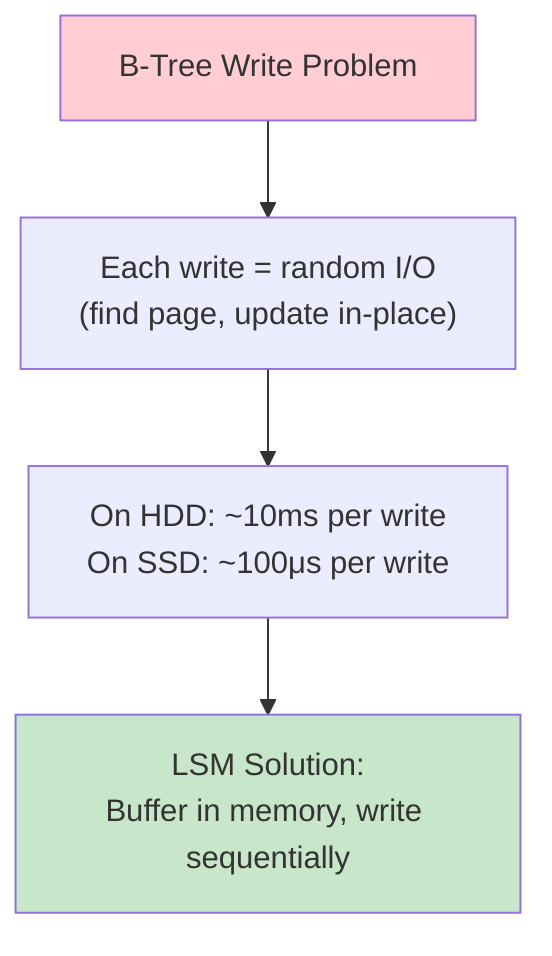

| Workload | B-Tree | LSM Tree |
|----------|--------|----------|
| **Write-heavy** | Slow (random I/O) | Fast (sequential I/O) |
| **Read-heavy** | Fast (O(log N) tree) | Slower (check multiple levels) |
| **Mixed** | Good | Good with tuning |
| **Space** | Some fragmentation | Higher amplification during compaction |

### LSM Tree Architecture

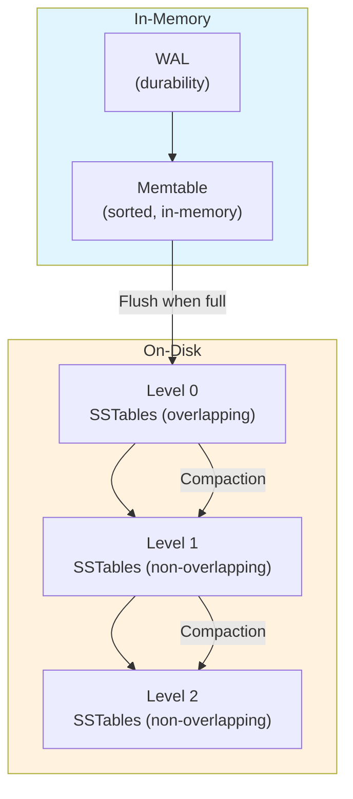

### Components in Detail

#### 1. Memtable

The memtable is an in-memory sorted data structure that absorbs all incoming writes.

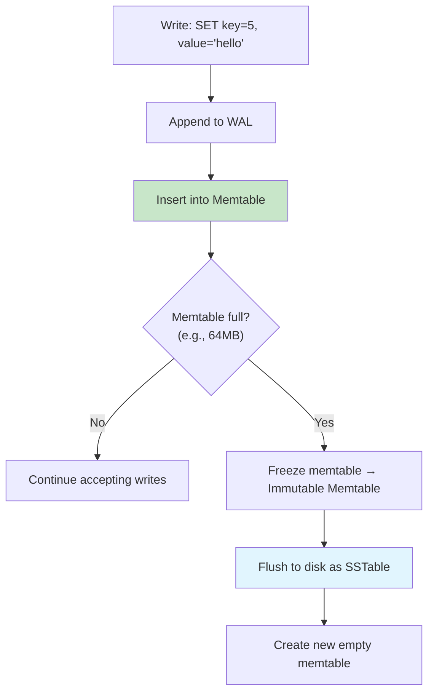

**Common memtable implementations:**

| Data Structure | Pros | Cons | Used By |
|---------------|------|------|---------|
| **Skip List** | O(log N) insert/lookup, lock-free variants | Higher memory overhead | RocksDB, LevelDB |
| **Red-Black Tree** | O(log N), cache-friendly | Harder to make concurrent | Some custom engines |
| **Sorted Array** | Cache-friendly, compact | O(N) insert | Rarely used |
| **Hash Table** | O(1) lookup | Not sorted → bad for range scans | Redis (for dict) |

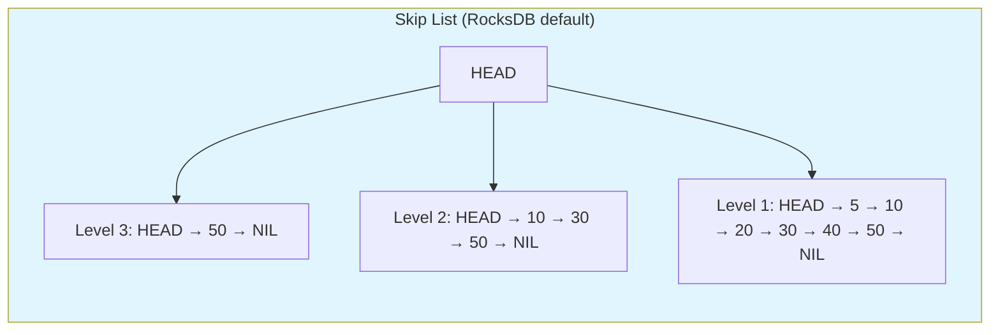

#### 2. SSTable (Sorted String Table)

An SSTable is an immutable, sorted file on disk containing key-value pairs.

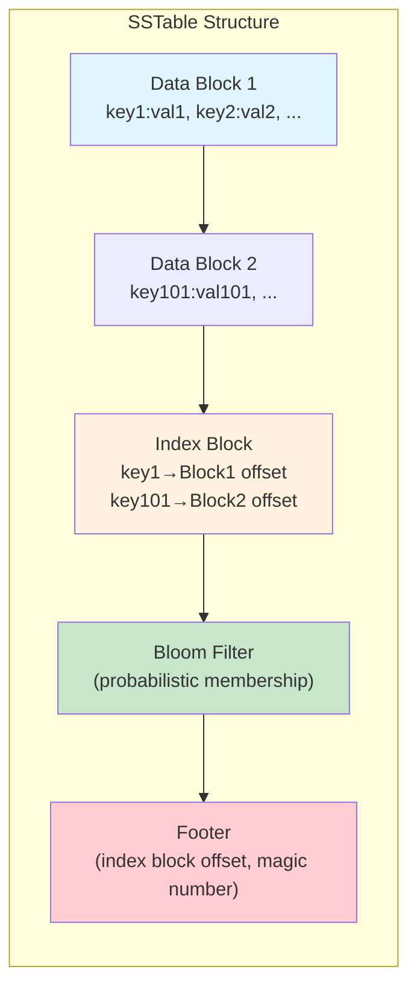

**SSTable on-disk format (simplified, RocksDB):**

```
┌─────────────────────────────────┐
│ Data Block 0                    │  ← Sorted key-value pairs
│  [key_len][key][val_len][val]   │     with prefix compression
│  ...                            │
├─────────────────────────────────┤
│ Data Block 1                    │
│  ...                            │
├─────────────────────────────────┤
│ Meta Block: Bloom Filter        │  ← "Is key X in this SSTable?"
├─────────────────────────────────┤
│ Meta Block: Properties          │  ← Smallest/largest key, count
├─────────────────────────────────┤
│ Index Block                     │  ← Maps last key of each data block
├─────────────────────────────────┤
│ Footer (fixed size)             │  ← Points to index block
└─────────────────────────────────┘
```

#### 3. Write Path (Putting It All Together)

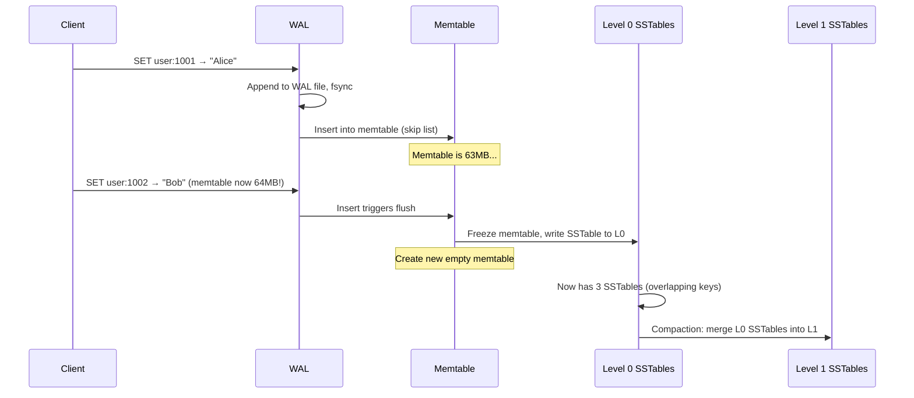

#### 4. Read Path

Reads are more complex because data may be in the memtable, any L0 SSTable, or any level below:

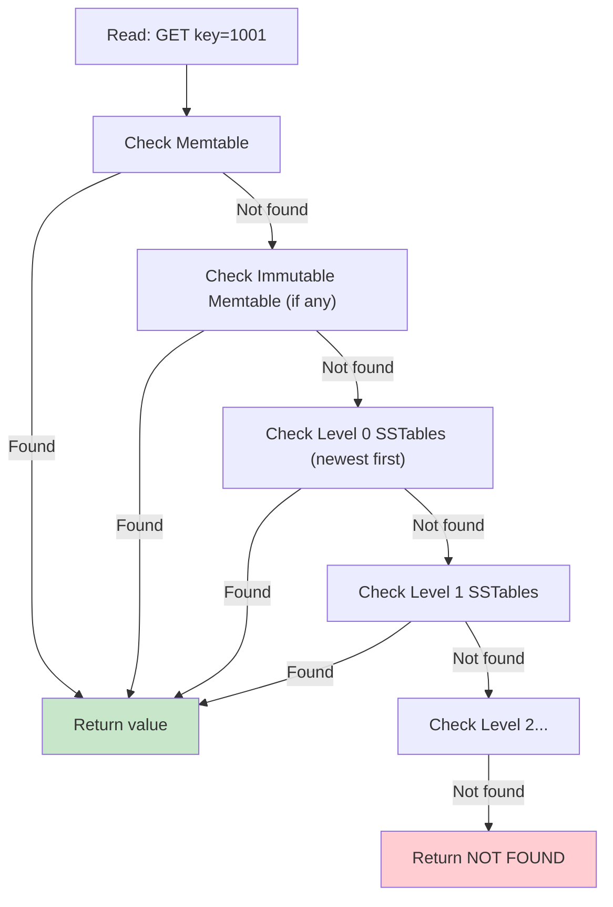

**Optimizations for reads:**

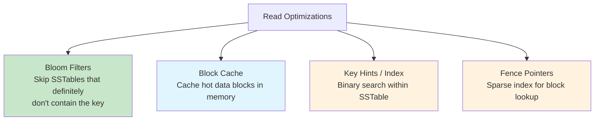

#### 5. Bloom Filters

A Bloom filter is a probabilistic data structure that answers "Is this key *definitely not* in the SSTable?" with zero false negatives:

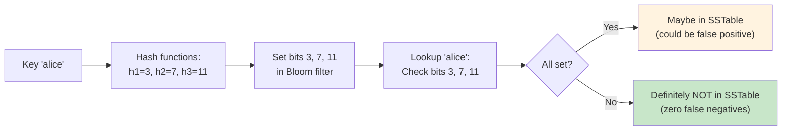

| Property | Value |
|----------|-------|
| False positive rate | ~1% with 10 bits/key |
| False negative rate | 0 (guaranteed) |
| Used for | Avoiding unnecessary SSTable reads |
| RocksDB default | 10 bits per key |

#### 6. Range Queries and Iterators

LSM trees support efficient range scans via **merge iterators** that walk all levels simultaneously:

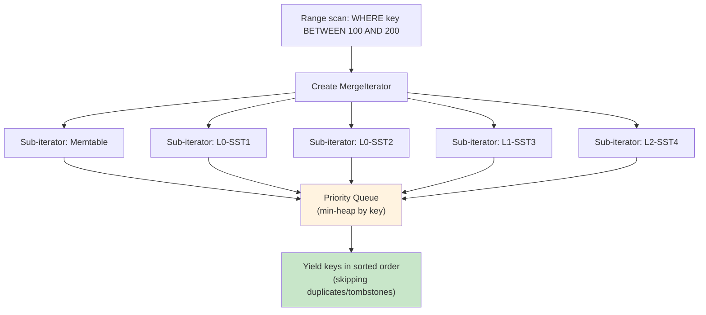

### Tombstones (Deletions)

LSM trees are append-only, so deletions are handled with **tombstone markers**:

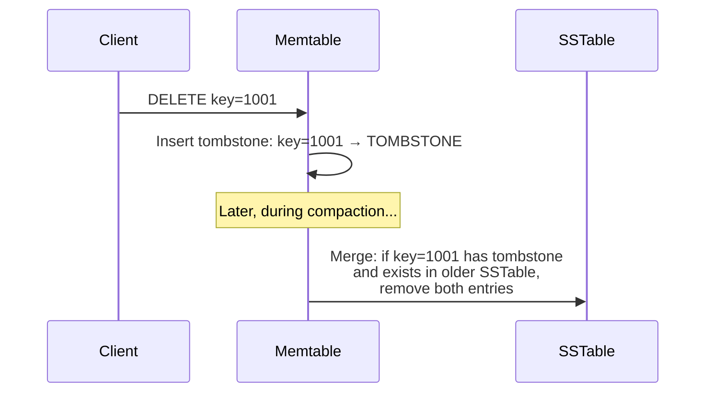

**Problem:** Tombstones consume space until compaction runs. A "range tombstone" (`DELETE WHERE key BETWEEN 100 AND 200`) is more efficient than individual tombstones.

### LSM in Different Databases

```mermaid
flowchart TD
    subgraph LevelDB["LevelDB (Google)"]
        direction TB
        L1[Single-threaded compaction]
        L2[Level-based compaction only]
        L3[Two memtables (active + immutable)]
    end

    subgraph RocksDB["RocksDB (Facebook)"]
        direction TB
        R1[Multi-threaded compaction]
        R2[Level-based + Universal + FIFO]
        R3[Column families]
        R4[Prefix Bloom filters]
        R5[Block cache + compressed cache]
    end

    subgraph Cassandra["Cassandra"]
        direction TB
        C1[LSM per table]
        C2[Size-tiered + Leveled + TWCS]
        C3[Partition-level sorting]
    end

    style LevelDB fill:#e1f5fe
    style RocksDB fill:#c8e6c9
    style Cassandra fill:#fff3e0
```

| Feature | LevelDB | RocksDB | Cassandra |
|---------|---------|---------|-----------|
| **Compaction** | Level-based only | 3 strategies | 3 strategies |
| **Concurrency** | Single compaction thread | Multi-threaded | Multi-threaded |
| **Column Families** | No | Yes | Tables |
| **Bloom Filters** | Yes | Yes (prefix too) | Yes |
| **Compression** | Snappy | LZ4, Zstd, Snappy | LZ4, Snappy |
| **Transactions** | No | Optimistic txn | Lightweight txn |
| **Merge Operators** | No | Yes | No |

## Cross-References

- [Compaction](./compaction.md) — Strategies for merging and cleaning SSTables
- [Database Engines](./engines.md) — How LSM engines compare to B-tree engines
- [WAL](./wal.md) — The durability layer that precedes the memtable
- [Key-Value Stores](../nosql/key-value.md) — LSM trees are the backbone of KV stores
- [Column-family Stores](../nosql/column-family.md) — Cassandra and HBase use LSM trees
- [B-Tree](../indexing/b-tree.md) — The alternative to LSM for read-heavy workloads

## Interview Questions

### Beginner

**Q: What is an LSM tree?**
A: An LSM tree is a write-optimized data structure that buffers writes in an in-memory sorted structure (memtable), then periodically flushes it to disk as an immutable sorted file (SSTable). Reads check the memtable first, then SSTables from newest to oldest.

**Q: Why are LSM trees faster for writes than B-trees?**
A: B-trees update data in-place, requiring random I/O to find and modify the correct page. LSM trees buffer writes in memory and flush them sequentially to disk, converting random I/O to sequential I/O, which is much faster especially on HDDs.

**Q: What is a memtable?**
A: A memtable is an in-memory sorted data structure (usually a skip list) that buffers incoming writes. When it reaches a size threshold, it's frozen and flushed to disk as an SSTable, and a new empty memtable is created.

### Intermediate

**Q: Explain the read path in an LSM tree. How can reads be slow?**
A: A read must check: (1) the memtable, (2) immutable memtable, (3) L0 SSTables (may have overlapping keys), (4) L1+ SSTables. In the worst case, this means checking many files. Optimizations include Bloom filters (skip SSTables that don't contain the key), block cache (cache hot blocks), and compaction (merge levels to reduce files).

**Q: What is a Bloom filter and how does it help LSM reads?**
A: A Bloom filter is a probabilistic set membership data structure with zero false negatives. Each SSTable has a Bloom filter. Before reading from an SSTable, the engine checks the Bloom filter — if it says "not present," the SSTable is skipped entirely. This eliminates most unnecessary I/O for point lookups.

**Q: How do deletions work in an LSM tree?**
A: Deletions insert a **tombstone marker** instead of actually removing data. The tombstone propagates through levels during compaction. When the tombstone reaches the bottom level and all older versions of the key have been compacted away, the tombstone itself can be removed.

### Advanced (FAANG-Level)

**Q: What are the three types of read amplification in LSM trees, and how do you minimize each?**
A:
1. **Read amplification from multiple levels**: A point lookup may check O(L) levels. Mitigated by Bloom filters (check each level with ~1 false positive rate).
2. **Read amplification within a level**: Binary search within an SSTable reads O(log B) blocks. Mitigated by block index cache and fence pointers.
3. **Read amplification from merging**: Range scans must merge-sort across all levels. Mitigated by compaction (fewer overlapping files per level).

Total read amplification ≈ O(L × log B) for point lookups with Bloom filters, where L = number of levels, B = block size.

**Q: Design a system to handle 1 million writes/second with LSM trees. What tunings would you make?**
A:
- **Large memtable** (256MB+) to reduce flush frequency
- **Multiple memtables** (pipeline memtable in RocksDB) for concurrent writes
- **Larger L0 size** before triggering compaction to absorb write bursts
- **Rate limiter** on compaction to prevent I/O stalls
- **Direct I/O** to bypass OS page cache (avoid double buffering)
- **Separate WAL disk** (NVMe) from data disk
- **Disable WAL** for non-durable workloads (e.g., cache)
- **Universal compaction** (better for write-heavy) instead of leveled

**Q: Explain the LSM-tree write amplification problem. How does leveled compaction reduce it compared to size-tiered?**
A: Write amplification = total bytes written to disk / bytes written by application. In **size-tiered compaction**, when L0 fills, all L0 SSTables are merged into L1 — but L1 may already have SSTables, causing cascading merges. Worst case: O(N) per level. In **leveled compaction**, each level has a size limit (L1 = 10× L0, L2 = 10× L1). When L1 overflows, only one SSTable is merged into L2, and only the overlapping SSTables in L2 are rewritten. This limits write amplification to ~O(level_size_ratio × num_levels) ≈ 10-30×, much better than size-tiered for large datasets.

## Common Mistakes

1. **Ignoring write amplification**: LSM trees can have 10-30x write amplification. On SSDs, this affects lifespan. Monitor with `rocksdb.stats` in RocksDB.

2. **Forgetting about tombstone accumulation**: In delete-heavy workloads, tombstones accumulate until compaction reaches the bottom level. Range tombstones are more efficient than individual tombstones.

3. **Assuming LSM reads are always slow**: With Bloom filters and block cache, point lookups in LSM trees are often as fast as B-trees. Range scans are where LSM trees pay the price.

4. **Not tuning compaction**: Default compaction settings are rarely optimal. Write-heavy workloads need different tuning (larger L0, universal compaction) than read-heavy (leveled compaction, smaller levels).

5. **Disabling WAL without understanding the risk**: Disabling WAL improves write throughput by ~2x but means uncommitted memtable data is lost on crash. Only safe for ephemeral data or when replication provides durability.

## Summary and Revision Notes

- **LSM tree** = WAL + Memtable + SSTables (sorted, immutable files on disk)
- **Write path**: WAL → Memtable → Flush to L0 SSTable → Compaction merges levels
- **Read path**: Memtable → L0 (newest) → L1 → L2 → ... (use Bloom filters to skip)
- **Memtable**: In-memory sorted structure (skip list); frozen and flushed when full
- **SSTable**: Immutable sorted file with data blocks, index, Bloom filter
- **Compaction**: Merges SSTables across levels; reclaims space, removes tombstones
- **Bloom filters**: Probabilistic "definitely not in this SSTable" → skip unnecessary reads
- **Tombstones**: Mark deletions; removed during compaction
- **Write amplification**: Key tradeoff — LSM trades write amplification for write throughput
- **RocksDB**: Most popular LSM engine; supports level-based, universal, and FIFO compaction
- **LevelDB**: Simpler predecessor by Google; single-threaded compaction


## Cross References

- [B-Tree](../dbms/indexing/b-tree.md)
- [Compaction](../dbms/internals/compaction.md)
- [WAL](../dbms/internals/wal.md)
- [SSD](../storage/ssd.md)
- [Write Policies](../arch/memory-hierarchy/write-policies.md)
