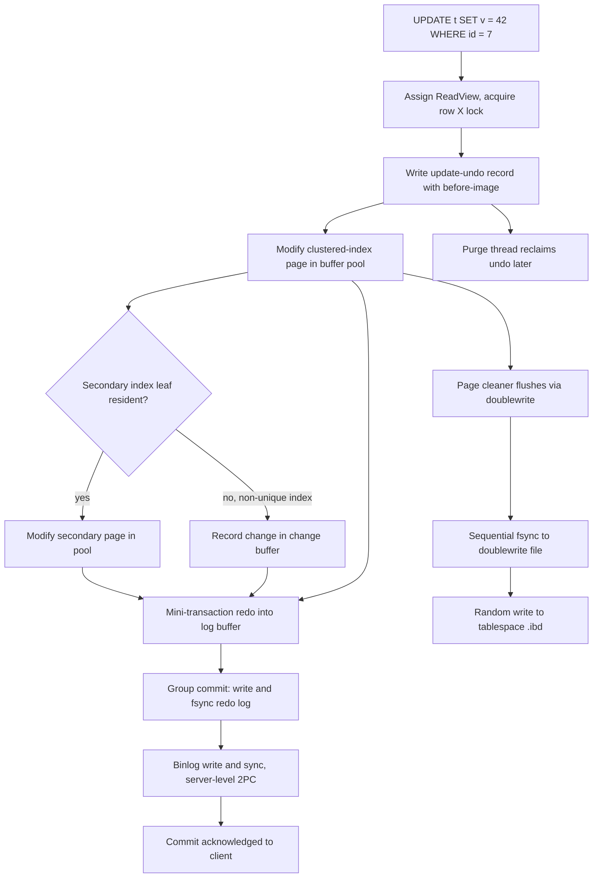
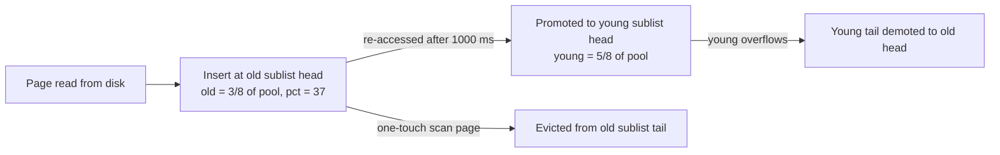

# MySQL InnoDB Internals: Pages, Redo, and Read Views

## Overview

InnoDB is a clustered, page-oriented B+tree engine wrapped in four protective subsystems: a midpoint-LRU buffer pool, a change buffer for deferred secondary-index work, a doublewrite area for torn-page safety, and a redo log whose log sequence number (LSN) disciplines every flush and checkpoint. This page is the architecture-plus-math reference: checkpoint-age arithmetic, fanout and page-split calculations, ReadView visibility rules, and the tuning matrix an interviewer expects you to reason with. It complements two sibling treatments: the write-path walkthrough with a runnable simulation in [InnoDB Internals (storage track)](../../storage/advanced/innodb-internals.md), and the page-layout overview in [Storage Engine Internals](./storage-engine.md).

## The Write Path, Compressed

Every durable UPDATE traverses the same chain — undo record before page modification, redo before commit acknowledgment, doublewrite before tablespace write:



The ordering constraints are the durability contract: the redo record must reach disk before the dirty page it describes (WAL), and a complete page image must be in the doublewrite area before the tablespace write begins (torn-page defense). The undo record must exist before the row change because a concurrent reader may need the old version the instant after the change. Crash recovery then reduces to: replay redo from the last checkpoint LSN, and leave old versions visible until purge retires them.

One subtlety sits between the log buffer and the disk: since MySQL 8.0.11, dedicated **log writer and log flusher threads** (`innodb_log_writer_threads = ON`) own the work of copying the shared log buffer (`innodb_log_buffer_size`, 16 MB default) to the log files and fsyncing it, so user threads only wait for the LSN they care about to be confirmed durable. Very large single transactions bypass the buffer in near-real-time (redo goes straight through when a transaction's pending volume exceeds the buffer's headroom), which is how one giant batch ETL avoids stalling every other transaction behind log-buffer contention — the failure mode of the pre-8.0 single-writer design.

## Buffer Pool: Midpoint LRU with a 5/8 Split

The pool is managed as three lists — free, LRU, and flush (dirty pages in oldest-modification order, which the page cleaner drains from the head) — sharded by `innodb_buffer_pool_instances` (8 when the pool is ≥ 1 GB) to reduce latch contention. The LRU list is split at a **midpoint**: new pages enter the head of the *old* sublist (~3/8 of frames, `innodb_old_blocks_pct = 37`), and are promoted to the young sublist (~5/8) only on a re-access after residing ≥ `innodb_old_blocks_time` (1000 ms).



The 5/8 / 3/8 split plus the 1-second residency guard is a scan-resistance filter: a full-table scan inserts thousands of one-touch pages into the old sublist where they fall off the tail without ever touching the hot 5/8. Tuning levers: raise `innodb_old_blocks_time` for scan-heavy mixes, shrink the old sublist (`innodb_old_blocks_pct` down toward 20) for tiny hot sets. Eviction metrics to watch are the buffer pool hit ratio (target > 99% on OLTP) and free-page starvation, which shows as foreground flushing stalls.

Two further mechanisms shape what hits the old sublist. **Linear read-ahead** (`innodb_read_ahead_threshold`, default 56) reads a whole extent (64 pages) when 56 pages of it have been read sequentially — prefetching the rest into the old sublist where they either prove useful or fall out without harming the young sublist; **random read-ahead** is off by default because its hit rate rarely justifies the I/O. On slow storage, mis-tuned read-ahead is indistinguishable from scan pollution: the pool fills with prefetched pages nobody reads twice, which is exactly the workload the midpoint design was built to absorb.

## Flush List, Page Cleaner, and the Dirty-Page Budget

The **flush list** orders dirty pages by oldest modification LSN, and the **page cleaner** threads (`innodb_page_cleaners`, default 4) write from its head — which is precisely what advances the checkpoint boundary. Two knobs define the dirty-page budget: `innodb_max_dirty_pages_pct` (default 90) is the ceiling, and `innodb_max_dirty_pages_pct_lwm` (default 10) is where adaptive flushing begins ramping. Worked out: a 32 GB pool holds 2,097,152 pages of 16 KB; the 90% ceiling is ~1.89 million dirty pages (28.8 GB), and the cleaner starts working at just ~210,000. In practice the ceiling rarely binds, because the *redo capacity* binds first: the checkpoint-age rule forces flushing long before 90% of the pool is dirty at high write rates. The dirty budget matters most as a shock absorber — bursts of dirtying are tolerated up to the ceiling, then eviction must trigger foreground flushing, which is the classic latency cliff on undersized pools.

Sizing the pool is therefore sizing the *working set plus burst headroom*, not maximizing a hit ratio alone. A 16 GB pool split into 8 instances gives 2 GB per instance — enough latch parallelism for 16+ core hosts. Watch `Innodb_buffer_pool_wait_free` and `Innodb_buffer_pool_flush_requests` as the counters that reveal the cleaner falling behind; they move before latency percentiles do.

## Change Buffer and Doublewrite

The **change buffer** absorbs writes to non-unique secondary index pages that are not resident in the pool: instead of a random read to fetch the leaf, the pending change is recorded in a B+tree inside the system tablespace (capped by `innodb_change_buffer_max_size`, default 25% of pool). Merging happens when the leaf is later read or during background merge. Because uniqueness would require reading the page anyway, UNIQUE indexes are exempt. The bet pays on write-mostly workloads with cold secondary indexes; read-after-write patterns can make it a net loss (`innodb_change_buffering=none`).

The **doublewrite buffer** solves the torn-page problem: a 16 KB page spans many 512 B or 4 KB disk sectors, so a crash mid-write can land a half-page. Before any tablespace write, the page cleaner copies dirty pages into an in-memory buffer (two ~1 MB blocks), fsyncs them sequentially to the doublewrite area (dedicated `.dblwr` files since MySQL 8.0.20), and only then writes them to their real locations. Recovery checksums every page (FIL trailer) and restores torn or blank pages from the doublewrite copy. The cost is every page written twice — the price of converting "16 KB atomic" into "1 MB was already durable".

## Redo Log: LSN, 512-Byte Blocks, and Checkpoint Age

Redo is physical: mini-transactions (mtr) append byte-level change records for specific (space, page) targets into a 64-bit **log sequence number** stream. The log is chopped into **512-byte blocks** (12-byte header with block number and data length, 4-byte checksum trailer), which survives partial blocks on crash. Durability is governed by `innodb_flush_log_at_trx_commit = 1` (fsync per commit), with **group commit** batching concurrent commits into one fsync so commit latency amortizes.

The core capacity quantity is the **checkpoint age**:

\\[ \\text{age} = L_{\\text{now}} - L_{\\text{oldest dirty page}} \\]

It is the span of redo that a crash would have to replay, and it may never exceed the redo capacity (`innodb_redo_log_capacity`, default 100 MB since 8.0.30; previously `innodb_log_file_size × innodb_log_files_in_group`, default 2 × 48 MB). The 8.0.30+ implementation keeps capacity constant by spinning up to 32 in-use redo files in the `#innodb_redo` directory. The page cleaner advances the oldest-modification boundary continuously (fuzzy checkpointing), with `innodb_adaptive_flushing` ramping flush rate as age grows past `innodb_adaptive_flushing_lwm` (default 10% of capacity).

A redo record is small and typed; a mini-transaction's records form the atomic unit (each log block carries its own checksum). Representative record types from the source (`mtr0log.cc` and the row modules):

| Record type | Redoes |
|---|---|
| `MLOG_1BYTE` / `MLOG_2BYTES` / `MLOG_4BYTES` / `MLOG_8BYTES` | Raw byte patches: page headers, list pointers, counters |
| `MLOG_REC_INSERT` | Insert of a record into an index page |
| `MLOG_REC_UPDATE_IN_PLACE` | In-place update (delete-mark flips, secondary key update) |
| `MLOG_REC_DELETE` | Physical record removal at purge time |
| `MLOG_PAGE_REORGANIZE` | Page defragmentation / reorganization |

Because records are byte-precise, replay does not depend on row formats or indexes — it depends only on the page image being valid, which is exactly the guarantee doublewrite provides.

Worked example: capacity 4 GB, workload generating redo at 200 MB/s. Steady state requires the cleaner to flush dirty pages at exactly the same rate the age grows — 4 GB / 200 MB/s gives **~20 s of undo/redo history**, so recovery replay is bounded at ~20 s of log. Now a batch job bursts redo at 600 MB/s: age grows at 400 MB/s net, hits 4 GB in **~10 s**, and InnoDB first forces aggressive flushing and then stalls user threads to flush their own pages — visible as latency spikes with a flat disk profile. Sizing rule: redo capacity ≈ peak redo rate × tolerable burst seconds, with headroom for the flusher to catch up.

## Group Commit and the Binlog Two-Phase Commit

With the binary log enabled, a commit is a MySQL-level two-phase commit across two logs. InnoDB writes and syncs redo with the transaction marked PREPARED, then the server appends the transaction's events to the binlog and syncs it, then InnoDB marks the redo COMMITTED. The binlog is the commit ticket: on recovery, any transaction whose XID appears in the binlog is committed, the rest are rolled back — which is what keeps the two logs consistent. The **ordered commit** pipeline runs concurrently-committed transactions through FLUSH (serialize into the binlog), SYNC (one group fsync), and COMMIT (InnoDB commit) stages, so N concurrent transactions pay roughly one binlog fsync instead of N.

The tuning consequence: with `innodb_flush_log_at_trx_commit = 1` and `sync_binlog = 1` (the durable defaults), throughput is bounded by group-commit batch size — the more concurrency, the larger the groups, the cheaper per-transaction fsync. `binlog_group_commit_sync_delay` (µs) deliberately delays the SYNC stage to grow batches on low-concurrency workloads, trading latency for throughput. Setting either log to relax durability (`trx_commit = 2`, `sync_binlog = 100`) is a fleet-wide risk decision, not a tuning whim: the two settings should be relaxed together, or the logs can diverge and corrupt replication.

## Undo Tablespaces and the Version Store

Old row versions live in **undo logs**, not in the clustered index. Two kinds: **insert undo** (needed only to roll back the inserting transaction; discarded at commit) and **update undo** (needed by concurrent ReadViews; retained after commit until purge proves no reader can need it). Since MySQL 8.0, undo lives in separate **undo tablespaces** (`innodb_undo_tablespaces = 2` by default) that can be truncated at runtime (`innodb_undo_log_truncate = ON`, `innodb_max_undo_log_size` default 1 GB), ending the old ibdata1-growth pathology.

Each clustered-index record carries the hidden columns `DB_TRX_ID` (6 bytes) and `DB_ROLL_PTR` (7 bytes, pointing into an undo log); tables without a primary key get a hidden 6-byte `DB_ROW_ID`. The **history list length** — update-undo records awaiting purge — is the single most telling InnoDB health metric: a long-running ReadView pins it, reads then walk ever-longer undo chains, and `innodb_max_purge_lag` (default 0 = off) can throttle writers as backpressure. `innodb_purge_threads = 4` workers drain it in commit order.

Undo is organized into **rollback segments** (`innodb_rollback_segments`, default 128) distributed across the undo tablespaces, each holding undo logs for concurrent transactions; a transaction's chain of undo pages can itself span multiple pages via page-to-page pointers, so a deeply updated row has a long linked list of before-images. Update undo for one transaction whose single row was updated 10,000 times is 10,000 chained before-images — every REPEATABLE READ reader of that row behind the writer walks all 10,000. That is the mechanical reason "long writer + patient readers" is the worst-case shape for InnoDB MVCC, and why batching row-by-row updates into set operations helps far more than sizing buffers.

## MVCC: ReadViews and Version Chains

A transaction at REPEATABLE READ creates one **ReadView** for its lifetime; READ COMMITTED creates one per statement. The struct is four fields over the transaction system's active list:

```text
ReadView {
    m_low_limit_id    = next trx_id to be assigned          (upper water mark)
    m_up_limit_id     = min(trx_ids active at creation)     (lower water mark)
    m_ids             = sorted list of active trx_ids
    m_creator_trx_id  = my own trx_id
}
```

Visibility of the clustered-index row's `DB_TRX_ID = t`:

```text
t == m_creator_trx_id                  -> visible (my own change)
t <  m_up_limit_id                     -> visible (committed before ReadView)
t >= m_low_limit_id                    -> invisible (started after ReadView)
else: binary search m_ids
      t in m_ids                       -> invisible (still active)
      t not in m_ids                   -> visible (committed before ReadView)
```

If the current version is invisible, the reader follows `DB_ROLL_PTR` through undo records, applying before-images, until the reconstructed version's `trx_id` passes the test. If the row was deleted, the record is **delete-marked** rather than removed, so the chain stays walkable until purge physically drops it. Secondary indexes get a cheap short-circuit: each index entry records the max trx_id at which the page changed, so a ReadView older than that can trust the entry without touching undo (change-buffered entries included). The cross-engine version-chain comparison — heap-tuple vs undo-based vs delta storage — is in [MVCC Internals](../advanced/mvcc-internals.md), and the GC side in [MVCC Garbage Collection](../advanced/mvcc-garbage-collection.md).

### Snapshot Reads vs Locking Reads

The ReadView governs *consistent* reads — plain `SELECT` — but **locking reads** deliberately step outside the snapshot. `SELECT ... FOR UPDATE` / `FOR SHARE` read the *latest committed* version, lock it (record lock, plus gap or next-key locks under REPEATABLE READ), and wait for or fail against uncommitted changers; this is how read-modify-write sequences avoid the lost-update race that a snapshot read would invite. InnoDB also uses **semi-consistent reads** under READ COMMITTED: an UPDATE whose row is locked by another transaction may evaluate the WHERE clause against the last committed version instead of waiting — an optimization that reduces lock waits but only exists at that isolation level. The design contrast with PostgreSQL is instructive: PG's REPEATABLE READ *errors* on concurrent update rather than waiting or reading latest, InnoDB's RR waits on row locks, and SERIALIZABLE in each engine escalates differently (SSI in PG, effectively serialization via next-key locking in InnoDB). Choosing an isolation level is therefore choosing a *conflict-resolution strategy*, not just an anomaly checklist — see [Isolation Levels](../transactions/isolation-levels.md).

## Clustered and Secondary Index Layout

The table **is** the clustered index: leaf pages of the primary-key B+tree hold full rows in PK order, linked via FIL prev/next. Secondary index leaves store `(indexed key columns, primary key value)` — the back-pointer — so a secondary lookup is two B+tree descents. Consequences worth computing:

- **Fanout math.** With an 8-byte bigint PK, a non-leaf entry is ~4 B child pointer + 8 B key + 5 B record header + 4 B directory slot ≈ 21 B, giving a fanout of ~750 entries on a 16 KB page. A ~150 B row fits ~110 per leaf. A 3-level tree therefore addresses \\(750 \\times 750 \\times 110 \\approx 6.2\\times10^{7}\\) rows — ~562,000 leaf pages ≈ 9 GB — meaning any point lookup is ≤ 3 page touches plus one pool lookup.
- **Page splits.** A random insert that lands on a full page splits ~50/50. With random key order, the long-run steady-state page fill of such a B+tree approaches \\(\\ln 2 \\approx 69\\%\\) — you pay ~45% more pages and cache misses than the theoretical minimum. Monotonic (auto-increment-style) inserts use the rightmost-page optimization: the old page stays full and the new page starts empty, giving ~90%+ fill at the cost of a rightmost-leaf hotspot. Three split variants cover real behavior: **split at the midpoint** for random inserts (even fill, minimal future splits), **split at the insertion point** for mid-page inserts (the original page keeps the prefix, sometimes very unevenly), and **split at the end** for rightmost appends (no redistribution at all — the point of the design is that append-only keys never touch old data).
- **Merges.** When deletes shrink a page below the merge threshold (`MERGE_THRESHOLD`, default 50% of fill), InnoDB merges it with a sibling; thrashing insert/delete workloads oscillate split-merge cycles visible as latch contention.
- **UUID PKs** scatter inserts across the tree, maximizing 50/50 splits, buffer-pool churn, and change-buffer pressure — the standard argument for monotonic PKs in InnoDB (the structure-level analysis is in [B+Trees](../indexing/b-plus-tree.md)).

## Page Structure: FIL Header, Records, Directory

Every 16 KB page begins with a 38-byte **FIL header** and ends with an 8-byte **FIL trailer** — the frame that makes checksums, page linking, and torn-page detection possible:

| FIL field | Size | Purpose |
|---|---|---|
| `FIL_PAGE_SPACE_OR_CHKSUM` | 4 B | Space ID (legacy) / page checksum |
| `FIL_PAGE_OFFSET` | 4 B | Page number within the tablespace |
| `FIL_PAGE_PREV` / `FIL_PAGE_NEXT` | 4 + 4 B | Sibling links for range scans |
| `FIL_PAGE_LSN` | 8 B | LSN of last modification (WAL ordering check) |
| `FIL_PAGE_TYPE` | 2 B | Index, undo, system, allocated, ... |
| `FIL_PAGE_FILE_FLUSH_LSN` | 8 B | Checkpoint for initial system pages |
| `FIL_PAGE_SPACE_ID` | 4 B | Tablespace ID |
| trailer: checksum + `FIL_PAGE_END_LSN_OLD_CHKSUM` | 8 B | Low-order LSN bits + checksum (torn detection) |

Index pages then carry a 36-byte index header, the two sentinel records **infimum and supremum** (bounding keys, enabling gap-lock semantics and scan termination), user records growing downward from the top of the header area, a free segment, and a **page directory** growing upward — 4-byte slots into every n-th record that turn binary search of the page into O(log slots). Common `FIL_PAGE_TYPE` values worth recognizing: 0 = freshly allocated, 2 = undo log page, 3 = inode page, 4 = change-buffer free list, 5 = change-buffer bitmap, 7 = transaction system, 8 = tablespace header, 17855 (0x45BF) = index page. Each user record in COMPACT format has a 5-byte header:

| Record header field | Size | Purpose |
|---|---|---|
| next-record offset | 2 B | Relative offset to the next record (physical order = key order) |
| record type | 3 bits | Conventional, node pointer, infimum/supremum |
| heap number | 13 bits | Position in insertion order (directory, locking) |
| delete-mark | 1 bit | Logical delete pending purge |
| min-rec-mask | 1 bit | Marks the minimum record of a non-leaf level |
| n_owned | 4 bits | Records owned by a directory slot holder |

After the fixed header come variable-length column lengths and the null bitmap, then the key columns and payload. Prefix and compressed variants (DYNAMIC, COMPRESSED) shift long values off-page but keep the same frame.

The 16 KB page size itself is a parameter (`innodb_page_size`: 4, 8, 16, 32, 64 KB), fixed at instance creation. Larger pages raise the fanout (shallower trees, bigger row capacity per leaf) but inflate the smallest I/O unit and the torn-page surface; smaller pages waste less on lightly filled leaves but deepen trees. The default survives because 16 KB is the tested equilibrium between SSD read amplification and B+tree depth — but knowing it is adjustable explains why row-size limits (half a page by default for in-row storage) and maximum index key lengths move with it.

## Crash Recovery Walkthrough

Recovery stitches the four subsystems back together in a fixed order:

```text
1. Read the redo log's last checkpoint LSN (log headers hold first/last checkpoint).
2. Scan redo from that LSN; for each record, if the target page's FIL_PAGE_LSN
   is older than the record's LSN, apply it (idempotent replay).
3. Any page whose tablespace image is torn or blank is first restored whole
   from the doublewrite area, then redo is applied on top.
4. Reconstruct the transaction system; transactions with a PREPARED redo
   record but no COMMIT are rolled back using their insert/update undo.
5. On binlog-enabled servers, XIDs present in the binlog force commit;
   the rest are rolled back (binlog-as-commit-ticket XA recovery).
```

Two properties make this correct. Idempotence: applying a redo record to an already-up-to-date page is a no-op because the page's `FIL_PAGE_LSN` is compared first. Boundedness: the amount of replay is bounded by redo capacity — the same checkpoint-age quantity that capped runtime write bursts now caps recovery time, which is the real argument for *not* oversizing redo on restart-latency-sensitive fleets. After recovery, background threads take over: purge drains the history list, change-buffer merges resume, and the page cleaner rebuilds the flush list boundary.

## Worked Example: Sizing a 20,000 TPS Instance

Take 20,000 mixed transactions/s, each touching 1–2 rows. Redo per simple row update lands around 200–300 B of mtr records; at ~250 B/transaction that is **5 MB/s of redo**. A 4 GB redo capacity therefore holds ~800 s ≈ 13 minutes of history — generous for recovery replay and safely above any realistic burst. The page cleaner must sustain 5 MB/s ÷ 16 KB ≈ **320 page writes/s**, trivial for any SSD. If the hot working set measures 12 GB (index pages plus row pages), a 16 GB pool provides the standard ~25% headroom, split across 8 instances.

The MVCC budget: 20,000 update-undo records/s at ~200 B each add ~4 MB/s of undo — a 1 GB undo tablespace cycles roughly every 4 minutes, so `innodb_undo_log_truncate` runs continuously but cheaply. The danger is not rate but *duration*: one 30-minute REPEATABLE READ export pins 4 MB/s × 1,800 s ≈ **7.2 GB** of undo that purge cannot touch, tripling version-store footprint and stretching every read that walks those chains. The sizing lesson generalizes: capacity parameters (redo, undo, pool) are priced in *time*, so the audit question is always "how long can my worst reader and worst writer coexist?"

## Adaptive Hash Index

The **adaptive hash index (AHI)** is InnoDB's answer to repeated B+tree descents: for index pages that show a persistent search pattern, the engine builds in-memory hash entries mapping key prefixes (hashed via the `btr_search` mechanism, after a memcmp pre-filter) directly to the page or record, turning a 3-descent lookup into one hash probe. It is automatic — no schema change — toggled by `innodb_adaptive_hash_index` (default ON), partitioned into `innodb_adaptive_hash_index_parts = 8` to reduce contention. Construction is per-page and pattern-driven: the buffer block tracks the shape of repeated searches (equality on a fixed number of leftmost key bytes) and builds hash entries only when that pattern repeats enough to pay off, and entries are invalidated wholesale the moment the page is modified — which is why write-heavy pages thrash the mechanism. The trade-off is write-path and latch overhead: under heavy DML or high concurrent read rates, AHI latch contention becomes a top CPU consumer, and disabling it is a first-line fix for read-only hot spots gone wrong. It helps most with stable, equality-only, high-repetition point lookups; it does nothing for range scans.

## Tuning Matrix

| Parameter | Default | What it controls / when to change |
|---|---|---|
| `innodb_buffer_pool_size` | 128 MB | Set to ~60–75% of RAM on a dedicated host; the #1 knob |
| `innodb_buffer_pool_instances` | 8 (pool ≥ 1 GB) | Raise latch parallelism for very large pools |
| `innodb_old_blocks_pct` | 37 | Old sublist share (3/8); lower for small hot sets |
| `innodb_old_blocks_time` | 1000 ms | Residency guard; raise to strengthen scan resistance |
| `innodb_change_buffering` | all | none if reads-after-write dominate buffered ranges |
| `innodb_flush_log_at_trx_commit` | 1 | 2 trades ~1 s of durability on OS crash for throughput |
| `innodb_redo_log_capacity` | 100 MB | Size to peak redo rate × burst seconds (see math above) |
| `innodb_adaptive_flushing` / `_lwm` | ON / 10 | Smooths page-cleaner rate vs checkpoint age |
| `innodb_max_dirty_pages_pct` / `_lwm` | 90 / 10 | Dirty-page ceiling driving cleaner aggressiveness |
| `innodb_undo_tablespaces` / `_log_truncate` | 2 / ON | Undo isolation and in-place truncation |
| `innodb_max_undo_log_size` | 1 GB | Truncation trigger for undo tablespaces |
| `innodb_purge_threads` / `max_purge_lag` | 4 / 0 | Purge parallelism; backpressure if history explodes |
| `innodb_adaptive_hash_index` / `_parts` | ON / 8 | Disable under write-heavy or latch-bound read loads |
| `innodb_flush_neighbors` | 0 | Keep 0 on SSDs; 1 only on rotating disks |
| `innodb_io_capacity` / `_max` | 200 / 2000 | Tell the cleaner what the device can absorb |

## Interview Questions

1. **A reporting scan just destroyed OLTP latency. What happened in the buffer pool and what do you change?** The scan streamed tens of thousands of one-touch pages through the LRU, evicting the hot set. With midpoint LRU they only churn the old 3/8 — if latency still tanked, the pages are being promoted because each is re-touched within `innodb_old_blocks_time`, or the scan is memory-bandwidth bound. Raise `innodb_old_blocks_time`, lower `innodb_old_blocks_pct`, and run the scan on a replica; the runnable model in the storage-track InnoDB page shows a naive LRU losing its entire hot set where midpoint keeps it.

2. **Redo capacity is 4 GB and your batch job generates 600 MB/s of redo. When do user threads stall?** Checkpoint age grows at 600 MB/s minus the cleaner's flush rate; at zero headroom that is 4096/600 ≈ 6.8 s to full. Before that, adaptive flushing ramps at 10% of capacity (400 MB) and aggressive flushing near the top; when age hits the hard limit, user threads flush their own dirty pages synchronously — visible as write-latency spikes with idle-looking disks. Fix: cap the batch rate, or size `innodb_redo_log_capacity` to peak rate × tolerable burst window.

3. **Why do UUID primary keys hurt InnoDB specifically?** Rows live in the clustered index in PK order. Random PKs land every insert on a random leaf, forcing 50/50 splits that settle at ~ln 2 ≈ 69% page fill (≈ 45% space overhead), heavy buffer-pool churn, change-buffer pressure on every secondary index, and fragmentation that monotonic keys avoid. A heap-organized engine (PostgreSQL) merely appends and lets indexes absorb the randomness, so the penalty lands differently.

4. **Walk a ReadView check over a version chain.** Row's current `DB_TRX_ID = 300`, your ReadView has `up_limit = 250`, `low_limit = 400`, active set {280}. 300 ≥ low_limit? No (300 < 400). 300 < up_limit? No. Binary search of {280} misses 300 → committed before the ReadView → visible. If instead the set contained 300, follow `DB_ROLL_PTR` to the undo before-image (trx_id 200, say), which is < 250 → visible version. Long chains mean long walks — hence history-list-length monitoring.

5. **Why does InnoDB need both doublewrite and redo?** Redo records are physiological — they assume they are applying to a *valid* page image. A torn 16 KB page is invalid, and replaying redo onto it corrupts data; the FIL-trailer checksum detects the tear and the doublewrite area supplies the last complete image. Redo gives durability of changes; doublewrite gives atomicity of pages. Removing either breaks the recovery invariant (the WAL rule alone is insufficient on non-atomic-write devices).

6. **When does the change buffer hurt more than it helps?** When buffered index ranges are read soon after being written: every read pays the merge debt (a random read plus apply) that the write avoided, and under unique-key-heavy or read-after-write workloads (dashboard counters, upsert patterns) the net I/O is worse with buffering on. Diagnose via `innodb_change_buffering` stats and disable per workload; it never applies to unique indexes since those must read the page to validate.

## Key Takeaways

- InnoDB's four write-path guards in order: undo before modify, redo before commit, doublewrite before tablespace, purge after last reader. Break the order and recovery breaks.
- Buffer pool = midpoint LRU: young ≈ 5/8, old ≈ 3/8 (`pct = 37`), with a 1000 ms promotion guard that makes it scan-resistant by construction.
- Checkpoint age (`L_now − L_oldest_dirty`) is the write-throughput ceiling: capacity ÷ peak redo rate = burst seconds before user threads stall.
- Old versions live in undo tablespaces, not the table; ReadView (low/up limit + active list) decides visibility, and history list length is the health metric.
- The clustered index means secondary lookups are two B+tree descents, UUID PKs cost ~31% space plus churn (ln 2 fill), and monotonic keys trade fill efficiency for a rightmost hotspot.
- Page anatomy is small and worth memorizing: 38 B FIL header, 5 B record header, infimum/supremum, page directory — it explains checksums, locking sentinels, and in-page binary search.
- The adaptive hash index trades DML overhead for hash-speed point lookups; it is the first thing to disable when latch contention dominates.

## References

- [MySQL Reference Manual](https://dev.mysql.com/doc/) — root documentation (bot-blocked to curl; loads in a browser).
- [InnoDB Architecture](https://dev.mysql.com/doc/refman/8.4/en/innodb-architecture.html)
- [InnoDB Buffer Pool](https://dev.mysql.com/doc/refman/8.4/en/innodb-buffer-pool.html) — midpoint LRU parameters.
- [Change Buffer](https://dev.mysql.com/doc/refman/8.4/en/innodb-change-buffer.html)
- [Doublewrite Buffer](https://dev.mysql.com/doc/refman/8.4/en/innodb-doublewrite-buffer.html)
- [Redo Log](https://dev.mysql.com/doc/refman/8.4/en/innodb-redo-log.html)
- [Undo Logs](https://dev.mysql.com/doc/refman/8.4/en/innodb-undo-logs.html)
- [InnoDB Multi-Versioning](https://dev.mysql.com/doc/refman/8.4/en/innodb-multi-versioning.html) — ReadView and consistency model.
- [Adaptive Hash Index](https://dev.mysql.com/doc/refman/8.4/en/innodb-adaptive-hash.html)
- [InnoDB Page Structure](https://dev.mysql.com/doc/refman/8.4/en/innodb-page-structure.html)
- [mysql-server source](https://github.com/mysql/mysql-server) — `buf0lru.cc`, `log0log.cc`, `btr0btr.cc`, `row0undo.cc`.
- Y. Yao, "On Random 2-3 Trees", *Acta Informatica*, 1978 — the ~ln 2 utilization result for B-trees under random insertion.
- C. Mohan et al., "ARIES: A Transaction Recovery Method Supporting Fine-Granularity Locking", *ACM TODS*, 1992 — the recovery lineage InnoDB follows.

## Cross-References

- [InnoDB Internals (storage track)](../../storage/advanced/innodb-internals.md) — write-path walkthrough plus a runnable midpoint-LRU and torn-page simulation.
- [Storage Engine Internals](./storage-engine.md) — side-by-side page layouts and buffer-pool structure for InnoDB and PostgreSQL.
- [Write-Ahead Logging](./wal.md) — LSN mechanics, group commit, and per-engine WAL comparison.
- [Transaction Internals](./transaction-internals.md) — undo/redo roles and ARIES recovery this page assumes.
- [MVCC Internals (cross-engine)](../advanced/mvcc-internals.md) — InnoDB undo chains vs PostgreSQL heap versions vs delta storage.
- [MVCC Garbage Collection](../advanced/mvcc-garbage-collection.md) — purge, history list, and undo retention compared across engines.
- [B+Trees](../indexing/b-plus-tree.md) — the structural foundation for splits, merges, and fanout math.
- [Buffer Pool (theory)](../caching/buffer-pool.md) — eviction-policy theory behind the midpoint design.
