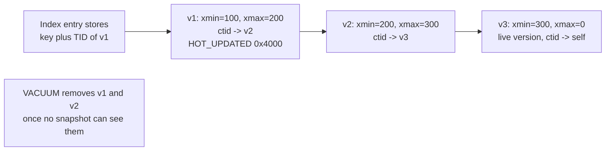

# PostgreSQL MVCC Internals: Tuples, Snapshots, and VACUUM

## Overview

PostgreSQL implements MVCC by writing every new row version into the heap itself and deciding visibility per tuple, at read time, from two 32-bit transaction IDs in each tuple header. This design buys lock-free reads at the cost of three subsystems every operator must understand: hint-bit and hint maintenance, HOT chain management, and VACUUM with its freeze/wraparound machinery. This page covers those internals with the numbers interviewers probe — snapshot algebra, the \\(2^{31}\\) XID horizon, and a worked bloat calculation — and stays deliberately complementary to the cross-engine treatment in [MVCC Internals](../advanced/mvcc-internals.md).

## The Tuple Header: xmin, xmax, ctid, infomask

Every heap tuple carries a 23-byte header (padded to 24) that *is* the MVCC protocol. `src/include/access/htup_details.h` is the authoritative source; the fields that matter for visibility are:

| Field | Size | Meaning |
|---|---|---|
| `t_xmin` | 4 B | XID of the transaction that inserted this version |
| `t_xmax` | 4 B | XID that deleted or updated this version (0 = never invalidated) |
| `t_cid` / `t_xvac` | 4 B | Command ID for same-transaction ordering (union with VACUUM FULL xid) |
| `t_ctid` | 6 B | (page, offset) of the *next* version in the chain, or self if latest |
| `t_infomask2` | 2 B | attribute count plus flags: `HEAP_NATTS_MASK`, `HEAP_KEYS_UPDATED` |
| `t_infomask` | 2 B | visibility and formatting flags (table below) |
| `t_hoff` | 1 B | offset to user data (header + null bitmap padding) |

The `t_infomask` bits are the per-tuple cache of "what happened to the transactions that touched me":

| Bit | Hex | Meaning |
|---|---|---|
| `HEAP_XMIN_COMMITTED` | 0x0100 | inserter known committed (hint bit) |
| `HEAP_XMIN_INVALID` | 0x0200 | inserter aborted (hint bit); together with the above forms `HEAP_XMIN_FROZEN` = 0x0300 |
| `HEAP_XMAX_COMMITTED` | 0x0400 | deleter known committed (hint bit) |
| `HEAP_XMAX_INVALID` | 0x0800 | deleter aborted or never existed |
| `HEAP_XMAX_IS_MULTI` | 0x1000 | `t_xmax` holds a MultiXactId, not an XID |
| `HEAP_UPDATED` | 0x2000 | `t_xmax` updated (not deleted) this tuple |
| `HEAP_HOT_UPDATED` | 0x4000 | this tuple is the head of a HOT chain |
| `HEAP_ONLY_TUPLE` | 0x8000 | no index entry points here; reachable only via a HOT chain |

**Hint bits** are a correctness-preserving cache, not a source of truth. When a reader first checks `t_xmin` against the commit log (`pg_xact`, formerly `clog`), the lookup costs a shared-buffer access; the reader can then stamp `HEAP_XMIN_COMMITTED` (or `INVALID`) into the header so future readers skip the lookup. Two consequences matter in production. First, a bare `SELECT` can dirty pages by writing hint bits, causing extra WAL if `wal_log_hints` is on or data checksums are enabled — this surprises people running replicas with checksums. Second, because the bits are advisory, all visibility logic still works when they are absent (for example, after a crash or on a standby).

A version chain is a singly linked list through `t_ctid`:



An `UPDATE` inserts the new version and stamps the old one's `t_xmax`; a `DELETE` only stamps `t_xmax` and creates no new tuple. Index entries always point at the *first* version's TID, which is why the HOT optimization below is so valuable.

## Snapshots, Formalized

A snapshot is a compact description of "which transactions existed when I started" — it never stores committed XIDs, only the boundary and the in-progress set:

```c
typedef struct SnapshotData
{
    TransactionId xmin;   /* oldest XID still running at snapshot time   */
    TransactionId xmax;   /* first not-yet-assigned XID (upper bound)    */
    TransactionId *xip;   /* array of in-progress XIDs at snapshot time  */
    uint32        xcnt;
    ...
} SnapshotData;
```

Given tuple `T` and snapshot `S`, the core predicate is:

```text
visible(T, S)      :=  xmin_ok(T.t_xmin, S)  AND  NOT xmax_blocks(T.t_xmax, S)

xmin_ok(x, S)      :=  committed(x) AND x < S.xmax AND x not in S.xip
xmax_blocks(x, S)  :=  committed(x) AND x < S.xmax AND x not in S.xip
```

In words: the tuple is visible if its *creator* committed before the snapshot and its *deleter* did not. `committed(x)` is a lookup in the two-bits-per-transaction `pg_xact` SLRU, accelerated by the hint bits above. The full production function is `HeapTupleSatisfiesMVCC` in `src/backend/utils/time/heapam_visibility.c`, which adds subtransaction handling, `cmin`/`cmax` command ordering (a transaction must see its own earlier commands but not later ones), and MultiXact expansion.

Snapshot *cadence* is the isolation-level contract. READ COMMITTED takes a fresh snapshot at the start of every statement, which is why two statements in one transaction can disagree. REPEATABLE READ and SERIALIZABLE take one snapshot for the whole transaction; REPEATABLE READ returns an isolation-violation error on concurrent update, while SERIALIZABLE runs SSI on top, tracking rw-conflicts — see [Serializable Snapshot Isolation](../advanced/serializable-snapshot-isolation.md). Since PostgreSQL 10, XIDs are also tracked as 64-bit `FullTransactionId`s internally, but the on-disk format stays 32-bit, which is precisely what creates the wraparound problem below.

## A Worked Visibility Trace

The algebra becomes obvious once you trace one timeline. Events, in order: XID 100 inserts row `a=1` and commits; XID 150 updates it to `a=2` and commits; XID 155 updates it to `a=3` and is *still running* when reader R (REPEATABLE READ) takes its snapshot: `xmin = 155` (oldest running XID), `xmax = 160` (next unassigned), `xip = {155}`. The index points R at the chain head v1:

```text
v1: xmin=100, xmax=150   -> xmin ok (committed, < 160, not in xip)
                            xmax blocks (committed, < 160, not in xip) -> follow ctid
v2: xmin=150, xmax=155   -> xmin ok
                            xmax=155 is IN xip (not committed) -> does NOT block
                            => v2 is VISIBLE to R
v3: xmin=155, xmax=0     -> never reached by R (invisible writer, still running)
```

Now let 155 commit. A READ COMMITTED reader takes a fresh snapshot for its next statement — `xmin = 160, xmax = 170, xip = {}` — and the same walk finds v2's `xmax = 155` committed and before the snapshot, so it blocks, and v3 (`xmin = 155`, now committed) becomes visible. R, holding its REPEATABLE READ snapshot, still resolves to v2 on every read — but if R itself now tries to UPDATE the row, it gets an isolation-violation error because the latest version was changed by a transaction that committed after R's snapshot. Every MVCC anomaly interview question decomposes into exactly this walk; practice constructing the snapshot first, then evaluating `xmin_ok` and `xmax_blocks` mechanically.

## CLOG, Subtransactions, and the Cost of Visibility

The `committed(x)` lookup in the visibility predicate is served by the commit log — `pg_xact` since v10, historically `clog` — which stores **two bits per transaction** (in-progress, committed, aborted, sub-committed) in SLRU-managed files under the data directory. A hot lookup is a shared-memory read; a cold one touches the SLRU file through the OS page cache. This is why visibility checks on busy tables are cheap *in aggregate* but why a system churning through millions of XIDs grows its SLRU pressure, visible as `pg_xact` eviction churn in `pg_stat_slru`.

**Subtransactions** complicate the picture. A `SAVEPOINT` followed by DML makes the backend allocate a real XID for the subtransaction, which must then appear in every concurrent snapshot's `xip` array. To bound that cost, each PGPROC caches at most 64 sub-XIDs (`PGPROC_MAX_CACHED_SUBXIDS`); beyond that the snapshot is marked **suboverflowed**, and visibility checks must walk the `pg_subtrans` SLRU to resolve whether a subtransaction's parent committed. Suboverflowed snapshots are a classic performance cliff: batch jobs using savepoints in a loop can silently push every reader into SLRU lookups per tuple. Each subtransaction also consumes an XID, so savepoint-heavy loops feed the wraparound horizon math below. Command ordering inside one transaction uses `t_cid` with **combo CIDs** (`combocid`): the first mixed insert/update command pair allocates a combo entry mapping to separate cmin/cmax.

The practical rules fall straight out of the mechanics: keep transactions short so `xip` arrays stay small; treat savepoints as error handling, not control flow; and remember that aborts leave no hint bits behind — a rolled-back transaction's tuples carry `HEAP_XMIN_INVALID` only after some later reader pays the `pg_xact` lookup to discover it.

## HOT Updates and the Visibility Map

A **HOT (Heap-Only Tuple) update** avoids index maintenance entirely when two conditions hold: the update does not modify any column indexed (directly or partially) by any index on the table, *and* the new version fits on the same page as the old one. The old tuple gets `HEAP_HOT_UPDATED`, the new one `HEAP_ONLY_TUPLE`, and indexes keep pointing at the chain head; readers follow `t_ctid` within the page and prune the chain opportunistically during scans. This is why `fillfactor` (default 100, commonly lowered to 80–90 for update-heavy tables) exists: reserved free space is what keeps updates HOT. A non-HOT update writes one new index entry in *every* index on the table, so a 5-index table with non-HOT updates pays 5 index inserts per row update.

The **visibility map (VM)** is a per-relation fork with two bits per heap page: *all-visible* and *all-frozen*. VACUUM sets all-visible when every tuple on the page is visible to every snapshot; it is the bit that makes both VACUUM's skipping (already-all-visible pages are skipped entirely in non-aggressive passes) and index-only scans possible. An **index-only scan** returns values straight from the index without heap fetches, but only for pages marked all-visible — which is why a freshly bulk-loaded, never-vacuumed table shows `Heap Fetches` in the stratosphere, and why the fix is simply one VACUUM. The covering-index design background is in [Covering Indexes](../indexing/covering-index.md).

### Index-Only Scans in Practice

The plan text makes the visibility-map dependency explicit. On a vacuumed table:

```text
EXPLAIN (ANALYZE) SELECT order_id FROM orders WHERE customer_id = 42;
Index Only Scan using idx_orders_cust on orders
  (cost=0.43..8.45 rows=3 width=4) (actual time=0.021..0.022 rows=3 loops=1)
  Index Cond: (customer_id = 42)
  Heap Fetches: 0
```

The same query on a table whose VM bits were invalidated by a recent update storm (or by a bulk load that autovacuum has not yet reached) reports `Heap Fetches: 1942133` — every index entry forces a heap visit for visibility, and the scan degrades to an ordinary index scan in cost while still paying index-only planning assumptions. Note also that `SELECT *` can never use an index-only scan, and a HOT update that stays all-visible preserves the bits, whereas any non-HOT insert or update clears the page's all-visible bit until the next vacuum pass re-checks it.

## VACUUM: Regular, Autotuned, Freeze-Driven

Regular `VACUUM` scans the heap (skipping all-visible pages unless an aggressive pass is needed), collects dead TIDs — tuples whose `xmax` is committed and invisible to every active snapshot — removes their line pointers, compacts pages in place, vacuums indexes (removing entries pointing at dead TIDs), then updates the visibility map and free space map. It never takes a lock blocking reads or writes, and it returns space for *reuse within the relation*, not to the OS. `VACUUM FULL` is a different animal: it rewrites the table (and indexes) into a new file and requires `ACCESS EXCLUSIVE`; it is a maintenance-window operation, usually replaced by `pg_repack`.

Autovacuum is a launcher/worker daemon that triggers per table when:

```text
dead_tuples  >=  autovacuum_vacuum_threshold
                + autovacuum_vacuum_scale_factor * reltuples
```

With defaults (50 + 0.2 × rows), a 10 M-row table needs ~2 M dead tuples before vacuum fires, and since PostgreSQL 13 the sibling `autovacuum_vacuum_insert_threshold` covers append-only tables that never produce dead tuples but still need visibility-map bits for index-only scans. Note the trigger reads `reltuples` — the planner's row estimate — so a stale estimate (never-vacuumed table after a huge delete, or a table whose `ANALYZE` is way behind) skews the trigger in both directions: overestimated `reltuples` delays vacuum on a shrinking table, underestimated `reltuples` fires it constantly. Autovacuum analyze has its own scale factor pair (`autovacuum_analyze_scale_factor`, typically set below the vacuum factor so statistics stay ahead of garbage collection), and the two together keep both the planner and the GC horizon honest.

| Setting | Default | Effect |
|---|---|---|
| `autovacuum_vacuum_scale_factor` | 0.2 | Fraction of table change that triggers vacuum |
| `autovacuum_vacuum_threshold` | 50 | Minimum dead tuples before trigger |
| `autovacuum_naptime` | 1 min | Launcher wake-up interval across the database |
| `autovacuum_vacuum_cost_limit` | −1 (→ 200) | Cost budget per cycle; throttles I/O impact |
| `autovacuum_vacuum_cost_delay` | 2 ms | Pause after exhausting the cost budget |
| `autovacuum_max_workers` | 3 | Workers; note they *share* the cost budget |
| `autovacuum_freeze_max_age` | 200,000,000 | Age forcing an anti-wraparound vacuum |

The freeze family answers "when do we stop trusting `t_xmin` at all?": `vacuum_freeze_min_age` (default 50 M) freezes tuples older than the age, `vacuum_freeze_table_age` (default 150 M) switches VACUUM to an aggressive all-pages scan, and `autovacuum_freeze_max_age` (200 M) forces an anti-wraparound pass even on a table with zero dead tuples. Freezing since 9.4 sets the composite bit `HEAP_XMIN_FROZEN` (0x0300) rather than rewriting `t_xmin` to the old `FrozenTransactionId`, so the original XID survives for forensic tools.

### Cost Throttling, Worked

Autovacuum deliberately taxes itself so it cannot starve OLTP. Each page operation charges a cost — `vacuum_cost_page_hit = 1`, `vacuum_cost_page_miss = 2`, `vacuum_cost_page_dirty = 20` by default — against a budget (`autovacuum_vacuum_cost_limit`, effectively 200 by default). When the budget is exhausted the worker sleeps `autovacuum_vacuum_cost_delay` (2 ms) before continuing. The arithmetic sets a hard ceiling: a pass that dirties pages spends 20 per page, so 200 / 20 = **10 pages per budget round**, and with a 2 ms sleep per round that is at most **~5,000 dirty pages per second** — trivially enough for steady churn, hopeless for recovering a 2-million-dead-tuple backlog in a maintenance window. The standard fix is per-table overrides (`ALTER TABLE ... SET (autovacuum_vacuum_cost_delay = 0)`) on the tables that matter, which exempts them from throttling entirely while the cluster default stays conservative. All workers share one global budget when `autovacuum_vacuum_cost_limit` is derived from `vacuum_cost_limit`, so adding workers does not proportionally speed up vacuuming.

### Freezing Mechanics

Freezing a tuple is cheap and local: set `HEAP_XMIN_FROZEN` on the header (an in-place bit rewrite) and, for pages where every tuple is now frozen, set the VM's *all-frozen* bit so future anti-wraparound passes skip the page without reading it. That bit is why the marginal cost of wraparound maintenance approaches zero on static data: a log-structured-style append-only table is frozen once, page by page, and never touched again. The expensive case is churn on old data — every update that clears all-visible forces a later pass to re-read and re-freeze, so the effective freeze work scales with *updates to old rows*, not table size. Freezing emits WAL for each modified page, which is why anti-wraparound vacuums can themselves generate significant WAL volume and interact badly with replication lag and archive bandwidth.

## Wraparound: The 2^31 XID Horizon

XIDs are 32-bit and compared with modular arithmetic: `a` is "older" than `b` iff \\((a - b) \\bmod 2^{32}\\) is in the upper half of the range. A tuple frozen today must still look *older* than every XID issued in the future, which can only hold if no more than \\(2^{31}\\) XIDs are ever issued after the last unfrozen XID. The horizon is therefore half the counter, not the whole counter:

\\[ T_{\\text{horizon}}(r) = \\frac{2^{31}}{r} \\approx 2.147\\times10^{9} / r \\text{ seconds} \\]

| XID consumption rate | Time to the \\(2^{31}\\) horizon |
|---|---|
| 100 XID/s (batch-ish OLTP) | ≈ 248 days |
| 1,000 XID/s (busy OLTP) | ≈ 24.9 days |
| 10,000 XID/s (multi-tenant write monster) | ≈ 2.5 days |

Against this horizon, `autovacuum_freeze_max_age = 200,000,000` means the system demands a full freeze roughly every 200 M XIDs — about 10× headroom, which is why raising that setting to "reduce vacuuming" eats directly into the safety margin. When age grows past the guard rails the server escalates: warnings, then emergency single-user anti-wraparound vacuum, and ultimately refusal to allocate new XIDs with the famous `database is not accepting commands to avoid wraparound data loss` error. Monitor `age(datfrozenxid)` per database and the per-table `age(relfrozenxid)`; any one stale table can hold the whole cluster's horizon.

**Multixacts** are the parallel hazard. When two or more transactions hold locks on the same tuple (for example `FOR SHARE` overlapping `FOR KEY SHARE`), `t_xmax` stores a MultiXactId — a reference into the `pg_multixact` SLRU area grouping several real XIDs. MultiXact IDs have their own 32-bit counter and their own wraparound horizon, governed by `autovacuum_multixact_freeze_max_age` (default 400 M). Workloads with heavy row-level shared locking — think advisory reservations or `SELECT ... FOR SHARE` fan-in — can exhaust multixacts faster than XIDs, and the resulting emergency is nastier because freezing multixacts requires rewriting tuple `xmax` fields too.

### Anti-Wraparound on a Huge Table, Worked

Consider a 1-billion-row append-only events table, ~100 B per tuple: 12.8 million pages, ~100 GB. The first anti-wraparound pass is the expensive one — an aggressive full scan reading all 12.8 M pages (at a plausible 200 MB/s from cache-friendly storage, roughly 8 minutes of pure I/O, plus WAL for every page it freezes). But it sets the *all-frozen* VM bit on every page it finishes, and the table is never updated, so every subsequent 200 M-XID pass re-reads **only the new pages** — a 1 M-page year of growth becomes a ~1 minute incremental pass. Contrast the same table with a nightly job updating last year's rows: each update clears all-visible *and* resets freeze eligibility on old pages, so every anti-wraparound pass re-reads and re-freezes the entire hot region forever. That asymmetry — freeze work scales with churn on old data, not table size — is the design principle behind immutable time-series partitions and why dropping an old partition instantly relaxes the cluster's `age(datfrozenxid)` when it held the oldest rows.

## Snapshot Longevity: Who Pins the Horizon, and "Snapshot Too Old"

VACUUM cannot remove any tuple whose deletion is still visible to some snapshot, so the oldest running snapshot — the **xmin horizon** — pins garbage cluster-wide. The pinners are: long-running transactions, idle-in-transaction sessions, prepared (two-phase) transactions, replication slots whose consumer has gone quiet, and on standbys `hot_standby_feedback`. The operational cure is bounding everything: `idle_in_transaction_session_timeout`, `statement_timeout`, `max_standby_streaming_delay`, and monitoring `pg_stat_activity` and slot `xmin`.

PostgreSQL's historical answer to "old snapshot" differs from Oracle's, and interviews love this contrast. Oracle throws **`ORA-01555 snapshot too old`** when a long reader needs an undo image that has been overwritten (bounded undo retention); InnoDB's analogue is a purge-lagged history list, which degrades reads but does not error. PostgreSQL through version 16 had the opt-in `old_snapshot_threshold` (removing the tail of the problem by erroring instead of bloat; withdrawn in 17), but the day-to-day failure is the one below: standby query cancellation ("canceling statement due to conflict with recovery") or, on the primary, unbounded bloat instead of an error.

## Monitoring: Reading the VACUUM Tea Leaves

Four sources cover the day-to-day. `pg_stat_user_tables` gives per-table `n_dead_tup`, `n_mod_since_analyze`, `last_vacuum`, and `last_autovacuum` — the fastest check for "is this bloated table on autovacuum's schedule at all?". The server log (with `log_autovacuum_min_duration = 600000`, the 10-minute default) records every completed pass with page and tuple counts. `pg_stat_progress_vacuum` shows the live phase, heap-blks-scanned/total, and index-vacuum-count of a running pass. Finally `age(datfrozenxid)` (per database) and `age(relfrozenxid)` (per table) measure distance to the wraparound guard rails. A representative log line:

```text
LOG:  automatic vacuum of table "app.public.orders": index scans: 1
      pages: 0 removed, 191864 remain, 0 skipped due to pins, 0 skipped frozen
      tuples: 1834021 dead, 10000000 live rows remained
      avg read rate: 12.3 MB/s, avg write rate: 3.2 MB/s
      buffer usage: 40213 hits, 11872 misses, 9312 dirtied
      WAL usage: 21445 records, 3 FPIs, 118 MB
      system usage: CPU 2.10s/1.20u sec elapsed 31.20 sec
```

Read the line as a diagnosis: `pages: 0 removed` is normal (vacuum rarely removes pages); a large dirtied count explains WAL volume; `skipped due to pins` nonzero means a concurrent reader pinned pages and deferred their cleanup; and repeated passes with a stable dead-tuple count signal either a horizon problem or an undersized throttle budget rather than a vacuum failure.

## Bloat: A Worked Example

Take a 10 M-row table, average tuple width 150 B including the 24-byte header and 4-byte line pointer. A page offers 8192 − 24 = 8168 usable bytes, so ~52 tuples fit per page and the heap is \\(10^7 / 52 \\approx 192{,}000\\) pages ≈ **1.47 GB**. Now run 2% of the table through a *non-HOT* update per day (an indexed column changes, so no HOT): each day adds 200,000 dead tuples ≈ 200k × 150 B ≈ **30 MB of dead heap** plus, in each of 3 secondary indexes, ~200,000 dead entries at ~20 B ≈ **12 MB per index** — index garbage no query reclaims until vacuum.

The default trigger \\(50 + 0.2 \\times 10^7 = 2{,}000{,}050\\) dead tuples fires roughly every 10 days, so between vacuums the table carries ~300 MB of dead heap that every seq scan reads and every index range scan traverses. If one 12-hour reporting query pins the horizon during that window, the dead tuples are untouchable and the drift compounds. `pgstattuple` is the diagnostic of record; a pathological table looks like:

```text
 table_len  | tuple_count | tuple_len | tuple_percent | dead_tuple_count | dead_tuple_len | dead_tuple_percent | free_space | free_percent
------------+-------------+-----------+---------------+------------------+----------------+--------------------+------------+--------------
 1618419712 |    10000000 | 1090000000|         67.4  |          1834021 |      278751192 |               17.2 |  198201600 |         12.2
```

Here 17.2% of 1.51 GiB is dead and another 12.2% is scattered free space that *will* be reused — but the file stays 1.51 GiB because regular VACUUM only marks pages free (FSM) and truncates a wholly-empty tail. Shrinking the file mid-life requires `VACUUM FULL` (exclusive lock) or `pg_repack` (online, trigger-based swap). Prevention beats cure: keep updates HOT (fillfactor 80–90), batch-delete with re-indexing instead of endless in-place churn, and never let a session sit idle in transaction.

| Operation | Lock held | Rewrites table | Online | Reach for it when |
|---|---|---|---|---|
| `VACUUM` | None blocking reads/writes | No | Yes | Routine GC; the default answer |
| `VACUUM (FULL)` | `ACCESS EXCLUSIVE` | Yes (new relfile) | No | Small tables, maintenance windows |
| `CLUSTER` | `ACCESS EXCLUSIVE` | Yes, in index order | No | Physical order matches a hot access path |
| `pg_repack` | Brief exclusive moments | Yes (shadow table + swap) | Yes | Large tables needing shrink without downtime |

## PostgreSQL vs Oracle vs InnoDB

| Aspect | PostgreSQL | Oracle | MySQL/InnoDB |
|---|---|---|---|
| Old versions live | In the heap, next to live tuples | Undo tablespace | Undo log (rollback segments/tablespaces) |
| Version creation | New full tuple per UPDATE | Before-image in undo | Before-image (changed columns) in undo |
| Read of old version | Direct — just another tuple | Apply undo chain from current | Walk `roll_ptr` undo chain, apply diffs |
| Garbage collection | VACUUM / autovacuum (heap scan) | SMON + undo retention expiry | Background purge threads, commit order |
| Long-reader failure | Bloat (no error), standby query cancellation | `ORA-01555 snapshot too old` | History list growth, purge lag, read amplification |
| Space given back | FSM reuse; file shrinks only via VACUUM FULL/repack | Undo space reused in-place | Undo tablespaces truncated in-place |
| Wraparound-like hazard | XID (2^31) and MultiXact counters | SCN/undo exhaustion | Rollback segment growth, `TRX_RSEG` pressure |

The design bet: PostgreSQL trades a standing GC subsystem (vacuum tuning) for simpler, faster current-version reads; Oracle and InnoDB trade undo-chain read costs for no heap bloat. Neither is free — the failure modes just move.

## Interview Questions

1. **Can a plain SELECT write to disk in PostgreSQL?** Yes, three ways: it may set hint bits in tuple headers when first resolving `t_xmin`/`t_xmax` against `pg_xact`; it may prune a HOT chain in place (page-level cleanup); and with `wal_log_hints = on` or data checksums enabled, hint-bit changes must emit WAL full-page images. None of these change logical data, which is why read-only replicas still show buffer and WAL activity.

2. **Why can an UPDATE that changes no indexed column still be expensive?** HOT requires free space *on the same page*; if the page is full (fillfactor 100, or simply hot churn), the new tuple goes to another page, every index on the table gets a new entry, and the old entry's chain now crosses pages — reads must hop, and vacuum must clean both. Lowering fillfactor on update-heavy tables is the standard fix, at the cost of a larger table for static rows.

3. **Walk me through the visibility check for a tuple under REPEATABLE READ.** Take the transaction's snapshot `S` (fixed at first statement). The tuple is visible iff `t_xmin` is committed, `t_xmin < S.xmax`, and `t_xmin ∉ S.xip`, and *not* (its `t_xmax` is committed before the snapshot). Hint bits may already answer `committed()`; otherwise consult `pg_xact`. If invisible, follow `t_ctid` to the next version and repeat. READ COMMITTED repeats the whole procedure with a per-statement snapshot.

4. **Your cluster consumes 5,000 XIDs/s. How long until wraparound risk, and what keeps it safe?** \\(2^{31}/5000 \\approx 429{,}497\\) s ≈ 5 days to the horizon — but safety comes from freezing, not the clock: autovacuum forces anti-wraparound vacuum when any table's `relfrozenxid` age passes 200 M (about 11 hours at this rate), which is comfortable *if* autovacuum can actually keep up. The real check is `max(age(datfrozenxid))` trending stable; a single unvacuumable table (dropped-recreated batches, a pinned horizon, broken autovacuum) is what escalates to emergency mode.

5. **Why doesn't VACUUM shrink my table file?** Regular VACUUM compacts pages in place and records free space in the FSM for future reuse within the relation; it only truncates a fully empty *tail* of the file. Internal holes from mid-file churn persist. `VACUUM FULL` rewrites the relation under `ACCESS EXCLUSIVE`; `pg_repack` achieves the same online by building a shadow table and swapping. Sizing and partitioning (drop old partitions) are the scalable answers.

6. **Name everything that can hold back the xmin horizon — and give the runbook for the wraparound hard stop.** The pinners: open and idle-in-transaction sessions, prepared two-phase transactions, replication slots whose consumer lagged or died, `hot_standby_feedback` from a standby running old queries. Each converts into un-reclaimable dead tuples cluster-wide; audit with `pg_stat_activity`, `pg_prepared_xacts`, and `pg_replication_slots` xmin columns. In the emergency itself: rank databases by `age(datfrozenxid)` and tables by `age(relfrozenxid)`; kill the pinning sessions, roll back prepared xacts, drop stale slots; drop droppable partitions holding the oldest rows (removing the oldest unfrozen XID relaxes the horizon instantly); then `VACUUM (FREEZE, INDEX_CLEANUP OFF)` on the worst tables — wraparound needs freezing, not garbage removal, so skipping index cleanup is safe and far faster, with `vacuum_cost_delay = 0` and large `maintenance_work_mem` as session levers. The postmortem alert is `max(age(relfrozenxid))` trending past ~100 M.

## Key Takeaways

- Visibility is two integers per tuple plus a snapshot: xmin committed before snapshot, xmax not committed before snapshot. Everything else (hint bits, freezing, SSI) is optimization or extension.
- Hint bits are a lazy cache over `pg_xact`; their absence never breaks correctness, but their writing means SELECTs can dirty pages and emit WAL.
- HOT updates are the single biggest UPDATE cost lever in PostgreSQL: no indexed column touched + same-page space = zero index writes. fillfactor buys the space.
- The visibility map is the linchpin of two features: index-only scans and fast (skipping) VACUUM. Bulk loads need one vacuum to become scan-friendly.
- The wraparound horizon is \\(2^{31}\\) XIDs after the oldest unfrozen XID; `autovacuum_freeze_max_age` (200 M) is the tripwire, and multixacts have an independent 400 M tripwire.
- "Snapshot too old" in PostgreSQL is a bloat problem, not an error (pre-17's `old_snapshot_threshold` aside); the horizon is pinned by transactions, 2PC, and replication slots — audit all three.
- Wraparound maintenance is incremental by design: the all-frozen visibility-map bit makes anti-wraparound passes on static data approach zero cost, which is the argument for immutable, droppable partitions.
- Regular VACUUM reclaims space for reuse, not for the OS; file shrink requires VACUUM FULL or pg_repack.

## References

- [PostgreSQL Documentation](https://www.postgresql.org/docs/current/) — root of every page below.
- [Concurrency Control (MVCC chapter)](https://www.postgresql.org/docs/current/mvcc.html)
- [Database Page Layout](https://www.postgresql.org/docs/current/storage-page-layout.html) — heap page and tuple header layout.
- [Routine Vacuuming](https://www.postgresql.org/docs/current/routine-vacuuming.html) — vacuum, freezing, and the [wraparound section](https://www.postgresql.org/docs/current/routine-vacuuming.html#VACUUM-FOR-WRAPAROUND).
- [Automatic Vacuuming (GUCs)](https://www.postgresql.org/docs/current/runtime-config-autovacuum.html)
- [Index-Only Scans and Covering Indexes](https://www.postgresql.org/docs/current/indexes-index-only-scans.html)
- [pgstattuple](https://www.postgresql.org/docs/current/pgstattuple.html) — the bloat measurement functions used above.
- [Hot Standby](https://www.postgresql.org/docs/current/hot-standby.html) — recovery-conflict cancellations and `hot_standby_feedback`.
- M. Stonebraker, "The Design of POSTGRES", *SIGMOD 1986*, [doi:10.1145/16856.16859](https://dl.acm.org/doi/10.1145/16856.16859) — the original version-storage design.
- M. Cahill, U. Röhm, A. Fekete, "Serializable Snapshot Isolation in PostgreSQL", *VLDB 2012*.

## Cross-References

- [Transaction Internals](./transaction-internals.md) — XID lifecycle, ARIES recovery, and a first pass at hint bits.
- [MVCC Internals (cross-engine)](../advanced/mvcc-internals.md) — version-chain structures and the index-pointer problem across engines.
- [MVCC Garbage Collection](../advanced/mvcc-garbage-collection.md) — the xmin horizon and GC compared across PostgreSQL, InnoDB, Oracle, SQL Server.
- [PostgreSQL Overview](../postgresql/README.md) — feature-level architecture, MVCC concepts, and VACUUM basics.
- [Serializable Snapshot Isolation](../advanced/serializable-snapshot-isolation.md) — what runs on top of these snapshots in SERIALIZABLE mode.
- [Isolation Levels](../transactions/isolation-levels.md) — the ANSI contract the snapshot cadence implements.
- [Covering Indexes](../indexing/covering-index.md) — the design pattern that turns index-only scans into a feature.
- [Write-Ahead Logging](./wal.md) — where the WAL records generated by VACUUM and hint bits end up.
