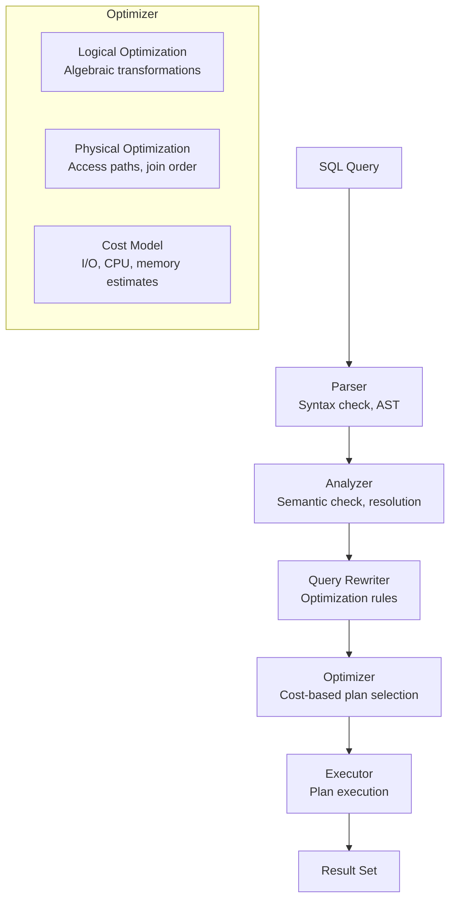
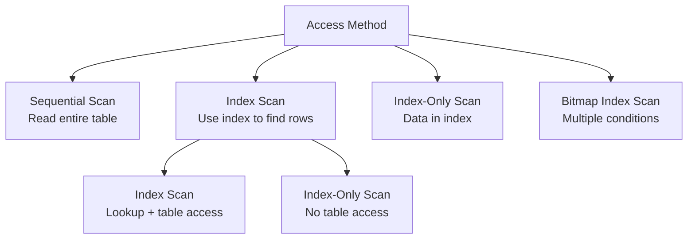
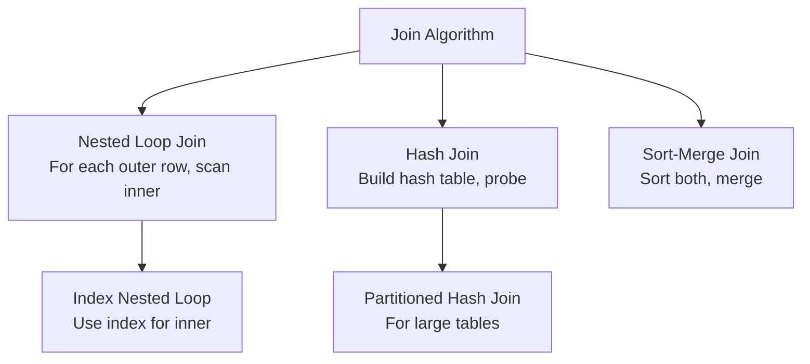

# Query Optimization

## Overview

Query optimization is the process of selecting the most efficient execution plan for a SQL query. The optimizer considers multiple equivalent plans and chooses the one with the lowest estimated cost. Understanding query optimization is crucial for writing efficient SQL and tuning database performance.

## Query Processing Pipeline



## Logical Optimization

### Algebraic Transformations

| Transformation | Before | After |
|---------------|--------|-------|
| **Selection pushdown** | σ(a>5)(R ⋈ S) | σ(a>5)(R) ⋈ S |
| **Projection pushdown** | π(a)(R ⋈ S) | π(a)(R) ⋈ π(a)(S) |
| **Predicate rewriting** | a>5 AND a>3 | a>5 |
| **Join reordering** | (R ⋈ S) ⋈ T | R ⋈ (S ⋈ T) |
| **Subquery flattening** | WHERE x IN (SELECT...) | JOIN |

### Example: Selection Pushdown

```sql
-- Before optimization
SELECT e.name, d.department_name
FROM employees e
JOIN departments d ON e.dept_id = d.id
WHERE e.salary > 100000;

-- Optimized: push filter before join
SELECT e.name, d.department_name
FROM (SELECT * FROM employees WHERE salary > 100000) e
JOIN departments d ON e.dept_id = d.id;
```

## Physical Optimization

### Access Methods



| Access Method | When to Use | Cost |
|---------------|-------------|------|
| **Sequential Scan** | Small tables, no useful index, high selectivity | O(n) |
| **Index Scan** | Selective predicates, index exists | O(log n + k) |
| **Index-Only Scan** | All columns in index | O(log n) |
| **Bitmap Index Scan** | Multiple OR conditions | O(n) |

### Join Algorithms



| Algorithm | Best For | Worst Case | Memory |
|-----------|----------|------------|--------|
| **Nested Loop** | Small outer, indexed inner | O(n×m) | O(1) |
| **Hash Join** | Equi-joins, large tables | O(n+m) | O(n) |
| **Sort-Merge** | Pre-sorted data, range joins | O(n log n + m log m) | O(n+m) |

### Nested Loop Join

```python
# Simple nested loop
for row_r in R:
    for row_s in S:
        if row_r.id == row_s.r_id:
            emit(row_r, row_s)

# Index nested loop (much faster)
for row_r in R:
    index_lookup(S, r_id=row_r.id)  # O(log n) instead of O(n)
    for matching_row in results:
        emit(row_r, matching_row)
```

### Hash Join

```python
# Build phase: build hash table on smaller relation
hash_table = {}
for row in smaller_relation:
    key = row.join_key
    hash_table.setdefault(key, []).append(row)

# Probe phase: probe with larger relation
for row in larger_relation:
    key = row.join_key
    if key in hash_table:
        for matching in hash_table[key]:
            emit(row, matching)
```

### Sort-Merge Join

```python
# Both relations must be sorted on join key
R_sorted = sort(R, key=join_key)
S_sorted = sort(S, key=join_key)

# Merge phase
i, j = 0, 0
while i < len(R_sorted) and j < len(S_sorted):
    if R_sorted[i].key == S_sorted[j].key:
        # Emit all matching pairs
        emit(R_sorted[i], S_sorted[j])
        j += 1
    elif R_sorted[i].key < S_sorted[j].key:
        i += 1
    else:
        j += 1
```

## Join Order Optimization

### Why Join Order Matters

```sql
-- Tables: R (1M rows), S (100 rows), T (10K rows)
-- Join: R ⋈ S ⋈ T

-- Bad order: (R ⋈ S) ⋈ T
-- R ⋈ S: 1M × 100 = potentially large intermediate
-- Then join with T

-- Good order: (S ⋈ T) ⋈ R  
-- S ⋈ T: 100 × 10K = 1M max intermediate
-- Then join with R (smaller intermediate)
```

### Dynamic Programming (System R)

```python
# System R optimizer approach
# Level 1: Best plan for each single table
plans[1] = {table: best_access_path(table) for table in tables}

# Level 2: Best plan for each pair of tables
for pair in combinations(tables, 2):
    plans[2][pair] = best_join(plans[1])

# Level k: Best plan for k tables
for k in range(3, len(tables) + 1):
    for subset in combinations(tables, k):
        for partition in partitions(subset):
            plans[k][subset] = min(
                join(plans[len(partition[0])][partition[0]], 
                     plans[len(partition[1])][partition[1]])
            )
```

## Cost Model

### Cost Components

```
Total Cost = I/O Cost + CPU Cost + Memory Cost

I/O Cost = (pages read × random_page_cost) + (sequential_pages × sequential_page_cost)
CPU Cost = (rows processed × cpu_tuple_cost) + (index_entries × cpu_index_tuple_cost)
```

### PostgreSQL Cost Parameters

```sql
-- Default values (can be tuned)
SET random_page_cost = 4.0;      -- Random I/O cost
SET sequential_page_cost = 1.0;  -- Sequential I/O cost
SET cpu_tuple_cost = 0.01;       -- Per-tuple CPU cost
SET cpu_index_tuple_cost = 0.005; -- Per-index-entry CPU cost
```

### Statistics

```sql
-- Table statistics (updated by ANALYZE)
SELECT relname, reltuples, relpages 
FROM pg_class WHERE relname = 'employees';

-- Column statistics
SELECT attname, n_distinct, most_common_vals, histogram_bounds
FROM pg_stats WHERE tablename = 'employees';

-- Update statistics
ANALYZE employees;
```

## Query Plan Analysis

### EXPLAIN in PostgreSQL

```sql
-- Basic plan
EXPLAIN SELECT * FROM employees WHERE salary > 100000;

-- With actual execution stats
EXPLAIN ANALYZE SELECT * FROM employees WHERE salary > 100000;

-- Output:
-- Seq Scan on employees  (cost=0.00..1520.00 rows=5000 width=56)
--   Filter: (salary > 100000)
--   Rows Removed by Filter: 5000
-- Planning Time: 0.100 ms
-- Execution Time: 15.234 ms
```

### Reading EXPLAIN Output

| Metric | Meaning |
|--------|---------|
| **cost** | Estimated cost (startup..total) |
| **rows** | Estimated rows |
| **width** | Average row width (bytes) |
| **actual time** | Real execution time (ms) |
| **loops** | Number of times this node executed |

### Common Plan Nodes

| Node | Description |
|------|-------------|
| **Seq Scan** | Full table scan |
| **Index Scan** | Index lookup + table access |
| **Index Only Scan** | Index lookup only |
| **Bitmap Index Scan** | Bitmap from index, then table |
| **Nested Loop** | For each outer row, scan inner |
| **Hash Join** | Build hash table, probe |
| **Merge Join** | Sort-merge join |
| **Sort** | Sort rows |
| **Aggregate** | GROUP BY aggregation |
| **Hash Aggregate** | Hash-based aggregation |

## Optimization Techniques

### 1. Index Selection

```sql
-- Create index for WHERE clause
CREATE INDEX idx_salary ON employees(salary);

-- Composite index for multi-column queries
CREATE INDEX idx_dept_salary ON employees(department_id, salary);

-- Covering index (includes all needed columns)
CREATE INDEX idx_covering ON employees(department_id) INCLUDE (name, salary);

-- Partial index (PostgreSQL)
CREATE INDEX idx_active ON employees(department_id) WHERE active = true;
```

### 2. Query Rewriting

```sql
-- Slow: NOT IN with NULLs
SELECT * FROM employees WHERE dept_id NOT IN (SELECT id FROM departments);
-- Fast: NOT EXISTS
SELECT * FROM employees e WHERE NOT EXISTS (
    SELECT 1 FROM departments d WHERE d.id = e.dept_id
);

-- Slow: Function on indexed column
SELECT * FROM employees WHERE UPPER(name) = 'SMITH';
-- Fast: Expression index
CREATE INDEX idx_upper_name ON employees(UPPER(name));

-- Slow: OR conditions
SELECT * FROM employees WHERE dept_id = 1 OR dept_id = 2;
-- Fast: IN (optimizer converts to same plan usually)
SELECT * FROM employees WHERE dept_id IN (1, 2);
```

### 3. Join Optimization

```sql
-- Ensure join columns are indexed
CREATE INDEX ON employees(department_id);
CREATE INDEX ON departments(id);

-- Use appropriate join type
-- INNER JOIN: optimizer can reorder
-- OUTER JOIN: limits reordering options
-- CROSS JOIN: avoid if possible
```

### 4. Subquery Optimization

```sql
-- Correlated subquery (slow - executes per row)
SELECT * FROM employees e WHERE salary > (
    SELECT AVG(salary) FROM employees WHERE dept_id = e.dept_id
);

-- Rewritten with window function (fast)
SELECT * FROM (
    SELECT *, AVG(salary) OVER (PARTITION BY dept_id) as avg_salary
    FROM employees
) WHERE salary > avg_salary;
```

## Interview Questions

### Q1: What is a query optimizer?

A component that transforms a SQL query into an efficient execution plan. It considers multiple equivalent plans and chooses the one with the lowest estimated cost based on statistics about the data.

### Q2: How does the optimizer decide join order?

Using dynamic programming (System R algorithm). It considers all possible join orders, estimates the cost of each, and picks the cheapest. Statistics (table sizes, selectivity) are crucial for good estimates.

### Q3: Why is EXPLAIN ANALYZE different from EXPLAIN?

`EXPLAIN` shows estimated costs based on statistics. `EXPLAIN ANALYZE` actually runs the query and shows real execution times. The estimates can be wrong if statistics are outdated.

### Q4: When should you force a specific join order?

Rarely. The optimizer usually makes good choices. Force only when:
- You know the optimizer's estimates are wrong
- Specific plan is consistently better
- After exhausting other options (statistics, indexes)

### Q5: What are the most common query performance issues?

1. Missing indexes on WHERE/JOIN columns
2. Outdated statistics (run ANALYZE)
3. Correlated subqueries
4. SELECT * when only some columns needed
5. Functions on indexed columns
6. Implicit type conversions
7. Large sorts without index support

## Related Topics

- [Indexing](../indexing/) — B-tree, hash indexes
- [Storage Engines](../storage/) — B-tree, LSM-tree
- [Transactions](../transactions/) — Locking, MVCC
- [PostgreSQL Internals](./postgresql.md) — PG-specific internals
