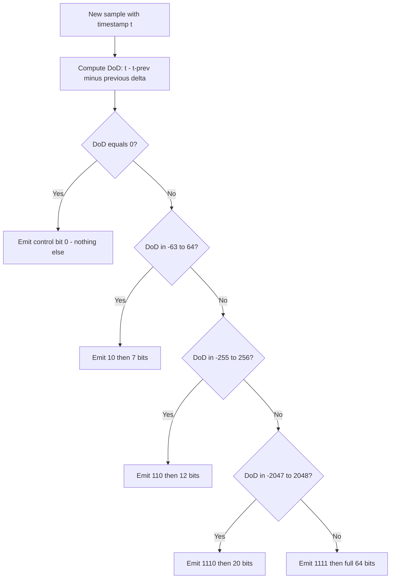

# Time-Series Storage Internals: Encodings and Engine Deep Dives

## Overview

This page is the encoding-and-format layer of the time-series story. [Time-Series Database Internals](../advanced/tsdb-internals.md) covers the engine-level view — ingestion paths, series indexes, cardinality, retention, and the distributed layer — while [Temporal Databases, Streaming & Time-Series](../advanced/temporal-streaming.md) introduces Gorilla compression conceptually. Here we work the math at the bit level: Gorilla's delta-of-delta timestamps and XOR float encoding with a full worked example and the bytes/sample budget, then how each engine stores those bits — InfluxDB TSM compressed columns, TimescaleDB hypertables with columnar compression, VictoriaMetrics merge trees, and the Prometheus TSDB chunk format — and finish with the comparison table and retention/downsampling pipeline mechanics.

## Gorilla: Delta-of-Delta Timestamps

Gorilla (Facebook, PVLDB 2015) stores each time series as a stream of (timestamp, value) pairs and exploits two regularities: timestamps arrive at near-constant intervals, and consecutive values usually differ in only a few mantissa bits. For timestamps, store the **delta of the deltas** (DoD). The first timestamp is written raw in 64 bits; the second stores its delta in 14 bits; from then on each sample writes only the DoD with variable-length control codes (paper Table 3):

| DoD range | Control bits | Payload |
|---|---|---|
| exactly 0 | `0` (1 bit) | none |
| \\( -63 \\le D \\le 64 \\) | `10` | 7 bits |
| \\( -255 \\le D \\le 256 \\) | `110` | 12 bits |
| \\( -2047 \\le D \\le 2048 \\) | `1110` | 20 bits |
| otherwise | `1111` | 64 bits |

A metric scraped every 10 seconds writes DoD = 0 for every sample after the second: **one bit per timestamp**. A single missed scrape costs `10` + 7 bits, and even a dropped-and-resumed pattern stays in the 12-bit bucket — the encoding is forgiving of jitter, which is why it survives production scraping.



## Gorilla: XOR Float Encoding, Worked Bit Example

Values are encoded as the XOR of the current and previous IEEE-754 value. If the XOR is zero (identical value), emit a single `0` bit. Otherwise, let `leading` = number of leading zero bits and `trailing` = number of trailing zero bits in the XOR; the *significant bits* are the middle span. Two control cases:

- `10`: the significant span fits inside the previous sample's span → reuse the previous leading/trailing window and emit only the significant bits.
- `11`: emit 5 bits of leading-zero count, 6 bits of significant-bit length, then the significant bits (a new window).

| Case | Control bits | Payload | When it happens |
|---|---|---|---|
| Value unchanged | `0` (1 bit) | none | Counters between scrapes, gauges at rest |
| Same window | `10` (2 bits) | significant bits only | Small mantissa wiggle, same exponent — the workhorse |
| New window | `11` (2 + 5 + 6 bits) | window description + bits | Exponent change or drift beyond the old span |

The window arithmetic bounds the per-sample cost: a value whose XOR has `l` leading and `t` trailing zero bits needs `32 - l - t` significant bits in the worst case, but the reuse case pays only the significant bits — which for metrics that move a few mantissa bits per scrape is 3-6 bits. Sustained identical values cost 1 bit, which is why idle-looking dashboards compress absurdly well.

Worked example (32-bit floats for readability — Gorilla applies the identical scheme to 64-bit doubles):

```text
v0 = 25.5   = 0x41CC0000   -> stored raw, 32 bits
v1 = 25.75  = 0x41CE0000
  XOR v1^v0 = 0x00020000  -> highest set bit 17, lowest set bit 17
  leading zeros = 14, trailing zeros = 17, significant bits = 1
  emit: 10  1                        (2 + 1 = 3 bits, window now [14,17])
v2 = 26.5   = 0x41D40000
  XOR v2^v1 = 0x001A0000  -> highest set bit 20, lowest set bit 17
  leading = 11, trailing = 17, significant = 4  (span 20..17)
  the span is wider than the reused window's leading bound (11 < 14)
  emit: 11  01011  000100  1010      (2 + 5 + 6 + 4 = 16 bits, new window)
v3 = 26.5
  XOR = 0                            emit: 0                (1 bit)
```

Count the stream: 32 + 3 + 16 + 1 bits of value data replaced three full 32-bit words with 52 bits — and in a real scrape series most samples hit the `0` or `10` cases, which is where the compression comes from. The same arithmetic on timestamps: a steady 10-second scrape spends 64 + 14 + (1 bit × N) on timestamps for N samples.

## The 1.37 Bytes/Sample Budget

The Gorilla paper's headline number: production monitoring data compresses from 16 bytes per point (8-byte timestamp + 8-byte float64) to **1.37 bytes/point — a 12× reduction** (secondary sources often quote this rounded as ~1.3 bytes). The budget decomposes plausibly: timestamps contribute ~1-2 bits/sample for steady scrapes; values contribute ~6-16 bits depending on volatility. Two structural preconditions matter more than the codec itself: **per-series contiguity** (compress each series' stream separately — XOR across unrelated series is noise) and **time ordering** (deltas are only small if the stream is ordered). This is why every engine below compresses inside immutable per-series blocks rather than compressing a row store, and why out-of-order ingestion is a storage problem, not just a correctness problem: late samples can miss their block or force re-compression at worse ratios. Practical capacity planning uses 1.5-2 bytes/sample for steady metrics, plus 10-30% overhead for chunk headers and the series index.

## InfluxDB TSM: Compressed Columns per Series

InfluxDB v1's Time-Structured Merge (TSM) engine — ingestion path cross-linked in [tsdb-internals](../advanced/tsdb-internals.md) — lands points in immutable TSM files organized as a sequence of **compressed blocks per (series key, field)**: each block is one field's time-ordered column for one series, which is exactly the contiguity Gorilla needs. The documented block encodings: timestamps use RLE, simple8b, scaled-delta, or Gorilla-style delta encoding chosen per block; float values use Gorilla XOR or RLE; integers use simple8b/zigzag variants; booleans are bit-packed; strings and blobs get zlib. The block index stores the minimum and maximum timestamp per block so time-predicate queries binary-search directly to blocks — the "fence pointer" idea from LSM engines applied to time. TSM compaction re-blocks small files into larger ones, re-choosing encodings per block, which is why steady-state compression improves as a shard ages.

```text
TSM file anatomy:
  [ Block 0 ][ Block 1 ][ ... ][ Block N ][ index: per-block min/max ts,
                                            offsets, block sizes ][ footer ]
  Block i = one (series key, field) column over a time slice:
    timestamps: RLE | simple8b | scaled-delta | Gorilla-style  (chosen per block)
    values:     Gorilla XOR (floats) | RLE | simple8b (ints) | zlib (strings)
  Shard = one time range; TSM files live inside a shard; compaction is shard-local
```

## TimescaleDB: Hypertables on Native PostgreSQL

TimescaleDB keeps full PostgreSQL — rows, transactions, joins, extensions — and adds **hypertables**: a logical table transparently partitioned into **chunks**, each an ordinary PostgreSQL table over a time interval (with optional space partitioning on a second key). Chunks are wired through the extension's catalogs and CHECK-constraint-based exclusion (the planner hooks supersede old table-inheritance setups), so vanilla tooling — pg_dump, logical replication, row-level security — works per chunk, and time-predicate queries prune to the relevant chunks exactly like a native TSDB prunes blocks. Chunk sizing is the one knob that matters operationally: the documented guidance targets chunks small enough that most queries touch only a few (default 7 days for timestamp columns, adaptive sizing steers toward ~25% of memory per chunk); too-large chunks slow deletes and re-compression, too-small chunks bloat planning and per-chunk indexes.

Compression is where the TSDB hides inside Postgres: after a configurable delay, a chunk is converted from row layout to **columnar batches segmented by a device/entity id and ordered by time descending**, then each column is encoded — delta-delta for timestamps, Gorilla for floats, simple-8b/RLE for integers, dictionary for low-cardinality text. Because batches are per-series within a chunk, the Gorilla preconditions hold even on a heap-storage engine; Timescale reports ~90-95%+ storage reduction on typical metrics workloads. The design consequence: compressed chunks are read-only until explicitly decompressed (DDL and updates on old chunks pay a decompress-recompress cycle), which is the price of columnar ratios inside a row store.

```sql
-- Hypertable + compression policy (TimescaleDB)
SELECT create_hypertable('metrics', by_range('time', INTERVAL '1 day'));

ALTER TABLE metrics SET (
  timescaledb.compress,
  timescaledb.compress_segmentby = 'device_id',   -- per-series batches
  timescaledb.compress_orderby   = 'time DESC'
);

SELECT add_compression_policy('metrics', INTERVAL '7 days');   -- age to compress
SELECT add_retention_policy('metrics',   INTERVAL '400 days'); -- age to drop
```

The snippet encodes the whole lifecycle in four statements: chunks are born as ordinary row tables, become columnar at 7 days, and disappear at 400 days — each policy enforced chunk-granularly, which is why retention is exact and cheap (drop the chunk directory) rather than row-wise DELETE. Note the segment-by choice is the cardinality decision: segmenting by a high-cardinality id preserves per-series contiguity (good ratios), while omitting it compresses the chunk as one blob (worse ratios, smaller batches).

## VictoriaMetrics: Merge Trees with the Index Fused In

VictoriaMetrics (a Prometheus-compatible, high-cardinality TSDB) stores data in **LSM-style parts** — its "merge trees": in-memory buffers flush to immutable parts where rows are sorted by (metric name + labelset, timestamp), and background merges compact small parts into larger ones like size-tiered LSM compaction. Two choices differentiate it. First, per-series data blocks use Gorilla-family encoding (delta timestamps, XOR-style values) inside parts, with retention enforced by dropping whole parts older than the retention filter — cheap and exact. Second, the **inverted index is itself stored as merge-tree parts** rather than a separate hash-map structure: postings for label pairs are merged alongside data, avoiding the index-to-data lookup round trip and letting index memory stay flat as cardinality grows — the same anti-OOM move as InfluxDB's TSI, documented at a high level in [tsdb-internals](../advanced/tsdb-internals.md). The cluster version shards by metric name hash and replicates with eventual consistency, tolerating duplicate samples at read time by deduplication — an availability-first stance in the Gorilla tradition.

## Prometheus TSDB: Head Block, WAL, mmap Chunks

Prometheus's local TSDB is covered from the engine angle in [tsdb-internals](../advanced/tsdb-internals.md); the encoding-relevant facts: the **head block** holds recent samples in in-memory chunks of a target ~**120 samples per chunk**, each chunk framed by a 2-byte header (3-bit encoding tag + 13-bit sample count) followed by delta-of-delta timestamps and XOR floats — Gorilla's codec, essentially verbatim. Completed head chunks spill to **memory-mapped chunk files** (128-chunk segments) so a crash replays only the WAL tail, and every ~2 hours the head is cut into an immutable **block** (chunks + postings index + tombstones) that later compactions merge. Because chunks are 120 samples, steady 15-second scrapes produce a new chunk every 30 minutes: the codec operates at 2-hour granularity of immutability while answering instant queries from the head. The chunk format design doc (referenced below) is the cleanest real-world spec of Gorilla encoding outside the paper.

```text
Prometheus chunk: | 2-byte header: 3-bit encoding flag, 13-bit sample count |
                  | DoD-coded timestamps | XOR-coded values |   (~120 samples)
Head: in-RAM chunks -> m-mapped head chunk file every 128 chunks -> WAL tail replay
Block (2h): chunks + index (postings per label, symbols) + meta.json + tombstones
```

## Retention and Downsampling Pipelines

The policy mechanics — shard-granular retention in InfluxDB, block-granular drops plus tombstones in Prometheus, part-level filters in VictoriaMetrics, tiered downsampling via Thanos-style compactors — are compared in [tsdb-internals](../advanced/tsdb-internals.md); the internals-level addition is *what compression does to the pipeline*. Rollup tiers are written as **new series** (avg/min/max per bucket), so they compress at their own effective sample rates and cost roughly `aggregates × retention` relative to raw data — a 1m rollup storing count+sum costs 2/3 of what avg/min/max costs while answering most dashboard queries. Downsampling therefore changes the storage math by changing the *entropy* fed to the codec: a 5-minute rollup of a counter's sum is nearly constant, so its timestamp DoD is 0 and its values hit the `0` (unchanged) bit — rollups compress better per sample than raw data, which softens but does not remove the retention multiplication. Plan storage as `raw_samples × bytes/sample × raw_retention + Σ(rollup_tier × bytes × retention)`, not as a single ratio.

## Out-of-Order Data and Tombstones

Every design above assumes append-mostly ordered ingestion, and production violates that assumption constantly: late-arriving scrapes, clock skew, backfills. Engines diverge exactly where order breaks. **Prometheus** accepts out-of-order samples into the head within a configurable window (`out_of_order_time_window`), writes them into per-chunk out-of-order appenders, and records **tombstones** for deletions that queries subtract at read time until compaction materializes them. **InfluxDB** historically rejected or partially-dropped out-of-order points beyond a shard's boundary — a shard is a time range, so a late point lands in a closed shard and needs a rewrite path. **VictoriaMetrics** accepts historical data by routing it into parts covering the right time range and deduplicates identical (series, timestamp, value) tuples during merges. **TimescaleDB** simply uses Postgres UPDATE/DELETE semantics — the most flexible and the most expensive, since it reopens the row-store costs the TSDB encoding exists to avoid.

The tombstone contract is the LSM contract restated for time: deletion is metadata (cheap, immediate), physical reclamation is compaction (deferred, batched). The operational consequence to name in interviews is **query-time tombstone tax**: a block with tombstoned intervals is read and filtered until its compaction, so mass deletions (a rogue tag, a decommissioned fleet) degrade read latency exactly as dead tuples degrade Postgres scans — and the remediation is the same shape: force a compaction, or let retention drop whole blocks/shards.

## Engine Comparison

| Dimension | InfluxDB (TSM) | TimescaleDB | VictoriaMetrics | Prometheus TSDB | Gorilla (reference) |
|---|---|---|---|---|---|
| Storage layout | Per-shard TSM files, blocks per series+field | Postgres chunks → columnar compressed batches | Merge-tree parts, (series, time)-sorted | 2h immutable blocks of 120-sample chunks | In-memory, per-series streams |
| Timestamp codec | RLE / simple8b / delta / Gorilla-style | Delta-delta | Delta / Gorilla-family | Delta-of-delta | Delta-of-delta |
| Value codec | Gorilla XOR, RLE, simple8b, zlib | Gorilla, simple-8b/RLE, dictionary | XOR-family | XOR | XOR + control bits |
| Index | Inverted (hash) or TSI on-disk | Postgres B-trees per chunk + zone maps | Inverted index stored in merge-tree parts | Postings per block | N/A (in-memory maps) |
| Write path | WAL + cache + snapshot to TSM | Normal Postgres heap insert; later compression | In-memory parts → flush → merge | WAL + head chunks → block | Memory + disk-backed WAL |
| SQL | InfluxQL / Flux (SQL-like) | Full PostgreSQL SQL | MetricsQL (PromQL superset) | PromQL | Internal (MQL) |
| Best-fit | General metrics, self-contained | Relational + time-series in one DB | Very high cardinality, cost-sensitive | Monitoring/alerting, single-node locality | Hyperscale in-memory monitoring |

## Common Pitfalls

1. **Quoting Gorilla's ratio without the preconditions.** The 1.37 bytes/sample result assumes per-series, time-ordered streams of well-behaved metrics; a workload with 30-second scrapes, jittery clocks, and high-entropy values can land at 4-6 bytes/point. Capacity-plan from your own sample data, not the paper's.

2. **Letting chunk intervals drift from query patterns.** Chunk/block sizing exists so time-predicate queries touch few files; a 1-day chunk interval on 5-year retention creates ~1,800 chunks per hypertable and planning/index overhead to match. Size chunks so typical dashboard windows (1-24h) touch single-digit chunks.

3. **Adding high-cardinality tags "just for now."** The product rule means one tag key with 10,000 distinct values multiplies series count by 10,000 — and every engine here pays it in index memory or part count. Bucket or hash the tag before ingestion, not in the query.

4. **Treating compressed TimescaleDB chunks as normal tables.** DDL, UPDATE, and DELETE on compressed chunks decompress them (or fail outright in older versions); ETL jobs that "just fix" old rows can silently undo 90% of your compression. Route corrections through decompress-modify-recompress explicitly.

5. **Downsampling into cardinality.** Rollup series are series: a 1m rollup that preserves the original tag set doubles series count while halving sample rate — the storage win is smaller than it looks, and the index cost is larger. Aggregate the tag dimension down at the same time you aggregate time.

6. **Ignoring WAL/buffer sizing at ingestion peaks.** All these engines fsync a WAL before acking (Prometheus, InfluxDB) or rely on heap durability (TimescaleDB); a scrape spike that outruns the WAL disk stalls ingestion cluster-wide. Monitor WAL latency, not just flush/snapshot latency.

## Interview Questions

1. **Walk through Gorilla's encoding for a steady scrape and derive the bytes/sample.** First timestamp raw (8 B), second delta in 14 bits; after that a constant interval gives DoD = 0, which is a single `0` bit — timestamps cost ~1 bit/sample. Values that differ slightly emit `10` + a few significant bits, or a single `0` bit when unchanged. A typical steady metric lands near 8-14 bits/sample total, and Facebook reported 1.37 bytes/sample production-wide — 12× below the 16-byte raw pair. The enabler is per-series, time-ordered contiguity, which is why engines compress immutable per-series blocks.

2. **Why does XOR float encoding win on time series when generic compression fails?** Consecutive samples of a metric share sign, exponent, and most mantissa bits, so the XOR is concentrated in a few middle bits; encoding just the leading-zero/trailing-zero window plus the significant span captures the change in a handful of bits. Generic codecs like gzip must re-learn byte-level patterns per block and do not exploit IEEE-754 structure or the pairwise-delta property. The `10` control bit (reuse previous window) is the workhorse: it turns small mantissa wiggles into 3-6 bits.

3. **How does TimescaleDB get TSDB-grade compression out of a row-store engine?** It converts aged chunks from row layout into columnar batches segmented by entity and ordered by time, then applies delta-delta timestamps, Gorilla floats, and simple-8b/dictionary per column — restoring the per-series contiguity Gorilla requires. Chunks remain ordinary Postgres tables, so queries, joins, and tooling are unchanged; the costs are read-only compressed chunks (decompress to modify) and a decompress-recompress cycle for DDL on old data. Reported reductions are ~90-95%+ on typical metrics.

4. **What problem does VictoriaMetrics solve by storing the inverted index in merge-tree parts?** Classic TSDBs keep tag-to-postings indexes in RAM (per shard), so memory grows with cardinality until OOM — the cardinality cliff manifests first as ingestion failure, not slow queries. Storing postings as LSM-style parts merged like data keeps index memory flat, at the cost of more disk and slightly slower matcher resolution. It is the same move as InfluxDB TSI and mirrors how LSM engines treat bloom filters as data.

5. **Prometheus cuts a 2-hour block every 2 hours — why chunks of ~120 samples inside that?** The chunk is the codec's unit: 2-byte header + DoD/XOR stream, sized so a chunk header and index entry amortize over enough samples to keep the encoded stream dense, while remaining small enough that instant queries read only the tail chunk per series. Completing chunks are m-mapped early so crash recovery replays only the WAL tail, and blocks make older data immutable and compactable. Chunk size trades per-chunk overhead against re-read cost when querying partial ranges.

6. **Design a retention + downsampling policy for 1M active series and justify the storage.** Raw 15s data: 1M series × 5,760 samples/day × ~1.5 B ≈ 8.3 GB/day; keeping 15 days is ~125 GB. A 1m count+sum rollup kept 90 days costs 1M × 1,440 × 2 × 1.5 B × 90 ≈ 389 GB, and a 5m tier kept 400 days ≈ 350 GB — rollup tiers dominate, so derive averages from count+sum rather than storing avg/min/max, and bucket high-cardinality tags *before* writing rollups because rollup series are series too (the product rule applies).

## Key Takeaways

- Gorilla = delta-of-delta timestamps (5 control codes, `0` = 1 bit for steady scrapes) + XOR floats (reuse-window `10` case is the workhorse); the paper reports 1.37 bytes/sample, 12× below the raw 16-byte pair.
- Compression works because of per-series, time-ordered contiguity — engines compress immutable per-series blocks, and out-of-order data is a storage-ratio problem as well as a correctness problem.
- InfluxDB TSM: per-(series, field) compressed blocks inside shard-local TSM files, min/max block index for time pruning, encoding re-chosen during compaction.
- TimescaleDB: hypertable chunks are plain Postgres tables with CHECK-constraint pruning; aging chunks convert to columnar batches (delta-delta/Gorilla/simple-8b/dictionary) for ~90-95%+ reduction at the cost of read-only chunks.
- VictoriaMetrics: LSM-style merge trees for both data and inverted index — index memory stays flat as cardinality grows; retention drops whole parts.
- Prometheus TSDB: head block + WAL + m-mapped head chunks (crash-tail replay) + 2h immutable blocks; chunks are ~120 samples of Gorilla-coded data with a 2-byte header.
- Downsampling writes new series that compress better per sample than raw data, but rollup tiers dominate total storage — model retention per tier and store count+sum instead of avg/min/max where possible.

## References

1. Pelkonen, T. et al., "Gorilla: A Fast, Scalable, In-Memory Time Series Database," PVLDB 8(12):1816-1827, 2015. <https://www.vldb.org/pvldb/vol8/p1816-pelkonen.pdf>
2. InfluxData, "InfluxDB Storage Engine" (TSM: WAL, cache, compressed blocks, compactor): <https://docs.influxdata.com/influxdb/v1/concepts/storage_engine/>
3. TimescaleDB documentation — hypertables and compression: <https://docs.timescale.com/>; source: <https://github.com/timescale/timescaledb>
4. VictoriaMetrics documentation — architecture and storage design: <https://docs.victoriametrics.com/>
5. Prometheus, "Storage" (head, blocks, WAL, compaction, retention): <https://prometheus.io/docs/prometheus/latest/storage/>
6. Prometheus TSDB on-disk chunk format design doc (2-byte header, XOR chunks): <https://github.com/prometheus/prometheus/blob/main/tsdb/docs/format/chunks.md>
7. Prometheus TSDB head chunks format design doc: <https://github.com/prometheus/prometheus/blob/main/tsdb/docs/format/head_chunks.md>

## Cross-References

- [Time-Series Database Internals](../advanced/tsdb-internals.md) — the engine-level companion: ingestion, series indexes, cardinality, Monarch.
- [Temporal Databases, Streaming & Time-Series](../advanced/temporal-streaming.md) — the data-model and stream-processing context, plus the conceptual Gorilla intro.
- [Metrics Cardinality](../../sre/metrics-cardinality.md) — the operational playbook for the cardinality product rule these engines must survive.
- [Compaction](./compaction.md) — the LSM compaction mechanics TSM and merge-tree compaction inherit.
- [Prometheus + Grafana](../../linux/observability/prometheus-grafana.md) — operating the monitoring stack whose storage this page dissects.
