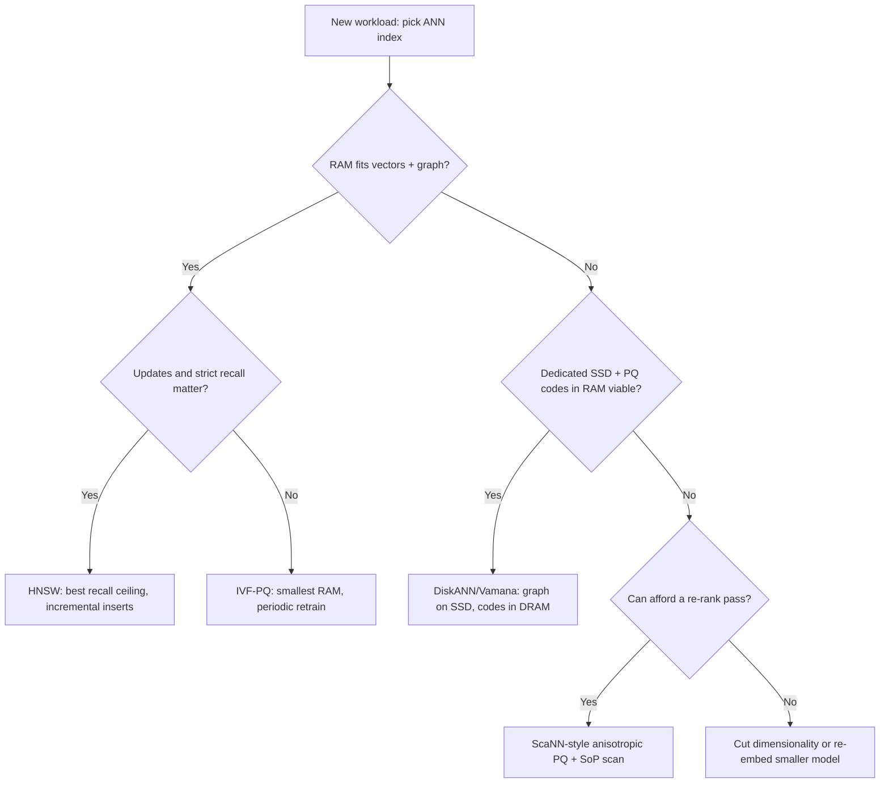

# Approximate Nearest Neighbor Index Internals

## Overview

This page goes inside the four ANN index families that dominate production vector search: IVF (inverted file with probing), IVF-PQ (with product quantization math), HNSW (hierarchical graphs), DiskANN/Vamana (SSD-resident graphs), and ScaNN (anisotropic quantization). The survey-level comparison of these algorithms, and the vector database products that ship them, live in [Vector Databases](../advanced/vector-databases.md); here we derive the knobs — `nlist`, `nprobe`, `M`, `ef_construction`, `alpha` — from their mechanics, work the quantization math at the bit level, and formalize the recall/QPS/memory trade-off interviewers probe. For the "how do I use it in Postgres" angle see [PGVector](../../llm/advanced/pgvector.md), and for GPU/billion-scale library practice see [FAISS](../../llm/advanced/faiss.md).

## The Recall / QPS / Memory Budget

Every ANN index sells the same three commodities. **Recall@k** is the fraction of the true k nearest neighbors a query returns:

\\[ \\mathrm{recall@k} = \\frac{|\\mathrm{ANN}_k(q) \\cap \\mathrm{exact}_k(q)|}{k} \\]

**QPS** (queries per second per core) is dominated by two costs: the number of distance computations per query and the number of random memory/SSD accesses. **Memory** is bytes per vector stored in RAM (graphs, codes, centroids) — at 100M vectors with d=768 float32, raw data alone is ~300 GB, which is why compression and disk-resident designs exist. Exact k-NN costs \\( O(n \\cdot d) \\) distance work per query; ANN indexes cut this to tens-to-thousands of distance evaluations plus \\( O(\\log n) \\)-ish hops. The interview-grade insight: an index choice is a point on a three-axis frontier, and every knob below moves you along exactly one axis while paying on the others.

| Cost component | IVF family | HNSW | DiskANN | ScaNN |
|---|---|---|---|---|
| Distance computations/query | \\( (n/n_{list}) \\cdot n_{probe} \\cdot d \\) | \\( \\approx ef_{search} \\cdot M \\) | \\( L \\cdot R \\) (PQ-approximated) | \\( (n/n_{list}) \\cdot n_{probe} \\cdot m \\) (SoP) |
| Random accesses/query | \\( n_{probe} \\) posting lists | \\( \\approx ef_{search} \\) graph hops | \\( L \\cdot R \\) SSD pages | \\( n_{probe} \\) posting lists |
| RAM per vector | 4·d B (flat) or m B (PQ) | 4·d + ~2M·4 B | m B (codes only) | 4·d B or m B |
| Dominant failure mode | Voronoi boundary misses | Entanglement / hub edges | PQ approximation error | Quantization error on parallel component |

## IVF: Inverted File Indexes and Probing Math

### Coarse quantizer and posting lists

IVF (Jégou et al., 2011) runs k-means over the corpus to get `nlist` centroids \\( c_1..c_{nlist} \\), then stores each vector \\( x \\) in the posting list of its nearest centroid. A query scores all centroids (cost \\( n_{list} \\cdot d \\)), picks the `nprobe` closest, and brute-force scans only those lists. With uniformly sized clusters the scanned fraction is \\( n_{probe}/n_{list} \\): for n=1M, nlist=4096, nprobe=32 that is ~7.8K vectors — 0.8% of the corpus — per query. The standard sizing rule from the FAISS wiki is \\( nlist \\approx \\sqrt{n} \\) up to \\( 16\\sqrt{n} \\), which balances coarse-quantizer cost against posting-list scan cost; both grow, in opposite directions, with nlist.

### Why recall collapses on Voronoi boundaries

The recall model is a Voronoi-boundary problem: the true nearest neighbor \\( x^* \\) is returned iff its centroid \\( c(x^*) \\) is among the query's top-`nprobe` centroids. If \\( x^* \\) sits near the boundary between two cells, its centroid can rank below `nprobe` other centroids even when \\( x^* \\) itself is closest to q. The miss probability is governed by \\( dist(q, c(x^*)) - dist(q, c_1(q)) \\): queries far from any boundary miss nothing, queries on boundaries need several extra probes. This is why IVF recall curves are convex in nprobe — probing 2× more cells more than doubles effective recall once you cover boundary cases. Representative SIFT-1M behavior: nprobe=1 lands around 0.4-0.5 recall@10 at ~0.02% scanned; nprobe=16 crosses ~0.9; nprobe=64 reaches ~0.98+ — and the recall-per-IOPS optimum is the knee, not the flat top.

```mermaid
flowchart LR
    Q["Query vector q - d=128 float32"] --> CQ["Score all nlist centroids - exact distance"]
    CQ --> NP["Keep top nprobe centroids"]
    NP --> LUT["Build PQ lookup table m x 256 partial distances"]
    LUT --> SCAN["Scan posting lists - one lookup + add per code"]
    SCAN --> TOPK["Keep top-k-prime approximate candidates"]
    TOPK --> REF["Re-rank candidates with full-precision vectors"]
    REF --> OUT["Return top-k"]
```



### Residual encoding and the coarse-quantizer tax

Two production refinements matter. First, **residual encoding**: store \\( x - c(x) \\) instead of \\( x \\) in each posting list; residuals are centered at zero with smaller dynamic range, which improves both quantization error and compression of the residual codes. Second, the **coarse quantizer tax**: scoring nlist centroids costs \\( nlist \\cdot d \\) FLOPs per query — with nlist=4096, d=128 that is ~524K operations, comparable to scanning 4K full vectors. At billion scale this is why the coarse quantizer itself is quantized (PQ-compressed centroids) or trained hierarchically (two-level IVF), and why nlist cannot be raised for free.

## Product Quantization Math

### Splitting, subquantizers, codes

PQ compresses a d-dimensional vector by splitting it into m contiguous subvectors of \\( d^* = d/m \\) dimensions each, and training an independent k-means codebook per subspace with \\( k^* = 256 \\) centroids (one byte per code). A vector becomes m bytes: subquantizer j emits the index of the nearest centroid in subspace j. The product codebook implicitly enumerates \\( (k^*)^m = 256^m \\) composite centroids without ever materializing them — with m=16 that is \\( 2^{128} \\) reachable points, which is how m bytes approximate any d-dimensional vector. Storage per vector drops from \\( 4d \\) bytes to m bytes: d=128, m=16 is 512 → 16 bytes, a **32× compression**.

### Asymmetric distance computation (ADC)

Query-side distance estimation uses a lookup table, not codebook reconstruction. Once per query, compute \\( T[j][c] = \\lVert q_j - c_{j,c} \\rVert^2 \\) for each subquantizer j and centroid c — a cost of \\( m \\cdot 256 \\cdot d^* = 256 \\cdot d \\) operations, independent of corpus size. For d=128 the table is 16×256 float32 ≈ 16 KB, cache-resident. Each candidate's approximated distance is then m table lookups plus m additions instead of d multiply-accumulates — ~8× fewer FLOPs and, more importantly, the codes it reads are 32× smaller, so the scan is memory-bandwidth-bound on 16-byte codes rather than 512-byte vectors. The reconstruction-free design also means quantized distance is exact w.r.t. the reconstructed centroid: the error is purely quantization error \\( \\lVert x - c(x) \\rVert^2 \\), bounded roughly by the per-subspace k-means error summed over m subspaces.

### Where the error lives, and OPQ

Quantization error concentrates in subspaces with high variance, and independent axis-aligned splits can be unlucky: correlated dimensions (embeddings from any real model are strongly correlated) waste codebooks on redundant axes. **Optimized PQ (OPQ)** learns a rotation matrix R applied before splitting, solving \\( \\min_R \\sum_x \\lVert x - c(Rx) \\rVert^2 \\) by alternating between PQ assignment and a Procrustes alignment of R — typically cutting recall loss noticeably at the same m. The interview takeaway: PQ error is a design variable you buy down with (a) more bytes m, (b) rotation (OPQ), or (c) re-ranking a candidate pool with exact distances (the two-stage pattern in the diagram above).

### Encoding a Vector, End to End

```text
x = float32[128]                      512 B raw
split: m=16 subvectors of 8 dims
for j in 0..15:
    code[j] = argmin_c || x_j - codebook_j[c] ||^2     (256 centroids each)
stored: uint8[16]  = 16 B                (32x compression)
residual trick (IVF): store x - c_coarse(x) before splitting -> smaller ranges
query: build T[16][256] once (~98 KB, ~4K FLOPs... 256*128 mult-adds)
       score(code) = sum_j T[j][code[j]]                 (16 lookups + adds)
```

Two details interviewers chase: the per-query table build is \\( O(256 \\cdot d) \\) — independent of corpus size — and the scan loop is branch-free table lookups, which is why PQ scanners saturate memory bandwidth rather than ALUs. The residual trick also explains why IVF-PQ chains the two quantizers: coarse centroids remove the mean, so per-subspace codebooks spend their 256 centroids on *within-cluster* variance instead of re-encoding global position.

## HNSW Internals

### Layers and level assignment

HNSW (Malkov & Yashunin, 2018) is a skip-list over proximity graphs. Every node exists on layer 0; a node additionally appears on layers up to a level sampled at insert:

\\[ l = \\lfloor -\\ln(U(0,1)) \\cdot m_L \\rfloor, \\qquad m_L = 1/\\ln(M) \\]

With M=16 this gives P(level ≥ 1) ≈ 1/16, P(≥ 2) ≈ 1/256, so the expected number of layers is \\( 1 + 1/(M-1) \\) and the layer count scales as \\( O(\\log_M n) \\). Upper layers hold few nodes with long-range edges (expressways); layer 0 holds all nodes with short-range edges (local streets). A query greedily descends from the top layer with a 1-wide beam, then switches to a beam of width `ef_search` on layer 0 — the descent contributes \\( O(\\log n) \\) hops, the beam contributes the bulk of distance computations.

For a 1M-point corpus at M=16 the arithmetic is concrete: about 62,500 nodes appear on layer 1, ~3,900 on layer 2, ~244 on layer 3, and the top layer holds a handful of nodes — so greedy descent crosses the corpus in a few dozen hops before the layer-0 beam takes over. The exponential decay is why insertion cost grows only logarithmically: the expected number of layers an insert touches is small and constant-bounded.

### Heuristic neighbor selection

The counterintuitive core of HNSW is that neighbors are **not** simply the M closest nodes. The selection heuristic keeps a candidate e only if it is closer to the base point q than to every already-selected neighbor r:

\\[ dist(e, q) < dist(e, r) \\quad \\forall r \\in \\text{selected} \\]

A node that is deep inside the "shadow" of an already-selected neighbor gets pruned, even if it ranks among the M closest. This diversification keeps edges that point in genuinely different directions — without it, dense regions accumulate redundant short edges, the graph develops hubs, and long-range navigability collapses (the failure the paper's earlier NSW suffered). Pruned candidates are not discarded outright: `keepPrunedConnections` backfills remaining slots with the nearest pruned candidates so the graph maintains degree in sparse regions. Layer 0 allows degree \\( M_{max0} = 2M \\); upper layers cap at M.

### Insertion and search mechanics

Insertion samples the node's level, greedy-descends from the entry point to that level (ef=1), then for each layer from the sampled level down to 0 runs a beam search with `ef_construction` candidates, selects M neighbors via the heuristic, and installs bidirectional edges — shrinking any neighbor list that exceeds its cap using the same heuristic. Build cost is \\( O(n \\log n \\cdot M \\cdot d) \\)-ish and `ef_construction` (typical 100-500) is the graph-quality dial. Search descends greedily, then on layer 0 maintains a min-heap of `ef_search` best-so-far candidates, expanding the closest unexpanded node until the heap's nearest candidate is farther than the heap's k-th best — the standard best-first termination. Memory per node at M=16 is ~2M·4 B = 128 B of edges (4-byte ids) plus the vector: 640 B/node at d=128 float32, i.e. ~640 MB for 1M vectors before any payload.

Three cost identities summarize the whole index and are worth reproducing on a whiteboard: distance computations per query ≈ `ef_search × M` (each beam expansion scores M neighbors), visited-node count is bounded by `ef_search` expansions, and recall saturates once `ef_search ≈ 10-20 × k` — beyond that, extra beam width buys almost nothing because the graph's diameter, not the beam, is the limiting factor. Those identities are exactly why `ef_search` dominates HNSW latency and `M` dominates memory, and why the two knobs can be tuned independently per SLA.



## DiskANN / Vamana: SSD-Resident Graphs

### Layout: codes in DRAM, graph and vectors on SSD

In-memory graphs fail economically at billion scale: 1B × 640 B ≈ 640 GB of RAM. DiskANN (Jayaram Subramanya et al., NeurIPS 2019) splits the index across one server's DRAM and NVMe SSD. DRAM holds only the **PQ-compressed code** per vector (64 B/code for the paper's 1B-point builds → ~64 GB). The SSD holds the **Vamana graph** — a single-layer proximity graph with degree bound R (32-70 in the paper; R=64 at 1B scale) — packed as adjacency lists (~R×4 B per node) plus the full-precision vectors (~4d B per node). For d=128 that is ~768 B per node on SSD, roughly 0.77 TB at 1B points. A query beam-searches the graph using PQ-code distances (no SSD reads) to decide *which* neighbors to expand, and issues 4 KB SSD reads only for nodes it actually visits — the paper reports single-digit-millisecond p99 at thousands of QPS per node, and the design ships in Azure AI Search.

### Alpha pruning: buying long-range edges

Vamana's degree bound interacts with recall through its pruning rule. When selecting neighbors for node p, a candidate e is dropped from consideration if its distance from p is at least \\( 1/\\alpha \\) times the distance of an already-selected neighbor — equivalently, with \\( \\alpha = 1 \\) the rule removes any candidate "covered" by a closer selected neighbor, producing a compact, short-range-only graph whose diameter (and thus SSD hop count) is too large for good recall at bounded degree. Building with \\( \\alpha > 1 \\) (the paper's two-pass construction: build with α=1, rebuild edges with α≈1.2) keeps candidates that are somewhat farther relative to selected neighbors, which is exactly what installs long-range shortcut edges. The knob is a direct latency/recall trade: higher α → shorter search paths and better recall at fixed R, at the cost of a denser effective neighborhood and longer build time.

### Search

Queries run beam search with width L (typically 50-100) from the cached entry point: pop the closest candidate by PQ distance, fetch its adjacency list + full vectors from SSD (one read, prefetchable), score its unvisited neighbors by PQ distance in DRAM, repeat until the beam's frontier is all worse than the current top-k. Because scoring uses DRAM-resident codes, the SSD read count is ~L×R worst case but far lower in practice after pruning; the visited-node full vectors also give **exact re-ranking for free** — DiskANN's recall numbers are on the re-ranked output, which is why it competes with in-memory graphs at ~10× lower memory cost.

## ScaNN: Anisotropic Quantization

ScaNN (Guo et al., ICML 2020) attacks the specific way PQ error breaks ranking. Decompose the quantization error of encoding x by centroid c relative to a query q into a **parallel** component (along q) and an **orthogonal** component:

\\[ \\lVert x - c \\rVert^2 = \\lVert x_\\parallel - c_\\parallel \\rVert^2 + \\lVert x_\\perp - c_\\perp \\rVert^2 \\]

Only the parallel component distorts the *comparison* between candidates — orthogonal error shifts all candidates' scores roughly equally and cancels in ranking. Standard PQ minimizes total squared error, wasting codebook capacity on the ranking-irrelevant part. ScaNN trains its quantizer against the anisotropic loss \\( \\lVert x_\\parallel - c_\\parallel \\rVert^2 + \\mu \\lVert x_\\perp - c_\\perp \\rVert^2 \\) with \\( \\mu > 1 \\), deliberately over-weighting parallel error; the solution has a closed form via a generalized eigenvector problem. Codes are **4-bit** (16 centroids per subspace — half the naive 8-bit rate) yet rank better than 8-bit PQ at the same recall, because the bits are spent where ranking is sensitive.

The scoring primitive, **sum-of-projections (SoP)**, approximates the inner product as a sum of per-subspace projections of the query, so a candidate score is m small lookups/macros that vectorize cleanly across AVX2/AVX-512 lanes — ScaNN reports state-of-the-art recall/QPS on ann-benchmarks datasets at publication, roughly 2× the throughput of prior hand-tuned PQ scanners at matched recall. The full system is a three-stage pipeline: k-means partitioning (IVF-style), anisotropic PQ within each partition, and SIMD SoP scanning — i.e., the cluster-family design with a smarter loss and a smarter inner loop, not a new data structure.

## Recall / QPS / Memory Trade-offs

### Worked Sizing Example: 100M Vectors, d=768

```text
Raw data:      100M x 768 x 4 B = 307 GB (float32)

IVF-Flat:      nlist=16384, nprobe=64
               posting lists = 307 GB + centroid table ~50 MB
               scanned per query: 64/16384 x 100M ~ 390K vectors (0.4%)
               coarse scoring per query: 16384 x 768 ~ 12.6M FLOPs

IVF-PQ m=96:   codes 100M x 96 B = 9.6 GB RAM
               per-query LUT: 96 x 256 x 4 B = 98 KB
               scan cost: 390K candidates x 96 table adds ~ 37M adds

HNSW M=16:     layer-0 edges ~2M x 4 B = 128 B/node -> 12.8 GB
               vectors kept full: 307 GB -> ~320 GB RAM total
               distance computations/query at ef_search=64: ~64 x 16 = 1K

DiskANN R=64:  DRAM PQ64 codes: 100M x 64 B = 6.4 GB
               SSD: adjacency 64 x 4 B + vector 3072 B ~ 3.3 KB/node -> 333 GB
               SSD reads/query: beam L=64 expansions, pruned in practice
```

The five layouts span a ~50× RAM range for the same corpus, and the deploy decision usually reduces to which of those numbers fits hardware you already own — then the knobs are tuned to recover the recall the layout cost you.

### Knobs at a Glance

| Index | Knob | Turn it up | Cost | Typical range |
|---|---|---|---|---|
| IVF | `nlist` | Finer cells, lower scan per probe | Coarse-quantizer FLOPs per query | `sqrt(n)` to `16·sqrt(n)` |
| IVF | `nprobe` | Higher recall | Linear scan increase | 8-64 (1-2% of cells) |
| PQ | `m` | Lower quantization error | More bytes/vector, slower scan | d/8 to d/4 (8-32 B codes at 8-bit) |
| PQ | `k*` (bits/code) | Finer codebooks | 2× bytes per extra bit | 8-bit (256), ScaNN uses 4-bit |
| HNSW | `M` | Higher degree, better navigation | Memory 2M·4 B/node, slower insert | 12-48 |
| HNSW | `ef_construction` | Better graph quality | Slower build | 100-500 |
| HNSW | `ef_search` | Higher recall | Latency, distance computations | 50-200 (≥ k) |
| Vamana | `R` (degree) | Better recall at bounded hops | SSD footprint, build time | 32-70 |
| Vamana | `alpha` | Long-range edges, smaller diameter | Denser neighborhoods | 1.2 (two-pass build) |
| Vamana | `L` (beam) | Higher recall | More SSD reads | 50-100 |
| ScaNN | `mu` (anisotropy) | Ranking-faithful quantization | More rebuild compute | 1-4 |

Concrete numbers for a d=128 corpus, n=100M, ordered by memory pressure (order-of-magnitude, derived from the parameters above):

| Index | RAM (approx) | Recall@10 class | QPS class (1 core) | Insert/deletes | Sweet spot |
|---|---|---|---|---|---|
| IVF-Flat (nprobe=16) | ~52 GB (vectors + centroids) | 0.90-0.95 | 10³-10⁴ | Cheap append + periodic retrain | Baseline; GPU brute force |
| IVF-PQ (m=16, nprobe=16) | ~2 GB (codes + centroids) | 0.80-0.92 (re-rank: +0.05-0.10) | 10⁴-10⁵ | Cheap append; retrain on drift | Memory-bound, throughput-first |
| HNSW (M=16, ef=64) | ~64-80 GB (vectors + graph) | 0.95-0.99+ | 10³-10⁴ | O(log n) incremental; tombstones | Interactive, recall-critical |
| DiskANN (R=64, L=64) | ~7 GB (PQ codes) + 0.8 TB SSD | 0.90-0.98 | 10²-10³ (SSD-bound) | Batch-friendly; streaming insert variant | Billion-scale, single server |
| ScaNN (4-bit, re-rank) | ~14 GB (codes) + top-p full vectors | 0.90-0.95 | 10⁴-10⁵ | Batch rebuild | Throughput at fixed recall budget |

Three derived rules the table encodes: (1) **graph indexes dominate the high-recall frontier in RAM** — nothing beats HNSW above ~0.95 recall@10 per GB; (2) **quantized cluster indexes dominate the low-memory, mid-recall, high-QPS corner** — PQ + re-ranking is the cheapest recall per byte; (3) **disk-resident graphs trade ~10× QPS for ~10× memory** relative to HNSW and are the only option past single-server RAM.

## Graph vs Cluster: When Each Wins

**Graph wins** when: the recall target is ≥0.95; queries are point-like (k ≤ 100) and latency-tail sensitive; the collection changes incrementally (HNSW inserts without global retraining); and RAM is affordable. Graphs also degrade gracefully with hotspots — navigation is query-adaptive, visiting only the region near the query. Their weaknesses are filter-composability (a scalar predicate can disconnect the graph mid-traversal, forcing pre-filter traversals or filtered-graph variants) and O(n·M) build cost that makes frequent full rebuilds expensive.

**Cluster wins** when: memory is the binding constraint (PQ codes are 5-30× smaller than graph+vector); the workload is batch/throughput (large k, offline retrieval, training-data mining) rather than tail-latency-sensitive; filtering is selective (posting lists are sorted sets — set-intersect them with filter bitmaps *before* distance work, which is exact and bitmap-index friendly); or the scan runs on hardware with wide SIMD/GPU lanes that brute-force scanning saturates. Cluster indexes also retrain cleanly: k-means + codebooks are batch artifacts with well-understood drift behavior, whereas long-lived graphs accumulate entanglement from churn.

| Requirement profile | First choice | Runner-up | Disqualifier for the runner-up |
|---|---|---|---|
| p99 < 5 ms, recall ≥ 0.95, fits RAM | HNSW | ScaNN + re-rank | Tail latency spikes during re-rank scans |
| Billion-scale, one machine | DiskANN | IVF-PQ sharded | Sharding adds a fan-out service |
| RAM-capped, QPS-max | IVF-PQ or ScaNN | HNSW + halfvec | Vector width still dominates RAM |
| Selective metadata filters | IVF + bitmap intersect | Filtered-HNSW variants | Graph disconnects under pre-filter |
| Offline k = 1000+ retrieval | IVF-Flat/PQ batch scan | HNSW | Beam search wasteful at huge k |
| Continuous heavy inserts | HNSW | DiskANN streaming variants | Periodic global retrain stalls |

The production synthesis is usually **both**: an IVF-PQ or ScaNN-style first stage to cut 100M candidates to ~10⁴, then exact re-ranking of that pool — either with full-precision vectors on SSD (DiskANN does this inline) or in a small HNSW over re-ranked candidates. Interviewers reward framing the choice as "what is the binding resource — RAM, SSD, CPU lanes, or recall floor — and which index spends that resource most efficiently at the required recall."

## Filtering and Deletion Interactions

Scalar filtering breaks each family differently, and the failure modes are interview favorites. **IVF/p.cluster indexes filter naturally**: posting lists are sorted id sets, so intersect the list with a filter bitmap *before* distance work — exact, and it exploits the same set machinery as inverted indexes. **Graphs filter badly by default**: HNSW navigation assumes the neighbor edge exists, and a pre-filter that removes nodes disconnects the graph, so filtered queries either traverse with filter-aware bookkeeping (visited-but-rejected nodes still count toward `ef_search`), use post-filtering with an over-fetched `ef' = ef / selectivity` heuristic, or use two-stage retrieval. **Deletions** are tombstones everywhere: HNSW marks nodes deleted and routes around them (recall decays as tombstone fraction grows — past ~10-20% rebuild or repair), IVF removes ids from lists, DiskANN defers to batch rebuilds. **Distribution drift** (embeddings from a re-trained model) is the one failure no index repairs incrementally: centroids and graphs both encode the old geometry, so plan for periodic re-embedding and full rebuild as a pipeline stage, not an emergency.

## Common Pitfalls

1. **Tuning `nprobe` after changing `nlist` without re-benchmarking.** The two knobs interact multiplicatively through the scanned-fraction formula; recall and QPS both move when either changes. Re-measure recall@k on a labeled holdout after any partitioning change.

2. **Comparing PQ-based recall against exact search without re-ranking.** Quantized recall numbers on IVF-PQ are the *pre-rerank* numbers; a top-1000 pool re-ranked exactly often recovers most of the gap. State which one a benchmark reports.

3. **Starving `ef_construction` to speed up bulk loads.** A cheap build produces a low-quality graph that no amount of `ef_search` fixes at query time; the graph is written once and read forever. Build once, slowly, with the budget the recall target demands.

4. **Ignoring the coarse-quantizer cost at high nlist.** Raising nlist to shrink scans eventually makes centroid scoring itself the bottleneck — the nlist·d FLOPs per query. At billion scale the coarse quantizer must itself be compressed or hierarchical.

5. **Using cosine similarity with an index built for L2 without normalizing.** HNSW and IVF build geometry from the metric you pass; querying with a different metric silently degrades recall. Normalize embeddings and query vectors identically, then L2 and cosine rank identically.

6. **Assuming in-memory graph memory math.** Teams size RAM for vectors only and OOM when HNSW's edge storage (~2M·4 B/node at M=16) plus payload and id maps arrive. Budget edges, payload, and the deleted-set before committing to in-memory graphs.

## What Ships in Production

The four families appear under different names in real systems, and mapping them is its own interview skill. **pgvector** exposes HNSW and IVFFlat directly (`USING hnsw`, `USING ivfflat`) with the knobs renamed (`m`, `ef_construction`, `lists`); its halfvec/fp16 variants cut vector width to halve HNSW memory. **Qdrant, Weaviate, and Elasticsearch kNN** run HNSW with product-quantized or scalar-quantized payloads for the same reason DiskANN does — the graph edges must be cheap. **Milvus** ships the full menu (IVF variants, HNSW, DiskANN-backed GPU indexes) per collection field. **Azure AI Search** and Microsoft's vector ecosystem run DiskANN proper. **Google Vertex Vector Search / original Google pipeline** is ScaNN's lineage. The selection rule survives translation: default to HNSW until memory says otherwise; IVF-PQ/ScaNN when throughput-per-GB is the metric; DiskANN when the corpus outgrew the RAM budget permanently, not transiently.

## Interview Questions

1. **Why does increasing nprobe fix IVF recall, and what does it cost?** Each probe adds one posting list, and recall rises convexly because extra probes cover the Voronoi-boundary cases where the true neighbor's centroid ranks below the first probe. The cost is linear in scanned vectors (nprobe/nlist of the corpus) plus nprobe random list accesses, so the right nprobe sits at the knee of the recall-per-IOPS curve, not the top. Doubling nlist without touching nprobe halves scanned volume but shifts the boundary problem, so the two knobs must be re-tuned together.

2. **Explain the HNSW neighbor-selection heuristic and why nearest-M fails.** Taking the M closest nodes creates redundant edges inside dense regions and hub nodes that waste degree budget; navigation then stalls because no edges point outward. The heuristic keeps a candidate only if it is closer to the base point than to every already-selected neighbor, pruning shadowed candidates while `keepPrunedConnections` backfills degree. The result is a navigable small-world with edges in diverse directions, which is what makes O(log n) descent possible.

3. **What exactly does PQ approximate, and where does its error come from?** ADC estimates \\( \\lVert q - x \\rVert^2 \\) by summing per-subspace distances between query subvectors and the assigned codebook centroids; the error is exactly \\( \\lVert x - c(x) \\rVert^2 \\), the sum of m per-subspace k-means errors. It concentrates in high-variance or correlated subspaces, which OPQ mitigates by learning a rotation before splitting. It never vanishes as n grows, which is why production pipelines re-rank a small candidate pool with exact distances.

4. **Why does DiskANN keep PQ codes in RAM instead of just caching "hot" vectors?** The search loop must score every candidate neighbor of every visited node — tens of thousands of scorings per query — so the scoring data must be randomly accessible at DRAM latency and 64 B scale; full vectors at 512 B each would make every hop an SSD read. PQ codes give a constant-factor-slower but bandwidth-safe scoring signal, and SSD reads are then needed only for nodes the beam actually expands. The visited nodes' full vectors double as the re-ranker, recovering most of the approximation loss.

5. **ScaNN's "anisotropic" loss — why weight the parallel error more?** Ranking compares candidates against the same query, so error orthogonal to the query direction shifts all scores nearly equally and cancels out, while parallel error reorders candidates. Minimizing plain squared error spends codebook capacity on both; the weighted loss \\( \\lVert e_\\parallel \\rVert^2 + \\mu \\lVert e_\\perp \\rVert^2 \\), \\( \\mu > 1 \\), buys ranking fidelity per bit — which is how 4-bit codes beat 8-bit plain PQ at equal recall.

6. **You have 100M vectors, d=768, p99 < 50 ms, recall@10 ≥ 0.95, one machine. What do you deploy?** Raw data is ~300 GB so in-memory HNSW (~380 GB) is out on a commodity box. The realistic options are DiskANN (PQ codes ~24 GB in DRAM, graph+vectors ~3 TB on NVMe, p99 in the low ms at modest QPS) or a two-stage IVF-PQ/ScaNN scan with exact re-rank from NVMe-resident vectors if QPS is high but k is small. State the memory math before naming the index — the constraint analysis is the actual interview question.

## Key Takeaways

- ANN indexes trade recall for QPS and memory; every knob (`nprobe`, `ef_search`, `M`, `alpha`, `m`) moves one axis at a time — say which axis when asked to "tune" an index.
- IVF recall is a Voronoi-boundary probability; nlist ≈ √n and nprobe at the knee of the recall-per-IOPS curve; the coarse quantizer itself costs nlist·d per query.
- PQ splits d dims into m subquantizers of 256 centroids each (m bytes/vector), scores via a per-query m×256 lookup table, and its error is pure quantization error — mitigated by OPQ rotation and exact re-ranking.
- HNSW level assignment \\( l = \\lfloor -\\ln U \\cdot (1/\\ln M) \\rfloor \\) makes a skip-list of proximity graphs; the neighbor heuristic (keep e iff closer to the base point than to every selected neighbor) is what prevents hub collapse.
- Vamana's alpha pruning generalizes HNSW-style pruning: α=1 gives compact graphs, α≈1.2 keeps long-range edges that cut SSD hop counts; DiskANN = codes in DRAM + graph/vectors on SSD + free exact re-rank.
- ScaNN spends quantization bits on the ranking-relevant (parallel) error and vectorizes scoring as sum-of-projections; it is IVF+PQ with a better loss, not a new structure.
- Graphs win high-recall interactive in-memory workloads; cluster/quantization wins memory-bound, batch, and filter-heavy workloads; billion-scale single-node is DiskANN territory.

## References

- Malkov, Yu. A. & Yashunin, D., "Efficient and Robust Approximate Nearest Neighbor Search Using Hierarchical Navigable Small World Graphs," IEEE TPAMI 2018. <https://arxiv.org/abs/1603.09320>
- Jayaram Subramanya, S. et al., "DiskANN: Fast Accurate Billion-point Nearest Neighbor Search on a Single Node," NeurIPS 2019. <https://arxiv.org/abs/1907.07143>
- Guo, R. et al., "Accelerating Large-Scale Inference with Anisotropic Vector Quantization," ICML 2020. <https://arxiv.org/abs/2005.04190>
- Jégou, H., Douze, M. & Schmid, C., "Product Quantization for Nearest Neighbor Search," IEEE TPAMI 33(1), 2011. (no URL cited — journal paywall; arXiv mirrors exist)
- Ge, T., He, K., Ke, Q. & Sun, J., "Optimized Product Quantization," IEEE TPAMI 2014. (rotation/OPQ)
- FAISS wiki — guidelines on nlist/nprobe sizing and IVF-PQ configuration: <https://github.com/facebookresearch/faiss/wiki>
- pgvector — HNSW and IVFFlat index options in Postgres: <https://github.com/pgvector/pgvector>

## Cross-References

- [Vector Databases & ANN Search](../advanced/vector-databases.md) — the survey view: algorithm families, product landscape, hybrid search.
- [PGVector](../../llm/advanced/pgvector.md) — these index types as PostgreSQL access methods, with build/eval commands.
- [FAISS](../../llm/advanced/faiss.md) — the reference library implementation of IVF-PQ, GPU scanning, and OPQ.
- [RUM Conjecture](../advanced/rum-conjecture.md) — the read/update/memory framing that the recall/QPS/RAM table instantiates.
- [Learned Indexes](../advanced/learned-indexes.md) — the broader "replace structure with model" agenda ScaNN's learned quantizer belongs to.
