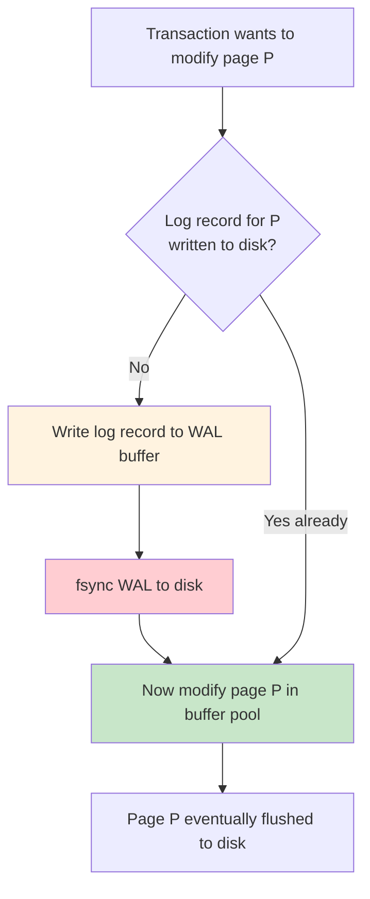
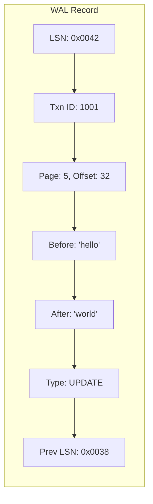
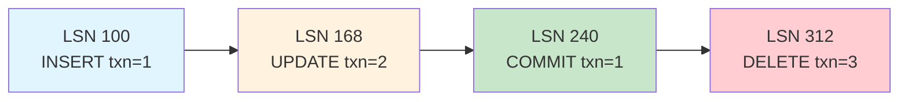
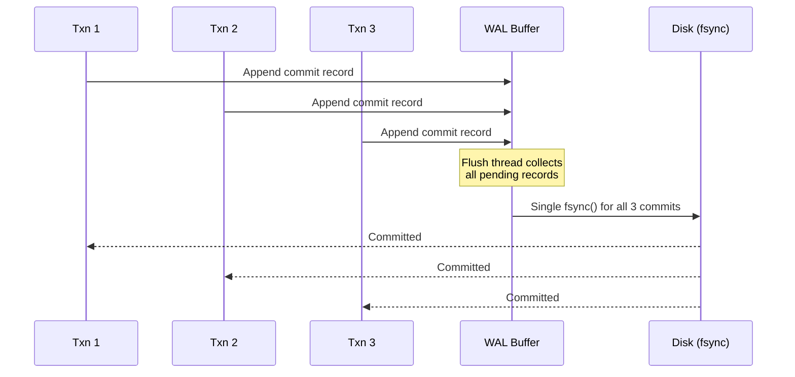
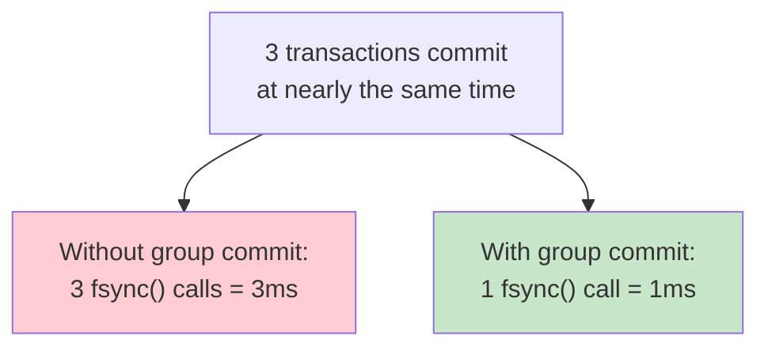
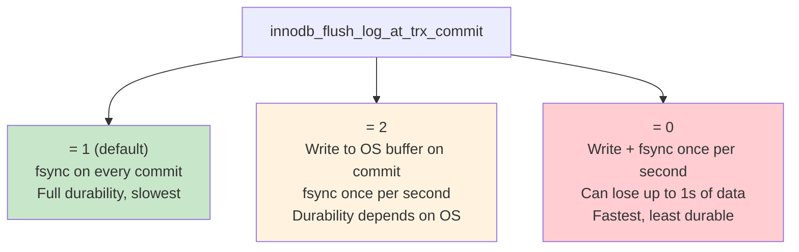
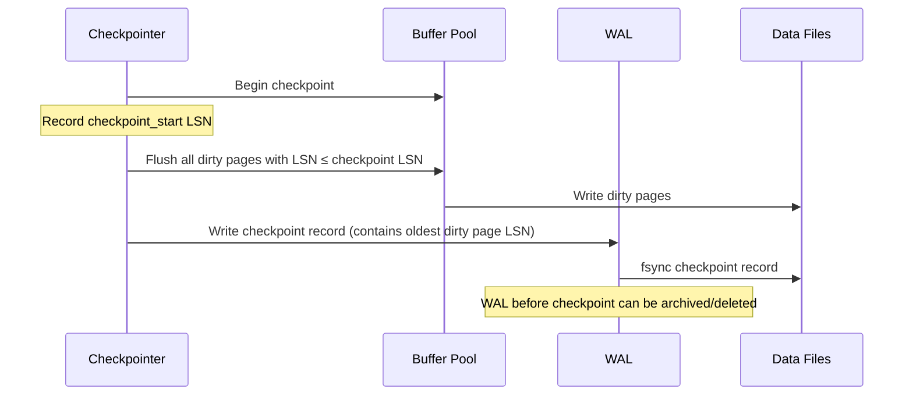
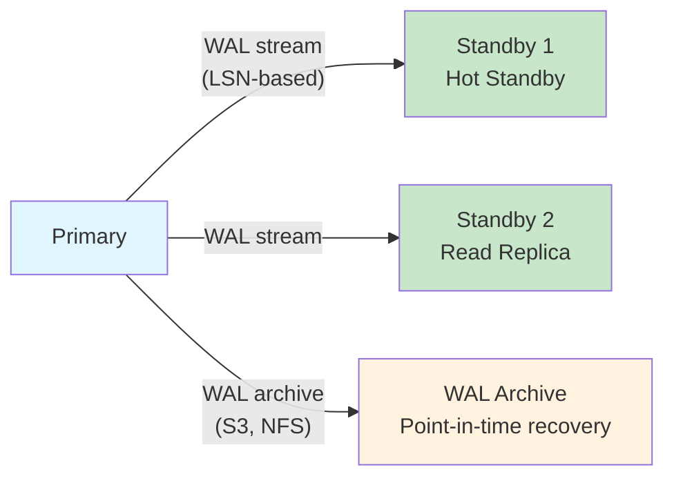

# Write-Ahead Logging (WAL)

## Overview

Write-Ahead Logging (WAL) is the fundamental protocol that guarantees **durability** (the "D" in ACID). The core rule is simple: **before any change is applied to the actual data pages on disk, a log record describing that change must first be written to stable storage.** This ensures that if the system crashes at any point, the log contains enough information to either redo committed changes or undo uncommitted ones.

WAL is used by virtually every serious database: PostgreSQL (WAL segments), MySQL/InnoDB (redo log + undo log), Oracle (redo log), SQL Server (transaction log), RocksDB (WAL files), and even SQLite (in WAL journal mode).

## Detailed Explanation

### The WAL Protocol



**The rule:** A data page must never be written to disk before the corresponding log record has been flushed to the WAL on disk.

### What's in a WAL Record?

```
┌──────────────────────────────────────────────┐
│ Log Sequence Number (LSN)                    │
│ Transaction ID                               │
│ Page ID (which page was modified)            │
│ Offset within page                           │
│ Before-image (for undo)                      │
│ After-image (for redo)                       │
│ Type: INSERT / UPDATE / DELETE / COMMIT      │
│ Previous LSN (for undo chain)                │
└──────────────────────────────────────────────┘
```



### LSN (Log Sequence Number)

Every log record gets a monotonically increasing **LSN** — a byte offset into the WAL that uniquely identifies the record. LSNs are used everywhere:

| Use Case | How LSN is Used |
|----------|----------------|
| **Recovery** | Scan from checkpoint's `recLSN` forward |
| **Dirty page tracking** | Each page stores `pageLSN` (LSN of last modification) |
| **Checkpoint** | Records `maxLSN` to know where recovery must start |
| **Replication** | Followers track `replayLSN` to know what's been applied |
| **MVCC** | Snapshot isolation based on LSN at snapshot time |



### Force-at-Commit vs. No-Force

```mermaid
flowchart TD
    subgraph Force_Policy["Force-at-Commit (traditional)"]
        direction TB
        F1[Transaction commits] --> F2[Flush ALL dirty pages to disk]
        F2 --> F3[Acknowledge commit]
    end

    subgraph No_Force["No-Force (modern)"]
        direction TB
        N1[Transaction commits] --> N2[Flush ONLY WAL records to disk]
        N2 --> N3[Acknowledge commit]
        N3 --> N4[Dirty pages written later<br/>(checkpoint or eviction)]
    end

    style Force_Policy fill:#ffcdd2
    style No_Force fill:#c8e6c9
```

| Policy | Pros | Cons |
|--------|------|------|
| **Force-at-commit** | Simple recovery, pages always current | Very slow commits (flush all dirty pages) |
| **No-force** | Fast commits (only WAL flush) | Needs WAL replay during recovery |

**All modern databases use no-force**: they flush only the WAL at commit time, and dirty pages are written later during checkpoints.

### Steal vs. No-Steal

| Policy | Can evict dirty uncommitted pages? | Recovery complexity |
|--------|-----------------------------------|-------------------|
| **Steal** | Yes | Needs undo (rollback uncommitted) |
| **No-steal** | No | Simpler (no undo needed) |

**Most databases use steal + no-force** (ARIES model): they allow evicting dirty pages of uncommitted transactions (steal) and only flush WAL at commit (no-force). This maximizes flexibility for the buffer manager.

### Group Commit

When many transactions commit simultaneously, individual `fsync()` calls are expensive (~1ms each on SSD). **Group commit** batches multiple commits into a single `fsync()`:





**Real-world impact:** PostgreSQL introduced group commit in 9.2, improving commit throughput from ~5,000 TPS to ~50,000+ TPS on SSD.

### WAL in Different Databases

```mermaid
flowchart TD
    subgraph PostgreSQL["PostgreSQL WAL"]
        direction TB
        PG1[WAL segments (16MB each)] --> PG2[pg_wal/ directory]
        PG2 --> PG3[Binary WAL records]
        PG3 --> PG4[LSN = byte offset in WAL]
    end

    subgraph InnoDB["InnoDB Redo Log"]
        direction TB
        IN1[ib_logfile0, ib_logfile1] --> IN2[Fixed-size log files]
        IN2 --> IN3[Circular buffer]
        IN3 --> IN4[LSN = monotonically increasing]
    end

    subgraph RocksDB["RocksDB WAL"]
        direction TB
        RK1[WAL files in data dir] --> RK2[One WAL per memtable]
        RK2 --> RK3[Deleted after memtable flush]
        RK3 --> RK4[Can disable (risk data loss)]
    end

    style PostgreSQL fill:#e1f5fe
    style InnoDB fill:#fff3e0
    style RocksDB fill:#c8e6c9
```

| Database | WAL Format | Size Management | fsync Policy |
|----------|-----------|-----------------|-------------|
| **PostgreSQL** | Binary records in segments | `max_wal_size`, archive + recycle | `wal_sync_method` (fdatasync default) |
| **InnoDB** | Redo log records | `innodb_log_file_size` (fixed) | `innodb_flush_log_at_trx_commit` |
| **RocksDB** | Key-value entries | One per memtable, deleted after flush | `sync` option on write |
| **SQLite** | SQLite journal/WAL mode | Configurable, checkpointed | `PRAGMA synchronous` |

### InnoDB's `innodb_flush_log_at_trx_commit`

This setting controls the durability-performance tradeoff:



| Value | Commit Behavior | Data Loss Risk | Performance |
|-------|----------------|---------------|-------------|
| **1** | fsync every commit | None (if disk honors fsync) | Slowest |
| **2** | Write to OS, fsync per second | Up to 1s (OS crash) | Medium |
| **0** | Write + fsync per second | Up to 1s (any crash) | Fastest |

### Checkpointing

Over time, the WAL grows unboundedly. **Checkpoints** mark points where all dirty pages have been flushed to disk, allowing the WAL to be truncated:




**Fuzzy checkpoints** (used by ARIES) don't require pausing the system — they track the oldest dirty page's LSN and flush pages in the background.

### WAL and Replication

WAL is the foundation of **physical replication** in PostgreSQL and many other databases:



- **Streaming replication**: Standby continuously receives WAL records from primary
- **Log shipping**: WAL files are archived to storage and applied on standby
- **Point-in-time recovery (PITR)**: Replay WAL up to a specific timestamp or LSN

## Cross-References

- [Database Internals Overview](./README.md) — High-level architecture of storage engines
- [Log-based Recovery](../transactions/log-recovery.md) — How WAL enables crash recovery
- [Checkpointing](../transactions/checkpointing.md) — Periodic dirty page flushing
- [ARIES](../transactions/aries.md) — The canonical recovery algorithm
- [Buffer Pool](../caching/buffer-pool.md) — In-memory page cache
- [LSM Trees](./lsm-trees.md) — Log-structured storage that also uses WAL
- [Replication](../distributed/replication.md) — WAL-based physical replication

## Interview Questions

### Beginner

**Q: What is WAL and why is it needed?**
A: WAL (Write-Ahead Logging) is a protocol where changes are first written to a sequential log file before being applied to the actual data pages. It ensures durability: if the system crashes, the WAL can replay committed transactions and undo uncommitted ones.

**Q: What is an LSN?**
A: A Log Sequence Number is a monotonically increasing identifier (typically a byte offset) assigned to each WAL record. It uniquely identifies a log record and is used for recovery ordering, dirty page tracking, and replication.

**Q: Why is sequential I/O faster than random I/O?**
A: On HDDs, sequential I/O avoids seek time (~10ms vs ~0.1ms for sequential). On SSDs, sequential writes are faster due to erase-block alignment and write coalescing. WAL exploits this by writing all log records sequentially.

### Intermediate

**Q: Explain group commit and why it improves throughput.**
A: When multiple transactions commit simultaneously, each would normally require its own `fsync()` call. Group commit batches pending WAL records from multiple transactions into a single `fsync()`. Since `fsync()` has high fixed overhead (~1ms), amortizing it across many transactions dramatically improves throughput.

**Q: What is the difference between the redo log and undo log in InnoDB?**
A: The **redo log** (ib_logfile*) records physical changes to pages for crash recovery (replaying committed changes). The **undo log** (in the system tablespace or undo tablespaces) records the inverse of changes to allow rollback of uncommitted transactions and to provide MVCC snapshots.

**Q: Why can't we just flush all dirty pages at commit time instead of using WAL?**
A: Flushing all dirty pages at commit requires random I/O for every modified page. A transaction might touch many scattered pages, causing hundreds of disk writes per commit. WAL requires only one sequential write (the log record), which is orders of magnitude faster.

### Advanced (FAANG-Level)

**Q: PostgreSQL's WAL uses physiological logging. Explain what this means and why it's better than pure physical or pure logical logging.**
A: **Physiological logging** logs the *physical location* (page ID, offset) but the *logical operation* (e.g., "insert tuple with these bytes" rather than "set bytes 32-47 to X"). This is better because:
- **Physical redo**: Exact byte-level replay works even if page layout changes
- **Logical undo**: Can undo by applying the inverse operation (e.g., delete the inserted tuple) without needing the before-image
- **Compact**: Smaller than full before/after images of entire pages

**Q: How would you implement WAL for a distributed database where nodes can fail independently?**
A: Each node maintains its own WAL. A distributed commit requires:
1. Write WAL to all participating nodes (2PC prepare phase)
2. Once all nodes ack WAL writes, send commit (2PC commit phase)
3. Each node applies the commit record to its WAL
4. Use Raft/Paxos to replicate WAL entries to a quorum before acknowledging

Google Spanner uses this approach: each shard group uses Paxos to replicate WAL (called "log entries") across replicas.

**Q: A database's WAL is on the same disk as data files. The disk is 90% full. What happens?**
A: Several cascading issues:
1. WAL can't grow → new transactions can't commit → system becomes read-only or stalls
2. Checkpoints can't write dirty pages → buffer pool fills with dirty pages → evictions block
3. Recovery may fail if WAL was truncated prematurely
**Mitigation**: Separate WAL to a dedicated fast disk (SSD), monitor disk usage, set WAL size limits, and configure `max_wal_size` to trigger checkpoints before disk fills.

## Common Mistakes

1. **Assuming WAL guarantees zero data loss**: WAL only guarantees durability for *committed* transactions. With `innodb_flush_log_at_trx_commit=2`, up to 1 second of committed transactions can be lost on OS crash.

2. **Confusing WAL with journal**: Some systems (ext4, NTFS) use journals for filesystem consistency. Database WAL is different — it records logical/physical changes to database pages, not filesystem metadata.

3. **Ignoring WAL size**: Unbounded WAL growth (e.g., long-running transaction preventing checkpoint) can fill disk and crash the database.

4. **Setting `innodb_flush_log_at_trx_commit=0` in production**: This disables per-commit fsync, risking data loss. Only acceptable for benchmarking or non-critical data.

5. **Forgetting that WAL replay is idempotent**: Redo operations must be idempotent — applying the same log record twice should produce the same result. This is ensured by checking `pageLSN` before applying redo.

## Summary and Revision Notes

- **WAL rule**: Log record must hit disk *before* the corresponding data page
- **LSN**: Monotonically increasing byte offset; the universal identifier for WAL records
- **Steal + No-force**: Modern policy — allow evicting dirty uncommitted pages (steal), only flush WAL at commit (no-force)
- **Group commit**: Batch multiple transactions' WAL flushes into one `fsync()` → 10x+ throughput improvement
- **Checkpoint**: Mark points where all dirty pages are flushed; allows WAL truncation
- **Recovery**: Scan WAL from last checkpoint, redo committed, undo uncommitted
- **WAL enables replication**: Streaming replication sends WAL records to standbys
- **PostgreSQL**: WAL segments in `pg_wal/`, physiological logging, LSN = byte offset
- **InnoDB**: Redo log (ib_logfile*) + undo log; `innodb_flush_log_at_trx_commit` controls durability
- **RocksDB**: WAL files, one per memtable, deleted after memtable flush to SSTable


## Cross References

- [Recovery](../dbms/transactions/recovery.md)
- [ARIES](../dbms/transactions/aries.md)
- [Journaling (OS)](../os/filesystems/journaling.md)
- [Checkpointing](../dbms/transactions/checkpointing.md)
- [Write Policies](../arch/memory-hierarchy/write-policies.md)
