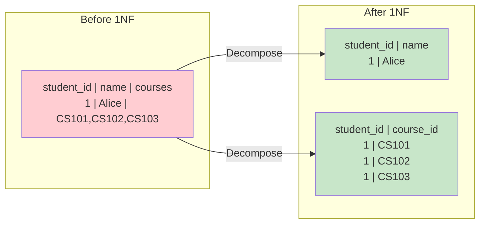

# First Normal Form (1NF)

## Overview

**First Normal Form (1NF)** is the most basic level of normalization. A relation is in 1NF if all its attributes contain only **atomic (indivisible) values** and each row is unique (has a primary key). 1NF eliminates repeating groups and multi-valued attributes.

## Rules of 1NF

1. Each column contains only **atomic values** (no lists, sets, or nested tables)
2. Each column contains values of a **single type**
3. Each row is **unique** (has a primary key or candidate key)
4. The order of rows and columns does not matter

## Before 1NF (Unnormalized)

| student_id | name | courses |
|---|---|---|
| 1 | Alice | CS101, CS102, CS103 |
| 2 | Bob | CS101, CS104 |
| 3 | Carol | CS102 |

**Violations:**
- `courses` contains multiple values (comma-separated list)
- Cannot query "find all students in CS101" efficiently
- Cannot enforce referential integrity on individual courses

## After 1NF

### Option 1: Separate Rows

| student_id | name | course |
|---|---|---|
| 1 | Alice | CS101 |
| 1 | Alice | CS102 |
| 1 | Alice | CS103 |
| 2 | Bob | CS101 |
| 2 | Bob | CS104 |
| 3 | Carol | CS102 |

### Option 2: Separate Table (Better)

```sql
-- Students table
CREATE TABLE Students (
    student_id INT PRIMARY KEY,
    name VARCHAR(100) NOT NULL
);

-- Enrollments table (junction)
CREATE TABLE Enrollments (
    student_id INT,
    course_id VARCHAR(10),
    grade CHAR(2),
    PRIMARY KEY (student_id, course_id),
    FOREIGN KEY (student_id) REFERENCES Students(student_id),
    FOREIGN KEY (course_id) REFERENCES Courses(course_id)
);
```



## Composite Attributes

1NF requires that composite attributes be broken into their component parts.

### Before (Composite Attribute)

| student_id | name | address |
|---|---|---|
| 1 | Alice | 123 Main St, Springfield, IL 62701 |

### After 1NF

| student_id | first_name | last_name | street | city | state | zip |
|---|---|---|---|---|---|---|
| 1 | Alice | Smith | 123 Main St | Springfield | IL | 62701 |

## Multi-Valued Attributes

Multi-valued attributes (like phone numbers) must be moved to a separate table.

### Before

| emp_id | name | phones |
|---|---|---|
| 1 | Alice | 555-1234, 555-5678 |

### After 1NF

```sql
CREATE TABLE Employees (emp_id INT PRIMARY KEY, name VARCHAR(100));
CREATE TABLE EmployeePhones (
    emp_id INT,
    phone VARCHAR(20),
    PRIMARY KEY (emp_id, phone),
    FOREIGN KEY (emp_id) REFERENCES Employees(emp_id)
);
```

## SQL Enforcement of 1NF

```sql
-- MySQL: JSON column (stores structured data, but not truly 1NF)
CREATE TABLE Students (
    student_id INT PRIMARY KEY,
    name VARCHAR(100),
    phones JSON  -- Stores ["555-1234", "555-5678"]
);

-- PostgreSQL: Array column (also not truly 1NF)
CREATE TABLE Students (
    student_id INT PRIMARY KEY,
    name VARCHAR(100),
    phones VARCHAR(20)[]  -- Stores {"555-1234","555-5678"}
);

-- True 1NF: separate table
CREATE TABLE StudentPhones (
    student_id INT REFERENCES Students(student_id),
    phone VARCHAR(20),
    PRIMARY KEY (student_id, phone)
);
```

**Note**: Modern databases support JSON and array types, which technically violate 1NF but are practical for certain use cases. The choice depends on whether you need to query individual values.

## Interview Questions

### Beginner

**Q1: What is 1NF?**
A: A table is in 1NF if all columns contain atomic (single) values, there are no repeating groups, and each row is uniquely identifiable by a primary key. It's the foundation of normalization.

**Q2: Why can't a table have multi-valued columns?**
A: Multi-valued columns make querying difficult (can't use = or JOIN), prevent proper indexing, break referential integrity, and cause data anomalies. Instead, create a separate table with one row per value.

**Q3: Is this table in 1NF?**

| ID | Name | Tags |
|---|---|---|
| 1 | Post1 | sql, dbms |
| 2 | Post2 | python |

A: No. The `Tags` column contains comma-separated values (non-atomic). To achieve 1NF, create a junction table `PostTags(post_id, tag)` with one row per tag.

### Intermediate

**Q4: Can a JSON column be considered 1NF?**
A: Technically no — JSON contains structured/nested data, violating atomicity. However, in practice, many teams use JSON columns for semi-structured data (user preferences, metadata) where the data doesn't need to be queried individually. It's a pragmatic trade-off.

**Q5: How do you handle addresses in 1NF?**
A: A single address field is technically atomic (it's one string), but it's composite (street, city, state, zip). For 1NF, decompose into individual columns. For practical systems, keeping it as one field is acceptable if you never query sub-components.

### Advanced

**Q6: A table has a column `skills` storing an array. The application only ever retrieves the full array, never individual skills. Should you normalize?**
A: If you never query individual skills and the array is always read as a whole, keeping it as an array/JSON column is pragmatic (denormalized for performance). If you ever need to query "find all employees with Python skill," normalize into a separate table.

## Common Mistakes

- Thinking 1NF just means "has a primary key" — atomicity of values is equally important
- Over-normalizing addresses into street_number, street_name, city, state, zip, country when a single field suffices
- Using comma-separated strings instead of junction tables for many-to-many relationships
- Confusing JSON/array columns with 1NF compliance

## Summary

| Requirement | Description | Example |
|---|---|---|
| Atomic values | Each cell has one value | `phone` = '555-1234', not '555-1234,555-5678' |
| No repeating groups | No repeated column patterns | No `phone1, phone2, phone3` columns |
| Unique rows | Primary key identifies each row | `student_id` is PK |
| Single data type | Each column has one type | No mixing numbers and strings |

## Cross-References

- [Normalization Overview](README.md) — Why normalize
- [2NF](2nf.md) — Next level: eliminating partial dependencies
- [Relational Model](../relational-model/README.md) — Relation properties
- [SQL DDL](../sql/ddl.md) — Implementing 1NF schemas


## Cross References

- [2NF](../dbms/normalization/2nf.md)
- [Keys](../dbms/relational-model/keys.md)
- [ER Diagrams](../dbms/relational-model/er-diagrams.md)
