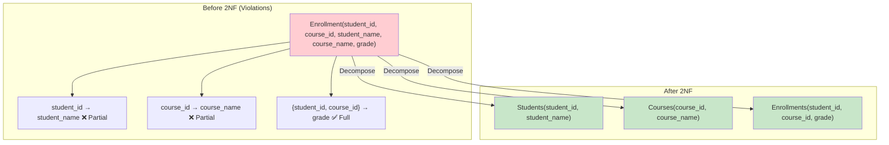

# Second Normal Form (2NF)

## Overview

**Second Normal Form (2NF)** builds on 1NF by eliminating **partial dependencies** — where a non-prime attribute depends on only part of a composite candidate key, not the whole key. 2NF is only relevant when the table has a **composite primary key**. Tables with a single-column primary key are automatically in 2NF if they're in 1NF.

## Rule

A relation is in **2NF** if:
1. It is in **1NF**
2. Every non-prime attribute is **fully functionally dependent** on every candidate key (no partial dependencies)

## What is a Partial Dependency?

A **partial dependency** exists when a non-prime attribute depends on a proper subset of a composite candidate key.

```
Given: R(A, B, C, D) with candidate key {A, B}
FD: {A, B} → C, D  (full dependency — OK)
FD: {A} → D          (partial dependency — violates 2NF)
```

## Before 2NF — Violations

Consider `Enrollment(student_id, course_id, student_name, course_name, grade)`:

| student_id | course_id | student_name | course_name | grade |
|---|---|---|---|---|
| 1 | CS101 | Alice | Databases | A |
| 1 | CS102 | Alice | Networks | B |
| 2 | CS101 | Bob | Databases | A |

**Composite PK**: {student_id, course_id}

**Functional Dependencies:**
- {student_id, course_id} → grade ✅ (full dependency)
- student_id → student_name ❌ (partial — depends only on student_id)
- course_id → course_name ❌ (partial — depends only on course_id)

**Problems:**
- Redundancy: "Alice" repeated for every enrollment by student 1
- Update anomaly: Change Alice's name → must update all her enrollments
- Insert anomaly: Can't add a student without enrolling in a course
- Delete anomaly: Deleting student 2's only enrollment loses "Bob" info

## Converting to 2NF

Decompose into tables where each non-prime attribute depends on the **full** candidate key:

```sql
-- Table 1: Students (student_id → student_name)
CREATE TABLE Students (
    student_id INT PRIMARY KEY,
    student_name VARCHAR(100) NOT NULL
);

-- Table 2: Courses (course_id → course_name)
CREATE TABLE Courses (
    course_id VARCHAR(10) PRIMARY KEY,
    course_name VARCHAR(100) NOT NULL
);

-- Table 3: Enrollments (student_id + course_id → grade)
CREATE TABLE Enrollments (
    student_id INT,
    course_id VARCHAR(10),
    grade CHAR(2),
    PRIMARY KEY (student_id, course_id),
    FOREIGN KEY (student_id) REFERENCES Students(student_id),
    FOREIGN KEY (course_id) REFERENCES Courses(course_id)
);
```



## Another Example

`OrderItems(order_id, product_id, product_name, quantity, price)`

**PK**: {order_id, product_id}

| FD | Type | 2NF? |
|---|---|---|
| {order_id, product_id} → quantity | Full | ✅ |
| {order_id, product_id} → price | Full | ✅ |
| product_id → product_name | Partial | ❌ |

**Fix:**
```sql
CREATE TABLE Products (product_id INT PK, product_name VARCHAR(100), price DECIMAL);
CREATE TABLE OrderItems (
    order_id INT, product_id INT, quantity INT,
    PRIMARY KEY (order_id, product_id),
    FOREIGN KEY (product_id) REFERENCES Products(product_id)
);
```

## Prime vs Non-Prime Attributes

- **Prime attribute**: Part of any candidate key
- **Non-prime attribute**: Not part of any candidate key

2NF only requires non-prime attributes to be fully dependent on candidate keys. Prime attributes can have partial dependencies (this is addressed in 3NF/BCNF).

## When 2NF Doesn't Apply

If the table has a **single-column primary key**, it's automatically in 2NF (if in 1NF), because there's no "part" of the key to depend on.

```sql
-- Single PK: automatically 2NF if 1NF
CREATE TABLE Employees (
    emp_id INT PRIMARY KEY,  -- Single column PK
    name VARCHAR(100),       -- Can't have partial dependency
    email VARCHAR(255)
);
```

## Interview Questions

### Beginner

**Q1: What is 2NF?**
A: A table is in 2NF if it's in 1NF and every non-prime attribute is fully functionally dependent on every candidate key. It eliminates partial dependencies — where an attribute depends on only part of a composite key.

**Q2: When is 2NF relevant?**
A: Only when the table has a composite primary key (multiple columns). If the PK is a single column, the table is automatically in 2NF if it's in 1NF.

**Q3: What is a partial dependency?**
A: When a non-prime attribute depends on only a proper subset of a composite candidate key. Example: In `Enrollment(student_id, course_id, student_name)`, `student_name` depends only on `student_id`, not the full key.

### Intermediate

**Q4: Decompose this table to 2NF: `Purchase(order_id, item_id, customer_name, item_name, quantity)`**
A: PK = {order_id, item_id}
- order_id → customer_name (partial)
- item_id → item_name (partial)
- {order_id, item_id} → quantity (full)

Decomposition:
- `Orders(order_id PK, customer_name)`
- `Items(item_id PK, item_name)`
- `OrderItems(order_id FK, item_id FK, quantity, PK(order_id, item_id))`

**Q5: Can a table in 2NF still have anomalies?**
A: Yes. 2NF eliminates partial dependencies but not transitive dependencies. Example: `Student(student_id, dept_id, dept_head)` — `dept_head` depends on `dept_id`, which depends on `student_id` (transitive). This violates 3NF but not 2NF.

### Advanced

**Q6: How do you identify partial dependencies algorithmically?**
A:
1. List all candidate keys
2. For each non-prime attribute, compute the closure of every proper subset of each candidate key
3. If any proper subset determines the attribute, it's a partial dependency
4. Remove by decomposing: create a table with (subset, attribute) and (full_key, remaining_attributes)

## Common Mistakes

- Applying 2NF to tables with single-column PKs (already in 2NF if in 1NF)
- Confusing partial dependency with transitive dependency
- Forgetting that 2NF only applies to non-prime attributes
- Not verifying lossless join after decomposition

## Summary

| Aspect | Description |
|---|---|
| Requirement | No partial dependencies on composite keys |
| Applies to | Tables with composite primary keys |
| Eliminates | Redundancy from partial key dependencies |
| Decomposition | Separate tables for each partial dependency |

## Cross-References

- [1NF](1nf.md) — Foundation: atomic values
- [3NF](3nf.md) — Next level: transitive dependencies
- [Normalization Overview](README.md) — Functional dependencies
- [Keys](../relational-model/keys.md) — Understanding candidate keys
