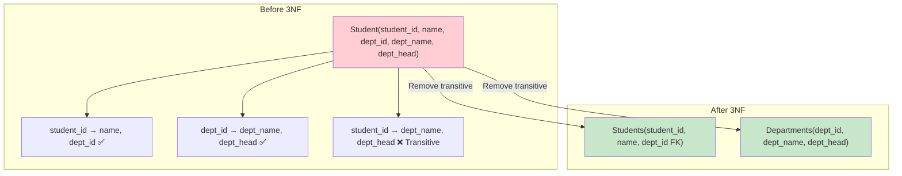

# Third Normal Form (3NF)

## Overview

**Third Normal Form (3NF)** builds on 2NF by eliminating **transitive dependencies** — where a non-prime attribute depends on another non-prime attribute rather than directly on the candidate key. 3NF is the most commonly targeted normal form in practice and is sufficient for most database designs.

## Rule

A relation is in **3NF** if:
1. It is in **2NF**
2. No non-prime attribute is **transitively dependent** on any candidate key

Formally: For every non-trivial FD X → A, at least one of the following holds:
- X is a superkey, OR
- A is a prime attribute (part of some candidate key)

## What is a Transitive Dependency?

A transitive dependency exists when X → Y → Z, where:
- X is a candidate key (or part of it)
- Y is a non-prime attribute
- Z is a non-prime attribute
- Y is not a candidate key

```
student_id → dept_id → dept_head
(student_id is key, dept_id is non-prime, dept_head is non-prime)
```

## Before 3NF — Violations

Consider `Student(student_id, name, dept_id, dept_name, dept_head)`:

| student_id | name | dept_id | dept_name | dept_head |
|---|---|---|---|---|
| 1 | Alice | 10 | CS | Dr. Smith |
| 2 | Bob | 20 | Math | Dr. Jones |
| 3 | Carol | 10 | CS | Dr. Smith |
| 4 | Dave | 20 | Math | Dr. Jones |

**Functional Dependencies:**
- student_id → name, dept_id ✅ (direct)
- dept_id → dept_name, dept_head ✅
- student_id → dept_name, dept_head ❌ (transitive via dept_id)

**Problems:**
- Redundancy: "CS, Dr. Smith" repeated for every CS student
- Update anomaly: If Dr. Smith retires, must update all CS students
- Insert anomaly: Can't add a new department without a student
- Delete anomaly: Deleting Dave loses Math department info

## Converting to 3NF

Remove transitive dependencies by decomposing:

```sql
-- Table 1: Students (student_id → name, dept_id)
CREATE TABLE Students (
    student_id INT PRIMARY KEY,
    name VARCHAR(100) NOT NULL,
    dept_id INT NOT NULL,
    FOREIGN KEY (dept_id) REFERENCES Departments(dept_id)
);

-- Table 2: Departments (dept_id → dept_name, dept_head)
CREATE TABLE Departments (
    dept_id INT PRIMARY KEY,
    dept_name VARCHAR(100) NOT NULL,
    dept_head VARCHAR(100) NOT NULL
);
```



## Step-by-Step: Identifying Transitive Dependencies

Given `R(emp_id, emp_name, dept_id, dept_name, location)`:

1. **Identify candidate key**: {emp_id}
2. **List FDs**: emp_id → emp_name, dept_id, dept_name, location
3. **Find intermediate dependencies**: dept_id → dept_name, location
4. **Check**: emp_id → dept_name is transitive (emp_id → dept_id → dept_name)
5. **Decompose**:
   - R1(emp_id PK, emp_name, dept_id FK)
   - R2(dept_id PK, dept_name, location)

## 3NF Decomposition Algorithm

```
Algorithm: 3NF Decomposition
Input: Relation R with FDs F
1. Find a minimal cover Fc for F
2. For each FD X → Y in Fc, create a table (X, Y)
3. If no table contains a candidate key of R, add a table with any candidate key
4. Result is in 3NF, lossless, and dependency-preserving
```

Example: R(A, B, C, D) with FDs: A → B, B → C, A → D

1. Minimal cover: A → B, B → C, A → D (already minimal)
2. Create tables: (A, B), (B, C), (A, D)
3. Check: {A}⁺ = {A,B,C,D} → A is candidate key. Table (A, B) contains A → OK
4. Result: R1(A, B), R2(B, C), R3(A, D)

## 3NF vs 2NF

| Aspect | 2NF | 3NF |
|---|---|---|
| Eliminates | Partial dependencies | Transitive dependencies |
| Applies to | Composite keys only | Any key |
| Dependency type | Non-prime depends on part of key | Non-prime depends on non-prime |
| Always sufficient | No (may still have transitive deps) | Usually yes for practical systems |

## 3NF Anomalies

3NF can still have anomalies in rare cases. Consider R(A, B, C) with:
- FDs: {A, B} → C, C → B
- Candidate keys: {A, B}, {A, C}
- C → B: B is prime (part of candidate key {A, B}) → 3NF satisfied
- But C is a determinant that's not a superkey → BCNF violation

## Interview Questions

### Beginner

**Q1: What is 3NF?**
A: A table is in 3NF if it's in 2NF and has no transitive dependencies — no non-prime attribute depends on another non-prime attribute. Every non-prime attribute must depend directly on the candidate key.

**Q2: What is a transitive dependency?**
A: When A → B → C, where A is a candidate key, B is a non-prime attribute, and C is a non-prime attribute. Example: student_id → dept_id → dept_head. The fix: decompose into separate tables for the direct dependencies.

**Q3: How does 3NF differ from 2NF?**
A: 2NF eliminates partial dependencies (attribute depends on part of composite key). 3NF eliminates transitive dependencies (attribute depends on another non-prime attribute, which depends on the key). 3NF is a stronger condition.

### Intermediate

**Q4: Is every 3NF table also in 2NF?**
A: Yes. If a table violates 2NF (has partial dependencies), it also violates 3NF because a partial dependency is a special case of a transitive dependency. So 3NF ⊂ 2NF ⊂ 1NF.

**Q5: Can a 3NF table still have redundancy?**
A: Yes, in rare cases involving overlapping candidate keys. Example: R(student, course, instructor) where each instructor teaches one course and each student has one instructor. The FDs {student} → {instructor}, {instructor} → {course}, {course} → {instructor} create redundancy even in 3NF. BCNF addresses this.

**Q6: Decompose to 3NF: `Employee(emp_id, name, dept_id, dept_name, manager_id, manager_name)`**
A: FDs:
- emp_id → name, dept_id, manager_id
- dept_id → dept_name
- manager_id → manager_name

Transitive deps: emp_id → dept_id → dept_name, emp_id → manager_id → manager_name

Decomposition:
1. `Employees(emp_id PK, name, dept_id FK, manager_id FK)`
2. `Departments(dept_id PK, dept_name)`
3. `Managers(manager_id PK, manager_name)`

### Advanced / FAANG-Level

**Q7: Prove that the 3NF decomposition algorithm produces a lossless and dependency-preserving decomposition.**
A: **Lossless**: Each table in the decomposition corresponds to an FD X → Y. The table contains X and Y. X → Y holds, and X is the key of the table. For any two tables Ti(Xi, Yi) and Tj(Xj, Yj), their intersection Xi ∩ Xj must functionally determine one of them (by the FDs in the minimal cover). This satisfies the lossless join condition.

**Dependency-preserving**: Every FD in the minimal cover is represented in at least one decomposed table (each FD directly generates a table). The union of all FDs from the decomposed tables (projected FDs) is equivalent to the original FDs.

**Q8: Design a 3NF schema for a university course registration system with students, courses, professors, departments, and prerequisites.**
A:
```sql
-- Departments
CREATE TABLE Departments (
    dept_id INT PRIMARY KEY,
    dept_name VARCHAR(100) UNIQUE NOT NULL,
    building VARCHAR(100),
    budget DECIMAL(12,2)
);

-- Professors
CREATE TABLE Professors (
    prof_id INT PRIMARY KEY,
    name VARCHAR(100) NOT NULL,
    email VARCHAR(255) UNIQUE,
    dept_id INT REFERENCES Departments(dept_id)
);

-- Students
CREATE TABLE Students (
    student_id INT PRIMARY KEY,
    name VARCHAR(100) NOT NULL,
    email VARCHAR(255) UNIQUE,
    advisor_id INT REFERENCES Professors(prof_id)
);

-- Courses
CREATE TABLE Courses (
    course_id VARCHAR(10) PRIMARY KEY,
    title VARCHAR(200) NOT NULL,
    credits INT CHECK (credits > 0),
    dept_id INT REFERENCES Departments(dept_id)
);

-- Prerequisites (self-referencing M:N)
CREATE TABLE Prerequisites (
    course_id VARCHAR(10),
    prereq_id VARCHAR(10),
    PRIMARY KEY (course_id, prereq_id),
    FOREIGN KEY (course_id) REFERENCES Courses(course_id),
    FOREIGN KEY (prereq_id) REFERENCES Courses(course_id)
);

-- Sections (offered courses)
CREATE TABLE Sections (
    section_id INT PRIMARY KEY,
    course_id VARCHAR(10) REFERENCES Courses(course_id),
    prof_id INT REFERENCES Professors(prof_id),
    semester VARCHAR(10),
    year INT,
    room VARCHAR(20)
);

-- Enrollments
CREATE TABLE Enrollments (
    student_id INT REFERENCES Students(student_id),
    section_id INT REFERENCES Sections(section_id),
    grade CHAR(2),
    PRIMARY KEY (student_id, section_id)
);
```

This design is in 3NF: every non-prime attribute depends directly on its table's primary key, with no transitive dependencies.

## Common Mistakes

- Confusing 3NF with BCNF (3NF allows prime attributes to be transitively dependent)
- Not finding all transitive dependencies before decomposing
- Creating too many tables (over-normalization) when 3NF is already achieved
- Forgetting to verify lossless join after decomposition
- Missing the dependency preservation check

## Summary

| Aspect | Description |
|---|---|
| Eliminates | Transitive dependencies |
| Rule | Non-prime attributes must not depend on other non-prime attributes |
| Decomposition | Remove intermediate non-prime dependencies |
| Properties | Lossless join, dependency-preserving |
| Practical level | Sufficient for most database designs |

## Cross-References

- [2NF](2nf.md) — Previous level: partial dependencies
- [BCNF](bcnf.md) — Stronger form: every determinant is a candidate key
- [Normalization Overview](README.md) — Functional dependencies and decomposition
- [Denormalization](denormalization.md) — When to break 3NF for performance


## Cross References

- [2NF](2nf.md)
- [BCNF](bcnf.md)
- [Denormalization](denormalization.md)
