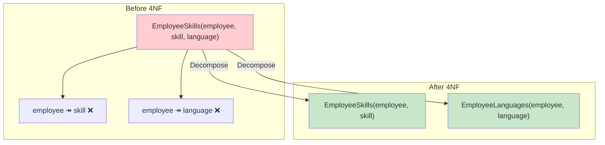
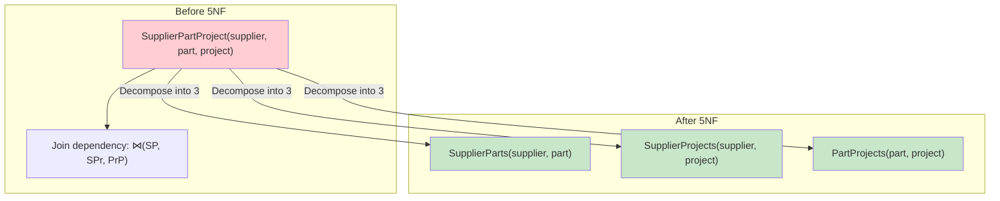
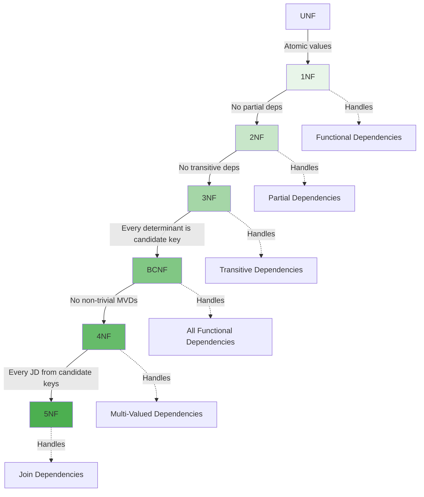

# Fourth Normal Form (4NF) and Fifth Normal Form (5NF)

## Overview

**4NF** and **5NF** address anomalies caused by **multi-valued dependencies** and **join dependencies** respectively. While 1NF through BCNF handle functional dependencies, these higher normal forms deal with more complex dependency types. They are rarely needed in practice but important for interview discussions.

## Fourth Normal Form (4NF)

### Multi-Valued Dependencies (MVD)

A **multi-valued dependency** X ↠ Y exists when for each value of X, there is a set of values of Y that is independent of the values of the other attributes.

```
X ↠ Y means: "X multi-determines Y"
For a given X value, Y values are independent of all other attributes
```

### Example: Before 4NF

Consider `EmployeeSkills(employee, skill, language)`:

| employee | skill | language |
|---|---|---|
| Alice | Python | English |
| Alice | Python | French |
| Alice | Java | English |
| Alice | Java | French |
| Bob | SQL | English |
| Bob | Python | English |

**Business rules:**
- Alice knows Python and Java (independent of languages)
- Alice speaks English and French (independent of skills)
- Skills and languages are **independent** of each other

**MVDs:**
- `employee ↠ skill` (skills are independent of languages)
- `employee ↠ language` (languages are independent of skills)

**Problems:**
- Redundancy: Alice's skills repeated for each language, and languages repeated for each skill
- If Alice learns German, must add rows for ALL her skills
- If Alice learns C++, must add rows for ALL her languages

### 4NF Rule

A relation is in **4NF** if:
1. It is in **BCNF**
2. For every non-trivial multi-valued dependency X ↠ Y, **X is a superkey**

### Converting to 4NF

```sql
-- Separate independent multi-valued facts
CREATE TABLE EmployeeSkills (
    employee VARCHAR(100),
    skill VARCHAR(100),
    PRIMARY KEY (employee, skill)
);

CREATE TABLE EmployeeLanguages (
    employee VARCHAR(100),
    language VARCHAR(100),
    PRIMARY KEY (employee, language)
);
```



### Trivial MVDs

An MVD X ↠ Y is **trivial** if:
- Y ⊆ X, or
- X ∪ Y = all attributes

Trivial MVDs don't cause problems and are allowed in 4NF.

### Detecting MVDs

MVDs arise when two independent multi-valued facts about the same entity are combined in one table. The key indicator: a table has a composite key with two or more independent attributes, and the cross product of their values is stored.

## Fifth Normal Form (5NF)

### Join Dependencies (JD)

A **join dependency** `⋈(R1, R2, ..., Rn)` exists when a relation R can be decomposed into R1, R2, ..., Rn and the natural join of all Ri reconstructs R without spurious tuples.

### Example: Before 5NF

Consider `SupplierPartProject(supplier, part, project)`:

| supplier | part | project |
|---|---|---|
| S1 | P1 | J1 |
| S1 | P1 | J2 |
| S1 | P2 | J1 |
| S2 | P1 | J1 |

**Business rule:** A supplier supplies a part to a project **only if**:
1. The supplier supplies that part (somewhere), AND
2. The supplier works on that project (with some part), AND
3. That part is used on that project (by some supplier)

This is a **cyclic join dependency** that can't be decomposed into pairwise tables.

### 5NF Rule

A relation is in **5NF** (also called **Project-Join Normal Form / PJNF**) if:
1. It is in **4NF**
2. Every join dependency is implied by the candidate keys

### Converting to 5NF

The only lossless decomposition requires three tables:

```sql
CREATE TABLE SupplierParts (supplier VARCHAR(10), part VARCHAR(10), PRIMARY KEY (supplier, part));
CREATE TABLE SupplierProjects (supplier VARCHAR(10), project VARCHAR(10), PRIMARY KEY (supplier, project));
CREATE TABLE PartProjects (part VARCHAR(10), project VARCHAR(10), PRIMARY KEY (part, project));
```

The original table is reconstructed by joining all three. Any two-table decomposition would be lossy.



## Summary: All Normal Forms



## Practical Relevance

| Normal Form | Practical Use | Frequency |
|---|---|---|
| 1NF | Always enforced | Universal |
| 2NF | Automatic with single-column PKs | Common |
| 3NF | Standard target for OLTP | Very common |
| BCNF | When overlapping keys exist | Occasional |
| 4NF | When independent multi-valued facts exist | Rare |
| 5NF | When cyclic join dependencies exist | Very rare |

## Interview Questions

### Beginner

**Q1: What is 4NF?**
A: 4NF eliminates multi-valued dependencies. A table is in 4NF if it's in BCNF and for every non-trivial MVD X ↠ Y, X is a superkey. It ensures that independent multi-valued facts about an entity are stored in separate tables.

**Q2: What is a multi-valued dependency?**
A: X ↠ Y means that for each value of X, the set of Y values is independent of all other attributes. Example: employee ↠ skill and employee ↠ language — knowing Alice's skills doesn't tell you her languages, and vice versa.

**Q3: What is 5NF?**
A: 5NF eliminates join dependencies — cases where a table can only be losslessly decomposed into three or more tables (not just two). It ensures every join dependency is implied by candidate keys.

### Intermediate

**Q4: How do you detect MVDs in a table?**
A: Look for tables where:
1. Two or more independent multi-valued facts about the same entity are combined
2. The cross product of values is stored (redundancy)
3. Adding a new value for one fact requires adding rows for all values of the other fact

**Q5: When is 5NF actually needed?**
A: Very rarely. The classic example is supplier-part-project relationships with cyclic constraints. Most real-world schemas don't have such patterns. If you find yourself thinking about 5NF, you're either in an academic exercise or dealing with a very specialized domain.

**Q6: Can a table be in BCNF but not 4NF?**
A: Yes. BCNF only addresses functional dependencies. A table can satisfy BCNF (every FD's determinant is a superkey) but violate 4NF (has non-trivial MVDs where the determinant isn't a superkey).

### Advanced

**Q7: Given R(A, B, C) with MVDs A ↠ B and A ↠ C, is R always in violation of 4NF?**
A: Yes, unless one of the MVDs is trivial. If A is a superkey, both MVDs are trivially satisfied. If A is not a superkey, both MVDs violate 4NF, and R should be decomposed into (A, B) and (A, C).

**Q8: Explain why the supplier-part-project example can't be decomposed into just two tables.**
A: Any two-table decomposition loses information. For example:
- R1(supplier, part) and R2(supplier, project) → joining gives all supplier-part-project combinations where the supplier supplies that part AND works on that project, but can't enforce that the part must be used on that project
- R1(supplier, part) and R3(part, project) → joining can't enforce that the supplier works on the project

Only the three-table decomposition (with the cyclic constraint) preserves all information. This is why 5NF exists — to handle these cases where pairwise decomposition is lossy.

## Common Mistakes

- Confusing MVDs with FDs (MVDs are about independence, not determination)
- Thinking 4NF is just "better BCNF" — it handles a different type of dependency
- Trying to achieve 5NF when it's not needed (very rare in practice)
- Not recognizing that MVDs cause the same anomalies as FDs (redundancy, update/insert/delete anomalies)

## Summary

| Normal Form | Dependency Type | Eliminates |
|---|---|---|
| 4NF | Multi-valued dependencies | Independent multi-valued facts in one table |
| 5NF | Join dependencies | Cyclic join dependencies requiring 3+ table decomposition |

## Cross-References

- [BCNF](bcnf.md) — Previous level
- [Normalization Overview](README.md) — Functional dependencies
- [Denormalization](denormalization.md) — When to stop normalizing
- [Relational Model](../relational-model/README.md) — Relation properties


## Cross References

- [BCNF](bcnf.md)
- [Denormalization](denormalization.md)
- [Relational Algebra](../relational-model/relational-algebra.md)
