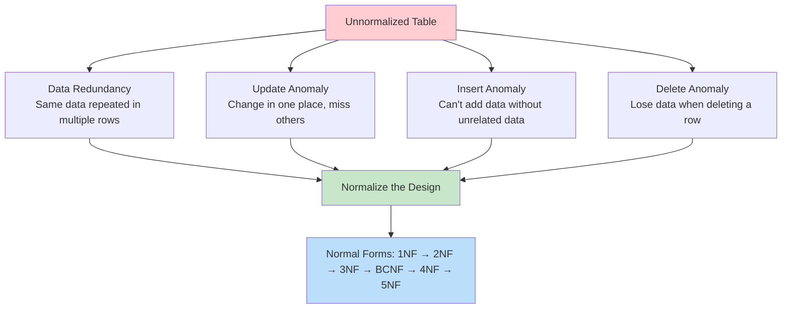
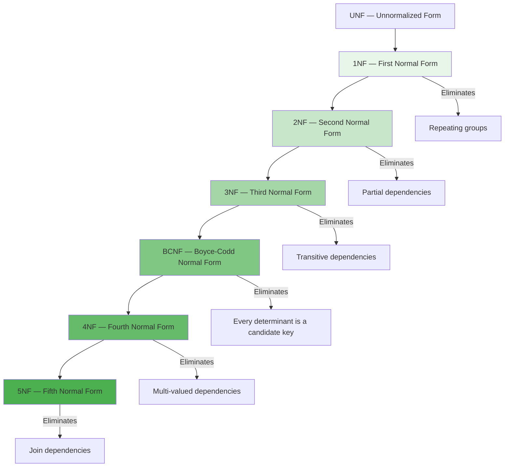

# Normalization

## Overview

**Normalization** is the process of organizing a relational database to reduce data redundancy and improve data integrity. It involves decomposing tables into smaller, well-structured tables and defining relationships between them. The goal is to isolate data so that additions, deletions, and modifications of a field can be made in just one table and propagated through the rest of the database via relationships.

## Why Normalize?



## Example: Anomalies in Unnormalized Data

Consider this `StudentCourses` table:

| student_id | student_name | course_id | course_name | instructor | dept | grade |
|---|---|---|---|---|---|---|
| 1 | Alice | CS101 | Databases | Dr. Smith | CS | A |
| 1 | Alice | CS102 | Networks | Dr. Jones | CS | B |
| 2 | Bob | CS101 | Databases | Dr. Smith | CS | A |
| 3 | Carol | CS103 | AI | Dr. Lee | CS | C |

### Anomalies

1. **Redundancy**: "Databases" and "Dr. Smith" repeated for every enrollment
2. **Update Anomaly**: If Dr. Smith changes, must update ALL rows with CS101
3. **Insert Anomaly**: Can't add a new course without a student enrolled
4. **Delete Anomaly**: Deleting Carol removes CS103 and Dr. Lee entirely

## Normal Forms Hierarchy



## Functional Dependencies

A **functional dependency** (FD) `X → Y` means that for every valid instance of a relation, if two tuples agree on X, they must agree on Y.

### Types of Functional Dependencies

| Type | Definition | Example |
|---|---|---|
| **Full FD** | Y depends on the whole of X, not any proper subset | {student_id, course_id} → grade |
| **Partial FD** | Y depends on a proper subset of X | {student_id, course_id} → student_name (depends on student_id alone) |
| **Transitive FD** | X → Z via an intermediate Y | student_id → dept → dept_head |
| **Trivial FD** | Y is a subset of X | {A, B} → A |
| **Non-trivial FD** | Y is not a subset of X | {A} → B |

### Armstrong's Axioms

Sound and complete inference rules for FDs:

1. **Reflexivity**: If Y ⊆ X, then X → Y
2. **Augmentation**: If X → Y, then XZ → YZ
3. **Transitivity**: If X → Y and Y → Z, then X → Z

Derived rules:
- **Union**: If X → Y and X → Z, then X → YZ
- **Decomposition**: If X → YZ, then X → Y and X → Z
- **Pseudo-transitivity**: If X → Y and WY → Z, then WX → Z

### Closure of Attribute Set

To find all attributes determined by a set X (denoted X⁺):

```
Algorithm: Compute X⁺
1. Initialize result = X
2. For each FD: if left side ⊆ result, add right side to result
3. Repeat step 2 until no more changes
4. Return result
```

Example: R(A, B, C, D) with FDs: A → B, B → C, A → D
- {A}⁺ = {A} → add B (A→B) → {A,B} → add C (B→C) → {A,B,C} → add D (A→D) → {A,B,C,D}
- {A} is a candidate key since {A}⁺ = all attributes

## Minimal Cover (Canonical Cover)

A minimal cover is a set of FDs that:
1. Has no redundant FDs
2. Each FD has a single attribute on the right
3. No attribute on the left is extraneous

```
Algorithm: Find Minimal Cover
1. Decompose all FDs to single attributes on right
   A → BC  becomes  A → B, A → C
2. Remove extraneous attributes from left sides
3. Remove redundant FDs
```

## Decomposition

### Lossless Join Decomposition

A decomposition of R into R1 and R2 is **lossless** if R1 ⋈ R2 = R (joining R1 and R2 reconstructs the original without spurious tuples).

**Test**: R1 ∩ R2 → R1 or R1 ∩ R2 → R2 (the common attributes must functionally determine one of the decomposed tables)

```sql
-- Lossless: R(student_id, name, dept, dept_head)
-- Decompose into:
-- R1(student_id, name, dept)  -- dept → dept_head
-- R2(dept, dept_head)
-- Common: {dept}
-- dept → dept_head ∈ FDs → lossless ✅

-- Lossy: R(A, B, C) with A → B
-- Decompose into:
-- R1(A, B), R2(B, C)
-- Common: {B}
-- B → A? No. B → C? No → lossy ❌
```

### Dependency Preservation

A decomposition is **dependency-preserving** if all FDs can be checked using only the decomposed tables (without joining).

```
Original: R(A, B, C) with FDs: A → B, B → C
Decompose: R1(A, B), R2(B, C)
- A → B checked in R1 ✅
- B → C checked in R2 ✅
→ Dependency preserving ✅
```

## Interview Questions

### Beginner

**Q1: What is normalization and why is it important?**
A: Normalization is the process of organizing database tables to minimize redundancy and dependency. It involves dividing large tables into smaller ones and linking them through relationships. Benefits: eliminates data redundancy, prevents anomalies (update, insert, delete), ensures data integrity, and reduces storage.

**Q2: What are the different types of anomalies?**
A: (1) **Update anomaly**: Changing data in one row but not in duplicate rows causes inconsistency. (2) **Insert anomaly**: Cannot insert data without unrelated data (e.g., can't add a course without a student). (3) **Delete anomaly**: Deleting a row removes unrelated data (e.g., deleting the last student in a course removes the course info).

**Q3: What is a functional dependency?**
A: A constraint between two sets of attributes. X → Y means "X functionally determines Y" — for any two tuples with the same X value, they must have the same Y value. Example: student_id → student_name (each student ID maps to exactly one name).

### Intermediate

**Q4: What is the difference between 3NF and BCNF?**
A: 3NF allows a prime attribute to be transitively dependent on a candidate key (if the determinant is a superkey OR the dependent is a prime attribute). BCNF is stricter: every determinant must be a candidate key. BCNF is always achievable and eliminates more anomalies, but may not preserve all dependencies.

**Q5: Can a table be in 3NF but not BCNF? Give an example.**
A: Yes. Consider R(student, course, instructor) where:
- Each student takes one course
- Each course has one instructor
- Each instructor teaches one course
- FDs: {student} → {course}, {course} → {instructor}, {instructor} → {course}
- Candidate keys: {student}, {instructor}
- {course} → {instructor}: course is not a superkey, but instructor is a prime attribute → 3NF OK
- But BCNF violated: {course} is a determinant but not a candidate key

**Q6: How do you test if a decomposition is lossless?**
A: For R1 and R2 from R: compute R1 ∩ R2 (common attributes). If (R1 ∩ R2) → R1 or (R1 ∩ R� R2) → R2 (checked against the original FDs), the decomposition is lossless.

### Advanced / FAANG-Level

**Q7: When would you intentionally denormalize?**
A: See [Denormalization](denormalization.md). Common reasons: read-heavy workloads where JOINs are expensive, real-time analytics dashboards, caching frequently accessed data, avoiding complex multi-table queries.

**Q8: Design a normalized schema for a hospital management system and then identify where you'd denormalize for performance.**
A: Normalized schema:
- Patient(patient_id PK, name, dob, gender, phone)
- Doctor(doctor_id PK, name, specialization, dept_id FK)
- Department(dept_id PK, name, building)
- Appointment(appt_id PK, patient_id FK, doctor_id FK, appt_time, status)
- Prescription(prescription_id PK, appt_id FK, medicine_id FK, dosage)
- Medicine(medicine_id PK, name, manufacturer)

Denormalize for:
- `Doctor.dept_name` — avoid JOIN with Department for common queries
- `Patient.age` — derived from dob, compute once for display
- `Appointment_summary` — materialized view for dashboards
- Keep normalized for write-heavy transactional tables

## Common Mistakes

- Over-normalizing: creating too many tables makes queries complex and slow
- Not understanding functional dependencies before normalizing
- Confusing 3NF with BCNF
- Forgetting about dependency preservation during decomposition
- Normalizing for the sake of normalization — practical systems need balance
- Not considering query patterns when designing schemas

## Summary

| Normal Form | Eliminates | Key Requirement |
|---|---|---|
| 1NF | Repeating groups, atomic values | All attributes are atomic |
| 2NF | Partial dependencies | Every non-prime attribute fully depends on every candidate key |
| 3NF | Transitive dependencies | Every non-prime attribute non-transitively depends on every candidate key |
| BCNF | Non-candidate-key determinants | Every determinant is a candidate key |
| 4NF | Multi-valued dependencies | No non-trivial MVDs except candidate keys |
| 5NF | Join dependencies | Every join dependency is implied by candidate keys |

## Cross-References

- [1NF](1nf.md) — First Normal Form
- [2NF](2nf.md) — Second Normal Form
- [3NF](3nf.md) — Third Normal Form
- [BCNF](bcnf.md) — Boyce-Codd Normal Form
- [4NF & 5NF](4nf-5nf.md) — Higher normal forms
- [Denormalization](denormalization.md) — When to break normalization
- [Relational Model](../relational-model/README.md) — Foundation concepts
- [Keys](../relational-model/keys.md) — Keys drive normalization


## Cross References

- [1NF](1nf.md)
- [3NF](3nf.md)
- [BCNF](bcnf.md)
- [Keys](../relational-model/keys.md)
