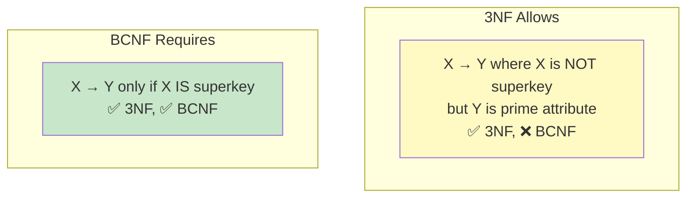
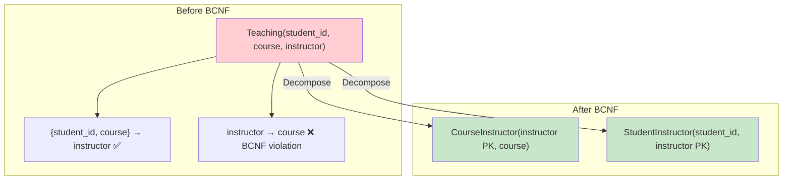

# Boyce-Codd Normal Form (BCNF)

## Overview

**Boyce-Codd Normal Form (BCNF)** is a stricter version of 3NF. A relation is in BCNF if every determinant is a candidate key. BCNF was proposed by Raymond Boyce and E.F. Codd to address cases where 3NF still allows anomalies due to overlapping candidate keys.

## Rule

A relation is in **BCNF** if:
1. It is in **3NF**
2. For every non-trivial functional dependency X → Y, **X is a superkey**

The difference from 3NF: 3NF allows X → Y where Y is a prime attribute even if X is not a superkey. BCNF does not.

## 3NF vs BCNF

```
3NF condition: X → Y requires X is superkey OR Y is prime attribute
BCNF condition: X → Y requires X is superkey (always)
```



## Classic BCNF Violation Example

Consider `Teaching(student_id, course, instructor)`:

| student_id | course | instructor |
|---|---|---|
| 1 | Databases | Dr. Smith |
| 1 | Networks | Dr. Jones |
| 2 | Databases | Dr. Smith |
| 3 | Databases | Dr. Lee |

**Business Rules:**
- Each student takes each course with one instructor
- Each course has specific instructors (one instructor per course per student)
- Each instructor teaches exactly one course

**Functional Dependencies:**
- {student_id, course} → instructor (student-course determines instructor)
- instructor → course (each instructor teaches one course)

**Candidate Keys:**
- {student_id, course} (from FD1)
- {student_id, instructor} (since instructor → course, {student_id, instructor} → all)

**BCNF Violation:**
- instructor → course
- instructor is NOT a superkey (it doesn't determine student_id)
- This violates BCNF

**3NF is satisfied because:**
- course is a prime attribute (part of candidate key {student_id, course})
- 3NF allows: X → Y where Y is prime, even if X isn't a superkey

## Converting to BCNF

Decompose to remove the violating FD:

```sql
-- Table 1: CourseInstructor (instructor → course)
CREATE TABLE CourseInstructor (
    instructor VARCHAR(100) PRIMARY KEY,
    course VARCHAR(100) NOT NULL
);

-- Table 2: StudentInstructor (student_id, instructor)
CREATE TABLE StudentInstructor (
    student_id INT,
    instructor VARCHAR(100),
    PRIMARY KEY (student_id, instructor),
    FOREIGN KEY (instructor) REFERENCES CourseInstructor(instructor)
);
```



## Dependency Preservation Issue

The BCNF decomposition above is **lossless** but **NOT dependency-preserving**:

- FD `{student_id, course} → instructor` cannot be checked without joining the two tables
- In the decomposed schema, you'd need to join to verify: "Does student 1 take Databases with Dr. Smith?"

This is the main trade-off: **BCNF always achieves lossless join, but may not preserve all dependencies.**

## BCNF Decomposition Algorithm

```
Algorithm: BCNF Decomposition
Input: Relation R with FDs F
1. If R is already in BCNF, return {R}
2. Find an FD X → Y that violates BCNF (X is not a superkey)
3. Decompose R into:
   - R1 = (X, Y)  -- the violating FD
   - R2 = (R - Y + X)  -- remaining attributes + X
4. Recursively apply to R1 and R2
5. Return the union of results
```

### Worked Example

R(A, B, C, D) with FDs: A → B, B → C, A → D

1. Candidate keys: {A} (A⁺ = {A,B,C,D})
2. Check A → B: A is superkey ✅
3. Check B → C: B is NOT superkey ❌ → violates BCNF
4. Decompose on B → C:
   - R1(B, C) with FD B → C
   - R2(A, B, D) with FDs A → B, A → D
5. Check R1: B is PK, no violations → BCNF ✅
6. Check R2: A is PK, all FDs have A on left → BCNF ✅
7. Result: R1(B, C), R2(A, B, D)

## Lossless Join Verification

For decomposition R1(X, Y) and R2(R - Y + X):
- R1 ∩ R2 = {X}
- X → Y holds (original FD)
- Therefore X → R1 (since R1 = X ∪ Y)
- Lossless join ✅

## When 3NF is Sufficient

In practice, most databases stop at 3NF because:
1. 3NF anomalies are rare (require overlapping candidate keys)
2. BCNF may not preserve dependencies
3. The overhead of checking dependencies via joins can be worse than the anomaly
4. Most real-world designs don't have overlapping candidate keys

## Interview Questions

### Beginner

**Q1: What is BCNF?**
A: BCNF is a stricter form of 3NF where every determinant (left side of an FD) must be a superkey. The only difference from 3NF: 3NF allows a non-superkey to determine a prime attribute; BCNF does not.

**Q2: What is a determinant?**
A: A determinant is any attribute or set of attributes that functionally determines other attributes. In X → Y, X is the determinant. BCNF requires every determinant to be a candidate key.

**Q3: When does BCNF differ from 3NF?**
A: When there are overlapping candidate keys and a non-superkey determines a prime attribute. Example: {student, course} and {student, instructor} are both candidate keys. instructor → course violates BCNF but satisfies 3NF (course is prime).

### Intermediate

**Q4: Can BCNF decomposition lose dependency preservation?**
A: Yes. The classic example is the Teaching table. After BCNF decomposition, the FD {student_id, course} → instructor cannot be checked without joining. This means the database can't enforce this constraint without a trigger or application logic.

**Q5: When should you choose 3NF over BCNF?**
A: When dependency preservation is more important than eliminating all anomalies. If the anomalies are rare or handled by application logic, but the lost dependencies would require expensive joins for constraint checking, 3NF is the better choice.

**Q6: Decompose to BCNF: R(A, B, C, D) with FDs: AB → C, C → D, D → B**
A:
1. Candidate keys: {A, B} (AB⁺ = {A,B,C,D}), {A, C} (AC⁺ = {A,C,D,B}), {A, D} (AD⁺ = {A,D,B,C})
2. Check C → D: C is not a superkey ❌ → violates BCNF
3. Decompose on C → D:
   - R1(C, D) with FD C → D
   - R2(A, B, C) with FD AB → C
4. Check R1: C is PK, no violations ✅
5. Check R2: {A,B} is PK, AB → C has AB as superkey ✅
6. Result: R1(C, D), R2(A, B, C)
7. But D → B is lost (not preserved)!

### Advanced / FAANG-Level

**Q7: Prove that BCNF decomposition is always lossless.**
A: At each decomposition step for FD X → Y:
- R1 = X ∪ Y, R2 = R - Y ∪ X
- R1 ∩ R2 = X
- X → Y holds (it's the violating FD)
- Since R1 = X ∪ Y, X → R1
- By the lossless join test (R1 ∩ R2 → R1), the join is lossless
- Recursion preserves losslessness (lossless decompositions composed are lossless)

**Q8: Design a BCNF schema for a shipping system where each ship belongs to one fleet, each fleet has a home port, and each port belongs to one region. Identify all FDs and decompose.**
A:
```
R(ship_id, ship_name, fleet, fleet_commander, home_port, region)
FDs:
  ship_id → ship_name, fleet, home_port
  fleet → fleet_commander
  home_port → region

Candidate key: {ship_id}

Violations:
  fleet → fleet_commander (fleet is not a superkey)
  home_port → region (home_port is not a superkey)

Decompose on fleet → fleet_commander:
  R1(fleet PK, fleet_commander)
  R2(ship_id, ship_name, fleet FK, home_port, region)

Check R2: home_port → region still violates BCNF
Decompose R2 on home_port → region:
  R3(home_port PK, region)
  R4(ship_id PK, ship_name, fleet FK, home_port FK)

Final: R1(fleet, fleet_commander), R3(home_port, region), R4(ship_id, ship_name, fleet, home_port)
All in BCNF, lossless, and dependency-preserved.
```

## Common Mistakes

- Confusing BCNF with 3NF — the difference is subtle but important for overlapping candidate keys
- Not checking for dependency preservation after BCNF decomposition
- Assuming BCNF is always better than 3NF
- Missing overlapping candidate keys when analyzing FDs
- Decomposing unnecessarily (table is already in BCNF)

## Summary

| Aspect | 3NF | BCNF |
|---|---|---|
| Condition | X → Y: X is superkey OR Y is prime | X → Y: X must be superkey |
| Dependency preservation | Always | Not guaranteed |
| Anomalies | Possible with overlapping keys | Eliminated |
| Practical use | Most common target | When anomalies matter |

## Cross-References

- [3NF](3nf.md) — Previous level: transitive dependencies
- [4NF & 5NF](4nf-5nf.md) — Higher normal forms
- [Normalization Overview](README.md) — Functional dependencies
- [Denormalization](denormalization.md) — When to break normalization


## Cross References

- [3NF](../dbms/normalization/3nf.md)
- [4NF/5NF](../dbms/normalization/4nf-5nf.md)
- [Keys](../dbms/relational-model/keys.md)
