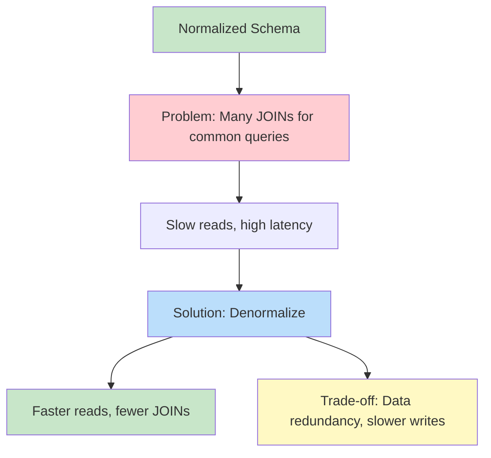
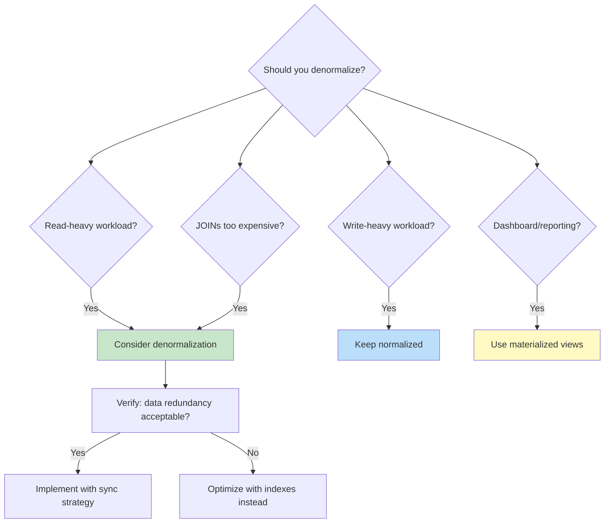
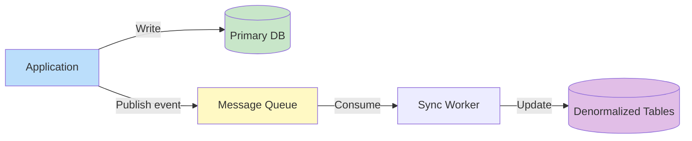

# Denormalization

## Overview

**Denormalization** is the deliberate introduction of redundancy into a normalized database to improve read performance. While normalization eliminates redundancy for data integrity, denormalization adds it back strategically to reduce expensive JOINs and improve query speed. It's the pragmatic counterbalance to normalization — used when read performance matters more than write efficiency.

## Why Denormalize?



## Normalized vs Denormalized

### Normalized (3NF)

```sql
-- Orders query requires 3 JOINs
SELECT o.order_id, c.name, p.product_name, oi.quantity, p.price
FROM Orders o
JOIN Customers c ON o.customer_id = c.customer_id
JOIN OrderItems oi ON o.order_id = oi.order_id
JOIN Products p ON oi.product_id = p.product_id
WHERE o.order_date > '2024-01-01';
```

### Denormalized

```sql
-- Single table, no JOINs
CREATE TABLE OrderSummary (
    order_id INT,
    order_date DATE,
    customer_id INT,
    customer_name VARCHAR(100),  -- Denormalized from Customers
    product_id INT,
    product_name VARCHAR(200),   -- Denormalized from Products
    product_price DECIMAL(10,2), -- Denormalized from Products
    quantity INT,
    item_total DECIMAL(10,2)     -- Pre-computed
);

-- Simple query, no JOINs
SELECT order_id, customer_name, product_name, quantity, item_total
FROM OrderSummary
WHERE order_date > '2024-01-01';
```

## Denormalization Techniques

### 1. Redundant Columns

Copy frequently accessed columns from related tables.

```sql
-- Normalized: requires JOIN
-- SELECT o.order_id, c.name FROM Orders o JOIN Customers c ON ...

-- Denormalized: store customer_name in Orders
ALTER TABLE Orders ADD COLUMN customer_name VARCHAR(100);
-- Must update when customer name changes
```

### 2. Precomputed/Calculated Columns

Store derived values to avoid computation at query time.

```sql
-- Normalized: compute at query
-- SELECT order_id, SUM(quantity * price) FROM OrderItems GROUP BY order_id

-- Denormalized: store total in Orders
ALTER TABLE Orders ADD COLUMN total DECIMAL(10,2);
-- Must update when order items change
```

### 3. Materialized Views

Pre-computed query results stored as a table.

```sql
-- PostgreSQL
CREATE MATERIALIZED VIEW MonthlySales AS
SELECT
    DATE_TRUNC('month', order_date) AS month,
    product_id,
    SUM(quantity) AS total_quantity,
    SUM(quantity * price) AS total_revenue
FROM Orders
JOIN OrderItems USING (order_id)
GROUP BY 1, 2;

-- Refresh periodically
REFRESH MATERIALIZED VIEW CONCURRENTLY MonthlySales;
```

### 4. Summary/Aggregate Tables

Pre-aggregated data for dashboards and reports.

```sql
CREATE TABLE DailyMetrics (
    metric_date DATE PRIMARY KEY,
    total_orders INT,
    total_revenue DECIMAL(12,2),
    unique_customers INT,
    avg_order_value DECIMAL(10,2)
);
-- Updated by trigger, scheduled job, or application
```

### 5. Flattened/Hierarchical Data

Combine parent-child relationships into a single table.

```sql
-- Normalized: separate tables
-- Categories(id, name, parent_id)

-- Denormalized: store full path
CREATE TABLE Products (
    product_id INT PRIMARY KEY,
    name VARCHAR(200),
    category_id INT,
    category_name VARCHAR(100),      -- Denormalized
    parent_category_name VARCHAR(100) -- Denormalized
);
```

### 6. JSON/Array Columns

Store related data in a single row.

```sql
-- Normalized: separate table for tags
-- ProductTags(product_id, tag)

-- Denormalized: JSON column
ALTER TABLE Products ADD COLUMN tags JSONB;
-- {"tags": ["electronics", "sale", "new-arrival"]}
```

## When to Denormalize



### Denormalize When:
- Read-to-write ratio is high (10:1 or more)
- JOINs are too expensive (many tables, large datasets)
- Real-time analytics dashboards need fast reads
- The same expensive query runs thousands of times per second
- Caching layer (Redis) isn't sufficient

### Don't Denormalize When:
- Write-heavy workload (redundancy slows writes)
- Data consistency is critical (financial, medical)
- The JOINs are already fast (proper indexes)
- The schema is still evolving
- Storage is constrained

## Keeping Denormalized Data Consistent

The biggest challenge: redundant data must stay in sync.

### Option 1: Application-Level Sync

```python
# In application code
def update_customer_name(customer_id, new_name):
    db.execute("UPDATE Customers SET name = %s WHERE id = %s", (new_name, customer_id))
    db.execute("UPDATE Orders SET customer_name = %s WHERE customer_id = %s", (new_name, customer_id))
    db.execute("UPDATE OrderSummary SET customer_name = %s WHERE customer_id = %s", (new_name, customer_id))
```

**Pros**: Simple. **Cons**: Error-prone, can miss updates, distributed transactions.

### Option 2: Database Triggers

```sql
CREATE OR REPLACE FUNCTION sync_customer_name()
RETURNS TRIGGER AS $$
BEGIN
    IF OLD.name != NEW.name THEN
        UPDATE Orders SET customer_name = NEW.name WHERE customer_id = NEW.customer_id;
        UPDATE OrderSummary SET customer_name = NEW.name WHERE customer_id = NEW.customer_id;
    END IF;
    RETURN NEW;
END;
$$ LANGUAGE plpgsql;

CREATE TRIGGER trg_sync_customer_name
AFTER UPDATE ON Customers
FOR EACH ROW EXECUTE FUNCTION sync_customer_name();
```

**Pros**: Automatic, consistent. **Cons**: Hidden side effects, performance overhead, hard to debug.

### Option 3: Event-Driven (Asynchronous)



**Pros**: Decoupled, scalable, doesn't slow writes. **Cons**: Eventual consistency, complexity.

### Option 4: Materialized View Refresh

```sql
-- Scheduled refresh
REFRESH MATERIALIZED VIEW CONCURRENTLY MonthlySales;
-- Or trigger-based refresh
```

## Denormalization in NoSQL

Denormalization is a first-class concept in NoSQL databases:

```javascript
// MongoDB: Embed related data
{
    order_id: 1001,
    customer: {  // Denormalized from Customers collection
        name: "Alice",
        email: "alice@example.com"
    },
    items: [
        { product_name: "Laptop", price: 999.99, quantity: 1 }
    ]
}
```

NoSQL databases are designed for denormalized data because they don't support JOINs efficiently.

## Interview Questions

### Beginner

**Q1: What is denormalization?**
A: Denormalization is adding controlled redundancy to a normalized database to improve read performance. It involves storing derived or related data in the same table to avoid expensive JOINs. Trade-off: faster reads but slower writes and potential data inconsistency.

**Q2: When should you denormalize?**
A: When read performance is critical and JOINs are too expensive. Common scenarios: analytics dashboards, real-time reporting, high-read applications (e-commerce product pages), and when the same complex query runs very frequently.

**Q3: What's the risk of denormalization?**
A: Data inconsistency — if redundant data isn't properly synchronized, different queries may return different results for the same data. Also: slower writes (must update multiple places), increased storage, and more complex application logic.

### Intermediate

**Q4: How do you keep denormalized data consistent?**
A: Options: (1) Application-level sync (simple but error-prone), (2) Database triggers (automatic but adds overhead), (3) Event-driven async updates (scalable but eventually consistent), (4) Materialized views (database-managed refresh). The choice depends on consistency requirements and latency tolerance.

**Q5: Should you denormalize a User table to include order_count?**
A: It depends. If you display order count on every user list page (high read frequency) and orders are infrequent (low write frequency), yes — store it as a column updated by trigger or application. If order counts are only needed occasionally, use a COUNT query or materialized view instead.

**Q6: Compare denormalization with caching (Redis).**
A: **Denormalization**: Pre-joined/pre-computed data stored in the database. Consistent with database transactions, no separate infrastructure. **Caching**: Frequently accessed data stored in memory (Redis). Faster reads but requires cache invalidation strategy. Use both: cache hot data, denormalize for complex queries.

### Advanced / FAANG-Level

**Q7: Design a denormalized schema for a social media feed (2B users).**
A:
```sql
-- Denormalized feed table (pre-computed per user)
CREATE TABLE UserFeed (
    user_id BIGINT,
    feed_position INT,  -- 1 = most recent
    post_id BIGINT,
    author_id BIGINT,
    author_name VARCHAR(100),    -- Denormalized
    author_avatar_url VARCHAR(500), -- Denormalized
    content TEXT,
    media_urls JSONB,            -- Denormalized
    like_count INT,              -- Pre-aggregated
    comment_count INT,           -- Pre-aggregated
    created_at TIMESTAMP,
    PRIMARY KEY (user_id, feed_position)
);

-- Feed generation: async worker pre-computes feed for each user
-- Updated when: followed user posts, post gets likes/comments
-- Read pattern: SELECT * FROM UserFeed WHERE user_id = ? ORDER BY feed_position LIMIT 20
-- Single table scan, no JOINs, O(1) per user
```

**Q8: How do you handle denormalization in a microservices architecture?**
A: Each service owns its data. Denormalization happens at the API gateway or read-model layer:
1. **CQRS (Command Query Responsibility Segregation)**: Write to normalized models, read from denormalized read models
2. **Event sourcing**: Services publish events, a read-model service subscribes and builds denormalized views
3. **API composition**: Gateway calls multiple services and joins data in memory
4. **Database per service + CDC**: Change Data Capture streams database changes to a denormalized read store (Elasticsearch, read-optimized DB)

## Common Mistakes

- Denormalizing too early (optimize queries and indexes first)
- Not having a sync strategy for redundant data
- Denormalizing write-heavy tables
- Not documenting which columns are denormalized and where the source of truth is
- Storing frequently changing data as denormalized (sync overhead)
- Confusing denormalization with "bad design" — it's a deliberate optimization

## Summary

| Approach | Read Speed | Write Speed | Consistency | Use Case |
|---|---|---|---|---|
| Normalized | Slower (JOINs) | Fast | Strong | OLTP, transactional |
| Denormalized | Fast (no JOINs) | Slower (redundancy) | Eventual/managed | OLAP, read-heavy |
| Materialized View | Fast | N/A (refresh) | Stale until refresh | Reporting, dashboards |
| Caching (Redis) | Fastest | N/A (invalidation) | Potentially stale | Hot data, sessions |

## Cross-References

- [Normalization Overview](README.md) — Why normalize
- [3NF](3nf.md) — The normalization target to start from
- [Views](../sql/views.md) — Materialized views for denormalization
- [Indexes](../indexing/README.md) — Indexes before denormalization
- [Query Tuning](../indexing/tuning.md) — Optimize before denormalizing
