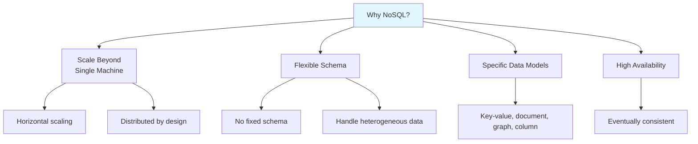
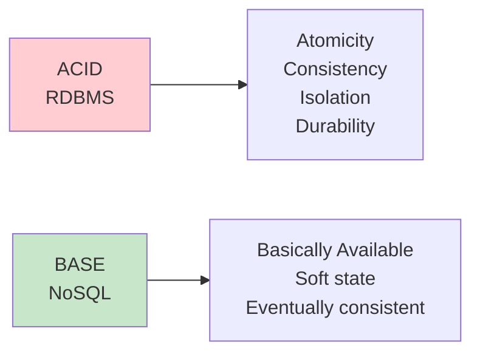
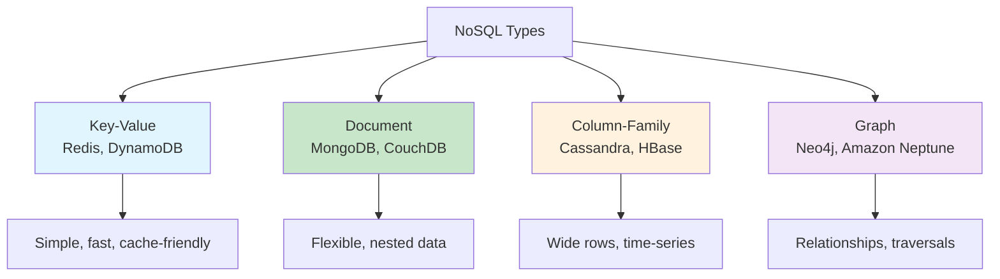
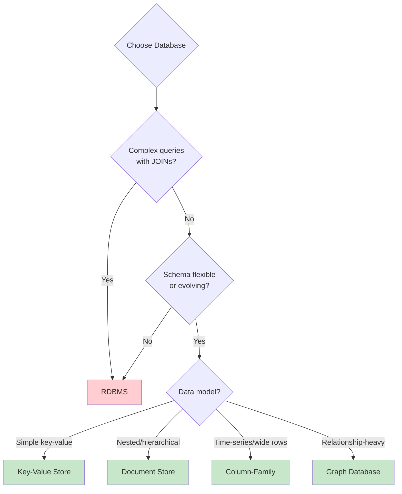

# NoSQL Databases

## Overview

NoSQL (Not Only SQL) databases are non-relational databases designed for specific data models, horizontal scalability, and high availability. They emerged in the late 2000s to address limitations of traditional RDBMS for web-scale applications: massive data volumes, high write throughput, flexible schemas, and distributed architectures.

## Detailed Explanation

### Why NoSQL?

### NoSQL vs. RDBMS

| Aspect | RDBMS | NoSQL |
|--------|-------|-------|
| **Schema** | Fixed, predefined | Dynamic, flexible |
| **Scaling** | Vertical (bigger machine) | Horizontal (more machines) |
| **Data Model** | Tables, rows, columns | Various (key-value, document, etc.) |
| **ACID** | Full ACID | BASE (eventual consistency) |
| **Joins** | Supported | Limited or none |
| **Query Language** | SQL | Database-specific |
| **Best For** | Complex queries, transactions | Scale, flexibility, specific patterns |

### ACID vs. BASE

| Property | ACID (RDBMS) | BASE (NoSQL) |
|----------|-------------|--------------|
| **Consistency** | Strong | Eventual |
| **Availability** | Lower (waits for consistency) | Higher (always responds) |
| **Transactions** | Full support | Limited |
| **Scalability** | Vertical | Horizontal |

### Types of NoSQL Databases

### Comparison at a Glance

| Type | Data Model | Query Pattern | Scalability | Example |
|------|-----------|---------------|-------------|---------|
| **Key-Value** | Key → Value | Get by key | Excellent | Redis, DynamoDB |
| **Document** | JSON/BSON docs | Query by field | Good | MongoDB, CouchDB |
| **Column-Family** | Rows × Columns | Scan by row/column | Excellent | Cassandra, HBase |
| **Graph** | Nodes + Edges | Traverse relationships | Limited | Neo4j, Neptune |

### CAP Classification

| System | Type | CAP | Consistency |
|--------|------|-----|-------------|
| **Redis** | Key-Value | CP | Strong (single node) |
| **DynamoDB** | Key-Value | AP | Tunable |
| **MongoDB** | Document | CP | Tunable |
| **CouchDB** | Document | AP | Eventual |
| **Cassandra** | Column-Family | AP | Tunable |
| **HBase** | Column-Family | CP | Strong |
| **Neo4j** | Graph | CA (single node) | Strong |
| **Amazon Neptune** | Graph | CP | Strong |

### When to Use NoSQL vs. RDBMS

## Topics in This Section

### 1. [Key-Value Stores](./key-value.md)
Redis, DynamoDB, Riak — simple, fast, horizontally scalable.

### 2. [Document Databases](./document.md)
MongoDB, CouchDB — flexible schema, nested data, rich queries.

### 3. [Column-Family Stores](./column-family.md)
Cassandra, HBase — wide rows, time-series, high write throughput.

### 4. [Graph Databases](./graph.md)
Neo4j, Amazon Neptune — relationships, traversals, social networks.

### 5. [NewSQL](./newsql.md)
CockroachDB, TiDB, Spanner — SQL + distributed scalability.

## Interview Focus Areas

1. **When to choose NoSQL over RDBMS?** — Schema flexibility, scale requirements, data model fit
2. **What are the trade-offs?** — Consistency vs. availability, joins vs. scalability
3. **How does each type work?** — Data model, query patterns, scaling mechanism
4. **What is BASE?** — Basically Available, Soft state, Eventually consistent
5. **Polyglot persistence** — Using multiple database types for different needs

## Cross-References

- [CAP Theorem](../distributed/cap.md) — NoSQL trade-offs
- [Consistency Models](../distributed/consistency.md) — NoSQL consistency guarantees
- [Sharding](../distributed/sharding.md) — how NoSQL scales
- [Replication](../distributed/replication.md) — how NoSQL replicates
- [Buffer Management](../storage/buffer-management.md) — underlying storage
