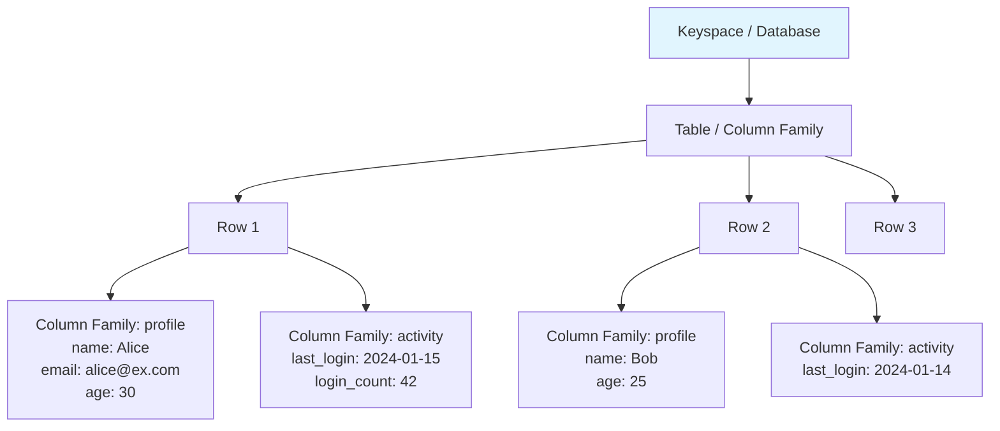
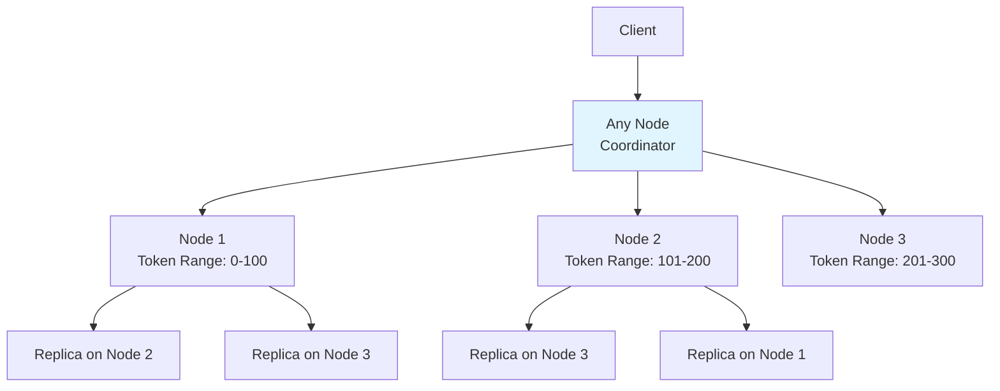
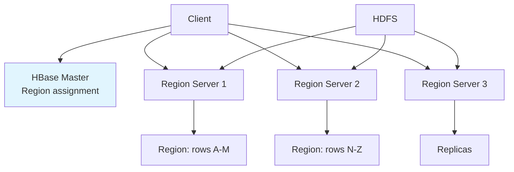
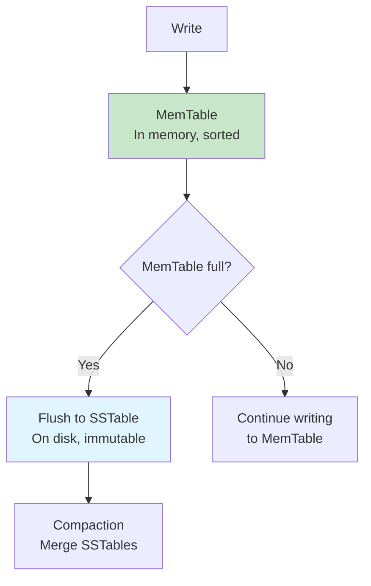

# Column-Family Stores

## Overview

Column-family stores (also called wide-column stores) organize data into **rows** and **column families** — groups of columns that are stored together. Unlike traditional relational databases where all rows have the same columns, column-family stores allow each row to have different columns within a column family. They're designed for massive scale, high write throughput, and efficient reads of wide rows.

## Detailed Explanation

### Data Model



**Key difference from RDBMS:**
- Each row can have different columns
- Columns are grouped into families
- Sparse data is stored efficiently (no NULLs)
- Wide rows can have millions of columns

### Cassandra Data Model

```sql
-- Keyspace (like database)
CREATE KEYSPACE myapp WITH replication = {
  'class': 'NetworkTopologyStrategy',
  'datacenter1': 3
};

-- Table (column family)
CREATE TABLE users (
  user_id UUID PRIMARY KEY,
  name TEXT,
  email TEXT,
  age INT
);

-- Wide row example (time-series)
CREATE TABLE user_activity (
  user_id UUID,
  activity_time TIMESTAMP,
  action TEXT,
  details TEXT,
  PRIMARY KEY (user_id, activity_time)
) WITH CLUSTERING ORDER BY (activity_time DESC);
```

### Cassandra Query Language (CQL)

```sql
-- Insert
INSERT INTO users (user_id, name, email, age)
VALUES (uuid(), 'Alice', 'alice@example.com', 30);

-- Query by partition key
SELECT * FROM users WHERE user_id = ?;

-- Query by partition key + clustering key range
SELECT * FROM user_activity 
WHERE user_id = ? 
AND activity_time > '2024-01-01' 
AND activity_time < '2024-02-01';

-- Batch (atomic within a partition)
BEGIN BATCH
  INSERT INTO users (user_id, name) VALUES (?, 'Alice');
  INSERT INTO user_activity (user_id, activity_time, action) 
    VALUES (?, now(), 'signup');
APPLY BATCH;
```

### Cassandra Architecture



**Cassandra characteristics:**
- **Masterless** — Every node is equal (no leader)
- **Peer-to-peer** — Any node can handle any request
- **Consistent hashing** — Data distributed by partition key hash
- **Tunable consistency** — Per-query consistency level

### Partition Key and Clustering Key

```sql
PRIMARY KEY (partition_key, clustering_key)
```

| Key Type | Purpose | Access Pattern |
|----------|---------|---------------|
| **Partition Key** | Determines which node stores the data | Must be in WHERE clause |
| **Clustering Key** | Sorts data within a partition | Range queries within partition |

**Example:**
```sql
CREATE TABLE messages (
  channel_id UUID,        -- Partition key
  message_time TIMESTAMP, -- Clustering key
  sender TEXT,
  content TEXT,
  PRIMARY KEY (channel_id, message_time)
) WITH CLUSTERING ORDER BY (message_time DESC);

-- Efficient: All messages for a channel, sorted by time
SELECT * FROM messages WHERE channel_id = ?;

-- Efficient: Recent messages for a channel
SELECT * FROM messages WHERE channel_id = ? 
AND message_time > '2024-01-15';

-- INEFFICIENT: Requires scanning ALL partitions
SELECT * FROM messages WHERE sender = 'Alice';  -- Full scan!
```

### Consistency Levels

```sql
-- Write consistency
CONSISTENCY QUORUM;    -- Majority of replicas
CONSISTENCY ALL;       -- All replicas
CONSISTENCY ONE;       -- Just one replica
CONSISTENCY LOCAL_QUORUM; -- Majority in local datacenter

-- Read consistency
CONSISTENCY QUORUM;    -- Read from majority
CONSISTENCY ONE;       -- Read from one (fast, may be stale)
```

**Quorum formula:**
```
Strong consistency: W + R > N
  W = write consistency (number of replicas)
  R = read consistency (number of replicas)
  N = replication factor

Example: N=3, W=2, R=2 → 2+2=4 > 3 → Strong consistency
Example: N=3, W=1, R=1 → 1+1=2 < 3 → Eventual consistency
```

### HBase (Hadoop)

Another major column-family store:



| Aspect | Cassandra | HBase |
|--------|-----------|-------|
| **Architecture** | Masterless, peer-to-peer | Master-slave |
| **Storage** | LSM-tree on local disk | HDFS (Hadoop) |
| **Consistency** | Tunable (AP default) | Strong (CP) |
| **Query** | CQL (SQL-like) | Get/Scan/Filter API |
| **Best for** | High availability, multi-DC | Strong consistency, Hadoop ecosystem |

### LSM-Tree Storage Engine

Column-family stores typically use LSM-trees (Log-Structured Merge Trees):



**Write path:**
1. Write to WAL (durability)
2. Write to MemTable (in-memory sorted structure)
3. When MemTable is full, flush to SSTable (on disk)
4. Background compaction merges SSTables

**Read path:**
1. Check MemTable
2. Check SSTables (newest first)
3. Use Bloom filters to skip SSTables

### Use Cases

| Use Case | Why Column-Family |
|----------|-------------------|
| **Time-series data** | Clustering by timestamp, efficient range scans |
| **IoT sensor data** | High write throughput, wide rows |
| **Event logging** | Append-only, time-ordered |
| **Messaging** | Partition by channel, sort by time |
| **Recommendation engines** | User-item matrices |
| **Fraud detection** | Real-time activity tracking |

## Interview Questions

### Q1: What is the difference between column-family stores and column stores?
**Answer:** Despite similar names, they're different:
- **Column-family stores** (Cassandra, HBase): Wide rows with flexible columns within families. Data is organized by row, with columns grouped into families. Good for OLTP and time-series.
- **Column stores** (Parquet, ClickHouse): Store data column-by-column for analytical queries. Each column is stored separately. Good for OLAP.

Cassandra stores data by row (within a partition); ClickHouse stores data by column.

### Q2: How does Cassandra achieve high availability?
**Answer:** Cassandra is designed for AP (Availability + Partition tolerance):
1. **Masterless architecture** — Any node can handle any request
2. **Tunable consistency** — Can choose ONE for writes (fast, available)
3. **Multiple replicas** — Data replicated to N nodes
4. **Hinted handoff** — If target node is down, another node holds writes temporarily
5. **Read repair** — Stale replicas are repaired during reads
6. **Anti-entropy** — Background Merkle tree comparison

### Q3: What is a partition key vs. clustering key?
**Answer:**
- **Partition key**: Determines which node stores the row. All rows with the same partition key are on the same node. Queries MUST include the partition key.
- **Clustering key**: Determines the sort order of data within a partition. Enables range queries within a partition.

Example: `PRIMARY KEY (user_id, timestamp)` — user_id is partition key (all user's data on one node), timestamp is clustering key (sorted within user's data).

### Q4: Why are writes faster in LSM-tree based databases?
**Answer:** LSM-trees convert random writes into sequential writes:
1. Write to MemTable (in memory) — O(log N), very fast
2. When full, flush to SSTable (sequential disk write)
3. No random disk I/O for writes

Compare to B-tree: Every write requires reading a page, modifying it, writing it back (random I/O). LSM-trees batch writes and flush sequentially, which is 10-100x faster on HDD.

### Q5: When would you choose Cassandra over MongoDB?
**Answer:** Choose Cassandra when:
1. **High write throughput** — Millions of writes per second
2. **Time-series data** — Natural fit for clustering keys
3. **Multi-datacenter** — Masterless replication across DCs
4. **High availability** — Must always accept writes (AP)
5. **Predictable latency** — No compaction pauses (usually)

Choose MongoDB when:
1. **Rich queries** — Aggregation pipeline, $lookup
2. **Flexible schema** — Different document structures
3. **Transactions** — Multi-document ACID
4. **Secondary indexes** — Multiple query patterns

## Common Mistakes

- ❌ **Not including partition key in queries** — Results in full cluster scan
- ❌ **Hot partitions** — One partition receiving too much traffic
- ❌ **Large partitions** — Partitions growing unbounded (>100MB)
- ❌ **Too many columns per row** — Millions of columns can cause issues
- ❌ **Using ALLOW FILTERING** — Scans all partitions, very slow

## Summary

| Aspect | Details |
|--------|---------|
| **Data Model** | Rows with flexible column families |
| **Storage** | LSM-tree (Cassandra), HDFS (HBase) |
| **Scaling** | Horizontal, consistent hashing |
| **Consistency** | Tunable (Cassandra), Strong (HBase) |
| **Best For** | Time-series, IoT, high write throughput |
| **Examples** | Cassandra, HBase, ScyllaDB |

Column-family stores excel at write-heavy, time-series, and wide-row workloads. Understanding partition keys and clustering keys is essential for effective data modeling.

## Cross-References

- [Key-Value Stores](./key-value.md) — simpler alternative
- [Document Databases](./document.md) — alternative for nested data
- [LSM Trees](../internals/lsm-trees.md) — storage engine used by column-family stores
- [Sharding](../distributed/sharding.md) — how data is partitioned
- [CAP Theorem](../distributed/cap.md) — Cassandra's AP design


## Cross References

- [Column Stores](../dbms/storage/column-stores.md)
- [LSM Trees](../dbms/internals/lsm-trees.md)
- [Consistent Hashing](../distributed/partitioning/consistent-hashing.md)
- [Sharding](../dbms/distributed/sharding.md)
