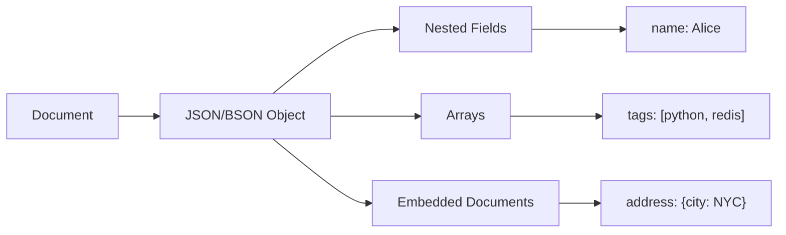
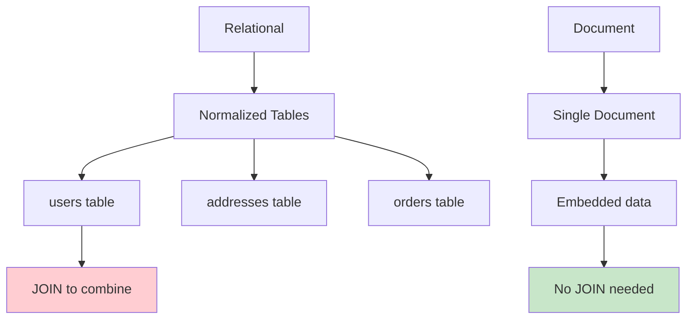
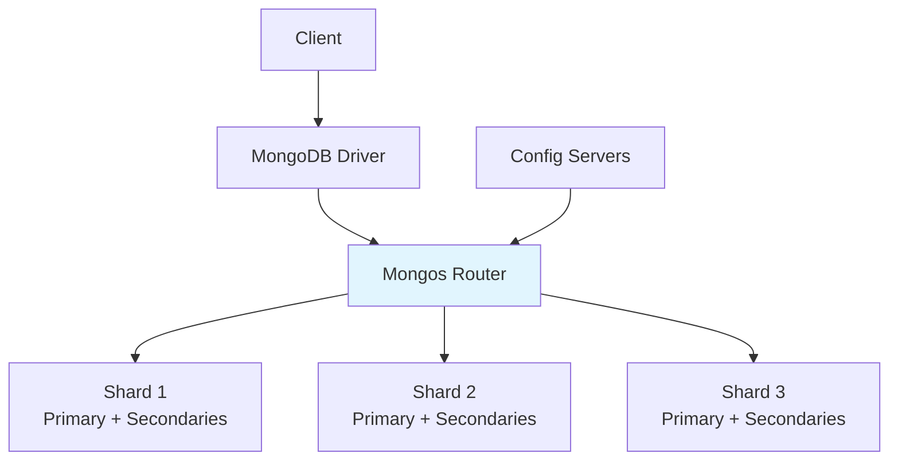

# Document Databases

## Overview

Document databases store data as **documents** (typically JSON, BSON, or XML) rather than rows and columns. Each document is self-contained and can have a different structure, making them ideal for applications with evolving schemas, nested data, and hierarchical relationships. MongoDB is the most popular document database, used by companies like Forbes, eBay, and Coinbase.

## Detailed Explanation

### Data Model



**Example document (MongoDB):**
```json
{
  "_id": ObjectId("507f1f77bcf86cd799439011"),
  "name": "Alice Johnson",
  "email": "alice@example.com",
  "age": 30,
  "address": {
    "street": "123 Main St",
    "city": "New York",
    "state": "NY",
    "zip": "10001"
  },
  "hobbies": ["reading", "hiking", "coding"],
  "orders": [
    {"id": 1, "amount": 99.99, "date": "2024-01-15"},
    {"id": 2, "amount": 149.99, "date": "2024-02-20"}
  ],
  "created_at": ISODate("2024-01-01T00:00:00Z")
}
```

### Document vs. Relational



| Aspect | Relational | Document |
|--------|-----------|----------|
| **Schema** | Fixed columns per table | Flexible per document |
| **Nested data** | Separate tables, JOIN | Embedded in document |
| **Array data** | Separate table, FK | Native array support |
| **Schema evolution** | ALTER TABLE (expensive) | Just add fields |
| **Transactions** | Full ACID | Limited (multi-doc in MongoDB 4.0+) |

### MongoDB Architecture



**MongoDB components:**
| Component | Role |
|-----------|------|
| **mongod** | Database server process |
| **mongos** | Query router for sharded clusters |
| **Config server** | Metadata, shard mapping |
| **Replica set** | Group of mongod instances with one primary |

### MongoDB Operations

```javascript
// Insert
db.users.insertOne({
  name: "Alice",
  email: "alice@example.com",
  age: 30
})

// Find
db.users.find({ age: { $gt: 25 } })
db.users.find({ "address.city": "New York" })
db.users.find({ hobbies: "reading" })  // Array contains

// Update
db.users.updateOne(
  { _id: ObjectId("...") },
  { $set: { age: 31 }, $push: { hobbies: "swimming" } }
)

// Delete
db.users.deleteOne({ _id: ObjectId("...") })

// Aggregation
db.orders.aggregate([
  { $match: { status: "completed" } },
  { $group: { _id: "$customer_id", total: { $sum: "$amount" } } },
  { $sort: { total: -1 } },
  { $limit: 10 }
])
```

### Embedding vs. Referencing

**Embedding (denormalized):**
```json
{
  "user_id": 1,
  "name": "Alice",
  "orders": [
    {"id": 1, "amount": 99.99},
    {"id": 2, "amount": 149.99}
  ]
}
```
- ✅ Single query retrieves everything
- ✅ Atomic updates
- ❌ Document size limit (16MB in MongoDB)
- ❌ Redundant data if orders referenced elsewhere

**Referencing (normalized):**
```json
// users collection
{"_id": 1, "name": "Alice", "order_ids": [1, 2]}

// orders collection
{"_id": 1, "user_id": 1, "amount": 99.99}
{"_id": 2, "user_id": 1, "amount": 149.99}
```
- ✅ No duplication
- ✅ Can update orders independently
- ❌ Requires multiple queries or $lookup (JOIN)
- ❌ No atomic updates across collections

### Indexing in Document Databases

```javascript
// Single field index
db.users.createIndex({ email: 1 })

// Compound index
db.users.createIndex({ age: 1, name: 1 })

// Text index
db.articles.createIndex({ content: "text" })

// Geospatial index
db.places.createIndex({ location: "2dsphere" })

// Array index (multikey)
db.users.createIndex({ hobbies: 1 })

// Partial index
db.users.createIndex(
  { email: 1 },
  { partialFilterExpression: { email: { $exists: true } } }
)
```

### Query Optimization

```javascript
// Explain plan
db.users.find({ age: { $gt: 25 } }).explain("executionStats")

// Key metrics:
// - totalDocsExamined: should be close to nReturned
// - totalKeysExamined: index entries scanned
// - executionTimeMillis: actual time
// - stage: "COLLSCAN" (bad) vs "IXSCAN" (good)
```

### Schema Validation

```javascript
db.createCollection("users", {
  validator: {
    $jsonSchema: {
      bsonType: "object",
      required: ["name", "email"],
      properties: {
        name: { bsonType: "string" },
        email: { bsonType: "string", pattern: "^.+@.+$" },
        age: { bsonType: "int", minimum: 0, maximum: 150 }
      }
    }
  }
})
```

### CouchDB

Another popular document database with unique features:

| Feature | MongoDB | CouchDB |
|---------|---------|---------|
| **Data model** | BSON documents | JSON documents |
| **Query** | MQL (find, aggregate) | MapReduce views, Mango |
| **Replication** | Replica sets | Multi-master replication |
| **Conflict resolution** | Last-write-wins | Application-defined |
| **API** | Binary protocol | HTTP/REST |
| **Offline** | No | Yes (Couchbase Lite) |

## Interview Questions

### Q1: When would you choose a document database over a relational database?
**Answer:** Choose document database when:
1. **Flexible/hierarchical data** — Data varies between records or is deeply nested
2. **Rapid iteration** — Schema changes frequently, no ALTER TABLE
3. **Denormalized data** — Read-heavy, want to avoid JOINs
4. **JSON-native** — Application works with JSON naturally
5. **Horizontal scaling** — Need to shard across machines

Choose relational when:
- Complex queries with JOINs and aggregations
- Strong ACID transactions required
- Data is highly relational
- Strict schema enforcement needed

### Q2: What is the difference between embedding and referencing?
**Answer:**
- **Embedding**: Store related data inside the document (denormalization). One query gets everything. Good for 1:1 or 1:few relationships.
- **Referencing**: Store related data in separate documents with IDs (normalization). Requires multiple queries. Good for 1:many or many:many relationships.

Rule of thumb: Embed if data is always accessed together and the relationship is 1:few. Reference if data grows unbounded or is accessed independently.

### Q3: How does MongoDB handle transactions?
**Answer:** MongoDB supports multi-document ACID transactions since version 4.0:
```javascript
session.startTransaction()
try {
  db.accounts.updateOne({ _id: 1 }, { $inc: { balance: -100 } }, { session })
  db.accounts.updateOne({ _id: 2 }, { $inc: { balance: 100 } }, { session })
  session.commitTransaction()
} catch (e) {
  session.abortTransaction()
}
```
However, transactions have performance overhead. Single-document operations are always atomic in MongoDB. Design your schema to minimize the need for multi-document transactions.

### Q4: What is the document size limit in MongoDB?
**Answer:** MongoDB has a **16MB document size limit**. This prevents individual documents from consuming excessive resources. If you need to store more data:
1. Use GridFS (chunks large files into multiple documents)
2. Normalize into separate collections with references
3. Split large arrays into separate documents

### Q5: How do document databases handle schema evolution?
**Answer:** Document databases are **schema-flexible** — each document can have different fields. To evolve:
1. **Add new fields** — Just include them in new documents; old documents are unaffected
2. **Rename fields** — Update documents in batches or use views/aliases
3. **Change field types** — Migrate documents gradually
4. **Add validation** — Use schema validation to enforce new rules going forward

This is much easier than ALTER TABLE in relational databases, which can lock the table.

## Common Mistakes

- ❌ **Treating it like a relational database** — No JOINs, different query patterns
- ❌ **Unbounded arrays** — Arrays that grow without limit hit the 16MB limit
- ❌ **Not indexing query fields** — Full collection scans are slow
- ❌ **Over-embedding** — Embedding data that changes frequently causes update anomalies
- ❌ **Ignoring data duplication** — Denormalization means duplicate data that must be kept in sync

## Summary

| Aspect | Details |
|--------|---------|
| **Data Model** | JSON/BSON documents |
| **Schema** | Flexible, per-document |
| **Nesting** | Native support for nested objects and arrays |
| **Transactions** | Multi-document ACID (since 4.0) |
| **Scaling** | Horizontal via sharding |
| **Best For** | Flexible schema, hierarchical data, rapid iteration |
| **Examples** | MongoDB, CouchDB, Amazon DocumentDB |

Document databases are the most popular NoSQL type, offering a good balance of flexibility, performance, and query capability.

## Cross-References

- [Key-Value Stores](./key-value.md) — simpler alternative
- [Column-Family Stores](./column-family.md) — alternative for wide data
- [NewSQL](./newsql.md) — SQL + distributed scalability
- [Sharding](../distributed/sharding.md) — how document databases scale
- [Indexing](../indexing/) — B-tree and other indexes
