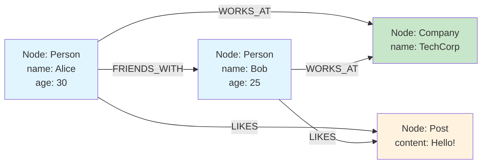
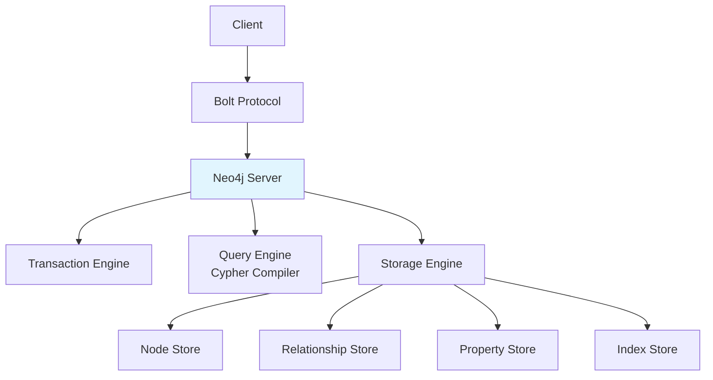
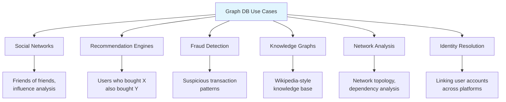

# Graph Databases

## Overview

Graph databases store data as **nodes** (entities) and **edges** (relationships), optimized for traversing connections between data points. While relational databases can represent graphs using JOINs, graph databases are purpose-built for relationship-heavy queries, making them orders of magnitude faster for tasks like social network analysis, recommendation engines, and fraud detection.

## Detailed Explanation

### Data Model



**Components:**
| Component | Description | Properties |
|-----------|-------------|------------|
| **Node** | Entity (person, place, thing) | Has labels and properties |
| **Edge** | Relationship between nodes | Has type, direction, properties |
| **Label** | Category of node | `:Person`, `:Company` |
| **Property** | Key-value pair on node/edge | `name: "Alice"` |

### Property Graph Model

```
Node: Alice
  Labels: [Person, User]
  Properties: {
    name: "Alice",
    age: 30,
    email: "alice@example.com"
  }

Edge: Alice -[:FRIENDS_WITH {since: 2020}]-> Bob
  Type: FRIENDS_WITH
  Direction: Alice → Bob
  Properties: {since: 2020, closeness: "best"}
```

### Cypher Query Language (Neo4j)

```cypher
// Create nodes
CREATE (alice:Person {name: "Alice", age: 30})
CREATE (bob:Person {name: "Bob", age: 25})
CREATE (techcorp:Company {name: "TechCorp"})

// Create relationships
CREATE (alice)-[:FRIENDS_WITH {since: 2020}]->(bob)
CREATE (alice)-[:WORKS_AT {role: "Engineer"}]->(techcorp)
CREATE (bob)-[:WORKS_AT {role: "Designer"}]->(techcorp)

// Query: Find Alice's friends
MATCH (alice:Person {name: "Alice"})-[:FRIENDS_WITH]->(friend)
RETURN friend.name

// Query: Find colleagues (people who work at same company)
MATCH (alice:Person {name: "Alice"})-[:WORKS_AT]->(company)
      <-[:WORKS_AT]-(colleague)
WHERE alice <> colleague
RETURN colleague.name, company.name

// Query: Shortest path between two people
MATCH path = shortestPath(
  (alice:Person {name: "Alice"})-[*]-(bob:Person {name: "Bob"})
)
RETURN path

// Query: Friends of friends (2 hops)
MATCH (alice:Person {name: "Alice"})-[:FRIENDS_WITH*2]->(fof)
RETURN DISTINCT fof.name
```

### Graph Traversal Performance

```mermaid
flowchart TD
    A["Query: Friends of Friends"] --> B[Relational DB<br/>Self-join users table]
    A --> C[Graph DB<br/>Traverse 2 hops]

    B --> B1["SELECT u2.* FROM users u1<br/>JOIN friends f1 ON u1.id = f1.user_id<br/>JOIN friends f2 ON f1.friend_id = f2.user_id<br/>JOIN users u2 ON f2.friend_id = u2.id<br/>WHERE u1.name = 'Alice'"]
    B --> B2[4 JOINs, O(N²) or worse]

    C --> C1["MATCH (a:Person {name:'Alice'})<br/>-[:FRIENDS_WITH*2]->(fof)<br/>RETURN fof"]
    C --> C2[O(K²) where K = avg friends]

    style B2 fill:#ffcdd2
    style C2 fill:#c8e6c9
```

**Performance comparison:**

| Hops | Relational (JOINs) | Graph DB |
|------|-------------------|----------|
| 2 | 2 JOINs, moderate | ~1ms |
| 3 | 3 JOINs, slow | ~10ms |
| 4 | 4 JOINs, very slow | ~100ms |
| 6 | Impractical | ~1s |

Graph databases maintain **adjacency lists** — each node stores pointers to its neighbors, making traversal O(degree) rather than O(N).

### Neo4j Architecture



**Storage format:**
```
Node Record:
  ├── First Property Pointer
  ├── First Relationship Pointer
  ├── Labels
  └── In-use flag

Relationship Record:
  ├── Start Node
  ├── End Node
  ├── Type
  ├── Properties
  ├── Next Relationship for Start Node
  └── Next Relationship for End Node
```

### Graph Algorithms

| Algorithm | Purpose | Example |
|-----------|---------|---------|
| **Shortest Path** | Find shortest route | Navigation, network routing |
| **PageRank** | Node importance | Web page ranking |
| **Community Detection** | Find clusters | Social groups |
| **Centrality** | Find influential nodes | Key influencers |
| **Recommendation** | Collaborative filtering | "People you may know" |
| **Fraud Detection** | Find suspicious patterns | Money laundering rings |

```cypher
// PageRank
CALL gds.pageRank.stream('social-graph')
YIELD nodeId, score
RETURN gds.util.asNode(nodeId).name AS name, score
ORDER BY score DESC

// Community Detection (Louvain)
CALL gds.louvain.stream('social-graph')
YIELD nodeId, communityId
RETURN communityId, collect(gds.util.asNode(nodeId).name) AS members
```

### Graph Database Implementations

| Database | Type | Query Language | Best For |
|----------|------|---------------|----------|
| **Neo4j** | Property graph | Cypher | General purpose |
| **Amazon Neptune** | Property + RDF | Gremlin, SPARQL | AWS ecosystem |
| **JanusGraph** | Distributed property graph | Gremlin | Large-scale graphs |
| **ArangoDB** | Multi-model | AQL | Graph + document |
| **TigerGraph** | Distributed | GSQL | Real-time analytics |

### Use Cases



### When NOT to Use Graph Databases

- ❌ Simple key-value lookups
- ❌ Tabular data with few relationships
- ❌ Full-text search
- ❌ Time-series data
- ❌ Bulk analytics on entire dataset

## Interview Questions

### Q1: When would you choose a graph database over a relational database?
**Answer:** Choose graph when:
1. **Relationship-centric queries** — Most queries traverse relationships (friends of friends, shortest path)
2. **Variable-depth traversals** — "Find all connected nodes up to N hops"
3. **Pattern matching** — "Find all triangles in a social network"
4. **Real-time recommendations** — "Users similar to you also bought..."
5. **Relationship properties** — Edges have attributes (weight, type, timestamp)

Choose relational when:
- Data is tabular with few relationships
- Queries are primarily filtering/aggregation
- Strong ACID transactions needed
- Data model is well-defined and stable

### Q2: How does a graph database store data differently from a relational database?
**Answer:** 
- **Relational**: Stores data in tables with foreign keys. Relationships are implicit (JOIN operations). Finding connected data requires scanning and joining tables.
- **Graph**: Stores nodes and edges as first-class entities with direct pointers. Relationships are explicit and physical. Traversing relationships follows pointers (O(degree)).

This is why graph databases are faster for relationship queries — they don't need to compute JOINs.

### Q3: What is the difference between Neo4j and Amazon Neptune?
**Answer:**
- **Neo4j**: Native graph storage, Cypher query language, single-server (with clustering), open-source (Community Edition)
- **Neptune**: Managed AWS service, supports both Property Graph (Gremlin) and RDF (SPARQL), cloud-native, auto-scaling

Neo4j is better for on-premise or single-cloud deployments. Neptune is better for AWS-native, multi-model, or managed deployments.

### Q4: How do you model a graph in a relational database?
**Answer:** Use adjacency list pattern:
```sql
CREATE TABLE nodes (id INT PRIMARY KEY, properties JSONB);
CREATE TABLE edges (
  source_id INT REFERENCES nodes(id),
  target_id REFERENCES nodes(id),
  edge_type VARCHAR,
  properties JSONB,
  PRIMARY KEY (source_id, target_id, edge_type)
);
```
This works for simple graphs but becomes slow for multi-hop traversals (multiple JOINs). For deep traversals, graph databases are much faster.

### Q5: What is the "N+1 problem" in graph queries?
**Answer:** In ORMs with relational databases, fetching a graph structure causes N+1 queries:
1. Query 1: Get all users
2. Query 2..N+1: For each user, get their friends

Graph databases solve this by traversing relationships in a single query:
```cypher
MATCH (u:User)-[:FRIENDS_WITH]->(friend)
RETURN u, collect(friend)  // Single query, all users + friends
```

## Common Mistakes

- ❌ **Using graph DB for non-graph problems** — Overkill for simple key-value or tabular data
- ❌ **Not indexing node properties** — Slow lookups without indexes
- ❌ **Deep traversals without limits** — Can consume excessive memory
- ❌ **Ignoring direction** — Some traversals are faster with directed edges
- ❌ **Over-using graph DB** — Not all data is graph-shaped; use polyglot persistence

## Summary

| Aspect | Details |
|--------|---------|
| **Data Model** | Nodes + Edges (Property Graph) |
| **Query Language** | Cypher (Neo4j), Gremlin (TinkerPop), SPARQL (RDF) |
| **Strength** | Relationship traversals, pattern matching |
| **Weakness** | Bulk analytics, simple lookups |
| **Best For** | Social networks, recommendations, fraud detection |
| **Examples** | Neo4j, Amazon Neptune, JanusGraph |

Graph databases excel at relationship-heavy queries that would require expensive JOINs in relational databases. They're essential for applications where connections between entities are as important as the entities themselves.

## Cross-References

- [Document Databases](./document.md) — alternative for hierarchical data
- [Key-Value Stores](./key-value.md) — simpler alternative
- [NewSQL](./newsql.md) — SQL + distributed scalability
- [Indexing](../indexing/) — how indexes support graph queries
- [Query Processing](../query-processing/) — how graph queries execute


## Cross References

- [ER Diagrams](../relational-model/er-diagrams.md)
- [Graph Neural Networks](../../ml/gnn/README.md)
