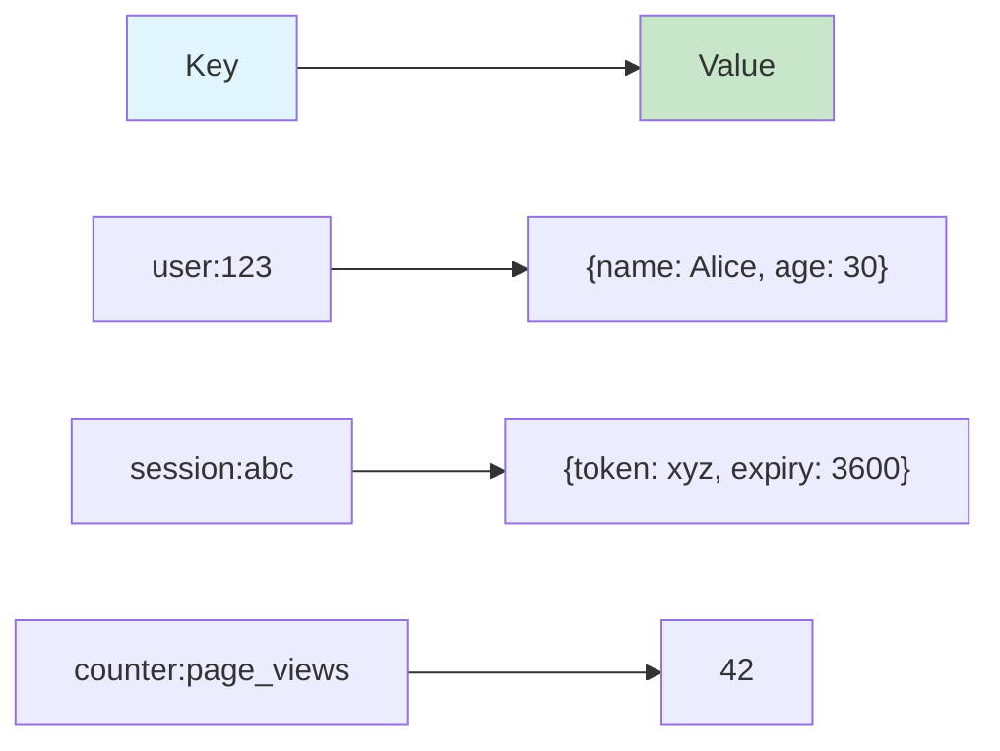
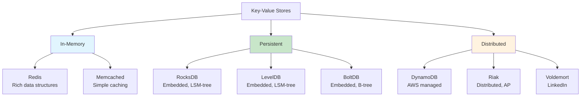
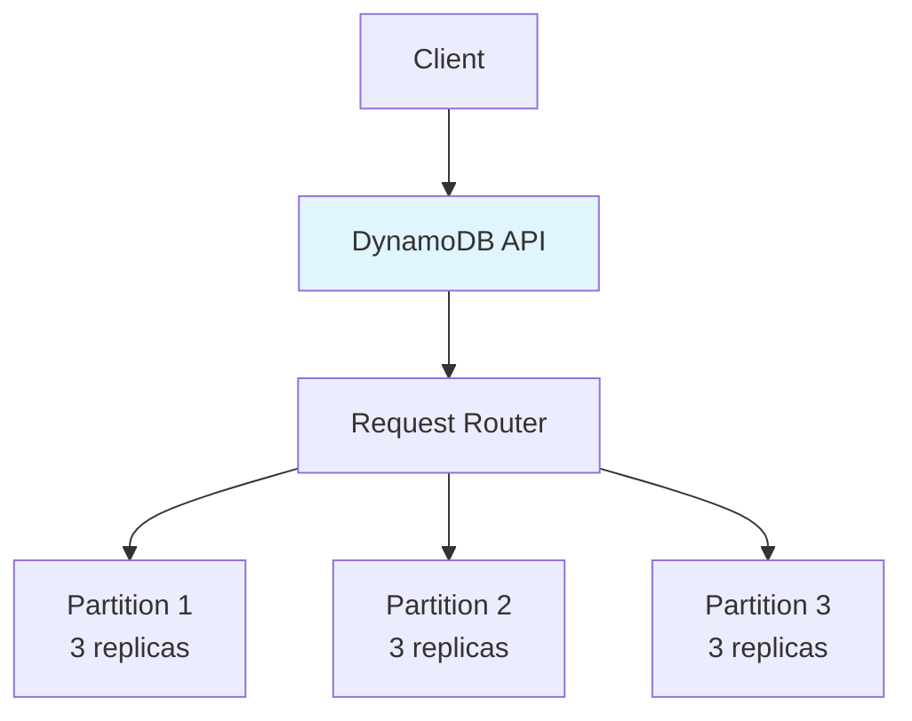
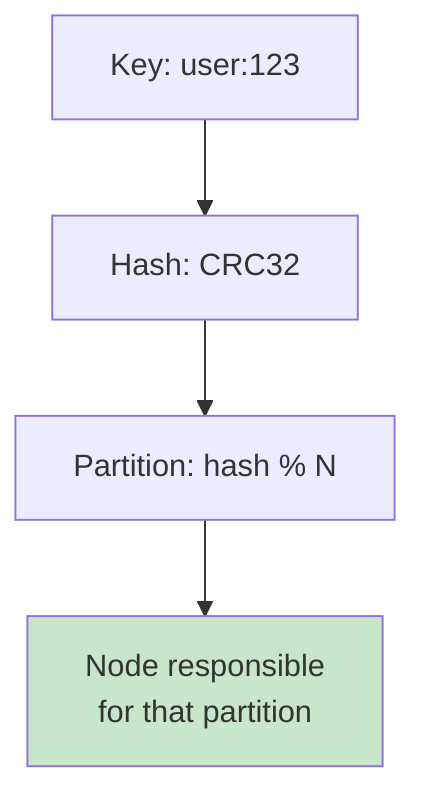

# Key-Value Stores

## Overview

Key-Value stores are the simplest NoSQL database type. They store data as a collection of key-value pairs, where each key is unique and maps to a value (which can be a string, JSON, binary, or any data). Key-value stores are optimized for fast reads and writes by key, making them ideal for caching, session storage, and real-time applications.

## Detailed Explanation

### Data Model



**Key characteristics:**
- Keys are unique strings (or binary)
- Values are opaque (database doesn't interpret them)
- Operations: GET, PUT, DELETE (simple API)
- No schema, no relations, no joins

### Operations

```python
# Basic operations
put(key, value)       # Store a value
get(key)              # Retrieve a value
delete(key)           # Remove a key

# Atomic operations
increment(key, delta) # Atomic counter
compare_and_swap(key, old_value, new_value)  # CAS

# Batch operations
put_many({k1: v1, k2: v2, ...})
get_many([k1, k2, ...])
```

### Key-Value Store Implementations



### DynamoDB (AWS)

The most widely used managed key-value store:



**Features:**
- **Partition key** determines data placement
- **Sort key** enables range queries within a partition
- **LSI (Local Secondary Index)** — alternate sort key
- **GSI (Global Secondary Index)** — alternate partition key
- **DAX** — in-memory cache layer
- **Streams** — change data capture

**Capacity modes:**
| Mode | Description | Use Case |
|------|-------------|----------|
| **On-demand** | Pay per request, auto-scaling | Unpredictable traffic |
| **Provisioned** | Set read/write capacity | Predictable traffic |

**Read consistency:**
```python
# Eventually consistent (default, faster)
table.get_item(Key={'id': 123}, ConsistentRead=False)

# Strongly consistent
table.get_item(Key={'id': 123}, ConsistentRead=True)
```

### Redis as Key-Value Store

Redis is the most popular in-memory key-value store:

```python
import redis
r = redis.Redis()

# Basic operations
r.set('user:123', '{"name":"Alice"}')
user = r.get('user:123')

# With TTL
r.setex('session:abc', 3600, 'session_data')

# Atomic increment
r.set('counter', 0)
r.incr('counter')  # 1
r.incrby('counter', 10)  # 11

# Hash (multi-field value)
r.hset('user:123', mapping={'name': 'Alice', 'age': 30})
r.hget('user:123', 'name')  # 'Alice'
```

### Embedded Key-Value Stores

For applications that need local storage:

| Store | Engine | Used By |
|-------|--------|---------|
| **RocksDB** | LSM-tree | Meta, CockroachDB, TiKV |
| **LevelDB** | LSM-tree | Bitcoin, Chrome |
| **BoltDB** | B-tree | etcd (originally) |
| **SQLite** | B-tree | Mobile apps, embedded |

**RocksDB architecture:**
```
Write → MemTable (in memory)
       ↓ (flush when full)
      SST files (on disk, sorted)
       ↓ (compaction merges SSTs)
      Older SST files
```

### Partitioning in Key-Value Stores



**Consistent hashing** ensures:
- Even distribution across nodes
- Minimal data movement when adding/removing nodes
- Each partition has multiple replicas

### Key Design Patterns

**Key naming conventions:**
```
# Type:ID format
user:123
session:abc
product:456

# Hierarchical keys
user:123:profile
user:123:settings
user:123:sessions:abc
```

**Composite keys for range queries (DynamoDB):**
```python
# Partition key: user_id, Sort key: timestamp
# Enables: Get all orders for user 123, sorted by time
table.put_item(Item={
    'user_id': '123',
    'timestamp': '2024-01-15T10:30:00',
    'amount': 100
})

# Query: Get orders for user 123 in date range
table.query(
    KeyConditionExpression=Key('user_id').eq('123') & 
                           Key('timestamp').between('2024-01-01', '2024-01-31')
)
```

### When to Use Key-Value Stores

| Use Case | Why Key-Value |
|----------|---------------|
| **Caching** | Fast get/set, TTL support |
| **Session storage** | Simple key lookup, expiry |
| **User profiles** | Fast lookup by user_id |
| **Counters** | Atomic increment |
| **Rate limiting** | TTL + counter |
| **Feature flags** | Simple boolean lookup |
| **Shopping cart** | Per-user data, high availability |

### Limitations

- ❌ No complex queries (JOIN, GROUP BY)
- ❌ No secondary indexes (without extra features)
- ❌ Limited range queries (depends on implementation)
- ❌ No transactions across keys (mostly)
- ❌ Values are opaque to the database

## Interview Questions

### Q1: When would you choose a key-value store over a relational database?
**Answer:** Choose key-value when:
1. **Simple access pattern** — Data is accessed by key (user_id, session_id)
2. **High throughput** — Need millions of reads/writes per second
3. **Low latency** — Sub-millisecond response times
4. **Horizontal scaling** — Need to scale beyond single machine
5. **Flexible schema** — Data structure varies or evolves
6. **No complex queries** — Don't need JOINs or aggregations

Examples: user sessions, caching, shopping carts, real-time leaderboards.

### Q2: How does DynamoDB handle partitioning?
**Answer:** DynamoDB uses the **partition key** to determine which partition stores the item:
1. Hash the partition key → determines the partition
2. Each partition is replicated 3 times (for durability)
3. Within a partition, items are sorted by the **sort key** (if defined)

For range queries, you must provide the partition key and can range on the sort key. Cross-partition queries require scatter-gather.

### Q3: What is the difference between Redis and DynamoDB?
**Answer:**
- **Redis**: In-memory, rich data structures (lists, sets, sorted sets), single-threaded, sub-millisecond latency, optional persistence
- **DynamoDB**: Persistent, simple key-value with sort keys, multi-threaded, single-digit millisecond latency, fully managed

Redis is best for caching and real-time data structures. DynamoDB is best for persistent, scalable key-value storage.

### Q4: How do key-value stores handle range queries?
**Answer:** Pure key-value stores don't support range queries (only exact key lookup). Extensions:
- **DynamoDB**: Sort key enables range queries within a partition
- **Redis Sorted Sets**: Range queries by score
- **RocksDB**: Iteration over key ranges (keys are sorted)

For range queries on arbitrary fields, you need a secondary index or a different database type.

### Q5: What is consistent hashing and why is it used?
**Answer:** Consistent hashing maps keys and nodes to points on a virtual ring. Each key is stored on the next node clockwise. Benefits:
1. Adding/removing a node only redistributes ~1/N keys (minimal movement)
2. No central coordinator needed
3. Even distribution with virtual nodes

Without consistent hashing, changing the number of nodes would require redistributing almost all keys.

## Common Mistakes

- ❌ **Using key-value for complex queries** — Wrong tool for JOINs and aggregations
- ❌ **Poor key design** — Keys that don't align with access patterns
- ❌ **Ignoring TTL** — Not setting expiry causes memory/storage issues
- ❌ **Hot keys** — Single key receiving too much traffic
- ❌ **Assuming all key-value stores are the same** — Redis, DynamoDB, and RocksDB are very different

## Summary

| Aspect | Key-Value Stores |
|--------|-----------------|
| **Data Model** | Key → Value (opaque) |
| **Operations** | GET, PUT, DELETE |
| **Scaling** | Horizontal (partitioning) |
| **Consistency** | Varies (tunable in DynamoDB) |
| **Best For** | Caching, sessions, simple lookups |
| **Examples** | Redis, DynamoDB, Memcached, RocksDB |

Key-value stores are the foundation of many distributed systems. Understanding when to use them and how they scale is essential for system design interviews.

## Cross-References

- [Redis](../caching/redis.md) — detailed Redis coverage
- [Memcached](../caching/memcached.md) — simple key-value cache
- [Document Databases](./document.md) — when you need richer queries
- [Sharding](../distributed/sharding.md) — how key-value stores partition data
- [LSM Trees](../internals/lsm-trees.md) — storage engine for key-value stores


## Cross References

- [Redis](../dbms/caching/redis.md)
- [Memcached](../dbms/caching/memcached.md)
- [Consistent Hashing](../distributed/partitioning/consistent-hashing.md)
- [LSM Trees](../dbms/internals/lsm-trees.md)
