# NewSQL Databases

## Overview

NewSQL databases aim to provide the **scalability of NoSQL** systems with the **ACID guarantees and SQL interface of traditional RDBMS**. They emerged in the 2010s as a response to the realization that most applications need both horizontal scalability *and* transactional consistency — something neither traditional RDBMS (which scale vertically) nor NoSQL (which sacrifice ACID) fully provide.

NewSQL systems achieve this through **distributed SQL**: they shard data across multiple nodes, replicate for fault tolerance, and provide distributed transactions with strong consistency — all while exposing a standard SQL interface.

## Detailed Explanation

### The Database Evolution

```mermaid
flowchart LR
    subgraph RDBMS["1970s-2000s: RDBMS"]
        direction TB
        R1["Oracle, MySQL, PostgreSQL"]
        R2["ACID, SQL"]
        R3["Vertical scaling only"]
    end

    subgraph NoSQL["2006-2010: NoSQL"]
        direction TB
        N1["Cassandra, MongoDB, DynamoDB"]
        N2["BASE, horizontal scaling"]
        N3["No SQL, limited transactions"]
    end

    subgraph NewSQL["2010s+: NewSQL"]
        direction TB
        NS1["CockroachDB, TiDB, Spanner"]
        NS2["ACID + SQL + Horizontal scaling"]
        NS3["Distributed transactions"]
    end

    RDBMS -->|"Scale limits"| NoSQL
    NoSQL -->|"Need ACID + scale"| NewSQL

    style RDBMS fill:#e1f5fe
    style NoSQL fill:#fff3e0
    style NewSQL fill:#c8e6c9
```

### What Makes NewSQL Different?

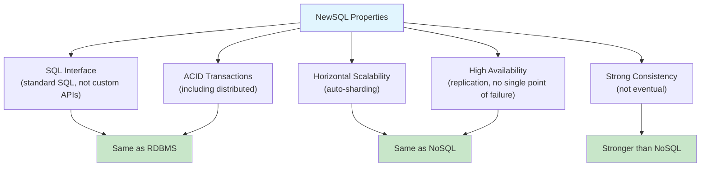

### Architecture: How NewSQL Works

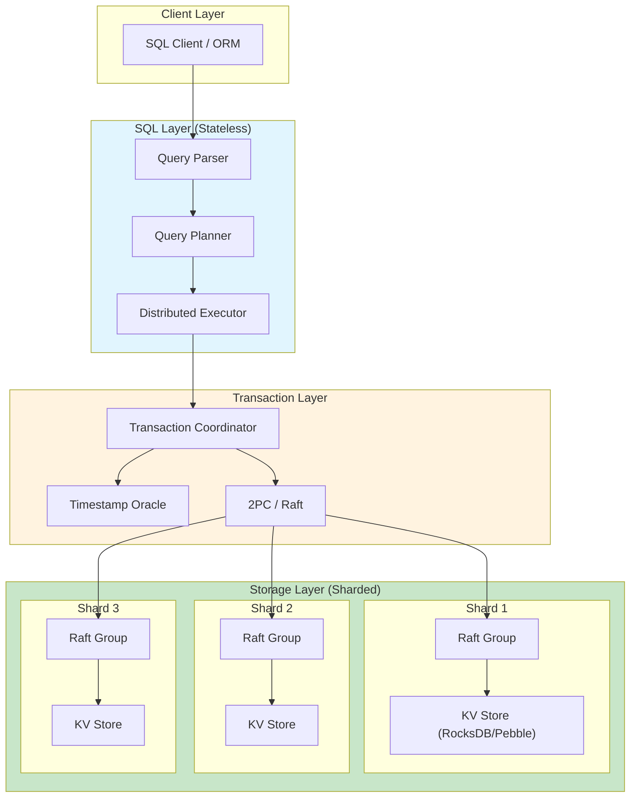

### Google Spanner (2012)

Google Spanner is the foundational NewSQL system. It introduced **externally consistent** transactions using **TrueTime**, a globally synchronized clock API.

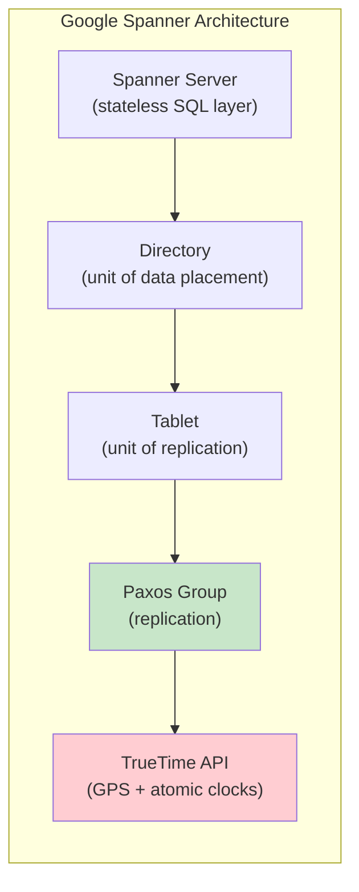

**TrueTime:**
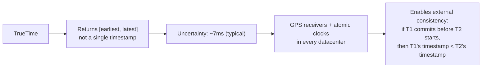

**Spanner's key innovation:** External consistency (linearizability) across globally distributed data. If transaction T1 commits before T2 starts (in real time), then T1's commit timestamp is guaranteed to be less than T2's, even across datacenters.

| Feature | Detail |
|---------|--------|
| **Consistency** | External consistency (linearizable) |
| **Replication** | Paxos per tablet |
| **Transactions** | Distributed 2PC with TrueTime |
| **Schema** | SQL-like (no JOINs initially, now supported) |
| **Storage** | Column-family (similar to BigTable) |
| **Locking** | wound-wait deadlock prevention |

### CockroachDB

CockroachDB is an open-source distributed SQL database inspired by Spanner. It uses **hybrid-logical clocks (HLC)** instead of TrueTime.

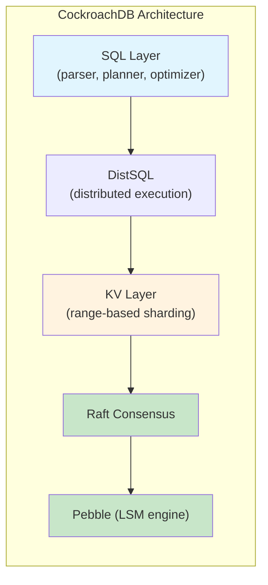

**Key design decisions:**

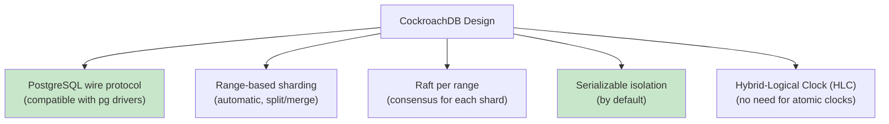

| Feature | Detail |
|---------|--------|
| **SQL Compatibility** | PostgreSQL wire protocol |
| **Sharding** | Automatic range-based (default 512MB ranges) |
| **Replication** | Raft per range (default 3 replicas) |
| **Isolation** | Serializable (default) |
| **Storage Engine** | Pebble (Go rewrite of RocksDB) |
| **Clock Sync** | HLC (hybrid-logical clocks) |
| **Transactions** | Parallel commits (optimized 2PC) |

**CockroachDB Transaction Flow:**
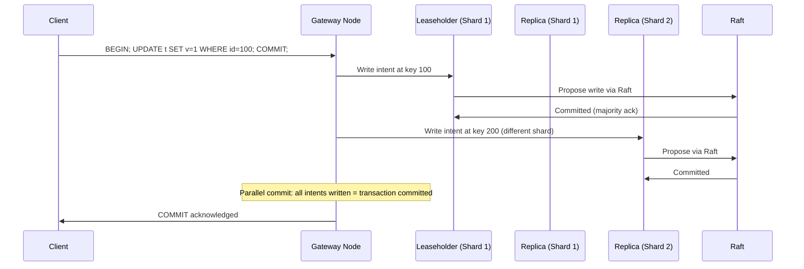

### TiDB

TiDB is an open-source distributed SQL database that separates the SQL layer from the storage layer (TiKV).

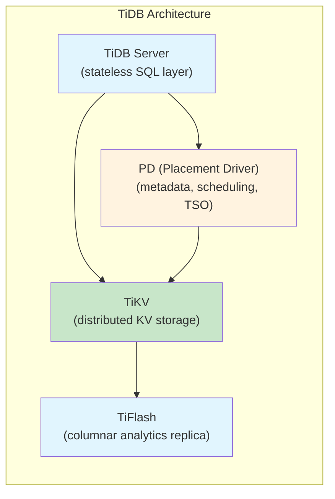

**TiDB's HTAP (Hybrid Transactional/Analytical Processing):**

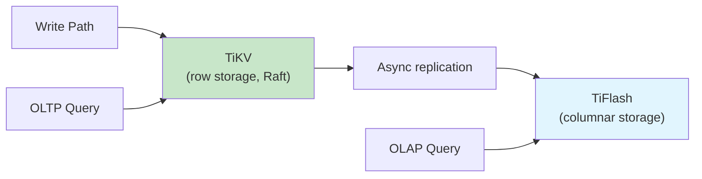

| Feature | Detail |
|---------|--------|
| **SQL Compatibility** | MySQL wire protocol |
| **Sharding** | Region-based (default 96MB regions) |
| **Replication** | Raft per region (3 replicas) |
| **Isolation** | Snapshot Isolation (SI) + optional Serializable |
| **Storage Engine** | RocksDB (via TiKV) |
| **Clock Sync** | TSO (Timestamp Oracle) in PD |
| **HTAP** | TiFlash columnar replica for analytics |

**TiDB vs CockroachDB:**

| Aspect | TiDB | CockroachDB |
|--------|------|-------------|
| **SQL Protocol** | MySQL compatible | PostgreSQL compatible |
| **Language** | Go + Rust (TiKV) | Go |
| **Storage** | RocksDB | Pebble (Go) |
| **Clock** | TSO (centralized) | HLC (distributed) |
| **HTAP** | Yes (TiFlash) | No (OLTP only) |
| **License** | Apache 2.0 | BSL (was Apache) |
| **Backed By** | PingCAP | Cockroach Labs |

### YugabyteDB

YugabyteDB is a distributed SQL database that reuses PostgreSQL's query layer on top of a distributed storage engine.

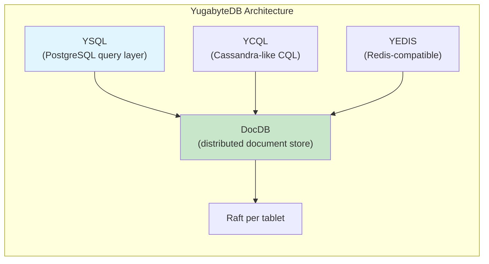

| Feature | Detail |
|---------|--------|
| **SQL Compatibility** | PostgreSQL (YSQL), Cassandra (YCQL), Redis (YEDIS) |
| **Sharding** | Hash + range sharding |
| **Replication** | Raft per tablet |
| **Isolation** | Serializable |
| **Storage Engine** | RocksDB (via DocDB) |
| **Clock Sync** | Hybrid-logical clocks |

### Distributed Transaction Protocol (2PC + Raft)

NewSQL databases typically use **Two-Phase Commit (2PC)** for distributed transactions, with **Raft** for replication within each shard:

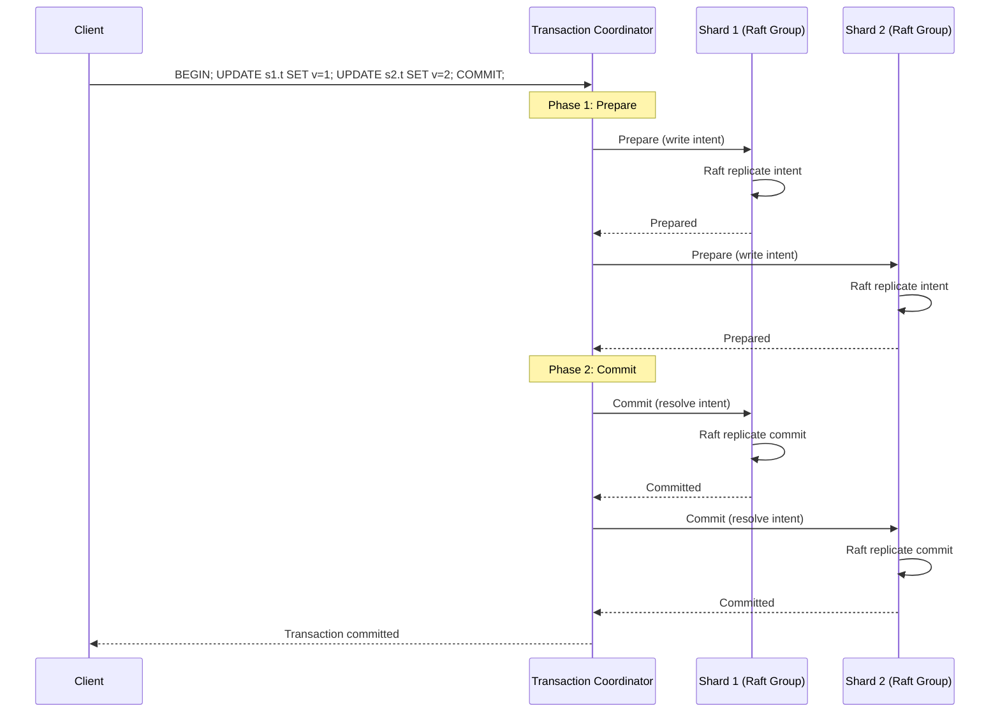

**Optimization — Parallel Commits (CockroachDB):**
Instead of waiting for all shards to commit, the transaction is considered committed as soon as all intents are written. The commit record is written asynchronously:

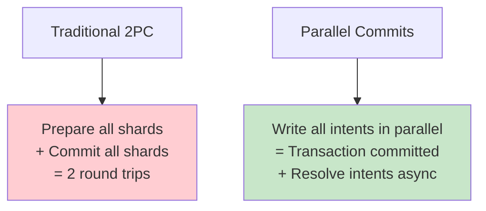

### Clock Synchronization: TrueTime vs HLC vs TSO

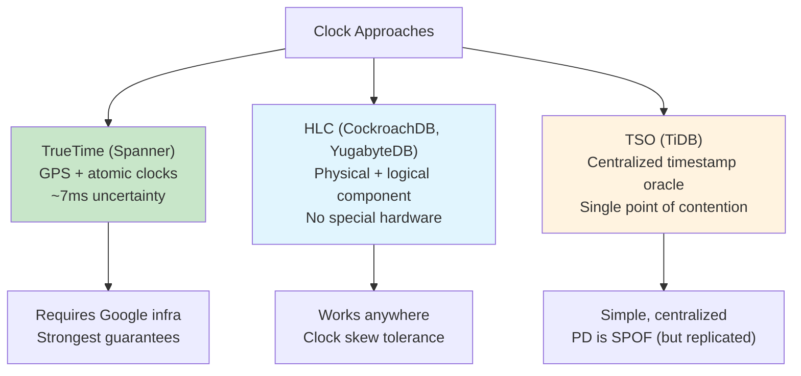

| Approach | System | Pros | Cons |
|----------|--------|------|------|
| **TrueTime** | Spanner | True external consistency | Requires Google's infra |
| **HLC** | CockroachDB, YugabyteDB | No special hardware | Clock skew can cause retries |
| **TSO** | TiDB | Simple, predictable | Centralized bottleneck |

### NewSQL vs. Traditional RDBMS vs. NoSQL

| Aspect | Traditional RDBMS | NoSQL | NewSQL |
|--------|------------------|-------|--------|
| **SQL** | Full SQL | No/limited SQL | Full SQL |
| **ACID** | Full ACID | BASE | Full ACID |
| **Scaling** | Vertical | Horizontal | Horizontal |
| **Consistency** | Strong | Eventual | Strong |
| **Joins** | Full support | Limited | Full support |
| **Schema** | Fixed | Flexible | Fixed |
| **Latency** | Low (single node) | Low (single shard) | Higher (distributed txn) |
| **Throughput** | Limited by single node | Very high | High |
| **Complexity** | Low | Medium | High |

### When to Use NewSQL

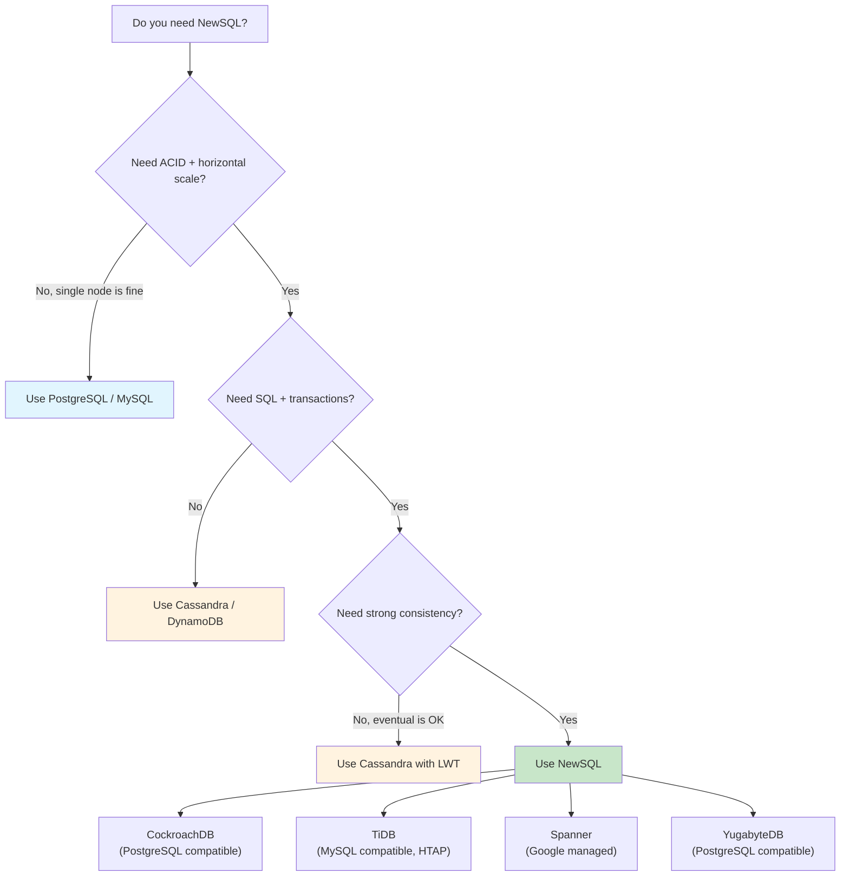

## Cross-References

- [CAP Theorem](../distributed/cap.md) — The fundamental tradeoff NewSQL navigates
- [Consensus](../distributed/consensus.md) — Raft and Paxos used by NewSQL systems
- [Raft](../distributed/raft.md) — The consensus algorithm behind CockroachDB, TiKV, YugabyteDB
- [Replication](../distributed/replication.md) — How NewSQL replicates data
- [Sharding](../distributed/sharding.md) — How NewSQL partitions data
- [2PC](../transactions/two-phase-commit.md) — The distributed commit protocol
- [MVCC](../transactions/mvcc.md) — Concurrency control used by NewSQL
- [Consistency Models](../distributed/consistency.md) — Linearizability, serializability
- [LSM Trees](../internals/lsm-trees.md) — Storage engine used by most NewSQL systems

## Interview Questions

### Beginner

**Q: What is NewSQL?**
A: NewSQL databases combine the scalability of NoSQL with the ACID guarantees and SQL interface of traditional RDBMS. They achieve this through distributed architectures with auto-sharding, replication (Raft), and distributed transactions (2PC).

**Q: How is CockroachDB different from PostgreSQL?**
A: CockroachDB is PostgreSQL-wire-compatible but distributes data across multiple nodes with automatic sharding and replication. A single query might touch multiple nodes and require distributed transactions. PostgreSQL stores all data on a single node (though it supports streaming replication for read replicas).

**Q: Why can't traditional RDBMS scale horizontally?**
A: Traditional RDBMS weren't designed for distribution. They assume low-latency access to all data (for JOINs, transactions), use shared memory (buffer pool), and have single-node coordination (lock manager). Sharding manually is possible but painful — NewSQL automates it.

### Intermediate

**Q: Explain how CockroachDB provides serializable isolation without TrueTime.**
A: CockroachDB uses **Hybrid-Logical Clocks (HLC)** that combine physical time with a logical counter. Each transaction gets a timestamp from HLC. CockroachDB uses **uncertainty intervals** (based on measured clock skew between nodes) to detect potential ordering violations. If a read encounters a value written within the uncertainty interval, the transaction restarts with a higher timestamp. This provides serializable isolation with bounded clock skew tolerance.

**Q: What is the difference between TiDB's TSO and Spanner's TrueTime?**
A: **TSO (Timestamp Oracle)** is a centralized service in PD that issues monotonically increasing timestamps. It's simple but creates a single point of contention. **TrueTime** uses GPS receivers and atomic clocks to provide timestamps with bounded uncertainty (~7ms). TrueTime is decentralized (each datacenter has its own) but requires specialized hardware. TSO is easier to deploy; TrueTime provides stronger guarantees.

**Q: How does CockroachDB's parallel commit work?**
A: In traditional 2PC, the coordinator sends Prepare to all shards, waits for all acks, then sends Commit to all shards — two round trips. In parallel commits, the transaction is considered committed as soon as all write intents are successfully replicated. The commit record is written asynchronously. This reduces latency from 2 round trips to 1 for most transactions.

### Advanced (FAANG-Level)

**Q: Design a NewSQL database for a global e-commerce platform with users in US, EU, and Asia. What architecture choices would you make?**
A:
1. **Sharding**: Range-based sharding by user_id, with locality-aware placement (US users' data in US datacenter)
2. **Replication**: Raft group per shard, 3 replicas across zones in the same region
3. **Cross-region**: Asynchronous replication for cross-region reads; distributed transactions for cross-region writes (higher latency)
4. **Clock**: HLC with NTP sync (no atomic clocks available)
5. **Isolation**: Serializable by default, with snapshot isolation for read-heavy workloads
6. **Storage**: LSM tree (RocksDB) for write-heavy e-commerce workload
7. **Caching**: Redis for session data, CockroachDB for transactional data
8. **Schema**: PostgreSQL-compatible for ORM support

**Q: A NewSQL database has a 10ms RTT between datacenters. A cross-shard transaction touches 3 shards in different datacenters. What's the minimum latency?**
A:
- 2PC prepare phase: 1 RTT to each shard (parallel) = 10ms
- 2PC commit phase: 1 RTT to each shard (parallel) = 10ms
- Total: ~20ms minimum for the distributed transaction
- With parallel commits: ~10ms (single round trip)
- Add query processing, Raft replication within each shard (~5ms each) → total ~15-30ms

This is why NewSQL databases try to co-locate related data on the same shard (locality-aware sharding).

**Q: Compare the consistency guarantees of Spanner, CockroachDB, and TiDB.**
A:
| System | Consistency | Mechanism | Tradeoff |
|--------|------------|-----------|----------|
| **Spanner** | External consistency (linearizable) | TrueTime + Paxos | Requires Google infra |
| **CockroachDB** | Serializable | HLC + Raft + uncertainty restarts | Clock skew causes retries |
| **TiDB** | Snapshot Isolation (default) | TSO + Raft | Weaker but fewer retries |

Spanner's external consistency is the strongest: if T1 commits before T2 starts in real time, T1's timestamp < T2's. CockroachDB provides serializable but not external consistency (clock skew can cause the same transaction ordering issue). TiDB defaults to snapshot isolation for performance.

## Common Mistakes

1. **Assuming NewSQL is always better**: NewSQL adds distributed coordination overhead. For single-node workloads, PostgreSQL/MySQL will always be faster and simpler.

2. **Ignoring latency implications**: Cross-shard transactions require multiple round trips. Design schemas to minimize cross-shard operations (locality-aware sharding).

3. **Not considering operational complexity**: Running CockroachDB/TiDB requires understanding Raft, sharding, clock sync, and distributed debugging. It's significantly more complex than single-node PostgreSQL.

4. **Using NewSQL when eventual consistency is fine**: If your application can tolerate eventual consistency (e.g., social media feeds), NoSQL (Cassandra, DynamoDB) will give better performance and lower cost.

5. **Ignoring clock synchronization**: CockroachDB requires NTP sync within 500ms. TiDB's PD is a single point of failure (though replicated). These operational requirements matter in production.

## Summary and Revision Notes

- **NewSQL** = ACID + SQL + horizontal scalability (the "holy grail" of databases)
- **Key systems**: Spanner (Google), CockroachDB, TiDB, YugabyteDB
- **Architecture**: Stateless SQL layer + distributed KV storage + consensus (Raft/Paxos)
- **Spanner**: TrueTime (GPS + atomic clocks) → external consistency
- **CockroachDB**: PostgreSQL-compatible, HLC, Raft per range, Pebble engine
- **TiDB**: MySQL-compatible, TSO (centralized), Raft per region, HTAP with TiFlash
- **YugabyteDB**: PostgreSQL-compatible, DocDB (RocksDB), multi-API (YSQL/YCQL/YEDIS)
- **Distributed transactions**: 2PC + Raft; parallel commits optimize to 1 RTT
- **Clock sync**: TrueTime (strongest, needs special HW), HLC (practical), TSO (simple, centralized)
- **When to use**: Need ACID + SQL + scale beyond single node
- **Tradeoff**: Higher latency for cross-shard txns, operational complexity
