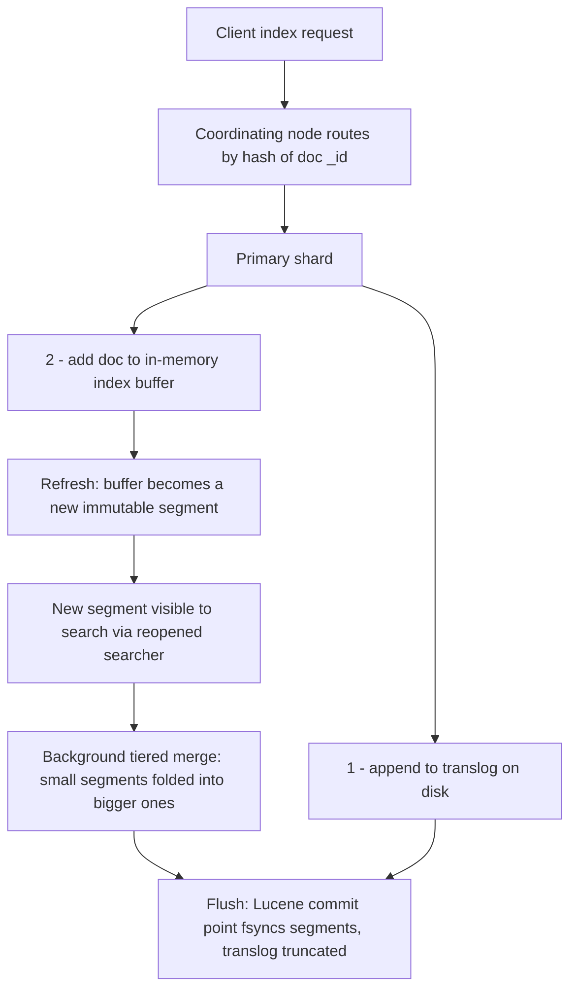
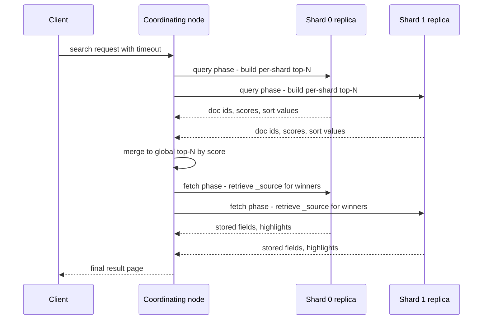

# Search Engine Internals: Lucene, Elasticsearch, OpenSearch

## Overview

Full-text search looks like an application feature, but at scale it is a systems problem: an immutable-segment storage engine, a custom index structure, a replication protocol, and a query fan-out plane all bolted together. Elasticsearch and OpenSearch are thin distributed layers over Apache Lucene, and the interview questions at e-commerce, log-analytics, and observability shops are almost always about the Lucene layer underneath — segments, refresh, merges, scoring — plus the sharding behavior on top. More than 90 pages of this book reference Elasticsearch somewhere; this page is the one that explains the machinery it sits on.

Interviews rarely ask you to write a query; they ask why refresh exists, what happens to a delete, why an aggregation is slow at 2 a.m., and what a crash loses. Every answer below reduces to one of four mechanics: immutable segments, the translog, deterministic routing, or two-phase fan-out. Learn the mechanics and every question decomposes.

## Why It Is a Systems Problem

A search cluster must answer "top 10 results for this query, sorted by relevance" across terabytes in tens of milliseconds, while ingesting hundreds of thousands of documents per second. Those two workloads fight each other: ingestion wants sequential, append-optimized writes; search wants sorted, compact, up-to-date structures. Lucene's answer is the same trick that LSM-tree storage engines use (see [LSM Compaction](../../storage/lsm-compaction.md)) — write new data as immutable files and merge them in the background — combined with an inverted index inside each file. If you understand memtables, flushes, and compaction from RocksDB-style engines, you already understand 70% of Lucene's write path.

## Inverted Index Anatomy

The inverted index maps each term to the list of documents containing it. Within one Lucene segment the pieces are:

| Structure | What it holds | Why it matters |
|---|---|---|
| Term dictionary | Sorted list of distinct terms in the segment, with offsets into postings | Kept in memory (FST — a finite-state transducer) so term lookup is a few pointer hops |
| Postings list | Doc IDs containing the term, delta-encoded and block-compressed | The answer set for a term; iteration is the hot loop of search |
| Skip lists | Sparse "jumps" embedded in long postings lists | Lets intersection of two postings lists skip ahead instead of walking — turns `AND` of common terms from O(n) into O(n / skip) |
| Positions | For each hit, the term position inside the doc | Needed for phrase queries (`"new york"`) and proximity boosts; stored only for fields with `index_options: positions` |
| Stored fields | The original `_source` JSON, compressed | Fetched in the fetch phase to materialize results |
| Doc values | A columnar, per-doc sorted encoding of each field | The complement of the inverted index: answers "for this document, what is the value of field X" — required for sorting, aggregations, and scripting |

The term dictionary deserves one more paragraph because it is a genuine interview deep-cut: Lucene encodes it as a **finite-state transducer (FST)** streamed off disk. An FST shares prefixes *and* suffixes between terms (a trie only shares prefixes), so the dictionary for millions of terms compresses to a structure that can be memory-mapped and walked with a handful of page faults per lookup. It also doubles as an automaton: Levenshtein fuzzy queries and prefix queries compile the edit-distance or prefix condition into a finite-state machine and intersect it with the FST, so wildcard-style queries do not degenerate into scanning every term. This is the same "compiled query structure" idea as Roaring-bitmap predicate evaluation covered in [Roaring Bitmaps](../advanced/roaring-bitmaps.md).

The asymmetry between postings and doc values is the design point interviewers probe. The inverted index answers "which documents match this term?" — term → docs. Doc values answer "for these documents, what are the values?" — doc → values. Sorting by `timestamp` or running a `terms` aggregation on `user_id` via postings would mean scanning the whole index; doc values make it a column scan, essentially the same trick as the columnar formats covered in [Columnar Formats](../advanced/columnar-formats.md). A field can be indexed (searchable), have doc values (aggregatable), both, or neither.

## Lucene Segments: The LSM Parallel

A Lucene index is a set of immutable segments. Each segment is a mini-index (own term dictionary, postings, doc values, stored fields) over a subset of docs. Writes append to an in-memory buffer; a background refresh turns the buffer into a new segment; background merges combine small segments into larger ones and drop deleted documents.

The parallels to an LSM engine are direct and worth naming in an interview:

- **Memory buffer ≈ memtable.** Mutable in-RAM structures, lost on crash.
- **Refresh ≈ memtable flush to L0.** Produces an immutable searchable artifact.
- **Merge policy ≈ compaction.** `TieredMergePolicy` (default since Lucene 3.5) balances segments-per-tier against max segment size, merging roughly `merge_factor` ≈ 10 similarly-sized segments at a time, capping the size a merge will build (default ~5 GB in Elasticsearch's `index.merge.policy.max_merged_segment`). Tiered tuning trades write amplification against search performance: more, smaller segments means more open files and per-segment term dictionaries; fewer, bigger segments cost more background I/O.
- **The deletion problem.** Segments are immutable, so a delete is a write: the doc ID goes into a per-segment deleted-docs bitmap. Every search over that segment checks the bitset and skips killed docs; disk space is not reclaimed until a merge rewrites the segment without them. An update in Elasticsearch is a delete + insert, so update-heavy workloads accumulate garbage segments — the same space-amplification story as [MVCC garbage collection](../advanced/mvcc-garbage-collection.md).

Merges run on background `merge` thread pools with throttling, because unbounded merging starves search I/O. When segments accumulate faster than merges retire them, the cluster is said to be **merge-starved** — symptoms include rising segment counts, degrading query latency, and eventual `DiskQueueOverloaded`-style backpressure where the node rejects writes. Circuit breakers (parent, fielddata, in-flight requests) are the query-side analog: they reject requests that would exceed memory budgets rather than letting the JVM OOM, which is why search clusters fail *fast and visibly* instead of dying quietly.

### Refresh vs Translog vs Flush

| Operation | What it does | Cost | Durability effect |
|---|---|---|---|
| Refresh | Makes in-memory buffer searchable as a new segment | Cheap (new in-memory index + searcher reopen) | None — segment not fsynced yet |
| Translog append | Appends the raw operation to an on-disk log, like a WAL | One fsync | Makes the op durable before ack |
| Flush (commit) | Fsyncs all segments, writes a commit point, truncates the translog | Expensive | Replay range shrinks to zero |

The translog is Lucene/Elasticsearch's write-ahead log — the same contract as the [WAL internals](../advanced/wal-internals.md) page: the log record must hit stable storage before the ack goes out, and recovery replays the log over committed segments. Two defaults matter and are a classic trap: `index.refresh_interval` is `1s` (docs become searchable ~1 second after ingest), and `index.translog.sync_interval` is `5s`. Nuance: the default `index.translog.durability` is `request` — fsync per request, nothing acknowledged is lost. If operators set `durability: async` for throughput, a crash can lose up to 5 seconds of acknowledged writes; that trade is exactly the group-commit trade from OLTP WALs.

## Scoring: TF-IDF to BM25

Lucene 6+ uses BM25 by default (previously TF-IDF). The intuition behind each factor is what interviewers want, not memorization:

\\[\text{score}(q,d) = \sum_{t \in q} \text{IDF}(t) \cdot \frac{f(t,d)\,(k_1 + 1)}{f(t,d) + k_1 \cdot \left(1 - b + b \cdot \frac{|d|}{\text{avgdl}}\right)}\\]

- **Term frequency saturates.** TF-IDF grows linearly with `f(t,d)` — a doc mentioning "elasticsearch" 50 times scores 50x. BM25 divides by `f + k1`, so the score asymptotically approaches `k1 + 1` (default `k1 = 1.2`). The first mention of a term is highly informative; the 30th is not.
- **Length normalization.** The `b` term (default `0.75`) discounts long documents: `|d| / avgdl` scales the saturation point so a 10,000-word doc does not dominate just because it mentions everything. `b = 0` disables normalization; `b = 1` fully normalizes.
- **IDF** upweights rare terms, unchanged in spirit from TF-IDF.

Custom similarity plugins (DFR, LM Dirichlet, scripted similarities) swap the scoring function per field via `similarity` settings; e-commerce often tunes or scripts scoring to blend revenue margin into relevance. That is a one-paragraph topic in interviews — mention `scripted_similarity` and move on.

## The Analysis Chain

Text is not indexed raw — it passes through a configurable chain per field:

1. **Character filters** — operate on the raw string: strip HTML tags, map characters (`&` → ` and `).
2. **Tokenizer** — splits text into tokens: `standard` (Unicode word boundaries), `whitespace`, `keyword` (no split), `ngram` (for autocomplete).
3. **Token filters** — transform tokens: `lowercase`, `stop` (remove stopwords), `stemmer` / `english` (runs → run), `synonym`, `shingle` (for phrase suggestions).

An analyzer is a named chain, and each text field can declare its own (`index_analyzer` vs `search_analyzer`). The product-title field and the log-message field need different chains, and mismatched index/search analyzers are a classic source of "why doesn't my phrase query match" bugs.

### Mappings: Multi-Fields and Runtime Fields

Because every indexed field costs postings plus doc values, mappings are budget decisions. **Multi-fields** (`field.text` with a `keyword` sub-field) index the same string twice so you can score on the analyzed version and aggregate on the exact version — the standard `title.text` / `title.keyword` pair. **Dynamic mapping** auto-creates fields on first sight, which is convenient and dangerous: a log pipeline that lets every new JSON key become an indexed field hits *mapping explosion* (tens of thousands of fields, cluster-state bloat, heap pressure) — capped by `index.mapping.total_fields.limit` (default 1000) and tamed with `dynamic: strict|false` or index templates. **Runtime fields** invert the trade: computed at query time from `_source` or a script, they cost no index space but pay CPU per query — appropriate for rarely-queried ad-hoc fields, wrong for hot filters. The keyword-vs-text, index-vs-runtime decision is the search-engine sibling of the encoding trade-offs in [Columnar Formats](../advanced/columnar-formats.md).

**Synonyms: index time vs query time.** Index-time synonym filters rewrite tokens during ingestion: a document containing "phone" also gets "smartphone" in its postings. Changing the synonym list then requires reindexing the corpus, but queries stay simple and scoring is consistent. Query-time synonyms rewrite the query instead: the list is hot-editable, but multi-word synonyms ("ny, new york") need the `synonym_graph` filter with careful position handling, and IDF is computed against the original query term so scores shift. Production stacks usually index-time the stable pairs and query-time the experimental ones.

## The Bulk Write Path and Caches

Bulk indexing (the `_bulk` API) is how ingestion actually happens: a coordinator batches thousands of operations into one request, each routed to its target shard, where the primary appends to the translog and buffer in one pass. Bulk-friendly tuning follows directly from the segment model: raise `refresh_interval` to `30s` or `-1` during heavy loads (fewer, bigger segments), size the translog flush so it does not fire mid-load, and disable replicas (`number_of_replicas: 0`) for one-shot backfills, restoring replicas afterward — replica recovery is a segment copy, so re-enabling is cheaper than continuously double-writing.

Three caches sit between queries and disk, and confusing them is a common interview fail:

| Cache | What it caches | Invalidated when |
|---|---|---|
| OS page cache | Segment files (postings, doc values, stored fields) — the only cache that really matters for latency | Never explicitly; it is just memory pressure |
| Node query cache | Per-shard results of non-scoring queries (filters), as bitsets | Any refresh invalidates the affected segment's entries |
| Shard request cache | Full shard-level response of a search (aggs, hits minus `_source`) | Any refresh or index change |

Filter-heavy dashboards hit the query cache because filter clauses are cacheable (scores are not — a cached score would be wrong the moment shard-local IDF shifts). This is why production query design pushes exact-match predicates into `filter` context and keeps scoring clauses in `query` context: same results for filters, cacheable bitsets; scoring clauses get computed per request.

## Sharding and Routing

An Elasticsearch index is split into **primary shards** (count fixed at creation; resizing means shrink/split/clone operations that build a new index) each with zero or more **replica shards**. A shard is one Lucene index on one node; the distributed layer is pure fan-out.

Routing is deterministic: `shard = hash(_routing) % number_of_primary_shards`, with `_routing` defaulting to the document `_id`. Any request can specify a custom `routing` value to pin a document (all tenants of customer X) to one shard — which turns a per-tenant search from a cluster-wide scatter into a single-shard query.

The **hot-spot problem**: time-series data (logs, metrics) writes "today's" documents, and if the index has 30 evenly-fed shards by hash, 29 sit idle while the shards holding today's dates burn. The standard fix is the **rollover pattern**: write to an alias backed by the current index, roll to a new index when it hits an age/size/doc-count threshold, and size each index for the write rate of one interval (not for total volume). Elasticsearch calls the automation **ILM** (Index Lifecycle Management); OpenSearch calls it **ISM** (Index State Management) — same concepts, hot/warm/cold tiers, rollover policies, forced merges on the warm tier.

### Shard Sizing and Allocation

Shard count is the one decision you cannot cheaply undo (resizing means rebuilding indices), and it determines heap use: every shard carries per-segment structures in JVM heap, so a node with 100 tiny 100 MB shards pays far more heap than one with 10 × 1 GB shards. Working numbers practitioners quote: keep individual shards in the **20-50 GB** range, keep heap ≤ 50% of RAM and under ~30 GB (compressed oops), and aim for no more than a few hundred shards per node of heap-GB. Undersharding limits parallelism (a 5-node cluster with 5 primaries runs every query on 5 JVMs at best); oversharding drowns in merge overhead and cluster-state updates. Allocation is decided by the master's **allocation decider** rules — disk watermarks (85% / 90% low-high), awareness attributes for rack/zone spreading, and shard-filtering for hot/warm tiers — and misconfigured watermarks are the most common reason clusters refuse to allocate replicas.

## Replica Model and Consistency

Each primary has replicas ( follower copies). The machinery:

- **Primary terms**: a monotonic counter incremented each time a shard's primary changes (failover, election). An operation is only valid for the primary term it was issued under — this is how stale ex-primaries are neutralized. Think of it as a term/epoch, like Raft's.
- **Sequence numbers**: every operation on a shard's history gets a monotonically increasing sequence number within its term. The **global checkpoint** is the highest sequence number known to be processed by *all* in-sync copies.
- **Recovery**: when a replica falls behind or a new copy is added, the primary first tries operations-based recovery (replay ops after the global checkpoint from its translog); if the gap is too large it falls back to file-based peer recovery — copying whole segments from the primary to the replica, then replaying translog ops. This is the same "sync via log replay vs full snapshot copy" decision as in [Replication Strategies](../advanced/replication-strategies.md).

The honest headline: **Elasticsearch is not strongly consistent**. It is a primary-backup, near-real-time, per-document system — closer to the LSM family than to Raft-based OLTP stores like the ones in [TiDB Internals](../advanced/tidb-internals.md) or [CockroachDB Architecture](../advanced/cockroachdb.md).

| Property | Elasticsearch / OpenSearch | OLTP database (PostgreSQL, CockroachDB) |
|---|---|---|
| Single-document atomicity | Yes — per-doc versioning with `seq_no` + `primary_term` for optimistic concurrency | Yes |
| Multi-document transactions | No — bulk items are independent; failure of one does not roll back others | Yes, ACID |
| Read-your-writes | Only via real-time GET on the doc (served from translog) or forced refresh; searches see refreshed segments only | Yes by default |
| Replica read freshness | Eventually consistent — replicas serve refreshed segments; replication is asynchronous-ish (acked by primary after in-sync copy round, but replicas can lag) | Synchronous quorum (Raft/Paxos) before ack |
| Cross-shard constraints | None | Distributed ACID or serializable isolation |
| Conflict handling | Version-based (retry or fail), no locking | Locks / MVCC with isolation levels |

## Aggregation Internals

Aggregations run on doc values, not postings. Mechanics worth knowing:

- **Global ordinals.** `keyword` and IP fields store doc values as ordinal references into a per-segment dictionary. A `terms` aggregation over many segments needs one shared numbering — the global ordinal map, built lazily the first time an aggregation touches the field after a refresh. On large indices that lazy build is a visible latency spike (the "refresh storm" for high-cardinality fields); `eager_global_ordinals` pre-builds it at refresh time instead.
- **Doc-value iteration** is a columnar scan — order-of-magnitude faster than walking postings — which is why aggregations do not need the inverted index at all, and why fields used only for aggregations can disable indexing entirely (`index: false`, keep doc values).
- **Cardinality aggregation** is `HyperLogLog++`: hash values into registers, merge registers across shards, return an estimate with a configurable error — `precision_threshold` trades memory for accuracy (up to ~40,000 exact-ish with more memory). It is the same sketch family covered in [Sketch Algorithms](../advanced/sketch-algorithms.md) and the same "approximate membership" trade as [Approximate Membership Filters](../advanced/membership-filters.md) — fixed memory, known error bound, mergeable partial states that make the shard fan-out trivial.

## Near-Real-Time Latency Numbers

Concrete defaults to quote in interviews:

| Setting | Default | Meaning |
|---|---|---|
| `index.refresh_interval` | `1s` | New docs searchable within ~1 second |
| `index.translog.sync_interval` | `5s` | Max fsync cadence in `async` durability mode |
| `index.translog.durability` | `request` | fsync before ack — zero acknowledged-write loss |
| `index.translog.flush_threshold_size` | `512mb` | Translog size that triggers a flush (Lucene commit) |
| `refresh=wait_for` | — | Per-request option: block until the next refresh makes the doc visible |
| Scroll / `search_after` | — | Deep pagination without the O(depth) cost of `from + size` |

On crash: everything not in the last Lucene commit point is replayed from the translog — so with default `request` durability, no acknowledged write is lost; with `async`, up to ~5 seconds is. Searches never see unrefreshed docs, which is why log pipelines ingest with `refresh_interval: 30s` or `-1` and rely on bulk search latency instead.

### Deep Pagination and Point-in-Time

`from + size` pagination re-runs the query phase with `from + size` per shard every page, so cost grows linearly with page depth and any refresh between pages can shuffle results. Production options: **`search_after`** (stream results using the last hit's sort values as a cursor — cheap, but the index may change between requests), and **point-in-time (PIT)**, which pins a lightweight view over the current segments (open searcher handles) so `search_after` pages are consistent across pages. Scrolls are the legacy mechanism — a frozen searcher snapshot held server-side; discouraged for new code because long-held scrolls consume file descriptors and heap. The pattern generalizes: cursor-based pagination over immutable snapshots is the search-engine twin of the [cursors and streaming results](../advanced/cursors-and-streaming-results.md) story in OLTP engines.

### Observability of the Segment Zoo

Diagnosing search clusters means reading segment-level telemetry: the `_cat/segments` and `_cat/shards` APIs expose segment counts, memory footprints, and deleted-doc ratios per shard; `index.segment.stats` (and the `_stats` endpoint) aggregate them. Useful thresholds: a deleted-doc ratio above ~20-30% on a shard means it is overdue for a force merge; a slow-growing segment count that never drops is the signature of a throttled merge pool; and `fielddata` memory growth means someone enabled in-memory fielddata on a text field — the pre-doc-values mechanism that outruns heap. This telemetry-first debugging style is shared with every storage engine in this book: when a system is built from immutable files plus background maintenance, the maintenance backlog is the first place to look.

## Search Fan-Out Mechanics

Distributed search is two phases, deliberately shallow in phase one:

The query phase asks each shard for only its top-N (plus counts for aggs), so network cost is O(shards × N), not O(matching docs). The fetch phase is a second round trip but touches only the winners. Pitfalls: score-based top-N across shards is approximate when `term` document frequencies differ per shard (shard-local IDF), so tiny indices routed to one shard score more consistently; `from: 10000, size: 10` makes every shard materialize 10,010 hits — use `search_after`.

## The Search-vs-OLAP Boundary (ES vs ClickHouse for Logs)

Log analytics is contested ground. Elasticsearch gives you free-form JSON ingestion, full-text scoring, rich nested queries, and the Kibana/OpenSearch Dashboards ecosystem; ClickHouse gives you MergeTree columnar storage with aggressive compression and aggregate throughput that is typically several times higher per node for scan-heavy dashboards. The honest rule of thumb: if the workload is *search* (rare needles, relevance ranking, ad-hoc field queries), Lucene wins; if it is *aggregation* (group-bys over billions of rows, long retention, cost per TB), ClickHouse-class OLAP wins, which is why many shops have migrated log storage to ClickHouse and kept ES for the search-shaped slices. Deeper ClickHouse internals live in the [data-engineering ClickHouse page](../../data-engineering/clickhouse.md); the OLTP-vs-OLAP framing is in [analytics engines](../../data-engineering/analytics.md).

## Elasticsearch vs OpenSearch: The Fork

In January 2021 (7.11) Elastic moved Elasticsearch and Kibana from Apache 2.0 to SSPL/Elastic License, largely in response to AWS offering Elasticsearch-as-a-service. AWS forked the last Apache-2.0 line (7.10.2) in April 2021 and continued it as **OpenSearch** (with OpenSearch Dashboards replacing Kibana). Development then diverged: OpenSearch stayed Apache 2.0 under the OpenSearch Project (Linux Foundation); Elastic kept its license and later (2024) added AGPLv3 as an additional option. Feature-wise the engines remain close cousins — both are Lucene-based, and OpenSearch tracks upstream concepts (ISM ≈ ILM, its own security plugin, k-NN plugin vs built-in HNSW). For interview purposes the differences are licensing, governance, and API/plugin deltas, not architecture.

The operational consequence is a two-stack world: managed offerings diverge (Elastic Cloud vs Amazon OpenSearch Service), community tooling splits by repo, and migration between them is mostly wire-protocol compatible but increasingly not feature-identical — e.g., OpenSearch's `ism_template` vs Elastic's ILM policies, or differing ML and security plugin surfaces. In interviews, treat "which one" as a procurement-and-governance question: cloud vendor alignment, license posture for your own redistribution, and the Lucene core (where all the internals above live) are shared.

## Hybrid Vector Search

Since Lucene 9 / Elasticsearch 8, Lucene carries an HNSW graph index per segment for `dense_vector` fields, with `kNN` search integrated into the query DSL; OpenSearch ships the k-NN plugin with HNSW, IVF, and PQ methods. Each segment maintains its own graph, so merges rebuild vector graphs — vector-heavy ingest pays a real merge cost, and `ef_construction`/`M` parameters control recall-vs-ingest-speed. The typical production pattern is hybrid: BM25 keyword scoring combined with kNN similarity, fused via reciprocal rank fusion or a linear blend — the algorithms and trade-offs are covered in [Vector Databases & ANN Search](../advanced/vector-databases.md).

## Interview Questions

1. **Why are Lucene segments immutable, and what does that cost you?** Immutability makes concurrent search lock-free (a searcher is an immutable snapshot), makes caching and OS page cache friendly, and simplifies recovery — segments are either committed or not. Costs: deletes and updates are metadata operations (deleted-docs bitmaps + new segments), so space and read amplification grow until merges run; an update is a delete + insert, so update-heavy workloads need merge tuning or they drown in tombstones.
2. **A doc was indexed 300 ms ago; why doesn't a search find it?** The search sees only refreshed segments. With the default `refresh_interval: 1s` the doc sits in the in-memory index buffer until the next refresh. `GET` by ID finds it anyway because real-time GETs read from the translog. Options: force a refresh (expensive if per-request), use `refresh=wait_for`, or accept NRT semantics — this is the exact write-visibility trade WAL-based systems defer to commit points.
3. **Explain BM25's two damping parameters.** `k1` (default 1.2) controls term-frequency saturation: score contribution of a term approaches `k1 + 1` asymptotically, so the 20th mention adds little. `b` (default 0.75) controls document-length normalization: the effective saturation point scales with `|d|/avgdl`, so long documents are not automatically winning every query. Setting `b = 0` removes length effects; raising `k1` makes TF matter longer.
4. **Why is a terms aggregation slow right after a big refresh, and what do you do about it?** Doc values for keyword fields are per-segment ordinals; the aggregation needs global ordinals mapping every segment's dictionary into one numbering, built lazily on first use. On a large index that build is CPU-heavy and shows up as a latency spike after each refresh. Mitigations: `eager_global_ordinals` on the field, longer `refresh_interval`, or storing the field with a fixed numeric ID instead of high-cardinality strings.
5. **What does Elasticsearch actually guarantee on a crash, and how does that differ from PostgreSQL?** With default `translog.durability: request`, nothing acknowledged is lost: each write fsyncs the translog before ack, and recovery replays the log over the last Lucene commit — the same contract as PostgreSQL's WAL. The differences: ES refreshes make data searchable on a delay rather than at commit; there are no multi-document transactions (each bulk item is independent); and replicas are near-real-time copies, not synchronous quorum members, so reads from replicas can lag the primary.
6. **Your log index ingest collapses at midnight. Diagnose.** Classic causes: rollover to a new index that suddenly needs N primaries allocated (rebalancing storms), global ordinal rebuilds on a refreshed index, merges from the previous index's forced merge, or shard-count math where every write lands on the "today" shards. Fixes: pre-create and pre-allocate rollover targets, size shards 20-50 GB, decouple refresh from ingest (`refresh_interval: -1` during bulk load), and use ILM/ISM to force-merge yesterday's index on the warm tier.

## Key Takeaways

- Lucene is an LSM-family engine: immutable segments, in-memory buffer, refresh ≈ flush, tiered merges ≈ compaction; the inverted index lives inside each segment.
- Postings and doc values are complementary: postings answer term → docs (search), doc values answer doc → values (sort, aggregate) — the columnar complement.
- Deleted documents are bitsets until a merge reclaims them; updates are delete + insert, making update-heavy workloads merge-bound.
- BM25 = IDF × saturating TF × length normalization: `k1` damps term frequency, `b` damps document length — know the intuition, not just the formula.
- Refresh (`1s`) governs visibility; translog (`fsync`, default per-request) governs durability; flush is the commit point that truncates the log — three different knobs, three different guarantees.
- Replication uses primary terms + sequence numbers + global checkpoints for efficient peer recovery; the system is near-real-time primary-backup, not strongly consistent.
- Search is a two-phase fan-out (query phase top-N per shard, fetch phase for winners); score-based ranking is approximate with shard-local IDF.
- Aggregations ride doc values with global ordinals; cardinality uses HyperLogLog++ with mergeable shard states.
- The ES/ClickHouse split is search-shaped vs scan-shaped workloads; the ES/OpenSearch split is licensing and governance — the Lucene core is shared.

## References

- [Elasticsearch documentation](https://www.elastic.co/docs) — architecture, refresh/translog/merge settings, ILM
- [Elasticsearch API reference](https://www.elastic.co/docs/api/) — index, search, and bulk APIs used in the examples
- [github.com/elastic/elasticsearch](https://github.com/elastic/elasticsearch) — Lucene integration layer, ILM implementation
- [OpenSearch documentation](https://docs.opensearch.org/latest/) — ISM, k-NN plugin, index settings
- [OpenSearch API reference](https://docs.opensearch.org/latest/api-reference/) — REST API deltas from Elasticsearch
- [github.com/opensearch-project/OpenSearch](https://github.com/opensearch-project/OpenSearch) — the Apache 2.0 fork
- C. D. Manning, P. Raghavan, H. Schütze, *Introduction to Information Retrieval* (Cambridge University Press, 2008) — TF-IDF and inverted index fundamentals
- S. Robertson, H. Zaragoza, *The Probabilistic Relevance Framework: BM25 and Beyond* (Foundations and Trends in Information Retrieval, 2009) — BM25 saturation and length normalization
- M. McCandless, E. Hatcher, O. Gospodnetić, *Lucene in Action*, 2nd ed. (Manning, 2010) — segment model and merge policies

## Cross-References

- [LSM Compaction](../../storage/lsm-compaction.md) — the compaction/merge trilemma that Lucene's tiered merge policy inherits
- [Write-Ahead Log Internals](../advanced/wal-internals.md) — the durability contract the translog implements
- [Vector Databases & ANN Search](../advanced/vector-databases.md) — HNSW parameters and hybrid search ranking
- [Sketch Algorithms](../advanced/sketch-algorithms.md) — HyperLogLog++ and mergeable cardinality sketches
- [Approximate Membership Filters](../advanced/membership-filters.md) — the false-positive trade underlying search-side filters
- [Database Sharding](../advanced/database-sharding.md) — shard-key and hotspot theory that routing by `_id` instantiates
- [TiDB Internals](../advanced/tidb-internals.md) — the Raft-based contrast to ES's primary-backup model
- [Full-Text Search in SQL](../sql/full-text-search.md) — the in-OLTP-database version of the analysis chain
