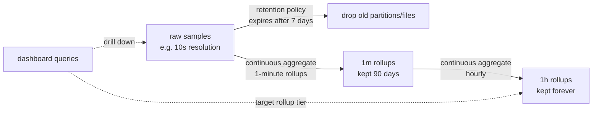
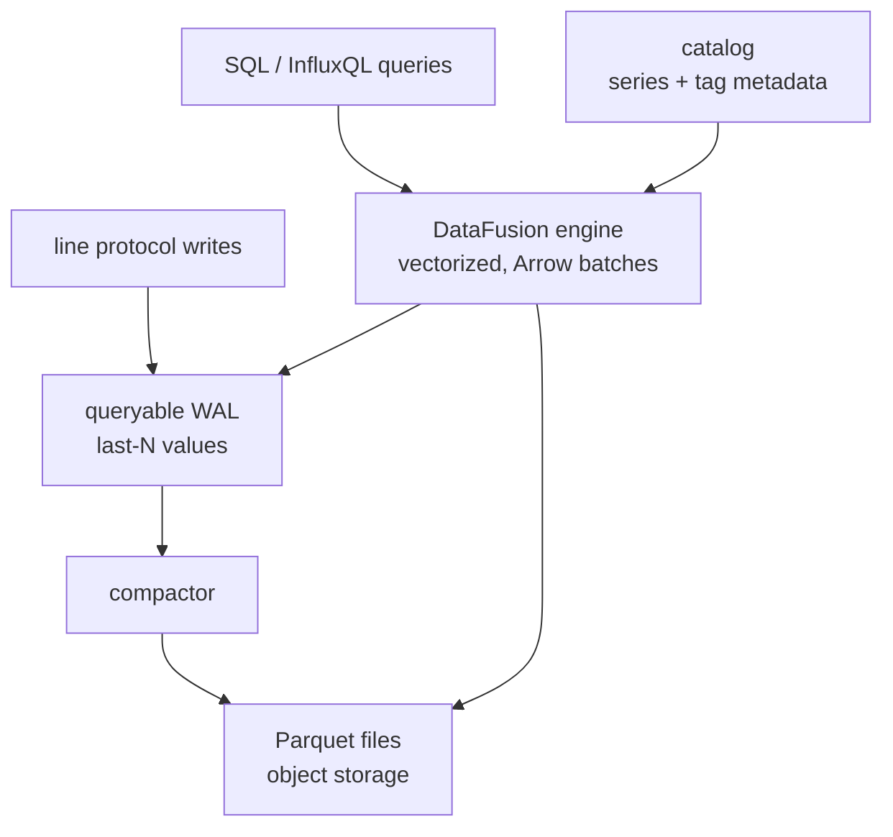

# Time-Series Databases: InfluxDB & TimescaleDB

A time-series database (TSDB) is a storage engine specialized for records whose dominant axis is time: `(timestamp, series identity, value(s))` tuples written at high and steady rates, scanned over time ranges, aggregated by window, and eventually expired. The category exists because general-purpose engines are a poor fit on every axis of that workload — write-heavy ingest of append-only data, range scans that almost always include "recent", strict retention lifecycles, and the cardinality explosion that unique label combinations create. This page covers why TSDBs exist, the storage-engine trade (LSM vs B-tree), the two compression tricks every interviewer asks about — delta-of-delta timestamps and Gorilla XOR float encoding — retention and downsampling, the two flagship systems (InfluxDB with its TSM engine and its Arrow/DataFusion-based v3 rewrite, and TimescaleDB as a PostgreSQL extension), and how to choose a TSDB in a system-design interview. Engine-level internals (series indexes, tombstones, compaction) live in [tsdb-internals.md](../advanced/tsdb-internals.md) and [timeseries-databases-internals.md](../internals/timeseries-databases-internals.md); the observability consumer side lives in [metrics-cardinality.md](../../sre/metrics-cardinality.md).

---

## The workload profile: why a TSDB at all

Time-series workloads have a shape that classic engines handle badly:

- **High, steady ingest**: thousands to millions of samples per second, dominated by *inserts* — updates are rare, and each new sample is strictly newer than the last. An engine optimized for random point updates (a B-tree heap) pays index maintenance on every insert for a pattern that never needs it.
- **Time-ordered access**: 90 %+ of queries filter a time range — "last hour", "yesterday vs today", "p95 latency this week". Physical locality along time converts range scans into sequential reads.
- **Retention is a first-class lifecycle**: raw samples lose value quickly; every series must eventually expire, ideally by *dropping whole files* rather than deleting individual rows.
- **Downsampling**: long-horizon analytics needs 1-minute or 1-hour rollups, not every raw sample — ideally computed continuously, not by nightly cron.
- **Cardinality risk**: each unique (measurement + label set) combination is a *series* with its own storage and index entry. A label that holds user IDs or pod names turns 10 metrics × 10,000 pods into 100,000 series — the operational kill shot of TSDB deployments ([metrics-cardinality.md](../../sre/metrics-cardinality.md)).

Specialization pays twice: ingest-side (compression + append-optimized structures) and query-side (time-partition pruning, windowed aggregation). What you trade away — point updates, ad-hoc secondaries, transactional flexibility — the workload does not use.

## Storage engines: LSM vs B-tree for time series

The core storage question: **LSM-tree or B-tree?** ([lsm-trees.md](../internals/lsm-trees.md), [lsm-btree-hybrid-engines.md](../internals/lsm-btree-hybrid-engines.md)).

**LSM wins ingest.** Writes land in an in-memory table (memtable/write buffer) with a WAL, then flush as immutable sorted files, then compact into larger ones. For time series this aligns perfectly: keys are effectively `(series, timestamp)`, samples arrive in near-sorted order, so flushes produce naturally sorted runs with high compression; retention deletes entire old files instead of writing tombstones per row; and range scans over recent time hit the smallest, hottest levels. The costs: read amplification (a query may check memtable + several levels), background compaction that competes for I/O ("compaction storms" are a classic TSDB incident), and tombstones when deletes do occur. Cassandra and HBase — both LSM engines — were the original substrate for open-source time-series backends precisely for this reason ([cassandra-architecture.md](cassandra-architecture.md), [hbase-architecture.md](hbase-architecture.md)).

**B-trees win read-and-update patterns.** A B-tree keeps each series' pages in place: point reads and last-value lookups are fast, and there is no compaction storm. But per-insert page rewrites and WAL traffic cap ingest, and expiration becomes mass row deletion. The TimescaleDB thesis is that the B-tree problem is *architectural, not fundamental*: partition the table by time into **chunks** so each chunk is a small B-tree that ages out by `DROP TABLE`, and the row-store engine becomes viable for time series — while keeping full PostgreSQL semantics.

The middle ground most production engines occupy: LSM-style immutable *files* for sample data (InfluxDB TSM, Prometheus TSDB blocks) plus B-tree-ish *indexes* for series lookup, with retention implemented as file/chunk expiry. Interview shorthand: **"time series are LSM-friendly because they are append-only and time-clustered; they become B-tree-friendly once you partition by time so that aging out is a file operation."**

The write path detail worth rehearsing: samples hit the WAL, then the in-memory table (typically a per-series or per-partition skiplist/array), where they are already compressed — hot chunks apply the delta/XOR encodings in memory, not only on disk, which is how Gorilla achieved in-memory footprints small enough to keep 26 hours of all of Facebook's metrics in RAM. Flushes freeze the chunk, and query routing chooses between the live head chunk and the immutable tail. When the memtable is a *sorted structure per series*, nearly-ordered arrival needs no re-sorting at all — one more reason time series flatter LSM designs.

## Compression: delta-of-delta timestamps and Gorilla XOR floats

The Gorilla system (Facebook, VLDB 2015) is the canonical reference: in-memory time-series storage holding 2.6 billion samples compressed to **1.37 bytes per sample** (from 16 bytes), 12× better than gzip on the same data. Two encodings do the work.

### Delta-of-delta timestamps

Sensor and monitor samples arrive at near-regular intervals. Store the first timestamp raw, the first *delta* fully, and after that store only the **delta-of-delta** \\(D_i = \\Delta_i - \\Delta_{i-1}\\), where \\(\\Delta_i = t_i - t_{i-1}\\). Steady sampling makes \\(D_i = 0\\) overwhelmingly common — one bit — and small deviations fit tiny variable-length buckets:

| \\(D_i\\) range | control bits | value bits |
|---|---|---|
| \\(D_i = 0\\) | `0` | 0 |
| \\(-63 \\le D_i \\le 63\\) | `10` | 7 |
| \\(-255 \\le D_i \\le 255\\) | `110` | 9 |
| \\(-2047 \\le D_i \\le 2047\\) | `1110` | 12 |
| otherwise | `1111` | 32 |

Worked example — samples every 61 s, then a 1-second hiccup:

```text
t0 = 14:00:00            stored raw        (64 bits)
t1 = 14:01:01  delta=61  first delta raw   (14 bits)
t2 = 14:02:01  delta=60  D = 60-61  = -1   -> '10' + 7 bits  (9 bits)
t3 = 14:03:01  delta=60  D = 60-60  =  0   -> '0'            (1 bit)
t4 = 14:04:01  delta=60  D =  0            -> '0'            (1 bit)

5 timestamps: 64+14+9+1+1 = 89 bits  ~ 17.8 bits each
              vs 64 bits each raw, or 24 bits as epoch seconds
```

The average collapses toward 1 bit per timestamp as long as sampling is regular — which is exactly the regime monitoring traffic lives in.

### Gorilla XOR float encoding

Floats in telemetry barely change between samples. Store the first value raw (64 bits); for each subsequent value compute the XOR with the previous:

- XOR = 0 → single `0` bit (value unchanged — extremely common for gauges).
- Otherwise, count leading zeros \\(L\\) and trailing zeros \\(T\\) in the meaningful window \\(M = 64 - L - T\\). If \\(L\\) and \\(T\\) fall inside the previous value's block, emit `10` + \\(M\\) bits (block reuse); otherwise emit `11` + 5 bits of \\(L\\) + 6 bits of \\(M\\) + the \\(M\\) meaningful bits themselves.

Worked example — a gauge moves from 273.0 to 289.0:

```text
273.0 = 0x4071_1000_0000_0000
289.0 = 0x4072_1000_0000_0000
XOR   = 0x0003_0000_0000_0000

binary of XOR: 0000 0000 0000 0011 0000 ... 0000
leading zeros L = 14, meaningful bits M = 2 ('11'), trailing T = 48

encoding: '11' + L=14 (5 bits) + M=2 (6 bits) + '11' (2 bits) = 14 bits
          vs 64 bits raw; a follow-up value in the same block costs 1+2 bits
```

Why it works is IEEE-754 structure: the exponent lives in the high bits, so values of similar magnitude share long leading-zero runs, and the mantissa changes sit in a narrow window — the XOR localizes information exactly where the encoding can exploit it. Successors (Chimp, Patas, DuckDB's ALP) tighten the bit accounting, but the interview-correct insight is the same: **compress by exploiting the stability of the high bits and the locality of the change**. Text and tag columns use dictionary encoding; integers get delta/RLE schemes — columnar thinking throughout ([columnar-formats.md](../advanced/columnar-formats.md)).

## Ingest semantics: out-of-order data, idempotency, and dedup

Real producers resend, clock skew happens, and backfilled data arrives hours late. TSDB ingest semantics differ exactly here:

- **Ordering tolerance**: LSM-based engines accept nearly-ordered input natively (each series is sorted independently), but *far*-out-of-order writes either rewrite immutable files or are rejected — InfluxDB TSM historically limited out-of-order window; Prometheus-style engines buffer per-series head chunks with a bounded out-of-order window. TimescaleDB simply inserts into the open chunk or creates one — Postgres semantics, at the cost of touching older chunks (mitigated by chunk sizing).
- **Idempotency**: a retried send must not double-count. Conventional design: the timestamp is (part of) the identity — engines either overwrite-on-duplicate (`ON CONFLICT` in TimescaleDB, natural for gauges) or store duplicates and dedup at query (promote counters carefully). A gauges-vs-counters distinction is worth stating: gauges dedup by overwrite; counters must not re-add on retry.
- **Late vs backfill**: live late data (seconds-minutes) wants a small head window; bulk backfill (re-ingesting a day) wants bulk-load paths that bypass per-row triggers — a production migration that ignores this distinction becomes an outage story.

This is the same event-time discipline streaming systems encode with watermarks ([stream-processing.md](../../data-engineering/stream-processing.md)); TSDBs expose it as configuration instead of as a programming model.

## Query languages in practice

The dialects map directly onto the engines' philosophies:

```sql
-- InfluxQL (v1): SQL-shaped, time-bucket built in
SELECT mean(usage) AS cpu_mean
FROM cpu
WHERE host = 'web-1' AND time > now() - 6h
GROUP BY time(1m) FILL(previous);

-- TimescaleDB: pure PostgreSQL, bucketing via function
SELECT time_bucket('1 minute', time) AS bucket, host, avg(usage) AS cpu_mean
FROM cpu WHERE time > now() - interval '6 hours'
GROUP BY bucket, host;
```

InfluxQL hard-codes the TSDB answers (implicit time as the first grouping key, `FILL` strategies, retention-policy syntax); TimescaleDB delegates to full PostgreSQL — window functions, CTEs, lateral joins ([window-functions.md](../sql/window-functions.md), [gaps-and-islands.md](../sql/gaps-and-islands.md)) — and adds only `time_bucket`. The v3 lesson above (InfluxDB adopting SQL/DataFusion) is the industry converging on TimescaleDB's original bet: **users want their existing SQL, not a new dialect**. The cost of the Postgres bet is less pushdown specialization; the cost of the dialect bet is ecosystem isolation. Naming that trade is the interview answer.

## Worked sizing exercise

Interviewers love "can we store this?" arithmetic. Setup: 5,000 hosts, 40 metrics each, scraped every 10 s, raw retention 7 days, then 1-minute rollups for 90 days.

\\[
\\text{samples/day} = 5000 \\times 40 \\times 8640 = 1{,}728{,}000{,}000
\\]

\\[
\\text{compressed raw} \\approx 1.728\\times10^9 \\times 1.5\\ \\text{bytes/sample} \\approx 2.6\\ \\text{GB/day}
\\;\\Rightarrow\\; 7\\ \\text{days} \\approx 18\\ \\text{GB}
\\]

Using the Gorilla figure of ~1.37 bytes/sample plus tag overhead, raw storage is trivially small — which is the *point* of the exercise: raw telemetry compression is solved, and the real constraints are **ingest rate** (20,000 samples/s on one node is comfortable, 2,000,000/s is a cluster question), **series cardinality** \\(5000 \\times 40 = 200{,}000\\) active series (fine; 200,000,000 would not be), and **rollup compute** (1-minute rollups shrink 6:1, cutting 90-day storage to a few GB). A candidate who jumps to "we need a 20-node cluster" without this arithmetic fails; a candidate who produces it and then asks about cardinality sources and alerting paths passes.

One accuracy footnote for the downsampling math: aggregates must carry *counts* (or use sum/count pairs) so that longer-horizon averages can be recomputed correctly — `avg(avg)` across hours is wrong unless hours are weighted by their sample counts. Interviewers who hear this footnote-level detail immediately reclassify a candidate as hands-on.

## Retention, downsampling, continuous aggregates

Raw samples are the most expensive and least durable tier. Production setups define an explicit ladder:



- **Retention policies** are declarative expiry: the engine drops whole files/chunks older than the window — O(1) metadata operations, not row deletes. This is only cheap because data is time-partitioned; it is one more reason the storage layer is time-ordered.
- **Downsampling** writes coarse aggregates into lower tiers. InfluxDB automates it with **continuous queries** (v1) or **tasks** (v2/OSS); TimescaleDB automates it with **continuous aggregates** — incrementally maintained materialized views over time buckets, refreshed with knowledge of exactly which regions changed (invalidation tracking), queryable in *real-time mode* that unions the materialized part with recent raw rows.
- **Precision**: an aggregate tier must record its window function honestly (`avg` of `avg` ≠ overall `avg` unless weighted by counts) — a favorite interview trap when designing metric pipelines.

Cross-references that keep this section honest: the mechanics of compaction, tombstones, and series indexes are engine-level topics ([tsdb-internals.md](../advanced/tsdb-internals.md)); the SRE-facing consequences (burn-rate alerts over downsampled data, long-window SLO math) are covered from the consumer side in [slo-sli-sla.md](../../sre/slo-sli-sla.md) and [workload-forecasting.md](../../sre/workload-forecasting.md) — a TSDB design answer that connects the engine choice to the alerting math it enables is the difference between a storage answer and an architecture answer.

## InfluxDB: TSM, InfluxQL, and the Arrow/DataFusion rewrite

InfluxData's InfluxDB is the purpose-built TSDB most interviews reference across three distinct generations:

**v1 — TSM storage engine.** The Time-Structured Merge engine is an LSM variant tuned for time series: writes go to WAL + in-memory cache; flushes produce immutable, compressed TSM files; background compactions merge them upward. Data model: *measurements* with *tag sets* (indexed) and *field values*; the initial in-memory inverted index over tags became the scalability bottleneck at high cardinality, answered by **TSI** (Time Series Index), an on-disk index structure. Query language **InfluxQL** — SQL-like with time-series extensions (`GROUP BY time(1m)`, `fill(previous)`) — plus **retention policies** and **continuous queries** for downsampling built into the engine.

**v2 — Flux era.** InfluxDB 2.0 unified storage into *buckets* with a new functional language **Flux** (push-down capable, composable), replacing CQs with *tasks*. Flux was powerful but became an adoption liability — a third query language with a steep learning curve and limited ecosystem reuse.

**v3 — the rewrite (InfluxDB 3 / "InfluxDB Core & Enterprise").** The current generation abandons the custom engine entirely and rebuilds on the Apache Arrow ecosystem: in-memory data as **Arrow record batches**, on-disk data as **Parquet** in object storage, and queries executed by **DataFusion** — the Rust, Arrow-native query engine (vectorized, push-down, extensible — the same engine family Trino-style lakes use; see [trino.md](../../data-engineering/trino.md)). Consequences worth quoting in an interview:

- **SQL is back** (plus InfluxQL compatibility), on a real optimizer instead of a bespoke executor.
- **Object storage is the primary tier** — cheap infinite retention, separated compute; the WAL is *queryable* ("last-value cache" for latest-point reads) so ingest never blocks queries.
- Compression inherits Parquet/Arrow columnar encodings (dictionary, RLE, bit-packing) rather than bespoke formats; the timestamp/float tricks above are conceptually preserved in columnar encodings.
- The open-source lineage and code live at [github.com/influxdata/influxdb](https://github.com/influxdata/influxdb); version-specific docs and migration guides at [docs.influxdata.com](https://docs.influxdata.com/). Editions matter in answers: the OSS core (single node, "InfluxDB Edge") differs from the paid Enterprise/Cloud/Dedicated tiers chiefly in clustering, replication, and support — a recurring theme in TSDB economics worth stating explicitly.



## TimescaleDB: PostgreSQL as a TSDB

TimescaleDB takes the opposite bet: do not write a new engine — make PostgreSQL excellent at time series, as an extension. What it adds on top of a stock Postgres (docs at [docs.tigerdata.com](https://docs.tigerdata.com/), source at [github.com/timescale/timescaledb](https://github.com/timescale/timescaledb)):

- **Hypertables**: you create an ordinary table, then `SELECT create_hypertable('conditions', 'time')`. The extension transparently splits the table into **chunks** — time-range partitions (with optional space partitioning) — each a normal child table with its own indexes. Inserts route to the right chunk; queries prune chunks by time.
- **Chunk skipping**: pruning happens at plan time via constraint exclusion and at execution time via a custom `ChunkAppend` node, so "last hour" touches one or two chunks instead of the whole heap. Chunks are sized adaptively (default ~1 day, tuned to keep each comfortably in cache), and retention is `drop_chunks(older_than => ...)` — a file-ish operation, not row deletion.
- **Continuous aggregates**: incrementally-maintained rollups over `time_bucket` windows with automatic invalidation and background refresh; hierarchical (rollups of rollups); real-time mode unions materialized data with fresh raw rows.
- **Native columnar compression**: each chunk can be compressed into a columnar, segment-organized format — ordered by chosen columns, with delta-of-delta timestamps, Gorilla-style float compression, dictionary encoding for text — expanding per-batch only what a query touches. Commonly 90 %+ space savings with query paths that read compressed directly.
- **Everything Postgres stays**: full SQL, joins with relational business data, foreign keys, every driver/tool, backup/HA tooling, and the extension ecosystem. The trade: you inherit Postgres operational characteristics — vertical scaling limits, WAL on every write, and the need for partition-aware ops (the community license "TSL" covers some features; the core is Apache-2).

High availability and scale-out follow the Postgres playbook rather than bespoke machinery: streaming replication and failover for HA, and (in distributed deployments) multi-node sharding across data nodes with the coordinator routing by time and space dimensions. The candid interview caveat: this is *less* turnkey than purpose-built distributed TSDBs for very high ingest — you are buying Postgres's maturity and paying its horizontal-scale awkwardness.

```sql
CREATE TABLE conditions (time TIMESTAMPTZ, device INT, temp DOUBLE PRECISION);
SELECT create_hypertable('conditions', 'time');           -- chunked by time

CREATE MATERIALIZED VIEW temp_hourly WITH (timescaledb.continuous) AS
SELECT time_bucket('1 hour', time) AS bucket, device, avg(temp) AS avg_temp
FROM conditions GROUP BY bucket, device;                   -- auto-refreshed rollup
```

The interview contrast: **InfluxDB is a purpose-built engine chasing ingest scale and simplicity (now on Arrow/DataFusion); TimescaleDB is a workload optimization of a general-purpose engine chasing correctness, SQL, and ecosystem.** IoTBench-style benchmarks and practitioner reports generally put raw single-node ingest in the same order of magnitude, with the deciding factors being cardinality handling, query language fit, and operational philosophy.

Two TimescaleDB details that round out a senior answer: **chunk sizing is a cache decision** — chunks are tuned so the hot working set (recent chunk + its indexes) fits memory, with adaptive sizing available when ingest rates change; and **compression is per-chunk, segment-organized** — rows within a chunk are grouped by a `segmentby` column (typically device ID), ordered by an `orderby` column (typically time), then each column is encoded (delta-delta timestamps, Gorilla-style floats, dictionaries); queries decompress only the segments they touch, so compressed chunks remain queryable, not archive-only.

## Beyond the two: the wider field (name-dropping correctly)

A one-paragraph map so interviews don't catch you flat: **Prometheus** defines the pull-scrape monitoring model and a simple local TSDB, with **VictoriaMetrics** and **Thanos/Mimir** extending it for scale and long retention; **Graphite** (Whisper files) is the historical ancestor; **M3** and **OpenTSDB** put time series over Cassandra/HBase-style backends ([cassandra-architecture.md](cassandra-architecture.md)); **QuestDB** takes the low-latency columnar-on-JVM angle; **kdb+/q** remains the finance-industry time-series king with its own array language; and **ClickHouse** is increasingly used as a de facto TSDB via its MergeTree TTL and time-series functions ([clickhouse.md](../../data-engineering/clickhouse.md)). The pattern to articulate: the field is converging on columnar storage + object-storage tiers + SQL, from every starting point — which is exactly the InfluxDB v3 and TimescaleDB stories above.

## Choosing a TSDB in interviews

Frame the choice by workload, not by brand. The strongest answers start from the write rate, the cardinality, and the query patterns, and only then name an engine — the table below is the map for that conversation:

| Workload | What dominates | Better fit | Why |
|---|---|---|---|
| **Infrastructure metrics** (CPU, QPS, latency) | fixed, low-cardinality label sets; SLO math; alerting | Prometheus/VictoriaMetrics-style or InfluxDB | huge series count but simple schema; pull/scrape model; downsample-and-forget ([slo-sli-sla.md](../../sre/slo-sli-sla.md), [exemplars.md](../../sre/exemplars.md)) |
| **Application/product events** | richer rows, joins with entities, SQL analytics | TimescaleDB | relational context matters; CTEs, joins, constraints |
| **IoT / sensor fleets** | millions of devices, bursty uplink, edge buffering | InfluxDB v3 or TimescaleDB + space partitioning | cardinality management, late/out-of-order writes, tiered retention |
| **Storing in a lake, querying occasionally** | cheap retention, no alerting | Parquet + query engine | TSDBs are ops-heavy for cold data ([lakehouse angle](../../data-engineering/lakehouses.md)) |

The cross-cutting interview checks:

1. **Cardinality first**: estimate series count = measurement × label-value combinations before choosing an engine; ask what the labels are ([metrics-cardinality.md](../../sre/metrics-cardinality.md)).
2. **Late and out-of-order data**: watermarks/windowing semantics for corrections — a TSDB that only accepts append-order breaks reprocessing ([stream-processing.md](../../data-engineering/stream-processing.md)).
3. **Retention math**: ingest rate × bytes per sample × raw window sets storage budget; downsampling tiers usually dominate the answer.
4. **Distributed story**: how the engine shards series across nodes and replicates — InfluxDB historically pushed clustering to the paid tier (single-node OSS), TimescaleDB offers multi-node on top of Postgres replication; compare against the generic replication/consistency playbook ([replication.md](../distributed/replication.md), [consistency.md](../distributed/consistency.md), [sharding.md](../distributed/sharding.md)).
5. **Don't default to a TSDB**: if volume fits Postgres with a BRIN index or the data belongs in a lake, say so — recommending a specialized engine without workload justification is the junior tell.
6. **Close the loop with alerting**: a metrics store without an alert-evaluation path is half a design. Who evaluates rules and how often (Prometheus-style per-node eval, a separate alerting engine, Grafana unified alerting), how alerts survive node loss, and how alert state relates to retention all belong in the answer ([slo-error-budget.md](../../sre/slo-error-budget.md) covers the SLO side of alerting).

Two honesty checks to finish any TSDB design answer. First, **the write path is sacred**: once a TSDB is the alerting backbone, ingest pauses become blind spots, so HA of the *ingest* path (buffering brokers, idempotent retries, admission control) outranks query HA. Second, **schema changes are operational events**: adding a label to 200,000 series doubles cardinality mid-flight — rollouts that touch telemetry labels need the same care as schema migrations, staged and cardinality-budgeted.

## Interview Questions

**Q1. Why are LSM trees the default choice for time-series storage engines, and what price do you pay?**
Answer: LSM trees convert random-ish inserts into sequential immutable file writes, and time-series keys arrive nearly sorted, so flushes produce highly compressed runs; retention drops whole files instead of deleting rows. The price: read amplification across levels, background compaction competing with ingest (compaction storms), and tombstone overhead for any non-file-level deletes. That trade fits append-mostly telemetry perfectly and point-update workloads badly.

**Q2. Explain delta-of-delta timestamp encoding with a concrete example.**
Answer: Store t0 raw and the first delta raw; afterwards store only the change in delta \\(D_i = \\Delta_i - \\Delta_{i-1}\\). For samples every 61 s: t1's delta is 61 (14 bits), t2's delta is 60 so D = −1 → control `10` + 7 bits; t3 onward D = 0 → a single bit. Five timestamps cost 89 bits instead of 320. Regular sampling makes D = 0 dominant, so average cost approaches ~1 bit per timestamp.

**Q3. How does Gorilla's XOR scheme compress floats, and why does IEEE-754 make it work?**
Answer: Store the first value raw; for each next value XOR with the previous. Equal values cost one bit; otherwise store the leading-zero count, the meaningful-bit window, and only those bits (reusing the previous window when possible). It works because the sign+exponent occupy the high bits: values of similar magnitude share long zero runs there, and mantissa changes cluster in a small window — e.g. 273.0 vs 289.0 differ only in 2 meaningful bits, costing 14 bits to encode versus 64 raw.

**Q4. What is a hypertable in TimescaleDB, and how does it make B-tree storage viable for time series?**
Answer: A hypertable is a PostgreSQL table transparently partitioned into time-ranged chunks (each an ordinary child table with its own indexes). This fixes the two B-tree weaknesses: queries prune to relevant chunks (constraint exclusion + ChunkAppend) instead of scanning one giant tree, and retention becomes `drop_chunks` — dropping a child table — rather than mass row deletion. The engine keeps full Postgres semantics while behaving like a time-partitioned store.

**Q5. What changed architecturally in InfluxDB 3, and why move to Apache Arrow, Parquet, and DataFusion?**
Answer: InfluxDB 3 replaced the custom TSM/TSI stack with Arrow record batches in memory, Parquet files in object storage as the primary tier, and the DataFusion engine for query planning/execution. Gains: standard SQL (plus InfluxQL compatibility) on a real optimizer, cheap near-infinite retention on object storage, a queryable WAL for latest-value reads, and abandonment of a bespoke language (Flux) in favor of ecosystem-standard components — trading engineering effort on storage internals for effort on time-series-specific features.

**Q6. What is cardinality in a TSDB, and how would you mitigate a cardinality explosion?**
Answer: Cardinality is the number of unique series — unique (measurement, label-value-set) combinations — each of which needs index entries and its own compressed stream. A high-cardinality label (user ID, pod name) multiplies series counts explosively and degrades memory, ingest, and queries. Mitigations: drop or bucket high-cardinality labels, separate metrics from event data, pre-aggregate at ingest, enforce label allowlists, and use engines designed for high cardinality ([metrics-cardinality.md](../../sre/metrics-cardinality.md)).

**Q7. You must keep raw 10-second metrics for 7 days, 1-minute rollups for 90 days, and hourly aggregates forever. Describe the pipeline.**
Answer: Write raw samples to the TSDB; configure a retention policy that expires raw after 7 days via file/chunk drops; define a continuous downsampling job (InfluxDB task/continuous query, TimescaleDB continuous aggregate) computing 1-minute aggregates (sum/count/min/max/avg with counts, not avg-of-avg), retained 90 days; a second tier rolls 1-minute into hourly, retained indefinitely. Dashboards query the coarsest sufficient tier and drill down only when needed.

**Q8. When would you recommend *not* using a dedicated TSDB?**
Answer: When the data is relational at heart (needs joins, constraints, transactions — TimescaleDB-on-Postgres or plain Postgres suffices), when volume is small enough that a BRIN-indexed Postgres table is simpler ops-wise, or when the data is cold analytics destined for a lake — Parquet plus a query engine is cheaper than operating an ingest-tuned engine. The deciding factors are ingest rate, cardinality, retention complexity, and alerting needs, not habit.
