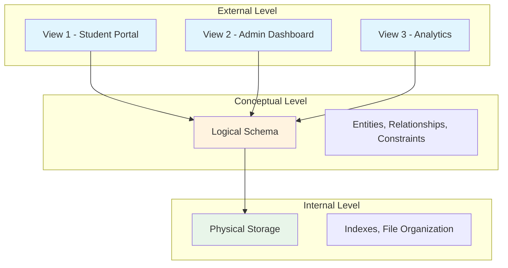
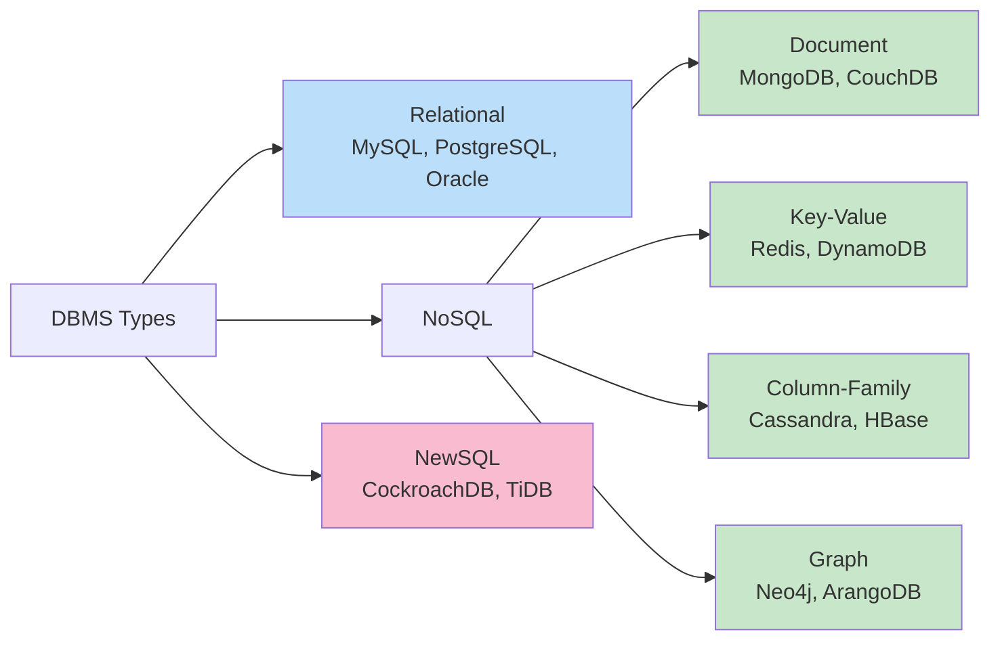
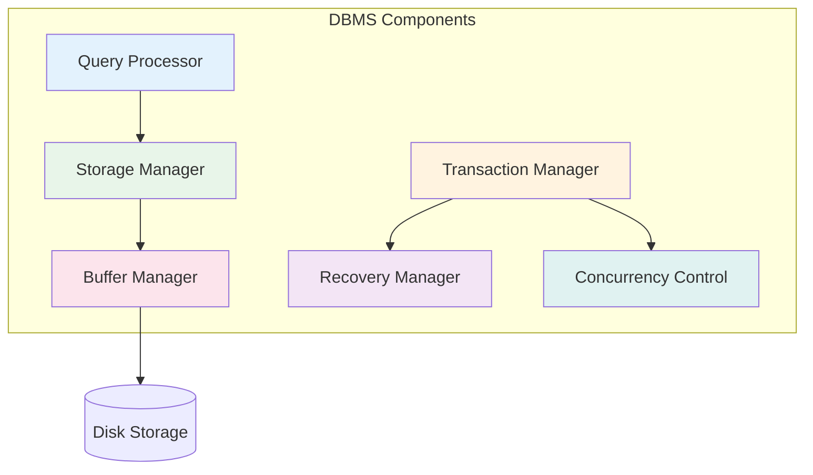

# Database Management Systems — Overview

## What is a DBMS?

A **Database Management System (DBMS)** is software that enables users to define, create, maintain, and control access to a database. It acts as an interface between end-users/applications and the database itself, ensuring data is consistently organized and remains easily accessible.

### DBMS vs File System

| Aspect | File System | DBMS |
|---|---|---|
| Data Redundancy | High — duplicate files common | Controlled via normalization |
| Data Inconsistency | Likely due to redundancy | Enforced by constraints |
| Data Isolation | Scattered across files | Centralized, structured |
| Concurrent Access | Poor or manual locking | Built-in concurrency control |
| Security | OS-level permissions | Fine-grained access control |
| ACID Properties | Not guaranteed | Guaranteed (transactions) |
| Backup & Recovery | Manual, error-prone | Automated, reliable |

### Why DBMS Matters for Placements

Every major tech company uses databases extensively. DBMS concepts appear in:
- **Coding interviews**: SQL queries, schema design
- **System design interviews**: Database selection, sharding, replication
- **Core CS rounds**: Normalization, transactions, indexing
- **Machine coding**: ORM design, query optimization

## Architecture: Three-Schema Architecture

The three-schema architecture separates user applications from the physical database:

- **External Level (Views)**: What individual users see. Each user may have a different view of the same data.
- **Conceptual Level (Logical Schema)**: The complete logical structure — entities, relationships, constraints, data types.
- **Internal Level (Physical Schema)**: How data is physically stored — file structures, indexing, compression.

### Data Independence

- **Logical Data Independence**: Change the conceptual schema without altering external schemas (views).
- **Physical Data Independence**: Change the internal schema without altering the conceptual schema.

## DBMS Classification

### Relational (SQL) Databases
- Data organized in **tables** (relations) with rows and columns
- **Schema-on-write**: Structure defined before data insertion
- **ACID transactions** guaranteed
- **SQL** as query language
- Best for: structured data, complex queries, strong consistency
- Examples: PostgreSQL, MySQL, Oracle, SQL Server

### NoSQL Databases
- **Schema-on-write → Schema-on-read** (flexible schemas)
- Designed for horizontal scaling, high availability
- Eventual consistency (BASE model) in many cases
- Four sub-types as shown above
- Best for: unstructured/semi-structured data, massive scale, specific access patterns

### NewSQL
- Combine ACID guarantees of RDBMS with horizontal scalability of NoSQL
- Examples: CockroachDB, Google Spanner, TiDB

## Components of a DBMS

1. **Query Processor**: Parses, optimizes, and executes SQL queries
2. **Storage Manager**: Manages physical data storage and retrieval
3. **Buffer Manager**: Caches disk pages in memory for performance
4. **Transaction Manager**: Ensures ACID properties for all transactions
5. **Concurrency Control**: Manages simultaneous access by multiple users
6. **Recovery Manager**: Restores database to a consistent state after failures

## ER Model → Relational Model → SQL → Normalization → Indexing → Transactions

This section covers DBMS in the following order:

1. **Relational Model** — Foundation: relations, keys, ER diagrams, relational algebra
2. **SQL** — The practical language: DDL, DML, joins, subqueries, views, advanced features
3. **Normalization** — Eliminating redundancy: 1NF through 5NF, denormalization
4. **Transactions & Concurrency** — ACID, serializability, locking, MVCC, recovery
5. **Indexing & Performance** — B-Trees, hash indexes, query optimization

## Interview Questions

### Beginner

**Q1: What is the difference between DBMS and RDBMS?**
A: RDBMS is a subset of DBMS that stores data in tables with relationships enforced by foreign keys. RDBMS always supports ACID transactions and uses SQL. Examples: MySQL, PostgreSQL. DBMS is a broader term that includes hierarchical (IMS), network (IDMS), and object-oriented databases.

**Q2: What are the advantages of using a DBMS?**
A: Reduced data redundancy, data consistency, data sharing, security, backup/recovery, concurrent access control, data integrity via constraints, and data independence.

**Q3: Explain the concept of data independence.**
A: Data independence means changing the schema at one level doesn't affect the schema at the next higher level. Physical data independence (change storage without affecting logical schema) and logical data independence (change logical schema without affecting views).

### Intermediate

**Q4: What is the difference between procedural and declarative query languages?**
A: Procedural languages (relational algebra) specify *how* to get data — the exact operations and order. Declarative languages (SQL, relational calculus) specify *what* data is needed, leaving the execution strategy to the DBMS optimizer.

**Q5: Compare CAP theorem trade-offs in RDBMS vs NoSQL.**
A: Traditional RDBMS prioritizes Consistency and Availability (CA), often sacrificing Partition tolerance by running on single nodes or tightly-coupled clusters. Most NoSQL databases choose AP (Cassandra, DynamoDB) or CP (MongoDB, HBase), accepting eventual consistency or reduced availability during partitions.

### Advanced / FAANG-Level

**Q6: Design a database system for a social network with 2 billion users. Discuss schema, sharding, replication, and indexing strategies.**
A: Key considerations:
- **Schema**: User table (user_id PK, profile info), Posts, Followers (composite PK), News Feed cache
- **Sharding**: Hash-based sharding on user_id for User table; range-based on timestamp for Posts
- **Replication**: Master-slave for reads (followers can be eventually consistent); synchronous replication for critical writes (payments)
- **Indexing**: Composite index on Followers(follower_id, followee_id); B+ tree on Posts(user_id, created_at DESC) for feed generation
- **Caching**: Redis for hot user profiles and recent posts; cache-aside pattern
- **Denormalization**: Store follower_count on User table to avoid COUNT queries

**Q7: Explain how a DBMS query optimizer works internally.**
A: The optimizer:
1. **Parsing**: SQL → parse tree (syntax validation)
2. **Semantic analysis**: Check table/column existence, type checking
3. **Logical optimization**: Apply rewrite rules (predicate pushdown, subquery flattening, join elimination)
4. **Cost-based optimization**: Generate multiple execution plans, estimate cost using statistics (table sizes, index selectivity, data distribution histograms)
5. **Plan selection**: Choose lowest-cost plan considering CPU, I/O, and memory
6. **Execution**: Execute via volcano/iterator model

## Common Mistakes

- Confusing DBMS with just "databases" — DBMS is the software, database is the data collection
- Assuming all databases are relational
- Ignoring physical data independence when designing schemas
- Not understanding the difference between logical and physical design
- Treating NoSQL as a silver bullet — each type has specific trade-offs

## Summary

| Concept | Key Takeaway |
|---|---|
| Three-Schema Architecture | External, Conceptual, Internal levels |
| Data Independence | Logical and Physical separation |
| RDBMS vs NoSQL | Structure + ACID vs Flexibility + Scale |
| Components | Query Processor, Storage, Buffer, Transaction, Recovery managers |
| CAP Theorem | Consistency, Availability, Partition tolerance — pick 2 |

## Cross-References

- [Relational Model](relational-model/README.md) — Foundation of relational databases
- [SQL](sql/README.md) — Practical query language
- [Normalization](normalization/README.md) — Eliminating data redundancy
- [Transactions](transactions/README.md) — ACID and concurrency control
- [Indexing](indexing/README.md) — Performance optimization

## Cross References

- [Relational Model](relational-model/README.md)
- [SQL](sql/README.md)
- [Transactions](transactions/README.md)
- [OS Overview](../os/overview.md)
- [Storage Overview](../storage/overview.md)
