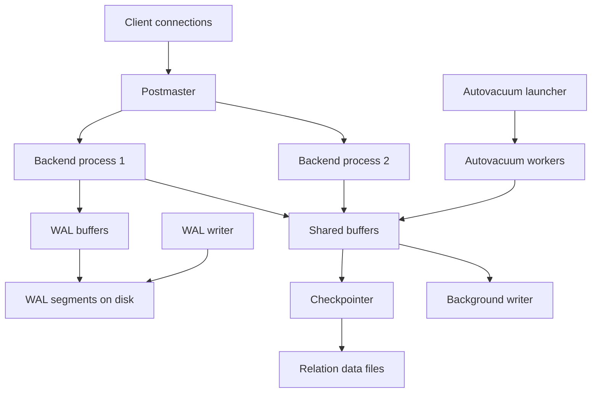

# PostgreSQL Overview

## Architecture

```
Client → Postmaster (master process)
              ├── Backend Process (per connection)
              │   ├── Parser
              │   ├── Rewriter
              │   ├── Planner/Optimizer
              │   └── Executor
              ├── Shared Buffers (shared memory)
              ├── WAL Buffers
              └── Background Workers
                  ├── bgwriter (writes dirty pages)
                  ├── checkpointer
                  ├── autovacuum
                  ├── walwriter
                  ├── logical replication launcher
                  └── WAL archiver
```

The same architecture in diagram form, showing which processes touch shared memory and which touch disk. It is worth memorizing: interviewers use it as a warm-up ("who writes WAL?", "who cleans dead tuples?") and as a springboard into crash recovery.



Key points the diagram encodes: backends are the *only* processes that run user SQL and they read/write shared buffers directly; the **WAL writer** flushes WAL buffer content to disk asynchronously while commits force-flush WAL at `synchronous_commit` time; the **checkpointer** periodically flushes all dirty buffers to data files so replay after a crash starts from a recent checkpoint; **autovacuum launcher** spawns workers that clean dead tuples per database. The postmaster survives backend crashes and restarts them, but a shared-memory corruption aborts the whole cluster — that is why a single bad backend can take down the instance.

## Process-per-Connection and Pooling

PostgreSQL uses a **process per connection**: each client gets a forked backend (`fork()` on connect, one OS process, one `Backend` shared-memory slot). The model is robust — one backend's crash rarely corrupts shared state, and the code is free of thread-safety landmines — but it makes connections expensive: a few MB of memory per backend plus fork cost and per-connection catalog/plan caches. Thousands of idle connections waste RAM, and tens of thousands cause scheduler and lock-contention collapse; this is the opposite of MySQL's thread-per-connection and drives the "don't set max_connections to 10000" advice in every Postgres runbook.

The production answer is **external connection pooling** with PgBouncer (or the app-side equivalent): a proxy that holds few real Postgres connections and multiplexes client connections onto them.

| PgBouncer mode | Semantics | Safe for |
|---|---|---|
| **Session pooling** | Client owns a server connection until it disconnects | Everything, but pooling gain is small for long-lived sessions |
| **Transaction pooling** | Server connection assigned per transaction; returned at COMMIT | OLTP apps that keep all state in the database; biggest throughput gain |
| **Statement pooling** | Connection returned after each statement | Stateless single-statement workloads only (multi-statement transactions break) |

Transaction pooling breaks **session state**: session-level `SET`/GUCs, advisory locks, cursors across transactions, temp tables, and `LISTEN/NOTIFY`; protocol-level prepared statements (used by many drivers) now work via PgBouncer's protocol tracking (1.21+), but app-level prepared names still don't. Interviews love this: "why did my advisory lock break after we added PgBouncer?" is a real production story. Postgres 14+ also gained libpq **pipeline mode**, which cuts round trips within one connection but does not replace pooling across connections.

You can see the whole cast from the OS side — a good habit when debugging an unfamiliar instance:

```bash
ps -u postgres -o pid,etime,cmd
# postgres                <- postmaster (the listener/supervisor)
# postgres: checkpointer
# postgres: background writer
# postgres: walwriter
# postgres: autovacuum launcher
# postgres: logical replication launcher
# postgres: userdb [local] idle     <- one process per client connection
```

If a client causes a backend to crash, the postmaster logs it, cleans shared memory, and restarts the *whole instance* — because shared-buffer state can no longer be trusted. That blast radius, per-backend memory and fork cost, and the inability to share prepared plans across backends are the three honest downsides to name when asked to compare Postgres's process model against thread-per-connection engines like MySQL.

## Key Numbers to Memorize

Defaults are interview gold because they anchor sizing conversations:

| Setting | Default | Interview significance |
|---|---|---|
| `shared_buffers` | 128 MB | Always too small; production rule of thumb ≈ 25% of RAM |
| `max_connections` | 100 | The ceiling PgBouncer exists to respect |
| WAL segment size | 16 MB | Unit of archiving/replication transport |
| `checkpoint_timeout` | 5 min | Recovery-time vs I/O-smoothness dial |
| `checkpoint_completion_target` | 0.9 | Spread checkpoint I/O across 90% of the interval |
| `autovacuum_naptime` | 1 min | Polling granularity of the launcher, not a table guarantee |
| Backend memory floor | several MB | Why 10k direct connections collapse an instance |
| `synchronous_commit` | on | Commit = WAL flush; `off` loses recent txns, never corrupts |

## MVCC (Multi-Version Concurrency Control)

Each transaction sees a snapshot of the database. Readers don't block writers, writers don't block readers.

```
Row: (xmin=100, xmax=∞, data="Alice")
  - xmin: transaction that created this row
  - xmax: transaction that deleted this row (0 = live)
  
Transaction 101 reads: sees row (xmin=100 committed, xmax=0)
Transaction 102 updates: creates new row (xmin=102), sets xmax=102 on old row
Transaction 101 still sees old row (its snapshot is from before 102)
```

## VACUUM

MVCC creates dead tuples (old row versions). VACUUM reclaims space.

- **VACUUM**: Marks dead tuple space as reusable (doesn't return to OS)
- **VACUUM FULL**: Rewrites table, returns space to OS (blocks table)
- **autovacuum**: Background process that runs VACUUM automatically

```sql
-- Manual vacuum
VACUUM ANALYZE my_table;

-- Check dead tuples
SELECT relname, n_dead_tup, last_autovacuum 
FROM pg_stat_user_tables ORDER BY n_dead_tup DESC;
```

## WAL (Write-Ahead Log)

All changes are written to WAL before modifying data files. This ensures:
- **Durability**: Committed changes survive crashes (replay WAL)
- **Atomicity**: Uncommitted changes are rolled back
- **Replication**: WAL shipped to replicas

## Key Directory Map

This section is the hub; the pages around it carry the depth. Start with the siblings in this directory, then follow the internals links for the questions that go below the surface.

| Page | What it adds on top of this overview |
|---|---|
| [advanced-features.md](./advanced-features.md) | JSONB, window functions, partitioning, full-text search, extensions (PostGIS, pg_stat_statements) |
| [interview-questions.md](./interview-questions.md) | Graded question bank covering everything this hub introduces |
| [MVCC deep dive](../internals/postgresql-mvcc-deep.md) | xmin/xmx snapshots, visibility map, freeze, wraparound avoidance — the "how" under MVCC above |
| [WAL internals](../internals/wal.md) | Record format, full-page writes, checkpoints, replication streams — the "how" under WAL above |
| [MVCC & isolation](../transactions/mvcc.md) | Snapshot semantics vs lock-based concurrency, anomalies each model permits |
| [Isolation levels](../transactions/isolation-levels.md) | Read Committed vs Repeatable Read vs Serializable in Postgres terms |
| [Buffer management](../storage/buffer-management.md) | Clock-sweep replacement, shared_buffers sizing, double-buffering with the OS cache |
| [Indexing](../indexing/README.md) | B-tree/GIN/GiST/BRIN — what the executor's index scans actually touch |

## Version Highlights (9.6 → 17)

Version trivia is a fast way to date a candidate's production experience. The rows below are the one-liners that matter for interviews; each major release's notes are linked in References.

| Version (year) | Headline features interviewers expect |
|---|---|
| **9.6** (2016) | Parallel sequential scans, phrase search, freeze/visibility-map improvements that set up later vacuum work |
| **10** (2017) | Logical replication (publish/subscribe), declarative partitioning, SCRAM-SHA-256 auth |
| **11** (2018) | Parallel index builds + hash joins, JIT expression compilation, partition pruning, covering indexes (`INCLUDE`) |
| **12** (2019) | Smarter partition pruning + partition-wise joins, `REINDEX CONCURRENTLY`, CTE materialization made explicit (`MATERIALIZED`) |
| **13** (2020) | B-tree deduplication (smaller indexes), parallel VACUUM of indexes, catalog tables moved to MVCC (less catalog bloat), backup manifests |
| **14** (2021) | Multirange types, libpq pipeline mode, out-of-order WAL replay on standbys, vacuum tuning defaults |
| **15** (2022) | `MERGE`, row/column filters for logical replication, hardened default privileges on public schema |
| **16** (2023) | Parallel `FULL`/`RIGHT` hash joins, logical replication from standbys, `pg_stat_io` view, vacuum memory improvements |
| **17** (2024) | Incremental backups (`pg_basebackup --incremental`), VACUUM memory footprint cut (TID store, ~20× for large tables), `MERGE ... WHEN NOT MATCHED BY SOURCE`, failover-capable replication slots |

The meta-pattern to narrate: Postgres has spent a decade converting "manual DBA work" into engine features — parallelism (9.6–11), partitioning maturity (10–12), bloat/vacuum automation (13, 17), replication robustness (10, 14–17). Matching a workload to a version boundary (e.g., "we need incremental backups → 17") is a senior-level framing.

## Interview Questions

### Q: Why is a connection to Postgres expensive, and what do you do about it?

Each connection is a forked OS process with its own memory (several MB), plan caches, and catalog lookups, so 10k connections cost tens of GB and scheduler contention long before you hit any per-connection work. The standard fix is PgBouncer in transaction mode, multiplexing thousands of cheap client connections onto a few dozen real backends. The follow-up is always the broken things: transaction mode loses session-level state (advisory locks, session GUCs, temp tables, LISTEN/NOTIFY), so either those move into the database or you pay for session pooling.

### Q: Who writes WAL, and what happens on commit?

Backends write WAL records into WAL buffers and, at commit under the default `synchronous_commit=on`, wait until the WAL writer/flush reaches the commit record on disk — that fsync is the durability point of the whole system. The dedicated `walwriter` process flushes WAL buffers between commits so a later commit has less to flush, and `synchronous_commit=off` trades a window of acknowledged-but-lost transactions (no corruption, just loss) for latency. Checkpointing then ensures data files catch up so WAL replay after crash stays bounded.

### Q: What does a checkpoint do and how do you tune it?

The checkpointer flushes all dirty shared buffers to data files and writes a checkpoint record so crash recovery only replays WAL since that point. Tuning is `checkpoint_timeout` (how often) and `checkpoint_completion_target` (spread the flush over that fraction of the interval, default 0.9) — a checkpoint that fires all at once causes an I/O cliff, while spreading it smooths latency at the cost of longer crash recovery. Interviewers want the trade-off named: more frequent checkpoints mean faster recovery but more steady-state I/O.

### Q: Explain how MVCC leads to bloat and how VACUUM and autovacuum fight it.

UPDATE and DELETE never modify a row in place — they create new tuple versions and mark old ones dead, so any hot table accumulates dead tuples that only VACUUM can reclaim. Plain VACUUM marks space reusable within the table (no OS-level shrink, no lock beyond ShareUpdateExclusive), while VACUUM FULL rewrites the table and returns disk to the OS but takes an exclusive lock. Autovacuum launches workers based on dead-tuple thresholds/fraction per table; when you see `n_dead_tup` climbing with `last_autovacuum` stale, the answer is tuning (scale factor, cost limits) or fixing long-running transactions that pin old snapshots.

### Q: When would you choose logical replication over physical (streaming) replication?

Physical streaming replication ships WAL blocks and clones the whole cluster byte-for-byte — it is the default HA answer (hot standbys, failover slots in 17) because it is simple and exact. Logical replication ships change events per publication/table (row/column filters since 15), so you can upgrade major versions with near-zero downtime, replicate a subset of tables, fan out to analytics, or merge across sites — things physical replication structurally cannot do. The costs to name: logical decoding doesn't carry DDL, sequences need manual sync, and per-table identity keys (REPLICA IDENTITY) become part of your schema design.

### Q: What changed between Postgres 12 and 16 that would affect your schema design?

Partition pruning became genuinely usable (12+ partition-wise joins/aggregates), making declarative partitioning the default scaling story for large tables rather than an inheritance hack. Logical replication gained row/column filters and standby sources (15/16), turning it into a realistic migration and sharding tool, not just CDC plumbing. And `pg_stat_io` (16) finally exposes per-backend I/O statistics, which changes how you'd debug buffer-cache misses. Citing one concrete "this release changed how I'd build X" is the difference between a memorized table and experience.

## Key Takeaways

- Postgres is **process-per-connection**: crash-safe and simple, but each backend costs MBs — pooling with PgBouncer (transaction mode for OLTP) is mandatory at scale.
- Know the background cast by name and duty: **walwriter** (flush WAL), **checkpointer** (flush data files, bound recovery), **bgwriter** (front-run backends on dirty pages), **autovacuum** (dead-tuple cleanup), postmaster (supervisor).
- MVCC means **readers never block writers** — and dead tuples are the invoice; VACUUM (space reusable) vs VACUUM FULL (space returned, exclusive lock) is the standard trade-off question.
- WAL is the single durability point: commit = WAL fsync; `synchronous_commit=off` risks losing recent transactions but never corrupting data files.
- Transaction pooling breaks session state — the classic production incident is advisory locks or session GUCs silently misbehaving after PgBouncer was added.
- Version literacy signals production experience: parallelism landed 9.6–11, partitioning matured 10–12, vacuum/bloat control in 13 and 17, logical replication became real in 15–16.
- This hub is the map; the MVCC-deep, WAL-internals, and buffer-management pages are where senior interviewers actually live.

## References

- [PostgreSQL Documentation](https://www.postgresql.org/docs/)
- [PostgreSQL Internals — Egor Rogov](https://postgrespro.com/education/books/internals)
- System architecture tutorial chapter: <https://www.postgresql.org/docs/current/tutorial-arch.html>
- Release notes index (9.6 → 17): <https://www.postgresql.org/docs/release/>
- PgBouncer features and pool modes: <https://www.pgbouncer.org/features.html>
- WAL configuration (docs): <https://www.postgresql.org/docs/current/wal-configuration.html>

## Cross-References

- [PostgreSQL Advanced Features](./advanced-features.md) — JSONB, window functions, partitioning, extensions beyond this overview
- [PostgreSQL Interview Questions](./interview-questions.md) — graded question bank for this whole section
- [PostgreSQL MVCC Deep Dive](../internals/postgresql-mvcc-deep.md) — snapshots, visibility map, freezing, wraparound
- [WAL Internals](../internals/wal.md) — record format, full-page writes, checkpoint mechanics
- [MVCC vs Locking](../transactions/mvcc.md) — how Postgres's model compares with lock-based engines
- [Isolation Levels](../transactions/isolation-levels.md) — what Read Committed really permits
- [Buffer Management](../storage/buffer-management.md) — clock-sweep and shared_buffers sizing
- [Indexing](../indexing/README.md) — B-tree/GIN/GiST/BRIN internals the executor scans
