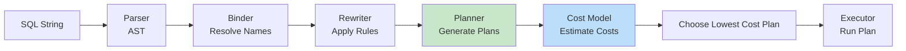

# Query Planner

The query planner (or query optimizer) translates a SQL statement into an execution plan — a sequence of operations (scans, joins, sorts, aggregates) that retrieves the requested data. The quality of this plan determines whether a query runs in milliseconds or hours.

## How Query Planning Works



### Stages

1. **Parsing** — SQL text is parsed into an Abstract Syntax Tree (AST)
2. **Binding/Semantic Analysis** — resolves table and column names, checks types, validates permissions
3. **Rewriting** — applies transformation rules: subquery unnesting, predicate pushdown, view expansion, constant folding
4. **Planning** — generates alternative execution plans (join orderings, scan methods, join algorithms)
5. **Cost Estimation** — each plan is scored using a cost model based on statistics
6. **Execution** — the chosen plan is executed by the storage engine

## Statistics

The planner relies on **table statistics** to estimate cardinality and selectivity:

| Statistic | Description | Command |
|---|---|---|
| Row count | Approximate number of rows | `ANALYZE` (auto or manual) |
| Column null fraction | Fraction of NULL values | `ANALYZE` |
| Most common values (MCV) | Top-N most frequent values | `ANALYZE` |
| Histogram | Value distribution for non-uniform data | `ANALYZE` |
| Distinct values (n_distinct) | Approximate cardinality | `ANALYZE` |
| Correlation | Physical order vs column value order | `ANALYZE` |

```sql
-- PostgreSQL: manual statistics update
ANALYZE my_table;

-- View statistics
SELECT attname, n_distinct, null_frac, correlation
FROM pg_stats
WHERE tablename = 'my_table';
```

Stale statistics cause the planner to choose bad plans. After bulk loads or significant data changes, run `ANALYZE`.

## Plan Caching

Compiling an execution plan is expensive. Databases cache plans to avoid re-planning:

| Database | Mechanism | Invalidation |
|---|---|---|
| PostgreSQL | Prepared statements, PL/pgSQL | `DEALLOCATE`, schema changes |
| MySQL | Query cache (deprecated 8.0) | Table modification |
| SQL Server | Parameterized plan cache | Statistics update, schema change |
| Oracle | Library cache | Statistics change, DDL |

**Parameter sniffing** is a plan caching pitfall: the first execution's parameter values shape the cached plan, which may be suboptimal for other values.

## Hints

Query hints allow developers to override the planner's decisions:

```sql
-- PostgreSQL: no native hints (use pg_hint_plan extension)
-- MySQL: index hint
SELECT * FROM orders USE INDEX (idx_customer_date)
WHERE customer_id = 42;

-- SQL Server: join hint
SELECT * FROM orders o INNER HASH JOIN customers c ON o.customer_id = c.id;

-- Oracle: leading hint for join order
SELECT /*+ LEADING(c o) */ * FROM customers c JOIN orders o ON c.id = o.customer_id;
```
Hints are a last resort. Fix statistics and schema design first — hints create maintenance burden and can become wrong as data changes.

## EXPLAIN ANALYZE

```sql
EXPLAIN (ANALYZE, BUFFERS, FORMAT TEXT)
SELECT c.name, COUNT(o.id)
FROM customers c
JOIN orders o ON c.id = o.customer_id
WHERE c.country = 'US'
GROUP BY c.name;

-- Key outputs:
-- Seq Scan on customers (cost=0.00..1543.00 rows=10000)
-- Hash Join (cost=... actual time=12.3..45.6 rows=52310 loops=1)
--   -> Seq Scan on orders (cost=... rows=100000)
-- Planning Time: 0.23 ms
-- Execution Time: 48.1 ms
```

| Column | Meaning |
|---|---|
| `cost` | Planner's estimated cost (startup..total) |
| `rows` | Estimated rows (vs `actual rows` after ANALYZE) |
| `actual time` | Real execution time in milliseconds |
| `loops` | Times the node was executed (e.g., nested loop) |

Large discrepancies between `rows` and `actual rows` indicate stale statistics.

## Interview Questions

**Q1: What is the difference between a rule-based and cost-based optimizer?**
A: A rule-based optimizer (RBO) applies fixed heuristics (e.g., "always use index if available") without considering data distribution. A cost-based optimizer (CBO) estimates the cost of each plan using statistics (row counts, selectivity) and chooses the cheapest. All modern databases use CBO.

**Q2: Why would the planner choose a sequential scan over an index scan?**
A: When the table is small (a few pages), the random I/O of index lookups costs more than reading the entire table. Also, when selecting a large fraction of rows (low selectivity), a sequential scan is more efficient. The planner estimates selectivity from column statistics.

**Q3: What causes a bad execution plan after data growth?**
A: Statistics become stale — the planner assumes old cardinality estimates. Run `ANALYZE` to refresh. Other causes: parameter sniffing (cached plan from atypical parameter), missing indexes, or predicates the planner can't estimate well (e.g., function calls on columns).

**Q4: What is predicate pushdown and why does it matter?**
A: The planner pushes WHERE and HAVING filters as close to the data source as possible (before joins and aggregations). This reduces the number of rows processed in downstream operations, dramatically improving performance. Views and subqueries can block pushdown if they contain aggregates or window functions.

## Cross-References

- [Execution Plans](query-processing/execution-plans.md) — Reading and interpreting plans
- [Cost Estimation](query-processing/cost-estimation.md) — Cost model internals
- [Optimization](query-processing/optimization.md) — Transformation rules
- [Indexes](indexing/b-plus-tree.md) — How indexes affect plan selection
- [Correlated Subqueries](sql/correlated-subqueries.md) — Subquery decorrelation

## References

- [PostgreSQL: EXPLAIN](https://www.postgresql.org/docs/current/using-explain.html)
- [MySQL: Optimizer](https://dev.mysql.com/doc/refman/8.0/en/optimizer.html)
- [SQL Server: Query Tuning](https://learn.microsoft.com/en-us/sql/relational-databases/performance/execution-plans)
