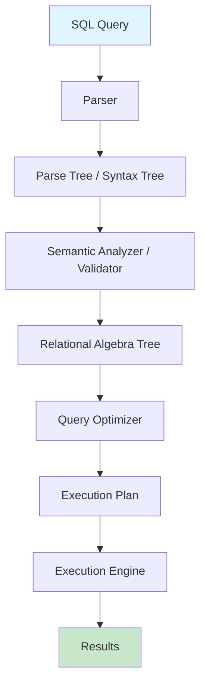

# Query Processing

## Overview

Query Processing is the series of steps a Database Management System (DBMS) follows to convert a high-level SQL query into an efficient execution plan and return results. It is one of the most critical components of any relational database, directly impacting performance and scalability.

Understanding query processing is essential for:
- Writing efficient SQL queries
- Interpreting EXPLAIN plans
- Debugging slow queries
- Acing system design and DBMS interviews

## The Query Processing Pipeline



### Step-by-Step Breakdown

| Phase | Input | Output | Key Concept |
|-------|-------|--------|-------------|
| **Parsing** | SQL string | Parse tree | Syntax validation, tokenization |
| **Translation** | Parse tree | Relational algebra tree | Converting SQL to internal representation |
| **Optimization** | Algebra tree | Execution plan | Choosing lowest-cost plan |
| **Execution** | Execution plan | Result set | Running the plan against stored data |

## Key Topics

### 1. [Parsing](./parsing.md)
How SQL text is tokenized, validated, and converted into an internal representation (parse tree or abstract syntax tree).

### 2. [Query Optimization](./optimization.md)
How the optimizer explores equivalent relational algebra expressions and selects the one with the lowest estimated cost.

### 3. [Join Algorithms](./joins.md)
Overview of the major join strategies: nested loop, hash join, and sort-merge join.

### 4. [Nested Loop Join](./nested-loop.md)
The simplest join algorithm — iterating over one table for each tuple of the other.

### 5. [Hash Join](./hash-join.md)
Building a hash table on one relation and probing with the other — efficient for equi-joins.

### 6. [Sort-Merge Join](./sort-merge.md)
Sorting both relations on the join key and then merging — efficient for pre-sorted data.

### 7. [Cost Estimation](./cost-estimation.md)
How the optimizer estimates I/O, CPU, and memory costs using statistics like histograms and cardinality.

### 8. [Execution Plans](./execution-plans.md)
How to read and interpret EXPLAIN output, and how plans are actually executed.

## Query Processing in Real Systems

Different databases implement query processing differently:

| Database | Optimizer Type | Notable Feature |
|----------|---------------|-----------------|
| **PostgreSQL** | Cost-based, genetic | GEQO for many-way joins |
| **MySQL** | Cost-based (InnoDB) | Join buffer optimization |
| **Oracle** | Cost-based | Adaptive query optimization |
| **SQL Server** | Cost-based | Query store for regression detection |
| **CockroachDB** | Distributed cost-based | Push-down optimization |

## Quick Reference: Optimization Levels

```
Logical Optimization:
  ├── Predicate pushdown
  ├── Projection pushdown
  ├── Constant folding
  ├── Subquery decorrelation
  └── Join reordering

Physical Optimization:
  ├── Access path selection (index scan vs table scan)
  ├── Join algorithm selection
  ├── Sort avoidance (using indexes)
  └── Parallelism decisions
```

## Interview Focus Areas

1. **What happens when you execute `SELECT * FROM t WHERE x = 5`?** — Trace through the entire pipeline.
2. **Why does the optimizer choose a bad plan?** — Stale statistics, parameter sniffing, cardinality misestimation.
3. **How do join algorithms differ?** — Time complexity, memory requirements, when to use each.
4. **What is cost-based optimization?** — Using statistics to estimate the cost of alternative plans.

## Common Mistakes

- ❌ Confusing **parsing** with **optimization** — they are distinct phases
- ❌ Assuming the optimizer always picks the best plan — it uses heuristics and estimates
- ❌ Ignoring the difference between **logical** and **physical** optimization
- ❌ Not understanding that **execution plans are chosen at compile time**, not runtime (unless adaptive)

## Cross-References

- [Storage Engine](../storage/) — how data is physically stored and accessed
- [Buffer Management](../storage/buffer-management.md) — caching data pages in memory
- [Indexing](../indexing/) — access paths the optimizer considers
- [Distributed Query Processing](../distributed/) — how queries span multiple nodes

---

*For interview preparation, focus on understanding the full pipeline end-to-end, then dive deep into join algorithms and cost estimation.*


## Cross References

- [Query Optimization](optimization.md)
- [Join Algorithms](joins.md)
- [Execution Plans](execution-plans.md)
- [Indexing](../indexing/README.md)
