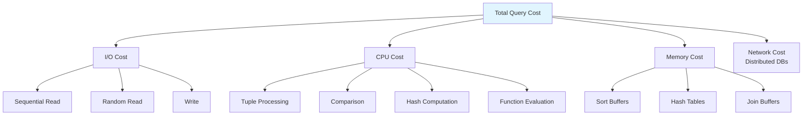
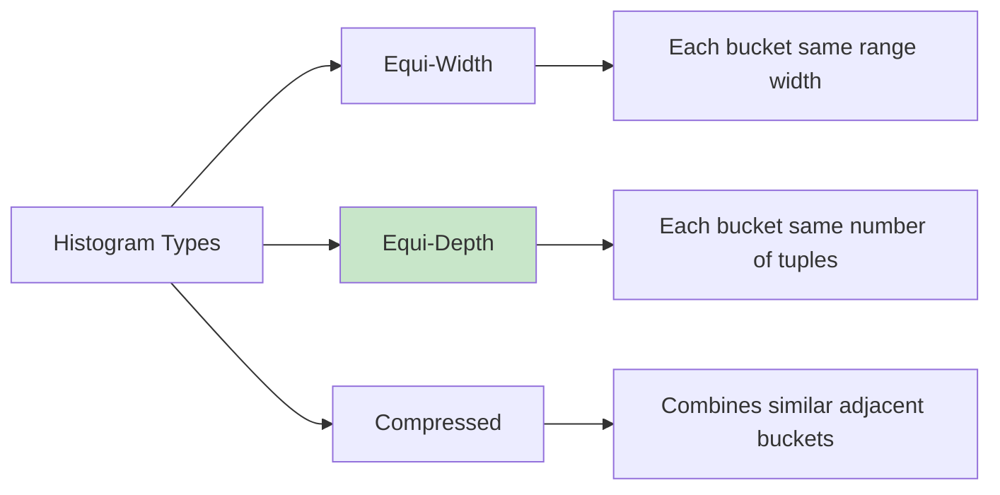

# Cost Estimation

## Overview

Cost Estimation is the process by which the query optimizer predicts the resource consumption (I/O, CPU, memory) of different execution plans. The optimizer uses **statistics** about the data — table sizes, column distributions, index characteristics — to estimate costs without actually executing the query. Accurate cost estimation is crucial; a misestimate of even 10x can lead to catastrophically bad plan choices.

## Detailed Explanation

### What is "Cost"?



**Typical cost units:**
```
I/O:
  - Sequential read:  1 unit per page
  - Random read:      4 units per page (includes seek time)
  - Write:            2 units per page (includes recovery overhead)

CPU:
  - Tuple processing: 0.01 units per tuple
  - Comparison:       0.01 units per comparison
  - Hash computation: 0.02 units per hash

Example:
  Reading 100 pages sequentially: 100 units
  Reading 100 pages randomly:     400 units
  Processing 10,000 tuples:       100 units
```

### Key Statistics

The optimizer maintains statistics about tables and columns, typically collected by `ANALYZE` or `UPDATE STATISTICS`:

#### Table-Level Statistics

| Statistic | Description | How Used |
|-----------|-------------|----------|
| **Cardinality (N)** | Number of tuples | Base estimate for result sizes |
| **Page count (P)** | Number of physical pages | I/O cost estimation |
| **Tuple width (W)** | Average bytes per tuple | Memory estimation |
| **Density** | Tuples per page | Page access estimation |

#### Column-Level Statistics

| Statistic | Description | How Used |
|-----------|-------------|----------|
| **NDV** (Number of Distinct Values) | Count of unique values | Selectivity estimation |
| **Histogram** | Distribution of values | Range predicate selectivity |
| **Min/Max** | Value range | Boundary estimation |
| **NULL count** | Number of NULLs | Excluding NULLs from estimates |
| **Most Common Values (MCV)** | Top-N frequent values | Skew handling |

### Histogram Types



**Equi-Width Histogram:**
```
Column: gpa (range 0.0 - 4.0, 4 buckets)
┌──────────┬────────┐
│  Bucket   │ Tuples │
├──────────┼────────┤
│ 0.0 - 1.0│  500   │
│ 1.0 - 2.0│ 2000   │
│ 2.0 - 3.0│ 5000   │
│ 3.0 - 4.0│ 2500   │
└──────────┴────────┘

Selectivity of gpa > 3.5:
  Assume uniform within bucket [3.0, 4.0]
  Fraction = (4.0 - 3.5) / (4.0 - 3.0) = 0.5
  Selectivity = 0.5 × 2500 / 10000 = 0.125 (12.5%)
```

**Equi-Depth (Equal-Height) Histogram:**
```
Column: gpa (10,000 tuples, 4 buckets of 2,500 each)
┌──────────┬──────────┬────────┐
│  Bucket   │ Range    │ Tuples │
├──────────┼──────────┼────────┤
│ Bucket 1  │ 0.0-1.8 │  2500  │
│ Bucket 2  │ 1.8-2.5 │  2500  │
│ Bucket 3  │ 2.5-3.2 │  2500  │
│ Bucket 4  │ 3.2-4.0 │  2500  │
└──────────┴──────────┴────────┘

Better for skewed data — each bucket has equal number of tuples
```

### Selectivity Estimation

**Selectivity** = fraction of tuples that satisfy a predicate (0 to 1).

#### Equality Predicate
```sql
WHERE column = value
```
```
Selectivity = 1 / NDV  (assuming uniform distribution)

If NDV = 100: selectivity = 0.01 (1%)
If value is in MCV list: use MCV frequency instead
```

#### Range Predicate
```sql
WHERE column > value
```
```
Using histogram: count tuples in buckets above value / total tuples
Using min/max: selectivity = (max - value) / (max - min)

If column range is [0, 100] and value = 75:
  selectivity = (100 - 75) / (100 - 0) = 0.25 (25%)
```

#### LIKE Predicate
```sql
WHERE column LIKE 'abc%'    -- Prefix match
WHERE column LIKE '%abc%'   -- Contains
WHERE column LIKE 'ab%cd'   -- Prefix + suffix
```
```
Prefix match (abc%): selectivity ≈ 1 / NDV (treat as equality on prefix)
Contains (%abc%):    selectivity ≈ 0.1 (rule of thumb, hard to estimate)
Wildcard prefix:     selectivity ≈ 0.1 - 0.3 (very hard to estimate)
```

#### AND / OR / NOT
```sql
WHERE cond1 AND cond2 AND cond3
```
```
AND: sel_combined = sel1 × sel2 × sel3  (assuming independence)
OR:  sel_combined = 1 - (1-sel1) × (1-sel2) × (1-sel3)
NOT: sel_combined = 1 - sel
```

**Independence assumption:** The optimizer assumes columns are independent unless there are multi-column statistics. This can be wildly wrong for correlated columns (e.g., city and zip_code).

### Join Output Size Estimation

```sql
SELECT * FROM R JOIN S ON R.A = S.B
```
```
|R ⨝ S| = |R| × |S| × 1 / max(NDV(A), NDV(B))

Example:
  R has 10,000 rows, NDV(A) = 100
  S has 50,000 rows, NDV(B) = 200

  |R ⨝ S| = 10,000 × 50,000 × 1/200 = 2,500,000
```

For multi-way joins, the optimizer chains the estimates:
```
|R ⨝ S ⨝ T| = |R ⨝ S| × |T| × 1 / max(NDV(S.key), NDV(T.key))
```

### I/O Cost Models

#### Sequential Scan
```
Cost = Number of pages (sequential read)
Total pages = ⌈N × tuple_size / page_size⌉

Example: 100,000 tuples × 100 bytes / 8,192 bytes per page = 1,221 pages
Cost = 1,221 units
```

#### Index Scan
```
Cost = Index height + (selectivity × table pages)

If index height = 3, selectivity = 0.01, table = 1,221 pages:
  Cost = 3 + (0.01 × 1,221) = 3 + 12.21 = 15.21 units
```

#### Index Only Scan
```
Cost = Index height + (selectivity × index leaf pages)

If index leaf pages = 200, selectivity = 0.01:
  Cost = 3 + (0.01 × 200) = 5 units
```

#### Hash Join
```
Simple: |R| + |S|  (if R fits in memory)
Grace:  3 × (|R| + |S|)  (partition + join)
```

#### Sort-Merge Join
```
If sorted: |R| + |S|
If not sorted: Sort(R) + Sort(S) + |R| + |S|
  Sort cost ≈ 2 × N × (number of passes)
```

### Example: Full Cost Estimation

```sql
SELECT s.name, c.course_name
FROM students s
JOIN enrollments e ON s.id = e.student_id
JOIN courses c ON e.course_id = c.id
WHERE s.gpa > 3.5 AND c.dept = 'CS';
```

**Statistics:**
```
students:    10,000 rows, 100 pages, NDV(gpa)=40, NDV(dept)=10
enrollments: 100,000 rows, 500 pages, NDV(student_id)=10,000, NDV(course_id)=500
courses:     500 rows, 5 pages, NDV(dept)=10
```

**Step 1: Estimate selectivities**
```
σ(gpa > 3.5):     selectivity ≈ 0.125 (12.5%)
σ(dept = 'CS'):   selectivity = 1/10 = 0.1 (10%)
```

**Step 2: Estimate intermediate sizes**
```
Filtered students: 10,000 × 0.125 = 1,250 rows
Filtered courses:  500 × 0.1 = 50 rows
```

**Step 3: Estimate join sizes**
```
students ⨝ enrollments: 1,250 × 100,000 × 1/10,000 = 12,500 rows
(students ⨝ enrollments) ⨝ courses: 12,500 × 500 × 1/500 = 12,500 rows
```

**Step 4: Estimate costs for different plans**

| Plan | Cost Estimation |
|------|----------------|
| (s ⨝ e) ⨝ c, hash join | Scan s (100) + filter + build hash (1250 rows) + scan e (500) + probe + scan c (5) + hash join ≈ 725 |
| (c ⨝ e) ⨝ s, hash join | Scan c (5) + filter + build hash (50 rows) + scan e (500) + probe + scan s (100) + hash join ≈ 610 |
| s ⨝ (e ⨝ c), hash join | Scan c (5) + filter + build hash (50) + scan e (500) + probe + scan s (100) + hash join ≈ 610 |

**Optimizer picks:** (c ⨝ e) ⨝ s — smallest intermediate result first.

## Interview Questions

### Q1: What statistics does the optimizer use and why?
**Answer:** The optimizer uses:
- **Table cardinality** — to estimate how many rows a scan returns
- **NDV (Number of Distinct Values)** — to estimate selectivity of equality predicates and join output sizes
- **Histograms** — to estimate selectivity of range predicates
- **Page count** — to estimate I/O cost of scans
- **Index height and leaf pages** — to estimate index access cost

Without these statistics, the optimizer would have to guess, leading to terrible plan choices.

### Q2: What is the independence assumption and when does it fail?
**Answer:** The independence assumption states that the selectivity of a combined predicate is the product of individual selectivities (for AND). For example, `WHERE city='NYC' AND state='NY'` assumes these are independent. This fails when columns are **correlated** — almost everyone in NYC is in NY, so the combined selectivity is much higher than the product. Multi-column statistics or extended statistics can help.

### Q3: Why might the optimizer choose a bad plan?
**Answer:**
1. **Stale statistics** — Data changed significantly since last ANALYZE
2. **Correlated columns** — Independence assumption gives wrong estimates
3. **Parameter sniffing** — Plan optimized for an atypical parameter value
4. **Histogram granularity** — Too few buckets to capture data distribution
5. **Cost model limitations** — Doesn't account for buffer cache hits, SSD vs HDD

### Q4: How do you fix a bad query plan?
**Answer:**
1. **Run ANALYZE** — Update statistics
2. **Use query hints** — Force specific join order or algorithm (e.g., `/*+ HASH_JOIN(s e) */`)
3. **Rewrite the query** — Make it easier for the optimizer
4. **Create indexes** — Give the optimizer better access paths
5. **Adjust configuration** — Increase work_mem, change random_page_cost
6. **Use plan guides** — Pin specific plans for critical queries

### Q5: What is the difference between estimated and actual rows in EXPLAIN ANALYZE?
**Answer:** `EXPLAIN` shows **estimated** rows (based on statistics). `EXPLAIN ANALYZE` actually executes the query and shows **actual** rows. A large discrepancy between estimated and actual indicates bad statistics or correlated columns. For example:
```
Seq Scan on students  (cost=0.00..100.00 rows=1000)  ← estimated
  Actual rows=50  ← actual (20x overestimate!)
```

## Common Mistakes

- ❌ **Never running ANALYZE** — Statistics go stale as data changes
- ❌ **Assuming uniform distribution** — Real data is often skewed
- ❌ **Ignoring the independence assumption** — Correlated columns cause misestimates
- ❌ **Not checking EXPLAIN ANALYZE** — Always verify estimated vs. actual rows
- ❌ **Over-relying on hints** — Hints are a band-aid; fix statistics first

## Summary

| Component | Purpose | Key Insight |
|-----------|---------|-------------|
| **Statistics** | Describe data distribution | Must be kept up-to-date |
| **Selectivity** | Fraction of rows matching a predicate | Drives all size estimates |
| **Cost model** | Predicts I/O, CPU, memory usage | I/O typically dominates |
| **Histograms** | Capture value distribution | Equi-depth best for skewed data |
| **NDV** | Count of distinct values | Critical for join estimation |

Cost estimation is the foundation of query optimization. Without accurate estimates, even the best optimization algorithm will choose bad plans.

## Cross-References

- [Query Optimization](./optimization.md) — how cost estimates drive plan selection
- [Execution Plans](./execution-plans.md) — reading the optimizer's output
- [Buffer Management](../storage/buffer-management.md) — how caching affects I/O cost
- [Indexing](../indexing/) — how indexes affect access path costs


## Cross References

- [Execution Plans](execution-plans.md)
- [Query Optimization](optimization.md)
- [Buffer Pool](../caching/buffer-pool.md)
