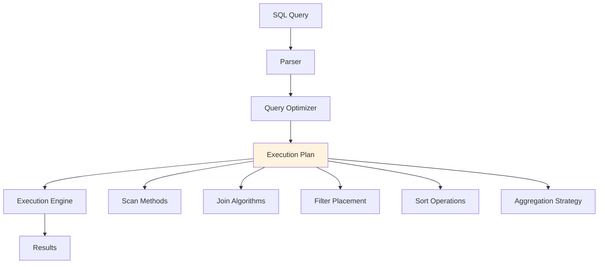
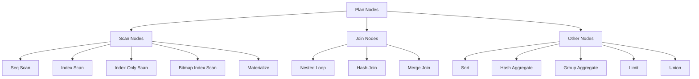
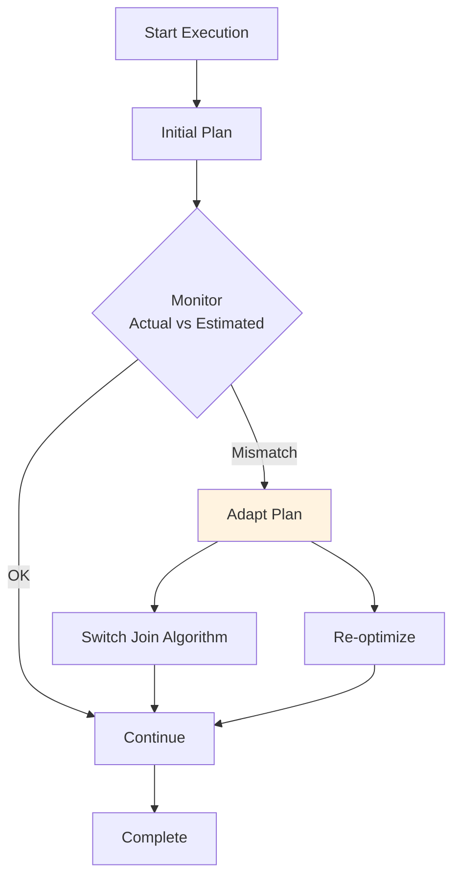

# Execution Plans

## Overview

An Execution Plan (also called a query plan) is the detailed strategy the DBMS uses to execute a SQL query. It specifies the exact sequence of operations — which tables to scan, which indexes to use, what join algorithms to apply, and in what order. Understanding execution plans is the most practical skill for database performance tuning, as it reveals exactly how the database processes your queries.

## Detailed Explanation

### What is an Execution Plan?



### Reading EXPLAIN Output

Different databases have different EXPLAIN syntax, but the concepts are universal.

#### PostgreSQL EXPLAIN

```sql
EXPLAIN ANALYZE
SELECT s.name, g.grade
FROM students s
JOIN grades g ON s.id = g.student_id
WHERE s.gpa > 3.5;
```

**Output:**
```
Hash Join  (cost=1.15..3.50 rows=50 width=20) (actual time=0.05..0.12 rows=48 loops=1)
  Hash Cond: (g.student_id = s.id)
  ->  Seq Scan on grades g  (cost=0.00..1.80 rows=80 width=8)
        (actual time=0.01..0.03 rows=80 loops=1)
  ->  Hash  (cost=1.08..1.08 rows=6 width=16)
        (actual time=0.04..0.04 rows=6 loops=1)
        Buckets: 1024  Batches: 1  Memory Usage: 9kB
        ->  Seq Scan on students s  (cost=0.00..1.08 rows=6 width=16)
              (actual time=0.01..0.02 rows=6 loops=1)
              Filter: (gpa > 3.5)
              Rows Removed by Filter: 4
Planning Time: 0.15 ms
Execution Time: 0.18 ms
```

**Key columns explained:**

| Column | Meaning |
|--------|---------|
| **cost** | Estimated startup cost..total cost (in arbitrary units) |
| **rows** | Estimated number of rows |
| **width** | Estimated average row width in bytes |
| **actual time** | Actual time in ms (startup..total) |
| **actual rows** | Actual rows processed |
| **loops** | Number of times this node was executed |

#### MySQL EXPLAIN

```sql
EXPLAIN FORMAT=JSON
SELECT s.name, g.grade
FROM students s
JOIN grades g ON s.id = g.student_id
WHERE s.gpa > 3.5;
```

#### Oracle EXPLAIN PLAN

```sql
EXPLAIN PLAN FOR
SELECT s.name, g.grade
FROM students s
JOIN grades g ON s.id = g.student_id
WHERE s.gpa > 3.5;

SELECT * FROM TABLE(DBMS_XPLAN.DISPLAY);
```

### Common Plan Node Types



#### Scan Nodes

| Node | Description | When Used |
|------|-------------|-----------|
| **Seq Scan** | Read every page of the table | No useful index, large portion of table |
| **Index Scan** | Use index to find rows, then fetch from table | Selective predicate on indexed column |
| **Index Only Scan** | Read only from index (covers query) | All needed columns in index |
| **Bitmap Index Scan** | Build bitmap of matching rows from index | Multiple index conditions (AND/OR) |
| **Bitmap Heap Scan** | Fetch rows using bitmap | Follows Bitmap Index Scan |

#### Join Nodes

| Node | Description | Algorithm |
|------|-------------|-----------|
| **Nested Loop** | For each outer row, scan inner | O(N×M) or O(N) with index |
| **Hash Join** | Build hash table, probe with other | O(N+M) |
| **Merge Join** | Sort both, merge | O(N log N + M log M) |

#### Other Nodes

| Node | Description |
|------|-------------|
| **Sort** | Sort rows by specified columns |
| **Hash Aggregate** | Compute GROUP BY using hash table |
| **Group Aggregate** | Compute GROUP BY on sorted input |
| **Limit** | Return only first N rows |
| **Materialize** | Store intermediate results |
| **CTE Scan** | Read from Common Table Expression |
| **Subquery Scan** | Execute a subquery |

### Plan Tree Structure

Execution plans are trees where:
- **Leaf nodes** are scans (accessing base tables)
- **Internal nodes** are joins, sorts, aggregations
- **Root node** produces the final output
- Data flows **upward** (bottom-up execution)

```
For: SELECT name FROM students WHERE gpa > 3.5 ORDER BY name

Plan Tree:
         Limit (if TOP N)
            ↓
         Sort (ORDER BY name)
            ↓
         Seq Scan (students, Filter: gpa > 3.5)
```

### EXPLAIN ANALYZE vs EXPLAIN

| Feature | EXPLAIN | EXPLAIN ANALYZE |
|---------|---------|-----------------|
| **Executes query?** | No | Yes |
| **Shows estimates?** | Yes | Yes |
| **Shows actuals?** | No | Yes |
| **Shows timing?** | No | Yes |
| **Shows rows removed by filter?** | No | Yes |
| **Safe for DML?** | Yes | **NO** (INSERT/UPDATE/DELETE execute!) |

**Warning:** `EXPLAIN ANALYZE` on INSERT/UPDATE/DELETE **actually modifies data**. Use `EXPLAIN` (without ANALYZE) or wrap in a transaction with ROLLBACK.

### Plan Caching

Most databases cache execution plans for prepared statements:

```sql
-- Plan is compiled once
PREPARE stmt AS SELECT * FROM students WHERE gpa > $1;

-- Plan is reused for different parameter values
EXECUTE stmt(3.5);
EXECUTE stmt(2.0);
```

**Benefits:**
- Avoids re-parsing and re-optimizing
- Reduces planning time

**Risks:**
- **Parameter sniffing** — Plan optimized for first parameter may be bad for others
- **Plan staleness** — Cached plan may be suboptimal after data changes

### Adaptive Query Processing

Modern databases can adjust plans during execution:



**Examples:**
- **SQL Server Adaptive Joins**: Can switch between hash join and nested loop mid-execution
- **Oracle Adaptive Plans**: Re-optimizes if estimates are way off
- **PostgreSQL**: Limited adaptive capabilities (mostly through GEQO for many-way joins)

### Reading a Complex Plan

```sql
SELECT d.dept_name, COUNT(*) as student_count, AVG(s.gpa) as avg_gpa
FROM students s
JOIN departments d ON s.dept_id = d.id
WHERE s.gpa > 3.0
GROUP BY d.dept_name
HAVING COUNT(*) > 10
ORDER BY avg_gpa DESC
LIMIT 5;
```

```
Limit  (cost=15.20..15.21 rows=5 width=24)
  ->  Sort  (cost=15.20..15.21 rows=8 width=24)
        Sort Key: (avg(s.gpa)) DESC
        ->  HashAggregate  (cost=15.02..15.10 rows=8 width=24)
              Group Key: d.dept_name
              Filter: (count(*) > 10)
              ->  Hash Join  (cost=1.10..14.80 rows=100 width=20)
                    Hash Cond: (s.dept_id = d.id)
                    ->  Seq Scan on students s  (cost=0.00..12.50 rows=100 width=12)
                          Filter: (gpa > 3.0)
                    ->  Hash  (cost=1.05..1.05 rows=5 width=12)
                          ->  Seq Scan on departments d  (cost=0.00..1.05 rows=5 width=12)
```

**Reading bottom-up:**
1. Scan `students` with filter `gpa > 3.0` → 100 rows
2. Scan `departments` → 5 rows, build hash table
3. Hash join on `dept_id` → 100 rows
4. Hash aggregate by `dept_name`, compute count and avg, filter `count > 10` → 8 rows
5. Sort by `avg_gpa DESC` → 8 rows
6. Limit to 5 rows → final output

### Identifying Performance Problems

| Problem | What to Look For | Fix |
|---------|-----------------|-----|
| **Seq Scan on large table** | High row count, no index used | Add index on filtered column |
| **Nested loop without index** | High cost, many loops | Add index on inner join column |
| **Sort on large dataset** | High memory/disk usage | Add index matching ORDER BY |
| **Bad row estimates** | Estimated vs actual rows differ greatly | Run ANALYZE |
| **Hash join spilling to disk** | "Batches: > 1" in hash node | Increase work_mem |
| **Unnecessary materialization** | Materialize node in plan | Rewrite query |

### Plan Visualization Tools

| Tool | Database | Features |
|------|----------|----------|
| **pgAdmin** | PostgreSQL | Visual plan tree |
| **EXPLAIN.visual** | PostgreSQL | Online visualizer |
| **MySQL Workbench** | MySQL | Visual EXPLAIN |
| **Oracle SQL Developer** | Oracle | Plan comparison |
| **DataGrip** | Multi-DB | Visual plans |

## Interview Questions

### Q1: How do you read an EXPLAIN output?
**Answer:** Read the plan **bottom-up** (leaf to root):
1. Start with the leaf nodes — these access base tables (scans)
2. Move up through joins — see which algorithm is used
3. Look for sorts and aggregations
4. Check the root for limit/projection
5. Compare estimated vs. actual rows (in EXPLAIN ANALYZE)
6. Look for high-cost nodes — these are the bottlenecks

Key things to watch: Seq Scan on large tables (missing index), high cost nodes, large row estimate errors.

### Q2: What is parameter sniffing and how do you fix it?
**Answer:** Parameter sniffing occurs when a cached plan is optimized for the first parameter value and reused for all subsequent values. If the first call uses a rare value (e.g., `status='archived'` with 0.01% selectivity), the plan might use an index scan. Later calls with common values (e.g., `status='active'` with 90% selectivity) would be better served by a table scan, but the cached plan still uses the index.

**Fixes:**
1. **OPTION (RECOMPILE)** in SQL Server — don't cache the plan
2. **OPTIMIZE FOR UNKNOWN** — use average statistics instead of specific values
3. **Plan guides** — force a specific plan
4. **Use local variables** — prevents sniffing in some systems

### Q3: What's the difference between EXPLAIN and EXPLAIN ANALYZE?
**Answer:**
- `EXPLAIN` shows the **optimizer's estimated plan** without executing the query. Fast, safe, no side effects.
- `EXPLAIN ANALYZE` actually **executes the query** and shows both estimates and actual runtime statistics (actual rows, actual time, loops). This reveals estimate errors but has side effects for DML statements.

Use `EXPLAIN` first for a quick check. Use `EXPLAIN ANALYZE` when you need to verify estimates or diagnose actual performance.

### Q4: How do you identify a missing index from an execution plan?
**Answer:** Look for:
1. **Seq Scan on a large table** with a filter — the filter column needs an index
2. **Nested Loop with Seq Scan inner** — the inner table's join column needs an index
3. **Sort after a scan** — an index matching the ORDER BY could eliminate the sort
4. **Bitmap Heap Scan with many rows** — a covering index could enable Index Only Scan

Example:
```
Seq Scan on orders  (cost=0.00..50000.00 rows=100 width=20)
  Filter: (customer_id = 12345)
```
→ Create index: `CREATE INDEX idx_orders_customer ON orders(customer_id);`

### Q5: What is a covering index and how does it affect plans?
**Answer:** A covering index includes all columns needed by the query, allowing **Index Only Scan** (no table access). This eliminates the random I/O of fetching rows from the heap.

```sql
-- Query needs: customer_id, order_date, amount
CREATE INDEX idx_covering ON orders(customer_id, order_date, amount);

-- Plan changes from:
Index Scan on orders → (index lookup + table fetch)
-- To:
Index Only Scan on idx_covering → (only index access)
```

This can be 10x faster for selective queries.

## Common Mistakes

- ❌ **Only looking at the plan, not the actuals** — EXPLAIN ANALYZE reveals estimate errors
- ❌ **Running EXPLAIN ANALYZE on DML without ROLLBACK** — It actually modifies data!
- ❌ **Ignoring the cost unit** — PostgreSQL costs are in arbitrary units, not milliseconds
- ❌ **Not understanding bottom-up reading** — Data flows from leaves to root
- ❌ **Jumping to hints before checking statistics** — Fix ANALYZE first, then consider hints

## Summary

| Concept | Key Point |
|---------|-----------|
| **Execution plan** | The optimizer's chosen strategy for executing a query |
| **EXPLAIN** | Shows estimated plan without executing |
| **EXPLAIN ANALYZE** | Executes and shows actual vs. estimated |
| **Plan tree** | Bottom-up execution: scans → joins → sorts → output |
| **Bottleneck** | Highest cost node in the plan |
| **Parameter sniffing** | Cached plan optimized for wrong parameter |

Reading execution plans is an essential skill for database developers and DBAs. It transforms performance tuning from guesswork into a science.

## Cross-References

- [Query Optimization](./optimization.md) — how plans are chosen
- [Cost Estimation](./cost-estimation.md) — how plan costs are calculated
- [Join Algorithms](./joins.md) — the algorithms in plan nodes
- [Indexing](../indexing/) — how indexes affect plan choices
- [Buffer Management](../storage/buffer-management.md) — how caching affects plan performance


## Cross References

- [Query Optimization](../dbms/query-processing/optimization.md)
- [Cost Estimation](../dbms/query-processing/cost-estimation.md)
- [Join Algorithms](../dbms/query-processing/joins.md)
