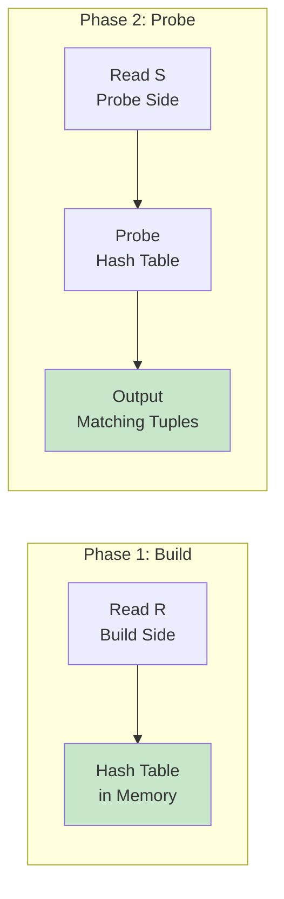
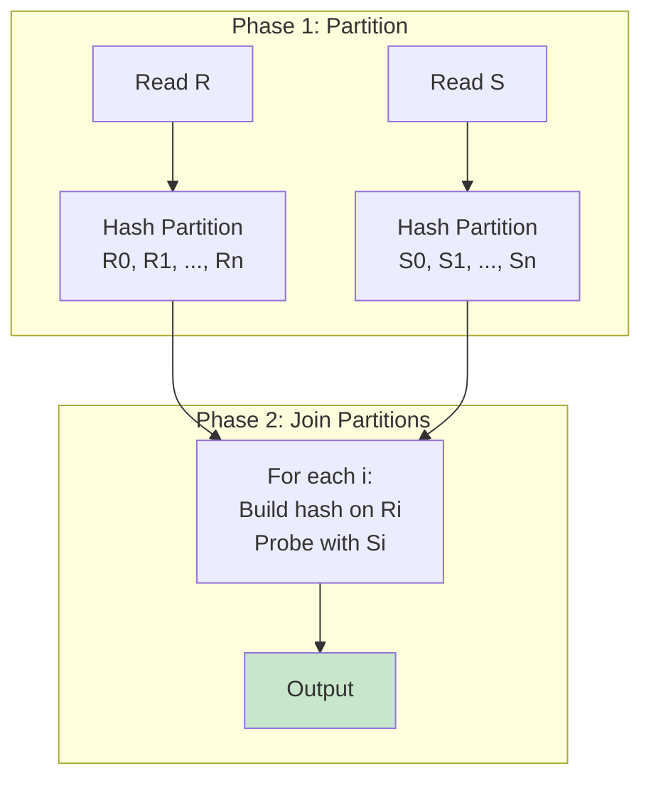

# Hash Join

## Overview

Hash Join is the most efficient join algorithm for **equi-joins** when one of the relations (or a partition of it) fits in memory. It works by building a hash table on the join key of one relation (the build side) and then probing it with tuples from the other relation (the probe side). Hash join has linear time complexity O(N+M) under ideal conditions, making it the go-to choice for joining large tables.

## Detailed Explanation

### Basic Hash Join Algorithm



**Algorithm:**
```python
# Phase 1: BUILD — construct hash table on smaller relation
hash_table = {}
for each tuple r in R:  # R is the smaller relation (build side)
    key = hash(r.join_key)
    hash_table[key].append(r)

# Phase 2: PROBE — scan larger relation and look up matches
for each tuple s in S:  # S is the larger relation (probe side)
    key = hash(s.join_key)
    for each r in hash_table[key]:  # Check for actual match (handle collisions)
        if r.join_key == s.join_key:
            emit (r, s)
```

**Cost Analysis:**
```
I/O Cost: |R| + |S|  (read both relations once)
CPU Cost: |R| × hash_cost + |S| × (hash_cost + comparison_cost)

Example:
  R = 10,000 tuples, 100 pages
  S = 100,000 tuples, 1,000 pages

  I/O Cost = 100 + 1,000 = 1,100 page reads
  (vs. 100 + 10,000×1,000 = 10,000,100 for simple nested loop!)
```

### Hash Table Structure

The hash table stores tuples organized by hash bucket:

```
Hash Table (for R.student_id):
┌─────────┬───────────────────────┐
│ Bucket 0 │ (1, Alice)           │
│          │ (101, Dave)          │
├─────────┼───────────────────────┤
│ Bucket 1 │ (2, Bob)             │
├─────────┼───────────────────────┤
│ Bucket 2 │ (3, Charlie)         │
│          │ (103, Eve)           │
│          │ (203, Frank)         │
├─────────┼───────────────────────┤
│ ...      │ ...                  │
└─────────┴───────────────────────┘
```

### Handling Duplicates and Collisions

**Hash collisions** (different keys hashing to the same bucket):
- Each bucket contains a **chain** of tuples
- During probing, all tuples in the bucket must be checked with actual comparison
- Good hash functions minimize collisions

**Duplicate keys** (multiple tuples with same join key):
- All matching tuples stored in the same bucket
- During probe, all are returned (producing the correct cross-product)

### Grace Hash Join (Partition-Based)

When the build relation doesn't fit in memory, use **Grace Hash Join** — partition both relations into smaller pieces that do fit.



**Algorithm:**
```python
# Phase 1: PARTITION — hash both relations to disk partitions
num_partitions = ceil(|R| / buffer_pages)  # Each partition fits in memory
for each tuple r in R:
    partition = hash(r.join_key) % num_partitions
    write r to partition file R[partition]

for each tuple s in S:
    partition = hash(s.join_key) % num_partitions
    write s to partition file S[partition]

# Phase 2: JOIN — for each partition, do in-memory hash join
for i in 0..num_partitions:
    build hash table on R[i] in memory
    for each tuple s in S[i]:
        probe hash table and emit matches
```

**Cost Analysis:**
```
Partition Phase: 2 × (|R| + |S|)  — read and write both relations
Join Phase: |R| + |S|  — read both relations again
Total: 3 × (|R| + |S|)

Example:
  R = 100 pages, S = 1,000 pages, 10 buffer pages
  
  Partitions: ceil(100/8) = 13 partitions (8 pages each, leaving 2 for I/O)
  Each partition: R ~8 pages, S ~77 pages
  Total I/O: 3 × (100 + 1,000) = 3,300 page reads
```

### Hybrid Hash Join

An optimization of Grace Hash Join that keeps the first partition in memory (avoiding writing it to disk):

```
Instead of writing R[0] and S[0] to disk:
  - Keep R[0] in memory as the hash table
  - Stream S[0] through memory for probing
  - Only write R[1..n] and S[1..n] to disk

Savings: One partition's worth of I/O (both read and write)
```

**When to use:** When memory is slightly too small for simple hash join but large enough to hold one partition.

### Hash Join for Non-Equi Joins

**Hash join cannot handle non-equi joins** because:
- Hashing requires a specific key value
- `R.a < S.b` cannot be checked via hash table lookup
- You'd need to check every bucket, which defeats the purpose

For non-equi joins, use nested loop or sort-merge join.

### Hash Join with Skewed Data

Data skew (some key values appear much more frequently than others) can cause problems:

```
Normal distribution:
  Bucket 0: 100 tuples
  Bucket 1: 95 tuples
  Bucket 2: 105 tuples
  ... (evenly distributed)

Skewed distribution:
  Bucket 0: 10,000 tuples  ← Hot key!
  Bucket 1: 50 tuples
  Bucket 2: 48 tuples
  ... (one bucket is huge)
```

**Mitigations:**
1. **Partitioned hash join** — more partitions reduce the impact
2. **Hybrid approach** — if a partition is too large, fall back to nested loop for that partition
3. **Adaptive partitioning** — detect skew during build phase and re-partition

### Memory Requirements

```
Hash Table Memory:
  - Number of buckets: typically 2× the number of tuples
  - Each bucket: pointer to chain of tuples
  - Each tuple: full row data (or just join key + row ID)
  
  Memory needed ≈ |R| × (tuple_size + pointer_size) × 1.5 (for hash table overhead)
  
  Example:
    R = 10,000 tuples, each 100 bytes
    Memory ≈ 10,000 × 120 bytes = 1.2 MB
    (Easily fits in modern buffer pools)
```

### Example: Hash Join in PostgreSQL

```sql
EXPLAIN ANALYZE
SELECT s.name, g.grade
FROM students s
JOIN grades g ON s.id = g.student_id;

-- Output:
-- Hash Join  (cost=1.15..3.20 rows=100 width=20)
--   Hash Cond: (g.student_id = s.id)
--   ->  Seq Scan on grades g  (cost=0.00..1.50 rows=50 width=8)
--   ->  Hash  (cost=1.05..1.05 rows=10 width=16)
--         ->  Seq Scan on students s  (cost=0.00..1.05 rows=10 width=16)
```

The plan shows:
1. Scan `students` and build hash table (Hash node)
2. Scan `grades` and probe hash table (Hash Join node)

## Interview Questions

### Q1: What is the time complexity of hash join?
**Answer:** Hash join has **O(N + M)** time complexity, where N and M are the sizes of the two relations. This is because:
- Build phase: O(N) to read and hash all tuples of the build relation
- Probe phase: O(M) to read and probe with all tuples of the probe relation
- Each hash table lookup is O(1) on average (assuming good hash function)

This is much better than nested loop's O(N × M). However, hash join requires O(N) memory for the hash table.

### Q2: What happens if the build relation doesn't fit in memory?
**Answer:** Use **Grace Hash Join**:
1. Partition both relations into smaller chunks using a hash function
2. Write partitions to disk
3. For each partition pair, perform an in-memory hash join

The cost increases to 3 × (|R| + |S|) due to the extra read/write for partitioning. If partitions still don't fit, recursively partition further.

### Q3: Why is the smaller relation chosen as the build side?
**Answer:** The build side determines the hash table size. Choosing the smaller relation:
1. Minimizes memory usage (hash table fits in buffer pool)
2. Reduces build time (fewer tuples to hash)
3. Reduces the chance of needing to spill to disk

If R has 10K tuples and S has 1M tuples, building on R requires ~1.2MB vs ~120MB for S.

### Q4: Can hash join handle NULL values?
**Answer:** Yes, but with care. NULLs don't match in SQL (`NULL = NULL` is false). The hash function must handle NULLs — typically by putting all NULLs in a special bucket that's never considered a match during probing. This ensures `NULL ≠ NULL` semantics are preserved.

### Q5: What is the difference between Grace Hash Join and Hybrid Hash Join?
**Answer:** 
- **Grace Hash Join**: Partitions both relations completely to disk, then joins each partition pair in memory
- **Hybrid Hash Join**: Keeps the first partition in memory during the partitioning phase, avoiding one round of disk I/O for that partition

Hybrid Hash Join is strictly better when there's enough memory to hold at least one partition, as it saves I/O. Grace Hash Join is the fallback when memory is very tight.

## Common Mistakes

- ❌ **Using hash join for non-equi conditions** — Hash join only works for `=` comparisons
- ❌ **Not considering data skew** — Skewed keys can cause one partition to be huge
- ❌ **Forgetting the memory requirement** — Hash table must fit in memory for simple hash join
- ❌ **Assuming hash join is always faster than sort-merge** — For pre-sorted data, sort-merge avoids the hashing overhead
- ❌ **Not accounting for hash function quality** — Poor hash functions cause collisions and degrade performance

## Summary

| Variant | I/O Cost | Memory | When to Use |
|---------|----------|--------|-------------|
| **Simple Hash Join** | \|R\| + \|S\| | O(\|R\|) | Build side fits in memory |
| **Grace Hash Join** | 3 × (\|R\| + \|S\|) | O(\|R\|/N) per partition | Build side too large for memory |
| **Hybrid Hash Join** | < 3 × (\|R\| + \|S\|) | O(\|R\|/N + first partition) | Memory slightly too small |

Hash join is the workhorse of modern database systems for equi-joins. Understanding when and how it works is essential for query performance tuning.

## Cross-References

- [Nested Loop Join](./nested-loop.md) — the alternative for small/indexed joins
- [Sort-Merge Join](./sort-merge.md) — the alternative for sorted data
- [Join Algorithms Overview](./joins.md) — comparison of all join types
- [Buffer Management](../storage/buffer-management.md) — how memory is managed during hash join
- [Cost Estimation](./cost-estimation.md) — how hash join cost is estimated


## Cross References

- [Nested Loop](../dbms/query-processing/nested-loop.md)
- [Sort Merge](../dbms/query-processing/sort-merge.md)
- [Hash Index](../dbms/indexing/hash-index.md)
- [Cache Hierarchy](../arch/memory-hierarchy/README.md)
