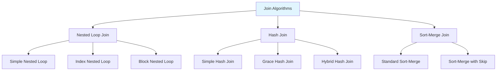
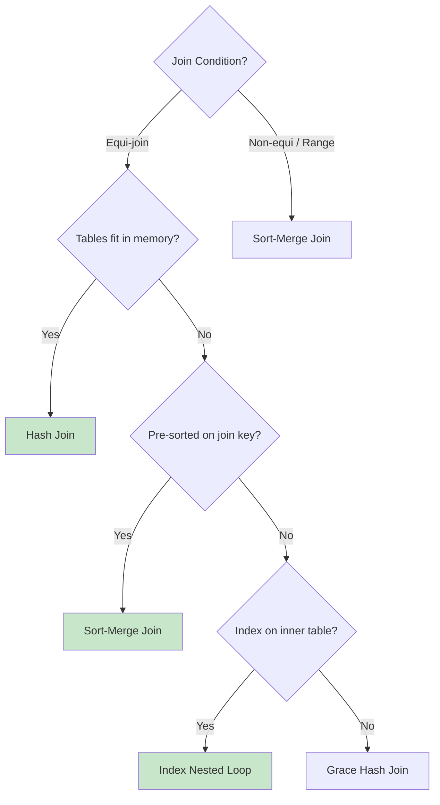
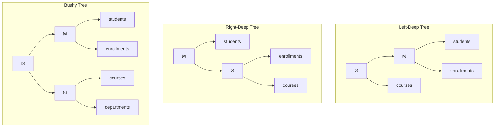

# Join Algorithms Overview

## Overview

Joins are the most expensive and most important operation in relational query processing. A join combines rows from two or more tables based on a related column. The choice of join algorithm can mean the difference between milliseconds and hours of execution time.

Every DBMS implements multiple join algorithms. The query optimizer selects the best one based on table sizes, available indexes, memory, and the type of join condition.

## Detailed Explanation

### What is a Join?

```sql
SELECT s.name, g.grade
FROM students s
JOIN grades g ON s.id = g.student_id;
```

A join takes two **inputs** (called **relations** or **build/probe sides**) and produces an output of combined rows that satisfy the join condition.

### The Three Fundamental Join Algorithms



### Comparison at a Glance

| Algorithm | Time Complexity | Best Case | Worst Case | Memory | Join Type |
|-----------|----------------|-----------|------------|--------|-----------|
| **Nested Loop** | O(N × M) | O(N) (indexed) | O(N × M) | O(1) | Any |
| **Hash Join** | O(N + M) | O(N + M) | O(N × M) (skew) | O(min(N,M)) | Equi-join only |
| **Sort-Merge** | O(N log N + M log M) | O(N + M) (pre-sorted) | O(N log N + M log M) | O(N + M) | Equi + range |

### When to Use Each



### Join Terminology

| Term | Meaning |
|------|---------|
| **Outer relation** | The relation iterated over (outer loop) |
| **Inner relation** | The relation scanned for each outer tuple |
| **Build side** | The relation used to build a hash table (hash join) |
| **Probe side** | The relation used to probe the hash table |
| **Equi-join** | Join condition uses only `=` |
| **Non-equi join** | Join uses `<`, `>`, `BETWEEN`, etc. |
| **Semi-join** | Returns only rows from left that have a match (no duplicates) |
| **Anti-join** | Returns only rows from left that have NO match |
| **Self-join** | A table joined with itself |
| **Theta join** | Join with any arbitrary condition |

### Join Selectivity

The optimizer needs to estimate how many rows a join will produce:

```
|R ⨝_cond S| = |R| × |S| × selectivity(condition)

For equi-join R.A = S.B:
  selectivity ≈ 1 / max(NDV(A), NDV(B))

Example:
  R has 10,000 rows, NDV(A) = 100
  S has 50,000 rows, NDV(B) = 200
  
  Estimated output = 10,000 × 50,000 × (1/200) = 2,500,000 rows
```

### Index Nested Loop vs. Hash Join vs. Sort-Merge

**Scenario:** Join `students` (10K rows) with `enrollments` (100K rows) on `student_id`.

| Approach | Steps | Estimated I/O |
|----------|-------|---------------|
| **Index NL** (index on enrollments.student_id) | For each student: 1 index lookup + 1-2 page reads | 10K × 2 = 20K |
| **Hash Join** (build on students) | Read students (50 pages), build hash, read enrollments (500 pages), probe | 550 pages |
| **Sort-Merge** | Sort students (50 × log50), sort enrollments (500 × log500), merge | ~5000 pages |

**Winner:** Index Nested Loop (if index exists and outer table is small)

### Multi-way Joins

Real queries often join many tables. The optimizer must decide:
1. **Join order** — which tables to join first
2. **Join algorithm** — for each pair
3. **Tree shape** — left-deep, right-deep, or bushy



**Left-deep trees** are preferred because they allow pipelining (output of one join feeds directly into the next without materializing).

## Interview Questions

### Q1: When would you use each join algorithm?
**Answer:**
- **Nested Loop**: Small outer table with index on inner table's join column; or when no equi-join condition exists
- **Hash Join**: Large tables with equi-join condition; one table fits in memory
- **Sort-Merge**: Tables already sorted on join key; or non-equi-join conditions (range joins)

### Q2: Why can't hash join handle non-equi joins?
**Answer:** Hash join works by hashing the join key and looking up matching keys via hash table bucket. Hashing requires equality — you can't hash a "less than" or "range" condition. For `R.a < S.b`, there's no single bucket to probe; you'd need to check every bucket, defeating the purpose. Sort-merge handles this naturally since sorted data allows range comparisons during the merge phase.

### Q3: What is the build side and probe side in a hash join?
**Answer:** The **build side** is the smaller relation, which is read first and used to construct the hash table in memory. The **probe side** is the larger relation, which is then read one tuple at a time, and each tuple's join key is used to look up (probe) the hash table for matches. Choosing the smaller relation as the build side minimizes memory usage.

### Q4: What is a semi-join and when is it useful?
**Answer:** A semi-join returns rows from the left table that have at least one match in the right table, without duplicating left rows. It's used for `EXISTS` and `IN` subqueries:
```sql
-- Semi-join equivalent
SELECT * FROM students WHERE id IN (SELECT student_id FROM enrollments);
```
The optimizer converts this to a semi-join, which can be executed more efficiently than a full join since it can stop scanning the right table after finding the first match.

### Q5: Why are left-deep join trees preferred over bushy trees?
**Answer:** Left-deep trees allow **pipelining** — the output of one join can be streamed directly into the next join without writing intermediate results to disk. In a bushy tree, both inputs to the root join must be fully materialized (since they come from independent sub-plans), requiring extra memory or disk I/O. Left-deep trees also simplify the executor's implementation.

## Common Mistakes

- ❌ **Assuming hash join is always fastest** — It only works for equi-joins and requires memory for the hash table
- ❌ **Ignoring the impact of join order** — The difference between best and worst join orders can be orders of magnitude
- ❌ **Confusing join condition with filter condition** — `ON` specifies the join; `WHERE` filters results after the join
- ❌ **Not considering semi-joins for EXISTS/IN** — The optimizer may or may not convert subqueries to semi-joins
- ❌ **Assuming the optimizer always picks the right algorithm** — With bad statistics, it may choose nested loop when hash join would be better

## Summary

| Algorithm | Time | Memory | Join Types | Best Use Case |
|-----------|------|--------|------------|---------------|
| Nested Loop | O(N×M) | O(1) | Any | Small inner table with index |
| Hash Join | O(N+M) | O(min(N,M)) | Equi-join | Large equi-joins |
| Sort-Merge | O(N log N + M log M) | O(N+M) | Any | Pre-sorted data, range joins |

Join algorithms are fundamental to database performance. Understanding them deeply is essential for both query tuning and system design interviews.

## Cross-References

- [Nested Loop Join](./nested-loop.md) — detailed nested loop algorithms
- [Hash Join](./hash-join.md) — hash join variants
- [Sort-Merge Join](./sort-merge.md) — sort-merge details
- [Query Optimization](./optimization.md) — how the optimizer selects join algorithms
- [Cost Estimation](./cost-estimation.md) — how join costs are estimated
- [Buffer Management](../storage/buffer-management.md) — memory management for joins


## Cross References

- [Nested Loop](nested-loop.md)
- [Hash Join](hash-join.md)
- [Sort Merge](sort-merge.md)
- [Query Optimization](optimization.md)
